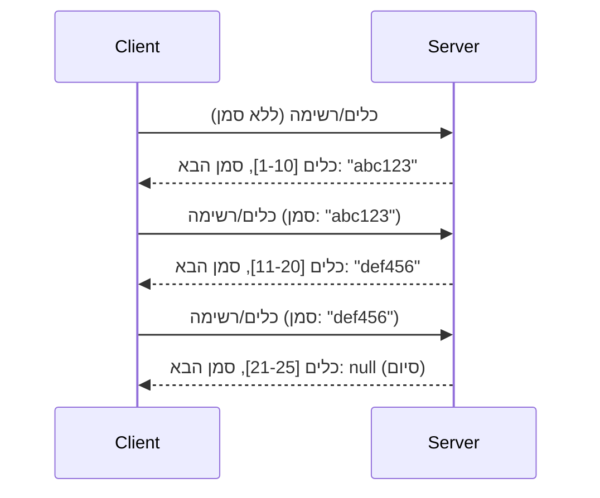

# עימוד ומערכי תוצאות גדולים ב-MCP

כאשר שרת MCP שלך מטפל במערכי נתונים גדולים — בין אם ברשימת אלפי קבצים, רשומות מסד נתונים או תוצאות חיפוש — יש צורך בעימוד לניהול זיכרון יעיל ולהבטחת חוויות משתמש תגובתיות. מדריך זה מסביר כיצד ליישם ולהשתמש בעימוד ב-MCP.

## מדוע עימוד חשוב

ללא עימוד, תגובות גדולות עלולות לגרום ל:

- **מיצוי זיכרון** - טעינת מיליוני רשומות בבת אחת
- **זמני תגובה איטיים** - המשתמשים מחכים בזמן שכל הנתונים נטענים
- **שגיאות חציית זמן ממתין** - בקשות חורגות מגבולות הזמן המוקצב
- **ביצוע לקוי של בינה מלאכותית** - מודלים גדולים מתקשים עם הקשר עצום

MCP משתמש בעימוד מבוסס סמן (**cursor**) לדפדוף אמין ועקבי דרך מערכי תוצאות.

---

## כיצד עובד העימוד ב-MCP

### מושג הסמן

**סמן** הוא מחרוזת אטומה שסימנה את מיקומך במערך תוצאות. דמיין אותו כסימנייה בספר ארוך.



### עימוד בשיטות MCP

שיטות MCP אלו תומכות בעימוד:

| שיטה | מחזירה | תמיכה בסמן |
|--------|---------|----------------|
| `tools/list` | הגדרות כלים | ✅ |
| `resources/list` | הגדרות משאבים | ✅ |
| `prompts/list` | הגדרות בקשות | ✅ |
| `resources/templates/list` | תבניות משאבים | ✅ |

---

## יישום בשרת

### Python (FastMCP)

```python
from mcp.server import Server
from mcp.types import Tool, ListToolsResult
import math

app = Server("paginated-server")

# אוסף נתונים גדול מדומה
ALL_TOOLS = [
    Tool(name=f"tool_{i}", description=f"Tool number {i}", inputSchema={})
    for i in range(100)
]

PAGE_SIZE = 10

@app.list_tools()
async def list_tools(cursor: str | None = None) -> ListToolsResult:
    """List tools with pagination support."""
    
    # פענח את הסמן כדי לקבל את האינדקס ההתחלתי
    start_index = 0
    if cursor:
        try:
            start_index = int(cursor)
        except ValueError:
            start_index = 0
    
    # קבל עמוד של תוצאות
    end_index = min(start_index + PAGE_SIZE, len(ALL_TOOLS))
    page_tools = ALL_TOOLS[start_index:end_index]
    
    # חשב את הסמן הבא
    next_cursor = None
    if end_index < len(ALL_TOOLS):
        next_cursor = str(end_index)
    
    return ListToolsResult(
        tools=page_tools,
        nextCursor=next_cursor
    )
```

### TypeScript

```typescript
import { Server } from "@modelcontextprotocol/sdk/server/index.js";
import { ListToolsResultSchema } from "@modelcontextprotocol/sdk/types.js";

const server = new Server({
  name: "paginated-server",
  version: "1.0.0"
});

// מערך נתונים גדול מדומה
const ALL_TOOLS = Array.from({ length: 100 }, (_, i) => ({
  name: `tool_${i}`,
  description: `Tool number ${i}`,
  inputSchema: { type: "object", properties: {} }
}));

const PAGE_SIZE = 10;

server.setRequestHandler(ListToolsResultSchema, async (request) => {
  // פענח את הסמן
  let startIndex = 0;
  if (request.params?.cursor) {
    startIndex = parseInt(request.params.cursor, 10) || 0;
  }
  
  // קבל דף תוצאות
  const endIndex = Math.min(startIndex + PAGE_SIZE, ALL_TOOLS.length);
  const pageTools = ALL_TOOLS.slice(startIndex, endIndex);
  
  // חשב את הסמן הבא
  const nextCursor = endIndex < ALL_TOOLS.length ? String(endIndex) : undefined;
  
  return {
    tools: pageTools,
    nextCursor
  };
});
```

### Java (Spring MCP)

```java
@Service
public class PaginatedToolService {
    
    private static final int PAGE_SIZE = 10;
    private final List<Tool> allTools;
    
    public PaginatedToolService() {
        // לאתחל מערכת נתונים גדולה
        this.allTools = IntStream.range(0, 100)
            .mapToObj(i -> new Tool("tool_" + i, "Tool number " + i, Map.of()))
            .collect(Collectors.toList());
    }
    
    @McpMethod("tools/list")
    public ListToolsResult listTools(@Param("cursor") String cursor) {
        // לפענח מצביע
        int startIndex = 0;
        if (cursor != null && !cursor.isEmpty()) {
            try {
                startIndex = Integer.parseInt(cursor);
            } catch (NumberFormatException e) {
                startIndex = 0;
            }
        }
        
        // לקבל דף תוצאות
        int endIndex = Math.min(startIndex + PAGE_SIZE, allTools.size());
        List<Tool> pageTools = allTools.subList(startIndex, endIndex);
        
        // לחשב מצביע הבא
        String nextCursor = endIndex < allTools.size() ? String.valueOf(endIndex) : null;
        
        return new ListToolsResult(pageTools, nextCursor);
    }
}
```

---

## יישום לקוח

### לקוח Python

```python
from mcp import ClientSession

async def get_all_tools(session: ClientSession) -> list:
    """Fetch all tools using pagination."""
    all_tools = []
    cursor = None
    
    while True:
        result = await session.list_tools(cursor=cursor)
        all_tools.extend(result.tools)
        
        if result.nextCursor is None:
            break
        cursor = result.nextCursor
    
    return all_tools

# שימוש
async with client_session as session:
    tools = await get_all_tools(session)
    print(f"Found {len(tools)} tools")
```

### לקוח TypeScript

```typescript
import { Client } from "@modelcontextprotocol/sdk/client/index.js";

async function getAllTools(client: Client): Promise<Tool[]> {
  const allTools: Tool[] = [];
  let cursor: string | undefined = undefined;
  
  do {
    const result = await client.listTools({ cursor });
    allTools.push(...result.tools);
    cursor = result.nextCursor;
  } while (cursor);
  
  return allTools;
}

// שימוש
const tools = await getAllTools(client);
console.log(`Found ${tools.length} tools`);
```

### תבנית טעינה עצלנית

עבור מערכי נתונים גדולים מאוד, טען עמודים לפי דרישה:

```python
class PaginatedToolIterator:
    """Lazily iterate through paginated tools."""
    
    def __init__(self, session: ClientSession):
        self.session = session
        self.cursor = None
        self.buffer = []
        self.exhausted = False
    
    async def __anext__(self):
        # החזר מהבופר אם זמין
        if self.buffer:
            return self.buffer.pop(0)
        
        # בדוק אם סיימנו את כל העמודים
        if self.exhausted:
            raise StopAsyncIteration
        
        # שלוף את העמוד הבא
        result = await self.session.list_tools(cursor=self.cursor)
        self.buffer = list(result.tools)
        self.cursor = result.nextCursor
        
        if self.cursor is None:
            self.exhausted = True
        
        if not self.buffer:
            raise StopAsyncIteration
        
        return self.buffer.pop(0)
    
    def __aiter__(self):
        return self

# שימוש - יעיל בזיכרון עבור מערכי נתונים גדולים
async for tool in PaginatedToolIterator(session):
    process_tool(tool)
```

---

## עימוד למשאבים

משאבים לעיתים קרובות זקוקים לעימוד עבור תיקיות או מערכי נתונים גדולים:

```python
from mcp.server import Server
from mcp.types import Resource, ListResourcesResult
import os

app = Server("file-server")

@app.list_resources()
async def list_resources(cursor: str | None = None) -> ListResourcesResult:
    """List files in directory with pagination."""
    
    directory = "/data/files"
    all_files = sorted(os.listdir(directory))
    
    # פענח מצביע (אינדקס קובץ)
    start_index = int(cursor) if cursor else 0
    page_size = 20
    end_index = min(start_index + page_size, len(all_files))
    
    # צור רשימת משאבים עבור דף זה
    resources = []
    for filename in all_files[start_index:end_index]:
        filepath = os.path.join(directory, filename)
        resources.append(Resource(
            uri=f"file://{filepath}",
            name=filename,
            mimeType="application/octet-stream"
        ))
    
    # חשב את המצביע הבא
    next_cursor = str(end_index) if end_index < len(all_files) else None
    
    return ListResourcesResult(
        resources=resources,
        nextCursor=next_cursor
    )
```

---

## אסטרטגיות עיצוב סמן

### אסטרטגיה 1: מבוסס אינדקס (פשוט)

```python
# הסמן הוא רק האינדקס
cursor = "50"  # התחל בפריט 50
```

**יתרונות:** פשוט, ללא מצב
**חסרונות:** התוצאות עלולות להשתנות אם פריטים נוספים/מסולקים

### אסטרטגיה 2: מבוסס מזהה (יציב)

```python
# הסמן הוא המזהה האחרון שנצפה
cursor = "item_abc123"  # התחל אחרי פריט זה
```

**יתרונות:** יציב גם אם פריטים משתנים
**חסרונות:** דורש מזהים מסודרים

### אסטרטגיה 3: מצב מקודד (מורכב)

```python
import base64
import json

def encode_cursor(state: dict) -> str:
    return base64.b64encode(json.dumps(state).encode()).decode()

def decode_cursor(cursor: str) -> dict:
    return json.loads(base64.b64decode(cursor).decode())

# המצביע מכיל מספר שדות מצב
cursor = encode_cursor({
    "offset": 50,
    "filter": "active",
    "sort": "name"
})
```

**יתרונות:** יכול לקודד מצב מורכב
**חסרונות:** מורכב יותר, מחרוזות סמן ארוכות יותר

---

## הנחיות עבודה מיטביות

### 1. בחר גודל עמוד מתאים

```python
# שקול את גודל הנתונים
PAGE_SIZE_SMALL_ITEMS = 100   # מֵטָה-דָּאטָה פשוטה
PAGE_SIZE_MEDIUM_ITEMS = 20   # עצמים עשירים יותר
PAGE_SIZE_LARGE_ITEMS = 5     # תוכן מורכב
```

### 2. התמודד בעדינות עם סמנים לא חוקיים

```python
@app.list_tools()
async def list_tools(cursor: str | None = None) -> ListToolsResult:
    try:
        start_index = int(cursor) if cursor else 0
        if start_index < 0 or start_index >= len(ALL_TOOLS):
            start_index = 0  # איפוס לתחילה
    except (ValueError, TypeError):
        start_index = 0  # סמן לא חוקי, התחל מחדש
    # ...
```

### 3. כלול ספירת סך הכל (אופציונלי)

```python
return ListToolsResult(
    tools=page_tools,
    nextCursor=next_cursor,
    # כמה מימושים כוללים סה"כ להתקדמות בממשק המשתמש
    _meta={"total": len(ALL_TOOLS)}
)
```

### 4. בדוק מקרים קצה

```python
async def test_pagination():
    # קבוצת תוצאות ריקה
    result = await session.list_tools()
    assert result.tools == []
    assert result.nextCursor is None
    
    # עמוד יחיד
    result = await session.list_tools()
    assert len(result.tools) <= PAGE_SIZE
    
    # מצביע לא חוקי
    result = await session.list_tools(cursor="invalid")
    assert result.tools  # חייב להחזיר את העמוד הראשון
```

---

## מלכודות נפוצות

### ❌ להחזיר את כל התוצאות ואז לעמנן בצד הלקוח

```python
# רע: טוען הכל לזיכרון
@app.list_tools()
async def list_tools() -> ListToolsResult:
    all_tools = load_all_tools()  # מיליון כלים!
    return ListToolsResult(tools=all_tools)
```

### ✅ לעמנן במקור הנתונים

```python
# טוב: טוען רק את מה שצריך
@app.list_tools()
async def list_tools(cursor: str | None = None) -> ListToolsResult:
    offset = int(cursor) if cursor else 0
    tools = await db.query_tools(offset=offset, limit=PAGE_SIZE)
    return ListToolsResult(tools=tools, nextCursor=...)
```

---

## מה הלאה

- [מודול 5.14 - הנדסת הקשר](../../05-AdvancedTopics/mcp-contextengineering/README.md)
- [מודול 8 - הנחיות עבודה מיטביות](../../08-BestPractices/README.md)
- [3.8 - בדיקת שרת MCP שלך](../../03-GettingStarted/08-testing/README.md)

---

## משאבים נוספים

- [מפרט MCP - עימוד](https://modelcontextprotocol.io/specification/2026-07-28/)
- [עימוד מבוסס סמן מוסבר](https://slack.engineering/evolving-api-pagination-at-slack/)
- [בדיקות עימוד Python SDK](https://github.com/modelcontextprotocol/python-sdk/blob/main/tests/client/test_list_methods_cursor.py)

---

<!-- CO-OP TRANSLATOR DISCLAIMER START -->
**כתב ויתור**:
מסמך זה תורגם באמצעות שירות תרגום אוטומטי [Co-op Translator](https://github.com/Azure/co-op-translator). למרות שאנו שואפים לדיוק, יש לקחת בחשבון שתרגומים אוטומטיים עלולים להכיל שגיאות או אי-דיוקים. יש להחשיב את המסמך המקורי בשפתו הטבעית כמקור הסמכות. למידע קריטי מומלץ להשתמש בתרגום מקצועי על ידי מתרגם אדם. אנו לא אחראים לכל אי-הבנה או פירוש שגוי הנובע מהשימוש בתרגום זה.
<!-- CO-OP TRANSLATOR DISCLAIMER END -->