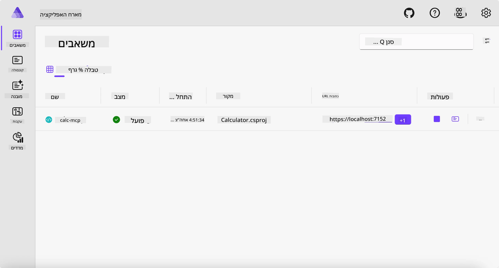
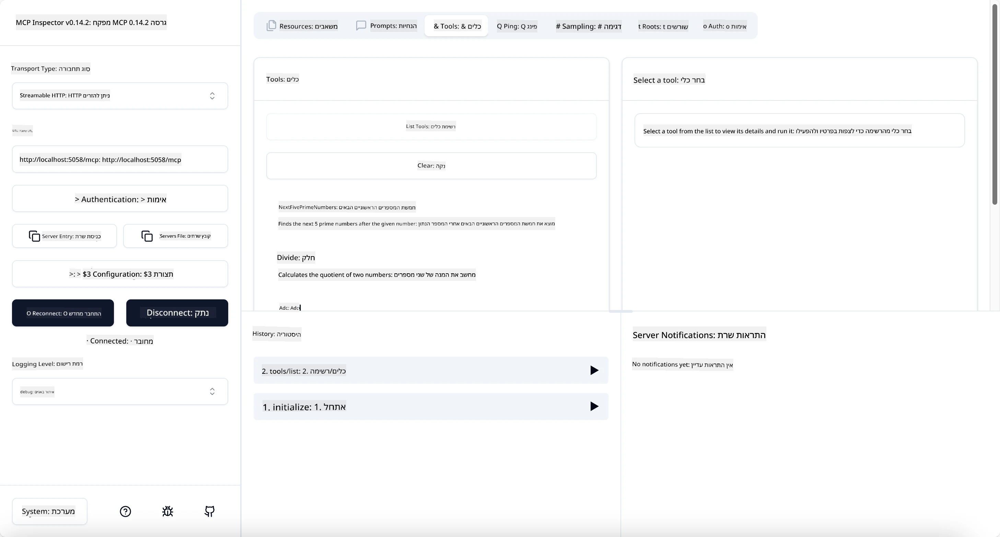
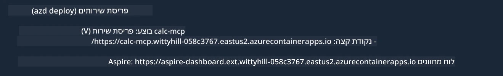

# דוגמה

הדוגמה הקודמת מראה כיצד להשתמש בפרויקט .NET מקומי עם סוג `stdio`. וכיצד להפעיל את השרת מקומית במיכל. זו פתרון טוב במצבים רבים. עם זאת, יכול להיות שימושי שהשרת ירוץ מרחוק, כמו בסביבת ענן. כאן נכנס לסוג `http`.

בהסתכלות על הפתרון בתיקיה `04-PracticalImplementation`, זה עשוי להיראות הרבה יותר מורכב מהקודם. אבל בפועל, זה לא כך. אם תסתכל היטב על הפרויקט `src/Calculator`, תראה שזה בגדול אותו קוד כמו בדוגמה הקודמת. ההבדל היחיד הוא שאנו משתמשים בספריה אחרת `ModelContextProtocol.AspNetCore` לטיפול בבקשות HTTP. ואנחנו משנים את הפונקציה `IsPrime` להפוך אותה לפרטית, רק כדי להראות שאפשר שיהיו פונקציות פרטיות בקוד שלך. שאר הקוד זהה לקודם.

הפרויקטים האחרים הם מ-[Aspire](https://aspire.dev/get-started/what-is-aspire/). קיום Aspire בפתרון ישפר את חוויית המפתח במהלך פיתוח ובדיקה ויסייע בנראות המערכת. לא נדרש להרצת השרת, אך זו הפרקטיקה טובה להחזיק אותו בפתרון שלך.

## הפעל את השרת מקומית

1. מתוך VS Code (בהרחבת C# DevKit), נווט לתיקיה `04-PracticalImplementation/samples/csharp`.
1. הרץ את הפקודה הבאה כדי להפעיל את השרת:

   ```bash
    dotnet watch run --project ./src/AppHost
   ```

1. כאשר דפדפן אינטרנט יפתח את לוח הבקרה של Aspire, שים לב לכתובת `http`. זה אמור להיות משהו כמו `http://localhost:5058/`.

   

## בדוק את Streamable HTTP עם MCP Inspector

אם יש לך Node.js גרסה 22.7.5 ומעלה, אתה יכול להשתמש ב-MCP Inspector כדי לבדוק את השרת שלך.

הפעל את השרת והרץ את הפקודה הבאה בטרמינל:

```bash
npx @modelcontextprotocol/inspector http://localhost:5058
```



- בחר את `Streamable HTTP` כסוג ההעברה.
- בשדה כתובת ה-Url, הזן את כתובת השרת שנרשמה קודם, והוסף `/mcp`. זה אמור להיות `http` (ולא `https`) משהו כמו `http://localhost:5058/mcp`.
- לחץ על כפתור התחבר.

דבר טוב ב-Inspector הוא שהוא מספק נראות טובה על מה שקורה.

- נסה לרשום את הכלים הזמינים
- נסה כמה מהם, זה אמור לעבוד כמו קודם.

## בדוק את שרת MCP עם GitHub Copilot Chat ב-VS Code

כדי להשתמש ב-Streamable HTTP עם GitHub Copilot Chat, שנה את תצורת השרת `calc-mcp` שיצרת קודם כך:

```jsonc
// .vscode/mcp.json
{
  "servers": {
    "calc-mcp": {
      "type": "http",
      "url": "http://localhost:5058/mcp"
    }
  }
}
```

ערוך כמה בדיקות:

- שאל עבור "3 מספרים ראשוניים אחרי 6780". שים לב ש-Copilot ישתמש בכלים החדשים `NextFivePrimeNumbers` ויחזיר רק את 3 המספרים הראשוניים הראשונים.
- שאל עבור "7 מספרים ראשוניים אחרי 111", כדי לראות מה קורה.
- שאל עבור "לג'ון יש 24 סוכריות והוא רוצה לחלק את כולן ל-3 ילדיו. כמה סוכריות יש לכל ילד?", כדי לראות מה קורה.

## פרוס את השרת ל-Azure

נפרוס את השרת ל-Azure כדי שיותר אנשים יוכלו להשתמש בו.

מתוך טרמינל, נווט לתיקיה `04-PracticalImplementation/samples/csharp` והריץ את הפקודה הבאה:

```bash
azd up
```

ברגע שסיום הפריסה, תראה הודעה כזו:



קח את הכתובת והשתמש בה ב-MCP Inspector וב-GitHub Copilot Chat.

```jsonc
// .vscode/mcp.json
{
  "servers": {
    "calc-mcp": {
      "type": "http",
      "url": "https://calc-mcp.gentleriver-3977fbcf.australiaeast.azurecontainerapps.io/mcp"
    }
  }
}
```

## מה הלאה?

ניסינו סוגי העברה וכלי בדיקה שונים. גם פרסנו את שרת MCP ל-Azure. אבל מה אם השרת שלנו צריך גישה למשאבים פרטיים? לדוגמה, מסד נתונים או API פרטי? בפרק הבא נראה כיצד אפשר לשפר את האבטחה של השרת שלנו.

---

<!-- CO-OP TRANSLATOR DISCLAIMER START -->
**כתב ויתור**:
מסמך זה תורגם באמצעות שירות תרגום אוטומטי [Co-op Translator](https://github.com/Azure/co-op-translator). למרות שאנו שואפים לדיוק, יש לקחת בחשבון שתרגומים אוטומטיים עלולים להכיל שגיאות או אי-דיוקים. יש להחשיב את המסמך המקורי בשפתו הטבעית כמקור הסמכות. למידע קריטי מומלץ להשתמש בתרגום מקצועי על ידי מתרגם אדם. אנו לא אחראים לכל אי-הבנה או פירוש שגוי הנובע מהשימוש בתרגום זה.
<!-- CO-OP TRANSLATOR DISCLAIMER END -->