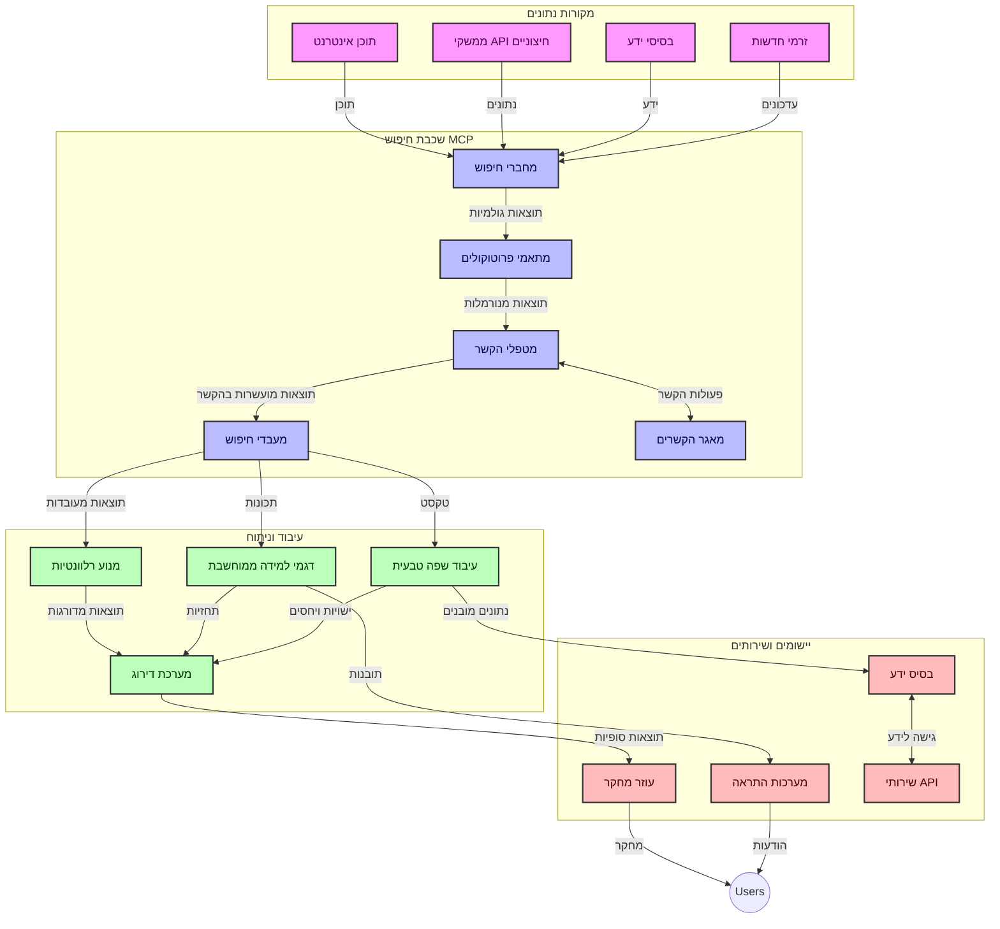
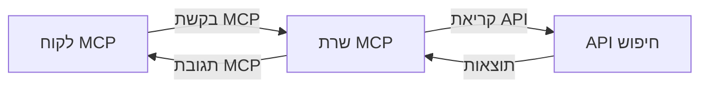
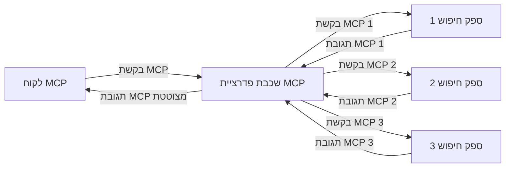
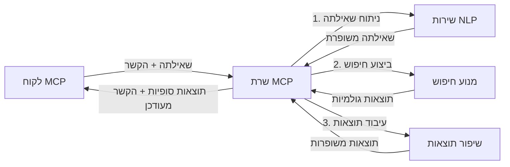

# פרוטוקול הקשר של מודל לחיפוש אינטרנט בזמן אמת

## סקירה כללית

חיפוש אינטרנט בזמן אמת הפך לחשוב בסביבת המידע של ימינו, שבה אפליקציות זקוקות לגישה מיידית למידע עדכני ברחבי האינטרנט בכדי לספק תגובות רלוונטיות ועכשוויות. פרוטוקול הקשר של מודל (MCP) מייצג התקדמות משמעותית באופטימיזציה של תהליכי החיפוש בזמן אמת הללו, משפר את יעילות החיפוש, שומר על שלמות ההקשר ומשפר את ביצועי המערכת הכלליים.

מודול זה בוחן כיצד MCP משנה את חיפוש האינטרנט בזמן אמת על ידי מתן גישה סטנדרטית לניהול הקשר בין מודלים של בינה מלאכותית, מנועי חיפוש ואפליקציות.

### מה תלמדו

במדריך מקיף זה תגלה:

- כיצד MCP יוצר גשר חלק בין מודלים של בינה מלאכותית ויכולות חיפוש אינטרנט בזמן אמת
- דפוסי ארכיטקטורה ליישום פתרונות חיפוש יעילים ומדרגיים עם MCP
- טכניקות לשימור הקשר החיפוש לאורך מספר שאילתות ואינטראקציות
- יישומי קוד מעשיים בפייתון וב-JavaScript לתרחישי חיפוש שונים
- שיטות לאיזון בין רלוונטיות, עדכניות וביצועים במערכות חיפוש המופעלות באמצעות MCP

## מבוא לחיפוש אינטרנט בזמן אמת

חיפוש אינטרנט בזמן אמת הוא גישה טכנולוגית המאפשרת שאילתות, עיבוד וניתוח מתמשכים של מידע מבוסס אינטרנט בזמן פרסומו או עדכונו, ומאפשרת למערכות לספק מידע טרי ורלוונטי עם השהייה מינימלית. בניגוד למערכות חיפוש מסורתיות הפועלות על נתונים מאונדקסים שיכולים להיות בני שעות או ימים, תהליכי החיפוש בזמן אמת מתמקדים בנתונים חיים מהאינטרנט, ומספקים תובנות ומידע המשקפים את מצב התוכן המקוון הנוכחי.

### מושגים מרכזיים בחיפוש אינטרנט בזמן אמת:

- **עיבוד שאילתה רציף**: שאילתות חיפוש מעובדות מול מקורות מידע המתעדכנים כל הזמן
- **עדיפות לעדכניות**: מערכות מתוכננות להעדיף מידע טרי
- **איזון רלוונטיות**: שמירה על איזון בין רלוונטיות ועדכניות
- **ארכיטקטורה מדרגת**: מערכות חייבות להתמודד עם עומסי שאילתות משתנים ונפחי נתונים
- **הבנה הקשרית**: שימור ההקשר של המשתמש לאורך חזרות החיפוש חיוני לתוצאות משמעותיות
- **רפורמולציה דינמית של שאילתות**: שינוי שאילתות באופן אדפטיבי לפי ההקשר והתוצאות הקודמות
- **אינטגרציה מרובת מקורות**: שילוב תוצאות ממספר ספקי חיפוש ומקורות אינטרנט
- **הבנה סמנטית**: עיבוד שאילתות ותוכן על בסיס המשמעות ולא רק מילות מפתח
- **דירוג בזמן אמת**: התאמת דירוג התוצאות באופן רציף ככל שמידע חדש מתווסף

### פרוטוקול הקשר של מודל וחיפוש אינטרנט בזמן אמת

פרוטוקול הקשר של מודל (MCP) מתמודד עם מספר אתגרים קריטיים בסביבת חיפוש אינטרנט בזמן אמת:

1. **שימור הקשר חיפוש**: MCP מאחד את הדרך שבה נשמר ההקשר בין רכיבי חיפוש מבוזרים, מבטיח שלמודלי הבינה המלאכותית ולצמתים העיבוד יהיה גישה להיסטוריית השאילתות והעדפות המשתמש הרלוונטיות.

2. **ניהול שאילתות יעיל**: באמצעות מתן מנגנונים מובנים להעברת ההקשר, MCP מפחית את העומס של חזרה על ההקשר בכל איטרציה של חיפוש.

3. **אינטראופרביליות**: MCP יוצר שפה משותפת לשיתוף הקשר בין טכנולוגיות חיפוש מגוונות ומודלים של בינה מלאכותית, ומאפשר ארכיטקטורות גמישות וניתנות להרחבה.

4. **הקשר מותאם לחיפוש**: יישומי MCP יכולים להעדיף אילו אלמנטים מההקשר הכי רלוונטיים לחיפוש יעיל, לאופטימיזציה של ביצועים ודיוק.

5. **עיבוד חיפוש אדפטיבי**: עם ניהול נכון של ההקשר דרך MCP, מערכות החיפוש יכולות להתאים את העיבוד שלהן באופן דינמי לפי צרכי המשתמש המתפתחים ונופי המידע המשתנים.

באפליקציות מודרניות שמתפרסות מטיפול חדשות ועד לעוזרי מחקר, שילוב MCP עם טכנולוגיות חיפוש אינטרנט מאפשר חיפוש חכם, מודע להקשר, שיכול לספק תוצאות רלוונטיות יותר ככל שאינטראקציות המשתמש ממשיכות.

## יעדי הלמידה

בסיום השיעור תהיה מסוגל:

- להבין את יסודות חיפוש אינטרנט בזמן אמת והאתגרים באפליקציות מודרניות
- להסביר כיצד פרוטוקול הקשר של מודל (MCP) משפר את יכולות חיפוש האינטרנט בזמן אמת
- ליישם פתרונות חיפוש מבוססי MCP באמצעות מסגרות ו-APIs פופולריים
- לעצב ולפרוס ארכיטקטורות חיפוש מדרגות ובעלי ביצועים גבוהים עם MCP
- ליישם מושגי MCP במגוון שימושים כולל חיפוש סמנטי, סיוע מחקר וגלישה עם תוספת בינה מלאכותית
- להעריך מגמות עתידיות וחדשנויות בטכנולוגיות חיפוש מבוססות MCP
- לפתח מערכות חיפוש מודעות להקשר שלומדות מאינטראקציות המשתמש
- לשלב יכולות חיפוש אינטרנט בעוזרי בינה מלאכותית באמצעות פרוטוקולי MCP סטנדרטיים
- ליצור צינורות חיפוש רב-שלביים שמחדדים תוצאות בצורה הדרגתית בהתאם להקשר
- לאופטם את ביצועי החיפוש תוך שמירה על מודעות להקשר נרחב

### הגדרה וחשיבות

חיפוש אינטרנט בזמן אמת כולל שאילתות, שליפה, והעברת מידע מבוסס אינטרנט ברצף עם השהייה מינימלית. בניגוד למנועי חיפוש מסורתיים המטפסים ומאינדקסים את האינטרנט לפרקי זמן קבועים, חיפוש בזמן אמת שואף להציג מידע מיד עם הופעתו, ומאפשר גישה מיידית לתוכן העדכני ביותר.

מאפיינים מרכזיים של חיפוש אינטרנט בזמן אמת כוללים:

- **טריות**: העדפת תכנים ועדכונים אחרונים
- **עיבוד רציף**: מעקב מתמיד אחר מידע חדש
- **התאמת שאילתה**: שיפור שאילתות חיפוש על בסיס הקשר ופידבק
- **אספקה מידית**: הצגת תוצאות חיפוש עם השהייה מינימלית
- **שמירת הקשר**: בנייה על שאילתות קודמות לשיפור הרלוונטיות

### אתגרים בחיפוש אינטרנט מסורתי

גישות חיפוש אינטרנט מסורתיות מתמודדות עם מגבלות שונות בסביבות חיפוש בזמן אמת:

1. **פירוק הקשר**: קושי בשמירת הקשר החיפוש לאורך מספר שאילתות
2. **טריות המידע**: אתגרים בגישה ובהעדפת המידע העדכני ביותר
3. **מורכבות אינטגרציה**: בעיות באינטרופרביליות בין מערכות חיפוש ואפליקציות
4. **בעיות השהייה**: איזון בין חיפוש מקיף לדרישות זמן תגובה
5. **כיוונון רלוונטיות**: הבטחת דיוק ורלוונטיות תוך העדפת עדכניות

## הבנת פרוטוקול הקשר של מודל (MCP) לחיפוש

### מהו MCP בהקשר של חיפוש?

פרוטוקול הקשר של מודל (MCP) הוא פרוטוקול תקשורת סטנדרטי המיועד להקל על אינטראקציה יעילה בין מודלים של בינה מלאכותית ואפליקציות. בהקשר של חיפוש אינטרנט בזמן אמת, MCP מספק מסגרת ל:

- שימור הקשר החיפוש לאורך רצפי שאילתות
- סטנדרטיזציה של פורמטים לשאילתות ותוצאות חיפוש
- אופטימיזציה של העברת פרמטרים ותוצאות חיפוש
- שיפור תקשורת בין מודלים למנועי חיפוש

### רכיבים מרכזיים וארכיטקטורה

ארכיטקטורת MCP לחיפוש אינטרנט בזמן אמת מורכבת ממספר רכיבים מרכזיים:

1. **מטפל בהקשר השאילתה**: מנהל ושומר על ההקשר לאורך שאילתות מרובות
2. **מעבדי חיפוש**: מעבדים בקשות חיפוש נכנסות תוך שימוש בטכניקות מודעות להקשר
3. **מתאמי פרוטוקול**: ממירים בין APIs שונים של חיפוש תוך שמירת ההקשר
4. **מאגר הקשר**: מאחסן ומחזיר בצורה יעילה היסטוריית חיפוש והעדפות
5. **מחברי חיפוש**: מתחברים למנועי חיפוש ושירותי API שונים באינטרנט



### כיצד MCP משפר חיפוש אינטרנט בזמן אמת

MCP מתמודד עם אתגרי החיפוש המסורתי באמצעות:

- **המשכיות הקשר**: שימור יחסים בין שאילתות לאורך כל מושב החיפוש
- **העברה מיטבית**: הפחתת כפילויות בפרמטרי החיפוש באמצעות ניהול הקשר חכם
- **ממשקים סטנדרטיים**: מתן APIs עקביים לרכיבי החיפוש
- **הפחתת השהייה**: מזעור עומס עיבוד באמצעות ניהול הקשר יעיל
- **רלוונטיות מוגברת**: שיפור רלוונטיות החיפוש באמצעות שמירת כוונת המשתמש לאורך שאילתות מרובות

## אינטגרציה ויישום

מערכות חיפוש אינטרנט בזמן אמת דורשות עיצוב ארכיטקטוני ויישום מדוקדקים לשמירה על ביצועים ושלמות הקשר. פרוטוקול הקשר של מודל מציע גישה סטנדרטית לשילוב מודלים של בינה מלאכותית וטכנולוגיות חיפוש, ומאפשר צינורות חיפוש מתוחכמים ומודעים להקשר.

### סקירה של שילוב MCP בארכיטקטורות חיפוש

יישום MCP בסביבות חיפוש אינטרנט בזמן אמת כולל מספר שיקולים מרכזיים:

1. **סיראליזציה של הקשר חיפוש**: MCP מספק מנגנונים יעילים לקידוד מידע הקשרי בתוך בקשות חיפוש, מבטיח שהקשר חיוני עוקב אחרי השאילתה לאורך כל צינור העיבוד. זה כולל פורמטים סטנדרטיים לסיראליזציה המותאמים למטא-נתונים הקשורים לחיפוש.

2. **עיבוד חיפוש מצביא**: MCP מאפשר עיבוד חכם במצב עם שמירה עקבית של ייצוג ההקשר לאורך איטרציות חיפוש. זה חשוב במיוחד בצינורות חיפוש רב-שלביים שבהם שיפור ההקשר משפר תוצאות.

3. **הרחבה ושיפור שאילתה**: יישומי MCP במערכות חיפוש יכולים להקל על הרחבה ושיפור שאילתות מתוחכמים על בסיס ההקשר המצטבר, ומאפשרים תוצאות רלוונטיות יותר ככל שמושב החיפוש מתקדם.

4. **מטמון תוצאות והעדפה**: באמצעות סטנדרטיזציה של ניהול ההקשר, MCP מסייע בניהול מטמון תוצאות והעדפה, ומאפשר לרכיבים להתאים את עצמם בהתחשב בהקשר החיפוש המתפתח.

5. **פדרציה ואגגרגציה של חיפוש**: MCP מקל על פדרציה מתוחכמת של חיפוש בין מספר מערכות על ידי מתן ייצוגים מבניים של הקשר החיפוש, ומאפשר אגגרגציה משמעותית יותר של תוצאות ממקורות מגוונים.

יישום MCP בטכנולוגיות חיפוש שונות יוצר גישה אחידה לניהול הקשר, מפחית את הצורך בקוד אינטגרציה מותאם אישית ומגביר את יכולת המערכת לשמור על הקשר משמעותי ככל שהשאילתות משתנות.

### MCP ביישומי חיפוש אינטרנט שונים

דוגמות אלו עוקבות אחרי המפרט הנוכחי של MCP המתמקד בפרוטוקול מבוסס JSON-RPC עם מנגנוני העברה מובחנים. הקוד ממחיש כיצד ניתן ליישם אינטגרציות חיפוש מותאמות אישית תוך שמירה על תאימות מלאה לפרוטוקול MCP.


<details>
<summary>יישום בפייתון עם API חיפוש גנרי</summary>

```python
import asyncio
import json
import aiohttp
from typing import Dict, Any, Optional, List
from contextlib import asynccontextmanager
from collections.abc import AsyncIterator

# ייבא ספריות MCP סטנדרטיות
from mcp.client.session import ClientSession
from mcp.client.streamable_http import streamablehttp_client
from mcp.types import TextContent, CreateMessageRequestParams, CreateMessageResult
from mcp.server.fastmcp import FastMCP

# צור שרת FastMCP לחיפוש באינטרנט
search_server = FastMCP("WebSearch")

# מחלקה לטיפול בפעולות חיפוש באינטרנט
class WebSearchHandler:
    def __init__(self, api_endpoint: str, api_key: str):
        self.api_endpoint = api_endpoint
        self.api_key = api_key
        self.session = None
        
    async def initialize(self):
        """Initialize the HTTP session"""
        self.session = aiohttp.ClientSession(
            headers={"Authorization": f"Bearer {self.api_key}"}
        )
    
    async def close(self):
        """Close the HTTP session"""
        if self.session:
            await self.session.close()
            
    async def perform_search(self, query: str, max_results: int = 5, 
                           include_domains: List[str] = None, 
                           exclude_domains: List[str] = None,
                           time_period: str = "any") -> Dict[str, Any]:
        """Perform web search using the search API"""
        # הרכבת פרמטרי החיפוש
        search_params = {
            "q": query,
            "limit": max_results,
            "time": time_period
        }
        
        if include_domains:
            search_params["site"] = ",".join(include_domains)
            
        if exclude_domains:
            search_params["exclude_site"] = ",".join(exclude_domains)
        
        # בצע את בקשת החיפוש
        try:
            async with self.session.get(
                self.api_endpoint,
                params=search_params
            ) as response:
                if response.status != 200:
                    error_text = await response.text()
                    raise Exception(f"Search API error: {response.status} - {error_text}")
                
                search_data = await response.json()
                
                # המר תגובת API ספציפית לפורמט סטנדרטי
                results = []
                for item in search_data.get("results", []):
                    results.append({
                        "title": item.get("title", ""),
                        "url": item.get("url", ""),
                        "snippet": item.get("snippet", ""),
                        "date": item.get("published_date", ""),
                        "source": item.get("source", "")
                    })
                
                return {
                    "query": query,
                    "totalResults": len(results),
                    "results": results
                }
        except Exception as e:
            print(f"Search API request error: {e}")
            raise

# אתחל את מטפל החיפוש
search_handler = WebSearchHandler(
    api_endpoint="https://api.search-service.example/search",
    api_key="your-api-key-here"
)

# קבע אורך חיים לניהול מטפל החיפוש
@asyncio.asynccontextmanager
async def app_lifespan(server: FastMCP):
    """Manage application lifecycle"""
    await search_handler.initialize()
    try:
        yield {"search_handler": search_handler}
    finally:
        await search_handler.close()

# קבע אורך חיים לשרת
search_server = FastMCP("WebSearch", lifespan=app_lifespan)

# רשום כלי חיפוש באינטרנט
@search_server.tool()
async def web_search(query: str, max_results: int = 5, 
                   include_domains: List[str] = None,
                   exclude_domains: List[str] = None,
                   time_period: str = "any") -> Dict[str, Any]:
    """
    Search the web for information
    
    Args:
        query: The search query
        max_results: Maximum number of results to return (default: 5)
        include_domains: List of domains to include in search results
        exclude_domains: List of domains to exclude from search results
        time_period: Time period for results ("day", "week", "month", "any")
        
    Returns:
        Dictionary containing search results
    """
    ctx = search_server.get_context()
    search_handler = ctx.request_context.lifespan_context["search_handler"]
    
    results = await search_handler.perform_search(
        query=query,
        max_results=max_results,
        include_domains=include_domains,
        exclude_domains=exclude_domains,
        time_period=time_period
    )
    
    return results

# דוגמת שימוש של לקוח
async def client_example():
    # התחבר לשרת החיפוש באמצעות העברת HTTP ניתנת להזרים
    async with streamablehttp_client("http://localhost:8000/mcp") as (read, write, _):
        async with ClientSession(read, write) as session:
            # אתחל את החיבור
            await session.initialize()
            
            # קרא לכלי web_search
            search_results = await session.call_tool(
                "web_search", 
                {
                    "query": "latest developments in AI and Model Context Protocol",
                    "max_results": 5,
                    "time_period": "day",
                    "include_domains": ["github.com", "microsoft.com"]
                }
            )
            
            print(f"Search results: {search_results}")

# דוגמת הרצת שרת
if __name__ == "__main__":
    # הרץ את השרת עם העברת HTTP ניתנת להזרים
    search_server.run(transport="streamable-http")
```
</details> 

<details>
<summary>יישום ב-JavaScript עם חיפוש מבוסס דפדפן</summary>


```javascript
// מימוש שרת MCP לחיפוש באינטרנט
import { McpServer, ResourceTemplate } from '@modelcontextprotocol/sdk/server/mcp.js';
import { StreamableHTTPServerTransport } from '@modelcontextprotocol/sdk/server/streamableHttp.js';
import { z } from 'zod';

// יצירת שרת MCP לחיפוש באינטרנט
const searchServer = new McpServer({
    name: "BrowserSearch",
    description: "A server that provides web search capabilities"
});

// מחלקת שירות החיפוש
class SearchService {
    constructor(searchApiUrl, apiKey) {
        this.searchApiUrl = searchApiUrl;
        this.apiKey = apiKey;
    }

    async performSearch(parameters) {
        const {
            query = '',
            maxResults = 5,
            includeDomains = [],
            excludeDomains = [],
            timePeriod = 'any'
        } = parameters;
        
        // בניית כתובת URL לחיפוש עם פרמטרים
        const url = new URL(this.searchApiUrl);
        url.searchParams.append('q', query);
        url.searchParams.append('limit', maxResults);
        url.searchParams.append('time', timePeriod);
        
        if (includeDomains.length > 0) {
            url.searchParams.append('site', includeDomains.join(','));
        }
        
        if (excludeDomains.length > 0) {
            url.searchParams.append('exclude_site', excludeDomains.join(','));
        }
        
        try {
            const response = await fetch(url.toString(), {
                method: 'GET',
                headers: {
                    'Authorization': `Bearer ${this.apiKey}`,
                    'Content-Type': 'application/json'
                }
            });
            
            if (!response.ok) {
                const errorText = await response.text();
                throw new Error(`Search API error: ${response.status} - ${errorText}`);
            }
            
            const searchData = await response.json();
            
            // המרת תגובת API ספציפית לפורמט סטנדרטי
            const results = searchData.results?.map(item => ({
                title: item.title || '',
                url: item.url || '',
                snippet: item.snippet || '',
                date: item.published_date || '',
                source: item.source || ''
            })) || [];
            
            return {
                query,
                totalResults: results.length,
                results
            };
        } catch (error) {
            console.error('Search API request error:', error);
            throw error;
        }
    }
}

// אתחול שירות החיפוש
const searchService = new SearchService(
    'https://api.search-service.example/search',
    'your-api-key-here'
);

// הגדרת ספק ההקשר לשרת
searchServer.setContextProvider(() => {
    return {
        searchService
    };
});

// רישום כלי חיפוש באינטרנט
searchServer.tool({
    name: 'web_search',
    description: 'Search the web for information',
    parameters: {
        type: 'object',
        properties: {
            query: {
                type: 'string',
                description: 'The search query'
            },
            maxResults: {
                type: 'integer',
                description: 'Maximum number of results to return',
                default: 5
            },
            includeDomains: {
                type: 'array',
                items: { type: 'string' },
                description: 'List of domains to include in search results'
            },
            excludeDomains: {
                type: 'array',
                items: { type: 'string' },
                description: 'List of domains to exclude from search results'
            },
            timePeriod: {
                type: 'string',
                description: 'Time period for results',
                enum: ['day', 'week', 'month', 'any'],
                default: 'any'
            }
        },
        required: ['query']
    },
    handler: async (params, context) => {
        const { searchService } = context;
        return await searchService.performSearch(params);
    }
});

// דוגמת קוד לקוח להתחברות לשרת החיפוש
import { Client } from '@modelcontextprotocol/sdk/client/index.js';
import { StreamableHTTPClientTransport } from '@modelcontextprotocol/sdk/client/streamableHttp.js';

async function connectToSearchServer() {
    // התחברות לשרת החיפוש
    const transport = new StreamableHTTPClientTransport(
        new URL('http://localhost:8000/mcp')
    );
    
    const client = new Client({
        name: 'search-client',
        version: '1.0.0'
    });
    
    await client.connect(transport);
    
    // ביצוע כלי החיפוש
    const searchResults = await client.callTool({
        name: 'web_search',
        arguments: {
            query: 'Model Context Protocol implementation examples',
            maxResults: 10,
            timePeriod: 'week',
            includeDomains: ['github.com', 'docs.microsoft.com']
        }
    });
    
    console.log('Search results:', searchResults);
    
    // ניקיון
    await client.disconnect();
}

// הפעלת השרת
const transport = new StreamableHTTPServerTransport();
await searchServer.connect(transport);
console.log('Search server running at http://localhost:8000/mcp');

// בתהליך נפרד או לאחר שהשרת הופעל
// connectToSearchServer().catch(console.error);
```
</details> 


## הודעת זהירות לדוגמאות קוד

> **הערה חשובה**: הדוגמאות הבאות מציגות את שילוב פרוטוקול הקשר של מודל (MCP) עם פונקציונליות חיפוש באינטרנט. הן עוקבות אחרי דפוסים ומבנים של ערכות SDK רשמיות של MCP, אך פושטו לצרכי לימוד.
> 
> דוגמאות אלו מציגות:
> 
> 1. **יישום בפייתון**: יישום שרת FastMCP המספק כלי חיפוש אינטרנט ומתחבר ל-API חיפוש חיצוני. דוגמה זו מדגימה ניהול מחזור חיים נאות, טיפול בהקשר ויישום כלי בהתאם לדפוסים של [ערכת ה-SDK הרשמית של MCP לפייתון](https://github.com/modelcontextprotocol/python-sdk). השרת משתמש בהעברת HTTP מסוג Streamable המומלצת, שהחליפה את העברת SSE הישנה לפריסות בייצור.
> 
> 2. **יישום ב-JavaScript**: יישום TypeScript/JavaScript המשתמש בדפוס FastMCP מתוך [ערכת ה-SDK הרשמית של MCP ל-TypeScript](https://github.com/modelcontextprotocol/typescript-sdk) ליצירת שרת חיפוש עם הגדרות כלי נכונות וחיבורי לקוח. הוא עוקב אחרי דפוסים מומלצים לניהול מושבים ושימור הקשר.
> 
> דוגמאות אלו דורשות טיפול שגיאות נוסף, אימות וקוד אינטגרציה API ספציפי לשימוש בייצור. נקודות הקצה של API החיפוש המוצגות (`https://api.search-service.example/search`) הן מחזיקים ויש להחליפן בנקודות קצה של שירותי חיפוש אמיתיים.
> 
> לפרטים מלאים על היישום והגישות העדכניות ביותר,
> יש לעיין ב[מפרט הרשמי של MCP](https://modelcontextprotocol.io/specification/2026-07-28/)
> ובמסמכי ה-SDK.

## מושגי ליבה

### מסגרת פרוטוקול הקשר של מודל (MCP)

ביסודו, פרוטוקול הקשר של מודל מספק דרך סטנדרטית למודלים של בינה מלאכותית, אפליקציות ושירותים להחליף הקשר. בחיפוש אינטרנט בזמן אמת, מסגרת זו חיונית ליצירת חוויות חיפוש עקביות ורב-סיבוביות. רכיבים מרכזיים כוללים:

1. **ארכיטקטורת לקוח-שרת**: MCP יוצר הפרדה ברורה בין לקוחות חיפוש (מבקשים) לשרתי חיפוש (ספקים), ומאפשר מודלים פריסתיים גמישים.

2. **תקשורת JSON-RPC**: הפרוטוקול משתמש ב-JSON-RPC להחלפת הודעות, מה שהופך אותו לתואם לטכנולוגיות ווב וקל ליישום בפלטפורמות שונות.

3. **ניהול הקשר**: MCP מגדיר שיטות מובנות לשמירה, עדכון וניצול הקשר החיפוש לאורך אינטראקציות מרובות.

4. **הגדרת כלים**: יכולות החיפוש מיוצגות ככלים סטנדרטיים עם פרמטרים וערכי החזרה מוגדרים היטב.

5. **תמיכה בזרימה**: הפרוטוקול תומך בזרימת תוצאות, חיונית לחיפוש בזמן אמת שבו התוצאות עשויות להגיע בהדרגה.

### דפוסי אינטגרציה לחיפוש אינטרנט

כאשר משלבים MCP עם חיפוש אינטרנט, נוצרות מספר תבניות:

#### 1. אינטגרציה ישירה עם ספק חיפוש



בדפוס זה, שרת MCP מתקשר ישירות עם API של מנועי חיפוש, מתרגם בקשות MCP לשיחות API ספציפיות ומעצב את התוצאות כתשובות MCP.

#### 2. חיפוש בפדרציה עם שימור הקשר



דפוס זה מפזר שאילתות חיפוש בין מספר ספקים התואמים ל-MCP, כל אחד בו עשוי להתמחות בסוגי תוכן או יכולות חיפוש שונים, תוך שמירת הקשר אחיד.

#### 3. שרשרת חיפוש משופרת בהקשר



בדפוס זה, תהליך החיפוש מחולק לשלביו, כאשר ההקשר מועשר בכל שלב, התוצאה היא תוצאות הולכות ומתחדדות מבחינת הרלוונטיות.

### רכיבי הקשר חיפוש

בחיפוש אינטרנט מבוסס MCP, ההקשר בדרך כלל כולל:

- **היסטוריית שאילתות**: שאילתות חיפוש קודמות במושב
- **העדפות משתמש**: שפה, אזור, הגדרות חיפוש בטוח
- **היסטוריית אינטראקציה**: אילו תוצאות נלחצו, זמן שהייה על תוצאות
- **פרמטרי חיפוש**: מסננים, סדרים ומטבים אחרים של חיפוש
- **ידע תחומי**: הקשר נושא ספציפי הרלוונטי לחיפוש
- **הקשר זמני**: גורמי רלוונטיות המבוססים על זמן
- **העדפות מקור**: מקורות מידע מהימנים או מועדפים

## מקרי שימוש ואפליקציות

### מחקר ואיסוף מידע

MCP משפר זרימות עבודה מחקריות על ידי:

- שימור הקשר מחקרי לאורך מושבי חיפוש
- אפשרות לשאילתות מעודנות ורלוונטיות יותר להקשר
- תמיכה בפדרציה של חיפוש ממקורות מרובים
- הקלה בהוצאת ידע מתוצאות החיפוש

### ניטור חדשות ומגמות בזמן אמת

חיפוש המופעל באמצעות MCP מציע יתרונות לניטור חדשות:

- גילוי חדשות מתעוררות כמעט בזמן אמת
- סינון הקשרי של מידע רלוונטי
- מעקב נושא וישויות ממקורות רבים
- התראות חדשות מותאמות אישית על בסיס הקשר המשתמש

### גלישה ומחקר בתמיכת בינה מלאכותית

MCP יוצר אפשרויות חדשות לגלישה בהשלמת AI:

- הצעות חיפוש הקשריות המבוססות על פעילות גלישה נוכחית
- אינטגרציה חלקה של חיפוש אינטרנט עם עוזרים מבוססי LLM
- חיזוק תהליך החיפוש רב-סיבובי עם שימור הקשר
- שיפור בדיקת עובדות ואימות מידע

## מגמות וחדשנויות עתידיות

### אבולוציה של MCP בחיפוש אינטרנט

במבט קדימה, אנו מצפים ש-MCP יתפתח ויתמודד עם:


- **חיפוש רב-מושגי**: שילוב חיפוש טקסט, תמונה, אודיו ווידאו עם שמירת ההקשר  
- **חיפוש מבוזר**: תמיכה באקוסיסטמים של חיפוש מבוזר ופדרטיבי  
- **פרטיות בחיפוש**: מנגנוני חיפוש המגינים על פרטיות תוך התחשבות בהקשר  
- **הבנת שאילתה**: ניתוח סמנטי עמוק של שאילתות חיפוש בשפה טבעית  

### התפתחויות פוטנציאליות בטכנולוגיה  

טכנולוגיות מתהוות שיעצבו את עתיד החיפוש ב-MCP:  

1. **ארכיטקטורות חיפוש עצביות**: מערכות חיפוש מבוססות הטמעה המותאמות ל-MCP  
2. **הקשר חיפוש מותאם אישית**: למידת דפוסי חיפוש של משתמשים לאורך זמן  
3. **אינטגרציה של גרף ידע**: חיפוש הקשרי משופר באמצעות גרפי ידע ספציפיים לתחום  
4. **הקשר חוצה-מושגי**: שמירת ההקשר בין מצבי החיפוש השונים  

## תרגילים מעשיים  

### תרגיל 1: הקמת צינור חיפוש בסיסי ב-MCP  

בתרגיל זה תלמד כיצד:  
- להגדיר סביבת חיפוש בסיסית ל-MCP  
- ליישם מנגנוני טיפול בהקשר לחיפוש באינטרנט  
- לבדוק ולאשר שמירת ההקשר לאורך איטרציות חיפוש  

### תרגיל 2: בניית עוזר מחקר עם חיפוש MCP  

צור אפליקציה שלמה שמבצעת:  
- עיבוד שאלות מחקר בשפה טבעית  
- חיפושים באינטרנט תוך מודעות להקשר  
- סינתזת מידע ממקורות מרובים  
- הצגת ממצאי מחקר מאורגנים  

### תרגיל 3: יישום פדרציית חיפוש רב-מקורית עם MCP  

תרגיל מתקדם המכסה:  
- ניתוב שאילתות עם מודעות להקשר למנועי חיפוש מרובים  
- דירוג ואגרגציה של תוצאות  
- הסרת כפילויות הקשרית של תוצאות חיפוש  
- טיפול במטא-נתונים ספציפיים למקור  

## משאבים נוספים  

- [מפרט פרוטוקול הקשר מודל](https://modelcontextprotocol.io/specification/2026-07-28/) - מפרט רשמי ותיעוד פרוטוקול מפורט  
- [תיעוד פרוטוקול הקשר מודל](https://modelcontextprotocol.io/) - מדריכים מפורטים והדרכות יישום  
- [MCP Python SDK](https://github.com/modelcontextprotocol/python-sdk) - יישום רשמי בפייתון של פרוטוקול MCP  
- [MCP TypeScript SDK](https://github.com/modelcontextprotocol/typescript-sdk) - יישום רשמי ב-TypeScript של פרוטוקול MCP  
- [שרתים של MCP](https://github.com/modelcontextprotocol/servers) - יישומים לדוגמא של שרתי MCP  
- [תיעוד Bing Web Search API](https://learn.microsoft.com/en-us/bing/search-apis/bing-web-search/overview) - ממשק חיפוש אינטרנט של מיקרוסופט  
- [Google Custom Search JSON API](https://developers.google.com/custom-search/v1/overview) - מנוע חיפוש מותאם של גוגל  
- [תיעוד SerpAPI](https://serpapi.com/search-api) - API לדף תוצאות מנוע חיפוש  
- [תיעוד Meilisearch](https://www.meilisearch.com/docs) - מנוע חיפוש בקוד פתוח  
- [תיעוד Elasticsearch](https://www.elastic.co/guide/index.html) - מנוע חיפוש וניתוח מבוזר  
- [תיעוד LangChain](https://python.langchain.com/docs/get_started/introduction) - בניית אפליקציות עם LLMs  

## תוצאות למידה  

עם סיום המודול, תוכל:  

- להבין את יסודות החיפוש האינטרנטי בזמן אמת ואת האתגרים הכרוכים בו  
- להסביר כיצד פרוטוקול הקשר מודל (MCP) משפר את יכולות החיפוש האינטרנטי בזמן אמת  
- ליישם פתרונות חיפוש מבוססי MCP באמצעות מסגרות ו-API פופולריים  
- לעצב ולהפעיל ארכיטקטורות חיפוש מדרגיות וביצועיות עם MCP  
- להחיל מושגי MCP על תרחישים מגוונים כולל חיפוש סמנטי, סיוע במחקר וגלישה משולבת בינה מלאכותית  
- להעריך מגמות מתהוות וחדשנות עתידית בטכנולוגיות חיפוש מבוססות MCP  


### שיקולי אמון ובטיחות  

בעת יישום פתרונות חיפוש אינטרנטיים מבוססי MCP, יש לזכור את העקרונות החשובים במפרט MCP:  

1. **הסכמת ושליטה של המשתמש**: יש לקבל הסכמה מפורשת מהמשתמש ולהבטיח שהוא מבין את כל הגישות והפעולות על הנתונים. זה חשוב במיוחד במימושי חיפוש באינטרנט שעשויים לגשת למקורות חיצוניים.  

2. **פרטיות נתונים**: יש להבטיח טיפול הולם בשאילתות ובתוצאות החיפוש, במיוחד כאשר הן עשויות להכיל מידע רגיש. ליישם בקרות גישה מתאימות להגנת נתוני המשתמש.  

3. **בטיחות כלים**: ליישם הרשאה ואימות נאותים לכלי החיפוש, מאחר שכפופים לסיכונים אבטחתיים אפשריים כתוצאה מביצוע קוד שרירותי. תיאורי התנהגות הכלי צריכים להיחשב בלתי מהימנים אלא אם התקבלו משרת מאובטח.  

4. **תיעוד ברור**: לספק תיעוד ברור על היכולות, המגבלות ושיקולי האבטחה של מימוש החיפוש מבוסס MCP, בהתאם להנחיות המימוש במפרט MCP.  

5. **זרימות הסכמה איתנות**: לבנות זרימות הסכמה והרשאה איתנות המבהירות מה כל כלי עושה לפני אישור השימוש בו, במיוחד כלים שמתקשרים עם משאבים באינטרנט.  

לפרטים מלאים על שיקולי אבטחה ואמון של MCP, עיין ב-  
[התיעוד הרשמי](https://modelcontextprotocol.io/specification/2026-07-28/basic/security_best_practices).  

## מה הלאה  

- [5.12 אימות Entra ID לשרתי פרוטוקול הקשר מודל](../mcp-security-entra/README.md)  

---

<!-- CO-OP TRANSLATOR DISCLAIMER START -->
**כתב ויתור**:
מסמך זה תורגם באמצעות שירות תרגום אוטומטי [Co-op Translator](https://github.com/Azure/co-op-translator). למרות שאנו שואפים לדיוק, יש לקחת בחשבון שתרגומים אוטומטיים עלולים להכיל שגיאות או אי-דיוקים. יש להחשיב את המסמך המקורי בשפתו הטבעית כמקור הסמכות. למידע קריטי מומלץ להשתמש בתרגום מקצועי על ידי מתרגם אדם. אנו לא אחראים לכל אי-הבנה או פירוש שגוי הנובע מהשימוש בתרגום זה.
<!-- CO-OP TRANSLATOR DISCLAIMER END -->