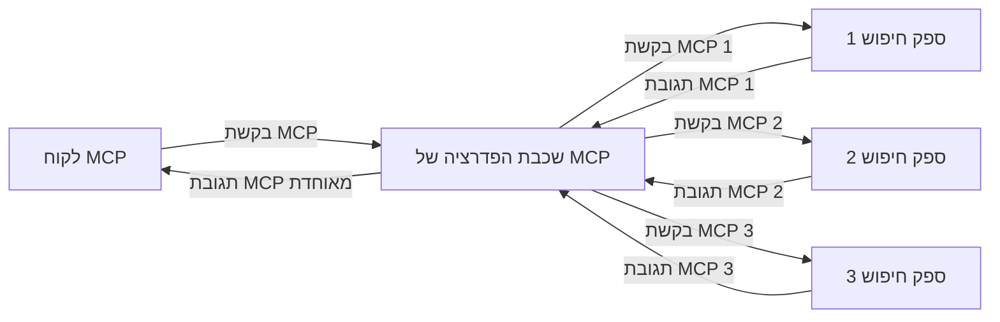
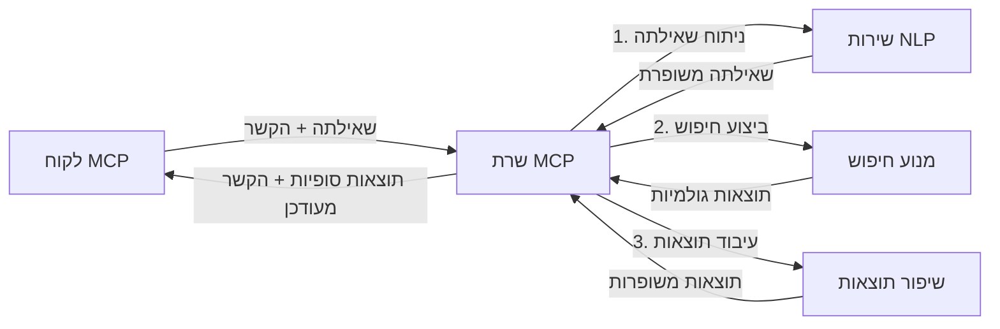

# פרוטוקול הקשר מודלי לחיפוש אינטרנט בזמן אמת

## סקירה כללית

חיפוש אינטרנט בזמן אמת הפך להיות חיוני בסביבת המידע של היום, שבה יש צורך בגישה מיידית למידע עדכני ברחבי האינטרנט כדי לספק תגובות רלוונטיות ובעיתיות. פרוטוקול הקשר מודלי (MCP) מייצג התקדמות משמעותית באופטימיזציה של תהליכי החיפוש בזמן אמת, משפר את היעילות בחיפוש, שומר על שלמות ההקשר ומשפר את ביצועי המערכת הכוללים.

מודול זה בוחן כיצד MCP משנה את חיפוש האינטרנט בזמן אמת על ידי מתן גישה סטנדרטית לניהול הקשר בין מודלים של בינה מלאכותית, מנועי חיפוש ויישומים.

### מה תלמדו

במדריך המקיף הזה תגלו:

- כיצד MCP יוצר גשר חלק בין מודלים של בינה מלאכותית ליכולות חיפוש אינטרנט בזמן אמת
- דפוסי ארכיטקטורה ליישום פתרונות חיפוש יעילים וניתנים להרחבה עם MCP
- טכניקות לשמירת הקשר חיפוש לאורך מספר שאילתות ואינטראקציות
- יישומים מעשיים בקוד בפייתון וב-JavaScript לתרחישי חיפוש שונים
- שיטות לאיזון בין רלוונטיות, עדכניות וביצועים במערכות חיפוש מבוססות MCP

## מבוא לחיפוש אינטרנט בזמן אמת

חיפוש אינטרנט בזמן אמת הוא גישה טכנולוגית שמאפשרת שאילתות, עיבוד וניתוח מידע מבוסס אינטרנט באופן רציף כאשר הוא מתפרסם או מתעדכן, ונותן למערכות לספק מידע טרי ורלוונטי עם השהייה מינימלית. בשונה ממערכות חיפוש מסורתיות הפועלות על מידע מונפק המבוצע שיכול להיות מספר שעות או ימים ישנים, חיפוש בזמן אמת מעבד נתונים חיים מהאינטרנט, ומספק תובנות ומידע המשקפים את מצב התוכן המקוון הנוכחי.

### מושגי יסוד בחיפוש אינטרנט בזמן אמת:

- **עיבוד שאילתות רציף**: שאילתות חיפוש מעובדות מול מקורות נתונים המתעדכנים כל הזמן
- **עדיפות לעדכניות**: המערכות מתוכננות לתת עדיפות למידע טרי
- **איזון רלוונטיות**: שמירת איזון בין רלוונטיות לבין עדכניות
- **ארכיטקטורה ניתנת להרחבה**: המערכות חייבות להתמודד עם עומסי שאילתות משתנים ונפחי נתונים משתנים
- **הבנת הקשר**: שמירת הקשר עם המשתמש לאורך איטרציות החיפוש חיונית לתוצאות משמעותיות
- **רפורמולציה דינמית של שאילתות**: שינוי אדפטיבי של שאילתות בהתבסס על הקשר ותוצאות קודמות
- **אינטגרציה מרובת מקורות**: שילוב תוצאות מספקי חיפוש ומקורות אינטרנט שונים
- **הבנת סמנטיקה**: עיבוד שאילתות ותוכן בהתבסס על משמעות במקום רק מילות מפתח
- **דירוג בזמן אמת**: התאמת דירוג התוצאות בצורה רציפה כאשר מידע חדש זמין

### פרוטוקול הקשר מודלי והחיפוש בזמן אמת באינטרנט

פרוטוקול הקשר מודלי (MCP) מתמודד עם כמה אתגרים קריטיים בסביבות חיפוש אינטרנט בזמן אמת:

1. **שמירת הקשר חיפוש**: MCP מסטנדרט כיצד לשמור על הקשר לאורך רכיבי חיפוש מבוזרים, ומבטיח שלמודלי הבינה המלאכותית ולצמתים העיבוד יהיה גישה להיסטוריית שאילתות רלוונטית והעדפות משתמש.

2. **ניהול שאילתות יעיל**: על ידי מתן מנגנונים מובנים להעברת הקשר, MCP מפחית את העומס של חזרה על ההקשר בכל איטרציית חיפוש.

3. **אינטרופרביליות**: MCP יוצר שפה משותפת לשיתוף הקשר בין טכנולוגיות חיפוש שונות ומודלי בינה מלאכותית, ומאפשר ארכיטקטורות גמישות ומודולריות יותר.

4. **הקשר מותאם לחיפוש**: יישומי MCP יכולים לתת עדיפות לאלמנטים בהקשר שהם הכי רלוונטיים לחיפוש יעיל, באופטימיזציה גם של הביצועים וגם של הדיוק.

5. **עיבוד חיפוש אדפטיבי**: עם ניהול הקשר מתאים באמצעות MCP, מערכות החיפוש יכולות להתאים את העיבוד בצורה דינמית על סמך צרכי משתמש משתנים ונופי מידע.

ביישומים מודרניים מגביה חדשות ועד לעוזרי מחקר, השילוב של MCP עם טכנולוגיות חיפוש אינטרנט מאפשר חיפוש אינטיליגנטי יותר, מודע להקשר, היכול לספק תוצאות רלוונטיות יותר ככל שהאינטראקציות עם המשתמש נמשכות.

## יעדי למידה

בסיום השיעור תוכלו:

- להבין את יסודות החיפוש באינטרנט בזמן אמת ואת האתגרים שלו ביישומים מודרניים
- להסביר כיצד פרוטוקול הקשר מודלי (MCP) משפר את יכולות החיפוש בזמן אמת
- ליישם פתרונות חיפוש מבוססי MCP באמצעות מסגרות עבודה ו-API פופולריים
- לתכנן ולפרוס ארכיטקטורות חיפוש ניתנות להרחבה וביצועים גבוהים עם MCP
- ליישם את מושגי MCP בתרחישים שונים כולל חיפוש סמנטי, סיוע מחקר ודפדוף בשילוב בינה מלאכותית
- להעריך מגמות מתפתחות וחדשנות עתידית בטכנולוגיות חיפוש מבוססות MCP
- לפתח מערכות חיפוש מודעות להקשר שלומדות מאינטראקציות משתמש
- לשלב יכולות חיפוש אינטרנט בעוזרי בינה מלאכותית באמצעות פרוטוקולים סטנדרטיים של MCP
- ליצור צינורות חיפוש מרובי שלבים שמחדדים תוצאות בהדרגה בהתבסס על ההקשר
- לאופטם ביצועי חיפוש תוך שמירת מודעות הקשר מקיפה

### הגדרה וחשיבות

חיפוש אינטרנט בזמן אמת כולל שאילתות, אחזור וספק מידע מבוסס אינטרנט עם השהייה מינימלית. בשונה ממנועי חיפוש מסורתיים שסורקים ואינדקסים את האינטרנט תקופתית, חיפוש בזמן אמת שואף לחשוף מידע כשהוא זמין, ומאפשר גישה מיידית לתוכן הכי עדכני.

מאפיינים מרכזיים של חיפוש אינטרנט בזמן אמת כוללים:

- **טריות**: עדיפות לתוכן ועידכונים חדשים
- **עיבוד רציף**: ניטור מתמיד אחר מידע חדש
- **התאמת שאילתות**: שיפור שאילתות חיפוש בהתבסס על ההקשר ומשוב
- **ספק מיידי**: מתן תוצאות חיפוש עם עיכוב מינימלי
- **שימור הקשר**: בנייה על שאילתות קודמות לשיפור הרלוונטיות

### אתגרים בחיפוש אינטרנט מסורתי

גישות חיפוש אינטרנט מסורתיות נתקלות במגבלות רבות כאשר מיושמות בתרחישי זמן אמת:

1. **פירוק ההקשר**: קושי בשמירת הקשר חיפוש לאורך מספר שאילתות
2. **טריות מידע**: אתגרים בגישה ובמתן עדיפות למידע הכי עדכני
3. **מורכבות אינטגרציה**: בעיות באינטרופרביליות בין מערכות חיפוש ויישומים
4. **בעיות השהייה**: איזון בין חיפוש מקיף לדרישות זמן תגובה
5. **כיול רלוונטיות**: הבטחת דיוק ורלוונטיות תוך מתן עדיפות לעדכניות

## הבנת פרוטוקול הקשר מודלי (MCP) לחיפוש

### מהו MCP בהקשרי חיפוש?

פרוטוקול הקשר מודלי (MCP) הוא פרוטוקול תקשורת סטנדרטי שמטרתו להקל על אינטראקציה יעילה בין מודלים של בינה מלאכותית ויישומים. בהקשר של חיפוש אינטרנט בזמן אמת, MCP מספק מסגרת ל:

- שמירת הקשר חיפוש לאורך רצפי שאילתות
- סטנדרטיזציה של פורמטים של שאילתות ותוצאות חיפוש
- אופטימיזציה של שידור פרמטרים ותוצאות חיפוש
- שיפור תקשורת בין מודלים למנועי חיפוש

### רכיבים מרכזיים וארכיטקטורה

ארכיטקטורת MCP לחיפוש אינטרנט בזמן אמת כוללת מספר רכיבים מרכזיים:

1. **מגני הקשר לשאילתות**: ניהול ושמירת הקשר חיפוש לאורך שאילתות מרובות
2. **מעבדי חיפוש**: עיבוד בקשות חיפוש נכנסות באמצעות טכניקות מודעות להקשר
3. **מתאמי פרוטוקול**: המרת בין API חיפוש שונים תוך שמירת הקשר
4. **מאגר הקשר**: אחסון ושליפה יעילים של היסטוריית חיפוש והעדפות
5. **מחברי חיפוש**: חיבור למנועי חיפוש ו-API אינטרנט שונים


### כיצד MCP משפר את חיפוש האינטרנט בזמן אמת

MCP מתמודד עם אתגרים בחיפוש אינטרנט מסורתי באמצעות:

- **המשכיות הקשר**: שמירת הקשר בין שאילתות לאורך כל מושב החיפוש
- **שידור מותאם**: הפחתת כפילות בפרמטרי חיפוש באמצעות ניהול הקשר חכם
- **ממשקים סטנדרטיים**: מתן APIs עקביים לרכיבי חיפוש
- **הפחתת השהייה**: הקטנת עומס העיבוד באמצעות טיפול יעיל בהקשר
- **רלוונטיות משופרת**: שיפור רלוונטיות החיפוש על ידי שמירת כוונת המשתמש לאורך מספר שאילתות

## אינטגרציה ויישום

מערכות חיפוש אינטרנט בזמן אמת דורשות תכנון ויישום ארכיטקטורלי זהיר לשמירה על ביצועים ושלמות הקשר. פרוטוקול הקשר מודלי מציע גישה סטנדרטית לשילוב מודלים של בינה מלאכותית וטכנולוגיות חיפוש, ומאפשר צינורות חיפוש מתוחכמים ומודעי הקשר.

### סקירת אינטגרציית MCP בארכיטקטורות חיפוש

יישום MCP בסביבות חיפוש אינטרנט בזמן אמת כולל כמה שיקולים מרכזיים:

1. **סיריאליזציה של הקשר חיפוש**: MCP מספק מנגנונים יעילים לקידוד מידע הקשר בתוך בקשות חיפוש, ומבטיח שההקשר החיוני נלווה לשאילתה לאורך צינור העיבוד. זה כולל פורמטים סטנדרטיים של סיריאליזציה המותאמים למטא-דטה הקשור לחיפוש.

2. **עיבוד חיפוש מדינמי ושמורי מצב**: MCP מאפשר עיבוד מדינמי ושמירה על ייצוג הקשר קבוע לאורך איטרציות חיפוש. זה יקר ערך במיוחד בצינורות חיפוש מרובי שלבים שבהם שיפור ההקשר מביא לתוצאות טובות יותר.

3. **הרחבה ושיפור שאילתות**: יישומי MCP במערכות חיפוש יכולים לסייע בהרחבה מתוחכמת ושיפור שאילתות בהתבסס על ההקשר שנצבר, ומאפשרים תוצאות רלוונטיות יותר ככל שמושב החיפוש מתקדם.

4. **מטמון תוצאות ומתן עדיפות**: על ידי סטנדרטיזציה של טיפול בהקשר, MCP מסייע בניהול מטמון תוצאות ומתן עדיפויות, ומאפשר לרכיבים להתאים עצמם בהתאם להקשר החיפוש המשתנה.

5. **פדרציה ואגרגציה של חיפוש**: MCP מאפשר פדרציה מתוחכמת יותר של חיפוש על פני מספר מערכות בסיס על ידי מתן ייצוגים מובנים של הקשר חיפוש, ומאפשר אגרגציה משמעותית יותר של תוצאות ממקורות מגוונים.

יישום MCP בטכנולוגיות חיפוש שונות יוצר גישה אחידה לניהול הקשר, ומפחית את הצורך בקוד אינטגרציה מותאם בזמן שמשפר את יכולת המערכת לשמור על הקשר משמעותי ככל שהשאילתות מתפתחות.

### MCP ביישומי חיפוש אינטרנט שונים

דוגמאות אלו עוקבות אחרי מפרט MCP הנוכחי שמתרכז בפרוטוקול JSON-RPC עם מנגנוני הובלה מובחנים. הקוד מדגים כיצד ניתן ליישם אינטגרציות חיפוש מותאמות תוך שמירה על תאימות מלאה לפרוטוקול MCP.


<details>
<summary>יישום בפייתון עם API חיפוש גנרי</summary>

```python
import asyncio
import json
import aiohttp
from typing import Dict, Any, Optional, List
from contextlib import asynccontextmanager
from collections.abc import AsyncIterator

# ייבא ספריות MCP סטנדרטיות
from mcp.client.session import ClientSession
from mcp.client.streamable_http import streamablehttp_client
from mcp.types import TextContent, CreateMessageRequestParams, CreateMessageResult
from mcp.server.fastmcp import FastMCP

# צור שרת FastMCP עבור חיפוש באינטרנט
search_server = FastMCP("WebSearch")

# מחלקה לטיפול בפעולות חיפוש באינטרנט
class WebSearchHandler:
    def __init__(self, api_endpoint: str, api_key: str):
        self.api_endpoint = api_endpoint
        self.api_key = api_key
        self.session = None
        
    async def initialize(self):
        """Initialize the HTTP session"""
        self.session = aiohttp.ClientSession(
            headers={"Authorization": f"Bearer {self.api_key}"}
        )
    
    async def close(self):
        """Close the HTTP session"""
        if self.session:
            await self.session.close()
            
    async def perform_search(self, query: str, max_results: int = 5, 
                           include_domains: List[str] = None, 
                           exclude_domains: List[str] = None,
                           time_period: str = "any") -> Dict[str, Any]:
        """Perform web search using the search API"""
        # לבנות פרמטרים לחיפוש
        search_params = {
            "q": query,
            "limit": max_results,
            "time": time_period
        }
        
        if include_domains:
            search_params["site"] = ",".join(include_domains)
            
        if exclude_domains:
            search_params["exclude_site"] = ",".join(exclude_domains)
        
        # בצע את בקשת החיפוש
        try:
            async with self.session.get(
                self.api_endpoint,
                params=search_params
            ) as response:
                if response.status != 200:
                    error_text = await response.text()
                    raise Exception(f"Search API error: {response.status} - {error_text}")
                
                search_data = await response.json()
                
                # המרת תגובה ספציפית ל-API לפורמט סטנדרטי
                results = []
                for item in search_data.get("results", []):
                    results.append({
                        "title": item.get("title", ""),
                        "url": item.get("url", ""),
                        "snippet": item.get("snippet", ""),
                        "date": item.get("published_date", ""),
                        "source": item.get("source", "")
                    })
                
                return {
                    "query": query,
                    "totalResults": len(results),
                    "results": results
                }
        except Exception as e:
            print(f"Search API request error: {e}")
            raise

# אתחל את מטפל החיפוש
search_handler = WebSearchHandler(
    api_endpoint="https://api.search-service.example/search",
    api_key="your-api-key-here"
)

# הגדר אורך חיים לניהול מטפל החיפוש
@asyncio.asynccontextmanager
async def app_lifespan(server: FastMCP):
    """Manage application lifecycle"""
    await search_handler.initialize()
    try:
        yield {"search_handler": search_handler}
    finally:
        await search_handler.close()

# הגדר אורך חיים לשרת
search_server = FastMCP("WebSearch", lifespan=app_lifespan)

# רישום כלי חיפוש באינטרנט
@search_server.tool()
async def web_search(query: str, max_results: int = 5, 
                   include_domains: List[str] = None,
                   exclude_domains: List[str] = None,
                   time_period: str = "any") -> Dict[str, Any]:
    """
    Search the web for information
    
    Args:
        query: The search query
        max_results: Maximum number of results to return (default: 5)
        include_domains: List of domains to include in search results
        exclude_domains: List of domains to exclude from search results
        time_period: Time period for results ("day", "week", "month", "any")
        
    Returns:
        Dictionary containing search results
    """
    ctx = search_server.get_context()
    search_handler = ctx.request_context.lifespan_context["search_handler"]
    
    results = await search_handler.perform_search(
        query=query,
        max_results=max_results,
        include_domains=include_domains,
        exclude_domains=exclude_domains,
        time_period=time_period
    )
    
    return results

# דוגמת שימוש של לקוח
async def client_example():
    # התחבר לשרת החיפוש באמצעות תחבורה HTTP סטרימבלית
    async with streamablehttp_client("http://localhost:8000/mcp") as (read, write, _):
        async with ClientSession(read, write) as session:
            # אתחל את החיבור
            await session.initialize()
            
            # קרא לכלי חיפוש באינטרנט
            search_results = await session.call_tool(
                "web_search", 
                {
                    "query": "latest developments in AI and Model Context Protocol",
                    "max_results": 5,
                    "time_period": "day",
                    "include_domains": ["github.com", "microsoft.com"]
                }
            )
            
            print(f"Search results: {search_results}")

# דוגמת הרצת שרת
if __name__ == "__main__":
    # הפעל את השרת עם תחבורה HTTP סטרימבלית
    search_server.run(transport="streamable-http")
```
</details> 

<details>
<summary>יישום ב-JavaScript עם חיפוש בדפדפן</summary>


```javascript
// מימוש שרת MCP עבור חיפוש באינטרנט
import { McpServer, ResourceTemplate } from '@modelcontextprotocol/sdk/server/mcp.js';
import { StreamableHTTPServerTransport } from '@modelcontextprotocol/sdk/server/streamableHttp.js';
import { z } from 'zod';

// יצירת שרת MCP עבור חיפוש באינטרנט
const searchServer = new McpServer({
    name: "BrowserSearch",
    description: "A server that provides web search capabilities"
});

// מחלקת שירות חיפוש
class SearchService {
    constructor(searchApiUrl, apiKey) {
        this.searchApiUrl = searchApiUrl;
        this.apiKey = apiKey;
    }

    async performSearch(parameters) {
        const {
            query = '',
            maxResults = 5,
            includeDomains = [],
            excludeDomains = [],
            timePeriod = 'any'
        } = parameters;
        
        // בניית כתובת חיפוש עם פרמטרים
        const url = new URL(this.searchApiUrl);
        url.searchParams.append('q', query);
        url.searchParams.append('limit', maxResults);
        url.searchParams.append('time', timePeriod);
        
        if (includeDomains.length > 0) {
            url.searchParams.append('site', includeDomains.join(','));
        }
        
        if (excludeDomains.length > 0) {
            url.searchParams.append('exclude_site', excludeDomains.join(','));
        }
        
        try {
            const response = await fetch(url.toString(), {
                method: 'GET',
                headers: {
                    'Authorization': `Bearer ${this.apiKey}`,
                    'Content-Type': 'application/json'
                }
            });
            
            if (!response.ok) {
                const errorText = await response.text();
                throw new Error(`Search API error: ${response.status} - ${errorText}`);
            }
            
            const searchData = await response.json();
            
            // המרת תגובת API ספציפית לפורמט סטנדרטי
            const results = searchData.results?.map(item => ({
                title: item.title || '',
                url: item.url || '',
                snippet: item.snippet || '',
                date: item.published_date || '',
                source: item.source || ''
            })) || [];
            
            return {
                query,
                totalResults: results.length,
                results
            };
        } catch (error) {
            console.error('Search API request error:', error);
            throw error;
        }
    }
}

// אתחול שירות החיפוש
const searchService = new SearchService(
    'https://api.search-service.example/search',
    'your-api-key-here'
);

// הגדרת ספק הקשר עבור השרת
searchServer.setContextProvider(() => {
    return {
        searchService
    };
});

// רישום כלי חיפוש באינטרנט
searchServer.tool({
    name: 'web_search',
    description: 'Search the web for information',
    parameters: {
        type: 'object',
        properties: {
            query: {
                type: 'string',
                description: 'The search query'
            },
            maxResults: {
                type: 'integer',
                description: 'Maximum number of results to return',
                default: 5
            },
            includeDomains: {
                type: 'array',
                items: { type: 'string' },
                description: 'List of domains to include in search results'
            },
            excludeDomains: {
                type: 'array',
                items: { type: 'string' },
                description: 'List of domains to exclude from search results'
            },
            timePeriod: {
                type: 'string',
                description: 'Time period for results',
                enum: ['day', 'week', 'month', 'any'],
                default: 'any'
            }
        },
        required: ['query']
    },
    handler: async (params, context) => {
        const { searchService } = context;
        return await searchService.performSearch(params);
    }
});

// דוגמת קוד לקוח להתחברות לשרת החיפוש
import { Client } from '@modelcontextprotocol/sdk/client/index.js';
import { StreamableHTTPClientTransport } from '@modelcontextprotocol/sdk/client/streamableHttp.js';

async function connectToSearchServer() {
    // התחברות לשרת החיפוש
    const transport = new StreamableHTTPClientTransport(
        new URL('http://localhost:8000/mcp')
    );
    
    const client = new Client({
        name: 'search-client',
        version: '1.0.0'
    });
    
    await client.connect(transport);
    
    // ביצוע כלי החיפוש
    const searchResults = await client.callTool({
        name: 'web_search',
        arguments: {
            query: 'Model Context Protocol implementation examples',
            maxResults: 10,
            timePeriod: 'week',
            includeDomains: ['github.com', 'docs.microsoft.com']
        }
    });
    
    console.log('Search results:', searchResults);
    
    // ניקוי
    await client.disconnect();
}

// הפעלת השרת
const transport = new StreamableHTTPServerTransport();
await searchServer.connect(transport);
console.log('Search server running at http://localhost:8000/mcp');

// בתהליך נפרד או לאחר שהשרת הופעל
// connectToSearchServer().catch(console.error);
```
</details> 


## הודעה בדבר דוגמאות קוד

> **הערה חשובה**: דוגמאות הקוד שלהלן מראות את השילוב של פרוטוקול הקשר מודלי (MCP) עם פונקציונליות חיפוש באינטרנט. על אף שהן עוקבות אחרי דפוסים ומבנים של ערכות הפיתוח הרשמיות של MCP, הן מפושטות לצורכי לימוד.
> 
> דוגמאות אלו מציגות:
> 
> 1. **יישום בפייתון**: יישום שרת FastMCP המספק כלי חיפוש אינטרנטי ומתחבר ל-API חיפוש חיצוני. הדוגמה מראה ניהול תקופת חיים נכון, טיפול בהקשר ויישום כלים בהתאם לדפוסי [ערכת הפיתוח הרשמית של MCP לפייתון](https://github.com/modelcontextprotocol/python-sdk). השרת משתמש בהובלה HTTP מסוג Streamable המומלצת שהחליפה את הובלת SSE הישנה לפריסות ייצור.
> 
> 2. **יישום ב-JavaScript**: יישום TypeScript/JavaScript המשתמש בדפוס FastMCP מתוך [ערכת הפיתוח הרשמית של MCP ל-TypeScript](https://github.com/modelcontextprotocol/typescript-sdk) ליצירת שרת חיפוש עם הגדרות כלים נכונות וחיבורים ללקוחות. הוא עוקב אחרי דפוסים מומלצים לניהול מושבים ושמירת הקשר.
> 
> דוגמאות אלו ידרשו טיפול נוסף בשגיאות, אימות וקוד אינטגרציה ספציפי ל-API לשימוש בייצור. נקודות קצה של API החיפוש המוצגות (`https://api.search-service.example/search`) הן מחוות מקום ויש להחליפן בנקודות קצה אמיתיות של שירותי חיפוש.
> 
> לפרטים מלאים על היישום והשיטות העדכניות ביותר, יש לעיין ב[מפרט MCP הרשמי](https://spec.modelcontextprotocol.io/) ובתיעוד ערכות הפיתוח.

## מושגי יסוד

### מסגרת פרוטוקול הקשר מודלי (MCP)

בבסיסו, הפרוטוקול מספק דרך סטנדרטית למודלי בינה מלאכותית, יישומים ושירותים להחלפת הקשר. בחיפוש אינטרנט בזמן אמת, מסגרת זו חיונית ליצירת חוויות חיפוש מרובות סבבים וקשורות. רכיבים מרכזיים כוללים:

1. **ארכיטקטורת לקוח-שרת**: MCP מייצר הפרדה ברורה בין לקוחות חיפוש (מבקשים) לבין שרתי חיפוש (ספקים), מאפשר מודלים גמישים לפריסה.

2. **תקשורת JSON-RPC**: הפרוטוקול משתמש ב-JSON-RPC להחלפת הודעות, מה שהופך אותו לתואם לטכנולוגיות רשת וקל ליישום בפלטפורמות שונות.

3. **ניהול הקשר**: MCP מגדיר שיטות מובנות לשמירה, עדכון וניצול הקשר חיפוש לאורך אינטראקציות מרובות.

4. **הגדרות כלים**: יכולות החיפוש נחשפות ככלים סטנדרטיים עם פרמטרים מוגדרים היטב וערכי החזרה.

5. **תמיכה בזרימה**: הפרוטוקול תומך בזרימת תוצאות, הכרחית לחיפוש בזמן אמת שם תוצאות יכולות להגיע בהדרגה.

### דפוסי אינטגרציית חיפוש אינטרנט

כאשר משלבים MCP עם חיפוש אינטרנט, עולים מספר דפוסים:

#### 1. אינטגרציה ישירה עם ספק חיפוש


בדפוס זה, שרת MCP מתקשר ישירות עם אחד או יותר ממשקי API של חיפוש, מתרגם בקשות MCP לקריאות API ספציפיות ומעצב את התוצאות כתגובות MCP.

#### 2. חיפוש פדרטיבי עם שמירת הקשר



דפוס זה מפזר שאילתות חיפוש בין מספר ספקי חיפוש תואמי MCP, שיכולים להתמחות בסוגי תוכן או יכולות חיפוש שונים, תוך שמירת הקשר אחיד.

#### 3. שרשרת חיפוש משופרת בהקשר



בדפוס זה, תהליך החיפוש מחולק למספר שלבים, כאשר ההקשר מועשר בכל שלב, מה שמביא לתוצאות רלוונטיות יותר בהדרגה.

### רכיבי הקשר חיפוש

בחיפוש אינטרנט מבוסס MCP, ההקשר כולל בדרך כלל:

- **היסטורית שאילתות**: שאילתות חיפוש קודמות במושב
- **העדפות משתמש**: שפה, אזור, הגדרות חיפוש בטוח
- **היסטורית אינטראקציה**: אילו תוצאות נלחצו, זמן שהייה על תוצאות
- **פרמטרי חיפוש**: מסננים, סדרי מיון ומודיפיקטורים אחרים לחיפוש
- **ידע תחומי**: הקשר ספציפי לנושא הרלוונטי לחיפוש
- **הקשר זמני**: גורמי רלוונטיות מבוססי זמן
- **העדפות מקור**: מקורות מידע מהימנים או מועדפים

## מקרי שימוש ויישומים

### מחקר ואיסוף מידע

MCP משפר את זרימות העבודה במחקר על ידי:

- שמירת הקשר מחקרי לאורך מושבי חיפוש
- הפעלת שאילתות מתוחכמות ורלוונטיות להקשר
- תמיכה בפדרציה מרובת מקורות לחיפוש
- הקלת הוצאת ידע מתוצאות חיפוש

### ניטור חדשות ומגמות בזמן אמת

חיפוש מבוסס MCP מציע יתרונות לניטור חדשות:

- גילוי בזמן כמעט-אמת של סיפורי חדשות עולים
- סינון הקשר של מידע רלוונטי
- מעקב אחר נושאים ויישויות לאורך מקורות מרובים
- התראות חדשות מותאמות אישית על בסיס הקשר משתמש

### דפדוף ומחקר בתמיכת בינה מלאכותית

MCP יוצר אפשרויות חדשות לדפדוף בסיוע בינה מלאכותית:

- הצעות חיפוש הקשריות בהתבסס על פעילות הדפדפן הנוכחית
- אינטגרציה חלקה של חיפוש אינטרנט עם עוזרים המונעים על ידי LLM
- שיפור חיפוש מרובה סבבים עם שמירת הקשר
- שיפור אימות עובדות ואימות מידע

## מגמות וחדשנות עתידית

### התפתחות MCP בחיפוש אינטרנט

מבט לעתיד, אנו צופים ש-MCP יתפתח כדי להתמודד עם:


- **חיפוש מולטימודלי**: שילוב חיפוש טקסט, תמונה, אודיו ווידאו עם שמירת ההקשר  
- **חיפוש מבוזר**: תמיכה במערכות אקוסיסטם של חיפוש מבוזר ומאוחד  
- **פרטיות בחיפוש**: מנגנוני חיפוש לשמירת פרטיות המודעים להקשר  
- **הבנת שאילתות**: ניתוח סמנטי עמוק של שאילתות חיפוש בשפה טבעית  

### התפתחויות טכנולוגיות פוטנציאליות  

טכנולוגיות מתפתחות שיעצבו את עתיד החיפוש ב-MCP:  

1. **ארכיטקטורות חיפוש נוירוניות**: מערכות חיפוש מבוססות הטמעה המותאמות ל-MCP  
2. **הקשר חיפוש מותאם אישית**: למידת דפוסי חיפוש של משתמשים בודדים לאורך זמן  
3. **אינטגרציה עם גרף ידע**: חיפוש בהקשר משופר באמצעות גרפי ידע ספציפיים לתחום  
4. **הקשר חוצה מודאליות**: שמירת הקשר בין מצבי חיפוש שונים  

## תרגילים מעשיים  

### תרגיל 1: הקמת צינור חיפוש בסיסי ב-MCP  

בתרגיל זה תלמדו כיצד:  
- לקונפיגורציה של סביבת חיפוש בסיסית ב-MCP  
- ליישם מטפלי הקשר עבור חיפוש אינטרנט  
- לבדוק ולאמת את שמירת ההקשר לאורך איטרציות החיפוש  

### תרגיל 2: בניית עוזר מחקר עם חיפוש ב-MCP  

צרו יישום שלם ש:  
- מעבד שאלות מחקר בשפה טבעית  
- מבצע חיפושים אינטרנטיים המותאמים להקשר  
- מסנתז מידע ממספר מקורות  
- מציג ממצאי מחקר מאורגנים  

### תרגיל 3: יישום פדרציית חיפוש ממקורות מרובים עם MCP  

תרגיל מתקדם הכולל:  
- ניתוב שאילתות המודע להקשר למנועי חיפוש מרובים  
- דירוג ואגרגציה של תוצאות  
- הסרה כפילות הקשרית של תוצאות החיפוש  
- טיפול במטא-נתונים ספציפיים למקור  

## משאבים נוספים  

- [Model Context Protocol Specification](https://spec.modelcontextprotocol.io/) - מפרט MCP רשמי ותיעוד פרוטוקול מפורט  
- [Model Context Protocol Documentation](https://modelcontextprotocol.io/) - מדריכים מפורטים ומדריכי יישום  
- [MCP Python SDK](https://github.com/modelcontextprotocol/python-sdk) - מימוש רשמי בפייתון לפרוטוקול MCP  
- [MCP TypeScript SDK](https://github.com/modelcontextprotocol/typescript-sdk) - מימוש רשמי ב-TypeScript לפרוטוקול MCP  
- [MCP Reference Servers](https://github.com/modelcontextprotocol/servers) - מימושים לדוגמה של שרתי MCP  
- [Bing Web Search API Documentation](https://learn.microsoft.com/en-us/bing/search-apis/bing-web-search/overview) - ממשק API של חיפוש אינטרנט של מייקרוסופט  
- [Google Custom Search JSON API](https://developers.google.com/custom-search/v1/overview) - מנוע חיפוש תכנותי של גוגל  
- [SerpAPI Documentation](https://serpapi.com/search-api) - API של דף תוצאות מנוע חיפוש  
- [Meilisearch Documentation](https://www.meilisearch.com/docs) - מנוע חיפוש קוד פתוח  
- [Elasticsearch Documentation](https://www.elastic.co/guide/index.html) - מנוע חיפוש וניתוח מבוזר  
- [LangChain Documentation](https://python.langchain.com/docs/get_started/introduction) - בניית יישומים עם LLM  

## תוצאות הלמידה  

עם השלמת מודול זה תוכלו:  

- להבין את היסודות של חיפוש אינטרנט בזמן אמת ואת האתגרים שלו  
- להסביר כיצד פרוטוקול Model Context Protocol (MCP) משפר יכולות חיפוש אינטרנטי בזמן אמת  
- ליישם פתרונות חיפוש מבוססי MCP באמצעות מסגרות עבודה ו-API פופולריים  
- לתכנן ולפרוס ארכיטקטורות חיפוש מתקדמות, בעלות ביצועים גבוהים וסקלאביליות עם MCP  
- ליישם מושגי MCP לשימושים שונים כולל חיפוש סמנטי, סיוע במחקר וגלישה משופרת בינה מלאכותית  
- להעריך מגמות מתפתחות וחדשנות עתידית בטכנולוגיות חיפוש מבוססות MCP  


### שיקולי אמון ובטיחות  

בעת יישום פתרונות חיפוש אינטרנט מבוססי MCP, יש לזכור את העקרונות החשובים האלו מהגדרות MCP:  

1. **הסכמת משתמש ושליטה**: המשתמשים חייבים להסכים במפורש ולהבין את כל גישות הנתונים והפעולות. זה חשוב במיוחד ביישומי חיפוש אינטרנט שעשויים לגשת למקורות נתונים חיצוניים.  

2. **פרטיות נתונים**: יש להבטיח טיפול מתאים בשאילתות ותוצאות החיפוש, בפרט כאשר הן עלולות להכיל מידע רגיש. ליישם בקרות גישה מתאימות להגנת נתוני המשתמש.  

3. **בטיחות הכלים**: ליישם אימות והרשאה נאותים לכלי החיפוש, כיוון שהם עלולים להוות סיכון אבטחה דרך הרצת קוד שרירותי. תיאורי התנהגות הכלים יש להיחשב כאינם מהימנים אלא אם התקבלו משרת אמין.  

4. **תיעוד ברור**: לספק תיעוד ברור לגבי יכולות, מגבלות ושיקולי אבטחה ביישום חיפוש מבוסס MCP, בהתאם להנחיות היישום מפרוטוקול MCP.  

5. **זרימות הסכמה יציבות**: לבנות זרימות הסכמה והרשאה יציבות שמסבירות באופן ברור כל כלי לפני אישור השימוש בו, במיוחד כלים שמתממשקים למשאבי אינטרנט חיצוניים.  

לפרטים מלאים על אבטחה ושיקולי אמון ב-MCP, עיינו ב-[התיעוד הרשמי](https://modelcontextprotocol.io/specification/2025-11-25/basic/security_best_practices).  

## מה הלאה  

- [5.12 אימות Entra ID עבור שרתי Model Context Protocol](../mcp-security-entra/README.md)  

---

<!-- CO-OP TRANSLATOR DISCLAIMER START -->
**כתב ויתור**:
מסמך זה תורגם באמצעות שירות תרגום אוטומטי [Co-op Translator](https://github.com/Azure/co-op-translator). למרות שאנו שואפים לדיוק, יש לקחת בחשבון שתרגומים אוטומטיים עלולים להכיל שגיאות או אי-דיוקים. יש להחשיב את המסמך המקורי בשפתו הטבעית כמקור הסמכות. למידע קריטי מומלץ להשתמש בתרגום מקצועי על ידי מתרגם אדם. אנו לא אחראים לכל אי-הבנה או פירוש שגוי הנובע מהשימוש בתרגום זה.
<!-- CO-OP TRANSLATOR DISCLAIMER END -->