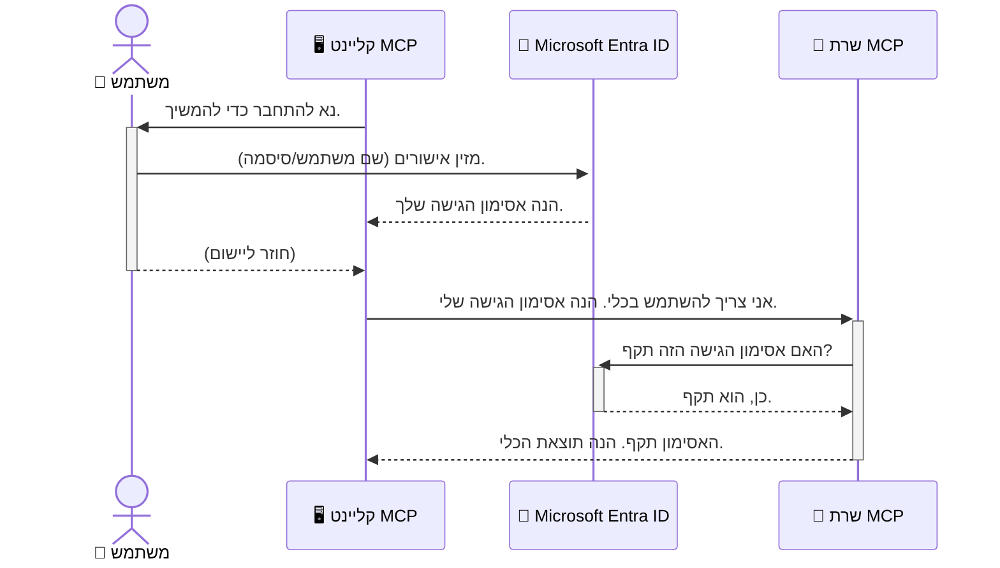

# אבטחת זרימות עבודה של בינה מלאכותית: אימות Entra ID עבור שרתי פרוטוקול הקשר של מודל

> [!NOTE]
> קוד השרת המרוחק בשיעור זה מגן על נקודות קצה ישנות `/sse` ו-`/message`
> ומיועד ל-MCP `2025-11-25`. שמרו על שיטות הזיהוי ואימות הטוקנים שלו,
> אך השתמשו ב-Streamable HTTP תואם ל-`2026-07-28` עבור יישומים חדשים.


## מבוא
אבטחת שרת פרוטוקול הקשר של מודל (MCP) חשובה כמו לנעול את דלת הכניסה לביתך. להשאיר את שרת ה-MCP שלך פתוח חושף את כלים ונתונים לגישה לא מורשית, מה שעלול להוביל לפרצות אבטחה. Microsoft Entra ID מספק פתרון ניהול זהויות וגישה מבוסס ענן חזק, המסייע להבטיח שרק משתמשים ויישומים מורשים יכולים לתקשר עם שרת ה-MCP שלך. בחלק זה תלמד כיצד להגן על זרימות העבודה של הבינה המלאכותית שלך באמצעות אימות Entra ID.

## מטרות למידה
עד לסוף חלק זה, תוכל:

- להבין את חשיבות אבטחת שרתי MCP.
- להסביר את יסודות Microsoft Entra ID ואימות OAuth 2.0.
- להבחין בין לקוחות ציבוריים לסודיים.
- ליישם אימות Entra ID בתרחישים של שרת MCP מקומי (לקוח ציבורי) ומרוחק (לקוח סודי).
- ליישם שיטות אבטחה מיטביות בעת פיתוח זרימות עבודה של בינה מלאכותית.

## אבטחה ו-MCP

כפי שלא היית משאיר את דלת ביתך ללא נעילה, כך אין להשאיר את שרת ה-MCP פתוח לגישה חופשית. אבטחת זרימות העבודה של הבינה המלאכותית חיונית לבניית יישומים חזקים, אמינים ובטוחים. פרק זה יציג כיצד להשתמש ב-Microsoft Entra ID כדי לאבטח את שרתי ה-MCP שלך, ולהבטיח שרק משתמשים ויישומים מורשים יכולים לגשת לכלים ובנתונים שלך.

## למה אבטחה חשובה בשרתי MCP

דמיין שלשרת ה-MCP שלך יש כלי שיכול לשלוח מיילים או לגשת למסד נתונים של לקוחות. שרת לא מאובטח משמעותו שכל אחד יכול להשתמש בכלי זה, דבר שמוביל לגישה לא מורשית לנתונים, ספאם או פעילויות זדוניות אחרות.

על ידי יישום אימות, אתה מבטיח שכל בקשה לשרת שלך תתועד, ובכך מאמת את זהות המשתמש או היישום המבצע את הבקשה. זהו הצעד הראשון והחיוני ביותר לאבטחת זרימות העבודה של הבינה המלאכותית שלך.

## מבוא ל-Microsoft Entra ID

[**Microsoft Entra ID**](https://adoption.microsoft.com/microsoft-security/entra/) היא שירות ניהול זהויות וגישה מבוסס ענן. חשבו עליו כשומר אבטחה אוניברסלי ליישומים שלכם. השירות מטפל בתהליך המורכב של אימות זהויות משתמש (Authentication) וקביעת מה מורשים לעשות (Authorization).

באמצעות Entra ID, תוכל:

- לאפשר כניסה מאובטחת למשתמשים.
- להגן על APIs ושירותים.
- לנהל מדיניות גישה ממקום מרכזי.

עבור שרתי MCP, Entra ID מספק פתרון חזק ואמין לניהול מי יכול לגשת ליכולות השרת.

---

## הבנת הקסם: כיצד פועל אימות Entra ID

Entra ID משתמשת בסטנדרטים פתוחים כמו **OAuth 2.0** כדי לטפל באימות. למרות שהפרטים יכולים להיות מורכבים, הרעיון המרכזי פשוט וניתן להבנה בהשוואה.

### מבוא עדין ל-OAuth 2.0: מפתח הוואלט

דמיין את OAuth 2.0 כמערכת חניה עם פקיד הצוות לרכב שלך. כשאתה מגיע למסעדה, אינך נותן לוואלט את המפתח הראשי שלך. במקום זאת, אתה נותן **מפתח ואלט** עם הרשאות מוגבלות — הוא יכול להניע את הרכב ולנעול את הדלתות, אך לא לפתוח את תא המטען או תא כפפות.

בדימוי זה:

- **אתה** הוא ה-**משתמש**.
- **הרכב שלך** הוא **שרת MCP** עם כליו ונתוניו היקרים.
- **הוואלט** הוא **Microsoft Entra ID**.
- **פקיד החניה** הוא **לקוח MCP** (היישום שמנסה לגשת לשרת).
- **מפתח הוואלט** הוא **טוקן הגישה (Access Token)**.

טוקן הגישה הוא מחרוזת טקסט מאובטחת שהלקוח ב-MCP מקבל מ-Entra ID לאחר כניסה. הלקוח מציג טוקן זה לשרת ה-MCP בכל בקשה. השרת בודק את הטוקן כדי לוודא שהבקשה לגיטימית ושהלקוח מחזיק בהרשאות הנדרשות, וכל זאת ללא צורך לטפל בפרטי הכניסה האמיתיים שלך (כמו סיסמא).

### זרימת האימות

כך התהליך עובד בפועל:



### היכרות עם ספריית האימות של Microsoft (MSAL)

לפני שנצלול לקוד, חשוב להציג מרכיב מרכזי שתראה בדוגמאות: **ספריית האימות של Microsoft (MSAL)**.

MSAL היא ספרייה שפותחה על ידי Microsoft שמקלה מאוד על מפתחים לטפל באימות. במקום שתכתוב את כל הקוד המורכב לטיפול בטוקני אבטחה, ניהול כניסות ורענון סשנים, MSAL מטפלת בכל זאת.

שימוש בספריה כמו MSAL מומלץ מאוד כי:

- **היא מאובטחת:** מממשת פרוטוקולים מקובלים בתעשייה ושיטות אבטחה מיטביות, מה שמפחית סיכוני פגיעות בקוד שלך.
- **פשוטה לפיתוח:** מטשטשת את המורכבות של פרוטוקולי OAuth 2.0 ו-OpenID Connect, ומאפשרת להוסיף אימות חזק ליישום בכמה שורות קוד בלבד.
- **מתוחזקת:** Microsoft מעדכנת ומשפרת את MSAL בקביעות כדי להתמודד עם איומי אבטחה חדשים ושינויים בפלטפורמה.

MSAL תומכת בשפות שונות ובמסגרות יישום רבות, כולל .NET, JavaScript/TypeScript, Python, Java, Go ופלטפורמות מובייל כמו iOS ואנדרואיד. משמעות הדבר היא שאתה יכול להשתמש בתבניות אימות עקביות בכל מערך הטכנולוגיה שלך.

למידע נוסף על MSAL, אפשר לעיין בתיעוד הרשמי [סקירת MSAL](https://learn.microsoft.com/entra/identity-platform/msal-overview).

---

## אבטחת שרת MCP שלך עם Entra ID: מדריך שלב-אחר-שלב

כעת, נלך יחד איך לאבטח שרת MCP מקומי (שמקשר דרך `stdio`) באמצעות Entra ID. דוגמה זו משתמשת ב**לקוח ציבורי**, המתאים ליישומים הפועלים על מחשב משתמש, כמו אפליקציית שולחן עבודה או שרת פיתוח מקומי.

### תרחיש 1: אבטחת שרת MCP מקומי (עם לקוח ציבורי)

בתרחיש זה, נבחן שרת MCP שרץ מקומית, מתקשר דרך `stdio`, ומשתמש ב-Entra ID לאימות המשתמש לפני שזו מקבל גישה לכליו. לשרת יהיה כלי יחיד המושך את פרטי הפרופיל של המשתמש מ-Microsoft Graph API.

#### 1. הגדרת היישום ב-Entra ID

לפני כתיבת קוד, עליך להרשום את היישום שלך ב-Microsoft Entra ID. זה מודיע ל-Entra ID על היישום ומקנה לו הרשאה להשתמש בשירות האימות.

1. עבור אל **[פורטאל Microsoft Entra](https://entra.microsoft.com/)**.
2. עבור ל-**App registrations** ולחץ על **New registration**.
3. תן שם ליישום שלך (למשל, "שרת MCP מקומי שלי").
4. בחר ב-**Supported account types** את האפשרות **Accounts in this organizational directory only**.
5. ניתן להשאיר את **Redirect URI** ריק בדוגמה זו.
6. לחץ על **Register**.

לאחר ההרשמה, רשום את **Application (client) ID** ו-**Directory (tenant) ID**. תזדקק להם בקוד שלך.

#### 2. הקוד: הסבר

נסקור את החלקים המרכזיים בקוד שמטפלים באימות. הקוד המלא לדוגמה נמצא בתיקיית [Entra ID - Local - WAM](https://github.com/Azure-Samples/mcp-auth-servers/tree/main/src/entra-id-local-wam) במאגר [mcp-auth-servers GitHub](https://github.com/Azure-Samples/mcp-auth-servers).

**`AuthenticationService.cs`**

מחלקה זו אחראית לתקשורת עם Entra ID.

- **`CreateAsync`**: שיטה המאתחלת את `PublicClientApplication` מספריית MSAL עם ה-clientId וה-tenantId של היישום שלך.
- **`WithBroker`**: מאפשרת שימוש בברוקר (כמו Windows Web Account Manager) לחוויית כניסה מאובטחת וחלקה.
- **`AcquireTokenAsync`**: השיטה המרכזית שמנסה להשיג טוקן שקט (silent). אם אין, היא מבקשת מהמשתמש להיכנס בצורה אינטראקטיבית.

```csharp
// Simplified for clarity
public static async Task<AuthenticationService> CreateAsync(ILogger<AuthenticationService> logger)
{
    var msalClient = PublicClientApplicationBuilder
        .Create(_clientId) // Your Application (client) ID
        .WithAuthority(AadAuthorityAudience.AzureAdMyOrg)
        .WithTenantId(_tenantId) // Your Directory (tenant) ID
        .WithBroker(new BrokerOptions(BrokerOptions.OperatingSystems.Windows))
        .Build();

    // ... cache registration ...

    return new AuthenticationService(logger, msalClient);
}

public async Task<string> AcquireTokenAsync()
{
    try
    {
        // Try silent authentication first
        var accounts = await _msalClient.GetAccountsAsync();
        var account = accounts.FirstOrDefault();

        AuthenticationResult? result = null;

        if (account != null)
        {
            result = await _msalClient.AcquireTokenSilent(_scopes, account).ExecuteAsync();
        }
        else
        {
            // If no account, or silent fails, go interactive
            result = await _msalClient.AcquireTokenInteractive(_scopes).ExecuteAsync();
        }

        return result.AccessToken;
    }
    catch (Exception ex)
    {
        _logger.LogError(ex, "An error occurred while acquiring the token.");
        throw; // Optionally rethrow the exception for higher-level handling
    }
}
```

**`Program.cs`**

כאן מוגדר שרת ה-MCP ושירות האימות משתלב בו.

- **`AddSingleton<AuthenticationService>`**: רושם את `AuthenticationService` במיכל התלות, כדי שיוכל לשמש חלקים אחרים ביישום (כמו הכלי שלנו).
- כלי **`GetUserDetailsFromGraph`**: כלי זה דורש מופע של `AuthenticationService`. לפני ביצוע פעולה הוא קורא ל-`authService.AcquireTokenAsync()` כדי להשיג טוקן גישה תקין. אם האימות מצליח, הוא משתמש בטוקן לקרוא ל-Microsoft Graph API ולקבל את פרטי המשתמש.

```csharp
// Simplified for clarity
[McpServerTool(Name = "GetUserDetailsFromGraph")]
public static async Task<string> GetUserDetailsFromGraph(
    AuthenticationService authService)
{
    try
    {
        // This will trigger the authentication flow
        var accessToken = await authService.AcquireTokenAsync();

        // Use the token to create a GraphServiceClient
        var graphClient = new GraphServiceClient(
            new BaseBearerTokenAuthenticationProvider(new TokenProvider(authService)));

        var user = await graphClient.Me.GetAsync();

        return System.Text.Json.JsonSerializer.Serialize(user);
    }
    catch (Exception ex)
    {
        return $"Error: {ex.Message}";
    }
}
```

#### 3. איך כל זה עובד יחד

1. כאשר לקוח MCP מנסה להשתמש בכלי `GetUserDetailsFromGraph`, הכלי קודם כל קורא ל-`AcquireTokenAsync`.
2. `AcquireTokenAsync` מפעיל את ספריית MSAL לבדוק אם יש טוקן תקין.
3. אם לא נמצא טוקן, MSAL דרך הברוקר יבקש מהמשתמש להיכנס עם חשבון Entra ID שלו.
4. כשentr ID מאמת ומשחרר טוקן גישה.
5. הכלי מקבל את הטוקן ומשתמש בו לקריאה מאובטחת אל Microsoft Graph API.
6. פרטי המשתמש מוחזרים ללקוח MCP.

תהליך זה מוודא שרק משתמשים מאומתים יכולים להשתמש בכלי, ומאבטח ביעילות את שרת ה-MCP המקומי שלך.

### תרחיש 2: אבטחת שרת MCP מרוחק (עם לקוח סודי)

כששרת MCP שלך פועל על מחשב מרוחק (כמו שרת בענן) ומתקשר בפרוטוקול כמו HTTP Streaming, דרישות האבטחה שונות. במקרה זה, יש להשתמש ב**לקוח סודי** וב-**Authorization Code Flow**. זוהי שיטה מאובטחת יותר כי סודות היישום לא נחשפים לדפדפן.

הדוגמה משתמשת בשרת MCP מבוסס TypeScript המשתמש ב-Express.js לטיפול בבקשות HTTP.

#### 1. הגדרת היישום ב-Entra ID

ההגדרה ב-Entra ID דומה ללקוח הציבורי, אך עם הבדל מרכזי: צריך ליצור **סוד לקוח (client secret)**.

1. עבור אל **[פורטאל Microsoft Entra](https://entra.microsoft.com/)**.
2. בהרשמת היישום, עבור ללשונית **Certificates & secrets**.
3. לחץ על **New client secret**, תן לו תיאור ולחץ על **Add**.
4. **חשוב:** העתק את ערך הסוד מיד. לא תוכל לראותו שוב.
5. יש גם להגדיר **Redirect URI**. עבור ללשונית **Authentication**, לחץ על **Add a platform**, בחר ב-**Web** והזן את כתובת ה-redirect URIs ליישום שלך (למשל, `http://localhost:3001/auth/callback`).

> **⚠️ הערת אבטחה חשובה:** עבור יישומים בפרודקשן, Microsoft ממליצה בחום להשתמש בשיטות אימות ללא סודות כמו **Managed Identity** או **Workload Identity Federation** במקום סודות לקוח. סודות לקוח מסכנים את האבטחה כי הם עלולים להיחשף או להיות מופרים. זהויות מנוהלות מספקות גישה מאובטחת יותר על ידי ביטול הצורך לאחסן אישורים בקוד או בקונפיגורציה.
>
> למידע נוסף על זהויות מנוהלות וכיצד ליישמן, ראה את [סקירת זהויות מנוהלות למשאבי Azure](https://learn.microsoft.com/entra/identity/managed-identities-azure-resources/overview).

#### 2. הקוד: הסבר

דוגמה זו משתמשת בגישת session-based. כשמשתמש מבצע אימות, השרת מאחסן את טוקן הגישה וטוקן הרענון בסשן ומעניק למשתמש טוקן סשן. טוקן סשן זה משמש לבקשות הבאות. הקוד המלא לדוגמה נמצא בתיקיית [Entra ID - Confidential client](https://github.com/Azure-Samples/mcp-auth-servers/tree/main/src/entra-id-cca-session) במאגר [mcp-auth-servers GitHub](https://github.com/Azure-Samples/mcp-auth-servers).

**`Server.ts`**

קובץ זה מגדיר את שרת Express ושכבת ה-MCP transport.

- **`requireBearerAuth`**: middleware המגן על נקודות הקצה `/sse` ו-`/message`. הוא בודק טוקן bearer תקין בכותרת `Authorization` של הבקשה.
- **`EntraIdServerAuthProvider`**: מחלקה מותאמת שמממשת את הממשק `McpServerAuthorizationProvider`. אחראית לטיפול בזרימת OAuth 2.0.
- **`/auth/callback`**: נקודת קצה שמטפלת בהפניה חזרה מ-Entra ID לאחר שהמשתמש ביצע אימות. החלפת קוד ההרשאה בטוקן גישה וטוקן רענון.

```typescript
// מפושט לצורך בהירות
const app = express();
const { server } = createServer();
const provider = new EntraIdServerAuthProvider();

// הגן על נקודת הקצה של SSE
app.get("/sse", requireBearerAuth({
  provider,
  requiredScopes: ["User.Read"]
}), async (req, res) => {
  // ... התחבר לתחבורה ...
});

// הגן על נקודת הקצה של ההודעה
app.post("/message", requireBearerAuth({
  provider,
  requiredScopes: ["User.Read"]
}), async (req, res) => {
  // ... מטפל בהודעה ...
});

// מטפל בקריאת החזרה של OAuth 2.0
app.get("/auth/callback", (req, res) => {
  provider.handleCallback(req.query.code, req.query.state)
    .then(result => {
      // ... מטפל בהצלחה או בכישלון ...
    });
});
```

**`Tools.ts`**

קובץ זה מגדיר את הכלים ששרת ה-MCP מספק. הכלי `getUserDetails` דומה לזה שבדוגמה הקודמת, אך מקבל את טוקן הגישה מהסשן.

```typescript
// מפושט לצורך בהירות
server.setRequestHandler(CallToolRequestSchema, async (request) => {
  const { name } = request.params;
  const context = request.params?.context as { token?: string } | undefined;
  const sessionToken = context?.token;

  if (name === ToolName.GET_USER_DETAILS) {
    if (!sessionToken) {
      throw new AuthenticationError("Authentication token is missing or invalid. Ensure the token is provided in the request context.");
    }

    // קבל את אסימון מזהה Entra מחנות המפגש
    const tokenData = tokenStore.getToken(sessionToken);
    const entraIdToken = tokenData.accessToken;

    const graphClient = Client.init({
      authProvider: (done) => {
        done(null, entraIdToken);
      }
    });

    const user = await graphClient.api('/me').get();

    // ... החזר פרטי משתמש ...
  }
});
```

**`auth/EntraIdServerAuthProvider.ts`**

מחלקה זו מטפלת בלוגיקה של:

- הפניית המשתמש לדף הכניסה של Entra ID.
- החלפת קוד ההרשאה בטוקן גישה.
- אחסון הטוקנים ב-`tokenStore`.
- רענון טוקן הגישה כשהוא פג תוקף.


#### 3. כיצד הכל עובד יחד

1. כאשר משתמש מנסה לראשונה להתחבר לשרת MCP, ה-middleware `requireBearerAuth` יזהה שאין לו סשן תקף ויוביל אותו לדף ההתחברות של Entra ID.
2. המשתמש מתחבר עם חשבון Entra ID שלו.
3. Entra ID מפנה את המשתמש חזרה לנקודת הקצה `/auth/callback` עם קוד הרשאה.
4. השרת מחליף את הקוד בטוקן גישה וטוקן ריענון, מאחסן אותם, ויוצר טוקן סשן שנשלח ללקוח.
5. הלקוח יכול כעת להשתמש בטוקן הסשן בכותרת `Authorization` בכל הבקשות העתידיות לשרת MCP.
6. כאשר הכלי `getUserDetails` נקרא, הוא משתמש בטוקן הסשן כדי לחפש את טוקן הגישה של Entra ID ואז משתמש בו לקריאה ל-Microsoft Graph API.

זרימה זו מורכבת יותר מזרימת הלקוח הציבורי, אך נדרשת לנקודות קצה הפונות לאינטרנט. מכיוון ששרתים מרוחקים של MCP נגישים דרך האינטרנט הציבורי, הם צריכים אמצעי אבטחה חזקים יותר כדי להגן מפני גישה לא מורשית ומתקפות אפשריות.


## שיטות אבטחה מומלצות

- **תמיד השתמש ב-HTTPS**: הצפן את התקשורת בין הלקוח לשרת כדי להגן על טוקנים מפני יירוט.
- **הטמע בקרת גישה מבוססת תפקידים (RBAC)**: אל תבדוק רק *אם* משתמש מאומת; בדוק *מה* הוא מורשה לעשות. ניתן להגדיר תפקידים ב-Entra ID ולבדוק אותם בשרת MCP שלך.
- **נטר ואמת**: רשום את כל אירועי האימות כדי לאתר ולתת מענה לפעילות חשודה.
- **טפל בהגבלת קצב והאטה**: Microsoft Graph ושירותים אחרים מיישמים הגבלת קצב למניעת שימוש לרעה. הטמע לוגיקת חזרה חוזרת ופיגור מעריכי בשרת MCP שלך כדי לטפל בנימוס בתגובות HTTP 429 (יותר מדי בקשות). שקול מטמון של נתונים שניגשים אליהם לעיתים קרובות להפחתת קריאות API.
- **אחסון בטוח של טוקנים**: אחסן טוקני גישה וטוקני ריענון בצורה מאובטחת. ביישומים מקומיים, השתמש במנגנוני האחסון המאובטחים של המערכת. ביישומי שרת, שקול שימוש באחסון מוצפן או בשירותי ניהול מפתחות מאובטחים כמו Azure Key Vault.
- **טיפול בפג תוקף טוקנים**: לטוקני גישה יש תוקף מוגבל. הטמע ריענון טוקנים אוטומטי באמצעות טוקני ריענון לשמירה על חווית משתמש רציפה ללא צורך באימות חוזר.
- **שקול שימוש ב-Azure API Management**: בעוד שהטמעת אבטחה ישירות בשרת MCP נותנת לך שליטה מדויקת, שערי API כמו Azure API Management יכולים לטפל בהרבה מהנושאים האבטחתיים האלו באופן אוטומטי, כולל אימות, הרשאה, הגבלת קצב וניטור. הם מספקים שכבת אבטחה מרכזית שנמצאת בין הלקוחות שלך לשרתי MCP. לפרטים נוספים על שימוש בשערי API עם MCP, ראה את [Azure API Management Your Auth Gateway For MCP Servers](https://techcommunity.microsoft.com/blog/integrationsonazureblog/azure-api-management-your-auth-gateway-for-mcp-servers/4402690).


## נקודות עיקריות

- אבטחת שרת MCP שלך היא חיונית להגנה על הנתונים והכלים שלך.
- Microsoft Entra ID מספק פתרון חזק ומדרג לאימות והרשאה.
- השתמש ב**לקוח ציבורי** ליישומים מקומיים וב**לקוח סודי** לשרתים מרוחקים.
- **זרימת קוד ההרשאה** היא האופציה הבטוחה ביותר ליישומי ווב.


## תרגיל

1. חשב על שרת MCP שאתה עשוי לבנות. האם זה יהיה שרת מקומי או שרת מרוחק?
2. בהתבסס על תשובתך, האם תשתמש בלקוח ציבורי או סודי?
3. איזו הרשאה יבקש שרת ה-MCP שלך כדי לבצע פעולות מול Microsoft Graph?


## תרגילים מעשיים

### תרגיל 1: רישום אפליקציה ב-Entra ID
נווט לפורטל Microsoft Entra.
רשום אפליקציה חדשה עבור שרת ה-MCP שלך.
רשום את מזהה האפליקציה (לקוח) ומזהה הספריה (שוכר).

### תרגיל 2: אבטח שרת MCP מקומי (לקוח ציבורי)
- עקוב אחר דוגמת הקוד לשילוב MSAL (ספריית האימות של מיקרוסופט) לאימות משתמשים.
- בדוק את זרימת האימות על ידי קריאה לכלי MCP שמביא פרטי משתמש מ-Microsoft Graph.

### תרגיל 3: אבטח שרת MCP מרוחק (לקוח סודי)
- רשום לקוח סודי ב-Entra ID ויצר סוד לקוח.
- קנפג את שרת ה-Express.js שלך לשימוש בזרימת קוד ההרשאה.
- בדוק את נקודות הקצה המוגנות ואשר גישה מבוססת טוקן.

### תרגיל 4: החל שיטות אבטחה מומלצות
- אפשר HTTPS לשרת המקומי או המרוחק שלך.
- הטמע בקרת גישה מבוססת תפקידים (RBAC) בלוגיקת השרת שלך.
- הוסף טיפול בפג תוקף טוקן ואחסון בטוח של טוקנים.

## משאבים

1. **תיעוד סקירת MSAL**  
   למד כיצד ספריית האימות של מיקרוסופט (MSAL) מאפשרת רכישת טוקנים מאובטחת ברחבי פלטפורמות:  
   [MSAL Overview on Microsoft Learn](https://learn.microsoft.com/en-gb/entra/msal/overview)

2. **מאגר GitHub של Azure-Samples/mcp-auth-servers**  
   מימושים לדוגמה של שרתי MCP המדגימים זרימות אימות:  
   [Azure-Samples/mcp-auth-servers on GitHub](https://github.com/Azure-Samples/mcp-auth-servers)

3. **סקירת זהויות מנוהלות למשאבי Azure**  
   הבן כיצד לחסל סודות על ידי שימוש בזהויות מנוהלות שמוקצים למערכת או למשתמש:  
   [Managed Identities Overview on Microsoft Learn](https://learn.microsoft.com/en-us/entra/identity/managed-identities-azure-resources/)

4. **Azure API Management: שער האימות שלך לשרתי MCP**  
   עיון מעמיק בשימוש ב-APIM כשער OAuth2 מאובטח עבור שרתי MCP:  
   [Azure API Management Your Auth Gateway For MCP Servers](https://techcommunity.microsoft.com/blog/integrationsonazureblog/azure-api-management-your-auth-gateway-for-mcp-servers/4402690)

5. **רשימת הרשאות Microsoft Graph**  
   רשימה מקיפה של הרשאות מורשות ואפליקטיביות עבור Microsoft Graph:  
   [Microsoft Graph Permissions Reference](https://learn.microsoft.com/zh-tw/graph/permissions-reference)


## תוצאות למידה
לאחר סיום חלק זה, תוכל:

- להסביר מדוע אימות הוא קריטי עבור שרתי MCP וזרמי עבודה של בינה מלאכותית.
- להגדיר ולכוונן אימות Entra ID עבור תרחישי שרת MCP מקומי ומרוחק.
- לבחור בסוג הלקוח המתאים (ציבורי או סודי) בהתבסס על פריסת השרת שלך.
- ליישם שיטות קידוד מאובטחות, כולל אחסון טוקנים והרשאת תפקידים.
- להגן בביטחון על שרת ה-MCP והכלים שלו מפני גישה לא מורשית.

## מה הלאה

- [5.13 שילוב פרוטוקול הקשר דגם (MCP) עם Microsoft Foundry](../mcp-foundry-agent-integration/README.md)

---

<!-- CO-OP TRANSLATOR DISCLAIMER START -->
**כתב ויתור**:
מסמך זה תורגם באמצעות שירות תרגום אוטומטי [Co-op Translator](https://github.com/Azure/co-op-translator). למרות שאנו שואפים לדיוק, יש לקחת בחשבון שתרגומים אוטומטיים עלולים להכיל שגיאות או אי-דיוקים. יש להחשיב את המסמך המקורי בשפתו הטבעית כמקור הסמכות. למידע קריטי מומלץ להשתמש בתרגום מקצועי על ידי מתרגם אדם. אנו לא אחראים לכל אי-הבנה או פירוש שגוי הנובע מהשימוש בתרגום זה.
<!-- CO-OP TRANSLATOR DISCLAIMER END -->