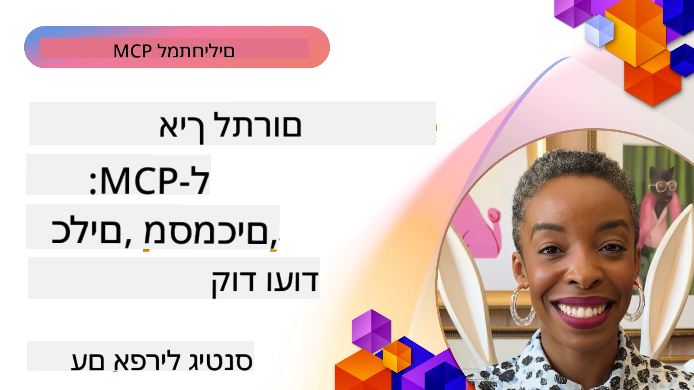

# קהילה ותרומות

[](https://youtu.be/v1pvCYAWpRE)

_(לחץ על התמונה למעלה כדי לצפות בסרטון של השיעור)_

## סקירה כללית

שיעור זה מתמקד באיך להשתתף בקהילת MCP, לתרום לאקוסיסטם של MCP, ולעקוב אחרי שיטות עבודה מומלצות לפיתוח שיתופי. הבנת האופן שבו אפשר להשתתף בפרויקטים בקוד פתוח של MCP חיונית למי שמעוניין לעצב את עתיד הטכנולוגיה הזו.

## יעדי הלימוד

בסיום שיעור זה, תהיה מסוגל:

- להבין את מבנה הקהילה והאקוסיסטם של MCP
- להשתתף באופן אפקטיבי בפורומים ודיונים של קהילת MCP
- לתרום למאגרים בקוד פתוח של MCP
- ליצור ולשתף כלים ושרתים מותאמים אישית של MCP
- לעקוב אחרי שיטות עבודה מומלצות לפיתוח ושיתוף פעולה ב-MCP
- לגלות משאבים ומסגרות קהילתיות לפיתוח MCP

## האקוסיסטם של קהילת MCP

האקוסיסטם של MCP מורכב מרכיבים ומשתתפים שונים שעובדים יחד לקידום הפרוטוקול.

### רכיבי מפתח בקהילה

1. **אחראי הליבה של הפרוטוקול**: ארגון [GitHub של Model Context Protocol](https://github.com/modelcontextprotocol) האחראי על המפרטים הראשיים ומימושים ייחוסיים של MCP
2. **מפתחים של כלים**: יחידים וקבוצות שיוצרים כלים ושרתים של MCP
3. **ספקי אינטגרציה**: חברות שמשלבות את MCP במוצרים ושירותים שלהן
4. **משתמשי קצה**: מפתחים וארגונים שמשתמשים ב-MCP באפליקציות שלהם
5. **תורמים**: חברי קהילה שתורמים קוד, תיעוד או משאבים אחרים

### משאבי קהילה

#### ערוצים רשמיים

- [ארגון GitHub של MCP](https://github.com/modelcontextprotocol)
- [תיעוד MCP](https://modelcontextprotocol.io/)
- [מפרט MCP](https://modelcontextprotocol.io/specification/2026-07-28/)
- [דיונים ב-GitHub](https://github.com/orgs/modelcontextprotocol/discussions)
- [מאגר דוגמאות ושרתים של MCP](https://github.com/modelcontextprotocol/servers)

#### משאבים שקהילה מובילה

- [לקוחות MCP](https://modelcontextprotocol.io/clients) - רשימת לקוחות התומכים באינטגרציות MCP
- [שרתים קהילתיים של MCP](https://github.com/modelcontextprotocol/servers?tab=readme-ov-file#-community-servers) - רשימה מתפתחת של שרתי MCP שפותחו על ידי הקהילה
- [שרתים נפלאים של MCP](https://github.com/wong2/awesome-mcp-servers) - רשימה מסוננת של שרתי MCP
- [PulseMCP](https://www.pulsemcp.com/) - מרכז קהילתי ועלון חדשות לגילוי משאבי MCP
- [Remote OpenClaw](https://www.remoteopenclaw.com/) - מדריך חינמי לחיפוש שרתי MCP, כישורי סוכנים ותוספים
- [שרת Discord](https://discord.gg/jHEGxQu2a5) - התחבר עם מפתחי MCP
- מימושים SDK בשפות שונות
- פוסטים בבלוג ומדריכים

## תרומה ל-MCP

### סוגי תרומות

האקוסיסטם של MCP מקבל בברכה סוגים שונים של תרומות:

1. **תרומות קוד**:
   - שיפורים בפרוטוקול הליבה
   - תיקוני באגים
   - מימושים לכלים ולשרתים
   - ספריות לקוחות/שרת בשפות שונות

2. **תיעוד**:
   - שיפור תיעוד קיים
   - יצירת מדריכים והדרכות
   - תרגום תיעוד
   - יצירת דוגמאות ואפליקציות דוגמה

3. **תמיכת קהילה**:
   - מענה על שאלות בפורומים ודיונים
   - בדיקות ודיווח על בעיות
   - ארגון אירועי קהילה
   - מנטורינג לתורמים חדשים

### תהליך התרומה: פרוטוקול הליבה

כדי לתרום לפרוטוקול הליבה של MCP או למימושים רשמיים, עקוב אחרי העקרונות ממדריך התרומה הרשמי ב-[קווים המנחים לתרומה](https://github.com/modelcontextprotocol/modelcontextprotocol/blob/main/CONTRIBUTING.md):

1. **פשטות ומינימליזם**: המפרט של MCP שומר על רף גבוה להוספת מושגים חדשים. קל יותר להוסיף דברים למפרט מאשר להסיר אותם.

2. **גישה קונקרטית**: שינויים במפרט צריכים להתבסס על אתגרי מימוש ספציפיים, לא על רעיונות ספקולטיביים.

3. **שלבי הצעה**:
   - הגדרה: חקור את מרחב הבעיה, אמת שמשתמשים אחרים ב-MCP מתמודדים עם אותה סוגיה
   - אבטיפוס: בנה פתרון דוגמה והדגים את היישום המעשי שלו
   - כתיבה: בהתבסס על האבטיפוס, כתוב הצעת מפרט

### הגדרת סביבת פיתוח

```bash
# יצירת הסתעפות של המאגר
git clone https://github.com/YOUR-USERNAME/modelcontextprotocol.git
cd modelcontextprotocol

# התקן תלותים
npm install

# עבור שינויים בסכימה, אמת ויצר schema.json:
npm run check:schema:ts
npm run generate:schema

# עבור שינויים בתיעוד
npm run check:docs
npm run format

# תצוגת תיעוד מקומית (לא חובה):
npm run serve:docs
```

### דוגמה: תרומת תיקון באג

```javascript
// קוד מקורי עם באג ב-typescript-sdk
export function validateResource(resource: unknown): resource is MCPResource {
  if (!resource || typeof resource !== 'object') {
    return false;
  }
  
  // באג: חסרה אימות של תכונה
  // מימוש נוכחי:
  const hasName = 'name' in resource;
  const hasSchema = 'schema' in resource;
  
  return hasName && hasSchema;
}

// מימוש מתוקן בתרומה
export function validateResource(resource: unknown): resource is MCPResource {
  if (!resource || typeof resource !== 'object') {
    return false;
  }
  
  // שיפור באימות
  const hasName = 'name' in resource && typeof (resource as MCPResource).name === 'string';
  const hasSchema = 'schema' in resource && typeof (resource as MCPResource).schema === 'object';
  const hasDescription = !('description' in resource) || typeof (resource as MCPResource).description === 'string';
  
  return hasName && hasSchema && hasDescription;
}
```

### דוגמה: תרומת כלי חדש לספריה הסטנדרטית

```python
# דוגמת תרומה: כלי לעיבוד נתוני CSV לספריית התקן MCP

from mcp_tools import Tool, ToolRequest, ToolResponse, ToolExecutionException
import pandas as pd
import io
import json
from typing import Dict, Any, List, Optional

class CsvProcessingTool(Tool):
    """
    Tool for processing and analyzing CSV data.
    
    This tool allows models to extract information from CSV files,
    run basic analysis, and convert data between formats.
    """
    
    def get_name(self):
        return "csvProcessor"
        
    def get_description(self):
        return "Processes and analyzes CSV data"
    
    def get_schema(self):
        return {
            "type": "object",
            "properties": {
                "csvData": {
                    "type": "string", 
                    "description": "CSV data as a string"
                },
                "csvUrl": {
                    "type": "string",
                    "description": "URL to a CSV file (alternative to csvData)"
                },
                "operation": {
                    "type": "string",
                    "enum": ["summary", "filter", "transform", "convert"],
                    "description": "Operation to perform on the CSV data"
                },
                "filterColumn": {
                    "type": "string",
                    "description": "Column to filter by (for filter operation)"
                },
                "filterValue": {
                    "type": "string",
                    "description": "Value to filter for (for filter operation)"
                },
                "outputFormat": {
                    "type": "string",
                    "enum": ["json", "csv", "markdown"],
                    "default": "json",
                    "description": "Output format for the processed data"
                }
            },
            "oneOf": [
                {"required": ["csvData", "operation"]},
                {"required": ["csvUrl", "operation"]}
            ]
        }
    
    async def execute_async(self, request: ToolRequest) -> ToolResponse:
        try:
            # חילוץ פרמטרים
            operation = request.parameters.get("operation")
            output_format = request.parameters.get("outputFormat", "json")
            
            # קבלת נתוני CSV מנתונים ישירים או מכתובת URL
            df = await self._get_dataframe(request)
            
            # עיבוד בהתבסס על הפעולה המבוקשת
            result = {}
            
            if operation == "summary":
                result = self._generate_summary(df)
            elif operation == "filter":
                column = request.parameters.get("filterColumn")
                value = request.parameters.get("filterValue")
                if not column:
                    raise ToolExecutionException("filterColumn is required for filter operation")
                result = self._filter_data(df, column, value)
            elif operation == "transform":
                result = self._transform_data(df, request.parameters)
            elif operation == "convert":
                result = self._convert_format(df, output_format)
            else:
                raise ToolExecutionException(f"Unknown operation: {operation}")
            
            return ToolResponse(result=result)
        
        except Exception as e:
            raise ToolExecutionException(f"CSV processing failed: {str(e)}")
    
    async def _get_dataframe(self, request: ToolRequest) -> pd.DataFrame:
        """Gets a pandas DataFrame from either CSV data or URL"""
        if "csvData" in request.parameters:
            csv_data = request.parameters.get("csvData")
            return pd.read_csv(io.StringIO(csv_data))
        elif "csvUrl" in request.parameters:
            csv_url = request.parameters.get("csvUrl")
            return pd.read_csv(csv_url)
        else:
            raise ToolExecutionException("Either csvData or csvUrl must be provided")
    
    def _generate_summary(self, df: pd.DataFrame) -> Dict[str, Any]:
        """Generates a summary of the CSV data"""
        return {
            "columns": df.columns.tolist(),
            "rowCount": len(df),
            "columnCount": len(df.columns),
            "numericColumns": df.select_dtypes(include=['number']).columns.tolist(),
            "categoricalColumns": df.select_dtypes(include=['object']).columns.tolist(),
            "sampleRows": json.loads(df.head(5).to_json(orient="records")),
            "statistics": json.loads(df.describe().to_json())
        }
    
    def _filter_data(self, df: pd.DataFrame, column: str, value: str) -> Dict[str, Any]:
        """Filters the DataFrame by a column value"""
        if column not in df.columns:
            raise ToolExecutionException(f"Column '{column}' not found")
            
        filtered_df = df[df[column].astype(str).str.contains(value)]
        
        return {
            "originalRowCount": len(df),
            "filteredRowCount": len(filtered_df),
            "data": json.loads(filtered_df.to_json(orient="records"))
        }
    
    def _transform_data(self, df: pd.DataFrame, params: Dict[str, Any]) -> Dict[str, Any]:
        """Transforms the data based on parameters"""
        # היישום יכלול טרנספורמציות שונות
        return {
            "status": "success",
            "message": "Transformation applied"
        }
    
    def _convert_format(self, df: pd.DataFrame, format: str) -> Dict[str, Any]:
        """Converts the DataFrame to different formats"""
        if format == "json":
            return {
                "data": json.loads(df.to_json(orient="records")),
                "format": "json"
            }
        elif format == "csv":
            return {
                "data": df.to_csv(index=False),
                "format": "csv"
            }
        elif format == "markdown":
            return {
                "data": df.to_markdown(),
                "format": "markdown"
            }
        else:
            raise ToolExecutionException(f"Unsupported output format: {format}")
```

### קווי הנחיה לתרומה

על מנת לעשות תרומה מוצלחת לפרויקטים של MCP:

1. **התחל קטן**: התחל בתיעוד, תיקוני באגים או שיפורים קטנים
2. **עקוב אחרי מדריך הסגנון**: הקפד על סגנון הקוד והקונבנציות של הפרויקט
3. **כתוב בדיקות**: כלול בדיקות יחידה לתרומות הקוד שלך
4. **תעד את עבודתך**: הוסף תיעוד ברור לתכונות או שינויים חדשים
5. **שלח PR ממוקדים**: שמור את בקשות המשיכה ממוקדות בנושאים או תכונות ספציפיות
6. **היה מעורב במשוב**: היה מגיב למשוב על התרומות שלך

### תהליך תרומה לדוגמה

```bash
# לשכפל את המאגר
git clone https://github.com/modelcontextprotocol/typescript-sdk.git
cd typescript-sdk

# ליצור סניף חדש לתרומתך
git checkout -b feature/my-contribution

# לבצע את השינויים שלך
# ...

# להריץ בדיקות כדי לוודא שהשינויים שלך לא שוברים פונקציונליות קיימת
npm test

# לבצע קומיט לשינויים שלך עם הודעה תיאורית
git commit -am "Fix validation in resource handler"

# לדחוף את הסניף שלך למזלג שלך
git push origin feature/my-contribution

# ליצור בקשת משיכה מהסניף שלך למאגר הראשי
# ואז להשתתף במשוב ולחזור על בקשת המשיכה לפי הצורך
```

## יצירה ושיתוף שרתי MCP

אחד מהדרכים החשובות לתרום לאקוסיסטם של MCP הוא על ידי יצירה ושיתוף שרתי MCP מותאמים אישית. הקהילה כבר פיתחה מאות שרתים לשירותים ושימושים שונים.

### מסגרות פיתוח שרתי MCP

כמה מסגרות זמינות להקלת פיתוח שרתי MCP:

1. **SDKs רשמיים** (בדוק את
    [תיעוד ה-SDK](https://modelcontextprotocol.io/docs/sdk) לכל
    גרסת פרוטוקול הנתמכת על ידי כל SDK):
   - [TypeScript SDK](https://github.com/modelcontextprotocol/typescript-sdk)
   - [Python SDK](https://github.com/modelcontextprotocol/python-sdk)
   - [C# SDK](https://github.com/modelcontextprotocol/csharp-sdk)
   - [Go SDK](https://github.com/modelcontextprotocol/go-sdk)
   - [Java SDK](https://github.com/modelcontextprotocol/java-sdk)
   - [Kotlin SDK](https://github.com/modelcontextprotocol/kotlin-sdk)
   - [Swift SDK](https://github.com/modelcontextprotocol/swift-sdk)
   - [Rust SDK](https://github.com/modelcontextprotocol/rust-sdk)

2. **מסגרות קהילתיות**:
   - [MCP-Framework](https://mcp-framework.com/) - בנה שרתי MCP באלגנטיות ובמהירות ב-TypeScript
   - [MCP Declarative Java SDK](https://github.com/codeboyzhou/mcp-declarative-java-sdk) - שרתי MCP מונעי אנוטציה ב-Java
   - [Quarkus MCP Server SDK](https://github.com/quarkiverse/quarkus-mcp-server) - מסגרת Java לשרתי MCP
   - [Next.js MCP Server Template](https://github.com/vercel-labs/mcp-for-next.js) - פרויקט התחלה ב-Next.js לשרתי MCP

### פיתוח כלים לשיתוף

#### דוגמה ב-.NET: יצירת חבילת כלים לשיתוף

```csharp
// Create a new .NET library project
// dotnet new classlib -n McpFinanceTools

using Microsoft.Mcp.Tools;
using System.Threading.Tasks;
using System.Net.Http;
using System.Text.Json;

namespace McpFinanceTools
{
    // Stock quote tool
    public class StockQuoteTool : IMcpTool
    {
        private readonly HttpClient _httpClient;
        
        public StockQuoteTool(HttpClient httpClient = null)
        {
            _httpClient = httpClient ?? new HttpClient();
        }
        
        public string Name => "stockQuote";
        public string Description => "Gets current stock quotes for specified symbols";
        
        public object GetSchema()
        {
            return new {
                type = "object",
                properties = new {
                    symbol = new { 
                        type = "string",
                        description = "Stock symbol (e.g., MSFT, AAPL)" 
                    },
                    includeHistory = new { 
                        type = "boolean",
                        description = "Whether to include historical data",
                        default = false
                    }
                },
                required = new[] { "symbol" }
            };
        }
        
        public async Task<ToolResponse> ExecuteAsync(ToolRequest request)
        {
            // Extract parameters
            string symbol = request.Parameters.GetProperty("symbol").GetString();
            bool includeHistory = false;
            
            if (request.Parameters.TryGetProperty("includeHistory", out var historyProp))
            {
                includeHistory = historyProp.GetBoolean();
            }
            
            // Call external API (example)
            var quoteResult = await GetStockQuoteAsync(symbol);
            
            // Add historical data if requested
            if (includeHistory)
            {
                var historyData = await GetStockHistoryAsync(symbol);
                quoteResult.Add("history", historyData);
            }
            
            // Return formatted result
            return new ToolResponse {
                Result = JsonSerializer.SerializeToElement(quoteResult)
            };
        }
        
        private async Task<Dictionary<string, object>> GetStockQuoteAsync(string symbol)
        {
            // Implementation would call a real stock API
            // This is a simplified example
            return new Dictionary<string, object>
            {
                ["symbol"] = symbol,
                ["price"] = 123.45,
                ["change"] = 2.5,
                ["percentChange"] = 1.2,
                ["lastUpdated"] = DateTime.UtcNow
            };
        }
        
        private async Task<object> GetStockHistoryAsync(string symbol)
        {
            // Implementation would get historical data
            // Simplified example
            return new[]
            {
                new { date = DateTime.Now.AddDays(-7).Date, price = 120.25 },
                new { date = DateTime.Now.AddDays(-6).Date, price = 122.50 },
                new { date = DateTime.Now.AddDays(-5).Date, price = 121.75 }
                // More historical data...
            };
        }
    }
}

// Create package and publish to NuGet
// dotnet pack -c Release
// dotnet nuget push bin/Release/McpFinanceTools.1.0.0.nupkg -s https://api.nuget.org/v3/index.json -k YOUR_API_KEY
```

#### דוגמה ב-Java: יצירת חבילה במייבן לכלים

```java
// תצורת pom.xml לחבילת כלי MCP לשיתוף
<!-- 
<project>
    <groupId>com.example</groupId>
    <artifactId>mcp-weather-tools</artifactId>
    <version>1.0.0</version>
    
    <dependencies>
        <dependency>
            <groupId>com.mcp</groupId>
            <artifactId>mcp-server</artifactId>
            <version>1.0.0</version>
        </dependency>
    </dependencies>
    
    <distributionManagement>
        <repository>
            <id>github</id>
            <name>GitHub Packages</name>
            <url>https://maven.pkg.github.com/username/mcp-weather-tools</url>
        </repository>
    </distributionManagement>
</project>
-->

package com.example.mcp.weather;

import com.mcp.tools.Tool;
import com.mcp.tools.ToolRequest;
import com.mcp.tools.ToolResponse;
import com.mcp.tools.ToolExecutionException;

import java.net.http.HttpClient;
import java.net.http.HttpRequest;
import java.net.http.HttpResponse;
import java.net.URI;
import java.util.HashMap;
import java.util.Map;

public class WeatherForecastTool implements Tool {
    private final HttpClient httpClient;
    private final String apiKey;
    
    public WeatherForecastTool(String apiKey) {
        this.httpClient = HttpClient.newHttpClient();
        this.apiKey = apiKey;
    }
    
    @Override
    public String getName() {
        return "weatherForecast";
    }
    
    @Override
    public String getDescription() {
        return "Gets weather forecast for a specified location";
    }
    
    @Override
    public Object getSchema() {
        Map<String, Object> schema = new HashMap<>();
        // הגדרת סכמה...
        return schema;
    }
    
    @Override
    public ToolResponse execute(ToolRequest request) {
        try {
            String location = request.getParameters().get("location").asText();
            int days = request.getParameters().has("days") ? 
                request.getParameters().get("days").asInt() : 3;
            
            // קריאה ל-API של מזג האוויר
            Map<String, Object> forecast = getForecast(location, days);
            
            // בניית תגובה
            return new ToolResponse.Builder()
                .setResult(forecast)
                .build();
        } catch (Exception ex) {
            throw new ToolExecutionException("Weather forecast failed: " + ex.getMessage(), ex);
        }
    }
    
    private Map<String, Object> getForecast(String location, int days) {
        // מימוש שיקרא ל-API של מזג האוויר
        // דוגמה מפושטת
        Map<String, Object> result = new HashMap<>();
        // הוספת נתוני תחזית...
        return result;
    }
}

// בנייה ופרסום באמצעות Maven
// mvn clean package
// mvn deploy
```

#### דוגמה בפייתון: פרסום חבילת PyPI

```python
# מבנה תיקייה לחבילת PyPI:
# mcp_nlp_tools/
# ├── LICENSE
# ├── README.md
# ├── setup.py
# ├── mcp_nlp_tools/
# │   ├── __init__.py
# │   ├── sentiment_tool.py
# │   └── translation_tool.py

# דוגמת setup.py
"""
from setuptools import setup, find_packages

setup(
    name="mcp_nlp_tools",
    version="0.1.0",
    packages=find_packages(),
    install_requires=[
        "mcp_server>=1.0.0",
        "transformers>=4.0.0",
        "torch>=1.8.0"
    ],
    author="Your Name",
    author_email="your.email@example.com",
    description="MCP tools for natural language processing tasks",
    long_description=open("README.md").read(),
    long_description_content_type="text/markdown",
    url="https://github.com/username/mcp_nlp_tools",
    classifiers=[
        "Programming Language :: Python :: 3",
        "License :: OSI Approved :: MIT License",
        "Operating System :: OS Independent",
    ],
    python_requires=">=3.8",
)
"""

# דוגמת מימוש כלי NLP (sentiment_tool.py)
from mcp_tools import Tool, ToolRequest, ToolResponse, ToolExecutionException
from transformers import pipeline
import torch

class SentimentAnalysisTool(Tool):
    """MCP tool for sentiment analysis of text"""
    
    def __init__(self, model_name="distilbert-base-uncased-finetuned-sst-2-english"):
        # טען את מודל ניתוח הרגשות
        self.sentiment_analyzer = pipeline("sentiment-analysis", model=model_name)
    
    def get_name(self):
        return "sentimentAnalysis"
        
    def get_description(self):
        return "Analyzes the sentiment of text, classifying it as positive or negative"
    
    def get_schema(self):
        return {
            "type": "object",
            "properties": {
                "text": {
                    "type": "string", 
                    "description": "The text to analyze for sentiment"
                },
                "includeScore": {
                    "type": "boolean",
                    "description": "Whether to include confidence scores",
                    "default": True
                }
            },
            "required": ["text"]
        }
    
    async def execute_async(self, request: ToolRequest) -> ToolResponse:
        try:
            # הפקת פרמטרים
            text = request.parameters.get("text")
            include_score = request.parameters.get("includeScore", True)
            
            # נתח רגשות
            sentiment_result = self.sentiment_analyzer(text)[0]
            
            # עיצוב תוצאה
            result = {
                "sentiment": sentiment_result["label"],
                "text": text
            }
            
            if include_score:
                result["score"] = sentiment_result["score"]
            
            # החזר תוצאה
            return ToolResponse(result=result)
            
        except Exception as e:
            raise ToolExecutionException(f"Sentiment analysis failed: {str(e)}")

# לפרסום:
# python setup.py sdist bdist_wheel
# python -m twine upload dist/*
```

### שיתוף שיטות עבודה מומלצות

כשמשתפים כלים של MCP עם הקהילה:

1. **תיעוד מלא**:
   - תעד את המטרה, השימוש והדוגמאות
   - הסבר פרמטרים וערכי החזרה
   - תעד תלות חיצונית כלשהי

2. **טיפול בשגיאות**:
   - יישום טיפול שגיאות אמין
   - ספק הודעות שגיאה שימושיות
   - התמודד עם מקרי קצה בחן

3. **שיקולי ביצועים**:
   - אופטימיזציה למהירות ולשימוש משאבים
   - יישום מטמון במידת הצורך
   - שקול קנה מידה

4. **אבטחה**:
   - השתמש במפתחות API מאובטחים ואימות
   - אמת וסנן קלטים
   - יישם הגבלת קצב עבור קריאות API חיצוניות

5. **בדיקות**:
   - כלול כיסוי בדיקות מקיף
   - בדוק עם סוגי קלט שונים ומקרי קצה
   - תעד נוהלי בדיקה

## שיתוף פעולה קהילתי ושיטות עבודה מומלצות

שיתוף פעולה אפקטיבי הוא מפתח לאקוסיסטם MCP משגשג.

### ערוצי תקשורת

- נושאים ודיונים ב-GitHub
- Microsoft Tech Community
- ערוצי Discord ו-Slack
- Stack Overflow (תג: `model-context-protocol` או `mcp`)

### סקירות קוד

בעת סקירת תרומות ל-MCP:

1. **בהירות**: האם הקוד ברור ומתועד היטב?
2. **נכונות**: האם הוא פועל כמצופה?
3. **עקביות**: האם הוא עוקב אחרי קונבנציות הפרויקט?
4. **שלימות**: האם בדיקות ותיעוד כלולים?
5. **אבטחה**: האם יש חששות אבטחה?

### תאימות גרסאות

בעת פיתוח ל-MCP:

1. **ניהול גרסת פרוטוקול**: הקפד לשמור על גרסת הפרוטוקול הנתמכת על ידי הכלי שלך
2. **תאימות לקוחות**: שקול תאימות לאחור
3. **תאימות שרתים**: עקוב אחרי קווי הנחיה למימוש שרת
4. **שינויים שמשבשים**: תעד בבירור כל שינויים שמשבשים

## דוגמת פרויקט קהילתי: רישום כלי MCP

תרומה חשובה לקהילה יכולה להיות פיתוח רישום ציבורי לכלי MCP.

```python
# דוגמה לסכמה לממשק API של רישום כלים לקהילה

from fastapi import FastAPI, HTTPException, Depends
from pydantic import BaseModel, Field, HttpUrl
from typing import List, Optional
import datetime
import uuid

# מודלים לרישום הכלים
class ToolSchema(BaseModel):
    """JSON Schema for a tool"""
    type: str
    properties: dict
    required: List[str] = []

class ToolRegistration(BaseModel):
    """Information for registering a tool"""
    name: str = Field(..., description="Unique name for the tool")
    description: str = Field(..., description="Description of what the tool does")
    version: str = Field(..., description="Semantic version of the tool")
    schema: ToolSchema = Field(..., description="JSON Schema for tool parameters")
    author: str = Field(..., description="Author of the tool")
    repository: Optional[HttpUrl] = Field(None, description="Repository URL")
    documentation: Optional[HttpUrl] = Field(None, description="Documentation URL")
    package: Optional[HttpUrl] = Field(None, description="Package URL")
    tags: List[str] = Field(default_factory=list, description="Tags for categorization")
    examples: List[dict] = Field(default_factory=list, description="Example usage")

class Tool(ToolRegistration):
    """Tool with registry metadata"""
    id: uuid.UUID = Field(default_factory=uuid.uuid4)
    created_at: datetime.datetime = Field(default_factory=datetime.datetime.now)
    updated_at: datetime.datetime = Field(default_factory=datetime.datetime.now)
    downloads: int = Field(default=0)
    rating: float = Field(default=0.0)
    ratings_count: int = Field(default=0)

# יישום FastAPI לרישום
app = FastAPI(title="MCP Tool Registry")

# מסד נתונים בזיכרון לדוגמה זו
tools_db = {}

@app.post("/tools", response_model=Tool)
async def register_tool(tool: ToolRegistration):
    """Register a new tool in the registry"""
    if tool.name in tools_db:
        raise HTTPException(status_code=400, detail=f"Tool '{tool.name}' already exists")
    
    new_tool = Tool(**tool.dict())
    tools_db[tool.name] = new_tool
    return new_tool

@app.get("/tools", response_model=List[Tool])
async def list_tools(tag: Optional[str] = None):
    """List all registered tools, optionally filtered by tag"""
    if tag:
        return [tool for tool in tools_db.values() if tag in tool.tags]
    return list(tools_db.values())

@app.get("/tools/{tool_name}", response_model=Tool)
async def get_tool(tool_name: str):
    """Get information about a specific tool"""
    if tool_name not in tools_db:
        raise HTTPException(status_code=404, detail=f"Tool '{tool_name}' not found")
    return tools_db[tool_name]

@app.delete("/tools/{tool_name}")
async def delete_tool(tool_name: str):
    """Delete a tool from the registry"""
    if tool_name not in tools_db:
        raise HTTPException(status_code=404, detail=f"Tool '{tool_name}' not found")
    del tools_db[tool_name]
    return {"message": f"Tool '{tool_name}' deleted"}
```

## סיכומים מרכזיים

- קהילת MCP מגוונת ומקבלת סוגים שונים של תרומות
- תרומות ל-MCP יכולות לנוע משיפורי פרוטוקול ליצירת כלים מותאמים אישית
- עקיבת אחר קווי הנחיה לתרומה מגדילה את הסיכוי שה-PR שלך ייקבל אישור
- יצירה ושיתוף של כלי MCP היא דרך חשובה לשפר את האקוסיסטם
- שיתוף פעולה קהילתי חיוני לצמיחה ולשיפור MCP

## תרגיל

1. זהה תחום באקוסיסטם MCP שבו תוכל לתרום לפי כישורים ותחומי עניין שלך
2. בצע Fork למאגר MCP והגדר סביבת פיתוח מקומית
3. צור שיפור קטן, תיקון באג או כלי שיהיה מועיל לקהילה
4. תעד את תרומתך עם בדיקות ותיעוד מתאימים
5. שלח בקשת משיכה למאגר המתאים

## משאבים נוספים

- [פרויקטים קהילתיים של MCP](https://github.com/topics/model-context-protocol)

---

## מה הלאה

הבא: [שיעורים מאימוץ מוקדם](../07-LessonsfromEarlyAdoption/README.md)

---

<!-- CO-OP TRANSLATOR DISCLAIMER START -->
**כתב ויתור**:
מסמך זה תורגם באמצעות שירות תרגום אוטומטי [Co-op Translator](https://github.com/Azure/co-op-translator). למרות שאנו שואפים לדיוק, יש לקחת בחשבון שתרגומים אוטומטיים עלולים להכיל שגיאות או אי-דיוקים. יש להחשיב את המסמך המקורי בשפתו הטבעית כמקור הסמכות. למידע קריטי מומלץ להשתמש בתרגום מקצועי על ידי מתרגם אדם. אנו לא אחראים לכל אי-הבנה או פירוש שגוי הנובע מהשימוש בתרגום זה.
<!-- CO-OP TRANSLATOR DISCLAIMER END -->