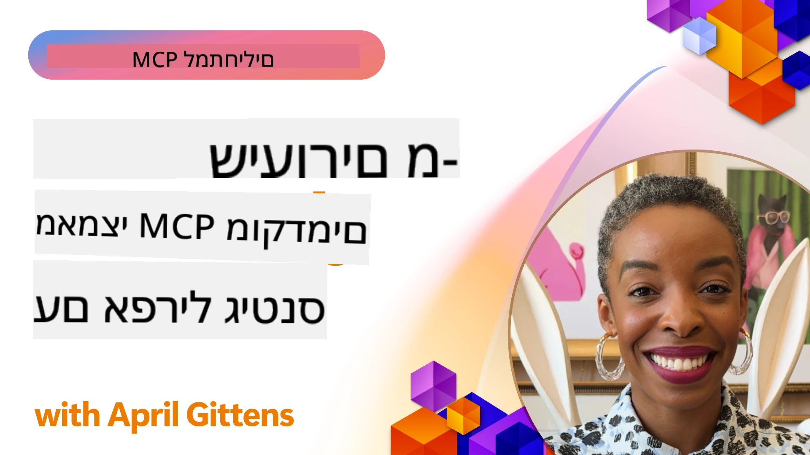

# 🌟 לקחים ממאמצים מוקדמים

[](https://youtu.be/jds7dSmNptE)

_(לחצו על התמונה למעלה לצפייה בסרטון של השיעור הזה)_

## 🎯 מה מודול זה כולל

מודול זה חוקר כיצד ארגונים ומפתחים אמיתיים מנצלים את פרוטוקול הקשר של המודל (MCP) כדי לפתור אתגרים ממשיים ולקדם חדשנות. דרך מקרים מפורטים, פרויקטים מעשיים ודוגמאות פרקטיות, תגלה כיצד MCP מאפשר שילוב בטוח, סקלאבילי של בינה מלאכותית שמחבר מודלים שפתיים, כלים ונתוני ארגון.

### 📚 ראו את MCP בפעולה

רוצים לראות עקרונות אלה מיושמים בכלים מוכנים לפרודקשן? בדקו את [**10 שרתי MCP של מיקרוסופט שמשנים את פרודוקטיביות המפתחים**](microsoft-mcp-servers.md), שמציגים שרתי MCP אמיתיים של מיקרוסופט שניתן להשתמש בהם היום.

## סקירה כללית

שיעור זה חוקר כיצד מאמצים מוקדמים מנצלים את פרוטוקול הקשר של המודל (MCP) כדי לפתור אתגרים מהעולם האמיתי ולקדם חדשנות בתעשיות שונות. דרך מקרים מפורטים ופרויקטים מעשיים, תראו כיצד MCP מאפשר אינטגרציה סטנדרטית, בטוחה וסקלאבילית של בינה מלאכותית – המחברת מודלים שפתיים גדולים, כלים ונתוני ארגון במסגרת מאוחדת. תקבלו ניסיון מעשי בעיצוב ובניית פתרונות מבוססי MCP, תלמדו מדפוסי יישום מוכחים, ותגלו שיטות עבודה מומלצות לפריסה של MCP בסביבות פרודקשן. השיעור גם מדגיש מגמות חדשות, כיווני עתיד ומשאבים בקוד פתוח שיעזרו לכם להישאר בחזית טכנולוגיית MCP ואקוסיסטמה המשתנה שלה.

## יעדי הלמידה

- לנתח יישומים אמיתיים של MCP בתעשיות שונות
- לעצב ולבנות יישומים מלאים מבוססי MCP
- לחקור מגמות חדשות וכיווני עתיד בטכנולוגיית MCP
- ליישם שיטות עבודה מומלצות בתרחישי פיתוח אמיתיים

## יישומים אמיתיים של MCP

### מקרה בוחן 1: אוטומציה של תמיכת לקוחות ארגונית

תאגיד רב-לאומי יישם פתרון מבוסס MCP כדי לסטנדרט אינטראקציות בינה מלאכותית במערכות התמיכה בלקוחות שלו. זה איפשר להם:

- ליצור ממשק מאוחד לספקי LLM רבים
- לשמר ניהול עקבי של פרומפטים across מחלקות שונות
- ליישם בקרה מחמירה על אבטחה וציות לתקנים
- לעבור בקלות בין מודלי AI שונים על פי צרכים ספציפיים

**יישום טכני:**

```python
# מימוש שרת MCP בפייתון לתמיכה בלקוחות
import logging
import asyncio
from modelcontextprotocol import create_server, ServerConfig
from modelcontextprotocol.server import MCPServer
from modelcontextprotocol.transports import create_http_transport
from modelcontextprotocol.resources import ResourceDefinition
from modelcontextprotocol.prompts import PromptDefinition
from modelcontextprotocol.tool import ToolDefinition

# הגדר יומן רישום
logging.basicConfig(level=logging.INFO)

async def main():
    # צור תצורת שרת
    config = ServerConfig(
        name="Enterprise Customer Support Server",
        version="1.0.0",
        description="MCP server for handling customer support inquiries"
    )
    
    # אתחל שרת MCP
    server = create_server(config)
    
    # רשם משאבים של בסיס ידע
    server.resources.register(
        ResourceDefinition(
            name="customer_kb",
            description="Customer knowledge base documentation"
        ),
        lambda params: get_customer_documentation(params)
    )
    
    # רשם תבניות הנחיה
    server.prompts.register(
        PromptDefinition(
            name="support_template",
            description="Templates for customer support responses"
        ),
        lambda params: get_support_templates(params)
    )
    
    # רשם כלי תמיכה
    server.tools.register(
        ToolDefinition(
            name="ticketing",
            description="Create and update support tickets"
        ),
        handle_ticketing_operations
    )
    
    # הפעל את השרת עם פרוטוקול HTTP
    transport = create_http_transport(port=8080)
    await server.run(transport)

if __name__ == "__main__":
    asyncio.run(main())
```

**תוצאות:** הפחתה של 30% בעלויות המודל, שיפור של 45% בעקביות התגובות, והגברת הציות בכל הפעילויות הגלובליות.

### מקרה בוחן 2: עוזר אבחון בתחום הבריאות

ספק שירותי בריאות פיתח תשתית MCP לשילוב מספר מודלי AI רפואיים מיוחדים תוך שמירה על הגנת מידע רגיש של מטופלים:

- מעבר חלק בין מודלים כלליים למודלים מומחים בתחום הרפואה
- בקרות פרטיות מחמירות ורישום ביקורת
- אינטגרציה עם מערכות רשומות רפואיות אלקטרוניות (EHR) קיימות
- הנדסת פרומפט עקבית למונחים רפואיים

**יישום טכני:**

```csharp
// C# MCP host application implementation in healthcare application
using Microsoft.Extensions.DependencyInjection;
using ModelContextProtocol.SDK.Client;
using ModelContextProtocol.SDK.Security;
using ModelContextProtocol.SDK.Resources;

public class DiagnosticAssistant
{
    private readonly MCPHostClient _mcpClient;
    private readonly PatientContext _patientContext;
    
    public DiagnosticAssistant(PatientContext patientContext)
    {
        _patientContext = patientContext;
        
        // Configure MCP client with healthcare-specific settings
        var clientOptions = new ClientOptions
        {
            Name = "Healthcare Diagnostic Assistant",
            Version = "1.0.0",
            Security = new SecurityOptions
            {
                Encryption = EncryptionLevel.Medical,
                AuditEnabled = true
            }
        };
        
        _mcpClient = new MCPHostClientBuilder()
            .WithOptions(clientOptions)
            .WithTransport(new HttpTransport("https://healthcare-mcp.example.org"))
            .WithAuthentication(new HIPAACompliantAuthProvider())
            .Build();
    }
    
    public async Task<DiagnosticSuggestion> GetDiagnosticAssistance(
        string symptoms, string patientHistory)
    {
        // Create request with appropriate resources and tool access
        var resourceRequest = new ResourceRequest
        {
            Name = "patient_records",
            Parameters = new Dictionary<string, object>
            {
                ["patientId"] = _patientContext.PatientId,
                ["requestingProvider"] = _patientContext.ProviderId
            }
        };
        
        // Request diagnostic assistance using appropriate prompt
        var response = await _mcpClient.SendPromptRequestAsync(
            promptName: "diagnostic_assistance",
            parameters: new Dictionary<string, object>
            {
                ["symptoms"] = symptoms,
                patientHistory = patientHistory,
                relevantGuidelines = _patientContext.GetRelevantGuidelines()
            });
            
        return DiagnosticSuggestion.FromMCPResponse(response);
    }
}
```

**תוצאות:** שיפורים בהצעות האבחון לרופאים תוך שימור ציות מלא לתקן HIPAA והפחתה משמעותית במעבר בין מערכות הקשר.

### מקרה בוחן 3: ניתוח סיכונים בשירותים פיננסיים

מוסד פיננסי יישם MCP כדי לסטנדרט תהליכי ניתוח סיכונים במחלקות שונות:

- יצירת ממשק אחיד למודלים של סיכון אשראי, זיהוי הונאה, וסיכון השקעות
- יישום בקרות גישה נוקשות וניהול גרסאות למודלים
- הבטחת עקיבות ברישום כל המלצות הבינה המלאכותית
- שימור פורמט נתונים עקבי במערכות מגוונות

**יישום טכני:**

```java
// שרת MCP בג'אווה להערכת סיכונים פיננסיים
import org.mcp.server.*;
import org.mcp.security.*;

public class FinancialRiskMCPServer {
    public static void main(String[] args) {
        // יצירת שרת MCP עם תכונות תאימות פיננסית
        MCPServer server = new MCPServerBuilder()
            .withModelProviders(
                new ModelProvider("risk-assessment-primary", new AzureOpenAIProvider()),
                new ModelProvider("risk-assessment-audit", new LocalLlamaProvider())
            )
            .withPromptTemplateDirectory("./compliance/templates")
            .withAccessControls(new SOCCompliantAccessControl())
            .withDataEncryption(EncryptionStandard.FINANCIAL_GRADE)
            .withVersionControl(true)
            .withAuditLogging(new DatabaseAuditLogger())
            .build();
            
        server.addRequestValidator(new FinancialDataValidator());
        server.addResponseFilter(new PII_RedactionFilter());
        
        server.start(9000);
        
        System.out.println("Financial Risk MCP Server running on port 9000");
    }
}
```

**תוצאות:** שיפור ציות לרגולציה, קיצוץ של 40% במחזורי פריסת מודלים, ושיפור בעקביות הערכת הסיכונים במחלקות.

### מקרה בוחן 4: שרת MCP של Microsoft Playwright לאוטומציה בדפדפן

מיקרוסופט פיתחה את [שרת Playwright MCP](https://github.com/microsoft/playwright-mcp) כדי לאפשר אוטומציה בטוחה וסטנדרטית בדפדפן באמצעות פרוטוקול הקשר של המודל. שרת זה המוכן לפרודקשן מאפשר לסוכני AI ול-LLM לקיים אינטראקציה עם דפדפני רשת באופן מבוקר, בר השגה ורחיב – מה שמאפשר שימושים כמו בדיקות אוטומטיות של אתרים, חילוץ נתונים, וזרימות עבודה מקצה לקצה.

> **🎯 כלי מוכן לפרודקשן**
> 
> מקרה בוחן זה מציג שרת MCP אמיתי שניתן להשתמש בו היום! למידע נוסף על שרת Playwright MCP ועל 9 שרתי MCP נוספים מוכנים של מיקרוסופט ראו את המדריך שלנו ל-[**שרתי MCP של מיקרוסופט**](microsoft-mcp-servers.md#8--playwright-mcp-server).

**תכונות מרכזיות:**
- החזרות יכולות אוטומציה בדפדפן (ניווט, מילוי טפסים, צילומי מסך ועוד) ככלים ב-MCP
- יישום בקרות קפדניות וגיבוי למניעת פעולות בלתי מורשות
- נותן יומני ביקורת מפורטים על כל האינטראקציות עם הדפדפן
- תמיכה באינטגרציה עם Azure OpenAI וספקי LLM נוספים לאוטומציה מונעת סוכן
- מעניק כוח לסוכן הקידוד של GitHub Copilot עם יכולות גלישה באינטרנט

**יישום טכני:**

```typescript
// TypeScript: רישום כלים לאוטומציה של דפדפן Playwright בשרת MCP
import { createServer, ToolDefinition } from 'modelcontextprotocol';
import { launch } from 'playwright';

const server = createServer({
  name: 'Playwright MCP Server',
  version: '1.0.0',
  description: 'MCP server for browser automation using Playwright'
});

// רישום כלי לניווט ל-URL ולכידת צילום מסך
server.tools.register(
  new ToolDefinition({
    name: 'navigate_and_screenshot',
    description: 'Navigate to a URL and capture a screenshot',
    parameters: {
      url: { type: 'string', description: 'The URL to visit' }
    }
  }),
  async ({ url }) => {
    const browser = await launch();
    const page = await browser.newPage();
    await page.goto(url);
    const screenshot = await page.screenshot();
    await browser.close();
    return { screenshot };
  }
);

// הפעלת שרת MCP
server.listen(8080);
```

**תוצאות:**

- אפשר אוטומציה מבוקרת ובטוחה בדפדפן לסוכני AI ול-LLM
- צמצם את מאמץ הבדיקה הידנית ושיפר את כיסוי הבדיקות ליישומי רשת
- סיפק מסגרת לשימוש חוזר ולהרחבה לשילוב כלים מבוססי דפדפן בסביבות ארגוניות
- סיפק כוח ליכולות גלישה באינטרנט של GitHub Copilot

**הפניות:**

- [מאגר GitHub של שרת Playwright MCP](https://github.com/microsoft/playwright-mcp)
- [פתרונות בינה מלאכותית ואוטומציה של מיקרוסופט](https://azure.microsoft.com/en-us/products/ai-services/)

### מקרה בוחן 5: Azure MCP – פרוטוקול הקשר של מודל ברמה ארגונית כשירות

שרת Azure MCP ([https://aka.ms/azmcp](https://aka.ms/azmcp)) הוא יישום מנוהל ברמת ארגון של פרוטוקול הקשר של המודל, שמיועד לספק יכולות שרת MCP ניתנות להרחבה, מאובטחות ותואמות ברגולציה כשירות ענן. Azure MCP מאפשר לארגונים לפרוס, לנהל ולשלב שרתי MCP במהירות עם שירותי Azure AI, נתונים ואבטחה, ובכך להפחית עומסי ניהול ולהאיץ אימוץ של בינה מלאכותית.

> **🎯 כלי מוכן לפרודקשן**
> 
> זהו שרת MCP אמיתי שניתן להשתמש בו היום! למידע נוסף על שרת MCP של Microsoft Foundry ראו את המדריך שלנו ל-[**שרתי MCP של מיקרוסופט**](microsoft-mcp-servers.md).


- אירוח שרת MCP מנוהל מלא עם יכולות מובנות להרחבה, ניטור ואבטחה
- אינטגרציה מקומית עם Azure OpenAI, Azure AI Search ושירותי Azure נוספים
- אימות והרשאות ארגוניות דרך Microsoft Entra ID
- תמיכה בכלים מותאמים, תבניות פרומפט וקונקטורים למשאבים
- תאימות לדרישות אבטחה ורגולציה ארגוניות

**יישום טכני:**

```yaml
# Example: Azure MCP server deployment configuration (YAML)
apiVersion: mcp.microsoft.com/v1
kind: McpServer
metadata:
  name: enterprise-mcp-server
spec:
  modelProviders:
    - name: azure-openai
      type: AzureOpenAI
      endpoint: https://<your-openai-resource>.openai.azure.com/
      apiKeySecret: <your-azure-keyvault-secret>
  tools:
    - name: document_search
      type: AzureAISearch
      endpoint: https://<your-search-resource>.search.windows.net/
      apiKeySecret: <your-azure-keyvault-secret>
  authentication:
    type: EntraID
    tenantId: <your-tenant-id>
  monitoring:
    enabled: true
    logAnalyticsWorkspace: <your-log-analytics-id>
```

**תוצאות:**  
- קיצור זמן-עד-ערך לפרויקטים של בינה מלאכותית ארגוניים על ידי פלטפורמת שרת MCP מוכנה לשימוש שתואמת תקנים
- פישוט אינטגרציה של LLM, כלים ומקורות נתונים ארגוניים
- שיפור אבטחה, נראות ויעילות תפעולית לעומסי עבודה של MCP
- שיפור איכות הקוד עם שיטות עבודה מומלצות SDK של Azure ודפוסי אימות עדכניים

**הפניות:**  
- [תיעוד Azure MCP](https://aka.ms/azmcp)
- [מאגר GitHub של Azure MCP Server](https://github.com/Azure/azure-mcp)
- [שירותי בינה מלאכותית של Azure](https://azure.microsoft.com/en-us/products/ai-services/)
- [מרכז MCP של מיקרוסופט](https://mcp.azure.com)

## מקרה בוחן 6: NLWeb
MCP (פרוטוקול הקשר של המודל) הוא פרוטוקול מתפתח עבור צ׳טבוטים ועוזרי בינה מלאכותית לצורך אינטראקציה עם כלים. כל מופע של NLWeb הוא גם שרת MCP, שתומך בשיטה מרכזית אחת, ask, שנועדה לשאול אתר אינטרנט שאלה בשפה טבעית. התגובה המוחזרת מנצלת את schema.org, אוצר מילים נפוץ לתיאור נתוני רשת. במובן רחב, MCP הוא NLWeb כפי ש-Http הוא ל-HTML. NLWeb משלבת פרוטוקולים, פורמטים של Schema.org וקוד דוגמה כדי לסייע לאתרים ליצור במהירות נקודות קצה אלה, לתועלת בני אדם דרך ממשקי שיחה ומכונות דרך אינטראקציה טבעית בין סוכנים.

יש שני רכיבים מובחנים ל-NLWeb.
- פרוטוקול, פשוט מאוד להתחלה, לממשק עם אתר בשפה טבעית ופורמט, המשתמש ב-json ו-schema.org לתשובה המוחזרת. ראו את התיעוד על REST API לפרטים נוספים.
- יישום פשוט של (1) המשתמש בסימון קיים, לאתרים שיכולים להיות מופשטים כרשימות של פריטים (מוצרים, מתכונים, אטרקציות, ביקורות וכו׳). יחד עם סט ווידג׳טים לממשק משתמש, אתרים יכולים לספק ממשקי שיחה לתוכן שלהם בקלות. ראו את התיעוד על Life of a chat query לפרטים נוספים על אופן הפעולה.
 
**הפניות:**  
- [תיעוד Azure MCP](https://aka.ms/azmcp)
- [NLWeb](https://github.com/microsoft/NlWeb)

### מקרה בוחן 7: שרת Microsoft Foundry MCP – אינטגרציה של סוכן AI ארגוני

שרתי Microsoft Foundry MCP ממחישים כיצד ניתן להשתמש ב-MCP כדי לתזמר ולנהל סוכני בינה מלאכותית וזרימות עבודה בסביבות ארגוניות. באמצעות אינטגרציה בין MCP ל-Microsoft Foundry, ארגונים יכולים לסטנדרט אינטראקציות סוכן, לנצל את ניהול זרימות העבודה של Foundry, ולהבטיח פריסות בטוחות וסקלאביליות.

> **🎯 כלי מוכן לפרודקשן**
> 
> זהו שרת MCP אמיתי שניתן להשתמש בו היום! למידע נוסף על שרת Microsoft Foundry MCP ראו את המדריך שלנו ל-[**שרתי MCP של מיקרוסופט**](microsoft-mcp-servers.md#9--microsoft-foundry-mcp-server).

**תכונות מרכזיות:**
- גישה מקיפה לאקוסיסטם הבינה המלאכותית של Azure, כולל קטלוג מודלים וניהול פריסה
- אינדוקס ידע עם Azure AI Search ליישומי RAG
- כלי הערכה לביצועי מודלים והבטחת איכות
- אינטגרציה עם קטלוג ומעבדות Microsoft Foundry למחקר מודלים מובילים
- ניהול והערכת סוכנים ליישומי פרודקשן

**תוצאות:**
- פיתוח מהיר ומעקב חזק של זרימות עבודה של סוכני AI
- אינטגרציה חלקה עם שירותי Azure AI לתרחישים מתקדמים
- ממשק מאוחד לבניית, פריסה ומעקב על צינורות סוכנים
- שיפור אבטחה, ציות ויעילות תפעולית לארגונים
- האצת אימוץ AI תוך שמירת שליטה על תהליכים מורכבים מונחי סוכן

**הפניות:**
- [מאגר GitHub של שרת Microsoft Foundry MCP](https://github.com/azure-ai-foundry/mcp-foundry)
- [אינטגרציה של סוכני Azure AI עם MCP (בלוג Microsoft Foundry)](https://devblogs.microsoft.com/foundry/integrating-azure-ai-agents-mcp/)

### מקרה בוחן 8: Foundry MCP Playground – ניסויים ואבות טיפוס

מגרש המשחקים Foundry MCP מציע סביבה מוכנה לשימוש לניסויים עם שרתי MCP ואינטגרציות Microsoft Foundry. מפתחים יכולים לבצע אבות טיפוס, לבדוק ולהעריך מודלים של AI וזרימות עבודה של סוכנים במהירות באמצעות משאבים מקטלוג ומעבדות Microsoft Foundry. המגרש מפשט הקמה, מספק פרויקטים לדוגמה ותומך בפיתוח שיתופי, מה שמקל על חקירת שיטות מיטב ותרחישים חדשים עם עומס מינימלי. המגרש שימושי במיוחד לצוותים המעוניינים לאמת רעיונות, לשתף ניסויים ולהאיץ למידה בלי צורך בתשתית מורכבת. בהורדת המחסום לכניסה, המגרש מסייע לטפח חדשנות ותרומות קהילתיות באקוסיסטם MCP ומיקרוסופט Foundry.

**הפניות:**

- [מאגר GitHub של Foundry MCP Playground](https://github.com/azure-ai-foundry/foundry-mcp-playground)

### מקרה בוחן 9: שרת Microsoft Learn Docs MCP – גישה לתיעוד מונע בינה מלאכותית

שרת Microsoft Learn Docs MCP הוא שירות מבוסס ענן שמספק לעוזרי AI גישה בזמן אמת לתיעוד הרשמי של מיקרוסופט דרך פרוטוקול הקשר של המודל. שרת זה מוכן לפרודקשן מחובר לאקוסיסטם המקיף של Microsoft Learn ומאפשר חיפוש סמנטי בכל המקורות הרשמיים של מיקרוסופט.

> **🎯 כלי מוכן לפרודקשן**
> 
> זהו שרת MCP אמיתי שניתן להשתמש בו היום! למידע נוסף על שרת Microsoft Learn Docs MCP ראו את המדריך שלנו ל-[**שרתי MCP של מיקרוסופט**](microsoft-mcp-servers.md#1--microsoft-learn-docs-mcp-server).

**תכונות מרכזיות:**
- גישה בזמן אמת לתיעוד הרשמי של מיקרוסופט, תיעוד Azure ותיעוד Microsoft 365
- יכולות חיפוש סמנטי מתקדמות שמבינות הקשר וכוונה
- מידע תמיד מעודכן עם פרסום תוכן Microsoft Learn
- כיסוי מקיף של Microsoft Learn, תיעוד Azure, ומקורות Microsoft 365
- מחזיר עד 10 חלקי תוכן איכותיים עם כותרות וקישורים למאמרים

**למה זה קריטי:**
- פותר את בעיית "ידע מיושן של AI" בטכנולוגיות מיקרוסופט
- מבטיח שלעוזרי AI תהיה גישה לתכונות האחרונות של .NET, C#, Azure ו-Microsoft 365
- מספק מידע ממשלתי ראשון במעלה ליצירת קוד מדויק
- חיוני למפתחים שעובדים עם טכנולוגיות Microsoft שמתפתחות במהירות

**תוצאות:**
- שיפור דרמטי בדיוק של קוד שנוצר ע״י AI לטכנולוגיות Microsoft
- הקטנת הזמן המוקדש לחיפוש תיעוד עדכני ושיטות עבודה מיטביות
- שיפור פרודוקטיביות מפתחים עם שליפה ממוקדת תיעוד
- אינטגרציה חלקה עם זרימות פיתוח ללא יציאה מסביבת הפיתוח

**הפניות:**
- [מאגר GitHub של שרת Microsoft Learn Docs MCP](https://github.com/MicrosoftDocs/mcp)
- [תיעוד Microsoft Learn](https://learn.microsoft.com/)

## פרויקטים מעשיים

### פרויקט 1: בניית שרת MCP עם כמה ספקים

**מטרה:** ליצור שרת MCP שיכול לנתב בקשות לכמה ספקי מודלים של AI על בסיס קריטריונים מסוימים.

**דרישות:**

- תמיכה לפחות בשלושה ספקי מודלים שונים (למשל OpenAI, Anthropic, מודלים מקומיים)
- יישום מנגנון ניתוב מבוסס מטא-נתוני בקשה
- יצירת מערכת תצורה לניהול אישורי ספקים
- הוספת מטמון לאופטימיזציה של ביצועים ועלויות
- בניית לוח בקרה פשוט למעקב שימוש

**שלבי ביצוע:**

1. הקמת תשתית בסיסית לשרת MCP
2. יישום מתאמי ספקים לכל שירותי מודל AI
3. יצירת לוגיקת ניתוב על בסיס מאפייני הבקשה
4. הוספת מנגנוני מטמון לבקשות תכופות
5. פיתוח לוח בקרה לניטור
6. בדיקה עם תבניות בקשה שונות

**טכנולוגיות:** לבחור מפייתון (.NET/Java/Python לפי העדפתך), Redis למטמון, ומסגרת רשת פשוטה ללוח בקרה.

### פרויקט 2: מערכת ניהול פרומפטים ארגונית

**מטרה:** לפתח מערכת מבוססת MCP לניהול, גרירה והפצת תבניות פרומפט ברחבי הארגון.

**דרישות:**


- צור מאגר מרכזי לתבניות פרומפט
- יישם ניהול גרסאות ותהליכי אישור
- בנה יכולות בדיקת תבניות עם קלטים לדוגמה
- פתח בקרות גישה מבוססות תפקידים
- צור API לאחזור ופריסת תבניות

**שלבי יישום:**

1. עצב את סכמת מסד הנתונים לאחסון תבניות
2. צור את ה-API המרכזי לפעולות CRUD על תבניות
3. יישם את מערכת ניהול הגרסאות
4. בנה את תהליך אישור התבניות
5. פתח את מסגרת הבדיקות
6. צור ממשק ווב פשוט לניהול
7. שלב עם שרת MCP

**טכנולוגיות:** בחירתך במסגרת backend, מסד נתונים SQL או NoSQL, ומסגרת frontend לממשק הניהול.

### פרוייקט 3: פלטפורמת יצירת תוכן מבוססת MCP

**מטרה:** לבנות פלטפורמת יצירת תוכן המנצלת MCP כדי לספק תוצאות עקביות בסוגי תוכן שונים.

**דרישות:**

- תמיכה בפורמטים שונים של תוכן (פוסטים בבלוג, רשתות חברתיות, טקסט שיווקי)
- יישום יצירה מבוססת תבניות עם אפשרויות התאמה אישית
- יצירת מערכת סקירת תוכן ומשוב
- מעקב אחר מדדי ביצועי תוכן
- תמיכה בניהול גרסאות של תוכן ועריכה חוזרת

**שלבי יישום:**

1. הקם תשתית לקוח MCP
2. צור תבניות לסוגי תוכן שונים
3. בנה את פס יצירת התוכן
4. יישם את מערכת הסקירה
5. פתח את מערכת מעקב המדדים
6. צור ממשק משתמש לניהול תבניות ויצירת תוכן

**טכנולוגיות:** שפת התכנות המועדפת עליך, מסגרת ווב, ומערכת מסד נתונים.

## כיוונים עתידיים לטכנולוגיית MCP

### מגמות מתפתחות

1. **MCP רב-מודלי**
   - הרחבת MCP לאחידות באינטראקציות עם מודלים של תמונות, שמע ווידאו
   - פיתוח יכולות הסקה בין-מודלית
   - פורמטים סטנדרטיים של פרומפטים למודלים שונים

2. **תשתית MCP מבוזרת**
   - רשתות MCP מבוזרות שיכולות לשתף משאבים בין ארגונים
   - פרוטוקולים סטנדרטיים לשיתוף מודלים מאובטח
   - טכניקות חישוב שומרות פרטיות

3. **שווקי MCP**
   - מערכות אקולוגיות לשיתוף ומונטיזציה של תבניות ותוספים ל-MCP
   - תהליכי אבטחת איכות והסמכה
   - אינטגרציה עם שווקי מודלים

4. **MCP למחשוב קצה**
   - התאמת תקני MCP למכשירי קצה עם משאבים מוגבלים
   - פרוטוקולים מותאמים לסביבות עם פס רחב נמוך
   - מימושי MCP ייעודיים לאקו-סיסטמים של IoT

5. **מסגרות רגולטוריות**
   - פיתוח הרחבות MCP לציות רגולטורי
   - מסלולי ביקורת סטנדרטיים וממשקי הסבר
   - אינטגרציה עם מסגרות מיסוי AI מתפתחות

### פתרונות MCP של מיקרוסופט

מיקרוסופט ואזור פיתחו מספר מאגרים בקוד פתוח כדי לסייע למפתחים ליישם MCP בתרחישים שונים:

#### ארגון Microsoft

1. [playwright-mcp](https://github.com/microsoft/playwright-mcp) - שרת MCP של Playwright לאוטומציה ובדיקה בדפדפן
2. [files-mcp-server](https://github.com/microsoft/files-mcp-server) - יישום שרת MCP ל-OneDrive לבדיקה מקומית ותרומה לקהילה
3. [NLWeb](https://github.com/microsoft/NlWeb) - NLWeb הוא אוסף פרוטוקולים פתוחים וכלים בקוד פתוח נלווים. מוקד העיקרי שלו הוא הקמת שכבת יסוד לרשת ה-AI

#### ארגון Azure-Samples

1. [mcp](https://github.com/Azure-Samples/mcp) - קישורים לדוגמאות, כלי עבודה ומשאבים לבניית ושילוב שרתי MCP ב-Azure בשפות שונות
2. [mcp-auth-servers](https://github.com/Azure-Samples/mcp-auth-servers) - שרתי MCP לדוגמה המדגימים אימות לפי תקן Model Context Protocol הנוכחי
3. [remote-mcp-functions](https://github.com/Azure-Samples/remote-mcp-functions) - דף נחיתה ליישומי Remote MCP Server ב-Azure Functions עם קישורים למאגרים לפי שפה
4. [remote-mcp-functions-python](https://github.com/Azure-Samples/remote-mcp-functions-python) - תבנית התחלה מהירה לבניית ופריסת שרתי MCP מרוחקים מותאמים אישית ב-Azure Functions עם Python
5. [remote-mcp-functions-dotnet](https://github.com/Azure-Samples/remote-mcp-functions-dotnet) - תבנית התחלה מהירה לבניית ופריסת שרתי MCP מרוחקים מותאמים אישית ב-Azure Functions עם .NET/C#
6. [remote-mcp-functions-typescript](https://github.com/Azure-Samples/remote-mcp-functions-typescript) - תבנית התחלה מהירה לבניית ופריסת שרתי MCP מרוחקים מותאמים אישית ב-Azure Functions עם TypeScript
7. [remote-mcp-apim-functions-python](https://github.com/Azure-Samples/remote-mcp-apim-functions-python) - ניהול API ב-Azure כשער AI לשרתי MCP מרוחקים ב-Python
8. [AI-Gateway](https://github.com/Azure-Samples/AI-Gateway) - ניסויי APIM❤️AI הכוללים יכולות MCP, אינטגרציה עם Azure OpenAI ו-AI Foundry

מאגרים אלו מספקים מימושים, תבניות ומשאבים שונים לעבודה עם Model Context Protocol בשפות תכנות ושירותי Azure שונים. הם כוללים שימושים מגוונים ממימוש שרתים בסיסיים ועד אימות, פרישה בענן ותרחישי אינטגרציה ארגונית.

#### מדריך משאבי MCP

מדריך [משאבי MCP](https://github.com/microsoft/mcp/tree/main/Resources) במאגר הרשמי של מיקרוסופט ל-MCP מציע אוסף מסונן של משאבים לדוגמה, תבניות פרומפט והגדרות כלים לשימוש עם שרתי Model Context Protocol. מדריך זה מיועד לסייע למפתחים להתחיל במהירות עם MCP על ידי מתן בלוקים שלמים לשימוש חוזר ודוגמאות של שיטות עבודה מומלצות ל:

- **תבניות פרומפט:** תבניות מוכנות לשימוש למשימות תדירות בסביבת AI, שניתן להתאים ליישומי שרת MCP משלכם.
- **הגדרות כלים:** סכמות וכלי דוגמה לסטנדרטיזציה של שילוב כלים וקירואתם בשרתי MCP שונים.
- **משאבים לדוגמה:** הגדרות של משאבים לדוגמה לחיבור למקורות נתונים, APIs ושירותים חיצוניים במסגרת MCP.
- **מימושי התייחסות:** דוגמאות מעשיות המדגימות כיצד לארגן ולסדר משאבים, פרומפטים וכלים בפרויקטי MCP אמיתיים.

משאבים אלו מזרזים פיתוח, מקדמים סטנדרטיזציה, ומסייעים להבטיח שיטות עבודה מיטביות בבניית ופריסת פתרונות מבוססי MCP.

#### מדריך משאבי MCP

- [משאבי MCP (פרומפטים לדוגמה, כלים והגדרות משאבים)](https://github.com/microsoft/mcp/tree/main/Resources)

### הזדמנויות מחקר

- טכניקות אופטימיזציה יעילה של פרומפטים במסגרת MCP
- מודלים אבטחה לפריסות MCP רב-דיירניות
- מדידת ביצועים בין מימושי MCP שונים
- שיטות אימות פורמאליות לשרתי MCP

## סיכום

Model Context Protocol (MCP) מעצב במהירות את עתיד האינטגרציה המאובטחת, הסטנדרטית והאינטרופרבילית של AI בתעשיות השונות. דרך מקרי הבדיקה והפרויקטים המעשיים בשיעור זה, ראית כיצד מאמצים מוקדמים—כולל מיקרוסופט ואזור—מנפים את MCP כדי לפתור אתגרים אמיתיים, להאיץ אימוץ AI ולהבטיח ציות, אבטחה וקנה מידה. הגישה המודולרית של MCP מאפשרת לארגונים לחבר מודלים לשוניים גדולים, כלים, ונתוני ארגון במסגרת אחידה, מאובטחת וניתנת לבדיקה. ככל ש-MCP ממשיך להתפתח, מעקב אחרי הקהילה, חקר משאבים בקוד פתוח ויישום שיטות עבודה מיטביות יהיו המפתח לבניית פתרונות AI איתנים ומוכנים לעתיד.

## משאבים נוספים

- [מאגר Foundry MCP ב-GitHub](https://github.com/azure-ai-foundry/mcp-foundry)
- [מגרש Foundry MCP](https://github.com/azure-ai-foundry/foundry-mcp-playground)
- [שילוב סוכני Azure AI עם MCP (בלוג Microsoft Foundry)](https://devblogs.microsoft.com/foundry/integrating-azure-ai-agents-mcp/)
- [מאגר MCP של Microsoft ב-GitHub](https://github.com/microsoft/mcp)
- [מדריך משאבי MCP (פרומפטים לדוגמה, כלים והגדרות משאבים)](https://github.com/microsoft/mcp/tree/main/Resources)
- [קהילת MCP ותיעוד](https://modelcontextprotocol.io/introduction)
- [מפרט MCP (2026-07-28)](https://modelcontextprotocol.io/specification/2026-07-28/)
- [תיעוד Azure MCP](https://aka.ms/azmcp)
- [OWASP MCP Top 10](https://microsoft.github.io/mcp-azure-security-guide/mcp/) - שיטות אבטחה מומלצות
- [מאגר שרת Playwright MCP ב-GitHub](https://github.com/microsoft/playwright-mcp)
- [שרת Files MCP (OneDrive)](https://github.com/microsoft/files-mcp-server)
- [Azure-Samples MCP](https://github.com/Azure-Samples/mcp)
- [שרת MCP לאימות (Azure-Samples)](https://github.com/Azure-Samples/mcp-auth-servers)
- [פונקציות MCP מרוחקות (Azure-Samples)](https://github.com/Azure-Samples/remote-mcp-functions)
- [פונקציות MCP מרוחקות ב-Python (Azure-Samples)](https://github.com/Azure-Samples/remote-mcp-functions-python)
- [פונקציות MCP מרוחקות ב-.NET (Azure-Samples)](https://github.com/Azure-Samples/remote-mcp-functions-dotnet)
- [פונקציות MCP מרוחקות ב-TypeScript (Azure-Samples)](https://github.com/Azure-Samples/remote-mcp-functions-typescript)
- [פונקציות MCP APIM מרוחקות ב-Python (Azure-Samples)](https://github.com/Azure-Samples/remote-mcp-apim-functions-python)
- [AI-Gateway (Azure-Samples)](https://github.com/Azure-Samples/AI-Gateway)
- [פתרונות AI ואוטומציה של Microsoft](https://azure.microsoft.com/en-us/products/ai-services/)

## תרגילים

1. נתח אחד ממקרי הבדיקה והצע גישה חלופית ליישום.
2. בחר אחד מרעיונות הפרויקטים וכתוב מפרט טכני מפורט.
3. חקור ענף תעשייה שלא נביא במקרי הבדיקה ופרט כיצד MCP יכול להתמודד עם האתגרים הספציפיים שלו.
4. חקור אחד מהכיוונים העתידיים וכתוב מושג להרחבת MCP שתתמוך בו.

## מה הלאה

חקור עוד: [שרתים Microsoft MCP](./microsoft-mcp-servers.md)

המשך אל: [מודול 8: שיטות עבודה מומלצות](../08-BestPractices/README.md)

---

<!-- CO-OP TRANSLATOR DISCLAIMER START -->
**כתב ויתור**:
מסמך זה תורגם באמצעות שירות תרגום אוטומטי [Co-op Translator](https://github.com/Azure/co-op-translator). למרות שאנו שואפים לדיוק, יש לקחת בחשבון שתרגומים אוטומטיים עלולים להכיל שגיאות או אי-דיוקים. יש להחשיב את המסמך המקורי בשפתו הטבעית כמקור הסמכות. למידע קריטי מומלץ להשתמש בתרגום מקצועי על ידי מתרגם אדם. אנו לא אחראים לכל אי-הבנה או פירוש שגוי הנובע מהשימוש בתרגום זה.
<!-- CO-OP TRANSLATOR DISCLAIMER END -->