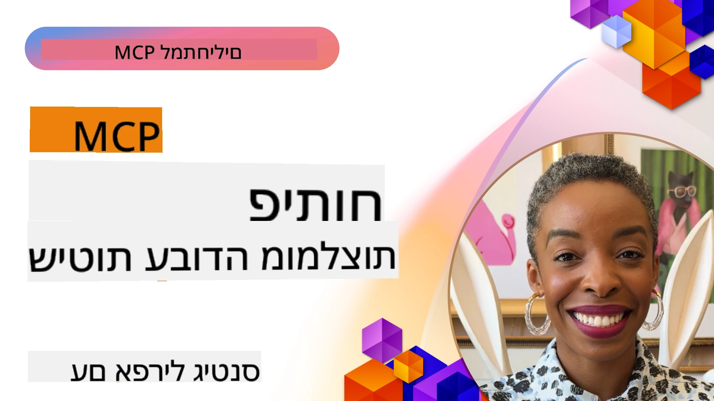

# שיטות עבודה מומלצות לפיתוח MCP

[](https://youtu.be/W56H9W7x-ao)

_(לחץ על התמונה למעלה לצפייה בווידאו של השיעור)_

## סקירה כללית

שיעור זה מתמקד בשיטות עבודה מתקדמות לפיתוח, בדיקה ופריסה של שרתי MCP ותכונות בסביבות ייצור. ככל שהאקוסיסטמים של MCP גדלים במורכבות ובחשיבות, עקיבה אחר דפוסים מבוססים מבטיחה אמינות, תחזוקה ויכולת להתממשק. שיעור זה מאגד חכמה מעשית שנצברה מיישומי MCP אמיתיים כדי להנחות אותך ביצירת שרתים עמידים, יעילים עם משאבים, מצבים וכלים אפקטיביים.

## מטרות הלמידה

בסיום שיעור זה, תוכל:

- ליישם שיטות עבודה מומלצות בתעשייה בעיצוב שרתי MCP ותכונות
- ליצור אסטרטגיות בדיקה מקיפות לשרתי MCP
- לעצב דפוסי עבודה יעילים וחוזרים עבור יישומי MCP מורכבים
- ליישם טיפול שגיאות, רישום ותצפית מתאימים בשרתי MCP
- לייעל יישומי MCP לביצועים, אבטחה ותחזוקה

## עקרונות בסיסיים של MCP

לפני שתקפוץ לפרקטיקות יישום ספציפיות, חשוב להבין את העקרונות המרכזיים שמנחים פיתוח אפקטיבי של MCP:

1. **תקשורת סטנדרטית**: MCP משתמש ב-JSON-RPC 2.0 כבסיס שלו, ומספק פורמט עקבי לבקשות, תגובות וטיפול בשגיאות בכל היישומים.

2. **עיצוב ממוקד משתמש**: תמיד העדף הסכמה, שליטה ושקיפות למשתמש ביישומי MCP שלך.

3. **אבטחה קודם כל**: יישם אמצעי אבטחה חזקים כולל אימות, הרשאה, אימות וגבול קצב.

4. **ארכיטקטורה מודולרית**: עצב את שרתי MCP בגישה מודולרית, כאשר כל כלי ומשאב בעלי מטרה ברורה וממוקדת.

5. **מדינה מפורשת**: MCP `2026-07-28` הוא ללא מדינה ברמת הפרוטוקול
   .כאשר תהליך עבודה דורש מדינה חוצת קריאות, השתמש בידיות מפורשות או
   בארגומנטים של כלי רגילים הנתמכים במדינת יישום עמידה.

## שיטות עבודה רשמיות של MCP

שיטות העבודה הבאות נגזרות מתיעוד רשמי של פרוטוקול הקשר לדגם:

### שיטות עבודה מומלצות לאבטחה

1. **הסכמה ושליטה של המשתמש**: תמיד דרוש הסכמת משתמש מפורשת לפני גישה לנתונים או ביצוע פעולות. ספק שליטה ברורה על אילו נתונים משותפים ואילו פעולות מורשות.

2. **פרטיות נתונים**: פתח רק נתוני משתמש עם הסכמה מפורשת והגן עליהם באמצעות בקרות גישה מתאימות. הגן מפני שידור נתונים בלתי מורשה.

3. **בטיחות כלי**: דרוש הסכמת משתמש מפורשת לפני קריאה לכל כלי. הבטח שמשתמשים יבינו את פונקציונליות כל כלי ואכוף גבולות אבטחה חזקים.

4. **בקרת הרשאות כלי**: הגדר אילו כלים מודל יכול להשתמש עבור
   כל בקשה והקשר הרשאה, כדי להבטיח שרק כלים מורשים במפורש
   יהיו נגישים.

5. **אימות**: דרוש אימות תקין לפני הענקת גישה לכלים, משאבים או פעולות רגישות באמצעות מפתחות API, אסימוני OAuth או שיטות אימות מאובטחות אחרות.

6. **אימות פרמטרים**: אכוף אימות עבור כל קריאות הכלים כדי למנוע קלט פגום או זדוני מלהגיע ליישומי הכלי.

7. **הגבלת קצב**: יישם הגבלת קצב למניעת שימוש לרעה ולהבטחת שימוש הוגן במשאבי השרת.

### שיטות עבודה ליישום

1. **מיקוח יכולות**: נהל מיקוח על גרסאות פרוטוקול ותכונות נתמכות.
 ב-MCP `2026-07-28`, כל בקשה היא עצמאית ויכולה
להשתמש ב-`server/discover`; גרסאות ישנות יותר משתמשות בלחיצת יד אתחול.

2. **עיצוב כלים**: צור כלים ממוקדים שעושים דבר אחד היטב, ולא כלים מונוליתיים המטפלים במספר נושאים.

3. **טיפול בשגיאות**: יישם הודעות שגיאה ו-קודים סטנדרטיים שיעזרו לאבחן בעיות, להתמודד עם כשלונות ברגישות ולספק משוב בר ביצוע.

4. **תצפית**: השתמש ב-`stderr` לאבחון stdio ו-OpenTelemetry
   לתצפית מובנית. תכונת רישום ה-MCP הוצאה מה
   תקן `2026-07-28`.

5. **מעקב התקדמות**: עבור פעולות ארוכות זמן, ספק עדכוני התקדמות לאפשר ממשקי משתמש מגיבים.

6. **ביטול בקשות**: אפשר ללקוחות לבטל בקשות בתהליך שאינן נדרשות יותר או אורכות מדי.

## הפניות נוספות

למידע המעודכן ביותר על שיטות עבודה מומלצות ל-MCP, עיין ב:

- [תיעוד MCP](https://modelcontextprotocol.io/)
- [מפרט MCP (2026-07-28)][mcp-2026-spec]
- [מפרט MCP קודם (2025-11-25)](https://modelcontextprotocol.io/specification/2025-11-25)
- [הארכת משימות MCP][mcp-tasks-extension]
- [מאגר GitHub](https://github.com/modelcontextprotocol)
- [שיטות אבטחה מומלצות](https://modelcontextprotocol.io/docs/2026-07-28/tutorials/security/security_best_practices)
- [OWASP MCP 10 העליונים](https://microsoft.github.io/mcp-azure-security-guide/) - סיכוני אבטחה והפחתתם
- [סדנת פסגת אבטחת MCP (Sherpa)](https://azure-samples.github.io/sherpa/) - אימון אבטחה מעשי

### שיעור לוויין לאמינות

לולאות ניסיון חוזר כלליות אינן בטוחות לכלים שיוצרים כרטיסים, תשלומים,
הודעות, פריסות או השפעות אחרות מהעולם האמיתי. תגובה יכולה להיאבד
לאחר שהאפקט התבצע.

השתמש בשיעור הלוויין לאמינות,
[ניסיונות חוזרים בטוחים לכלי MCP: דפוס לוויין לאמינות][reliability-sidecar],
כדי ללמוד מפתחות פעולה יציבים, כניסה כפולה, נקודות ביקורת,
פיצוי, רמות ראיות והזרקת כשל.

[mcp-2026-spec]: https://modelcontextprotocol.io/specification/2026-07-28
[mcp-tasks-extension]: https://modelcontextprotocol.io/extensions/tasks/overview
[reliability-sidecar]: ./reliability-sidecars/README.md

## דוגמאות ליישום מעשי

### שיטות עבודה מומלצות לעיצוב כלים

#### 1. עקרון אחריות יחידה

כל כלי MCP צריך להיות בעל מטרה ברורה וממוקדת. במקום ליצור כלים מונוליתיים שמנסים לטפל במספר נושאים, פתח כלים מתמחים המצטיינים במשימות ספציפיות.

```csharp
// A focused tool that does one thing well
public class WeatherForecastTool : ITool
{
    private readonly IWeatherService _weatherService;
    
    public WeatherForecastTool(IWeatherService weatherService)
    {
        _weatherService = weatherService;
    }
    
    public string Name => "weatherForecast";
    public string Description => "Gets weather forecast for a specific location";
    
    public ToolDefinition GetDefinition()
    {
        return new ToolDefinition
        {
            Name = Name,
            Description = Description,
            Parameters = new Dictionary<string, ParameterDefinition>
            {
                ["location"] = new ParameterDefinition
                {
                    Type = ParameterType.String,
                    Description = "City or location name"
                },
                ["days"] = new ParameterDefinition
                {
                    Type = ParameterType.Integer,
                    Description = "Number of forecast days",
                    Default = 3
                }
            },
            Required = new[] { "location" }
        };
    }
    
    public async Task<ToolResponse> ExecuteAsync(IDictionary<string, object> parameters)
    {
        var location = parameters["location"].ToString();
        var days = parameters.ContainsKey("days") 
            ? Convert.ToInt32(parameters["days"]) 
            : 3;
            
        var forecast = await _weatherService.GetForecastAsync(location, days);
        
        return new ToolResponse
        {
            Content = new List<ContentItem>
            {
                new TextContent(JsonSerializer.Serialize(forecast))
            }
        };
    }
}
```

#### 2. טיפול שגיאות עקבי

יישם טיפול שגיאות חזק עם הודעות שגיאה אינפורמטיביות ומנגנוני שיקום מתאימים.

```python
# דוגמה ב-Python עם טיפול מקיף בשגיאות
class DataQueryTool:
    def get_name(self):
        return "dataQuery"
        
    def get_description(self):
        return "Queries data from specified database tables"
    
    async def execute(self, parameters):
        try:
            # אימות פרמטרים
            if "query" not in parameters:
                raise ToolParameterError("Missing required parameter: query")
                
            query = parameters["query"]
            
            # אימות אבטחה
            if self._contains_unsafe_sql(query):
                raise ToolSecurityError("Query contains potentially unsafe SQL")
            
            try:
                # פעולה על בסיס נתונים עם זמן תפוגה
                async with timeout(10):  # זמן תפוגה של 10 שניות
                    result = await self._database.execute_query(query)
                    
                return ToolResponse(
                    content=[TextContent(json.dumps(result))]
                )
            except asyncio.TimeoutError:
                raise ToolExecutionError("Database query timed out after 10 seconds")
            except DatabaseConnectionError as e:
                # שגיאות חיבור עשויות להיות זמניות
                self._log_error("Database connection error", e)
                raise ToolExecutionError(f"Database connection error: {str(e)}")
            except DatabaseQueryError as e:
                # שגיאות שאילתה הן ככל הנראה שגיאות של לקוחות
                self._log_error("Database query error", e)
                raise ToolExecutionError(f"Invalid query: {str(e)}")
                
        except ToolError:
            # לאפשר לשגיאות ספציפיות לכלי לעבור
            raise
        except Exception as e:
            # ללכוד את כל השגיאות הבלתי צפויות
            self._log_error("Unexpected error in DataQueryTool", e)
            raise ToolExecutionError(f"An unexpected error occurred: {str(e)}")
    
    def _contains_unsafe_sql(self, query):
        # מימוש זיהוי הזרקת SQL
        pass
        
    def _log_error(self, message, error):
        # מימוש רישום שגיאות
        pass
```

#### 3. אימות פרמטרים

תמיד אמת פרמטרים בקפידה כדי למנוע קלט פגום או זדוני.

```javascript
// דוגמת JavaScript/TypeScript עם אימות פרמטרים מפורט
class FileOperationTool {
  getName() {
    return "fileOperation";
  }
  
  getDescription() {
    return "Performs file operations like read, write, and delete";
  }
  
  getDefinition() {
    return {
      name: this.getName(),
      description: this.getDescription(),
      parameters: {
        operation: {
          type: "string",
          description: "Operation to perform",
          enum: ["read", "write", "delete"]
        },
        path: {
          type: "string",
          description: "File path (must be within allowed directories)"
        },
        content: {
          type: "string",
          description: "Content to write (only for write operation)",
          optional: true
        }
      },
      required: ["operation", "path"]
    };
  }
  
  async execute(parameters) {
    // 1. אימות נוכחות הפרמטר
    if (!parameters.operation) {
      throw new ToolError("Missing required parameter: operation");
    }
    
    if (!parameters.path) {
      throw new ToolError("Missing required parameter: path");
    }
    
    // 2. אימות סוגי הפרמטרים
    if (typeof parameters.operation !== "string") {
      throw new ToolError("Parameter 'operation' must be a string");
    }
    
    if (typeof parameters.path !== "string") {
      throw new ToolError("Parameter 'path' must be a string");
    }
    
    // 3. אימות ערכי הפרמטרים
    const validOperations = ["read", "write", "delete"];
    if (!validOperations.includes(parameters.operation)) {
      throw new ToolError(`Invalid operation. Must be one of: ${validOperations.join(", ")}`);
    }
    
    // 4. אימות נוכחות תוכן עבור פעולת כתיבה
    if (parameters.operation === "write" && !parameters.content) {
      throw new ToolError("Content parameter is required for write operation");
    }
    
    // 5. אימות בטיחות הנתיב
    if (!this.isPathWithinAllowedDirectories(parameters.path)) {
      throw new ToolError("Access denied: path is outside of allowed directories");
    }
    
    // מימוש מבוסס על פרמטרים מאומתים
    // ...
  }
  
  isPathWithinAllowedDirectories(path) {
    // מימוש בדיקת בטיחות הנתיב
    // ...
  }
}
```

### דוגמאות ליישום אבטחה

#### 1. אימות והרשאה

```java
// דוגמת Java עם אימות והרשאה
public class SecureDataAccessTool implements Tool {
    private final AuthenticationService authService;
    private final AuthorizationService authzService;
    private final DataService dataService;
    
    // הזרקת תלות
    public SecureDataAccessTool(
            AuthenticationService authService,
            AuthorizationService authzService,
            DataService dataService) {
        this.authService = authService;
        this.authzService = authzService;
        this.dataService = dataService;
    }
    
    @Override
    public String getName() {
        return "secureDataAccess";
    }
    
    @Override
    public ToolResponse execute(ToolRequest request) {
        // 1. חילוץ הקשר אימות
        String authToken = request.getContext().getAuthToken();
        
        // 2. אימות משתמש
        UserIdentity user;
        try {
            user = authService.validateToken(authToken);
        } catch (AuthenticationException e) {
            return ToolResponse.error("Authentication failed: " + e.getMessage());
        }
        
        // 3. בדיקת הרשאה לפעולה הספציפית
        String dataId = request.getParameters().get("dataId").getAsString();
        String operation = request.getParameters().get("operation").getAsString();
        
        boolean isAuthorized = authzService.isAuthorized(user, "data:" + dataId, operation);
        if (!isAuthorized) {
            return ToolResponse.error("Access denied: Insufficient permissions for this operation");
        }
        
        // 4. המשך עם הפעולה המורשית
        try {
            switch (operation) {
                case "read":
                    Object data = dataService.getData(dataId, user.getId());
                    return ToolResponse.success(data);
                case "update":
                    JsonNode newData = request.getParameters().get("newData");
                    dataService.updateData(dataId, newData, user.getId());
                    return ToolResponse.success("Data updated successfully");
                default:
                    return ToolResponse.error("Unsupported operation: " + operation);
            }
        } catch (Exception e) {
            return ToolResponse.error("Operation failed: " + e.getMessage());
        }
    }
}
```

#### 2. הגבלת קצב

```csharp
// C# rate limiting implementation
public class RateLimitingMiddleware
{
    private readonly RequestDelegate _next;
    private readonly IMemoryCache _cache;
    private readonly ILogger<RateLimitingMiddleware> _logger;
    
    // Configuration options
    private readonly int _maxRequestsPerMinute;
    
    public RateLimitingMiddleware(
        RequestDelegate next,
        IMemoryCache cache,
        ILogger<RateLimitingMiddleware> logger,
        IConfiguration config)
    {
        _next = next;
        _cache = cache;
        _logger = logger;
        _maxRequestsPerMinute = config.GetValue<int>("RateLimit:MaxRequestsPerMinute", 60);
    }
    
    public async Task InvokeAsync(HttpContext context)
    {
        // 1. Get client identifier (API key or user ID)
        string clientId = GetClientIdentifier(context);
        
        // 2. Get rate limiting key for this minute
        string cacheKey = $"rate_limit:{clientId}:{DateTime.UtcNow:yyyyMMddHHmm}";
        
        // 3. Check current request count
        if (!_cache.TryGetValue(cacheKey, out int requestCount))
        {
            requestCount = 0;
        }
        
        // 4. Enforce rate limit
        if (requestCount >= _maxRequestsPerMinute)
        {
            _logger.LogWarning("Rate limit exceeded for client {ClientId}", clientId);
            
            context.Response.StatusCode = StatusCodes.Status429TooManyRequests;
            context.Response.Headers.Add("Retry-After", "60");
            
            await context.Response.WriteAsJsonAsync(new
            {
                error = "Rate limit exceeded",
                message = "Too many requests. Please try again later.",
                retryAfterSeconds = 60
            });
            
            return;
        }
        
        // 5. Increment request count
        _cache.Set(cacheKey, requestCount + 1, TimeSpan.FromMinutes(2));
        
        // 6. Add rate limit headers
        context.Response.Headers.Add("X-RateLimit-Limit", _maxRequestsPerMinute.ToString());
        context.Response.Headers.Add("X-RateLimit-Remaining", (_maxRequestsPerMinute - requestCount - 1).ToString());
        
        // 7. Continue with the request
        await _next(context);
    }
    
    private string GetClientIdentifier(HttpContext context)
    {
        // Implementation to extract API key or user ID
        // ...
    }
}
```

## שיטות בדיקה מומלצות

### 1. בדיקת יחידה של כלי MCP

תמיד בדוק את הכלים שלך בנפרד, תוך יצירת תחליפים לתלויות חיצוניות:

```typescript
// דוגמת TypeScript למבחן יחידה של כלי
describe('WeatherForecastTool', () => {
  let tool: WeatherForecastTool;
  let mockWeatherService: jest.Mocked<IWeatherService>;
  
  beforeEach(() => {
    // יצירת שירות מזג אוויר מדומה
    mockWeatherService = {
      getForecasts: jest.fn()
    } as any;
    
    // יצירת הכלי עם תוסף תלות מדומה
    tool = new WeatherForecastTool(mockWeatherService);
  });
  
  it('should return weather forecast for a location', async () => {
    // סידור
    const mockForecast = {
      location: 'Seattle',
      forecasts: [
        { date: '2025-07-16', temperature: 72, conditions: 'Sunny' },
        { date: '2025-07-17', temperature: 68, conditions: 'Partly Cloudy' },
        { date: '2025-07-18', temperature: 65, conditions: 'Rain' }
      ]
    };
    
    mockWeatherService.getForecasts.mockResolvedValue(mockForecast);
    
    // פעולה
    const response = await tool.execute({
      location: 'Seattle',
      days: 3
    });
    
    // אימות
    expect(mockWeatherService.getForecasts).toHaveBeenCalledWith('Seattle', 3);
    expect(response.content[0].text).toContain('Seattle');
    expect(response.content[0].text).toContain('Sunny');
  });
  
  it('should handle errors from the weather service', async () => {
    // סידור
    mockWeatherService.getForecasts.mockRejectedValue(new Error('Service unavailable'));
    
    // פעולה ואימות
    await expect(tool.execute({
      location: 'Seattle',
      days: 3
    })).rejects.toThrow('Weather service error: Service unavailable');
  });
});
```

### 2. בדיקת אינטגרציה

בדוק את הזרימה המלאה מבקשות הלקוח לתגובות השרת:

```python
# דוגמת בדיקת אינטגרציה ב-Python
@pytest.mark.asyncio
async def test_mcp_server_integration():
    # הפעלת שרת בדיקה
    server = McpServer()
    server.register_tool(WeatherForecastTool(MockWeatherService()))
    await server.start(port=5000)
    
    try:
        # יצירת לקוח
        client = McpClient("http://localhost:5000")
        
        # בדיקת גילוי כלי
        tools = await client.discover_tools()
        assert "weatherForecast" in [t.name for t in tools]
        
        # בדיקת הרצת כלי
        response = await client.execute_tool("weatherForecast", {
            "location": "Seattle",
            "days": 3
        })
        
        # אימות התגובה
        assert response.status_code == 200
        assert "Seattle" in response.content[0].text
        assert len(json.loads(response.content[0].text)["forecasts"]) == 3
        
    finally:
        # ניקוי סביבה
        await server.stop()
```

## אופטימיזציה של ביצועים

### 1. אסטרטגיות מטמון

יישם מטמון מתאים כדי לצמצם השהיות ושימוש במשאבים:


```csharp
// C# example with caching
public class CachedWeatherTool : ITool
{
    private readonly IWeatherService _weatherService;
    private readonly IDistributedCache _cache;
    private readonly ILogger<CachedWeatherTool> _logger;
    
    public CachedWeatherTool(
        IWeatherService weatherService,
        IDistributedCache cache,
        ILogger<CachedWeatherTool> logger)
    {
        _weatherService = weatherService;
        _cache = cache;
        _logger = logger;
    }
    
    public string Name => "weatherForecast";
    
    public async Task<ToolResponse> ExecuteAsync(IDictionary<string, object> parameters)
    {
        var location = parameters["location"].ToString();
        var days = Convert.ToInt32(parameters.GetValueOrDefault("days", 3));
        
        // Create cache key
        string cacheKey = $"weather:{location}:{days}";
        
        // Try to get from cache
        string cachedForecast = await _cache.GetStringAsync(cacheKey);
        if (!string.IsNullOrEmpty(cachedForecast))
        {
            _logger.LogInformation("Cache hit for weather forecast: {Location}", location);
            return new ToolResponse
            {
                Content = new List<ContentItem>
                {
                    new TextContent(cachedForecast)
                }
            };
        }
        
        // Cache miss - get from service
        _logger.LogInformation("Cache miss for weather forecast: {Location}", location);
        var forecast = await _weatherService.GetForecastAsync(location, days);
        string forecastJson = JsonSerializer.Serialize(forecast);
        
        // Store in cache (weather forecasts valid for 1 hour)
        await _cache.SetStringAsync(
            cacheKey,
            forecastJson,
            new DistributedCacheEntryOptions
            {
                AbsoluteExpirationRelativeToNow = TimeSpan.FromHours(1)
            });
        
        return new ToolResponse
        {
            Content = new List<ContentItem>
            {
                new TextContent(forecastJson)
            }
        };
    }
}
```

#### 2. הזרקת תלות ויכולת מבחן

עצב כלי קבלה של התלויות שלהם דרך הזרקת בנאי, מה שהופך אותם לברי מבחן וניתנים לקונפיגורציה:

```java
// דוגמת Java עם הזרקת תלות
public class CurrencyConversionTool implements Tool {
    private final ExchangeRateService exchangeService;
    private final CacheService cacheService;
    private final Logger logger;
    
    // תלות מוזרקת דרך הבנאי
    public CurrencyConversionTool(
            ExchangeRateService exchangeService,
            CacheService cacheService,
            Logger logger) {
        this.exchangeService = exchangeService;
        this.cacheService = cacheService;
        this.logger = logger;
    }
    
    // מימוש כלי
    // ...
}
```

#### 3. כלים קומפוזיציוניים

עצב כלים שניתן להרכיב יחד כדי ליצור זרימות עבודה מורכבות יותר:

```python
# דוגמת פייתון המציגה כלים ניתנים להרכבה
class DataFetchTool(Tool):
    def get_name(self):
        return "dataFetch"
    
    # יישום...

class DataAnalysisTool(Tool):
    def get_name(self):
        return "dataAnalysis"
    
    # כלי זה יכול להשתמש בתוצאות של כלי אחזור הנתונים
    async def execute_async(self, request):
        # יישום...
        pass

class DataVisualizationTool(Tool):
    def get_name(self):
        return "dataVisualize"
    
    # כלי זה יכול להשתמש בתוצאות של כלי ניתוח הנתונים
    async def execute_async(self, request):
        # יישום...
        pass

# כלים אלו יכולים לשמש באופן עצמאי או כחלק מזרימת עבודה
```

### שיטות עבודה מומלצות לעיצוב סכימה

הסכימה היא החוזה בין המודל לכלי שלך. סכימות מעוצבות היטב מובילות לשימושיות טובה יותר של הכלי.

#### 1. תיאורי פרמטרים ברורים

כלול תמיד מידע תיאורי עבור כל פרמטר:

```csharp
public object GetSchema()
{
    return new {
        type = "object",
        properties = new {
            query = new { 
                type = "string", 
                description = "Search query text. Use precise keywords for better results." 
            },
            filters = new {
                type = "object",
                description = "Optional filters to narrow down search results",
                properties = new {
                    dateRange = new { 
                        type = "string", 
                        description = "Date range in format YYYY-MM-DD:YYYY-MM-DD" 
                    },
                    category = new { 
                        type = "string", 
                        description = "Category name to filter by" 
                    }
                }
            },
            limit = new { 
                type = "integer", 
                description = "Maximum number of results to return (1-50)",
                default = 10
            }
        },
        required = new[] { "query" }
    };
}
```

#### 2. מגבלות אימות

כלול מגבלות אימות למניעת קלטים לא חוקיים:

```java
Map<String, Object> getSchema() {
    Map<String, Object> schema = new HashMap<>();
    schema.put("type", "object");
    
    Map<String, Object> properties = new HashMap<>();
    
    // מאפיין דוא"ל עם אימות פורמט
    Map<String, Object> email = new HashMap<>();
    email.put("type", "string");
    email.put("format", "email");
    email.put("description", "User email address");
    
    // מאפיין גיל עם מגבלות מספריות
    Map<String, Object> age = new HashMap<>();
    age.put("type", "integer");
    age.put("minimum", 13);
    age.put("maximum", 120);
    age.put("description", "User age in years");
    
    // מאפיין מנותב
    Map<String, Object> subscription = new HashMap<>();
    subscription.put("type", "string");
    subscription.put("enum", Arrays.asList("free", "basic", "premium"));
    subscription.put("default", "free");
    subscription.put("description", "Subscription tier");
    
    properties.put("email", email);
    properties.put("age", age);
    properties.put("subscription", subscription);
    
    schema.put("properties", properties);
    schema.put("required", Arrays.asList("email"));
    
    return schema;
}
```

#### 3. מבני החזרה עקביים

שמור על עקביות במבני התגובה שלך כדי להקל על המודלים לפרש תוצאות:

```python
async def execute_async(self, request):
    try:
        # עיבוד בקשה
        results = await self._search_database(request.parameters["query"])
        
        # תמיד להחזיר מבנה עקבי
        return ToolResponse(
            result={
                "matches": [self._format_item(item) for item in results],
                "totalCount": len(results),
                "queryTime": calculation_time_ms,
                "status": "success"
            }
        )
    except Exception as e:
        return ToolResponse(
            result={
                "matches": [],
                "totalCount": 0,
                "queryTime": 0,
                "status": "error",
                "error": str(e)
            }
        )
    
def _format_item(self, item):
    """Ensures each item has a consistent structure"""
    return {
        "id": item.id,
        "title": item.title,
        "summary": item.summary[:100] + "..." if len(item.summary) > 100 else item.summary,
        "url": item.url,
        "relevance": item.score
    }
```

### טיפול בשגיאות

טיפול חזק בשגיאות חיוני לכלי MCP כדי לשמור על אמינות.

#### 1. טיפול בשגיאות בצורה מתחשבת

טפל בשגיאות ברמות המתאימות וספק הודעות אינפורמטיביות:

```csharp
public async Task<ToolResponse> ExecuteAsync(ToolRequest request)
{
    try
    {
        string fileId = request.Parameters.GetProperty("fileId").GetString();
        
        try
        {
            var fileData = await _fileService.GetFileAsync(fileId);
            return new ToolResponse { 
                Result = JsonSerializer.SerializeToElement(fileData) 
            };
        }
        catch (FileNotFoundException)
        {
            throw new ToolExecutionException($"File not found: {fileId}");
        }
        catch (UnauthorizedAccessException)
        {
            throw new ToolExecutionException("You don't have permission to access this file");
        }
        catch (Exception ex) when (ex is IOException || ex is TimeoutException)
        {
            _logger.LogError(ex, "Error accessing file {FileId}", fileId);
            throw new ToolExecutionException("Error accessing file: The service is temporarily unavailable");
        }
    }
    catch (JsonException)
    {
        throw new ToolExecutionException("Invalid file ID format");
    }
    catch (Exception ex)
    {
        _logger.LogError(ex, "Unexpected error in FileAccessTool");
        throw new ToolExecutionException("An unexpected error occurred");
    }
}
```

#### 2. תגובות שגיאה מובנות

החזר מידע שגיאה מובנה כאשר זה אפשרי:

```java
@Override
public ToolResponse execute(ToolRequest request) {
    try {
        // יישום
    } catch (Exception ex) {
        Map<String, Object> errorResult = new HashMap<>();
        
        errorResult.put("success", false);
        
        if (ex instanceof ValidationException) {
            ValidationException validationEx = (ValidationException) ex;
            
            errorResult.put("errorType", "validation");
            errorResult.put("errorMessage", validationEx.getMessage());
            errorResult.put("validationErrors", validationEx.getErrors());
            
            return new ToolResponse.Builder()
                .setResult(errorResult)
                .build();
        }
        
        // להשליך מחדש חריגות אחרות בתור ToolExecutionException
        throw new ToolExecutionException("Tool execution failed: " + ex.getMessage(), ex);
    }
}
```

#### 3. לוגיקת ניסיון חוזר

השתמש בלוגיקה כללית של ניסיון חוזר רק לקריאות או פעולות לקריאה בלבד ש
החוזה התחתון שלהם כבר איידמפוטנטי. עבור פעולות עם השפעה, זמן מוקצב
לאחר שליחת הבקשה הוא לא חד-משמעי. פשר מצב סמכותי ו
השתמש באותו מפתח פעולה יציב לפני ביצוע מחדש. ראה את
[הלקח המלמד של החלק הנלווה לאמינות](./reliability-sidecars/README.md).

לולאת ניסיון חוזר מוגבלת הבאה מתאימה לחיפוש לקריאה בלבד:

```python
async def execute_async(self, request):
    max_retries = 3
    retry_count = 0
    base_delay = 1  # שניות
    
    while retry_count < max_retries:
        try:
            # קריאה ל-API חיצוני רק לקריאה
            return await self._call_read_only_api(request.parameters)
        except TransientError as e:
            retry_count += 1
            if retry_count >= max_retries:
                raise ToolExecutionException(f"Operation failed after {max_retries} attempts: {str(e)}")
                
            # חזרה אקספוננציאלית לאחור
            delay = base_delay * (2 ** (retry_count - 1))
            logging.warning(f"Transient error, retrying in {delay}s: {str(e)}")
            await asyncio.sleep(delay)
        except Exception as e:
            # שגיאה לא זמנית, אין לנסות שוב
            raise ToolExecutionException(f"Operation failed: {str(e)}")
```

### אופטימיזציית ביצועים

#### 1. שמירת מטמון

מימוש שמירת מטמון עבור פעולות יקרות:

```csharp
public class CachedDataTool : IMcpTool
{
    private readonly IDatabase _database;
    private readonly IMemoryCache _cache;
    
    public CachedDataTool(IDatabase database, IMemoryCache cache)
    {
        _database = database;
        _cache = cache;
    }
    
    public async Task<ToolResponse> ExecuteAsync(ToolRequest request)
    {
        var query = request.Parameters.GetProperty("query").GetString();
        
        // Create cache key based on parameters
        var cacheKey = $"data_query_{ComputeHash(query)}";
        
        // Try to get from cache first
        if (_cache.TryGetValue(cacheKey, out var cachedResult))
        {
            return new ToolResponse { Result = cachedResult };
        }
        
        // Cache miss - perform actual query
        var result = await _database.QueryAsync(query);
        
        // Store in cache with expiration
        var cacheOptions = new MemoryCacheEntryOptions()
            .SetAbsoluteExpiration(TimeSpan.FromMinutes(15));
            
        _cache.Set(cacheKey, JsonSerializer.SerializeToElement(result), cacheOptions);
        
        return new ToolResponse { Result = JsonSerializer.SerializeToElement(result) };
    }
    
    private string ComputeHash(string input)
    {
        // Implementation to generate stable hash for cache key
    }
}
```

#### 2. עיבוד אסינכרוני

השתמש בתבניות תכנות אסינכרוניות עבור פעולות התלויות בקלט/פלט:

```java
public class AsyncDocumentProcessingTool implements Tool {
    private final DocumentService documentService;
    private final ExecutorService executorService;
    
    @Override
    public ToolResponse execute(ToolRequest request) {
        String documentId = request.getParameters().get("documentId").asText();
        
        // עבור פעולות מתמשכות, החזר מיד מזהה עיבוד
        String processId = UUID.randomUUID().toString();
        
        // התחלת עיבוד אסינכרוני
        CompletableFuture.runAsync(() -> {
            try {
                // בצע פעולה מתמשכת
                documentService.processDocument(documentId);
                
                // עדכן סטטוס (בדרך כלל יאוחסן במסד נתונים)
                processStatusRepository.updateStatus(processId, "completed");
            } catch (Exception ex) {
                processStatusRepository.updateStatus(processId, "failed", ex.getMessage());
            }
        }, executorService);
        
        // החזר תגובה מיידית עם מזהה תהליך
        Map<String, Object> result = new HashMap<>();
        result.put("processId", processId);
        result.put("status", "processing");
        result.put("estimatedCompletionTime", ZonedDateTime.now().plusMinutes(5));
        
        return new ToolResponse.Builder().setResult(result).build();
    }
    
    // כלי בדיקת סטטוס נלווה
    public class ProcessStatusTool implements Tool {
        @Override
        public ToolResponse execute(ToolRequest request) {
            String processId = request.getParameters().get("processId").asText();
            ProcessStatus status = processStatusRepository.getStatus(processId);
            
            return new ToolResponse.Builder().setResult(status).build();
        }
    }
}
```

#### 3. הגבלת משאבים

מימוש הגבלת משאבים למניעת עומס יתר:

```python
class ThrottledApiTool(Tool):
    def __init__(self):
        self.rate_limiter = TokenBucketRateLimiter(
            tokens_per_second=5,  # לאפשר 5 בקשות לשנייה
            bucket_size=10        # לאפשר התפרצויות עד 10 בקשות
        )
    
    async def execute_async(self, request):
        # לבדוק אם ניתן להמשיך או שצריך להמתין
        delay = self.rate_limiter.get_delay_time()
        
        if delay > 0:
            if delay > 2.0:  # אם ההמתנה ארוכה מדי
                raise ToolExecutionException(
                    f"Rate limit exceeded. Please try again in {delay:.1f} seconds."
                )
            else:
                # להמתין לזמן ההשהיה המתאים
                await asyncio.sleep(delay)
        
        # לצרוך אסימון ולהמשיך עם הבקשה
        self.rate_limiter.consume()
        
        # לקרוא ל-API
        result = await self._call_api(request.parameters)
        return ToolResponse(result=result)

class TokenBucketRateLimiter:
    def __init__(self, tokens_per_second, bucket_size):
        self.tokens_per_second = tokens_per_second
        self.bucket_size = bucket_size
        self.tokens = bucket_size
        self.last_refill = time.time()
        self.lock = asyncio.Lock()
    
    async def get_delay_time(self):
        async with self.lock:
            self._refill()
            if self.tokens >= 1:
                return 0
            
            # לחשב את הזמן עד שהאסימון הבא יהיה זמין
            return (1 - self.tokens) / self.tokens_per_second
    
    async def consume(self):
        async with self.lock:
            self._refill()
            self.tokens -= 1
    
    def _refill(self):
        now = time.time()
        elapsed = now - self.last_refill
        
        # להוסיף אסימונים חדשים על בסיס הזמן שחלף
        new_tokens = elapsed * self.tokens_per_second
        self.tokens = min(self.bucket_size, self.tokens + new_tokens)
        self.last_refill = now
```

### שיטות עבודה מומלצות לאבטחה

#### 1. אימות קלט

תמיד אמת את פרמטרי הקלט בקפידה:

```csharp
public async Task<ToolResponse> ExecuteAsync(ToolRequest request)
{
    // Validate parameters exist
    if (!request.Parameters.TryGetProperty("query", out var queryProp))
    {
        throw new ToolExecutionException("Missing required parameter: query");
    }
    
    // Validate correct type
    if (queryProp.ValueKind != JsonValueKind.String)
    {
        throw new ToolExecutionException("Query parameter must be a string");
    }
    
    var query = queryProp.GetString();
    
    // Validate string content
    if (string.IsNullOrWhiteSpace(query))
    {
        throw new ToolExecutionException("Query parameter cannot be empty");
    }
    
    if (query.Length > 500)
    {
        throw new ToolExecutionException("Query parameter exceeds maximum length of 500 characters");
    }
    
    // Check for SQL injection attacks if applicable
    if (ContainsSqlInjection(query))
    {
        throw new ToolExecutionException("Invalid query: contains potentially unsafe SQL");
    }
    
    // Proceed with execution
    // ...
}
```

#### 2. בדיקות הרשאה

מימש בדיקות הרשאה נכונות:

```java
@Override
public ToolResponse execute(ToolRequest request) {
    // קבל הקשר משתמש מהבקשה
    UserContext user = request.getContext().getUserContext();
    
    // בדוק אם למשתמש יש הרשאות דרושות
    if (!authorizationService.hasPermission(user, "documents:read")) {
        throw new ToolExecutionException("User does not have permission to access documents");
    }
    
    // עבור משאבים ספציפיים, בדוק גישה לאותו משאב
    String documentId = request.getParameters().get("documentId").asText();
    if (!documentService.canUserAccess(user.getId(), documentId)) {
        throw new ToolExecutionException("Access denied to the requested document");
    }
    
    // המשך בביצוע הכלי
    // ...
}
```

#### 3. טיפול בנתונים רגישים

טפל בנתונים רגישים בזהירות:

```python
class SecureDataTool(Tool):
    def get_schema(self):
        return {
            "type": "object",
            "properties": {
                "userId": {"type": "string"},
                "includeSensitiveData": {"type": "boolean", "default": False}
            },
            "required": ["userId"]
        }
    
    async def execute_async(self, request):
        user_id = request.parameters["userId"]
        include_sensitive = request.parameters.get("includeSensitiveData", False)
        
        # קבל נתוני משתמש
        user_data = await self.user_service.get_user_data(user_id)
        
        # סנן שדות רגישים אלא אם כן הם מבוקשים ומאושרים במפורש
        if not include_sensitive or not self._is_authorized_for_sensitive_data(request):
            user_data = self._redact_sensitive_fields(user_data)
        
        return ToolResponse(result=user_data)
    
    def _is_authorized_for_sensitive_data(self, request):
        # בדוק את רמת ההרשאה בהקשר הבקשה
        auth_level = request.context.get("authorizationLevel")
        return auth_level == "admin"
    
    def _redact_sensitive_fields(self, user_data):
        # צור עותק כדי למנוע שינוי של המקור
        redacted = user_data.copy()
        
        # טשטש שדות רגישים ספציפיים
        sensitive_fields = ["ssn", "creditCardNumber", "password"]
        for field in sensitive_fields:
            if field in redacted:
                redacted[field] = "REDACTED"
        
        # טשטש נתונים רגישים מקוננים
        if "financialInfo" in redacted:
            redacted["financialInfo"] = {"available": True, "accessRestricted": True}
        
        return redacted
```

## שיטות עבודה מומלצות למבחני כלי MCP

מבחן מקיף מבטיח שכלי MCP פועלים כראוי, מטפלים במצבי קצה, ומשתלבים כראוי עם שאר המערכת.

### מבחני יחידה

#### 1. בדוק כל כלי בנפרד

צור מבחנים ממוקדים לפונקציונליות של כל כלי:

```csharp
[Fact]
public async Task WeatherTool_ValidLocation_ReturnsCorrectForecast()
{
    // Arrange
    var mockWeatherService = new Mock<IWeatherService>();
    mockWeatherService
        .Setup(s => s.GetForecastAsync("Seattle", 3))
        .ReturnsAsync(new WeatherForecast(/* test data */));
    
    var tool = new WeatherForecastTool(mockWeatherService.Object);
    
    var request = new ToolRequest(
        toolName: "weatherForecast",
        parameters: JsonSerializer.SerializeToElement(new { 
            location = "Seattle", 
            days = 3 
        })
    );
    
    // Act
    var response = await tool.ExecuteAsync(request);
    
    // Assert
    Assert.NotNull(response);
    var result = JsonSerializer.Deserialize<WeatherForecast>(response.Result);
    Assert.Equal("Seattle", result.Location);
    Assert.Equal(3, result.DailyForecasts.Count);
}

[Fact]
public async Task WeatherTool_InvalidLocation_ThrowsToolExecutionException()
{
    // Arrange
    var mockWeatherService = new Mock<IWeatherService>();
    mockWeatherService
        .Setup(s => s.GetForecastAsync("InvalidLocation", It.IsAny<int>()))
        .ThrowsAsync(new LocationNotFoundException("Location not found"));
    
    var tool = new WeatherForecastTool(mockWeatherService.Object);
    
    var request = new ToolRequest(
        toolName: "weatherForecast",
        parameters: JsonSerializer.SerializeToElement(new { 
            location = "InvalidLocation", 
            days = 3 
        })
    );
    
    // Act & Assert
    var exception = await Assert.ThrowsAsync<ToolExecutionException>(
        () => tool.ExecuteAsync(request)
    );
    
    Assert.Contains("Location not found", exception.Message);
}
```

#### 2. מבחני אימות סכימה

בדוק שסכימות תקינות ואוכפות מגבלות כראוי:

```java
@Test
public void testSchemaValidation() {
    // צור מופע כלי
    SearchTool searchTool = new SearchTool();
    
    // קבל סכימה
    Object schema = searchTool.getSchema();
    
    // המר סכימה ל-JSON לאימות
    String schemaJson = objectMapper.writeValueAsString(schema);
    
    // אמת שהסכימה היא JSONSchema חוקית
    JsonSchemaFactory factory = JsonSchemaFactory.byDefault();
    JsonSchema jsonSchema = factory.getJsonSchema(schemaJson);
    
    // בדוק פרמטרים תקינים
    JsonNode validParams = objectMapper.createObjectNode()
        .put("query", "test query")
        .put("limit", 5);
        
    ProcessingReport validReport = jsonSchema.validate(validParams);
    assertTrue(validReport.isSuccess());
    
    // בדוק פרמטר חובה חסר
    JsonNode missingRequired = objectMapper.createObjectNode()
        .put("limit", 5);
        
    ProcessingReport missingReport = jsonSchema.validate(missingRequired);
    assertFalse(missingReport.isSuccess());
    
    // בדוק סוג פרמטר לא חוקי
    JsonNode invalidType = objectMapper.createObjectNode()
        .put("query", "test")
        .put("limit", "not-a-number");
        
    ProcessingReport invalidReport = jsonSchema.validate(invalidType);
    assertFalse(invalidReport.isSuccess());
}
```

#### 3. מבחני טיפול בשגיאות

צור מבחנים ספציפיים למצב שגיאות:

```python
@pytest.mark.asyncio
async def test_api_tool_handles_timeout():
    # סידור
    tool = ApiTool(timeout=0.1)  # זמן קצוב קצר מאוד
    
    # לדמות בקשה שתיגמר בזמן
    with aioresponses() as mocked:
        mocked.get(
            "https://api.example.com/data",
            callback=lambda *args, **kwargs: asyncio.sleep(0.5)  # ארוך יותר מהזמן הקצוב
        )
        
        request = ToolRequest(
            tool_name="apiTool",
            parameters={"url": "https://api.example.com/data"}
        )
        
        # פעולה ואימות
        with pytest.raises(ToolExecutionException) as exc_info:
            await tool.execute_async(request)
        
        # אימות הודעת החריגה
        assert "timed out" in str(exc_info.value).lower()

@pytest.mark.asyncio
async def test_api_tool_handles_rate_limiting():
    # סידור
    tool = ApiTool()
    
    # לדמות תגובה עם הגבלת קצב
    with aioresponses() as mocked:
        mocked.get(
            "https://api.example.com/data",
            status=429,
            headers={"Retry-After": "2"},
            body=json.dumps({"error": "Rate limit exceeded"})
        )
        
        request = ToolRequest(
            tool_name="apiTool",
            parameters={"url": "https://api.example.com/data"}
        )
        
        # פעולה ואימות
        with pytest.raises(ToolExecutionException) as exc_info:
            await tool.execute_async(request)
        
        # אימות שהחריגה מכילה מידע על הגבלת קצב
        error_msg = str(exc_info.value).lower()
        assert "rate limit" in error_msg
        assert "try again" in error_msg
```

### מבחני אינטגרציה

#### 1. מבחני רשת כלים

בדוק כלים הפועלים יחד בצירופים צפויים:

```csharp
[Fact]
public async Task DataProcessingWorkflow_CompletesSuccessfully()
{
    // Arrange
    var dataFetchTool = new DataFetchTool(mockDataService.Object);
    var analysisTools = new DataAnalysisTool(mockAnalysisService.Object);
    var visualizationTool = new DataVisualizationTool(mockVisualizationService.Object);
    
    var toolRegistry = new ToolRegistry();
    toolRegistry.RegisterTool(dataFetchTool);
    toolRegistry.RegisterTool(analysisTools);
    toolRegistry.RegisterTool(visualizationTool);
    
    var workflowExecutor = new WorkflowExecutor(toolRegistry);
    
    // Act
    var result = await workflowExecutor.ExecuteWorkflowAsync(new[] {
        new ToolCall("dataFetch", new { source = "sales2023" }),
        new ToolCall("dataAnalysis", ctx => new { 
            data = ctx.GetResult("dataFetch"),
            analysis = "trend" 
        }),
        new ToolCall("dataVisualize", ctx => new {
            analysisResult = ctx.GetResult("dataAnalysis"),
            type = "line-chart"
        })
    });
    
    // Assert
    Assert.NotNull(result);
    Assert.True(result.Success);
    Assert.NotNull(result.GetResult("dataVisualize"));
    Assert.Contains("chartUrl", result.GetResult("dataVisualize").ToString());
}
```

#### 2. מבחני שרת MCP

בדוק את שרת ה-MCP עם רישום והרצת כלים מלאים:

```java
@SpringBootTest
@AutoConfigureMockMvc
public class McpServerIntegrationTest {
    
    @Autowired
    private MockMvc mockMvc;
    
    @Autowired
    private ObjectMapper objectMapper;
    
    @Test
    public void testToolDiscovery() throws Exception {
        // בדוק את נקודת הקצה של גילוי
        mockMvc.perform(get("/mcp/tools"))
            .andExpect(status().isOk())
            .andExpect(jsonPath("$.tools").isArray())
            .andExpect(jsonPath("$.tools[*].name").value(hasItems(
                "weatherForecast", "calculator", "documentSearch"
            )));
    }
    
    @Test
    public void testToolExecution() throws Exception {
        // צור בקשת כלי
        Map<String, Object> request = new HashMap<>();
        request.put("toolName", "calculator");
        
        Map<String, Object> parameters = new HashMap<>();
        parameters.put("operation", "add");
        parameters.put("a", 5);
        parameters.put("b", 7);
        request.put("parameters", parameters);
        
        // שלח בקשה ואמת את התגובה
        mockMvc.perform(post("/mcp/execute")
            .contentType(MediaType.APPLICATION_JSON)
            .content(objectMapper.writeValueAsString(request)))
            .andExpect(status().isOk())
            .andExpect(jsonPath("$.result.value").value(12));
    }
    
    @Test
    public void testToolValidation() throws Exception {
        // צור בקשה לכלי לא תקין
        Map<String, Object> request = new HashMap<>();
        request.put("toolName", "calculator");
        
        Map<String, Object> parameters = new HashMap<>();
        parameters.put("operation", "divide");
        parameters.put("a", 10);
        // פרמטר "b" חסר
        request.put("parameters", parameters);
        
        // שלח בקשה ואמת את תגובת השגיאה
        mockMvc.perform(post("/mcp/execute")
            .contentType(MediaType.APPLICATION_JSON)
            .content(objectMapper.writeValueAsString(request)))
            .andExpect(status().isBadRequest())
            .andExpect(jsonPath("$.error").exists());
    }
}
```

#### 3. מבחני מקצה-לקצה

בדוק זרימות עבודה שלמות מדחיפת המודל להרצת הכלי:

```python
@pytest.mark.asyncio
async def test_model_interaction_with_tool():
    # מַסדֵר - הגדר לקוח MCP ומודל דמה
    mcp_client = McpClient(server_url="http://localhost:5000")
    
    # תגובות של מודל דמה
    mock_model = MockLanguageModel([
        MockResponse(
            "What's the weather in Seattle?",
            tool_calls=[{
                "tool_name": "weatherForecast",
                "parameters": {"location": "Seattle", "days": 3}
            }]
        ),
        MockResponse(
            "Here's the weather forecast for Seattle:\n- Today: 65°F, Partly Cloudy\n- Tomorrow: 68°F, Sunny\n- Day after: 62°F, Rain",
            tool_calls=[]
        )
    ])
    
    # תגובת כלי מזג אוויר מדומה
    with aioresponses() as mocked:
        mocked.post(
            "http://localhost:5000/mcp/execute",
            payload={
                "result": {
                    "location": "Seattle",
                    "forecast": [
                        {"date": "2023-06-01", "temperature": 65, "conditions": "Partly Cloudy"},
                        {"date": "2023-06-02", "temperature": 68, "conditions": "Sunny"},
                        {"date": "2023-06-03", "temperature": 62, "conditions": "Rain"}
                    ]
                }
            }
        )
        
        # פועל
        response = await mcp_client.send_prompt(
            "What's the weather in Seattle?",
            model=mock_model,
            allowed_tools=["weatherForecast"]
        )
        
        # תבדוק
        assert "Seattle" in response.generated_text
        assert "65" in response.generated_text
        assert "Sunny" in response.generated_text
        assert "Rain" in response.generated_text
        assert len(response.tool_calls) == 1
        assert response.tool_calls[0].tool_name == "weatherForecast"
```

### מבחני ביצועים

#### 1. מבחני עומס

בדוק כמה בקשות מקבילות שרת ה-MCP שלך יכול לטפל:

```csharp
[Fact]
public async Task McpServer_HandlesHighConcurrency()
{
    // Arrange
    var server = new McpServer(
        name: "TestServer",
        version: "1.0",
        maxConcurrentRequests: 100
    );
    
    server.RegisterTool(new FastExecutingTool());
    await server.StartAsync();
    
    var client = new McpClient("http://localhost:5000");
    
    // Act
    var tasks = new List<Task<McpResponse>>();
    for (int i = 0; i < 1000; i++)
    {
        tasks.Add(client.ExecuteToolAsync("fastTool", new { iteration = i }));
    }
    
    var results = await Task.WhenAll(tasks);
    
    // Assert
    Assert.Equal(1000, results.Length);
    Assert.All(results, r => Assert.NotNull(r));
}
```

#### 2. מבחני עומס קיצוני

בדוק את המערכת תחת עומס קיצוני:

```java
@Test
public void testServerUnderStress() {
    int maxUsers = 1000;
    int rampUpTimeSeconds = 60;
    int testDurationSeconds = 300;
    
    // הגדר את JMeter לבדיקות עומס
    StandardJMeterEngine jmeter = new StandardJMeterEngine();
    
    // הגדר תוכנית בדיקה של JMeter
    HashTree testPlanTree = new HashTree();
    
    // צור תוכנית בדיקה, קבוצת שרשורים, דגימות וכו'
    TestPlan testPlan = new TestPlan("MCP Server Stress Test");
    testPlanTree.add(testPlan);
    
    ThreadGroup threadGroup = new ThreadGroup();
    threadGroup.setNumThreads(maxUsers);
    threadGroup.setRampUp(rampUpTimeSeconds);
    threadGroup.setScheduler(true);
    threadGroup.setDuration(testDurationSeconds);
    
    testPlanTree.add(threadGroup);
    
    // הוסף דגימת HTTP לביצוע הכלי
    HTTPSampler toolExecutionSampler = new HTTPSampler();
    toolExecutionSampler.setDomain("localhost");
    toolExecutionSampler.setPort(5000);
    toolExecutionSampler.setPath("/mcp/execute");
    toolExecutionSampler.setMethod("POST");
    toolExecutionSampler.addArgument("toolName", "calculator");
    toolExecutionSampler.addArgument("parameters", "{\"operation\":\"add\",\"a\":5,\"b\":7}");
    
    threadGroup.add(toolExecutionSampler);
    
    // הוסף מאזינים
    SummaryReport summaryReport = new SummaryReport();
    threadGroup.add(summaryReport);
    
    // הרץ את הבדיקה
    jmeter.configure(testPlanTree);
    jmeter.run();
    
    // אמת את התוצאות
    assertEquals(0, summaryReport.getErrorCount());
    assertTrue(summaryReport.getAverage() < 200); // זמן תגובה ממוצע < 200ms
    assertTrue(summaryReport.getPercentile(90.0) < 500); // האחוזון ה-90 < 500ms
}
```

#### 3. ניטור ופרופילינג

הקם ניטור לניתוח ביצועים לטווח ארוך:

```python
# הגדר מעקב עבור שרת MCP
def configure_monitoring(server):
    # הגדר מדדי Prometheus
    prometheus_metrics = {
        "request_count": Counter("mcp_requests_total", "Total MCP requests"),
        "request_latency": Histogram(
            "mcp_request_duration_seconds", 
            "Request duration in seconds",
            buckets=[0.01, 0.05, 0.1, 0.5, 1.0, 2.5, 5.0, 10.0]
        ),
        "tool_execution_count": Counter(
            "mcp_tool_executions_total", 
            "Tool execution count",
            labelnames=["tool_name"]
        ),
        "tool_execution_latency": Histogram(
            "mcp_tool_duration_seconds", 
            "Tool execution duration in seconds",
            labelnames=["tool_name"],
            buckets=[0.01, 0.05, 0.1, 0.5, 1.0, 2.5, 5.0, 10.0]
        ),
        "tool_errors": Counter(
            "mcp_tool_errors_total",
            "Tool execution errors",
            labelnames=["tool_name", "error_type"]
        )
    }
    
    # הוסף שכבת תוכנה לאיזון זמן ולהקלטת מדדים
    server.add_middleware(PrometheusMiddleware(prometheus_metrics))
    
    # חשוף נקודת קצה למדדים
    @server.router.get("/metrics")
    async def metrics():
        return generate_latest()
    
    return server
```

## תבניות עיצוב זרימות עבודה ב-MCP

זרימות עבודה ב-MCP מעוצבות היטב משפרות יעילות, אמינות ותחזוקה. הנה תבניות מפתח למעקב:

### 1. תבנית שרשרת כלים

חבר מספר כלים ברצף שבו הפלט של כל כלי נעשה הקלט לכלי הבא:

```python
# מימוש שרשרת כלים בפייתון
class ChainWorkflow:
    def __init__(self, tools_chain):
        self.tools_chain = tools_chain  # רשימת שמות כלים לביצוע ברצף
    
    async def execute(self, mcp_client, initial_input):
        current_result = initial_input
        all_results = {"input": initial_input}
        
        for tool_name in self.tools_chain:
            # הפעל כל כלי בשרשרת, העבר את התוצאה הקודמת
            response = await mcp_client.execute_tool(tool_name, current_result)
            
            # אחסן את התוצאה והשתמש בה כקלט לכלי הבא
            all_results[tool_name] = response.result
            current_result = response.result
        
        return {
            "final_result": current_result,
            "all_results": all_results
        }

# דוגמת שימוש
data_processing_chain = ChainWorkflow([
    "dataFetch",
    "dataCleaner",
    "dataAnalyzer",
    "dataVisualizer"
])

result = await data_processing_chain.execute(
    mcp_client,
    {"source": "sales_database", "table": "transactions"}
)
```

### 2. תבנית Dispatcher

השתמש בכלי מרכזי שמפנה לכלים מתמחים בהתבסס על הקלט:

```csharp
public class ContentDispatcherTool : IMcpTool
{
    private readonly IMcpClient _mcpClient;
    
    public ContentDispatcherTool(IMcpClient mcpClient)
    {
        _mcpClient = mcpClient;
    }
    
    public string Name => "contentProcessor";
    public string Description => "Processes content of various types";
    
    public object GetSchema()
    {
        return new {
            type = "object",
            properties = new {
                content = new { type = "string" },
                contentType = new { 
                    type = "string",
                    enum = new[] { "text", "html", "markdown", "csv", "code" }
                },
                operation = new { 
                    type = "string",
                    enum = new[] { "summarize", "analyze", "extract", "convert" }
                }
            },
            required = new[] { "content", "contentType", "operation" }
        };
    }
    
    public async Task<ToolResponse> ExecuteAsync(ToolRequest request)
    {
        var content = request.Parameters.GetProperty("content").GetString();
        var contentType = request.Parameters.GetProperty("contentType").GetString();
        var operation = request.Parameters.GetProperty("operation").GetString();
        
        // Determine which specialized tool to use
        string targetTool = DetermineTargetTool(contentType, operation);
        
        // Forward to the specialized tool
        var specializedResponse = await _mcpClient.ExecuteToolAsync(
            targetTool,
            new { content, options = GetOptionsForTool(targetTool, operation) }
        );
        
        return new ToolResponse { Result = specializedResponse.Result };
    }
    
    private string DetermineTargetTool(string contentType, string operation)
    {
        return (contentType, operation) switch
        {
            ("text", "summarize") => "textSummarizer",
            ("text", "analyze") => "textAnalyzer",
            ("html", _) => "htmlProcessor",
            ("markdown", _) => "markdownProcessor",
            ("csv", _) => "csvProcessor",
            ("code", _) => "codeAnalyzer",
            _ => throw new ToolExecutionException($"No tool available for {contentType}/{operation}")
        };
    }
    
    private object GetOptionsForTool(string toolName, string operation)
    {
        // Return appropriate options for each specialized tool
        return toolName switch
        {
            "textSummarizer" => new { length = "medium" },
            "htmlProcessor" => new { cleanUp = true, operation },
            // Options for other tools...
            _ => new { }
        };
    }
}
```

### 3. תבנית עיבוד מקבילי

הפעל מספר כלים במקביל ליעילות:

```java
public class ParallelDataProcessingWorkflow {
    private final McpClient mcpClient;
    
    public ParallelDataProcessingWorkflow(McpClient mcpClient) {
        this.mcpClient = mcpClient;
    }
    
    public WorkflowResult execute(String datasetId) {
        // שלב 1: קבלת מטא-דטה של מערך הנתונים (סינכרוני)
        ToolResponse metadataResponse = mcpClient.executeTool("datasetMetadata", 
            Map.of("datasetId", datasetId));
        
        // שלב 2: הפעלת מספר ניתוחים במקביל
        CompletableFuture<ToolResponse> statisticalAnalysis = CompletableFuture.supplyAsync(() ->
            mcpClient.executeTool("statisticalAnalysis", Map.of(
                "datasetId", datasetId,
                "type", "comprehensive"
            ))
        );
        
        CompletableFuture<ToolResponse> correlationAnalysis = CompletableFuture.supplyAsync(() ->
            mcpClient.executeTool("correlationAnalysis", Map.of(
                "datasetId", datasetId,
                "method", "pearson"
            ))
        );
        
        CompletableFuture<ToolResponse> outlierDetection = CompletableFuture.supplyAsync(() ->
            mcpClient.executeTool("outlierDetection", Map.of(
                "datasetId", datasetId,
                "sensitivity", "medium"
            ))
        );
        
        // המתן לסיום כל המשימות המקבילות
        CompletableFuture<Void> allAnalyses = CompletableFuture.allOf(
            statisticalAnalysis, correlationAnalysis, outlierDetection
        );
        
        allAnalyses.join();  // המתן לסיום
        
        // שלב 3: שילוב תוצאות
        Map<String, Object> combinedResults = new HashMap<>();
        combinedResults.put("metadata", metadataResponse.getResult());
        combinedResults.put("statistics", statisticalAnalysis.join().getResult());
        combinedResults.put("correlations", correlationAnalysis.join().getResult());
        combinedResults.put("outliers", outlierDetection.join().getResult());
        
        // שלב 4: יצירת דוח סיכום
        ToolResponse summaryResponse = mcpClient.executeTool("reportGenerator", 
            Map.of("analysisResults", combinedResults));
        
        // החזר תוצאת תהליך העבודה המלאה
        WorkflowResult result = new WorkflowResult();
        result.setDatasetId(datasetId);
        result.setAnalysisResults(combinedResults);
        result.setSummaryReport(summaryResponse.getResult());
        
        return result;
    }
}
```

### 4. תבנית תיקון שגיאות

מימש הפסקות מתחשבות לכישלונות כלי:

```python
class ResilientWorkflow:
    def __init__(self, mcp_client):
        self.client = mcp_client
    
    async def execute_with_fallback(self, primary_tool, fallback_tool, parameters):
        try:
            # נסה קודם כל את הכלי הראשי
            response = await self.client.execute_tool(primary_tool, parameters)
            return {
                "result": response.result,
                "source": "primary",
                "tool": primary_tool
            }
        except ToolExecutionException as e:
            # רשום את הכישלון
            logging.warning(f"Primary tool '{primary_tool}' failed: {str(e)}")
            
            # העבר לכלי המשני
            try:
                # ייתכן שיש צורך לשנות את הפרמטרים לכלי הגיבוי
                fallback_params = self._adapt_parameters(parameters, primary_tool, fallback_tool)
                
                response = await self.client.execute_tool(fallback_tool, fallback_params)
                return {
                    "result": response.result,
                    "source": "fallback",
                    "tool": fallback_tool,
                    "primaryError": str(e)
                }
            except ToolExecutionException as fallback_error:
                # שני הכלים נכשלו
                logging.error(f"Both primary and fallback tools failed. Fallback error: {str(fallback_error)}")
                raise WorkflowExecutionException(
                    f"Workflow failed: primary error: {str(e)}; fallback error: {str(fallback_error)}"
                )
    
    def _adapt_parameters(self, params, from_tool, to_tool):
        """Adapt parameters between different tools if needed"""
        # מימוש זה תלוי בכלים הספציפיים
        # בדוגמה זו, נחזיר את הפרמטרים המקוריים בלבד
        return params

# דוגמת שימוש
async def get_weather(workflow, location):
    return await workflow.execute_with_fallback(
        "premiumWeatherService",  # ממשק התכנות הראשי למזג אוויר (בתשלום)
        "basicWeatherService",    # ממשק התכנות למזג אוויר חלופי (חינמי)
        {"location": location}
    )
```

### 5. תבנית קומפוזיציית זרימה

בנה זרימות עבודה מורכבות על ידי הרכבה של זרימות פשוטות יותר:

```csharp
public class CompositeWorkflow : IWorkflow
{
    private readonly List<IWorkflow> _workflows;
    
    public CompositeWorkflow(IEnumerable<IWorkflow> workflows)
    {
        _workflows = new List<IWorkflow>(workflows);
    }
    
    public async Task<WorkflowResult> ExecuteAsync(WorkflowContext context)
    {
        var results = new Dictionary<string, object>();
        
        foreach (var workflow in _workflows)
        {
            var workflowResult = await workflow.ExecuteAsync(context);
            
            // Store each workflow's result
            results[workflow.Name] = workflowResult;
            
            // Update context with the result for the next workflow
            context = context.WithResult(workflow.Name, workflowResult);
        }
        
        return new WorkflowResult(results);
    }
    
    public string Name => "CompositeWorkflow";
    public string Description => "Executes multiple workflows in sequence";
}

// Example usage
var documentWorkflow = new CompositeWorkflow(new IWorkflow[] {
    new DocumentFetchWorkflow(),
    new DocumentProcessingWorkflow(),
    new InsightGenerationWorkflow(),
    new ReportGenerationWorkflow()
});

var result = await documentWorkflow.ExecuteAsync(new WorkflowContext {
    Parameters = new { documentId = "12345" }
});
```

# מבחני שרתי MCP: שיטות עבודה מומלצות וטיפים מובילים

## סקירה כללית

המבחנים הם היבט קריטי בפיתוח שרתי MCP אמינים ואיכותיים. מדריך זה מספק שיטות עבודה מומלצות וטיפים מקיפים לבדיקת שרתי MCP שלך לאורך כל מחזור חיי הפיתוח, ממבחני יחידה ועד מבחני אינטגרציה ואימות מקצה-לקצה.

## מדוע מבחנים חשובים לשרתי MCP

שרתי MCP משמשים כמתווך חיוני בין מודלים מבוססי AI ליישומי לקוח. מבחן יסודי מבטיח:

- אמינות בסביבות הייצור
- טיפול מדויק בבקשות ותגובות
- יישום נכון של מפרטי MCP
- עמידות בפני כשלים ומצבי קצה
- ביצועים עקביים תחת עומסים שונים

## מבחני יחידה לשרתי MCP

### מבחני יחידה (בסיס)

מבחני יחידה מאמתים רכיבים בודדים של שרת MCP בנפרד.

#### מה לבדוק

1. **מטפלי משאבים**: בדוק לוגיקה של כל מטפל משאבים בנפרד
2. **יישומי כלים**: אמת התנהגות כלי עם קלטים שונים
3. **תבניות פרומפט**: ודא שתבניות הפרומפט מציגות נכונה
4. **אימות סכימה**: בדוק לוגיקת אימות פרמטרים
5. **טיפול בשגיאות**: אמת תגובות שגיאה עבור קלטים לא חוקיים

#### שיטות עבודה מומלצות למבחני יחידה

```csharp
// Example unit test for a calculator tool in C#
[Fact]
public async Task CalculatorTool_Add_ReturnsCorrectSum()
{
    // Arrange
    var calculator = new CalculatorTool();
    var parameters = new Dictionary<string, object>
    {
        ["operation"] = "add",
        ["a"] = 5,
        ["b"] = 7
    };
    
    // Act
    var response = await calculator.ExecuteAsync(parameters);
    var result = JsonSerializer.Deserialize<CalculationResult>(response.Content[0].ToString());
    
    // Assert
    Assert.Equal(12, result.Value);
}
```

```python
# דוגמת מבחן יחידה לכלי מחשבון בפייתון
def test_calculator_tool_add():
    # ארגן
    calculator = CalculatorTool()
    parameters = {
        "operation": "add",
        "a": 5,
        "b": 7
    }
    
    # פעל
    response = calculator.execute(parameters)
    result = json.loads(response.content[0].text)
    
    # אמת או בדוק
    assert result["value"] == 12
```

### מבחני אינטגרציה (שכבה אמצעית)

מבחני אינטגרציה מאמתים אינטראקציות בין רכיבי שרת MCP.

#### מה לבדוק

1. **אתחול שרת**: בדוק הפעלת שרת עם קונפיגורציות שונות
2. **רישום נתיבים**: אמת שכל נקודות הקצה רשומות כראוי
3. **עיבוד בקשות**: בדוק מחזור בקשה-תגובה מלא
4. **הפצת שגיאות**: ודא ששגיאות מטופלות כראוי בין רכיבים
5. **אוטנטיקציה והרשאה**: בדוק מנגנוני אבטחה

#### שיטות עבודה מומלצות למבחני אינטגרציה

```csharp
// Example integration test for MCP server in C#
[Fact]
public async Task Server_ProcessToolRequest_ReturnsValidResponse()
{
    // Arrange
    var server = new McpServer();
    server.RegisterTool(new CalculatorTool());
    await server.StartAsync();
    
    var request = new McpRequest
    {
        Tool = "calculator",
        Parameters = new Dictionary<string, object>
        {
            ["operation"] = "multiply",
            ["a"] = 6,
            ["b"] = 7
        }
    };
    
    // Act
    var response = await server.ProcessRequestAsync(request);
    
    // Assert
    Assert.NotNull(response);
    Assert.Equal(McpStatusCodes.Success, response.StatusCode);
    // Additional assertions for response content
    
    // Cleanup
    await server.StopAsync();
}
```

### מבחני מקצה-לקצה (שכבה עליונה)

מבחני מקצה-לקצה מאמתים את התנהגות המערכת המלאה מלקוח לשרת.

#### מה לבדוק

1. **תקשורת לקוח-שרת**: בדוק מחזורי בקשה-תגובה שלמים
2. **SDKs של לקוחות אמיתיים**: בדוק עם יישומי לקוח ממשיים
3. **ביצועים תחת עומס**: אמת התנהגות עם בקשות מקבילות מרובות
4. **שיחזור שגיאות**: בדוק שיחזור מערכת מכשלים

5. **פעולות ארוכות טווח**: אמת טיפול בזרימה ובפעולות ארוכות

#### שיטות עבודה מומלצות לבדיקות E2E

```typescript
// דוגמת מבחן E2E עם לקוח ב-TypeScript
describe('MCP Server E2E Tests', () => {
  let client: McpClient;
  
  beforeAll(async () => {
    // הפעל שרת בסביבת מבחן
    await startTestServer();
    client = new McpClient('http://localhost:5000');
  });
  
  afterAll(async () => {
    await stopTestServer();
  });
  
  test('Client can invoke calculator tool and get correct result', async () => {
    // בצע פעולה
    const response = await client.invokeToolAsync('calculator', {
      operation: 'divide',
      a: 20,
      b: 4
    });
    
    // אמת תוצאה
    expect(response.statusCode).toBe(200);
    expect(response.content[0].text).toContain('5');
  });
});
```

## אסטרטגיות דמה לבדיקות MCP

דמה חיוני לבידוד רכיבים במהלך הבדיקה.

### רכיבים לדמה

1. **מודלים חיצוניים של AI**: דמה תגובות מודל לבדיקה צפויה
2. **שירותים חיצוניים**: דמה תלות ב-API (מסדי נתונים, שירותים חיצוניים)
3. **שירותי אימות**: דמה ספקי זהות
4. **ספקי משאבים**: דמה מטפלי משאבים יקרים

### דוגמה: דמה תגובת מודל AI

```csharp
// C# example with Moq
var mockModel = new Mock<ILanguageModel>();
mockModel
    .Setup(m => m.GenerateResponseAsync(
        It.IsAny<string>(),
        It.IsAny<McpRequestContext>()))
    .ReturnsAsync(new ModelResponse { 
        Text = "Mocked model response",
        FinishReason = FinishReason.Completed
    });

var server = new McpServer(modelClient: mockModel.Object);
```

```python
# דוגמה בפייתון עם unittest.mock
@patch('mcp_server.models.OpenAIModel')
def test_with_mock_model(mock_model):
    # הגדר mock
    mock_model.return_value.generate_response.return_value = {
        "text": "Mocked model response",
        "finish_reason": "completed"
    }
    
    # השתמש ב-mock בבדיקה
    server = McpServer(model_client=mock_model)
    # המשך עם הבדיקה
```

## בדיקות ביצועים

בדיקות ביצועים הן קריטיות לשרתי MCP בסביבת ייצור.

### מה למדוד

1. **השהיה**: זמן תגובה לבקשות
2. **קצב העברה**: בקשות שטופלו לשנייה
3. **ניצול משאבים**: CPU, זיכרון, שימוש ברשת
4. **טיפול במקביליות**: התנהגות תחת בקשות במקביל
5. **מאפייני התרחבות**: ביצועים עם עליית עומס

### כלים לבדיקות ביצועים

- **k6**: כלי קוד פתוח לבדיקות עומס
- **JMeter**: בדיקות ביצועים מקיפות
- **Locust**: בדיקות עומס מבוססות Python
- **Azure Load Testing**: בדיקות ביצועים בענן

### דוגמה: בדיקת עומס בסיסית עם k6

```javascript
// סקריפט k6 לבדיקת עומס על שרת MCP
import http from 'k6/http';
import { check, sleep } from 'k6';

export const options = {
  vus: 10,  // 10 משתמשים וירטואליים
  duration: '30s',
};

export default function () {
  const payload = JSON.stringify({
    tool: 'calculator',
    parameters: {
      operation: 'add',
      a: Math.floor(Math.random() * 100),
      b: Math.floor(Math.random() * 100)
    }
  });

  const params = {
    headers: {
      'Content-Type': 'application/json',
      'Authorization': 'Bearer test-token'
    },
  };

  const res = http.post('http://localhost:5000/api/tools/invoke', payload, params);
  
  check(res, {
    'status is 200': (r) => r.status === 200,
    'response time < 500ms': (r) => r.timings.duration < 500,
  });
  
  sleep(1);
}
```

## אוטומציה של בדיקות לשרתי MCP

אוטומציה של הבדיקות מבטיחה איכות עקבית ולופים מהירים יותר למשוב.

### אינטגרציה של CI/CD

1. **הרצת בדיקות יחידה על בקשות משיכה**: ודא ששינויים בקוד לא שוברים פונקציונליות קיימת
2. **בדיקות אינטגרציה בסביבת ההכנה**: הרץ בדיקות אינטגרציה בסביבות טרום-ייצור
3. **קווי בסיס לביצועים**: תחזק מדדי ביצועים כדי לזהות נסיגות
4. **סריקות אבטחה**: אוטומציה של בדיקות אבטחה כחלק מהצינור

### דוגמת צינור CI (GitHub Actions)

```yaml
name: MCP Server Tests

on:
  push:
    branches: [ main ]
  pull_request:
    branches: [ main ]

jobs:
  test:
    runs-on: ubuntu-latest
    
    steps:
    - uses: actions/checkout@v2
    
    - name: Set up Runtime
      uses: actions/setup-dotnet@v1
      with:
        dotnet-version: '8.0.x'
    
    - name: Restore dependencies
      run: dotnet restore
    
    - name: Build
      run: dotnet build --no-restore
    
    - name: Unit Tests
      run: dotnet test --no-build --filter Category=Unit
    
    - name: Integration Tests
      run: dotnet test --no-build --filter Category=Integration
      
    - name: Performance Tests
      run: dotnet run --project tests/PerformanceTests/PerformanceTests.csproj
```

## בדיקות לציות למפרט MCP

אמת שהשרת שלך מיישם נכון את מפרט MCP.

### אזורי ציות מרכזיים

1. **נקודות קצה API**: בדוק נקודות קצה נדרשות (/resources, /tools, וכו')
2. **פורמט בקשות/תגובות**: אמת ציות לתקן הסכמה
3. **קודי שגיאה**: אמת קודי סטטוס נכונים לתרחישים שונים
4. **סוגי תוכן**: בדוק טיפול בסוגי תוכן שונים
5. **זרימת אימות**: אמת מנגנוני אימות תואמים לתקן

### ערכת בדיקות ציות

```csharp
[Fact]
public async Task Server_ResourceEndpoint_ReturnsCorrectSchema()
{
    // Arrange
    var client = new HttpClient();
    client.DefaultRequestHeaders.Add("Authorization", "Bearer test-token");
    
    // Act
    var response = await client.GetAsync("http://localhost:5000/api/resources");
    var content = await response.Content.ReadAsStringAsync();
    var resources = JsonSerializer.Deserialize<ResourceList>(content);
    
    // Assert
    Assert.Equal(HttpStatusCode.OK, response.StatusCode);
    Assert.NotNull(resources);
    Assert.All(resources.Resources, resource => 
    {
        Assert.NotNull(resource.Id);
        Assert.NotNull(resource.Type);
        // Additional schema validation
    });
}
```

## עשרת הטיפים המובילים לבדיקות אפקטיביות של שרתי MCP

1. **הגדרות כלי בדיקה בנפרד**: אמת הגדרות סכמה בנפרד מלוגיקת הכלי
2. **השתמש בבדיקות פרמטריות**: בדוק כלים עם מגוון קלטים, כולל מקרי שוליים
3. **בדוק תגובות שגיאה**: אמת טיפול מתאים בכל תנאי השגיאה האפשריים
4. **בדוק לוגיקת הרשאה**: ודא בקרת גישה ראויה לתפקידי משתמש שונים
5. **נטר כיסוי בדיקות**: שאוף לכיסוי גבוה של קוד הנתיב הקריטי
6. **בדוק תגובות סטרימינג**: אמת טיפול נכון בתוכן זורם
7. **סימול בעיות רשת**: בדוק התנהגות בתנאי רשת לקויים
8. **בדוק מגבלות משאבים**: אמת התנהגות בהגעה למכסים או מגבלות קצב
9. **אוטומט בדיקות רגרסיה**: בנה ערכת בדיקות שרצה על כל שינוי בקוד
10. **תעד מקרי בדיקה**: תחזק תיעוד ברור של תרחישי בדיקה

## מלכודות נפוצות בבדיקות

- **תלות מופרזת בבדיקות הנתיב החברותי**: וודא לבדוק מקרי שגיאה לעומק
- **הזנחת בדיקות ביצועים**: זיהוי צווארי בקבוק לפני שישפיעו על הפקה
- **בדיקות בבידוד בלבד**: שלב בדיקות יחידה, אינטגרציה ו-E2E
- **כיסוי API לא מלא**: וודא שנבדקו כל נקודות הקצה והתכונות
- **סביבות בדיקה לא עקביות**: השתמש במכולות להבטחת סביבות בדיקה אחידות

## סיכום

אסטרטגיית בדיקה מקיפה חיונית לפיתוח שרתי MCP אמינים ובעלי איכות גבוהה. על ידי יישום שיטות העבודה המובילות והטיפים המפורטים במדריך זה, תוכל להבטיח שיישומי MCP שלך עומדים בסטנדרטים הגבוהים ביותר של איכות, אמינות וביצועים.


## נקודות מרכזיות

1. **עיצוב כלי**: פעל לפי עיקרון אחריות יחידה, השתמש בהזרקת תלות, ועצב להרכבה
2. **עיצוב סכמות**: צור סכמות ברורות ומתועדות עם מגבלות אימות נכונות
3. **טיפול בשגיאות**: יישם טיפול שגיאות אלגנטי, תגובות שגיאה מובנות ולוגיקת ניסיון מחודשת מודעת לתוצאה

4. **ביצועים**: השתמש במטמון, עיבוד אסינכרוני וחניכת משאבים
5. **אבטחה**: החל אימות קלט מקיף, בדיקות הרשאה, וטיפול במידע רגיש
6. **בדיקות**: צור בדיקות יחידה, אינטגרציה וקצה-לקצה מקיפות
7. **דפוסי עבודה**: החל דפוסים מבוססים כמו שרשרות, מפיצים ועיבוד מקבילי

## תרגיל

עצב כלי MCP ותהליך עבודה עבור מערכת עיבוד מסמכים אשר:

1. מקבלת מסמכים בפורמטים מרובים (PDF, DOCX, TXT)
2. מחלצת טקסט ומידע מרכזי מהמסמכים
3. מסווגת מסמכים לפי סוג ותוכן
4. יוצרת סיכום לכל מסמך

יישם את סכמות הכלי, טיפול בשגיאות, ודפוס עבודה שמתאים ביותר לתרחיש זה. שקול כיצד תבדוק יישום זה.

## משאבים

1. הצטרף לקהילת MCP ב-[Microsoft Foundry Discord Community](https://aka.ms/foundrydevs) כדי להתעדכן בהתפתחויות האחרונות
2. תרום לפרויקטי [MCP בקוד פתוח](https://github.com/modelcontextprotocol)
3. יישם עקרונות MCP ביוזמות AI בארגון שלך
4. חקור יישומי MCP מתמחים לתעשייה שלך.
5. שקול לקחת קורסים מתקדמים בנושאי MCP ספציפיים, כמו אינטגרציה מודאלית מרובת ערוצים או אינטגרציה לאפליקציות ארגוניות.
6. נסה לבנות כלים ותזרימי עבודה משלך באמצעות העקרונות שנלמדו דרך ה-[Hands on Lab](../10-StreamliningAIWorkflowsBuildingAnMCPServerWithAIToolkit/README.md)

## מה הלאה

הלאה: [Case Studies](../09-CaseStudy/README.md)

---

<!-- CO-OP TRANSLATOR DISCLAIMER START -->
**כתב ויתור**:
מסמך זה תורגם באמצעות שירות תרגום אוטומטי [Co-op Translator](https://github.com/Azure/co-op-translator). למרות שאנו שואפים לדיוק, יש לקחת בחשבון שתרגומים אוטומטיים עלולים להכיל שגיאות או אי-דיוקים. יש להחשיב את המסמך המקורי בשפתו הטבעית כמקור הסמכות. למידע קריטי מומלץ להשתמש בתרגום מקצועי על ידי מתרגם אדם. אנו לא אחראים לכל אי-הבנה או פירוש שגוי הנובע מהשימוש בתרגום זה.
<!-- CO-OP TRANSLATOR DISCLAIMER END -->