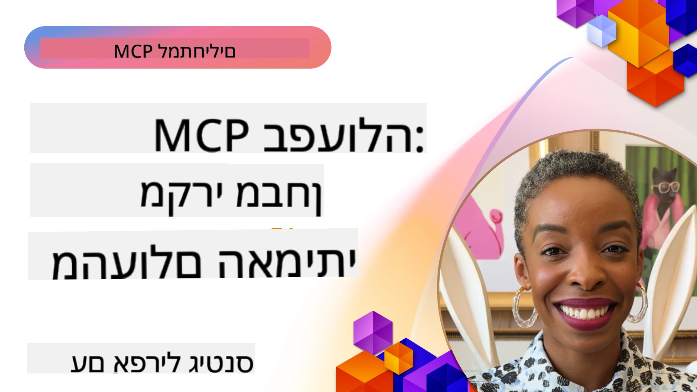

# MCP בפעולה: מחקרי מקרה מהעולם האמיתי

_(לחצו על התמונה מעלה כדי לצפות בסרטון של השיעור הזה)_

פרוטוקול הקשר המודל (MCP) משנה את האופן שבו יישומי AI מתקשרים עם נתונים, כלים ושירותים. מקטע זה מציג מחקרי מקרה מהעולם האמיתי המדגימים יישומים מעשיים של MCP בתרחישי ארגון שונים.

## סקירה כללית

מקטע זה מציג דוגמאות מוחשיות של יישומי MCP, המדגיש כיצד ארגונים מנצלים פרוטוקול זה לפתירת אתגרים עסקיים מורכבים. באמצעות בחינת מחקרי מקרה אלה, תקבלו תובנות על רב גוניות, מדרגות ויתרונות מעשיים של MCP בתרחישים מהעולם האמיתי.

## יעדי למידה מרכזיים

באמצעות חקר מחקרי המקרה האלה, תוכלו:

- להבין כיצד ניתן ליישם MCP לפתירת בעיות עסקיות ספציפיות
- ללמוד על דפוסי אינטגרציה שונים וגישות ארכיטקטוניות
- לזהות שיטות עבודה מומלצות ליישום MCP בסביבות ארגוניות
- לקבל תובנות על האתגרים והפתרונות שנמצאו ביישומים בעולם האמיתי
- לזהות הזדמנויות ליישם דפוסים דומים בפרויקטים שלכם

## מחקרי מקרה מוצגים

### 1. [סוכני הנסיעות של Azure AI – יישום התייחסות](./travelagentsample.md)

מחקר מקרה זה בוחן את הפתרון המלא של מיקרוסופט אשר מדגים כיצד לבנות יישום תכנון נסיעות מרובה-סוכנים עם בינה מלאכותית באמצעות MCP, Azure OpenAI, ו-Azure AI Search. הפרויקט מציג:

- ארכיטקטורת ריבוי סוכנים דרך MCP
- אינטגרציית נתונים ארגונית עם Azure AI Search
- ארכיטקטורה מאובטחת ומדרגתית באמצעות שירותי Azure
- כלים ניתנים להרחבה עם רכיבי MCP ניתנים לשימוש חוזר
- חוויית משתמש שיחתית מונעת על ידי Azure OpenAI

פרטי הארכיטקטורה והיישום מספקים תובנות חשובות לבניית מערכות מורכבות מרובת סוכנים עם MCP כשכבת תאום.

### 2. [עדכון פריטי Azure DevOps מנתוני YouTube](./UpdateADOItemsFromYT.md)

מחקר מקרה זה מציג יישום מעשי של MCP לאוטומציה של תהליכי עבודה. הוא מראה כיצד ניתן להשתמש בכלי MCP כדי:

- לחלץ נתונים מפלטפורמות מקוונות (YouTube)
- לעדכן פריטי עבודה במערכות Azure DevOps
- ליצור תהליכי עבודה אוטומטיים חוזרים
- לשלב נתונים בין מערכות שונות

דוגמה זו ממחישה כיצד יישומי MCP פשוטים יחסית יכולים לספק שיפורים משמעותיים ביעילות באמצעות אוטומציה של משימות שגרתיות ושיפור עקביות הנתונים בין המערכות.

### 3. [שליפת תיעוד בזמן אמת עם MCP](./docs-mcp/README.md)

מחקר מקרה זה מלווה אתכם בחיבור לקוח קונסול Python לשרת Model Context Protocol (MCP) לשליפת תיעוד Microsoft בזמן אמת ומותאם להקשר. תלמדו כיצד:

- להתחבר לשרת MCP באמצעות לקוח Python ו-SDK הרשמי של MCP
- להשתמש בלקוחות HTTP בזרימה לשליפת נתונים יעילה בזמן אמת
- לקרוא לכלי תיעוד על השרת ולתעד תגובות ישירות לקונסול
- לשלב תיעוד Microsoft מעודכן בעבודתכם מבלי לצאת מהטרמינל

הפרק כולל משימה מעשית, דוגמת קוד מינימלית וקישורים למשאבים נוספים ללמידה מעמיקה. ראו את ההדרכה המלאה והקוד בפרק המקושר כדי להבין כיצד MCP יכול לשפר את הגישה לתיעוד ואת הפרודוקטיביות במפתחים בסביבות קונסול.

### 4. [יישומון אינטראקטיבי ליצירת תוכנית לימודים עם MCP](./docs-mcp/README.md)

מחקר מקרה זה מדגים כיצד לבנות יישום אינטראקטיבי באינטרנט באמצעות Chainlit ופרוטוקול הקשר המודל (MCP) ליצירת תוכניות לימודים מותאמות אישית לכל נושא. משתמשים יכולים לציין נושא (כגון "הסמכת AI-900") ומשך לימודים (למשל, 8 שבועות), והאפליקציה תספק פירוט תוכן שבוע-בשבוע. Chainlit מאפשר ממשק צ'אט שיחתי, מה שהופך את החוויה למרתקת ומתאימה.

- אפליקציית רשת שיחתית מופעלת על ידי Chainlit
- קלט מבוסס משתמש לנושא ומשך
- המלצות תוכן שבוע-בשבוע באמצעות MCP
- תגובות בזמן אמת ומתאימות בממשק שיחה

הפרויקט ממחיש כיצד ניתן לשלב בינה מלאכותית שיחתית ו-MCP ליצירת כלי חינוכיים דינמיים ומונחי משתמש בסביבת אינטרנט מודרנית.

### 5. [תיעוד בתוך העורך עם שרת MCP ב-VS Code](./docs-mcp/README.md)

מחקר מקרה זה מדגים כיצד ניתן להביא את תיעוד Microsoft Learn ישירות לסביבת VS Code באמצעות שרת MCP — אין צורך לעבור בין לשוניות דפדפן! תראו כיצד:

- לחפש ולקרוא תיעוד מיד בתוך VS Code באמצעות הפאנל או פקודת הפקודה של MCP
- להפנות תיעוד ולהכניס קישורים ישירות לקבצי README או markdown של הקורס
- להשתמש ב-GitHub Copilot ו-MCP יחד לעבודה חלקה, מונעת בינה מלאכותית לתיעוד וזרימות קוד
- לאמת ולשפר את התיעוד עם משוב בזמן אמת ודיוק שמקורו במיקרוסופט
- לשלב את MCP בזרימות עבודה ב-GitHub לאימות תיעוד רציף

היישום כולל:

- קובץ קונפיגורציה לדוגמה `.vscode/mcp.json` להקמה קלה
- תיעוד מסך של חוויית השימוש בתוך העורך
- טיפים לשילוב Copilot ו-MCP למקסימום פרודוקטיביות

תרחיש זה אידיאלי למחברי קורסים, כותבי תיעוד ומפתחים שמעוניינים להישאר ממוקדים בעורך תוך עבודה עם תיעוד, Copilot, וכלי אימות — כולם מופעלים על ידי MCP.

### 6. [יצירת שרת MCP ב-APIM](./apimsample.md)

מחקר מקרה זה מספק מדריך שלב אחר שלב כיצד ליצור שרת MCP באמצעות Azure API Management (APIM). הוא מכסה:

- הקמת שרת MCP ב-Azure API Management
- חשיפת פעולות API ככלי MCP
- קביעת מדיניות להגבלת קצב ואבטחה
- בדיקת שרת MCP באמצעות Visual Studio Code ו-GitHub Copilot

דוגמה זו ממחישה כיצד להשתמש ביכולות Azure ליצירת שרת MCP יציב לשימוש ביישומים שונים, המשפר את האינטגרציה של מערכות AI עם API של הארגון.

### 7. [רישום MCP ב-GitHub — האצת אינטגרציה סוכנית](https://github.com/mcp)

מחקר מקרה זה בוחן כיצד רישום MCP של GitHub, שהושק בספטמבר 2025, מתמודד עם אתגר קריטי באקוסיסטם ה-AI: גילוי ופריסה מבוזרת של שרתי Model Context Protocol (MCP).

#### סקירה כללית
**רישום MCP** פותר את הבעיה ההולכת וגוברת של שרתי MCP מפוזרים בין מאגרי קוד ורישומים, שעיכבו אינטגרציה והיחשפו לשגיאות. שרתים אלה מאפשרים לסוכני AI להתחבר למערכות חיצוניות כמו APIs, מסדי נתונים ומקורות תיעוד.

#### בעיית המצב
מפתחים הבונים זרימות עבודה סוכניות התמודדו עם מספר אתגרים:
- **יכולת גילוי נמוכה** של שרתי MCP בפלטפורמות שונות
- **שאלות הכנה מיותרות** מפוזרות בפורומים ותיעוד
- **סיכוני אבטחה** ממקורות בלתי מאומתים ולא מהימנים
- **חוסר תקינה** באיכות וקומפטביליות השרתים

#### ארכיטקטורת פתרון
רישום MCP של GitHub מרכז שרתי MCP מהימנים עם תכונות מפתח:
- **התקנה בלחיצה אחת** באמצעות VS Code להגדרה פשוטה
- **מיון אות מול רעש** לפי כוכבים, פעילות ואימות קהילתי
- **אינטגרציה ישירה** עם GitHub Copilot וכלי MCP אחרים
- **מודל תרומה פתוח** המאפשר קהילות ושותפים ארגוניים לתרום

#### השפעה עסקית
הרישום סיפק שיפורים מדידים:
- **קיצור זמן התחלות עבודה** עבור מפתחים המשתמשים בכלים כמו שרת MCP של Microsoft Learn, הזורם תיעוד רשמי ישירות לסוכנים
- **שיפור פרודוקטיביות** באמצעות שרתים ייעודיים כמו `github-mcp-server`, המאפשרים אוטומציה טבעית של GitHub (יצירת pull request, הרצות CI, סריקת קוד)
- **אמון מחוזק באקוסיסטם** דרך רשימות מסוננות וסטנדרטים שקופים לקונפיגורציה

#### ערך אסטרטגי
עבור מתמחים בניהול מחזור חיים סוכנים וזרימות עבודה רב-פעמיות, רישום MCP מספק:
- **פריסת סוכנים מודולרית** עם רכיבים תקניים
- **צינורות הערכה מגובות ברישום** לבדיקות ואימות עקביים
- **אינטרופרביליות בין כלים** המאפשרת אינטגרציה פשוטה בין פלטפורמות AI שונות

מחקר מקרה זה מדגים שרישום MCP הוא יותר מתיקייה – זו פלטפורמה יסודית לאינטגרציה מדרגתית בעולם האמיתי ולהפעלת מערכות סוכניות.

### 8. [פרסום ברשתות חברתיות מסוכן](./publora-social-publishing.md)

מחקר מקרה זה עובר דרך **שרת MCP מרוחק עם יכולות כתיבה** — כלי שרות שגורם לפעולות בלתי הפיכות מטעם המשתמש — ומשתמש בפרסום חברתי כדוגמה מעשית. סוכן מנסח פוסט, אדם מאשר אותו, והשרת מתזמן פרסום ברשתות.

החלק המעניין הוא מגבלות העיצוב שהפרסום מטיל, החלות על כל שרת שכותב במקום לקרוא:

- **גילוי פתוח, ביצוע מאומת** — `tools/list` נענה ללא אישור כדי שרישומים ולקוחות יוכלו לאבחן, בעוד שכל `tools/call` דורש אסימון ולאחר מכן מחזיר `401` עם כותרת `WWW-Authenticate`
- **רישום OAuth ללא שלב חיצוני** — רישום לקוח דינמי כיום, עם מסמכי Client ID Metadata כמגמת המפרט ל-`2026-07-28`
- **הערות כלי** (`readOnlyHint`, `destructiveHint`, `idempotentHint`) שהלקוחות משתמשים בהן לקביעת אישור — רמזים במקום אכיפה, ומשהו שספריות מחברים מצפות לסקור
- **מזהים בלתי ניתנים להמצאה**, כך שערך מומצא נכשל בצלצול במקום לפעול על אחר שנראה סביר
- **מפתחות חד-פעמיות על כלים היוצרים פוסטים**, כך שנסיון חוזר בזמן ריצה לא ייצור פרסום כפול
- **יעד חסר-פעולה שמתואר בסכמת הכלי** שמפעיל את נתיב הכתיבה המלא ואינו מפרסם דבר, לביקורת וממשק CI

הפרק מסתיים עם רשימת בדיקה קצרה שתוכלו ליישם על שרת שאתם בונים.

## סיכום

שמונת מחקרי המקרה המקיפים הללו מראים את הרב גוניות המרשימה ואת היישומים המעשיים של פרוטוקול הקשר המודל במגוון תרחישים בעולם האמיתי. ממערכות תכנון נסיעות מרובות סוכנים מורכבות וניהול API ארגוני ועד לזרימות עבודה של תיעוד ולקוח GitHub MCP Registry הפורץ דרך – דוגמאות אלה מציגות כיצד MCP מספק את הדרך התקנית, המדרגתית לחיבור מערכות AI עם הכלים, הנתונים והשירותים הדרושים להם להבאת ערך יוצא דופן.

מחקרי המקרה מכסים מספר מימדים של יישום MCP:
- **אינטגרציה ארגונית**: ניהול API של Azure ואוטומציה ב-Azure DevOps
- **תיאום רב-סוכני**: תכנון נסיעות עם סוכני AI מתואמים
- **פרודוקטיביות מפתחים**: אינטגרציה ב-VS Code וגישה לתיעוד בזמן אמת
- **פיתוח אקוסיסטם**: רישום MCP של GitHub כפלטפורמה יסודית
- **יישומים חינוכיים**: יישומי מחקר אינטראקטיביים וממשקי שיחה

בלימוד היישומים האלה, תרכשו תובנות קריטיות על:
- **דפוסי ארכיטקטורה** לסקאלות שונות ומקרי שימוש מגוונים
- **אסטרטגיות יישום** המאזנות בין פונקציונליות לתחזוקה
- **שיקולי אבטחה ומדרגות** לפריסות בייצור
- **שיטות עבודה מומלצות** לפיתוח שרת MCP ואינטגרציית לקוחות
- **חשיבה אקוסיסטמית** לבניית פתרונות חכמים בין-כלייים ומונעי AI

דוגמאות אלה מצביעות על כך ש-MCP הוא לא רק מסגרת תיאורטית אלא פרוטוקול בוגר ומוכן לייצור, המאפשר פתרונות מעשיים לאתגרים עסקיים מורכבים. בין אם אתם בונים כלי אוטומציה פשוטים או מערכות מרובות סוכנים מתוחכמות, הדפוסים והגישות המתוארים כאן מספקים בסיס איתן לפרויקטי MCP שלכם.

## משאבים נוספים

- [מאגר GitHub של סוכני הנסיעות של Azure AI](https://github.com/Azure-Samples/azure-ai-travel-agents)
- [כלי MCP ל-Azure DevOps](https://github.com/microsoft/azure-devops-mcp)
- [כלי MCP ל-Playwright](https://github.com/microsoft/playwright-mcp)
- [שרת MCP לתיעוד Microsoft Docs](https://github.com/MicrosoftDocs/mcp)
- [רישום MCP של GitHub — האצת אינטגרציה סוכנית](https://github.com/mcp)
- [דוגמאות קהילה ל-MCP](https://github.com/microsoft/mcp)

## מה הלאה

- קודם: [מודול 8: שיטות עבודה מומלצות](../08-BestPractices/README.md)
- הבא: [מודול 10: ייעול זרימות עבודה עם AI: בניית שרת MCP עם סט כלים AI](../10-StreamliningAIWorkflowsBuildingAnMCPServerWithAIToolkit/README.md)

---

<!-- CO-OP TRANSLATOR DISCLAIMER START -->
**כתב ויתור**:
מסמך זה תורגם באמצעות שירות תרגום אוטומטי [Co-op Translator](https://github.com/Azure/co-op-translator). למרות שאנו שואפים לדיוק, יש לקחת בחשבון שתרגומים אוטומטיים עלולים להכיל שגיאות או אי-דיוקים. יש להחשיב את המסמך המקורי בשפתו הטבעית כמקור הסמכות. למידע קריטי מומלץ להשתמש בתרגום מקצועי על ידי מתרגם אדם. אנו לא אחראים לכל אי-הבנה או פירוש שגוי הנובע מהשימוש בתרגום זה.
<!-- CO-OP TRANSLATOR DISCLAIMER END -->