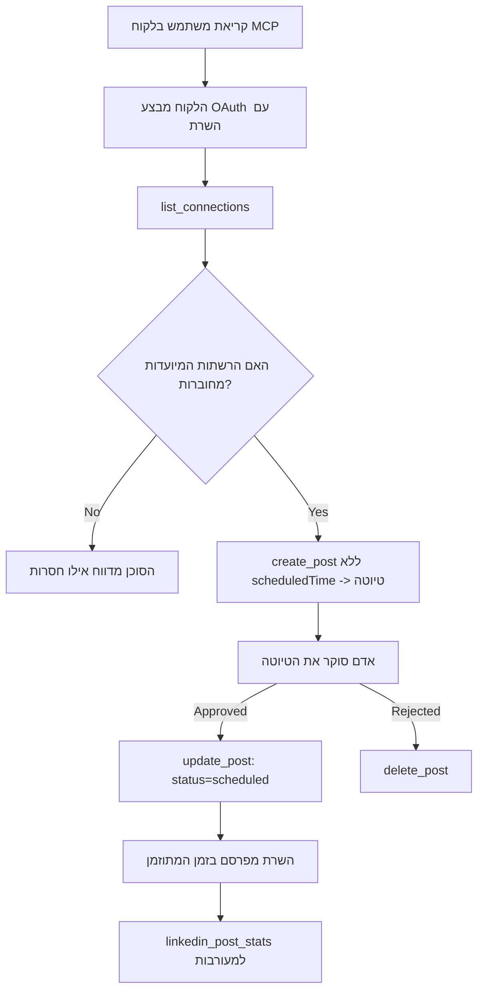

# מחקר מקרה: פרסום לרשתות חברתיות מסוכן עם שרת MCP מרוחק

> **כתב ויתור:** כמה שירותים ופרויקטים בקוד פתוח יכולים לפרסם לרשתות חברתיות, וכן צוות יכול גם לשלב ישירות את ה-API של כל רשת. התרחיש למטה מסופק כדוגמה לעבודה כיצד ניתן לתכנן ולצרוך **שרת MCP מרוחק עם יכולת כתיבה**. Publora הוא שירות מסחרי עם שכבת חינם; התבניות המתוארות כאן חלות על כל שרת MCP שמבצע פעולות בלתי הפיכות מטעם המשתמש.

## מבט כללי

סוכנים טובים בניסוח תוכן וגרועים בהפצתו. מודל יכול לכתוב הודעת שחרור תוך שניות, ואז העבודה נעצרת: פרסום פירושו API לכל רשת, אפליקציית OAuth לכל רשת, וקבוצת כללים שונה של מדיה לכל אחת. רוב הצוותים פותרים זאת על ידי העתקת הטקסט לדפדפן באופן ידני.

מחקר מקרה זה בוחן כיצד השלב האחרון הזה נסגר עם שרת MCP מרוחק יחיד, ו—יותר חשוב למי שבונה אחד כזה—החלטות העיצוב ששרת **עם יכולת כתיבה** צריך לבצע נכון. קריאת נתונים היא סלחנית. פרסום אינו כזה: קריאה שגויה לכלי נראית לקהל ואינה ניתנת לביטול.

## תרחיש

צוות קטן של קשרי מפתחים מצליח לנסח פוסטים בתוך סוכן (כולל Claude, VS Code, Cursor — הלקוח אינו משנה). הם רוצים שהסוכן:

- יראה אילו חשבונות חברתיים הצוות מחובר אליהם,
- ינסח פוסט וישמור אותו כטיוטה לאישור בן אדם,
- יצמיד תמונה,
- יתזמן אותו לכמה רשתות בזמן שנבחר,
- ודווח מאוחר יותר כיצד הוא עמד בביצועים.

חשוב, שהם רוצים שהסוכן *לא יוכל* לפרסם בטעות בזמן שהם עדיין מנסים.

## כלים בשימוש

- [שרת MCP של Publora](https://github.com/publora/mcp-server) — שרת MCP מרוחק (`streamable-http`) החושף כלי פרסום, תזמון, מדיה וניתוח לינקדאין. רשום ברישום הרשמי של MCP כ-`com.publora/mcp-server`.

## זרימת עבודה שלב אחר שלב

1. **חבר את השרת.** לקוחות המדברים OAuth משלימים את זרימת הקוד-הרשאה עם PKCE מול מסך ההסכמה של השרת עצמו; לקוחות שאינם, כגון CLI ללא ממשק, משתמשים במפתח API של Publora בכותרת. נתמכות שתי הדרכים, ואיזו תקבל תלוי בלקוח, לא בשרת.
2. **רשום חיבורים.** הסוכן קורא ל-`list_connections` ומקבל את החשבונות המחוברים עם מזהיהם.
3. **כתוב טיוטה.** הסוכן קורא ל-`create_post` *בלי* זמן מתוזמן. הפוסט נשמר כטיוטה — כלום לא מתפרסם.
4. **צרף מדיה.** כתובות URL ציבוריות לתמונות נמסרות באותה קריאה; השרת מוריד ומאמת אותן.
5. **תזמן.** אחרי שאדם מאשר, `update_post` מגדיר את הסטטוס כמתוזמן עם זמן בפורמט ISO 8601.
6. **מדוד.** עבור לינקדאין, `linkedin_post_stats` מחזיר מעורבות לאחר שהפוסט חי.

## דוגמת פקודה

```text
Which social accounts do I have connected?
Draft a post announcing our new changelog page, attach the screenshot at
https://example.com/changelog.png, and keep it as a draft — do not publish it.
Once I approve, schedule it to LinkedIn and Bluesky for tomorrow at 09:00 UTC.
```

## דיאגרמת פרוזה של מרמיד



## מימוש טכני

הלקחים למטה הם החלק הניתן להעברה ממחקר מקרה זה.

### גילוי פתוח, ביצוע מאומת

`tools/list` מוגש ללא אישורים; כל `tools/call` דורש טוקן ומחזיר `401` עם כותרת `WWW-Authenticate` שמצביעה על מטא-נתוני המשאב המוגן. (השרת גם עונה ל-`initialize` ללא אימות, שרלוונטי רק ללקוחות בגרסאות פרוטוקול לפני `2026-07-28`; עדכון זה הסיר לגמרי את המשאל.)

החלוקה הזו חשובה במציאות. רישומים, קטלוגים ולקוחות יכולים לבחון את ממשק הכלים - שמות, סכימות, הערות - בלי להחזיק סוד, בעוד ששום דבר לא יכול להיות *מתבצע* באנונימיות. שרת שדורש טוקן ל-`initialize` הוא למעשה בלתי נראה לכלי; שרת שמאפשר `tools/call` אנונימי הוא סיכון.

### הרשמה: רישום דינמי ללקוח, ומה מחליף אותו

השרת מפרסם את `/.well-known/oauth-protected-resource` ואת `/.well-known/oauth-authorization-server`, ותומך בזרימת קוד ההרשאה עם PKCE (`S256`), טוקני ריענון, ו**רישום דינמי ללקוח**.

רישום דינמי מסיר את השלב הידני: בלעדיו כל לקוח זקוק ל-`client_id` מוקדם, כלומר בקשה מחוץ לערוץ לספק עבור כל לקוח חדש.

התייחס לזה כהתנהגות תאימות ולא כעיצוב לשכפול. העדכון של המפרט בתאריך `2026-07-28` מפסיק את רישום הלקוח הדינמי לטובת מסמכי מטא-נתוני מזהה לקוח, שבהם הלקוח מאחסן מסמך מטא-נתונים ב-HTTPS יציב וכתובת זו *היא* ה-`client_id`. DCR ממשיכה לעבוד כרגע, אבל שרת שנבנה היום צריך לתכנן עבור CIMD ולהשאיר DCR רק ללקוחות ישנים יותר.

### הערות לכלים אינן רק עיטור

כל כלי נושא `title` ואת הרמזים המתאימים: `readOnlyHint`, `destructiveHint`, `idempotentHint`, `openWorldHint`.

יש שתי סיבות להשקיע בהם. ראשית, לקוחות משתמשים ברמזים כדי להחליט מה לאשר עם המשתמש — לקוח יכול להריץ אוטומטית חיפוש לקריאה בלבד ולעצור לאישור לפני מחיקה. המפרט ברור שההערות הן רמזים שאינם מהימנים, לא מנגנון הרשאה: הן מעצבות מה שהלקוח מציע לעשות, אינן עוצרות דבר בשרת, והשרת חייב עדיין לאכוף את הכללים שלו. שנית, מדריכי חיבורים עיקריים דרשו אותן עכשיו לסקירה; שרת שכליו חסרים כותרות ורמזים יוחזר ללא קשר לאיך שהוא עובד.

### הפוך מזהים לבלתי ניתן להמצאה

מזהי פלטפורמה הם מחרוזות אטומות המוחזרות על ידי `list_connections`, ותיאור הסכימה מציין במפורש שיש להעתיקן בדיוק כפי שהן ואסור לנחשן. השרת דוחה כל דבר אחר.

מודלים הם ניחושני שפה שוטפים. כל שרת עם יכולת כתיבה צריך להניח שמזהה יופיע בסופו של דבר כהזיה ולגרום לכך להיכשל בקול רם ובהתחלה, במקום לפעול על ערך שנראה סביר.

### נכשל לפני פרסום, עם הודעה ניתנת לפעולה

כמה רשתות מסרבות לפוסטים עם טקסט בלבד ודורשות תמונה או וידאו. הדבר מאומת כאשר הפוסט מתוזמן, והטעות מציינת את הפלטפורמה ואת הדרישה החסרה.

סוכן יכול להתאושש מ-"Instagram דורשת מדיה — צרף תמונה או וידאו" ללא סבב נוסף. אי אפשר להתאושש מ-`400` כללי.

### הפוך ניסיונות חוזרים לבטוחים

שני הכלים שיוצרים תוכן, `create_post` ו-`update_post`, מקבלים מפתח הזהות idempotency: שימוש חוזר בו עם בקשה זהה משחזר את התגובה המקורית במקום ליצור פוסט שני. סביבת ריצה של סוכן מנסה מחדש על גבי חריגות זמן; בלי זה, תגובה איטית הופכת לפרסום כפול. שאר כלים לכתיבה — מחיקות, שלבים במדיה, תגובות ותגובות בלינקדאין — לא מקבלים כזה, כך שניסיון חוזר שם אינו בטוח אוטומטית. שווה לדעת אילו מן השינויים שלך מוגנים ואילו לא.

### ספק דרך לבדיקה שאינה מפרסמת דבר

השרת מקבל יעד שמור, `publora-playground`, אשר מאומת ומאושר כמו יעד אמיתי ואז מתבטל — שום דבר אינו מגיע לחשבון חי. הוא מתואר בסכמת הכלי עצמו, שכל לקוח יכול לקרוא ללא אישורים: שדה `platforms` של `create_post` מתעד אותו כ"יעד בדיקת חיבור שדורש ללא חיבור אמיתי — הפוסט מאושר ומתבטל, כלום לא מתפרסם". הפעל אותו על ידי העברתו ככניסה יחידה: `platforms: ["publora-playground"]`.

פרטים אלו התבררו כאחד מהשימושיים ביותר בממשק כולו. מבקרים במדריכי חיבורים, תורמים ו-CI יכולים לבדוק את כל נתיב הכתיבה מקצה לקצה ללא סיכון לקהל אמיתי. כל שרת MCP עם פעולות בלתי הפיכות נהנה מיעד שום-פעולה מתועד.

## תוצאות והשפעה

- שלב הפרסום הועבר מהדפדפן לאותו שיחה שבה התוכן נכתב, והרגל טיוטה-קודם שומר אדם בתהליך. היה מדויק במה זה: טיוטה היא קונבנציה, לא גבול. אישור זהה יכול לתזמן או לפרסם, כך שמי שצריך שער אישור אמיתי חייב לאכוף זאת מחוץ לממשק הכלים — אישורים נפרדים, או שכבת מדיניות מול השרת.
- הבדלים ברשתות — דרישות מדיה, שרשור, בקרות תגובה — מטופלים פעם אחת בשרת במקום בכל סוכן שמדבר איתו.
- אותו שרת תומך בכמה לקוחות MCP ללא עבודה לכל לקוח, כי הגילוי פתוח והרישום דינמי.
- הגבלות העיצוב למעלה עוצבו הן על ידי סקרי מדריכי חיבורים והן על ידי משתמשים: הערות, OAuth ויעד בדיקה בטוח היו דרושים לכל אחד מהם.

## הפניות

- [שרת MCP של Publora (מקור)](https://github.com/publora/mcp-server)
- [תיעוד API ו-MCP של Publora](https://docs.publora.com)
- [רישום MCP: `com.publora/mcp-server`](https://registry.modelcontextprotocol.io/v0/servers?search=com.publora/mcp-server)
- [מפרט MCP — הרשאות](https://modelcontextprotocol.io/specification/draft/basic/authorization)
- [מפרט MCP — הערות לכלים](https://modelcontextprotocol.io/docs/concepts/tools)

## מה הלאה

- קח שרת MCP שאתה בונה ובדוק את שלושת ההצלחות הזולות כאן: הערות על כל כלי, מפתח idempotency על כל כתיבה, ויעד שום-פעולה מתועד.
- נסה את החלוקה גילוי פתוח: קרא ל-`tools/list` מול שרת מרוחק ציבורי ללא אישורים, ואז קרא לכלי ובדוק את האתגר `401`.
- שקול מה פירוש "בטל" בתחום שלך. לפרסום יש טיוטות ומחיקה; אם לפעולות שלך אין מקביל, האישור שייך לעיצוב הכלי, לא להוראה.

---

<!-- CO-OP TRANSLATOR DISCLAIMER START -->
**כתב ויתור**:
מסמך זה תורגם באמצעות שירות תרגום אוטומטי [Co-op Translator](https://github.com/Azure/co-op-translator). למרות שאנו שואפים לדיוק, יש לקחת בחשבון שתרגומים אוטומטיים עלולים להכיל שגיאות או אי-דיוקים. יש להחשיב את המסמך המקורי בשפתו הטבעית כמקור הסמכות. למידע קריטי מומלץ להשתמש בתרגום מקצועי על ידי מתרגם אדם. אנו לא אחראים לכל אי-הבנה או פירוש שגוי הנובע מהשימוש בתרגום זה.
<!-- CO-OP TRANSLATOR DISCLAIMER END -->