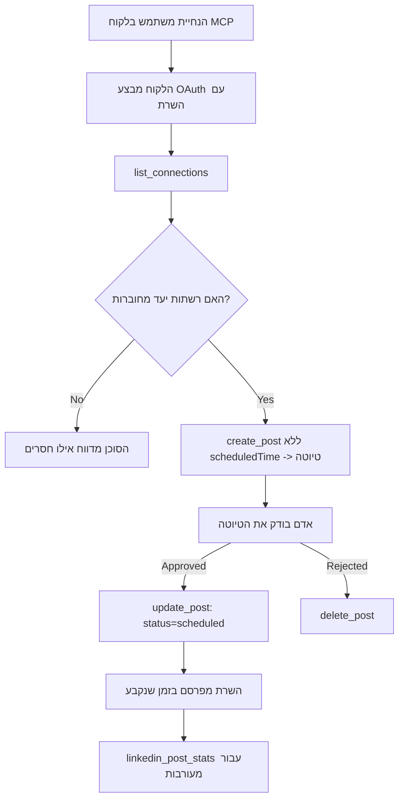

# מקרה מבחן: פרסום ברשתות חברתיות מסוכן עם שרת MCP מרוחק

> **כתב ויתור:** מספר שירותים ופרויקטים בקוד פתוח יכולים לפרסם ברשתות חברתיות, וצוות יכול גם לשלב את API של כל רשת ישירות. התרחיש שלהלן מסופק כדוגמה מוצלחת לאופן שבו ניתן לעצב ולצרוך **שרת MCP מרוחק עם יכולת כתיבה**. Publora הוא שירות מסחרי עם שכבת חינם; התבניות המתוארות כאן חלות על כל שרת MCP שמבצע פעולות בלתי הפיכות בשם המשתמש.

## מבט כללי

סוכנים טובים ביצירת תוכן וגרועים באספקתו. מודל יכול לכתוב הודעת שחרור בשניות, ואז העבודה נעצרת: פרסום זה אומר API לכל רשת, אפליקציית OAuth לכל רשת, וקבוצת כללי מדיה שונה לכל אחת מהן. רוב הצוותים פותרים זאת על ידי העתקת הטקסט לדפדפן ידנית.

מקרה מבחן זה בוחן כיצד השלב האחרון הזה נסגר עם שרת MCP מרוחק יחיד, ו—יותר שימושי למי שבונה אחד כזה — בהחלטות העיצוב ששרת **עם יכולת כתיבה** צריך לקבל נכון. קריאת נתונים מקנה סלחנות. פרסום לא: קריאה שגויה לכלי נראית לקהל ואינה ניתנת לביטול.

## תרחיש

צוות קטן של מתאמי מפתחים מנסחים פוסטים בתוך סוכן (Claude, VS Code, Cursor — הלקוח אינו משנה). הם רוצים שהסוכן:

- יראה אילו חשבונות חברתיים הצוות חיבר,
- ינסה לנסח פוסט וישמור אותו כטיוטה לאישור אדם,
- יצמיד תמונה,
- יזם פרסום למספר רשתות בזמן שנבחר,
- ובשלב מאוחר יותר ידווח על התפקוד.

קריטי שהם ירצו שהסוכן *לא יוכל* לפרסם בטעות בעוד הם עדיין מתנסים.

## כלים בשימוש

- [שרת MCP של Publora](https://github.com/publora/mcp-server) — שרת MCP מרוחק (`streamable-http`) החושף כלי פרסום, תזמון, מדיה וכלי ניתוח LinkedIn. רשום במאגר הרשמי של MCP כ- `com.publora/mcp-server`.

## זרימת עבודה שלב אחר שלב

1. **חיבור השרת.** לקוחות התומכים ב-OAuth משלימים את זרימת קוד האישור עם PKCE מול מסך ההסכמה של השרת; לקוחות שאינם, כמו CLI ללא ממשק, משתמשים במפתח API של Publora בכותרת. שתי הדרכים נתמכות, והדרך שתקבל תלויה בלקוח, לא בשרת.
2. **רשימת החיבורים.** הסוכן קורא ל-`list_connections` ומקבל את החשבונות המחוברים עם המזהים שלהם.
3. **טיוטה.** הסוכן קורא ל-`create_post` *בלי* זמן מתוזמן. הפוסט נשמר כטיוטה — לא מתפרסם דבר.
4. **הוספת מדיה.** כתובות URL לתמונות ציבוריות נמסרות באותה הקריאה; השרת מוריד ומאמת אותן.
5. **תזמון.** לאחר שאדם מאשר, `update_post` משנה את הסטטוס למתוזמן עם זמן בפורמט ISO 8601.
6. **מדידה.** עבור LinkedIn, `linkedin_post_stats` מחזיר נתוני מעורבות לאחר שהפוסט חי.

## דוגמת קוד פקודה

```text
Which social accounts do I have connected?
Draft a post announcing our new changelog page, attach the screenshot at
https://example.com/changelog.png, and keep it as a draft — do not publish it.
Once I approve, schedule it to LinkedIn and Bluesky for tomorrow at 09:00 UTC.
```

## תרשים זרימה במרמיד



## יישום טכני

הלקחים שלהלן הם החלק העובר למקרים אחרים במבחן זה.

### גילוי פתוח, ביצוע מאומת

`tools/list` מוגש ללא אישורים; כל `tools/call` דורש אסימון
ובמקרה שלא, מחזיר `401` עם כותרת `WWW-Authenticate` שמצביעה על
מטא-דאטה של משאב מוגן. נקודת הקצה הישנה של השרת גם עונה על
`initialize` בלתי מאומת עבור לקוחות בגרסאות פרוטוקול לפני
`2026-07-28`; לקוחות מודרניים לא משתמשים בלחיצת היד הזו.

הפיצול הספציפי לשרת זה מאפשר לרשימות רישום, קטלוגים ולקוחות לבדוק שמות כלים,
סכימות והערות ללא צורך בסוד ומונע ביצוע אנונימי.
גילוי פתוח הוא בחירת פריסה, לא דרישת MCP; פריסה מוגנת עשויה לדרוש גם הרשאה ל-`tools/list`.


כל לקוח היה זקוק ל-`client_id` מוקדם מהספק.


זה התברר כאחד הפרטים הכי שימושיים של כל הממשק. סוקרים של ספריות קונקטורים, תורמים ו-CI יכולים לבצע את כל מסלול הכתיבה מקצה לקצה ללא סיכון לקהל אמיתי. כל שרת MCP עם פעולות בלתי-הפיכות מרוויח מיעד no-op מתועד.

## תוצאות והשפעה

- שלב הפרסום הועבר מדפדפן לאותה שיחה שבה התוכן נכתב, והרגל של טיוטה ראשונה שומר על מעורבות אדם בתהליך. להיות מדויק לגבי מה זה: טיוטה היא מוסכמה, לא גבול. אותו אישור יכול לתזמן או לפרסם, לכן מי שצריך שער אישור אמיתי חייב לאכוף זאת מחוץ לשטח הכלי — הרשאות מופרדות, או שכבת מדיניות מול השרת.
- ההבדלים בין רשת לרשת — דרישות מדיה, שרשור, בקרות תגובה — מטופלים פעם אחת בשרת במקום בכל סוכן שמדבר איתו.
- אותו שרת תומך בכמה לקוחות MCP ללא הרשאות מוקדמות.
    לקוחות נוכחיים יכולים להשתמש ב-Client ID Metadata Documents; DCR נשאר פתרון גיבוי
    ללקוחות ישנים.
- מגבלות העיצוב לעיל עוצבו על ידי ביקורות ספריות קונקטורים כמו גם על ידי משתמשים: הערות, OAuth ויעד בדיקה בטוח נדרשו כל אחד ע"י לפחות אחד מהם.

## הפניות

- [שרת MCP של Publora (מקור)](https://github.com/publora/mcp-server)
- [תיעוד API ו-MCP של Publora](https://docs.publora.com)
- [רישום MCP: `com.publora/mcp-server`](https://registry.modelcontextprotocol.io/v0/servers?search=com.publora/mcp-server)
- [מפרט MCP — הרשאה](https://modelcontextprotocol.io/specification/2026-07-28/basic/authorization)
- [מפרט MCP — תגי כלים](https://modelcontextprotocol.io/docs/concepts/tools)

## מה הלאה

- קחו שרת MCP שאתם בונים ובדקו את שלושת הנצחונות הכי זולים כאן: הערות על כל כלי, מפתח איזומנטיות על כל כתיבה, ויעד no-op מתועד.
- נסו את הפיצול של גילוי פתוח: קראו ל-`tools/list` מול שרת מרוחק ציבורי ללא אישורים, ואז קראו לכלי ובדקו את אתגר `401`.
- שקלו מה "ביטול" אומר עבור הדומיין שלכם. לפרסום יש טיוטות ומחיקות; אם לפעולות שלכם אין מקבילה, האישור שייך לעיצוב הכלי, לא להנחיה.

---

<!-- CO-OP TRANSLATOR DISCLAIMER START -->
**כתב ויתור**:
מסמך זה תורגם באמצעות שירות תרגום אוטומטי [Co-op Translator](https://github.com/Azure/co-op-translator). למרות שאנו שואפים לדיוק, יש לקחת בחשבון שתרגומים אוטומטיים עלולים להכיל שגיאות או אי-דיוקים. יש להחשיב את המסמך המקורי בשפתו הטבעית כמקור הסמכות. למידע קריטי מומלץ להשתמש בתרגום מקצועי על ידי מתרגם אדם. אנו לא אחראים לכל אי-הבנה או פירוש שגוי הנובע מהשימוש בתרגום זה.
<!-- CO-OP TRANSLATOR DISCLAIMER END -->