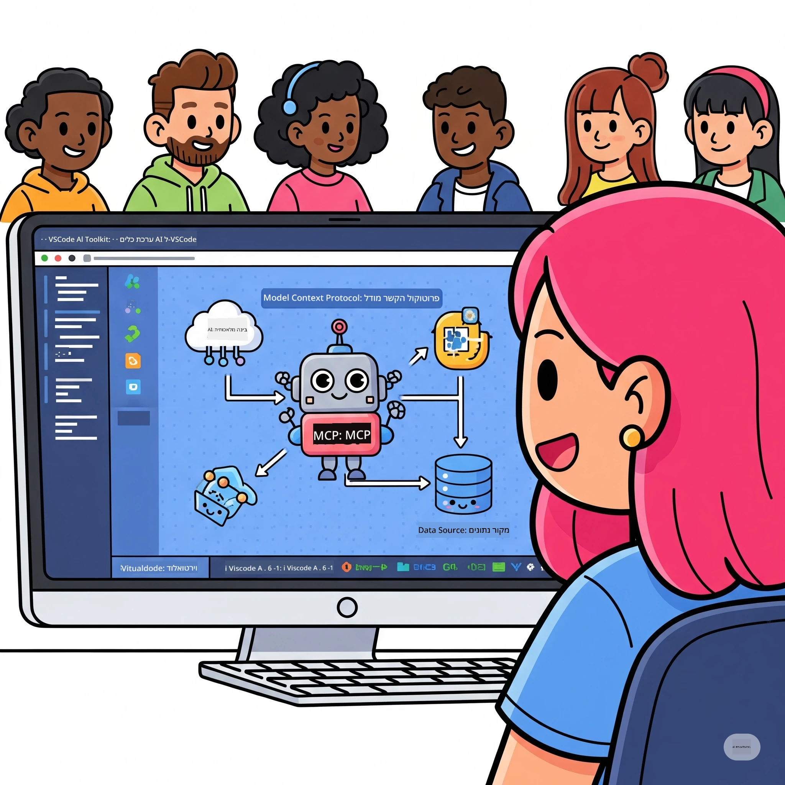
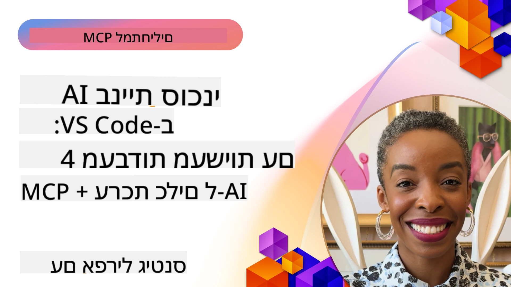

# ייעול זרימות עבודה של בינה מלאכותית: בניית שרת MCP עם Microsoft Foundry Toolkit

## 🎯 סקירה כללית

_(לחץ על התמונה למעלה לצפייה בוידאו של השיעור)_

ברוכים הבאים ל**סדנת פרוטוקול הקשר לדגמים (MCP)**! סדנה מעשית מקיפה זו משלבת שתי טכנולוגיות חדישות כדי לחדש את פיתוח יישומי הבינה המלאכותית:

> **הערת תאימות:** קוד הסדנה נבנה ונבדק עם MCP
> `2025-11-25`, כפי שמוצג על הסמל למעלה. השתמש ב-
> [המפרט הנוכחי `2026-07-28`](https://modelcontextprotocol.io/specification/2026-07-28/)
> ליישומי פרוטוקול חדשים ועיין בהערות שחרור ה-SDK לפני
> העברת המעבדות.

- **🔗 פרוטוקול הקשר לדגמים (MCP)**: תקן פתוח לאינטגרציה חלקה של כלי בינה מלאכותית
- **🛠️ תוסף Microsoft Foundry Toolkit ל-VS Code**: תוסף הפיתוח החזק של מיקרוסופט לבינה מלאכותית

### 🎓 מה תלמדו

בסיום סדנה זו, תשלוטו באומנות בניית יישומים חכמים המחברים דגמי בינה מלאכותית עם כלים ושירותים אמיתיים. מבדיקות אוטומטיות ועד אינטגרציות API מותאמות אישית, תרכשו מיומנויות מעשיות לפתרון אתגרים עסקיים מורכבים.

## 🏗️ ערימת טכנולוגיה

### 🔌 פרוטוקול הקשר לדגמים (MCP)

MCP הוא ה**"USB-C של הבינה המלאכותית"** - תקן אוניברסלי שמחבר דגמי בינה מלאכותית לכלים חיצוניים ומקורות נתונים.

**✨ תכונות מרכזיות:**

- 🔄 **אינטגרציה סטנדרטית**: ממשק אוניברסלי לחיבורי כלי בינה מלאכותית
- 🏛️ **ארכיטקטורה גמישה**: שרתים מקומיים ומרוחקים באמצעות העברת stdio/SSE
- 🧰 **אקוסיסטם עשיר**: כלים, הנחיות ומשאבים בפרוטוקול אחד
- 🔒 **מוכן לארגון**: אבטחה ואמינות מובנות

**🎯 למה MCP חשוב:**
כמו USB-C שביטל את הכאוס של הכבלים, MCP מבטל את המורכבות של אינטגרציות בינה מלאכותית. פרוטוקול אחד, אפשרויות אינסופיות.

### 🤖 תוסף Microsoft Foundry Toolkit ל-VS Code

תוסף דגל לפיתוח בינה מלאכותית של מיקרוסופט שמשנה את VS Code לכוח על של בינה מלאכותית.

**🚀 יכולות ליבה:**

- 📦 **קטלוג דגמים**: גישה לדגמים מ-Azure AI, GitHub, Hugging Face, Ollama
- ⚡ **הסקה מקומית**: ביצוע מותאם ONNX על CPU/GPU/NPU
- 🏗️ **בונה סוכנים**: פיתוח סוכני בינה מלאכותית ויזואלי עם אינטגרציית MCP
- 🎭 **רב-מודלי**: טקסט, ראייה ותמיכה ביציאה מובנית

**💡 יתרונות פיתוח:**

- פריסה ללא הגדרות
- הנדסה ויזואלית של הנחיות
- מגרש בדיקות בזמן אמת
- אינטגרציה חלקה עם שרת MCP

## 📚 מסלול למידה

### [🚀 מודול 1: יסודות Microsoft Foundry Toolkit](./lab1/README.md)

**משך זמן**: 15 דקות

- 🛠️ התקנה וקונפיגורציה של Microsoft Foundry Toolkit ל-VS Code
- 🗂️ חקר קטלוג הדגמים (100+ דגמים מ-GitHub, ONNX, OpenAI, Anthropic, Google)
- 🎮 שלוט במגרש אינטראקטיבי לבדיקות דגמים בזמן אמת
- 🤖 בנה את סוכן הבינה המלאכותית הראשון שלך עם בונה הסוכנים
- 📊 הערכת ביצועי דגמים עם מדדים מובנים (F1, רלוונטיות, דמיון, קשר)
- ⚡ למד עיבוד אצוות ותמיכה מרובת מודלים

**🎯 תוצאת הלמידה**: יצירת סוכן בינה מלאכותית פונקציונלי עם הבנה מעמיקה של יכולות Microsoft Foundry Toolkit

### [🌐 מודול 2: MCP עם יסודות Microsoft Foundry Toolkit](./lab2/README.md)

**משך זמן**: 20 דקות

- 🧠 שלוט בארכיטקטורה ובמושגים של פרוטוקול הקשר לדגמים (MCP)
- 🌐 חקר אקוסיסטם שרתי MCP של מיקרוסופט
- 🤖 בנה סוכן אוטומציה לדפדפן באמצעות שרת MCP של Playwright
- 🔧 אינטגרציה של שרתי MCP עם בונה הסוכנים של Microsoft Foundry Toolkit
- 📊 הגדר ובדוק כלים MCP בתוך הסוכנים שלך
- 🚀 יצוא ופריסה של סוכנים מונעי MCP לשימוש בייצור

**🎯 תוצאת הלמידה**: פרוס סוכן בינה מלאכותית מחוזק בכלים חיצוניים דרך MCP

### [🔧 מודול 3: פיתוח מורכב של MCP עם Microsoft Foundry Toolkit](./lab3/README.md)

**משך זמן**: 20 דקות

- 💻 יצירת שרתי MCP מותאמים אישית עם Microsoft Foundry Toolkit
- 🐍 קונפיגורציה ושימוש ב-SDK של MCP Python העדכני ביותר (v1.9.3)
- 🔍 התקנה ושימוש ב-MCP Inspector לניפוי באגים
- 🛠️ בניית שרת מזג אוויר MCP כולל זרימות ניפוי באגים מקצועיות
- 🧪 ניפוי באגים של שרתי MCP בסביבות בונה הסוכנים ו-Inspector

**🎯 תוצאת הלמידה**: פיתוח וניפוי באגים של שרתי MCP מותאמים עם כלים מודרניים

### [🐙 מודול 4: פיתוח מעשי של MCP - שרת שמירה מותאם אישית של GitHub Clone](./lab4/README.md)

**משך זמן**: 30 דקות

- 🏗️ בניית שרת GitHub Clone MCP לעבודה עם זרימות פיתוח אמיתיות
- 🔄 יישום שכפול חכם של מאגרים עם אימות וטיפול בשגיאות
- 📁 יצירת ניהול חכם של תיקיות ואינטגרציה עם VS Code
- 🤖 שימוש במצב סוכן GitHub Copilot עם כלים מותאמים אישית של MCP
- 🛡️ יישום אמינות מוכנה לייצור ותאימות בין פלטפורמות

**🎯 תוצאת הלמידה**: פרוס שרת MCP מוכן לייצור שמייעל זרימות עבודה אמיתיות של פיתוח

## 💡 יישומים והשפעות בעולם האמיתי

### 🏢 מקרי שימוש ארגוניים

#### 🔄 אוטומציה של DevOps

שדרג את זרימת הפיתוח שלך עם אוטומציה חכמה:

- **ניהול חכם של מאגרים**: סקירת קוד והחלטות מיזוג מונחות בינה מלאכותית
- **CI/CD אינטיליגנטי**: אופטימיזציה אוטומטית של צינור על פי שינויים בקוד
- **מיון תקלות**: סיווג אוטומטי והקצאת באגים

#### 🧪 מהפכת הבטחת איכות

שפר בדיקות עם אוטומציה המונעת על ידי בינה מלאכותית:

- **יצירת בדיקות אינטיליגנטית**: יצירת מערכות בדיקה מקיפות אוטומטית
- **בדיקת רגרסיה ויזואלית**: זיהוי שינויים בממשק משתמש באמצעות AI
- **ניטור ביצועים**: זיהוי ופתרון בעיות יזום

#### 📊 אינטיליגנציה בזרימות נתונים

בנה זרימות עיבוד נתונים חכמות יותר:

- **תהליכי ETL מתאימים**: טרנספורמציות נתונים המתאימות את עצמן
- **זיהוי אנומליות**: ניטור איכות נתונים בזמן אמת
- **ניתוב אינטיליגנטי**: ניהול זרימת נתונים חכם

#### 🎧 שיפור חווית לקוח

צור אינטראקציות יוצאות דופן עם הלקוחות:

- **תמיכה מובנת בהקשר**: סוכני AI עם גישה להיסטוריית הלקוח
- **פתרון תקלות יזום**: שירות לקוחות חיזוי
- **אינטגרציה רב-ערוצית**: חווית AI מאוחדת על פני פלטפורמות

## 🛠️ דרישות מקדימות והגדרות

### 💻 דרישות מערכת

| רכיב | דרישה | הערות |
|-----------|-------------|-------|
| **מערכת הפעלה** | Windows 10+, macOS 10.15+, Linux | כל מערכת הפעלה מודרנית |
| **Visual Studio Code** | הגרסה היציבה האחרונה | דרוש ל-Microsoft Foundry Toolkit |
| **Node.js** | v18.0+ ו-npm | לפיתוח שרת MCP |
| **Python** | 3.10+ | אופציונלי לשרתי Python MCP |
| **זיכרון** | מינימום 8GB RAM | מומלץ 16GB לדגמים מקומיים |

### 🔧 סביבת פיתוח

#### הרחבות מומלצות ל-VS Code

- **Microsoft Foundry Toolkit** (ms-windows-ai-studio.windows-ai-studio)
- **Python** (ms-python.python)
- **ניפוי באגים ל-Python** (ms-python.debugpy)
- **GitHub Copilot** (GitHub.copilot) - אופציונלי אבל מועיל

#### כלים אופציונליים

- **uv**: מנהל חבילות מודרני ל-Python
- **MCP Inspector**: כלי ניפוי באגים ויזואלי לשרתי MCP
- **Playwright**: דוגמאות לאוטומציה של ווב

## 🎖️ תוצאות למידה ונתיב הסמכה

### 🏆 רשימת שליטה במיומנויות

בסיום סדנה זו, תשיגו מומחיות ב:

#### 🎯 יכולות ליבה

- [ ] **שליטת פרוטוקול MCP**: הבנה מעמיקה בארכיטקטורה ודפוסי יישום
- [ ] **שליטה ב-Microsoft Foundry Toolkit**: שימוש ברמה מומחית ל-Microsoft Foundry Toolkit לפיתוח מהיר
- [ ] **פיתוח שרת מותאם אישית**: בנייה, פריסה ותחזוקה של שרתי MCP בייצור
- [ ] **מצוינות באינטגרציה עם כלים**: חיבור חלק של בינה מלאכותית עם זרימות פיתוח קיימות
- [ ] **יישום פתרון בעיות**: יישום מיומנויות נלמדות לאתגרים עסקיים אמיתיים

#### 🔧 מיומנויות טכניות

- [ ] התקנה וקונפיגורציה של Microsoft Foundry Toolkit ב-VS Code
- [ ] עיצוב ויישום שרתי MCP מותאמים אישית
- [ ] אינטגרציה של דגמי GitHub עם ארכיטקטורת MCP
- [ ] בניית זרימות בדיקה אוטומטית עם Playwright
- [ ] פריסת סוכני בינה מלאכותית לשימוש בייצור
- [ ] ניפוי באגים ואופטימיזציה של ביצועי שרת MCP

#### 🚀 יכולות מתקדמות

- [ ] ארכיטקטורת אינטגרציות בינה מלאכותית בקנה מידה ארגוני
- [ ] יישום שיטות אבטחה מיטביות ליישומי בינה מלאכותית
- [ ] עיצוב ארכיטקטורות שרתי MCP ניתנות להרחבה
- [ ] יצירת שרשרות כלים מותאמות לתחומים ספציפיים
- [ ] הובלת אחרים בפיתוח מובנה בבינה מלאכותית

## 📖 משאבים נוספים

- [מפרט MCP (2026-07-28)](https://modelcontextprotocol.io/specification/2026-07-28/)
- [מאגר Microsoft Foundry Toolkit ב-GitHub](https://github.com/microsoft/vscode-ai-toolkit)
- [אוסף שרתי דוגמה MCP](https://github.com/modelcontextprotocol/servers)
- [מדריך לפרקטיקות מיטביות](https://modelcontextprotocol.io/docs/best-practices)
- [OWASP MCP Top 10](https://microsoft.github.io/mcp-azure-security-guide/mcp/) - פרקטיקות אבטחה מומלצות

---

**🚀 מוכנים למהפכה בזרימת העבודה שלכם בפיתוח בינה מלאכותית?**

בואו נבנה יחד את עתיד היישומים החכמים עם MCP ו-Microsoft Foundry Toolkit!

## מה הלאה

המשך אל: [מודול 11: מעבדות מעשיות לשרת MCP](../11-MCPServerHandsOnLabs/README.md)

---

<!-- CO-OP TRANSLATOR DISCLAIMER START -->
**כתב ויתור**:
מסמך זה תורגם באמצעות שירות תרגום אוטומטי [Co-op Translator](https://github.com/Azure/co-op-translator). למרות שאנו שואפים לדיוק, יש לקחת בחשבון שתרגומים אוטומטיים עלולים להכיל שגיאות או אי-דיוקים. יש להחשיב את המסמך המקורי בשפתו הטבעית כמקור הסמכות. למידע קריטי מומלץ להשתמש בתרגום מקצועי על ידי מתרגם אדם. אנו לא אחראים לכל אי-הבנה או פירוש שגוי הנובע מהשימוש בתרגום זה.
<!-- CO-OP TRANSLATOR DISCLAIMER END -->