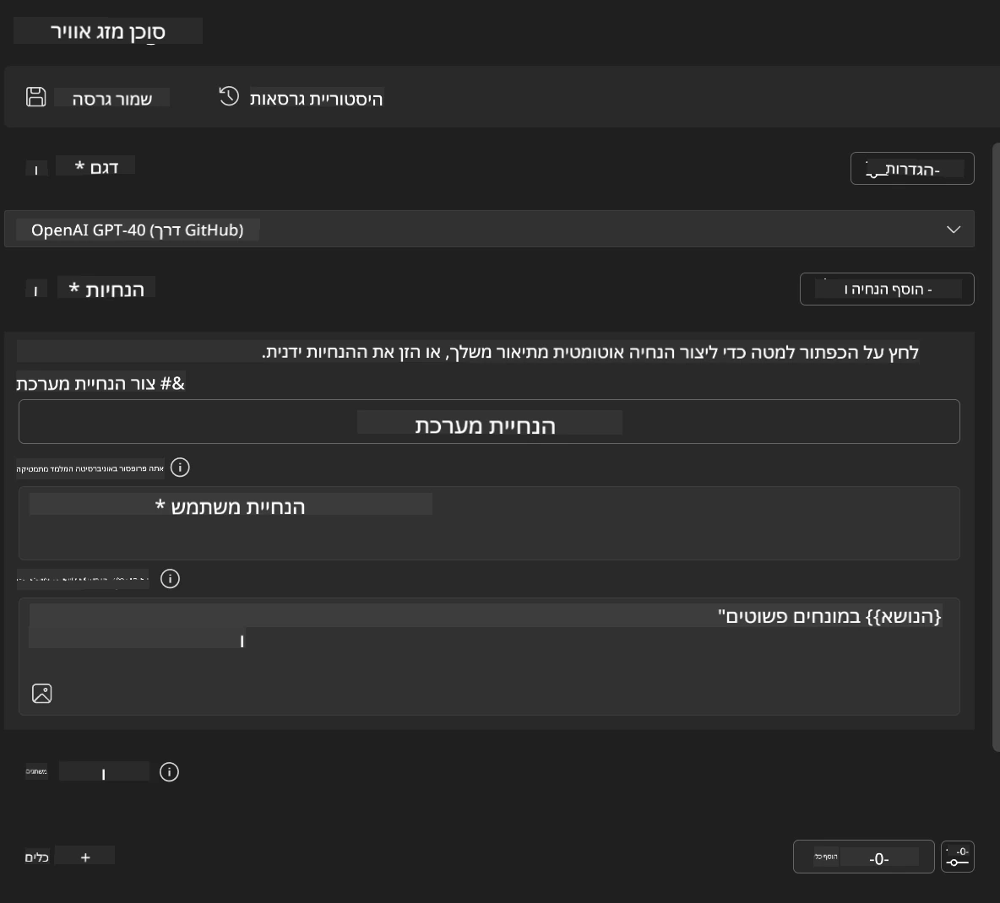
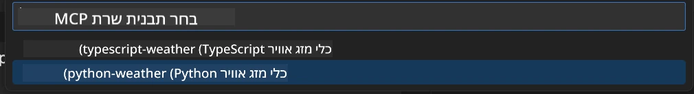
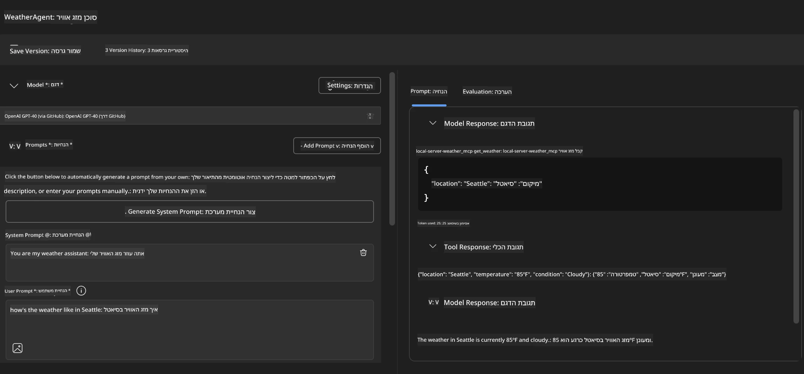
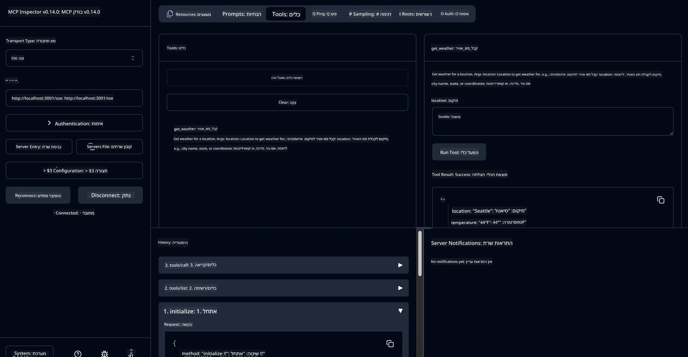

# 🔧 מודול 3: פיתוח מתקדם של MCP עם Microsoft Foundry Toolkit

> [!NOTE]
> כתובות URL של Inspector במעבדה זו משתמשות בקצה הישן `/sse` ומכוונות לגרסאות ה- pinned של MCP SDK `1.9.3` ו- Inspector `0.14.0`. הן אינן דוגמאות HTTP Streamable עדכניות מ- `2026-07-28`.
> 
> 


## 🎯 מטרות הלמידה

בסיום מעבדה זו, תוכל:

- ✅ ליצור שרתי MCP מותאמים אישית באמצעות Microsoft Foundry Toolkit
- ✅ לקנפג ולהשתמש ב- MCP Python SDK העדכני ביותר (v1.9.3)
- ✅ להגדיר ולהשתמש ב- MCP Inspector לצורך איתור באגים
- ✅ לנפות באגים בשרתי MCP בסביבות Agent Builder ו- Inspector
- ✅ להבין תזרימי עבודה מתקדמים לפיתוח שרתי MCP

## 📋 דרישות מוקדמות

- השלמת מעבדה 2 (יסודות MCP)
- VS Code עם התוסף Microsoft Foundry Toolkit מותקן
- סביבה של Python 3.10+
- Node.js ו- npm להגדרת Inspector

## 🏗️ מה תבנה

במעבדה זו תיצור **שרת MCP למזג אוויר** אשר מציג:
- יישום שרת MCP מותאם אישית
- אינטגרציה עם Microsoft Foundry Toolkit Agent Builder
- תזרימי עבודה מקצועיים לאיתור באגים
- דפוסי שימוש מודרניים של MCP SDK

---

## 🔧 סקירת רכיבים עיקריים

### 🐍 MCP Python SDK
MCP Python SDK (פרוטוקול הקשר המודל) מספק את הבסיס לבניית שרתי MCP מותאמים אישית. תשתמש בגרסה 1.9.3 עם יכולות איתור באגים משופרות.

### 🔍 MCP Inspector
כלי איתור באגים חזק המספק:
- ניטור שרת בזמן אמת
- ויזואליזציה של ביצוע כלים
- בדיקה של בקשות/תגובות רשת
- סביבה אינטראקטיבית לבדיקות

---

## 📖 יישום שלב אחרי שלב

### שלב 1: צור WeatherAgent ב-Agent Builder

1. **הפעל את Agent Builder** ב- VS Code דרך התוסף Microsoft Foundry Toolkit
2. **צור סוכן חדש** עם התצורה הבאה:
   - שם סוכן: `WeatherAgent`



### שלב 2: אתחל פרויקט שרת MCP

1. **נווט ל- Tools** → **Add Tool** ב-Agent Builder
2. **בחר "MCP Server"** מתוך האפשרויות הזמינות
3. **בחר "Create A new MCP Server"**
4. **בחר את התבנית `python-weather`**
5. **תן שם לשרת שלך:** `weather_mcp`



### שלב 3: פתח ובחן את הפרויקט

1. **פתח את הפרויקט שנוצר** ב- VS Code
2. **סקור את מבנה הפרויקט:**
   ```
   weather_mcp/
   ├── src/
   │   ├── __init__.py
   │   └── server.py
   ├── inspector/
   │   ├── package.json
   │   └── package-lock.json
   ├── .vscode/
   │   ├── launch.json
   │   └── tasks.json
   ├── pyproject.toml
   └── README.md
   ```

### שלב 4: שדרג לגרסת MCP SDK העדכנית ביותר

> **🔍 למה לשדרג?** אנו רוצים להשתמש בגרסת MCP SDK העדכנית ביותר (v1.9.3) ובשירות Inspector (0.14.0) לצורך תכונות משופרות ויכולות איתור באגים טובות יותר.

#### 4א. עדכן תלות בפייתון

**ערוך `pyproject.toml`:** עדכן את הקובץ [./code/weather_mcp/pyproject.toml](../../../../10-StreamliningAIWorkflowsBuildingAnMCPServerWithAIToolkit/lab3/code/weather_mcp/pyproject.toml)


#### 4ב. עדכן תצורת Inspector

**ערוך `inspector/package.json`:** עדכן את הקובץ [./code/weather_mcp/inspector/package.json](../../../../10-StreamliningAIWorkflowsBuildingAnMCPServerWithAIToolkit/lab3/code/weather_mcp/inspector/package.json)

#### 4ג. עדכן תלויות Inspector

**ערוך `inspector/package-lock.json`:** עדכן את הקובץ [./code/weather_mcp/inspector/package-lock.json](../../../../10-StreamliningAIWorkflowsBuildingAnMCPServerWithAIToolkit/lab3/code/weather_mcp/inspector/package-lock.json)

> **📝 הערה:** קובץ זה מכיל הגדרות תלות מורחבות. למטה מוצג המבנה העיקרי - התוכן המלא מבטיח פתרון תלות תקין.


> **⚡ חבילת נעילה מלאה:** קובץ package-lock.json המלא כולל כ-3000 שורות הגדרת תלות. לעיל מוצג המבנה המרכזי - השתמש בקובץ שסופק לפתרון תלות מלא.

### שלב 5: קנפג איתור באגים ב-VS Code

*הערה: נא להעתיק את הקובץ הנתון במקום שבחרת כדי להחליף את הקובץ המקומי המקביל*

#### 5א. עדכן הגדרת הפעלה

**ערוך `.vscode/launch.json`:**

```json
{
  "version": "0.2.0",
  "configurations": [
    {
      "name": "Attach to Local MCP",
      "type": "debugpy",
      "request": "attach",
      "connect": {
        "host": "localhost",
        "port": 5678
      },
      "presentation": {
        "hidden": true
      },
      "internalConsoleOptions": "neverOpen",
      "postDebugTask": "Terminate All Tasks"
    },
    {
      "name": "Launch Inspector (Edge)",
      "type": "msedge",
      "request": "launch",
      "url": "http://localhost:6274?timeout=60000&serverUrl=http://localhost:3001/sse#tools",
      "cascadeTerminateToConfigurations": [
        "Attach to Local MCP"
      ],
      "presentation": {
        "hidden": true
      },
      "internalConsoleOptions": "neverOpen"
    },
    {
      "name": "Launch Inspector (Chrome)",
      "type": "chrome",
      "request": "launch",
      "url": "http://localhost:6274?timeout=60000&serverUrl=http://localhost:3001/sse#tools",
      "cascadeTerminateToConfigurations": [
        "Attach to Local MCP"
      ],
      "presentation": {
        "hidden": true
      },
      "internalConsoleOptions": "neverOpen"
    }
  ],
  "compounds": [
    {
      "name": "Debug in Agent Builder",
      "configurations": [
        "Attach to Local MCP"
      ],
      "preLaunchTask": "Open Agent Builder",
    },
    {
      "name": "Debug in Inspector (Edge)",
      "configurations": [
        "Launch Inspector (Edge)",
        "Attach to Local MCP"
      ],
      "preLaunchTask": "Start MCP Inspector",
      "stopAll": true
    },
    {
      "name": "Debug in Inspector (Chrome)",
      "configurations": [
        "Launch Inspector (Chrome)",
        "Attach to Local MCP"
      ],
      "preLaunchTask": "Start MCP Inspector",
      "stopAll": true
    }
  ]
}
```

**ערוך `.vscode/tasks.json`:**

```
{
  "version": "2.0.0",
  "tasks": [
    {
      "label": "Start MCP Server",
      "type": "shell",
      "command": "python -m debugpy --listen 127.0.0.1:5678 src/__init__.py sse",
      "isBackground": true,
      "options": {
        "cwd": "${workspaceFolder}",
        "env": {
          "PORT": "3001"
        }
      },
      "problemMatcher": {
        "pattern": [
          {
            "regexp": "^.*$",
            "file": 0,
            "location": 1,
            "message": 2
          }
        ],
        "background": {
          "activeOnStart": true,
          "beginsPattern": ".*",
          "endsPattern": "Application startup complete|running"
        }
      }
    },
    {
      "label": "Start MCP Inspector",
      "type": "shell",
      "command": "npm run dev:inspector",
      "isBackground": true,
      "options": {
        "cwd": "${workspaceFolder}/inspector",
        "env": {
          "CLIENT_PORT": "6274",
          "SERVER_PORT": "6277",
        }
      },
      "problemMatcher": {
        "pattern": [
          {
            "regexp": "^.*$",
            "file": 0,
            "location": 1,
            "message": 2
          }
        ],
        "background": {
          "activeOnStart": true,
          "beginsPattern": "Starting MCP inspector",
          "endsPattern": "Proxy server listening on port"
        }
      },
      "dependsOn": [
        "Start MCP Server"
      ]
    },
    {
      "label": "Open Agent Builder",
      "type": "shell",
      "command": "echo ${input:openAgentBuilder}",
      "presentation": {
        "reveal": "never"
      },
      "dependsOn": [
        "Start MCP Server"
      ],
    },
    {
      "label": "Terminate All Tasks",
      "command": "echo ${input:terminate}",
      "type": "shell",
      "problemMatcher": []
    }
  ],
  "inputs": [
    {
      "id": "openAgentBuilder",
      "type": "command",
      "command": "ai-mlstudio.agentBuilder",
      "args": {
        "initialMCPs": [ "local-server-weather_mcp" ],
        "triggeredFrom": "vsc-tasks"
      }
    },
    {
      "id": "terminate",
      "type": "command",
      "command": "workbench.action.tasks.terminate",
      "args": "terminateAll"
    }
  ]
}
```


---

## 🚀 הרצת ובדיקת שרת MCP שלך

### שלב 6: התקן תלות

לאחר ביצוע שינויים בקונפיגורציה, הרץ את הפקודות הבאות:

**התקן את התלויות של פייתון:**
```bash
uv sync
```

**התקן את התלויות של Inspector:**
```bash
cd inspector
npm install
```

### שלב 7: איתור באגים עם Agent Builder

1. **הקש F5** או השתמש בקונפיגורציית **"Debug in Agent Builder"**
2. **בחר את הקונפיגורציה המרוכבת** מפאנל האיתור באגים
3. **המתן להפעלת השרת** ולפתיחת Agent Builder
4. **בדוק את שרת מזג האוויר שלך באמצעות שאילתות בשפה טבעית**

הזן פקד כמו זה

SYSTEM_PROMPT

```
You are my weather assistant
```

USER_PROMPT

```
How's the weather like in Seattle
```



### שלב 8: איתור באגים עם MCP Inspector

1. **השתמש בקונפיגורציה "Debug in Inspector"** (Edge או Chrome)
2. **פתח את ממשק ה-Inspector** בכתובת `http://localhost:6274`
3. **חקור את סביבה האינטראקטיבית של הבדיקות:**
   - צפייה בכלים הזמינים
   - בדיקת ביצוע כלי
   - ניטור בקשות רשת
   - איתור באגים של תגובות השרת



---

## 🎯 תוצאות למידה מפתח

עם סיום מעבדה זו, ביצעת:

- [x] **יצרת שרת MCP מותאם אישית** באמצעות תבניות Microsoft Foundry Toolkit
- [x] **שדרגת לגרסת MCP SDK האחרונה** (v1.9.3) לתפקוד משופר
- [x] **קנפגת תזרימי עבודה מקצועיים לאיתור באגים** הן עבור Agent Builder והן עבור Inspector
- [x] **הגדרת MCP Inspector** לבדיקות אינטראקטיביות של השרת
- [x] **שליטת בקונפיגורציות איתור באגים ב-VS Code** לפיתוח MCP

## 🔧 תכונות מתקדמות שנחקרו

| תכונה | תיאור | מקרה שימוש |
|---------|-------------|----------|
| **MCP Python SDK v1.9.3** | מימוש פרוטוקול עדכני | פיתוח שרת מודרני |
| **MCP Inspector 0.14.0** | כלי איתור באגים אינטראקטיבי | בדיקות שרת בזמן אמת |
| **איתור באגים ב-VS Code** | סביבת פיתוח משולבת | תזרימי עבודה מקצועיים לאיתור באגים |
| **אינטגרציה עם Agent Builder** | חיבור ישיר ל- Microsoft Foundry Toolkit | בדיקות סוכנים מקצה לקצה |

## 📚 משאבים נוספים

- [תיעוד MCP Python SDK](https://modelcontextprotocol.io/docs/sdk/python)
- [מדריך תוסף Microsoft Foundry Toolkit](https://code.visualstudio.com/docs/ai/ai-toolkit)
- [תיעוד איתור באגים ב-VS Code](https://code.visualstudio.com/docs/editor/debugging)
- [מפרט Model Context Protocol](https://modelcontextprotocol.io/docs/concepts/architecture)

---

**🎉 כל הכבוד!** השלמת בהצלחה את מעבדה 3 וכעת תוכל ליצור, לנפות באגים ולפרוס שרתי MCP מותאמים אישית באמצעות תזרימי עבודה מקצועיים לפיתוח.

### 🔜 המשך למודול הבא

מוכן ליישם את כישורי MCP שלך בתזרימי עבודה של פיתוח במציאות? המשך ל- **[מודול 4: פיתוח מעשי של MCP - שרת שיבוט GitHub מותאם אישית](../lab4/README.md)** בו ת:
- תבנה שרת MCP מוכן לייצור להפעלת פעולות מאגרי GitHub אוטומטית
- תיישם פונקציונליות שיבוט מאגר GitHub באמצעות MCP
- תשלב שרתי MCP מותאמים אישית עם VS Code ו-GitHub Copilot Agent Mode
- תבדוק ותפרוס שרתי MCP מותאמים בסביבות ייצור
- תלמד אוטומציה מעשית של תזרימי עבודה למפתחים

---

<!-- CO-OP TRANSLATOR DISCLAIMER START -->
**כתב ויתור**:
מסמך זה תורגם באמצעות שירות תרגום אוטומטי [Co-op Translator](https://github.com/Azure/co-op-translator). למרות שאנו שואפים לדיוק, יש לקחת בחשבון שתרגומים אוטומטיים עלולים להכיל שגיאות או אי-דיוקים. יש להחשיב את המסמך המקורי בשפתו הטבעית כמקור הסמכות. למידע קריטי מומלץ להשתמש בתרגום מקצועי על ידי מתרגם אדם. אנו לא אחראים לכל אי-הבנה או פירוש שגוי הנובע מהשימוש בתרגום זה.
<!-- CO-OP TRANSLATOR DISCLAIMER END -->