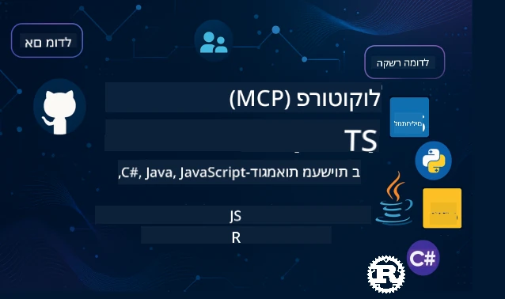

 

[](https://GitHub.com/microsoft/mcp-for-beginners/graphs/contributors)
[](https://GitHub.com/microsoft/mcp-for-beginners/issues)
[](https://GitHub.com/microsoft/mcp-for-beginners/pulls)
[](http://makeapullrequest.com)

[](https://GitHub.com/microsoft/mcp-for-beginners/watchers)
[](https://GitHub.com/microsoft/mcp-for-beginners/fork)
[](https://GitHub.com/microsoft/mcp-for-beginners/stargazers)


[](https://discord.gg/nTYy5BXMWG)

עקבו אחרי הצעדים האלו כדי להתחיל להשתמש במשאבים אלה:
1. **צרו Fork למאגר**: לחצו על [](https://GitHub.com/microsoft/mcp-for-beginners/fork)
2. **שכפל את המאגר**:   `git clone https://github.com/microsoft/mcp-for-beginners.git`
3. **הצטרפו ל** [](https://discord.gg/nTYy5BXMWG)


### 🌐 תמיכה בריבוי שפות

#### נתמך באמצעות GitHub Action (מועתק ומעודכן תמיד)

<!-- CO-OP TRANSLATOR LANGUAGES TABLE START -->
[Arabic](../ar/README.md) | [Bengali](../bn/README.md) | [Bulgarian](../bg/README.md) | [Burmese (Myanmar)](../my/README.md) | [Chinese (Simplified)](../zh-CN/README.md) | [Chinese (Traditional, Hong Kong)](../zh-HK/README.md) | [Chinese (Traditional, Macau)](../zh-MO/README.md) | [Chinese (Traditional, Taiwan)](../zh-TW/README.md) | [Croatian](../hr/README.md) | [Czech](../cs/README.md) | [Danish](../da/README.md) | [Dutch](../nl/README.md) | [Estonian](../et/README.md) | [Finnish](../fi/README.md) | [French](../fr/README.md) | [German](../de/README.md) | [Greek](../el/README.md) | [Hebrew](./README.md) | [Hindi](../hi/README.md) | [Hungarian](../hu/README.md) | [Indonesian](../id/README.md) | [Italian](../it/README.md) | [Japanese](../ja/README.md) | [Kannada](../kn/README.md) | [Korean](../ko/README.md) | [Lithuanian](../lt/README.md) | [Malay](../ms/README.md) | [Malayalam](../ml/README.md) | [Marathi](../mr/README.md) | [Nepali](../ne/README.md) | [Nigerian Pidgin](../pcm/README.md) | [Norwegian](../no/README.md) | [Persian (Farsi)](../fa/README.md) | [Polish](../pl/README.md) | [Portuguese (Brazil)](../pt-BR/README.md) | [Portuguese (Portugal)](../pt-PT/README.md) | [Punjabi (Gurmukhi)](../pa/README.md) | [Romanian](../ro/README.md) | [Russian](../ru/README.md) | [Serbian (Cyrillic)](../sr/README.md) | [Slovak](../sk/README.md) | [Slovenian](../sl/README.md) | [Spanish](../es/README.md) | [Swahili](../sw/README.md) | [Swedish](../sv/README.md) | [Tagalog (Filipino)](../tl/README.md) | [Tamil](../ta/README.md) | [Telugu](../te/README.md) | [Thai](../th/README.md) | [Turkish](../tr/README.md) | [Ukrainian](../uk/README.md) | [Urdu](../ur/README.md) | [Vietnamese](../vi/README.md)

> **מעדיפים לשכפל באופן מקומי?**

> מאגר זה כולל למעלה מ-50 תרגומים לשפות שונות, מה שמגדיל משמעותית את גודל ההורדה. כדי לשכפל ללא תרגומים, השתמשו ב-sparse checkout:
> ```bash
> git clone --filter=blob:none --sparse https://github.com/microsoft/mcp-for-beginners.git
> cd mcp-for-beginners
> git sparse-checkout set --no-cone '/*' '!translations' '!translated_images'
> ```
> זה נותן לכם את כל מה שאתם צריכים כדי להשלים את הקורס עם הורדה הרבה יותר מהירה.
<!-- CO-OP TRANSLATOR LANGUAGES TABLE END -->

# 🚀 תכנית לימודים של פרוטוקול הקשר לדגם (MCP) למתחילים

## **למדו MCP עם דוגמאות קוד מעשיות ב-C#, Java, JavaScript, Rust, Python ו-TypeScript**

## 🧠 סקירה כללית של תכנית הלימודים לפרוטוקול הקשר לדגם
ברוכים הבאים למסע שלכם אל פרוטוקול הקשר לדגם! אם תהיתם אי פעם כיצד אפליקציות AI מתקשרות עם כלים ושירותים שונים, אתם עומדים לגלות את הפתרון האלגנטי שמשנה את הדרך שבה מפתחים בונים מערכות אינטליגנטיות.

תחשבו על MCP כמתרגם אוניברסלי לאפליקציות AI - בדיוק כמו שנקודות USB מאפשרות לכם לחבר כל מכשיר למחשב שלכם, MCP מאפשר לדגמי AI להתחבר לכל כלי או שירות בצורה סטנדרטית. בין אם אתם בונים את הצ'אטבוט הראשון שלכם או עובדים על זרמי עבודה מורכבים של AI, הבנת MCP תעניק לכם את הכוח ליצור אפליקציות גמישות ויעילות יותר.

תכנית הלימודים הזו עוצבה בסבלנות ובזהירות לזמן הלמידה שלכם. נתחיל עם מושגים פשוטים שאתם כבר מבינים ונבנה בהדרגה את המומחיות שלכם באמצעות תרגול מעשי בשפת התכנות האהובה עליכם. כל שלב כולל הסברים ברורים, דוגמאות מעשיות והרבה עידוד לאורך הדרך.

בסיום המסלול הזה, תהיה לכם הביטחון לבנות את שרתי MCP שלכם, לשלב אותם עם פלטפורמות AI פופולריות ולהבין כיצד הטכנולוגיה הזו משנה את עתיד פיתוח ה-AI. בואו נתחיל את ההרפתקה המלהיבה הזו יחד!

### תיעוד רשמי ומפרטים

משאבים אלה הופכים יקרים עוד יותר עם צמיחת ההבנה שלכם, אבל אל תרגישו בלחץ לקרוא הכל מיד. התחילו בתחומים שמעניינים אתכם ביותר!
- 📘 [תיעוד MCP](https://modelcontextprotocol.io/) – זהו משאב ההדרכה שלכם עם מדריכים שלב אחר שלב ומדריכי משתמש. התיעוד נכתב במיוחד למתחילים, ומספק דוגמאות ברורות שתוכלו לעקוב אחריהן לפי הקצב שלכם.
- 📜 [מפרט MCP](https://modelcontextprotocol.io/docs/) – חשבו על זה כמדריך מקיף שלכם. ככל שתתקדמו בתכנית הלימודים, תמצאו את עצמכם חוזרים לכאן לחפש פרטים ספציפיים ולחקור תכונות מתקדמות.
- 📜 [מפרט MCP המקורי](https://modelcontextprotocol.io/specification/versioning) – מכיל פרטים טכניים נוספים שיכולים לעזור למימושים מתקדמים. זמין כשזקוקים לו, אך לא צריך לדאוג לו בהתחלה.
- 🧑‍💻 [מאגר GitHub של MCP](https://github.com/modelcontextprotocol) – כאן תמצאו SDK, כלים ודוגמאות קוד בשפות תכנות שונות. זה אוצר של דוגמאות מעשיות ורכיבים מוכנים לשימוש.
- 🌐 [קהילת MCP](https://github.com/orgs/modelcontextprotocol/discussions) – הצטרפו ללומדים ומפתחים מנוסים בדיונים על MCP. זוהי קהילה תומכת שבה שאלות מוזמנות וידע משתף בחופשיות.
  
## מטרות הלמידה

עד סיום תכנית הלימודים הזו, תרגישו בטוחים ונרגשים מהיכולות החדשות שלכם. להלן מה תשיגו:

• **הבנת יסודות MCP**: תבינו מהו פרוטוקול הקשר לדגם ולמה הוא משנה את הדרך שבה אפליקציות AI משתפות פעולה, באמצעות אנלוגיות ודוגמאות מובנות.

• **בניית שרת MCP ראשון שלכם**: תיצרו שרת MCP עובד בשפת התכנות המועדפת עליכם, תתחילו מדוגמאות פשוטות ותפתחו את הכישורים שלכם שלב אחרי שלב.

• **חיבור דגמי AI לכלים אמיתיים**: תלמדו כיצד לגשר על הפער בין דגמי AI לשירותים ממשיים, ותעניקו לאפליקציות שלכם יכולות חדשות ועוצמתיות.

• **יישום פרקטיקות אבטחה מיטביות**: תבינו כיצד לשמור על יישומי MCP בטוחים ומוגנים, ולהגן על האפליקציות והמשתמשים שלכם.

• **פריסה עם ביטחון**: תדעו כיצד להעביר את פרויקטי MCP מפיתוח לייצור, עם אסטרטגיות פריסה מעשיות שעובדות בעולם האמיתי.

• **הצטרפו לקהילת MCP**: תהפכו לחלק מקהילת מפתחים גדלה שמעצבת את עתיד פיתוח אפליקציות AI. 

## רקע חיוני

לפני שנכנסים לפרטים של MCP, בואו נוודא שאתם מרגישים בנוח עם כמה מושגי יסוד. אל תדאגו אם אינכם מומחים בתחומים אלו - נסביר את כל מה שצריך לפי הצורך!

### הבנת פרוטוקולים (הבסיס)

תחשבו על פרוטוקול כעל חוקי שיחה. כשאתם מתקשרים עם חבר, שניכם יודעים להגיד "שלום" כשהעונים, מדברים בתורות ואומרים "להתראות" בסיום. תוכניות מחשב צריכות חוקים דומים כדי לתקשר ביעילות.

MCP הוא פרוטוקול - סט של כללים מוסכמים שעוזרים לדגמי AI ואפליקציות לנהל "שיחות" פרודוקטיביות עם כלים ושירותים. בדיוק כמו שחוקי שיחה הופכים את התקשורת האנושית לחלקה, MCP הופך את התקשורת בין אפליקציות AI לאמינה ועוצמתית יותר.

### יחסי לקוח-שרת (כיצד תוכניות עובדות יחד)

אתם כבר משתמשים ביחסי לקוח-שרת כל יום! כשאתם גולשים בדפדפן (הלקוח) לאתר אינטרנט, אתם מתחברים לשרת אינטרנט ששולח לכם את תוכן הדף. הדפדפן יודע איך לבקש מידע, והשרת יודע איך להשיב.

ב-MCP ישנו קשר דומה: דגמי AI הם לקוחות שמבקשים מידע או פעולות, בעוד ששרתי MCP מספקים את היכולות. זה כמו עוזר נאמן (השרת) שה-AI יכול לבקש ממנו לבצע משימות ספציפיות.

### למה הסטנדרטיזציה חשובה (להפוך דברים לעובדים יחד)

תדמיינו שכל יצרן רכב היה משתמש במשאבות דלק בצורות שונות - הייתם צריכים מתאם שונה לכל רכב! סטנדרטיזציה פירושה הסכמה על דרכים משותפות כדי שהדברים יעבדו יחד בצורה חלקה.

MCP מספק את הסטנדרטיזציה הזו לאפליקציות AI. במקום שכל דגם AI יצטרך קוד מותאם אישית לכל כלי, MCP יוצר שיטה אוניברסלית לתקשורת. משמעות הדבר היא שמפתחים יכולים לבנות כלים פעם ולהשתמש בהם עם מערכות AI שונות.

## 🧭 סקירת מסלול הלמידה שלך

מסע ה-MCP שלך מאורגן בקפידה כדי לבנות את הביטחון והכישורים שלך בהדרגה. כל שלב מציג מושגים חדשים ומחזק את מה שכבר למדת.

### 🌱 שלב היסודות: הבנת הבסיס (מודולים 0-2)

פה מתחילה ההרפתקה! נציג בפניכם את מושגי MCP באמצעות אנלוגיות מוכרות ודוגמאות פשוטות. תבינו מהו MCP, למה הוא קיים ואיך הוא מתאים לעולם הגדול של פיתוח ה-AI.

• **מודול 0 - היכרות עם MCP**: נתחיל בחקירת מהו MCP ולמה הוא חשוב כל כך לאפליקציות AI מודרניות. תראו דוגמאות אמיתיות של MCP בפעולה ותבינו כיצד הוא פותר בעיות נפוצות שמפתחים מתמודדים איתן.

• **מודול 1 - הסבר מושגי הליבה**: כאן תלמדו את אבני היסוד של MCP. נשתמש בהרבה אנלוגיות ודוגמאות ויזואליות כדי לוודא שהמושגים האלה יהיו ברורים וטבעיים.

• **מודול 2 - אבטחה ב-MCP**: אבטחה אולי נשמעת מפחידה, אבל נראה לכם כיצד MCP כולל תכונות בטיחות מובנות ונסביר את הפרקטיקות הטובות ביותר שמגנות על האפליקציות שלכם מההתחלה.

### 🔨 שלב הבנייה: יצירת היישומים הראשונים שלכם (מודול 3)

עכשיו מגיע הכיף האמיתי! תקבלו ניסיון מעשי בבניית שרתי MCP ולקוחות אמיתיים. אל תדאגו - נתחיל בפשטות ונלווה אתכם בכל שלב.

מודול זה כולל מדריכים מעשיים מרובים שמאפשרים לכם לתרגל בשפת התכנות המועדפת עליכם. תיצרו את השרת הראשון שלכם, תבנו לקוח שיתחבר אליו, ואפילו תשלבו כלים פופולריים לפיתוח כמו VS Code.
כל מדריך כולל דוגמאות קוד מלאות, טיפים לפתרון בעיות, והסברים מדוע בוחרים בעיצוב מסוים. בסיום שלב זה, יהיו לך יישומים עובדי MCP שתוכל להתגאות בהם!

### 🚀 שלב הגידול: מושגים מתקדמים ויישום בעולם האמיתי (מודולים 4-5)

עם שליטה ביסודות, אתה מוכן לחקור תכונות מורכבות יותר של MCP. נכסה אסטרטגיות יישום מעשיות, טכניקות איתור באגים, ונושאים מתקדמים כמו אינטגרציה של AI רב-מודאלי.

גם תלמד כיצד להרחיב את יישומי MCP לשימוש יצרני ולהשתלב עם פלטפורמות ענן כמו Azure. מודולים אלו מכינים אותך לבניית פתרונות MCP שיכולים להתמודד עם דרישות בעולם האמיתי.

### 🌟 שלב המאסטריות: קהילה והתמחות (מודולים 6-11)

השלב הסופי מתמקד בהצטרפות לקהילת MCP ובהתמחות בתחומים שמעניינים אותך ביותר. תלמד כיצד לתרום לפרויקטים בקוד פתוח של MCP, ליישם דפוסי אימות מתקדמים, ולבנות פתרונות מקיפים המשולבים עם מסדי נתונים.

מודול 11 זוכה לציון מיוחד - זהו מסלול למידה מעשי המכיל 13 מעבדות שמלמד אותך לבנות שרתי MCP מוכנים לייצור עם אינטגרציה של PostgreSQL. זה כמו פרויקט סיום שמאגד את כל מה שלמדת!

### 📚 מבנה תוכנית הלימודים המלאה

| מודול | נושא | תיאור | קישור |
|--------|-------|-------------|------|
| **מודולים 1-3: יסודות** | | | |
| 00 | מבוא ל-MCP | סקירה של Model Context Protocol וחשיבותו בצינורות AI | [קרא עוד](./00-Introduction/README.md) |
| 01 | הסברים על מושגי יסוד | חקירה מעמיקה של מושגי יסוד ב-MCP | [קרא עוד](./01-CoreConcepts/README.md) |
| 02 | אבטחה ב-MCP | איומי אבטחה ושיטות עבודה מומלצות | [קרא עוד](./02-Security/README.md) |
| 03 | התחלה עם MCP | הקמת סביבה, שרתים/לקוחות בסיסיים, אינטגרציה | [קרא עוד](./03-GettingStarted/README.md) |
| **מודול 3: בניית השרת והלקוח הראשון שלך** | | | |
| 3.1 | השרת הראשון | צור את שרת ה-MCP הראשון שלך | [מדריך](./03-GettingStarted/01-first-server/README.md) |
| 3.2 | הלקוח הראשון | פתח לקוח MCP בסיסי | [מדריך](./03-GettingStarted/02-client/README.md) |
| 3.3 | לקוח עם LLM | אינטגרציה של מודלים שפתיים גדולים | [מדריך](./03-GettingStarted/03-llm-client/README.md) |
| 3.4 | אינטגרציה עם VS Code | צריכת שרתי MCP ב-VS Code | [מדריך](./03-GettingStarted/04-vscode/README.md) |
| 3.5 | שרת stdio | יצירת שרתים באמצעות תחבורה stdio | [מדריך](./03-GettingStarted/05-stdio-server/README.md) |
| 3.6 | סטרימינג HTTP | יישום סטרימינג HTTP ב-MCP | [מדריך](./03-GettingStarted/06-http-streaming/README.md) |
| 3.7 | כלי AI | שימוש בכלי AI עם MCP | [מדריך](./03-GettingStarted/07-aitk/README.md) |
| 3.8 | בדיקות | בדוק את יישום שרת ה-MCP שלך | [מדריך](./03-GettingStarted/08-testing/README.md) |
| 3.9 | פריסה | פרוס שרתי MCP לייצור | [מדריך](./03-GettingStarted/09-deployment/README.md) |
| 3.10 | שימוש מתקדם בשרת | השתמש בשרתי MCP מתקדמים עבור תכונות מורכבות ושיפור ארכיטקטורה | [מדריך](./03-GettingStarted/10-advanced/README.md) |
| 3.11 | אימות פשוט | פרק המציג אימות מהרגע הראשון ו-RBAC | [מדריך](./03-GettingStarted/11-simple-auth/README.md) |
| **מודולים 4-5: מעשי ומתקדם** | | | |
| 04 | יישום מעשי | SDK, איתור באגים, בדיקות, תבניות פרומפט לשימוש חוזר | [קרא עוד](./04-PracticalImplementation/README.md) |
| 05 | נושאים מתקדמים ב-MCP | AI רב-מודאלי, הרחבה, שימוש ארגוני | [קרא עוד](./05-AdvancedTopics/README.md) |
| 5.1 | אינטגרציה עם Azure | אינטגרציה של MCP עם Azure | [מדריך](./05-AdvancedTopics/mcp-integration/README.md) |
| 5.2 | רב-מודאליות | עבודה עם מצבים מרובים | [מדריך](./05-AdvancedTopics/mcp-multi-modality/README.md) |
| 5.3 | הדגמת OAuth2 | יישום אימות OAuth2 | [מדריך](./05-AdvancedTopics/mcp-oauth2-demo/README.md) |
| 5.4 | הקשר שורש | הבנה ויישום הקשרים שורשיים | [מדריך](./05-AdvancedTopics/mcp-root-contexts/README.md) |
| 5.5 | ניתוב | אסטרטגיות ניתוב ב-MCP | [מדריך](./05-AdvancedTopics/mcp-routing/README.md) |
| 5.6 | דגימה | טכניקות דגימה ב-MCP | [מדריך](./05-AdvancedTopics/mcp-sampling/README.md) |
| 5.7 | הרחבה | הרחבת יישומי MCP | [מדריך](./05-AdvancedTopics/mcp-scaling/README.md) |
| 5.8 | אבטחה | שיקולי אבטחה מתקדמים | [מדריך](./05-AdvancedTopics/mcp-security/README.md) |
| 5.9 | חיפוש באינטרנט | יישום יכולות חיפוש באינטרנט | [מדריך](./05-AdvancedTopics/web-search-mcp/README.md) |
| 5.10 | סטרימינג בזמן אמת | בניית פונקציונליות סטרימינג בזמן אמת | [מדריך](./05-AdvancedTopics/mcp-realtimestreaming/README.md) |
| 5.11 | חיפוש בזמן אמת | יישום חיפוש בזמן אמת | [מדריך](./05-AdvancedTopics/mcp-realtimesearch/README.md) |
| 5.12 | אימות Entra ID | אימות עם Microsoft Entra ID | [מדריך](./05-AdvancedTopics/mcp-security-entra/README.md) |
| 5.13 | אינטגרציה עם Foundry | אינטגרציה עם Azure AI Foundry | [מדריך](./05-AdvancedTopics/mcp-foundry-agent-integration/README.md) |
| 5.14 | הנדסת הקשר | טכניקות להנדסת הקשר יעילה | [מדריך](./05-AdvancedTopics/mcp-contextengineering/README.md) |
| 5.15 | תחבורה מותאמת אישית ל-MCP | יישומי תחבורה מותאמים אישית | [מדריך](./05-AdvancedTopics/mcp-transport/README.md) |
| **מודולים 6-10: קהילה ושיטות עבודה מומלצות** | | | |
| 06 | תרומות לקהילה | כיצד לתרום לאקו-סיסטם של MCP | [מדריך](./06-CommunityContributions/README.md) |
| 07 | תובנות מאימוץ מוקדם | סיפורי יישום מהעולם האמיתי | [מדריך](./07-LessonsFromEarlyAdoption/README.md) |
| 08 | שיטות עבודה מומלצות ב-MCP | ביצועים, עמידות, שחזור כשל | [מדריך](./08-BestPractices/README.md) |
| 09 | מחקרי מקרה של MCP | דוגמאות ליישום מעשי | [מדריך](./09-CaseStudy/README.md) |
| 10 | סדנה מעשית | בניית שרת MCP עם כלי AI | [מעבדה](./10-StreamliningAIWorkflowsBuildingAnMCPServerWithAIToolkit/README.md) |
| **מודול 11: מעבדות מעשיות לשרת MCP** | | | |
| 11 | אינטגרציה של שרת MCP עם מסד נתונים | מסלול למידה מעשי בן 13 מעבדות לאינטגרציה עם PostgreSQL | [מעבדות](./11-MCPServerHandsOnLabs/README.md) |
| 11.1 | מבוא | סקירה של MCP עם אינטגרציה למסד נתונים ומקרי שימוש לניתוח קמעונאי | [מעבדה 00](./11-MCPServerHandsOnLabs/00-Introduction/README.md) |
| 11.2 | ארכיטקטורה בסיסית | הבנת ארכיטקטורת שרת MCP, שכבות מסד נתונים ודפוסי אבטחה | [מעבדה 01](./11-MCPServerHandsOnLabs/01-Architecture/README.md) |
| 11.3 | אבטחה וריבוי שכירות | אבטחת שורה ברמת שורה, אימות, וגישה מרובת שוכרים | [מעבדה 02](./11-MCPServerHandsOnLabs/02-Security/README.md) |
| 11.4 | הקמת סביבה | הקמת סביבת פיתוח, Docker, ומשאבי Azure | [מעבדה 03](./11-MCPServerHandsOnLabs/03-Setup/README.md) |
| 11.5 | עיצוב מסד נתונים | הקמת PostgreSQL, עיצוב סכמת קמעונאות, ודאטה לדוגמה | [מעבדה 04](./11-MCPServerHandsOnLabs/04-Database/README.md) |
| 11.6 | יישום שרת MCP | בניית שרת FastMCP עם אינטגרציה למסד נתונים | [מעבדה 05](./11-MCPServerHandsOnLabs/05-MCP-Server/README.md) |
| 11.7 | פיתוח כלים | יצירת כלי שאילתות למסד נתונים ובדיקת סכמות | [מעבדה 06](./11-MCPServerHandsOnLabs/06-Tools/README.md) |
| 11.8 | חיפוש סמנטי | יישום הטמעות וקטוריות עם Azure OpenAI ו-pgvector | [מעבדה 07](./11-MCPServerHandsOnLabs/07-Semantic-Search/README.md) |
| 11.9 | בדיקות ואיתור באגים | אסטרטגיות בדיקה, כלים לאיתור באגים, ושיטות אימות | [מעבדה 08](./11-MCPServerHandsOnLabs/08-Testing/README.md) |
| 11.10 | אינטגרציה עם VS Code | קונפיגורציית אינטגרציית MCP ב-VS Code ושימוש בצ'אט AI | [מעבדה 09](./11-MCPServerHandsOnLabs/09-VS-Code/README.md) |
| 11.11 | אסטרטגיות פריסה | פריסת Docker, Azure Container Apps, ושיקולי הרחבה | [מעבדה 10](./11-MCPServerHandsOnLabs/10-Deployment/README.md) |
| 11.12 | ניטור | Application Insights, רישום לוגים, ניטור ביצועים | [מעבדה 11](./11-MCPServerHandsOnLabs/11-Monitoring/README.md) |
| 11.13 | שיטות עבודה מומלצות | אופטימיזציית ביצועים, חיזוק אבטחה, וטיפים לייצור | [מעבדה 12](./11-MCPServerHandsOnLabs/12-Best-Practices/README.md) |

### 💻 פרויקטי קוד לדוגמה

אחד החלקים המרגשים בלמידת MCP הוא לראות את מיומנויות הקוד שלך מתפתחות בהדרגה. תכננו את הדוגמאות שלנו כך שיתחילו פשוטות ויתקדמו עם ההבנה שלך. כך אנו מציגים מושגים - עם קוד שקל להבין אך שמדגים עקרונות אמיתיים של MCP, לא רק תבין מה הקוד עושה, אלא גם מדוע הוא בנוי כך וכיצד הוא משתלב ביישומי MCP גדולים יותר.

#### דוגמאות בסיסיות למחשבון MCP

| שפה | תיאור | קישור |
|----------|-------------|------|
| C# | דוגמת שרת MCP | [צפה בקוד](./03-GettingStarted/samples/csharp/README.md) |
| Java | מחשבון MCP | [צפה בקוד](./03-GettingStarted/samples/java/calculator/README.md) |
| JavaScript | הדגמת MCP | [צפה בקוד](./03-GettingStarted/samples/javascript/README.md) |
| Python | שרת MCP | [צפה בקוד](../../03-GettingStarted/samples/python/mcp_calculator_server.py) |
| TypeScript | דוגמת MCP | [צפה בקוד](./03-GettingStarted/samples/typescript/README.md) |
| Rust | דוגמת MCP | [צפה בקוד](./03-GettingStarted/samples/rust/README.md) |

#### יישומים מתקדמים של MCP

| שפה | תיאור | קישור |
|----------|-------------|------|
| C# | דוגמה מתקדמת | [צפה בקוד](./04-PracticalImplementation/samples/csharp/README.md) |
| Java עם Spring | דוגמת Container App | [צפה בקוד](./04-PracticalImplementation/samples/java/containerapp/README.md) |
| JavaScript | דוגמה מתקדמת | [צפה בקוד](./04-PracticalImplementation/samples/javascript/README.md) |
| Python | יישום מורכב | [צפה בקוד](../../04-PracticalImplementation/samples/python/READMEmd) |
| TypeScript | דוגמת Container | [צפה בקוד](./04-PracticalImplementation/samples/typescript/README.md) |

## 🎯 תנאי מוקדם ללימוד MCP

כדי להפיק את המרב מהתוכנית, כדאי שיהיו לך:

- ידע בסיסי בתכנות לפחות באחת מהשפות הבאות: C#, Java, JavaScript, Python, או TypeScript  
- הבנה של מודל לקוח-שרת ו-APIs  
- היכרות עם מושגי REST ו-HTTP  
- (אופציונלי) רקע במושגי AI/ML  
- השתתפות בדיונים בקהילה שלנו לתמיכה

## 📚 מדריך לימוד ומשאבים

מאגר זה כולל מספר משאבים שיעזרו לך לנווט וללמוד בצורה יעילה:

### מדריך לימוד

קיים [מדריך לימוד](./study_guide.md) מקיף שיעזור לך לנווט במאגר זה ביעילות. מפת תוכן ויזואלית זו מראה כיצד כל הנושאים קשורים ומספקת הדרכה לשימוש בפרויקטים לדוגמה ביעילות. זה מועיל במיוחד ללומדים ויזואליים שאוהבים לראות את התמונה הכוללת.

המדריך כולל:  
- מפת תוכנית ויזואלית המציגה את כל הנושאים  
- פירוט מפורט של כל חלק במאגר  
- הדרכה על שימוש בפרויקטים לדוגמה  
- דרכי למידה מומלצות לרמות מיומנות שונות  
- משאבים נוספים להשלמת מסע הלימוד שלך

### יומן שינויים

אנו מנהלים [יומן שינויים](./changelog.md) מפורט שעוקב אחרי כל העדכונים המשמעותיים בחומרי התוכנית, כך שתוכל להישאר מעודכן בשיפורים והוספות אחרונים.  
- הוספת תוכן חדש  
- שינויים מבניים  
- שיפורי תכונות  
- עדכוני תיעוד

## 🛠️ כיצד להשתמש בתוכנית זו בצורה יעילה

כל שיעור במדריך זה כולל:
1. הסברים ברורים של מושגי MCP  
2. דוגמאות קוד חיות במגוון שפות  
3. תרגולים לבניית אפליקציות MCP אמיתיות  
4. משאבים נוספים ללומדים מתקדמים

## תוכן לפי דרישה

### [ימי פיתוח MCP יולי 2025](https://developer.microsoft.com/en-us/reactor/series/S-1563/)
#### [➡️צפו לפי דרישה - ימי פיתוח MCP](https://developer.microsoft.com/en-us/reactor/series/S-1563/)
התכוננו לשני ימים של תובנות טכניות מעמיקות, חיבור קהילתי ולמידה מעשית בימי פיתוח MCP, אירוע וירטואלי המוקדש לפרוטוקול הקשר לדגם (MCP) — התקן המתפתח שמגשר בין מודלים של בינה מלאכותית לכלים שבהם הם משתמשים.  
ניתן לצפות בימי פיתוח MCP על ידי הרשמה בדף האירוע שלנו: https://aka.ms/mcpdevdays.

#### [יום 1: פרודוקטיביות MCP, כלי פיתוח והקהילה:](https://developer.microsoft.com/en-us/reactor/series/S-1563/)

היום מוקדש להעצמת מפתחים להשתמש ב-MCP במסגרת זרימת העבודה שלהם ולחגוג את הקהילה המדהימה של MCP. יצטרפו אלינו חברי קהילה ושותפים כדוגמת Arcade, Block, Okta ו-Neon כדי להציג כיצד הם משתפים פעולה עם מיקרוסופט לעיצוב אקוסיסטם פתוח, נרחב של MCP. הדגמות מעשיות בעולם האמיתי ב-VS Code, Visual Studio, GitHub Copilot וכלים קהילתיים פופולריים  
זרימות פיתוח פרקטיות ומונחות הקשר  
מפגשים ותובנות בהובלת הקהילה  
בין אם אתם רק מתחילים עם MCP או כבר בונים איתו, יום 1 יקנה השראה ותובנות פרקטיות.

#### [יום 2: בניית שרתי MCP בביטחון](https://developer.microsoft.com/en-us/reactor/series/S-1563/)

היום מיועד לבוני MCP. נצלול לעומק באסטרטגיות יישום ופרקטיקות מיטביות ליצירת שרתי MCP ושילוב MCP במסגרת זרימות העבודה של הבינה המלאכותית שלכם.

#### נושאים כוללים:

- בניית שרתי MCP ושילובם בחוויות סוכנים  
- פיתוח מונחה פקודות  
- פרקטיקות בטיחות מיטביות  
- שימוש בבלוקים בוני מבנים כמו פונקציות, ACA וניהול API  
- יישור רישום וכלים (1P + 3P)

אם אתם מפתחים, בוני כלים או אסטרטגים למוצרי בינה מלאכותית, היום הזה מלא בתובנות שתצטרכו לבניית פתרונות MCP ברי התרחבות, מאובטחים ומוכנים לעתיד.

### מחנה אימונים MCP אוגוסט 2025  
למדו במפגשי וידאו אינטנסיביים כיצד ליצור שרתי MCP, לשלב עם VS Code ולפרוס באופן מקצועי ב-Azure בהתבסס על תוכן מתכנית הלימודים MCP למתחילים. צאו עם מיומנויות מעשיות בטכנולוגיה שחברות גדולות כבר משתמשות בה.

#### [➡️צפו לפי דרישה מחנה אימונים MCP | אנגלית](https://developer.microsoft.com/en-us/reactor/series/s-1568/)
#### [➡️צפו לפי דרישה מחנה אימונים MCP | ברזילאית](https://developer.microsoft.com/en-us/reactor/series/S-1566/)
#### [➡️צפו לפי דרישה מחנה אימונים MCP | ספרדית](https://developer.microsoft.com/en-us/reactor/series/S-1567/)

### בואו נלמד MCP עם #C - סדרת הדרכה  
למדו על פרוטוקול הקשר לדגם (MCP), מסגרת חדשנית שנועדה לתקן אינטראקציות בין מודלי AI לאפליקציות לקוח. במפגש ידידותי למתחילים זה, נכיר את MCP ונוודא יחד את יצירת שרת MCP הראשון שלכם.  
#### C#: [https://aka.ms/letslearnmcp-csharp](https://aka.ms/letslearnmcp-csharp)  
#### Java: [https://aka.ms/letslearnmcp-java](https://aka.ms/letslearnmcp-java)  
#### JavaScript: [https://aka.ms/letslearnmcp-javascript](https://aka.ms/letslearnmcp-javascript)  
#### Python: [https://aka.ms/letslearnmcp-python](https://aka.ms/letslearnmcp-python)

## 🎓 המסע שלכם ב-MCP מתחיל

מזל טוב! עשיתם את הצעד הראשון במסע מרתק שירחיב את יכולות התכנות שלכם ויחבר אתכם לקצה החוד של פיתוח בינה מלאכותית.

### מה שכבר השגתם

על ידי קריאת הקדמה זו, כבר התחלתם לבנות את בסיס הידע שלכם ב-MCP. אתם מבינים מהו MCP, מדוע הוא חשוב, ואיך תוכנית הלימודים הזו תתמוך במסע הלמידה שלכם. זו הישג משמעותי והתחלה למומחיות שלכם בטכנולוגיה חשובה זו.

### ההרפתקה שמולכם

כשתתקדמו במודולים, זכרו שכל מומחה היה פעם מתחיל. הקונספטים שנראים מורכבים כעת יהפכו לשגרתיים ככל שתתרגלו ותיישמו אותם. כל צעד קטן בונה יכולות עוצמתיות שישרתו אתכם לאורך קריירת הפיתוח שלכם.

### רשת התמיכה שלכם

אתם מצטרפים לקהילה של לומדים ומומחים הנלהבים מ-MCP ומעוניינים לעזור לאחרים להצליח. בין אם נתקעתם באתגר קידוד או נרגשים לשתף פריצת דרך, הקהילה כאן כדי לתמוך במסע שלכם.

אם נתקעתם או יש לכם שאלות בנוגע לבניית יישומי AI, הצטרפו ללומדים ולמפתחים מנוסים בדיונים על MCP. זו קהילה תומכת שבה שאלות מתקבלות בברכה והידע משתף בחופשיות.

[](https://discord.gg/nTYy5BXMWG)

אם יש לכם משוב על מוצר או שגיאות במהלך הבנייה בקרו ב:

[](https://aka.ms/foundry/forum)

### מוכנים להתחיל?

ההרפתקה שלכם עם MCP מתחילה עכשיו! התחילו במודול 0 לצלול לחוויות מעשיות ראשונות עם MCP, או חקרו את הפרויקטים לדוגמה כדי לראות מה תבנו. זכרו - כל מומחה התחיל בדיוק במקום שבו אתם עומדים עכשיו, ועם סבלנות ותרגול, תתפלאו מה תוכלו להשיג.

ברוכים הבאים לעולם פיתוח פרוטוקול הקשר לדגם. בואו נבנה משהו מדהים יחד!

## 🤝 תרומה לקהילת הלמידה

תכנית הלימודים הזו מתחזקת בזכות תרומות של לומדים כמותכם! בין אם אתם מתקנים טעות כתיב, מציעים הסבר ברור יותר או מוסיפים דוגמה חדשה, התרומות שלכם עוזרות למתחילים אחרים להצליח.

תודה ל-Microsoft Valued Professional [שיבאם גויאל](https://www.linkedin.com/in/shivam2003/) על שיתוף דוגמאות קוד.

תהליך התרומה נועד להיות מזמין ותומך. רוב התרומות דורשות הסכם רישיון תורם (CLA), אך הכלים האוטומטיים ינחו אתכם בתהליך בצורה חלקה.

## 📜 למידה בקוד פתוח

כל תכנית הלימודים זמינה תחת רישיון MIT [LICENSE](../../LICENSE), כלומר אתם יכולים להשתמש, לשנות ולשתף אותה בחופשיות. זה תומך במשימה שלנו להנגיש את הידע על MCP למפתחים בכל מקום.

## 🤝 הנחיות לתרומה

פרויקט זה מקבל בברכה תרומות והצעות. רוב התרומות דורשות הסכמה להסכם רישיון תורם (CLA) המצהיר שיש לכם את הזכות, וכי אתם מסכימים, להעניק לנו את הזכויות להשתמש בתרומתכם. לפרטים, בקרו ב־<https://cla.opensource.microsoft.com>.

כאשר אתם מגישים בקשת משיכה, בוט CLA יקבע אוטומטית אם עליכם לספק CLA ויעטר את הבקשה בהתאמה (לדוגמה: בדיקת מצב, תגובה). פשוט עקבו אחר ההוראות של הבוט. תצטרכו לעשות זאת פעם אחת בלבד בכל הריפוזיטוריז שמשתמשים ב-CLA שלנו.

פרויקט זה אימץ את [קוד ההתנהגות של מיקרוסופט לקוד פתוח](https://opensource.microsoft.com/codeofconduct/). למידע נוסף ראו את [שאלות נפוצות לגבי קוד ההתנהגות](https://opensource.microsoft.com/codeofconduct/faq/) או צרו קשר ב-[opencode@microsoft.com](mailto:opencode@microsoft.com) עם שאלות או הערות נוספות.

---

*מוכנים להתחיל את מסע ה-MCP שלכם? התחילו עם [מודול 00 - מבוא ל-MCP](./00-Introduction/README.md) ועשו את הצעדים הראשונים שלכם בעולם פיתוח פרוטוקול הקשר לדגם!*

## 🎒 קורסים נוספים  
הצוות שלנו מייצר קורסים נוספים! בדקו:

<!-- CO-OP TRANSLATOR OTHER COURSES START -->
### LangChain  
[](https://aka.ms/langchain4j-for-beginners)  
[](https://aka.ms/langchainjs-for-beginners?WT.mc_id=m365-94501-dwahlin)

---

### Azure / Edge / MCP / סוכנים  
[](https://github.com/microsoft/AZD-for-beginners?WT.mc_id=academic-105485-koreyst)  
[](https://github.com/microsoft/edgeai-for-beginners?WT.mc_id=academic-105485-koreyst)  
[](https://github.com/microsoft/mcp-for-beginners?WT.mc_id=academic-105485-koreyst)  
[](https://github.com/microsoft/ai-agents-for-beginners?WT.mc_id=academic-105485-koreyst)

---

### סדרת בינה מלאכותית גנרטיבית  
[](https://github.com/microsoft/generative-ai-for-beginners?WT.mc_id=academic-105485-koreyst)  
[-9333EA?style=for-the-badge&labelColor=E5E7EB&color=9333EA)](https://github.com/microsoft/Generative-AI-for-beginners-dotnet?WT.mc_id=academic-105485-koreyst)  
[-C084FC?style=for-the-badge&labelColor=E5E7EB&color=C084FC)](https://github.com/microsoft/generative-ai-for-beginners-java?WT.mc_id=academic-105485-koreyst)  
[-E879F9?style=for-the-badge&labelColor=E5E7EB&color=E879F9)](https://github.com/microsoft/generative-ai-with-javascript?WT.mc_id=academic-105485-koreyst)

---

### למידה בסיסית  
[](https://aka.ms/ml-beginners?WT.mc_id=academic-105485-koreyst)  
[](https://aka.ms/datascience-beginners?WT.mc_id=academic-105485-koreyst)  
[](https://aka.ms/ai-beginners?WT.mc_id=academic-105485-koreyst)  
[](https://github.com/microsoft/Security-101?WT.mc_id=academic-96948-sayoung)
[](https://aka.ms/webdev-beginners?WT.mc_id=academic-105485-koreyst)
[](https://aka.ms/iot-beginners?WT.mc_id=academic-105485-koreyst)
[](https://github.com/microsoft/xr-development-for-beginners?WT.mc_id=academic-105485-koreyst)

---
 
### סדרת Copilot
[](https://aka.ms/GitHubCopilotAI?WT.mc_id=academic-105485-koreyst)
[](https://github.com/microsoft/mastering-github-copilot-for-dotnet-csharp-developers?WT.mc_id=academic-105485-koreyst)
[](https://github.com/microsoft/CopilotAdventures?WT.mc_id=academic-105485-koreyst)
<!-- CO-OP TRANSLATOR OTHER COURSES END -->

---

<!-- CO-OP TRANSLATOR DISCLAIMER START -->
**כתב ויתור**:  
מסמך זה תורגם באמצעות שירות תרגום מבוסס בינה מלאכותית [Co-op Translator](https://github.com/Azure/co-op-translator). למרות שאנו שואפים לדיוק, יש לקחת בחשבון כי תרגומים אוטומטיים עלולים להכיל שגיאות או אי-דיוקים. המסמך המקורי בשפת המקור שלו הוא המקור הסמכותי. למידע קריטי מומלץ להשתמש בתרגום מקצועי על ידי בני אדם. איננו אחראים לכל אי-הבנות או פרשנויות שגויות הנובעות משימוש בתרגום זה.
<!-- CO-OP TRANSLATOR DISCLAIMER END -->