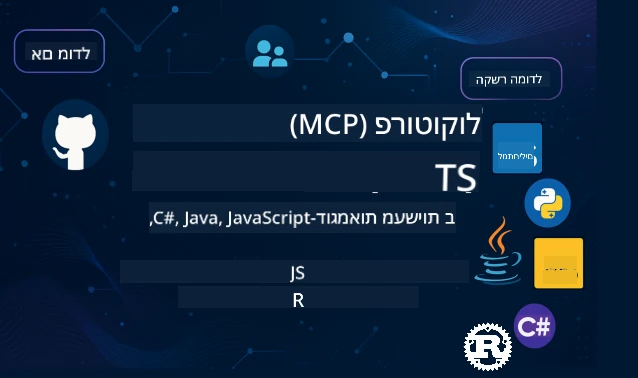

 

[](https://GitHub.com/microsoft/mcp-for-beginners/graphs/contributors)
[](https://GitHub.com/microsoft/mcp-for-beginners/issues)
[](https://GitHub.com/microsoft/mcp-for-beginners/pulls)
[](http://makeapullrequest.com)

[](https://GitHub.com/microsoft/mcp-for-beginners/watchers)
[](https://GitHub.com/microsoft/mcp-for-beginners/fork)
[](https://GitHub.com/microsoft/mcp-for-beginners/stargazers)


[](https://discord.gg/nTYy5BXMWG)

עקבו אחר השלבים הבאים כדי להתחיל להשתמש במשאבים האלה:
1. **פוצלו את המאגר**: לחצו על [](https://GitHub.com/microsoft/mcp-for-beginners/fork)
2. **שכפלו את המאגר**:  `git clone https://github.com/microsoft/mcp-for-beginners.git`
3. **הצטרפו ל** [](https://discord.gg/nTYy5BXMWG)


### 🌐 תמיכה רב-שפתית

#### נתמכת באמצעות GitHub Action (אוטומטית ותמיד מעודכנת)

<!-- CO-OP TRANSLATOR LANGUAGES TABLE START -->
[Arabic](../ar/README.md) | [Bengali](../bn/README.md) | [Bulgarian](../bg/README.md) | [Burmese (Myanmar)](../my/README.md) | [Chinese (Simplified)](../zh-CN/README.md) | [Chinese (Traditional, Hong Kong)](../zh-HK/README.md) | [Chinese (Traditional, Macau)](../zh-MO/README.md) | [Chinese (Traditional, Taiwan)](../zh-TW/README.md) | [Croatian](../hr/README.md) | [Czech](../cs/README.md) | [Danish](../da/README.md) | [Dutch](../nl/README.md) | [Estonian](../et/README.md) | [Finnish](../fi/README.md) | [French](../fr/README.md) | [German](../de/README.md) | [Greek](../el/README.md) | [Hebrew](./README.md) | [Hindi](../hi/README.md) | [Hungarian](../hu/README.md) | [Indonesian](../id/README.md) | [Italian](../it/README.md) | [Japanese](../ja/README.md) | [Kannada](../kn/README.md) | [Korean](../ko/README.md) | [Lithuanian](../lt/README.md) | [Malay](../ms/README.md) | [Malayalam](../ml/README.md) | [Marathi](../mr/README.md) | [Nepali](../ne/README.md) | [Nigerian Pidgin](../pcm/README.md) | [Norwegian](../no/README.md) | [Persian (Farsi)](../fa/README.md) | [Polish](../pl/README.md) | [Portuguese (Brazil)](../pt-BR/README.md) | [Portuguese (Portugal)](../pt-PT/README.md) | [Punjabi (Gurmukhi)](../pa/README.md) | [Romanian](../ro/README.md) | [Russian](../ru/README.md) | [Serbian (Cyrillic)](../sr/README.md) | [Slovak](../sk/README.md) | [Slovenian](../sl/README.md) | [Spanish](../es/README.md) | [Swahili](../sw/README.md) | [Swedish](../sv/README.md) | [Tagalog (Filipino)](../tl/README.md) | [Tamil](../ta/README.md) | [Telugu](../te/README.md) | [Thai](../th/README.md) | [Turkish](../tr/README.md) | [Ukrainian](../uk/README.md) | [Urdu](../ur/README.md) | [Vietnamese](../vi/README.md)

> **מעדיפים לשכפל מקומית?**
>
> מאגר זה כולל יותר מ-50 תרגומים, מה שמגדיל משמעותית את גודל ההורדה. כדי לשכפל בלי תרגומים, השתמשו ב-sparse checkout:
>
> **Bash / macOS / Linux:**
> ```bash
> git clone --filter=blob:none --sparse https://github.com/microsoft/mcp-for-beginners.git
> cd mcp-for-beginners
> git sparse-checkout set --no-cone '/*' '!translations' '!translated_images'
> ```
>
> **CMD (Windows):**
> ```cmd
> git clone --filter=blob:none --sparse https://github.com/microsoft/mcp-for-beginners.git
> cd mcp-for-beginners
> git sparse-checkout set --no-cone "/*" "!translations" "!translated_images"
> ```
>
> זה נותן לכם את כל מה שצריך כדי לסיים את הקורס עם הורדה מהירה יותר.
<!-- CO-OP TRANSLATOR LANGUAGES TABLE END -->

# 🚀 תוכנית לימודים לפרוטוקול הקשר דגם (MCP) למתחילים

## **למדו MCP עם דוגמאות קוד מעשיות ב-C#, Java, JavaScript, Rust, Python, ו-TypeScript**

## 🧠 סקירה כללית על תוכנית הלימודים של Model Context Protocol
ברוכים הבאים למסע שלכם אל פרוטוקול הקשר הדגם! אם תהיתם אי פעם כיצד יישומי בינה מלאכותית מתקשרים עם כלי ושירותים שונים, אתם עומדים לגלות את הפתרון האלגנטי שמשנה את הדרך שבה מפתחים בונים מערכות חכמות.

תחשבו על MCP כמערכת תרגום אוניברסלית ליישומי בינה מלאכותית – בדיוק כמו שיציאות USB מאפשרות לכם לחבר כל התקן למחשב, MCP מאפשרת למודלים של בינה מלאכותית להתחבר לכל כלי או שירות בצורה סטנדרטית. בין אם אתם בונים את צ'טבוט הראשון שלכם או עובדים על תהליכי עבודה מורכבים בבינה מלאכותית, הבנת MCP תעניק לכם את הכוח ליצור יישומים מוכשרים וגמישים יותר.

תוכנית הלימודים הזו מעוצבת בסבלנות ובקפידה בשביל מסע הלמידה שלכם. נתחיל עם מושגים פשוטים שכבר מכירים ותוך כדי התקדמות נבנה את המומחיות שלכם באמצעות תרגול מעשי בשפת התכנות האהובה עליכם. כל שלב כולל הסברים ברורים, דוגמאות מעשיות והרבה עידוד לאורך הדרך.

בסיום המסע הזה, תרגישו בטוחים לבנות שרתי MCP משלכם, לשלבם עם פלטפורמות AI פופולריות ולהבין איך הטכנולוגיה הזו מעצבת את עתיד הפיתוח של בינה מלאכותית. הבה נתחיל את ההרפתקה המרגשת הזו ביחד!

### תיעוד רשמי ומפרטים

תוכנית זו תואמת את **מפרט MCP מ-2025-11-25** (הגרסה היציבה האחרונה). מפרט ה-MCP משתמש בגרסאות מבוססות תאריכים (בפורמט YYYY-MM-DD) כדי להבטיח מעקב ברור אחרי גרסאות הפרוטוקול.

המשאבים האלה הופכים ליותר יקרים עם ההתקדמות שלכם, אבל אל תרגישו לחץ לקרוא הכל מיד. התחילו עם הנושאים שמעניינים אתכם ביותר!
- 📘 [תיעוד MCP](https://modelcontextprotocol.io/) – זהו המשאב הראשי שלכם למדריכים שלב אחר שלב ומדריכי משתמש. התיעוד נכתב במיוחד למתחילים, ומספק דוגמאות ברורות שניתן לעקוב אחריהן בקצב שלכם.
- 📜 [מפרט MCP](https://modelcontextprotocol.io/specification/2025-11-25) – תחשבו עליו כמדריך המקיף שלכם. ככל שתתקדמו בתוכנית, תמצאו את עצמכם חוזרים לכאן לבדוק פרטים מסוימים ולחקור תכונות מתקדמות.
- 📜 [גרסאות מפרט MCP](https://modelcontextprotocol.io/specification/versioning) – כאן תמצאו מידע על היסטוריית גרסאות הפרוטוקול ואיך MCP משתמש במערכת גרסאות מבוססת תאריך (פורמט YYYY-MM-DD).
- 🧑‍💻 [מאגר GitHub של MCP](https://github.com/modelcontextprotocol) – כאן תמצאו ערכות פיתוח, כלים, ודוגמאות קוד בשפות תכנות שונות. זהו אוצר דוגמאות מעשיות ורכיבים מוכנים לשימוש.
- 🌐 [קהילת MCP](https://github.com/orgs/modelcontextprotocol/discussions) – הצטרפו ללומדים אחרים ומפתחים מנוסים בדיונים על MCP. זוהי קהילה תומכת שבה שאלות מתקבלות בברכה והידע משותף בחופשיות.

## מטרות הלמידה

בסיום תוכנית הלימודים, תרגישו בטוחים ונרגשים מהיכולות החדשות שלכם. הנה מה שתשיגו:

• **הבנת יסודות MCP**: תבינו מהו פרוטוקול הקשר דגם ולמה הוא ממהפכן את הדרך שבה יישומי בינה מלאכותית עובדים יחד, באמצעות אנלוגיות ודוגמאות שמוסברות בצורה נגישה.

• **בניית שרת MCP ראשון**: תיצרו שרת MCP עובד בשפת התכנות המועדפת עליכם, תתחילו מדוגמאות פשוטות ותפתחו את כישוריכם בשלבים.

• **חיבור מודלים של AI לכלים אמיתיים**: תלמדו כיצד לגשר על הפער בין מודלי בינה מלאכותית לשירותים אמיתיים, ולספק יישומים עם יכולות חדשות וחזקות.

• **יישום שיטות אבטחה מיטביות**: תבינו כיצד לשמור על יישומי MCP שלכם בטוחים, ולהגן על היישומים והמשתמשים שלכם.

• **פריסה עם ביטחון**: תדעו כיצד לקחת את פרויקטי MCP שלכם מהפיתוח אל הייצור, עם אסטרטגיות פריסה מעשיות שעובדות במציאות.

• **הצטרפות לקהילת MCP**: תהפכו לחלק מקהילה מתפתחת של מפתחים בעלי השפעה על עתיד פיתוח יישומי בינה מלאכותית.

## רקע חיוני

לפני שנצלול לפרטי MCP, יש לוודא שאתם מרגישים נוח עם כמה מושגים בסיסיים. אל תדאגו אם אינכם מומחים בתחומים אלה – נסביר כל מה שתצטרכו לדעת לאורך הדרך!

### הבנת פרוטוקולים (היסוד)

תחשבו על פרוטוקול כמו הכללים לשיחה. כשאתם מתקשרים עם חבר, שניכם יודעים לומר "שלום" כשעונים, לדבר בתורות, ולומר "להתראות" בסיום. תוכניות מחשב צריכות כללים דומים כדי לתקשר בצורה יעילה.

MCP הוא פרוטוקול – סט של כללים מוסכמים שמאפשרים למודלים ויישומי בינה מלאכותית לנהל "שיחות" פרודוקטיביות עם כלים ושירותים. ממש כמו שכללי שיחה הופכים את התקשורת האנושית לחלקה יותר, MCP עושה את התקשורת בין יישומי AI למהימנה וחזקה יותר.

### יחסי לקוח-שרת (איך תוכניות עובדות יחד)

אתם כבר משתמשים ביחסי לקוח-שרת כל יום! כשאתם משתמשים בדפדפן (הלקוח) כדי לבקר באתר, אתם מתחברים לשרת שלוחש לכם את תוכן הדף. הדפדפן יודע איך לבקש מידע, והשרת יודע איך להשיב.

ב-MCP יש לנו מערכת דומה: מודלים של AI הם לקוחות שמבקשים מידע או פעולות, בעוד ששרתי MCP מספקים את היכולות האלה. זה כמו לעובד מסייע (השרת) שה-AI יכול לפנות אליו לבצע משימות מסוימות.

### למה סטנדרטיזציה חשובה (להפוך דברים לעובדים יחד)

דמיינו שכל יצרן רכב היה משתמש בצורות משאבות דלק שונות – הייתם צריכים מתאם אחר לכל רכב! סטנדרטיזציה היא ההסכמה על גישות משותפות כך שהדברים יעבדו יחד בצורה חלקה.

MCP מספק את הסטנדרטיזציה הזו ליישומי בינה מלאכותית. במקום שכל מודל AI יצטרך קוד מותאם אישית לכל כלי, MCP יוצר דרך אוניברסלית לתקשר. המשמעות היא שמפתחים יכולים לבנות כלי פעם אחת, והיא תעבוד עם מערכות AI רבות ושונות.

## 🧭 סקירת מסלול הלמידה שלכם

מסע ה-MCP שלכם בנוי בקפידה כדי לבנות את הביטחון והכישורים שלכם בהדרגה. כל שלב מציג מושגים חדשים תוך חיזוק מה שלמדתם עד כה.

### 🌱 שלב יסוד: הבנת היסודות (מודולים 0-2)

זה המקום שבו ההרפתקה שלכם מתחילה! נציג לכם את מושגי MCP עם אנלוגיות מוכרות ודוגמאות פשוטות. תבינו מה זה MCP, למה זה קיים ואיך הוא משתלב בעולם הרחב של פיתוח בינה מלאכותית.

• **מודול 0 - מבוא ל-MCP**: נתחיל בחקירת מהו MCP ולמה הוא כל כך חשוב ליישומי AI מודרניים. תראו דוגמאות מהעולם האמיתי ל-MCP בפעולה ותבינו איך הוא פותר בעיות נפוצות למפתחים.

• **מודול 1 - הסבר מושגים מרכזיים**: כאן תלמדו את האבני הבניין החיוניות של MCP. נשתמש בהרבה אנלוגיות ודוגמאות ויזואליות כדי לוודא שהמושגים האלו מרגישים טבעיים וברורים.

• **מודול 2 - אבטחה ב-MCP**: אבטחה אולי נשמעת מפחידה, אבל נראה לכם איך MCP כולל תכונות בטיחות מובנות ונלמד אתכם את השיטות הטובות ביותר להגנה על היישומים שלכם מההתחלה.

### 🔨 שלב בנייה: יצירת היישומים הראשונים שלכם (מודול 3)

עכשיו הכיף האמיתי מתחיל! תקבלו ניסיון מעשי בבניית שרתי MCP ולקוחות של ממש. אל תדאגו – נתחיל בפשטות ונדריך אתכם בכל שלב.
מודול זה כולל מספר מדריכים מעשיים המאפשרים לך להתנסות בשפת התכנות המועדפת עליך. תיצור את השרת הראשון שלך, תבנה לקוח שיתחבר אליו, ואפילו תשתלב עם כלים פופולריים לפיתוח כגון VS Code.

כל מדריך כולל דוגמאות קוד שלמות, טיפים לפתרון בעיות והסברים מדוע אנו עושים בחירות עיצוב מסוימות. בסיום שלב זה, יהיה לך מימושי MCP שעובדים ושתוכל להיות גאה בהם!

### 🚀 שלב הצמיחה: מושגים מתקדמים ויישום בעולם האמיתי (מודולים 4-5)

לאחר ששליטת ביסודות, אתה מוכן לחקור תכונות מתוחכמות יותר של MCP. נסקור אסטרטגיות יישום מעשיות, טכניקות ניפוי שגיאות ונושאים מתקדמים כמו אינטגרציה של AI רב-מודאלי.

תלמד גם כיצד להרחיב את מימושי ה-MCP שלך לשימוש בפרודקשן ולהשתלב עם פלטפורמות ענן כמו Azure. מודולים אלה מכינים אותך לבניית פתרונות MCP שיכולים להתמודד עם דרישות מהעולם האמיתי.

### 🌟 שלב המאסטר: קהילה והתמחות (מודולים 6-11)

השלב הסופי מתמקד בהצטרפות לקהילת ה-MCP והתמחות בתחומים שמעניינים אותך במיוחד. תלמד כיצד לתרום לפרויקטים של MCP בקוד פתוח, ליישם דפוסי אימות מתקדמים ולבנות פתרונות מקיפים המשולבים עם בסיסי נתונים.

מודול 11 ראוי לציון מיוחד - זהו מסלול למידה מעשי שלם בן 13 מעבדות המלמד אותך לבנות שרתי MCP מוכנים לפרודקשן עם אינטגרציה של PostgreSQL. זהו כמו פרויקט גמר שמאגד את כל מה שלמדת!

### 📚 מבנה תוכנית הלימודים המלאה

| מודול | נושא | תיאור | קישור |
|--------|-------|-------------|------|
| **מודול 0-3: יסודות** | | | |
| 00 | הקדמה ל-MCP | סקירה על פרוטוקול Model Context וחשיבותו בצינורות AI | [לקרא עוד](./00-Introduction/README.md) |
| 01 | הסבר על מושגים מרכזיים | חקר מעמיק של מושגי הליבה של MCP | [לקרא עוד](./01-CoreConcepts/README.md) |
| 02 | אבטחה ב-MCP | איומי אבטחה ופרקטיקות מיטביות | [לקרא עוד](./02-Security/README.md) |
| 03 | התחלה עם MCP | הקמת סביבה, שרתים/לקוחות בסיסיים, אינטגרציה | [לקרא עוד](./03-GettingStarted/README.md) |
| **מודול 3: בניית השרת והלקוח הראשון שלך** | | | |
| 3.1 | השרת הראשון | צור את שרת ה-MCP הראשון שלך | [מדריך](./03-GettingStarted/01-first-server/README.md) |
| 3.2 | הלקוח הראשון | פתח לקוח MCP בסיסי | [מדריך](./03-GettingStarted/02-client/README.md) |
| 3.3 | לקוח עם LLM | אינטגרציה עם מודלים שפתיים גדולים | [מדריך](./03-GettingStarted/03-llm-client/README.md) |
| 3.4 | אינטגרציה עם VS Code | שימוש בשרתי MCP ב-VS Code | [מדריך](./03-GettingStarted/04-vscode/README.md) |
| 3.5 | שרת stdio | יצירת שרתים באמצעות תחבורה stdio | [מדריך](./03-GettingStarted/05-stdio-server/README.md) |
| 3.6 | הזרמת HTTP | יישום הזרמת HTTP ב-MCP | [מדריך](./03-GettingStarted/06-http-streaming/README.md) |
| 3.7 | ערכת כלים AI | שימוש בערכת כלים AI עם MCP | [מדריך](./03-GettingStarted/07-aitk/README.md) |
| 3.8 | בדיקות | בדוק את מימוש שרת ה-MCP שלך | [מדריך](./03-GettingStarted/08-testing/README.md) |
| 3.9 | פריסה | פרוס שרתי MCP לפרודקשן | [מדריך](./03-GettingStarted/09-deployment/README.md) |
| 3.10 | שימוש מתקדם בשרת | השתמש בשרתי MCP מתקדמים למאפיינים מורכבים ולארכיטקטורה משופרת | [מדריך](./03-GettingStarted/10-advanced/README.md) |
| 3.11 | אימות פשוט | פרק המציג אימות מהיסוד ו-RBAC | [מדריך](./03-GettingStarted/11-simple-auth/README.md) |
| 3.12 | מארחי MCP | קבע הגדרות ל-Claude Desktop, Cursor, Cline ומארחי MCP נוספים | [מדריך](./03-GettingStarted/12-mcp-hosts/README.md) |
| 3.13 | בודק MCP | נפה שגיאות ובדוק שרתי MCP עם כלי Inspector | [מדריך](./03-GettingStarted/13-mcp-inspector/README.md) |
| 3.14 | דגימה | השתמש בדגימה לשיתוף פעולה עם הלקוח | [מדריך](./03-GettingStarted/14-sampling/README.md) |
| 3.15 | אפליקציות MCP | בנה אפליקציות MCP | [מדריך](./03-GettingStarted/15-mcp-apps/README.md) |

| **מודול 4-5: מעשי ומתקדם** | | | |
| 04 | יישום מעשי | SDKים, ניפוי שגיאות, בדיקות, תבניות פרומפט לשימוש חוזר | [לקרא עוד](./04-PracticalImplementation/README.md) |
| 4.1 | עמודים | טיפול בקבוצות תוצאות גדולות באמצעות דפדוף מבוסס סמן | [מדריך](./04-PracticalImplementation/pagination/README.md) |
| 05 | נושאים מתקדמים ב-MCP | AI רב-מודאלי, סקיילינג, שימוש ארגוני | [לקרא עוד](./05-AdvancedTopics/README.md) |
| 5.1 | אינטגרציית Azure | אינטגרציה של MCP עם Azure | [מדריך](./05-AdvancedTopics/mcp-integration/README.md) |
| 5.2 | רב-מודאליות | עבודה עם מודאליות מרובות | [מדריך](./05-AdvancedTopics/mcp-multi-modality/README.md) |
| 5.3 | דמו OAuth2 | יישום אימות OAuth2 | [מדריך](./05-AdvancedTopics/mcp-oauth2-demo/README.md) |
| 5.4 | הקשר שורש | הבן ויישם הקשרים שורשיים | [מדריך](./05-AdvancedTopics/mcp-root-contexts/README.md) |
| 5.5 | ניתוב | אסטרטגיות ניתוב ב-MCP | [מדריך](./05-AdvancedTopics/mcp-routing/README.md) |
| 5.6 | דגימה | טכניקות דגימה ב-MCP | [מדריך](./05-AdvancedTopics/mcp-sampling/README.md) |
| 5.7 | סקיילינג | הרחבת מימושי MCP | [מדריך](./05-AdvancedTopics/mcp-scaling/README.md) |
| 5.8 | אבטחה | התייחסויות אבטחה מתקדמות | [מדריך](./05-AdvancedTopics/mcp-security/README.md) |
| 5.9 | חיפוש רשת | יישום יכולות חיפוש באינטרנט | [מדריך](./05-AdvancedTopics/web-search-mcp/README.md) |
| 5.10 | הזרמת זמן אמת | בניית פונקציונליות הזרמה בזמן אמת | [מדריך](./05-AdvancedTopics/mcp-realtimestreaming/README.md) |
| 5.11 | חיפוש זמן אמת | יישום חיפוש בזמן אמת | [מדריך](./05-AdvancedTopics/mcp-realtimesearch/README.md) |
| 5.12 | אימות Entra ID | אימות עם Microsoft Entra ID | [מדריך](./05-AdvancedTopics/mcp-security-entra/README.md) |
| 5.13 | אינטגרציית Foundry | אינטגרציה עם Azure AI Foundry | [מדריך](./05-AdvancedTopics/mcp-foundry-agent-integration/README.md) |
| 5.14 | הנדסת הקשר | טכניקות להנדסת הקשר יעילה | [מדריך](./05-AdvancedTopics/mcp-contextengineering/README.md) |
| 5.15 | תחבורה מותאמת אישית ב-MCP | מימושי תחבורה מותאמים אישית | [מדריך](./05-AdvancedTopics/mcp-transport/README.md) |
| 5.16 | תכונות פרוטוקול | התראות על התקדמות, ביטול, תבניות משאבים | [מדריך](./05-AdvancedTopics/mcp-protocol-features/README.md) |
| **מודול 6-10: קהילה ופרקטיקות מיטביות** | | | |
| 06 | תרומות קהילתיות | כיצד לתרום לאקוסיסטם MCP | [מדריך](./06-CommunityContributions/README.md) |
| 07 | תובנות מאימוץ מוקדם | סיפורי יישום מהעולם האמיתי | [מדריך](./07-LessonsfromEarlyAdoption/README.md) |
| 08 | פרקטיקות מיטביות ל-MCP | ביצועים, עמידות לתקלות, חוסן | [מדריך](./08-BestPractices/README.md) |
| 09 | מקרי בוחן MCP | דוגמאות יישום מעשיות | [מדריך](./09-CaseStudy/README.md) |
| 10 | סדנת מעשית | בניית שרת MCP עם ערכת כלים AI | [מעבדה](./10-StreamliningAIWorkflowsBuildingAnMCPServerWithAIToolkit/README.md) |
| **מודול 11: מעבדת שרת MCP מעשית** | | | |
| 11 | אינטגרציה של שרת MCP עם בסיסי נתונים | מסלול למידה מעשי מקיף בן 13 מעבדות לאינטגרציה עם PostgreSQL | [מעבדות](./11-MCPServerHandsOnLabs/README.md) |
| 11.1 | הקדמה | סקירה של MCP עם אינטגרציה למסד נתונים ומקרה שימוש של ניתוח קמעונאי | [מעבדה 00](./11-MCPServerHandsOnLabs/00-Introduction/README.md) |
| 11.2 | ארכיטקטורה מרכזית | הבנת ארכיטקטורת שרת MCP, שכבות מסד נתונים ודפוסי אבטחה | [מעבדה 01](./11-MCPServerHandsOnLabs/01-Architecture/README.md) |
| 11.3 | אבטחה וריבוי שוכרים | אבטחת רמת שורה, אימות וגישה לנתונים מרובי שוכרים | [מעבדה 02](./11-MCPServerHandsOnLabs/02-Security/README.md) |
| 11.4 | הקמת סביבה | הקמת סביבת פיתוח, Docker, משאבי Azure | [מעבדה 03](./11-MCPServerHandsOnLabs/03-Setup/README.md) |
| 11.5 | עיצוב מסד נתונים | הקמת PostgreSQL, עיצוב סכמת קמעונאות ונתוני דוגמה | [מעבדה 04](./11-MCPServerHandsOnLabs/04-Database/README.md) |
| 11.6 | מימוש שרת MCP | בניית שרת FastMCP עם אינטגרציה למסד נתונים | [מעבדה 05](./11-MCPServerHandsOnLabs/05-MCP-Server/README.md) |
| 11.7 | פיתוח כלים | יצירת כלים לשאילתות מסד נתונים ואינטרוספקציה לסכמה | [מעבדה 06](./11-MCPServerHandsOnLabs/06-Tools/README.md) |
| 11.8 | חיפוש סמנטי | יישום טמיעות וקטוריות עם Azure OpenAI ו-pgvector | [מעבדה 07](./11-MCPServerHandsOnLabs/07-Semantic-Search/README.md) |
| 11.9 | בדיקות וניפוי שגיאות | אסטרטגיות בדיקה, כלים לניפוי שגיאות וגישות אימות | [מעבדה 08](./11-MCPServerHandsOnLabs/08-Testing/README.md) |
| 11.10 | אינטגרציה עם VS Code | קביעת אינטגרציה של VS Code MCP ושימוש בצ'אט AI | [מעבדה 09](./11-MCPServerHandsOnLabs/09-VS-Code/README.md) |
| 11.11 | אסטרטגיות פריסה | פריסת Docker, Azure Container Apps והתחשבות בסקיילינג | [מעבדה 10](./11-MCPServerHandsOnLabs/10-Deployment/README.md) |
| 11.12 | ניטור | Application Insights, רישום, ניטור ביצועים | [מעבדה 11](./11-MCPServerHandsOnLabs/11-Monitoring/README.md) |
| 11.13 | פרקטיקות מיטביות | אופטימיזציה של ביצועים, חיזוק אבטחה וטיפים לפרודקשן | [מעבדה 12](./11-MCPServerHandsOnLabs/12-Best-Practices/README.md) |

### 💻 פרויקטי דוגמה בקוד

אחד החלקים המרתקים בלמידת MCP הוא לראות את יכולות הקוד שלך מתפתחות בהדרגה. תכננו את דוגמאות הקוד שלנו כך שיתחילו פשוטות ויתקדמו למורכבות ככל שההבנה שלך מעמיקה. כך אנו מציגים מושגים - עם קוד שקל להבין אך שממחיש עקרונות אמיתיים של MCP, תבין לא רק מה הקוד הזה עושה, אלא מדוע הוא בנוי כך ואיך הוא משתלב באפליקציות MCP גדולות יותר.

#### דוגמאות בסיסיות למחשבון MCP

| שפה | תיאור | קישור |
|----------|-------------|------|
| C# | דוגמת שרת MCP | [צפה בקוד](./03-GettingStarted/samples/csharp/README.md) |
| Java | מחשבון MCP | [צפה בקוד](./03-GettingStarted/samples/java/calculator/README.md) |
| JavaScript | הדגמת MCP | [צפה בקוד](./03-GettingStarted/samples/javascript/README.md) |
| Python | שרת MCP | [צפה בקוד](../../03-GettingStarted/samples/python/mcp_calculator_server.py) |
| TypeScript | דוגמת MCP | [צפה בקוד](./03-GettingStarted/samples/typescript/README.md) |
| Rust | דוגמת MCP | [צפה בקוד](./03-GettingStarted/samples/rust/README.md) |

#### מימושי MCP מתקדמים

| שפה | תיאור | קישור |
|----------|-------------|------|
| C# | דוגמה מתקדמת | [צפה בקוד](./04-PracticalImplementation/samples/csharp/README.md) |
| Java עם Spring | דוגמת Container App | [צפה בקוד](./04-PracticalImplementation/samples/java/containerapp/README.md) |
| JavaScript | דוגמה מתקדמת | [צפה בקוד](./04-PracticalImplementation/samples/javascript/README.md) |
| Python | מימוש מורכב | [צפה בקוד](./04-PracticalImplementation/samples/python/README.md) |
| TypeScript | דוגמת Container | [צפה בקוד](./04-PracticalImplementation/samples/typescript/README.md) |


## 🎯 דרישות מוקדמות ללימוד MCP

כדי להפיק את המרב מתוכנית הלימודים הזו, עליך שיהיו לך:
- ידע בסיסי בתכנות לפחות באחת מהשפות הבאות: C#, Java, JavaScript, Python, או TypeScript  
- הבנה של מודל לקוח-שרת ו-APIs  
- היכרות עם מושגי REST ו-HTTP  
- (אופציונלי) רקע במושגי AI/ML  

- השתתפות בדיוני הקהילה שלנו לתמיכה  

## 📚 מדריך לימוד ומשאבים  

מאגר זה כולל מספר משאבים כדי לעזור לך לנווט וללמוד בצורה יעילה:  

### מדריך לימוד  

[מדריך לימוד](./study_guide.md) מקיף זמין שיעזור לך לנווט במאגר זה ביעילות. מפה ויזואלית זו של תוכנית הלימודים מציגה כיצד כל הנושאים מחוברים ומספקת הנחיות כיצד להשתמש בפרויקטים לדוגמה בצורה יעילה. זה מועיל במיוחד אם אתה לומד בצורה ויזואלית שאוהבת לראות את התמונה הכוללת.  

המדריך כולל:  
- מפה ויזואלית של תוכנית הלימודים המציגה את כל הנושאים  
- פירוט מפורט של כל חלקי המאגר  
- הנחיות לשימוש בפרויקטים לדוגמה  
- מסלולי למידה מומלצים לרמות מיומנות שונות  
- משאבים נוספים להשלמת מסע הלמידה שלך  

### רישום שינויים  

אנו מנהלים רישום שינויים מפורט ב-[Changelog](./changelog.md) שעוקב אחרי כל העדכונים המשמעותיים בחומרי הלימוד, כך שתוכל להתעדכן בשיפורים והוספות אחרונות.  
- הוספת תכנים חדשים  
- שינויים מבניים  
- שיפורי תכונות  
- עדכוני תיעוד  

## 🛠️ כיצד להשתמש בתוכנית הלימודים הזו ביעילות  

כל שיעור במדריך זה כולל:  

1. הסברים ברורים על מושגי MCP  
2. דוגמאות קוד חיות בכמה שפות  
3. תרגילים לבניית יישומי MCP אמיתיים  
4. משאבים נוספים ללומדים מתקדמים  

### בואו נלמד את MCP עם C# - סדרת הדרכה  
בואו נלמד על פרוטוקול הקשר מודל (MCP), מסגרת חדשנית שמטרתה לאחד את האינטראקציות בין מודלי AI ליישומי לקוח. באמצעות מושב זה למתחילים, נציג לך את MCP ונדריך אותך ביצירת שרת MCP ראשון משלך.  
#### C#: [https://aka.ms/letslearnmcp-csharp](https://aka.ms/letslearnmcp-csharp)  
#### Java: [https://aka.ms/letslearnmcp-java](https://aka.ms/letslearnmcp-java)  
#### JavaScript: [https://aka.ms/letslearnmcp-javascript](https://aka.ms/letslearnmcp-javascript)  
#### Python: [https://aka.ms/letslearnmcp-python](https://aka.ms/letslearnmcp-python)  

## 🎓 המסע שלך עם MCP מתחיל  

מברכות! זהו הצעד הראשון שלך במסע מרתק שיפתח בפניך יכולות תכנות חדשות ויחבר אותך לקדמת הטכנולוגיה בפיתוח AI.  

### מה שכבר הצלחת לעשות  

בקראת הקריאה במבוא זה התחלת כבר לבנות את יסודות ההבנה של MCP. אתה מבין מה זה MCP, למה זה חשוב, וכיצד תוכנית הלימודים הזו תתמוך במסע הלמידה שלך. זו הישג משמעותי ותחילת המומחיות שלך בטכנולוגיה חשובה זו.  

### ההרפתקה הבאה  

כיתה תתקדם דרך המודולים, זכור שכל מומחה היה בתחילה מתחיל. המושגים שלפעמים נראים מסובכים כעת יהפכו לטבע שני כשאתה מתרגל ומיישם אותם. כל צעד קטן בונה יכולות עצומות שישרתו אותך לאורך כל הקריירה שלך בפיתוח.  

### רשת התמיכה שלך  

אתה מצטרף לקהילה של לומדים ומומחים שמונעים על ידי תשוקה ל-MCP ונרגשים לעזור לאחרים להצליח. בין אם אתה תקוע באתגר קידוד או מתלהב לשתף פריצת דרך, הקהילה כאן כדי לתמוך במסע שלך.  

אם אתה נתקל בקשיים או יש לך שאלות לגבי בניית אפליקציות AI, הצטרף ללומדים ומפתחים מנוסים בדיונים על MCP. זו קהילה תומכת שבה שאלות מתקבלות בברכה והידע משותף בחופשיות.  

[](https://discord.gg/nTYy5BXMWG)  

אם יש לך משוב על מוצר או שגיאות בעת הפיתוח בקר באתר:  

[](https://aka.ms/foundry/forum)  

### מוכן להתחיל?  

ההרפתקה שלך ב-MCP מתחילה עכשיו! התחל במודול 0 כדי לצלול אל החוויות המעשי שלך עם MCP, או חפש בפרויקטים לדוגמה כדי לראות מה תבנה. זכור - כל מומחה התחיל בדיוק במקום שבו אתה נמצא כעת, ועם סבלנות ותרגול, תתפלא מה תוכל להשיג.  

ברוך הבא לעולם פיתוח פרוטוקול הקשר מודל. בוא נבנה משהו מדהים ביחד!  

## 🤝 תרומה לקהילת הלמידה  

תוכנית הלימודים הזו מתחזקת בזכות תרומות מלומדים כמוך! בין אם אתה מתקן טעות טיפוגרפית, מציע הסבר ברור יותר, או מוסיף דוגמה חדשה, התרומות שלך עוזרות למתחילים נוספים להצליח.  

תודה למקצוען ממיקרוסופט [Shivam Goyal](https://www.linkedin.com/in/shivam2003/) על תרומת דוגמאות הקוד.  

תהליך התרומה תוכנן להיות ידידותי ותומך. רוב התרומות דורשות הסכם רישיון תורם (CLA), אבל הכלים האוטומטיים ינחו אותך בתהליך בצורה חלקה.  

## 📜 למידה בקוד פתוח  

כל תוכנית הלימודים זמינה תחת רישיון MIT [LICENSE](../../LICENSE), כלומר ניתן להשתמש בה, לשנות ולשתף בחופשיות. זה תומך במטרתנו להפוך את הידע על MCP לנגיש למפתחים בכל מקום.  
## 🤝 קווי הנחיה לתרומה  

פרויקט זה מקבל בברכה תרומות והצעות. רוב התרומות מחייבות הסכמה להסכם רישיון תורם (CLA) המצהיר כי יש לך את הזכות, ואתה אכן מעניק לנו את הזכויות להשתמש בתרומתך. לפרטים, בקר בכתובת <https://cla.opensource.microsoft.com>.  

כאשר אתה שולח בקשת משיכה, רובוט CLA יבדוק אוטומטית אם יש צורך לספק CLA ויעטר את ה-PR בהתאם (למשל, בדיקת מצב, תגובה). פשוט עקוב אחר ההוראות שניתנו על ידי הרובוט. תצטרך לעשות זאת רק פעם אחת בכל המאגר הכולל שימוש ב-CLA שלנו.  

פרויקט זה אימץ את [קוד ההתנהגות של קוד פתוח של מיקרוסופט](https://opensource.microsoft.com/codeofconduct/). למידע נוסף עיין ב-[שאלות נפוצות על קוד ההתנהגות](https://opensource.microsoft.com/codeofconduct/faq/) או פנה ל-[opencode@microsoft.com](mailto:opencode@microsoft.com) עם שאלות או הערות נוספות.  

---  

*מוכן להתחיל את מסע ה-MCP שלך? התחל עם [מודול 00 - מבוא ל-MCP](./00-Introduction/README.md) ועשה את הצעדים הראשונים בעולם פיתוח פרוטוקול הקשר מודל!*  

## 🎒 קורסים נוספים  
הצוות שלנו מפיק קורסים נוספים! בדוק את:  

<!-- CO-OP TRANSLATOR OTHER COURSES START -->  
### LangChain  
[](https://aka.ms/langchain4j-for-beginners)  
[](https://aka.ms/langchainjs-for-beginners?WT.mc_id=m365-94501-dwahlin)  
[](https://github.com/microsoft/langchain-for-beginners?WT.mc_id=m365-94501-dwahlin)  
---  

### Azure / Edge / MCP / סוכנים  
[](https://github.com/microsoft/AZD-for-beginners?WT.mc_id=academic-105485-koreyst)  
[](https://github.com/microsoft/edgeai-for-beginners?WT.mc_id=academic-105485-koreyst)  
[](https://github.com/microsoft/mcp-for-beginners?WT.mc_id=academic-105485-koreyst)  
[](https://github.com/microsoft/ai-agents-for-beginners?WT.mc_id=academic-105485-koreyst)  

---  

### סדרת AI גנרטיבי  
[](https://github.com/microsoft/generative-ai-for-beginners?WT.mc_id=academic-105485-koreyst)  
[-9333EA?style=for-the-badge&labelColor=E5E7EB&color=9333EA)](https://github.com/microsoft/Generative-AI-for-beginners-dotnet?WT.mc_id=academic-105485-koreyst)  
[-C084FC?style=for-the-badge&labelColor=E5E7EB&color=C084FC)](https://github.com/microsoft/generative-ai-for-beginners-java?WT.mc_id=academic-105485-koreyst)  
[-E879F9?style=for-the-badge&labelColor=E5E7EB&color=E879F9)](https://github.com/microsoft/generative-ai-with-javascript?WT.mc_id=academic-105485-koreyst)  

---  

### למידה עיקרית  
[](https://aka.ms/ml-beginners?WT.mc_id=academic-105485-koreyst)  
[](https://aka.ms/datascience-beginners?WT.mc_id=academic-105485-koreyst)  
[](https://aka.ms/ai-beginners?WT.mc_id=academic-105485-koreyst)  
[](https://github.com/microsoft/Security-101?WT.mc_id=academic-96948-sayoung)  
[](https://aka.ms/webdev-beginners?WT.mc_id=academic-105485-koreyst)  
[](https://aka.ms/iot-beginners?WT.mc_id=academic-105485-koreyst)  
[](https://github.com/microsoft/xr-development-for-beginners?WT.mc_id=academic-105485-koreyst)  

---  

### סדרת Copilot  

[](https://aka.ms/GitHubCopilotAI?WT.mc_id=academic-105485-koreyst)
[](https://github.com/microsoft/mastering-github-copilot-for-dotnet-csharp-developers?WT.mc_id=academic-105485-koreyst)
[](https://github.com/microsoft/CopilotAdventures?WT.mc_id=academic-105485-koreyst)
<!-- CO-OP TRANSLATOR OTHER COURSES END -->

---

<!-- CO-OP TRANSLATOR DISCLAIMER START -->
**כתב ויתור**:  
מסמך זה תורגם באמצעות שירות התרגום המבוסס בינה מלאכותית [Co-op Translator](https://github.com/Azure/co-op-translator). למרות שאנו שואפים לדייק, יש להיות מודעים לכך כי תרגומים אוטומטיים עלולים להכיל טעויות או אי דיוקים. יש לראות במסמך המקורי בשפתו המקורית את המקור המוסמך. למידע קריטי מומלץ לבצע תרגום מקצועי על ידי אדם. אנו לא אחראים לכל אי הבנה או פרשנות מוטעית הנובעים משימוש בתרגום זה.
<!-- CO-OP TRANSLATOR DISCLAIMER END -->