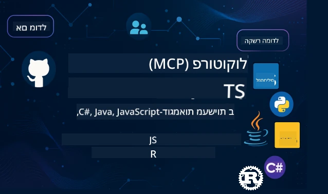

 

[](https://GitHub.com/microsoft/mcp-for-beginners/graphs/contributors)
[](https://GitHub.com/microsoft/mcp-for-beginners/issues)
[](https://GitHub.com/microsoft/mcp-for-beginners/pulls)
[](http://makeapullrequest.com)
[](https://mcptoplist.com/server/mcp.so%2Fmcp-for-beginners%2Fmicrosoft)

[](https://GitHub.com/microsoft/mcp-for-beginners/watchers)
[](https://GitHub.com/microsoft/mcp-for-beginners/fork)
[](https://GitHub.com/microsoft/mcp-for-beginners/stargazers)


[](https://discord.gg/nTYy5BXMWG)

עקבו אחר השלבים הללו כדי להתחיל להשתמש במשאבים אלה:
1. **יצירת Fork של המאגר**: לחצו על [](https://GitHub.com/microsoft/mcp-for-beginners/fork)
2. **שכפול המאגר**:   `git clone https://github.com/microsoft/mcp-for-beginners.git`
3. **הצטרפו ל** [](https://discord.gg/nTYy5BXMWG)


### 🌐 תמיכה בריבוי שפות

#### נתמך באמצעות פעולה ב-GitHub (אוטומטית ותמיד מעודכנת)

<!-- CO-OP TRANSLATOR LANGUAGES TABLE START -->
[Arabic](../ar/README.md) | [Bengali](../bn/README.md) | [Bulgarian](../bg/README.md) | [Burmese (Myanmar)](../my/README.md) | [Chinese (Simplified)](../zh-CN/README.md) | [Chinese (Traditional, Hong Kong)](../zh-HK/README.md) | [Chinese (Traditional, Macau)](../zh-MO/README.md) | [Chinese (Traditional, Taiwan)](../zh-TW/README.md) | [Croatian](../hr/README.md) | [Czech](../cs/README.md) | [Danish](../da/README.md) | [Dutch](../nl/README.md) | [Estonian](../et/README.md) | [Finnish](../fi/README.md) | [French](../fr/README.md) | [German](../de/README.md) | [Greek](../el/README.md) | [Hebrew](./README.md) | [Hindi](../hi/README.md) | [Hungarian](../hu/README.md) | [Indonesian](../id/README.md) | [Italian](../it/README.md) | [Japanese](../ja/README.md) | [Kannada](../kn/README.md) | [Khmer](../km/README.md) | [Korean](../ko/README.md) | [Lithuanian](../lt/README.md) | [Malay](../ms/README.md) | [Malayalam](../ml/README.md) | [Marathi](../mr/README.md) | [Nepali](../ne/README.md) | [Nigerian Pidgin](../pcm/README.md) | [Norwegian](../no/README.md) | [Persian (Farsi)](../fa/README.md) | [Polish](../pl/README.md) | [Portuguese (Brazil)](../pt-BR/README.md) | [Portuguese (Portugal)](../pt-PT/README.md) | [Punjabi (Gurmukhi)](../pa/README.md) | [Romanian](../ro/README.md) | [Russian](../ru/README.md) | [Serbian (Cyrillic)](../sr/README.md) | [Slovak](../sk/README.md) | [Slovenian](../sl/README.md) | [Spanish](../es/README.md) | [Swahili](../sw/README.md) | [Swedish](../sv/README.md) | [Tagalog (Filipino)](../tl/README.md) | [Tamil](../ta/README.md) | [Telugu](../te/README.md) | [Thai](../th/README.md) | [Turkish](../tr/README.md) | [Ukrainian](../uk/README.md) | [Urdu](../ur/README.md) | [Vietnamese](../vi/README.md)

> **מעדיפים לשכפל באופן מקומי?**
>
> מאגר זה כולל יותר מ-50 תרגומים לשפות שונות, מה שמגדיל משמעותית את גודל ההורדה. כדי לשכפל ללא תרגומים, השתמשו ב-sparse checkout:
>
> **Bash / macOS / Linux:**
> ```bash
> git clone --filter=blob:none --sparse https://github.com/microsoft/mcp-for-beginners.git
> cd mcp-for-beginners
> git sparse-checkout set --no-cone '/*' '!translations' '!translated_images'
> ```
>
> **CMD (Windows):**
> ```cmd
> git clone --filter=blob:none --sparse https://github.com/microsoft/mcp-for-beginners.git
> cd mcp-for-beginners
> git sparse-checkout set --no-cone "/*" "!translations" "!translated_images"
> ```
>
> זה נותן לכם את כל מה שאתם צריכים כדי להשלים את הקורס במהירות הורדה גבוהה יותר.
<!-- CO-OP TRANSLATOR LANGUAGES TABLE END -->

# 🚀 תכנית הלימודים של פרוטוקול הקשר עם מודלים (MCP) למתחילים

## **למדו MCP עם דוגמאות קוד מעשיות ב-C#, Java, JavaScript, Rust, Python, ו-TypeScript**

## 🧠 סקירה כללית של תכנית הלימודים של פרוטוקול הקשר עם מודלים
ברוכים הבאים למסע שלכם לתוך פרוטוקול הקשר עם מודלים! אם אי פעם תהיתם כיצד אפליקציות AI מתקשרות עם כלים ושירותים שונים, אתם עומדים לגלות את הפתרון האלגנטי שמשנה את דרך הפיתוח של מערכות אינטליגנטיות.

חשבו על MCP כמתרגם אוניברסלי לאפליקציות AI - כמו שיציאות USB מאפשרות לחבר כל מכשיר למחשב שלכם, MCP מאפשר למודלים של AI להתחבר לכל כלי או שירות באופן סטנדרטי. בין אם אתם בונים את הצ'אט-בוט הראשון שלכם או עובדים על זרימות עבודה מורכבות של AI, הבנת MCP תיתן לכם את הכוח ליצור אפליקציות גמישות ויותר מתקדמות.

תכנית הלימודים הזו נוצרה בסבלנות ובקפידה עבור מסע הלמידה שלכם. נתחיל עם מושגים פשוטים שאתם כבר מכירים ונתקדם בהדרגה דרך תרגול מעשי בשפת התכנות האהובה עליכם. כל שלב כולל הסברים ברורים, דוגמאות מעשיות והרבה עידוד לאורך הדרך.

עד שתסיימו את המסע הזה, תהיה לכם היכולת לבנות שרתי MCP משלכם, לשלב אותם עם פלטפורמות AI פופולריות ולהבין איך הטכנולוגיה הזו מעצבת את עתיד פיתוח ה-AI. בואו נתחיל בהרפתקה המרגשת הזו יחד!

### תיעוד רשמי ומפרטים

תכנית הלימודים הזו מתואמת עם **מפרט MCP 2025-11-25** (הגרסה היציבה האחרונה). מפרט MCP משתמש בגרסאות מבוססות תאריכים (פורמט YYYY-MM-DD) כדי לוודא מעקב ברור אחרי גרסאות הפרוטוקול.

> **מבט לעתיד:** מועמד שחרור לגרסה הבאה של המפרט, **2026-07-28**, מתוכנן לצאת ב-28 ביולי 2026. הוא הופך את הפרוטוקול לסטייטלס בשכבת ההובלה, פורמליזציה של מסגרת הרחבות (MCP Apps, Tasks), מחמיר הרשאות, ומפסיק לתמוך ב-Roots, Sampling, ו-Logging. ראו [מה משתנה ב-MCP: מועמד שחרור 2026-07-28](./01-CoreConcepts/mcp-2026-07-28-release-candidate.md) למידע מלא.

משאבים אלה נעשים יקרים יותר ככל שההבנה שלכם גדלה, אבל אל תרגישו לחץ לקרוא הכל מיד. התחילו מהנושאים שמעניינים אתכם ביותר!
- 📘 [תיעוד MCP](https://modelcontextprotocol.io/) – זהו המשאב העיקרי שלכם להדרכות שלב-אחר-שלב ומדריכים למשתמש. התיעוד נכתב תוך התחשבות במתחילים, עם דוגמאות ברורות שתוכלו לעקוב אחריהן בקצב שלכם.
- 📜 [מפרט MCP](https://modelcontextprotocol.io/specification/2025-11-25) – חשבו על זה כמדריך המקיף שלכם. ככל שתתקדמו בתכנית הלימודים, תחזרו לכאן כדי לבדוק פרטים ספציפיים ולחקור תכונות מתקדמות.
- 📜 [גרסאות מפרט MCP](https://modelcontextprotocol.io/specification/versioning) – מכיל מידע על היסטוריית גרסאות הפרוטוקול וכיצד MCP משתמש בגרסאות מבוססות תאריך.
- 🧑‍💻 [מאגר GitHub של MCP](https://github.com/modelcontextprotocol) – כאן תמצאו SDK, כלים ודוגמאות קוד בשפות תכנות שונות. זהו אוצר של דוגמאות מעשיות ורכיבים מוכנים לשימוש.
- 🌐 [קהילת MCP](https://github.com/orgs/modelcontextprotocol/discussions) – הצטרפו ללומדים אחרים ולמפתחים מנוסים בדיונים על MCP. זהו קהילה תומכת שבה שאלות מתקבלות בברכה וידע משותף בחופשיות.
  
## מטרות הלמידה

בסיום תכנית הלימודים הזו, תרגישו בטוחים ונלהבים מהיכולות החדשות שלכם. הנה מה שתשיגו:

• **להבין את יסודות MCP**: תבינו מהו פרוטוקול הקשר עם מודלים ולמה הוא משנה את האופן שבו אפליקציות AI עובדות יחד, באמצעות אנלוגיות ודוגמאות שמובנות.

• **לבנות את שרת ה-MCP הראשון שלכם**: תיצרו שרת MCP עובד בשפת התכנות המועדפת עליכם, תחילה עם דוגמאות פשוטות ותגדילו את כישוריכם שלב אחר שלב.

• **לחבר מודלים של AI לכלים אמיתיים**: תלמדו כיצד לגשר על הפער בין מודלים של AI לשירותים ממשיים, מה שיוסיף לאפליקציות שלכם יכולות חדשות וחזקות.

• **ליישם את שיטות האבטחה הטובות ביותר**: תבינו כיצד לשמור על יישומי MCP שלכם בטוחים ומאובטחים, ולהגן הן על האפליקציות והן על המשתמשים שלכם.

• **לפרוס בביטחון**: תדעו כיצד לקחת את פרויקטי MCP שלכם מפיתוח לייצור, עם אסטרטגיות פריסה מעשיות שעובדות בעולם האמיתי.

• **להצטרף לקהילת MCP**: תהפכו לחלק מקהילה מתפתחת של מפתחים שעושים את העתיד של פיתוח אפליקציות AI.

## רקע חיוני

לפני שנצלול לפרטי MCP, בואו נוודא שאתם מרגישים בנוח עם כמה מושגים בסיסיים. אל תדאגו אם אינכם מומחים בתחומים אלה - נסביר את כל מה שצריך לדעת במהלך הדרך!

### הבנת פרוטוקולים (הבסיס)

חשבו על פרוטוקול כעל כללים לשיחה. כשאתם מתקשרים עם חבר, שניכם יודעים לומר "שלום" כשעונים, לתפוס תורות דיבור, ואומרים "להתראות" כשמסיימים. תוכניות מחשב צריכות כללים דומים כדי לתקשר ביעילות.

MCP הוא פרוטוקול - קבוצת כללים מוסכמת שעוזרת למודלי AI ולאפליקציות לנהל "שיחות" פוריות עם כלים ושירותים. בדיוק כמו שכללי השיחה הופכים את התקשורת בין בני אדם לחלקה יותר, MCP הופך את התקשורת בין אפליקציות AI לאמינה ועוצמתית יותר.

### מערכות לקוח-שרת (איך תוכניות פועלות יחד)

אתם כבר משתמשים במערכות לקוח-שרת כל יום! כשאתם משתמשים בדפדפן (הלקוח) כדי לבקר באתר, אתם מתחברים לשרת אינטרנט ששולח לכם את התוכן של הדף. הדפדפן יודע איך לבקש מידע, והשרת יודע איך להגיב.

ב-MCP קיימת מערכת דומה: מודלי AI פועלים כלקוחות שמבקשים מידע או פעולות, בעוד ששרתי MCP מספקים את היכולות הללו. זה כמו שיש עוזר מועיל (השרת) שה-AI יכול לבקש ממנו לבצע משימות ספציפיות.

### למה תקינה חשובה (לעשות את הדברים לעבוד יחד)

תדמיינו שכל יצרן רכב השתמש במשאבות דלק בצורות שונות - הייתם צריכים מתאם שונה לכל רכב! תקינה משמעותה הסכמה על גישות משותפות כדי שהדברים יעבדו יחד ללא תקלות.

MCP מספק תקינה זו לאפליקציות AI. במקום שכל מודל AI יצטרך קוד מותאם אישית עבור כל כלי, MCP יוצר דרך אוניברסלית לתקשורת ביניהם. המשמעות היא שמפתחים יכולים ליצור כלים פעם אחת ולגרום להם לעבוד עם מערכות AI רבות ושונות.

## 🧭 סקירת מסלול הלמידה שלכם

מסע ה-MCP שלכם מתוכנן בזהירות כדי לבנות את הביטחון והכישורים שלכם בהדרגה. כל שלב מציג מושגים חדשים תוך חיזוק מה שכבר למדתם.

### 🌱 שלב הבסיס: הבנת היסודות (מודולים 0-2)

כאן מתחילה ההרפתקה שלכם! נציג בפניכם את מושגי MCP באמצעות אנלוגיות מוכרות ודוגמאות פשוטות. תבינו מהו MCP, למה הוא קיים, ואיך הוא משתלב בעולם הרחב של פיתוח AI.


• **מודול 0 - מבוא ל-MCP**: נתחיל בבחינת מהו MCP ומדוע הוא כל כך חשוב ליישומי AI מודרניים. תראו דוגמאות מהעולם האמיתי ל-MCP בפעולה ותבינו כיצד הוא פותר בעיות נפוצות שבהן מפתחים נתקלים.

• **מודול 1 - הסבר עקרונות ליבה**: כאן תלמדו את אבני הבניין המרכזיות של MCP. נשתמש בהרבה אנלוגיות ודוגמאות ויזואליות כדי לוודא שהמושגים האלה ירגישו טבעיים ומובנים.

• **מודול 2 - אבטחה ב-MCP**: אבטחה עשויה להישמע מפחידה, אך נציג כיצד MCP כולל תכונות בטיחות מובנות ונדגים שיטות עבודה מומלצות שיגן על היישומים שלכם מההתחלה.

### 🔨 שלב הבנייה: יצירת היישומים הראשונים שלכם (מודול 3)

עכשו מתחיל הכיף האמיתי! תקבלו התנסות מעשית בבניית שרתי וקליינטים של MCP. אל דאגה - נתחיל פשוט וננחה אתכם בכל שלב.

מודול זה כולל מספר מדריכים מעשיים שיאפשרו לכם להתאמן בשפת התכנות המועדפת עליכם. תיצרו את השרת הראשון שלכם, תבנו קליינט שיתחבר אליו, ואפילו תשלבו כלים פופולריים כמו VS Code.

כל מדריך כולל דוגמאות קוד מלאות, טיפים לפתרון בעיות והסברים מדוע בחרנו בעיצובים מסוימים. בסיום שלב זה יהיה לכם יישום MCP שעובד ושתוכלו להיות גאים בו!

### 🚀 שלב הגידול: עקרונות מתקדמים ויישומים מהעולם האמיתי (מודולים 4-5)

עם השליטה ביסודות, אתם מוכנים לחקור תכונות מתקדמת יותר של MCP. נכסה אסטרטגיות יישום מעשיות, טכניקות ניפוי באגים ונושאים מתקדמים כמו אינטגרציה של AI רב-מודאלי.

תלמדו גם כיצד להרחיב את יישומי MCP לשימוש בפרודקשן ולשלב אותם עם פלטפורמות ענן כמו Azure. מודולים אלו מכינים אתכם לבניית פתרונות MCP שמסוגלים להתמודד עם דרישות עולם אמיתי.

### 🌟 שלב המאסטריות: קהילה והתמחות (מודולים 6-11)

השלב הסופי מתמקד בהצטרפות לקהילת MCP ובהתמחות בתחומים שמעניינים אתכם ביותר. תלמדו כיצד לתרום לפרויקטים של MCP בקוד פתוח, ליישם דפוסי אימות מתקדמים ולבנות פתרונות מקיפים המשולבים עם בסיסי נתונים.

מודול 11 ראוי לציון מיוחד - זהו מסלול למידה מעשי של 13 מעבדות שלוקח אתכם לבניית שרתי MCP מוכנים לפרודקשן עם אינטגרציית PostgreSQL. זה כמו פרויקט גמר שמאגד את כל מה שלמדתם!

### 📚 מבנה תוכנית הלימודים המלאה

| מודול | נושא | תיאור | קישור |
|--------|-------|-------------|------|
| **מודול 0-3: יסודות** | | | |
| 00 | מבוא ל-MCP | סקירה של פרוטוקול Model Context וחשיבותו בצינורות AI | [קרא עוד](./00-Introduction/README.md) |
| 01 | עקרונות ליבה מוסברים | בחינה מעמיקה של מושגי הליבה של MCP | [קרא עוד](./01-CoreConcepts/README.md) |
| 1.1 | מה משתנה ב-MCP (2026-07-28 RC) | פרוטוקול ללא מדינה, מסגרת הרחבות, וסילוק תכונות בגרסה הבאה | [מדריך](./01-CoreConcepts/mcp-2026-07-28-release-candidate.md) |
| 02 | אבטחה ב-MCP | איומי אבטחה ושיטות עבודה מומלצות | [קרא עוד](./02-Security/README.md) |
| 03 | התחלה עם MCP | הגדרת סביבה, שרתים/קליינטים בסיסיים, אינטגרציה | [קרא עוד](./03-GettingStarted/README.md) |
| **מודול 3: בניית השרת והקליינט הראשונים שלך** | | | |
| 3.1 | שרת ראשון | יצירת שרת MCP ראשון | [מדריך](./03-GettingStarted/01-first-server/README.md) |
| 3.2 | קליינט ראשון | פיתוח קליינט MCP בסיסי | [מדריך](./03-GettingStarted/02-client/README.md) |
| 3.3 | קליינט עם LLM | שילוב דגמי שפה גדולים | [מדריך](./03-GettingStarted/03-llm-client/README.md) |
| 3.4 | אינטגרציה עם VS Code | שימוש בשרתי MCP ב-VS Code | [מדריך](./03-GettingStarted/04-vscode/README.md) |
| 3.5 | שרת stdio | יצירת שרתים בעזרת פרוטוקול stdio | [מדריך](./03-GettingStarted/05-stdio-server/README.md) |
| 3.6 | סטרימינג HTTP | יישום סטרימינג HTTP ב-MCP | [מדריך](./03-GettingStarted/06-http-streaming/README.md) |
| 3.7 | Microsoft Foundry Toolkit | שימוש ב-Microsoft Foundry Toolkit עם MCP | [מדריך](./03-GettingStarted/07-aitk/README.md) |
| 3.8 | בדיקות | בדיקת יישום שרת MCP שלך | [מדריך](./03-GettingStarted/08-testing/README.md) |
| 3.9 | פריסה | פריסת שרתי MCP לפרודקשן | [מדריך](./03-GettingStarted/09-deployment/README.md) |
| 3.10 | שימוש מתקדם בשרת | שימוש בשרתים מתקדמים לאפשרויות מתקדמות ושיפור הארכיטקטורה | [מדריך](./03-GettingStarted/10-advanced/README.md) |
| 3.11 | אימות פשוט | פרק המדגים אימות מההתחלה ו-RBAC | [מדריך](./03-GettingStarted/11-simple-auth/README.md) |
| 3.12 | מארחי MCP | הגדרת Claude Desktop, Cursor, Cline ומארחי MCP נוספים | [מדריך](./03-GettingStarted/12-mcp-hosts/README.md) |
| 3.13 | MCP Inspector | ניפוי באגים ובדיקת שרתי MCP עם כלי Inspector | [מדריך](./03-GettingStarted/13-mcp-inspector/README.md) |
| 3.14 | דגימה | שימוש בדגימה לשיתוף פעולה עם הקליינט | [מדריך](./03-GettingStarted/14-sampling/README.md) |
| 3.15 | אפליקציות MCP | בניית אפליקציות MCP | [מדריך](./03-GettingStarted/15-mcp-apps/README.md) |
| **מודול 4-5: מעשי ומתקדם** | | | |
| 04 | יישום מעשי | SDK, ניפוי באגים, בדיקות, תבניות פקודות שניתן להשתמש מחדש | [קרא עוד](./04-PracticalImplementation/README.md) |
| 4.1 | פגינציה | טיפול בערכות תוצאות גדולות באמצעות עימוד מבוסס מצביע | [מדריך](./04-PracticalImplementation/pagination/README.md) |
| 05 | נושאים מתקדמים ב-MCP | AI רב-מודאלי, מיגוד, שימוש ארגוני | [קרא עוד](./05-AdvancedTopics/README.md) |
| 5.1 | אינטגרציה עם Azure | אינטגרציית MCP עם Azure | [מדריך](./05-AdvancedTopics/mcp-integration/README.md) |
| 5.2 | רב-מודאליות | עבודה עם מספר מודאליות | [מדריך](./05-AdvancedTopics/mcp-multi-modality/README.md) |
| 5.3 | הדגמת OAuth2 | יישום אימות OAuth2 | [מדריך](./05-AdvancedTopics/mcp-oauth2-demo/README.md) |
| 5.4 | הקשרים ראשיים | הבנה ויישום הקשרים ראשיים | [מדריך](./05-AdvancedTopics/mcp-root-contexts/README.md) |
| 5.5 | ניתוב | אסטרטגיות ניתוב ב-MCP | [מדריך](./05-AdvancedTopics/mcp-routing/README.md) |
| 5.6 | דגימה | טכניקות דגימה ב-MCP | [מדריך](./05-AdvancedTopics/mcp-sampling/README.md) |
| 5.7 | גידול | הרחבת יישומי MCP | [מדריך](./05-AdvancedTopics/mcp-scaling/README.md) |
| 5.8 | אבטחה | שיקולי אבטחה מתקדמים | [מדריך](./05-AdvancedTopics/mcp-security/README.md) |
| 5.9 | חיפוש אינטרנטי | יישום יכולות חיפוש באינטרנט | [מדריך](./05-AdvancedTopics/web-search-mcp/README.md) |
| 5.10 | סטרימינג בזמן אמת | בניית פונקציונליות סטרימינג בזמן אמת | [מדריך](./05-AdvancedTopics/mcp-realtimestreaming/README.md) |
| 5.11 | חיפוש בזמן אמת | יישום חיפוש בזמן אמת | [מדריך](./05-AdvancedTopics/mcp-realtimesearch/README.md) |
| 5.12 | אימות Entra ID | אימות עם Microsoft Entra ID | [מדריך](./05-AdvancedTopics/mcp-security-entra/README.md) |
| 5.13 | אינטגרציה עם Foundry | אינטגרציה עם Microsoft Foundry | [מדריך](./05-AdvancedTopics/mcp-foundry-agent-integration/README.md) |
| 5.14 | הנדסת הקשר | טכניקות להנדסת הקשר יעילה | [מדריך](./05-AdvancedTopics/mcp-contextengineering/README.md) |
| 5.15 | תובלה מותאמת אישית ל-MCP | יישומי תובלה מותאמת אישית | [מדריך](./05-AdvancedTopics/mcp-transport/README.md) |
| 5.16 | תכונות פרוטוקול | התראות התקדמות, ביטול, תבניות משאבים | [מדריך](./05-AdvancedTopics/mcp-protocol-features/README.md) |
| 5.17 | חשיבה תחרותית עם סוכנים מרובים | שני סוכנים מתדיינים בצדדים מנוגדים תוך שימוש בכלי MCP משותפים, מוערך על ידי סוכן שופט | [מדריך](./05-AdvancedTopics/mcp-adversarial-agents/README.md) |
| **מודול 6-10: קהילה ושיטות עבודה מומלצות** | | | |
| 06 | תרומות לקהילה | כיצד לתרום לאקוסיסטם של MCP | [מדריך](./06-CommunityContributions/README.md) |
| 07 | תובנות מאימוץ מוקדם | סיפורי יישום מהעולם האמיתי | [מדריך](./07-LessonsfromEarlyAdoption/README.md) |
| 08 | שיטות עבודה מומלצות ל-MCP | ביצועים, סובלנות לתקלות, חוסן | [מדריך](./08-BestPractices/README.md) |
| 09 | מקרי בוחן של MCP | דוגמאות יישום מעשיות | [מדריך](./09-CaseStudy/README.md) |
| 10 | סדנת מעשית | בניית שרת MCP עם Microsoft Foundry Toolkit | [מעבדה](./10-StreamliningAIWorkflowsBuildingAnMCPServerWithAIToolkit/README.md) |
| **מודול 11: מעבדות מעשיות של שרת MCP** | | | |
| 11 | אינטגרציית בסיסי נתונים לשרת MCP | מסלול למידה מעשי מורחב של 13 מעבדות לאינטגרציית PostgreSQL | [מעבדות](./11-MCPServerHandsOnLabs/README.md) |
| 11.1 | מבוא | סקירה של MCP עם אינטגרציית בסיסי נתונים ומקרה שימוש באנליטיקה קמעונאית | [מעבדה 00](./11-MCPServerHandsOnLabs/00-Introduction/README.md) |
| 11.2 | ארכיטקטורה ליבה | הבנת ארכיטקטורת שרת MCP, שכבות בסיס הנתונים ודפוסי אבטחה | [מעבדה 01](./11-MCPServerHandsOnLabs/01-Architecture/README.md) |
| 11.3 | אבטחה ורב-שוכנות | אבטחת רמת שורה, אימות וגישה רב-שוכנת לנתונים | [מעבדה 02](./11-MCPServerHandsOnLabs/02-Security/README.md) |
| 11.4 | הגדרת סביבה | הקמת סביבת פיתוח, Docker ומשאבי Azure | [מעבדה 03](./11-MCPServerHandsOnLabs/03-Setup/README.md) |
| 11.5 | עיצוב בסיס נתונים | הגדרת PostgreSQL, עיצוב סכמת קמעונאות ודוגמאות נתונים | [מעבדה 04](./11-MCPServerHandsOnLabs/04-Database/README.md) |
| 11.6 | יישום שרת MCP | בניית שרת FastMCP עם אינטגרציה של בסיס נתונים | [מעבדה 05](./11-MCPServerHandsOnLabs/05-MCP-Server/README.md) |
| 11.7 | פיתוח כלים | יצירת כלי שאילתות למאגר הנתונים ואינטראקציה עם הסכמה | [מעבדה 06](./11-MCPServerHandsOnLabs/06-Tools/README.md) |
| 11.8 | חיפוש סמנטי | יישום הטמעות וקטור עם Azure OpenAI ו-pgvector | [מעבדה 07](./11-MCPServerHandsOnLabs/07-Semantic-Search/README.md) |
| 11.9 | בדיקות וניפוי באגים | אסטרטגיות בדיקה, כלים לניפוי באגים ושיטות אימות | [מעבדה 08](./11-MCPServerHandsOnLabs/08-Testing/README.md) |
| 11.10 | אינטגרציה עם VS Code | קונפיגורציה של אינטגרציית MCP עם VS Code ושימוש ב-AI Chat | [מעבדה 09](./11-MCPServerHandsOnLabs/09-VS-Code/README.md) |
| 11.11 | אסטרטגיות פריסה | פריסת Docker, Azure Container Apps ושיקולי הרחבה | [מעבדה 10](./11-MCPServerHandsOnLabs/10-Deployment/README.md) |
| 11.12 | ניטור | Application Insights, רישום, ניטור ביצועים | [מעבדה 11](./11-MCPServerHandsOnLabs/11-Monitoring/README.md) |
| 11.13 | שיטות עבודה מומלצות | אופטימיזציית ביצועים, חיזוק אבטחה וטיפים לפרודקשן | [מעבדה 12](./11-MCPServerHandsOnLabs/12-Best-Practices/README.md) |
| **מודול 12: כלי MCP** | | | |
| 12.1 | כלים | שימוש ב-MCP באפליקציית Copilot | [ מדריך ](./12-tooling/README.md) |

### 💻 פרויקטים לדוגמת קוד

אחד החלקים המרתקים בלימוד MCP הוא לראות את כישורי הקוד שלכם מתפתחים בהדרגה. עיצבנו את דוגמאות הקוד שלנו כך שיתחילו פשוטות ויתקדמו למורכבות עם העמקת ההבנה שלכם. כך אנו מציגים את המושגים - עם קוד שקל להבין אך שמדגים עקרונות אמיתיים של MCP, תבינו לא רק מה הקוד הזה עושה, אלא גם מדוע הוא בנוי כך וכיצד הוא משתלב ביישומי MCP גדולים יותר.

#### דוגמאות בסיסיות למחשבון MCP

| שפה | תיאור | קישור |
|----------|-------------|------|

| C# | דוגמת שרת MCP | [צפה בקוד](./03-GettingStarted/samples/csharp/README.md) |
| Java | מחשבון MCP | [צפה בקוד](./03-GettingStarted/samples/java/calculator/README.md) |
| JavaScript | הדגמת MCP | [צפה בקוד](./03-GettingStarted/samples/javascript/README.md) |
| Python | שרת MCP | [צפה בקוד](../../03-GettingStarted/samples/python/mcp_calculator_server.py) |
| TypeScript | דוגמת MCP | [צפה בקוד](./03-GettingStarted/samples/typescript/README.md) |
| Rust | דוגמת MCP | [צפה בקוד](./03-GettingStarted/samples/rust/README.md) |

#### יישומי MCP מתקדמים

| שפה | תיאור | קישור |
|----------|-------------|------|
| C# | דוגמה מתקדמת | [צפה בקוד](./04-PracticalImplementation/samples/csharp/README.md) |
| Java עם Spring | דוגמת אפליקציית מכולה | [צפה בקוד](./04-PracticalImplementation/samples/java/containerapp/README.md) |
| JavaScript | דוגמה מתקדמת | [צפה בקוד](./04-PracticalImplementation/samples/javascript/README.md) |
| Python | יישום מורכב | [צפה בקוד](./04-PracticalImplementation/samples/python/README.md) |
| TypeScript | דוגמת מכולה | [צפה בקוד](./04-PracticalImplementation/samples/typescript/README.md) |


## 🎯 דרישות קדם ללמידת MCP

כדי להפיק את המיטב מתכנית הלימודים הזו, כדאי שתהיה לך:

- ידע בסיסי בתכנות לפחות באחת מהשפות הבאות: C#, Java, JavaScript, Python, או TypeScript
- הבנה של מודל לקוח-שרת ו-APIs
- היכרות עם REST ומושגי HTTP
- (אופציונלי) רקע במושגי AI/ML

- הצטרפות לדיונים בקהילה שלנו לתמיכה

## 📚 מדריך לימוד ומשאבים

מאגר זה כולל מספר משאבים שיעזרו לך לנווט וללמוד ביעילות:

### מדריך לימוד

מדריך [מדריך לימוד](./study_guide.md) מקיף זמין לעזור לך לנווט במאגר זה ביעילות. מפת תוכנית הלימודים הוויזואלית מראה כיצד כל הנושאים קשורים ומספקת הנחיות כיצד להשתמש בדוגמאות הפרויקטים ביעילות. זה מועיל במיוחד אם אתה לומד חזותי שאוהב לראות את התמונה הגדולה.

המדריך כולל:
- מפת תוכנית לימודים ויזואלית המראה את כל הנושאים המכוסים
- פירוט מפורט של כל חלק במאגר
- הנחיות לשימוש בפרויקטים המדגמים
- מסלולי למידה מומלצים לרמות מיומנות שונות
- משאבים נוספים להשלמת מסע הלמידה שלך

### יומן שינויים

אנו מתחזקים יומן שינויים מפורט [Changelog](./changelog.md) שמעקב אחרי כל העדכונים המשמעותיים בחומרי תוכנית הלימודים, כך שתוכל להישאר מעודכן עם השיפורים והתוספות האחרונות.
- תוספות תוכן חדשות
- שינויים מבניים
- שיפורי תכונות
- עדכוני תיעוד

## 🛠️ כיצד להשתמש בתוכנית הלימודים ביעילות

כל שיעור במדריך זה כולל:

1. הסברים ברורים של מושגי MCP  
2. דוגמאות קוד חיות במספר שפות  
3. תרגילים לבניית יישומי MCP אמיתיים  
4. משאבים נוספים ללומדים מתקדמים

### בואו ללמוד MCP עם C# - סדרת הדרכות
בואו נכיר את Model Context Protocol (MCP), מסגרת חדשנית שנועדה לסטנדרט את האינטראקציות בין מודלי AI לאפליקציות לקוח. דרך הסשן שמתאים למתחילים, נציג בפניכם את MCP ונדריך אתכם ביצירת שרת MCP ראשון שלכם.
#### C#: [https://aka.ms/letslearnmcp-csharp](https://aka.ms/letslearnmcp-csharp)
#### Java: [https://aka.ms/letslearnmcp-java](https://aka.ms/letslearnmcp-java)
#### JavaScript: [https://aka.ms/letslearnmcp-javascript](https://aka.ms/letslearnmcp-javascript)
#### Python: [https://aka.ms/letslearnmcp-python](https://aka.ms/letslearnmcp-python)

## 🎓 המסע שלך ב-MCP מתחיל

מזל טוב! הרגע לקחת את הצעד הראשון במסע מרגש שירחיב את יכולות התכנות שלך ויחבר אותך לחוד החנית של פיתוח AI.

### מה שכבר השגת

בקריאת הקדמה זו, כבר התחלת לבנות את בסיס הידע שלך ב-MCP. אתה מבין מה זה MCP, למה זה חשוב, ואיך תוכנית הלימודים הזו תתמוך במסע הלמידה שלך. זו הישג משמעותי והתחלה של המומחיות שלך בטכנולוגיה חשובה זו.

### ההרפתקה שמחכה לך

ככל שתתקדם דרך המודולים, זכור שכל מומחה היה פעם מתחיל. המושגים שעשויים להיראות מורכבים כעת יהפכו לטבע שני כשאתה מתאמן ומיישם אותם. כל צעד קטן בונה יכולות חזקות שישרתו אותך לאורך כל הקריירה שלך בפיתוח.

### רשת התמיכה שלך

אתה מצטרף לקהילה של לומדים ומומחים הנלהבים ל-MCP ונכונים לסייע לאחרים להצליח. בין אם נתקעת באתגר קידוד או מתרגש לשתף פריצת דרך, הקהילה כאן לתמוך במסע שלך.

אם נתקעת או יש לך שאלות על בניית אפליקציות AI, הצטרף ללומדים ולמפתחים מנוסים בדיונים על MCP. זו קהילה תומכת שבה שאלות מתקבלות בברכה והידע משותף בחופשיות.

[](https://discord.gg/nTYy5BXMWG)

אם יש לך משוב על מוצר או שגיאות בעת בניה, בקר ב:

[](https://aka.ms/foundry/forum)

### מוכן להתחיל?

ההרפתקה שלך עם MCP מתחילה עכשיו! התחל עם מודול 0 לצלול אל החוויות המעשיות הראשונות עם MCP, או חקור את פרויקטי הדוגמה כדי לראות מה תבנה. זכור - כל מומחה התחיל בדיוק במקום שבו אתה נמצא עכשיו, ובסבלנות ותרגול, תהיי המום מה שתוכל להשיג.

ברוך הבא לעולם פיתוח Model Context Protocol. בוא נבנה משהו מדהים ביחד!

## 🤝 תרומה לקהילת הלמידה

תוכנית הלימודים הזו מתחזקת בזכות תרומות מלומדים כמוך! בין אם אתה מתקן טעות הקלדה, מציע הסבר ברור יותר, או מוסיף דוגמה חדשה, התרומות שלך עוזרות למתחילים אחרים להצליח.

תודה למקצוען מוערך מיקרוסופט [Shivam Goyal](https://www.linkedin.com/in/shivam2003/) על תרומת דוגמאות הקוד.

תהליך התרומה מתוכנן להיות מזמין ותומך. רוב התרומות דורשות הסכם רישיון תורם (CLA), אך הכלים האוטומטיים יכוונו אותך בתהליך בצורה חלקה.

## 📜 למידה בקוד פתוח

כל תוכנית הלימודים הזו זמינה תחת רישיון MIT [LICENSE](../../LICENSE), כלומר ניתן להשתמש, לשנות ולשתף אותה בחופשיות. זה תומך במשימתנו להנגיש את הידע של MCP למפתחים בכל מקום.
## 🤝 קווי הנחיה לתרומה

פרויקט זה מקבל בברכה תרומות והצעות. ברוב התרומות עליך להסכים ל
הסכם רישיון תורם (CLA) המצהיר שיש לך את הזכות, וכי אתה מעניק בפועל לנו
את הזכויות להשתמש בתרומתך. לפרטים, בקר ב- <https://cla.opensource.microsoft.com>.

כשאתה מגיש בקשת משיכה, רובוט CLA ייקבע אוטומטית אם עליך לספק
הסכם CLA ויעטר את בקשת המשיכה בהתאם (למשל, בדיקת מצב, תגובה). פשוט עקוב אחר ההוראות
שמספק הרובוט. תצטרך לעשות זאת פעם אחת בלבד בכל המאגרי קוד שמשתמשים ב-CLA שלנו.

פרויקט זה אימץ את [קוד ההתנהגות של מיקרוסופט בקוד פתוח](https://opensource.microsoft.com/codeofconduct/).
למידע נוסף ראו את [שאלות נפוצות על קוד ההתנהגות](https://opensource.microsoft.com/codeofconduct/faq/) או
צור קשר בכתובת [opencode@microsoft.com](mailto:opencode@microsoft.com) עם כל שאלה או הערה נוספת.

---

*מוכן להתחיל את מסע ה-MCP שלך? התחל עם [מודול 00 - מבוא ל-MCP](./00-Introduction/README.md) וקח את הצעדים הראשונים שלך לעולם פיתוח Model Context Protocol!*


## 🎒 קורסים נוספים
הצוות שלנו מפיק קורסים נוספים! בדוק:

<!-- CO-OP TRANSLATOR OTHER COURSES START -->
### LangChain
[](https://aka.ms/langchain4j-for-beginners)
[](https://aka.ms/langchainjs-for-beginners?WT.mc_id=m365-94501-dwahlin)
[](https://github.com/microsoft/langchain-for-beginners?WT.mc_id=m365-94501-dwahlin)
---

### Azure / Edge / MCP / סוכנים
[](https://github.com/microsoft/AZD-for-beginners?WT.mc_id=academic-105485-koreyst)
[](https://github.com/microsoft/edgeai-for-beginners?WT.mc_id=academic-105485-koreyst)
[](https://github.com/microsoft/mcp-for-beginners?WT.mc_id=academic-105485-koreyst)
[](https://github.com/microsoft/ai-agents-for-beginners?WT.mc_id=academic-105485-koreyst)

---
 
### סדרת AI יצירתי
[](https://github.com/microsoft/generative-ai-for-beginners?WT.mc_id=academic-105485-koreyst)
[-9333EA?style=for-the-badge&labelColor=E5E7EB&color=9333EA)](https://github.com/microsoft/Generative-AI-for-beginners-dotnet?WT.mc_id=academic-105485-koreyst)
[-C084FC?style=for-the-badge&labelColor=E5E7EB&color=C084FC)](https://github.com/microsoft/generative-ai-for-beginners-java?WT.mc_id=academic-105485-koreyst)
[-E879F9?style=for-the-badge&labelColor=E5E7EB&color=E879F9)](https://github.com/microsoft/generative-ai-with-javascript?WT.mc_id=academic-105485-koreyst)

---
 
### למידה בסיסית
[](https://aka.ms/ml-beginners?WT.mc_id=academic-105485-koreyst)
[](https://aka.ms/datascience-beginners?WT.mc_id=academic-105485-koreyst)
[](https://aka.ms/ai-beginners?WT.mc_id=academic-105485-koreyst)

[](https://github.com/microsoft/Security-101?WT.mc_id=academic-96948-sayoung)
[](https://aka.ms/webdev-beginners?WT.mc_id=academic-105485-koreyst)
[](https://aka.ms/iot-beginners?WT.mc_id=academic-105485-koreyst)
[](https://github.com/microsoft/xr-development-for-beginners?WT.mc_id=academic-105485-koreyst)

---
 
### סדרת Copilot
[](https://aka.ms/GitHubCopilotAI?WT.mc_id=academic-105485-koreyst)
[](https://github.com/microsoft/mastering-github-copilot-for-dotnet-csharp-developers?WT.mc_id=academic-105485-koreyst)
[](https://github.com/microsoft/CopilotAdventures?WT.mc_id=academic-105485-koreyst)
<!-- CO-OP TRANSLATOR OTHER COURSES END -->

---

<!-- CO-OP TRANSLATOR DISCLAIMER START -->
**כתב ויתור**:
מסמך זה תורגם באמצעות שירות תרגום אוטומטי [Co-op Translator](https://github.com/Azure/co-op-translator). למרות שאנו שואפים לדיוק, יש לקחת בחשבון שתרגומים אוטומטיים עלולים להכיל שגיאות או אי-דיוקים. יש להחשיב את המסמך המקורי בשפתו הטבעית כמקור הסמכות. למידע קריטי מומלץ להשתמש בתרגום מקצועי על ידי מתרגם אדם. אנו לא אחראים לכל אי-הבנה או פירוש שגוי הנובע מהשימוש בתרגום זה.
<!-- CO-OP TRANSLATOR DISCLAIMER END -->