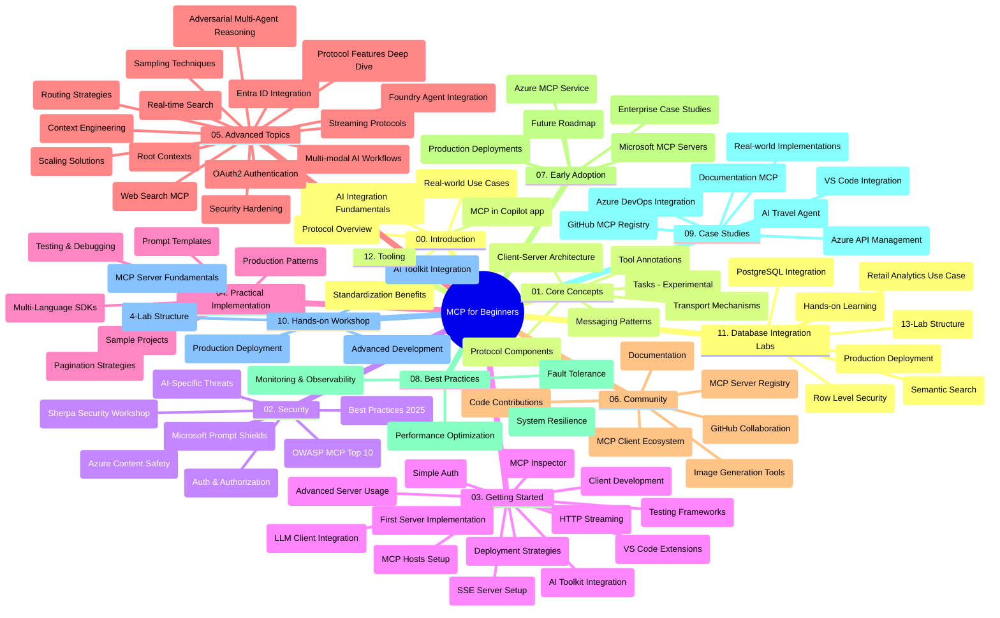

# פרוטוקול מודל ההקשר (MCP) למתחילים - מדריך לימוד

מדריך הלימוד הזה מספק סקירה של מבנה התיקייה והתוכן עבור תוכנית הלימוד "פרוטוקול מודל ההקשר (MCP) למתחילים". השתמש במדריך זה כדי לנווט בתיקייה ביעילות ולהפיק את המיטב מהמשאבים הזמינים.

## סקירת התיקייה

פרוטוקול מודל ההקשר (MCP) הוא מסגרת מוסדרת לאינטראקציות בין מודלי בינה מלאכותית ליישומי לקוח. פרוטוקול MCP, שנוצר תחילה על ידי Anthropic, מנוהל כעת על ידי קהילת MCP הרחבה דרך הארגון הרשמי ב-GitHub. תיקייה זו מספקת תוכנית לימוד מקיפה עם דוגמאות קוד מעשיות ב-C#, Java, JavaScript, Python, ו-TypeScript, המיועדת למפתחי בינה מלאכותית, מהנדסי מערכות ומהנדסי תוכנה.

## מפת תוכנית לימוד ויזואלית

## מבנה התיקייה

התיקייה מאורגנת לשנים עשר חלקים עיקריים, שכל אחד מתמקד בהיבטים שונים של MCP:

1. **הקדמה (00-Introduction/)**
   - סקירה כללית של פרוטוקול מודל ההקשר
   - חשיבות הסטנדרטיזציה בצנרת הבינה המלאכותית
   - מקרים מעשיים ויתרונות

2. **מושגים מרכזיים (01-CoreConcepts/)**
   - ארכיטקטורת לקוח-שרת
   - רכיבי הפרוטוקול המרכזיים
   - דפוסי הודעות ב-MCP
   - המפרט הנוכחי: [מה השתנה ב-MCP: מפרט 2026-07-28](./01-CoreConcepts/mcp-2026-07-28.md) — הליבה של פרוטוקול ללא מצב, מסגרת ההרחבות, ופיטורים של שורשים/דגימה/רישום

3. **אבטחה (02-Security/)**
   - איומי אבטחה במערכות מבוססות MCP
   - שיטות מיטביות לאבטחת יישומים
   - אסטרטגיות אימות והרשאה
   - סדנת התנסות ב-[דוגמת הרשאה CIMD ו-DCR](./02-Security/samples/cimd-dcr-auth/README.md)
   - **תיעוד אבטחה מקיף**:
     - שיטות אבטחה מיטביות ב-MCP
     - מדריך יישום Azure Content Safety
     - בקרים וטכניקות אבטחה ב-MCP
     - הפניה מהירה לשיטות מיטביות ב-MCP
   - **נושאי אבטחה מרכזיים**:
     - הזרקת פרומפט והתקפות הרעלת כלי
     - חטיפת מפגש ובעיות תפקיד מבלבל
     - פרצות העברת טוקן
     - הרשאות מופרזות ושליטת גישה
     - אבטחת שרשרת אספקה לרכיבי בינה מלאכותית
     - אינטגרציה עם Microsoft Prompt Shields

4. **התחלת עבודה (03-GettingStarted/)**
   - הגדרת סביבה וקונפיגורציה
   - יצירת שרתי ומחשבי MCP בסיסיים
   - אינטגרציה עם יישומים קיימים
   - כולל חלקים עבור:
     - מימוש שרת ראשון
     - פיתוח לקוח
     - אינטגרציה עם לקוח LLM
     - אינטגרציה עם VS Code
     - שרת אירועים שנשלחים (SSE)
     - שימוש מתקדם בשרת
     - זרימת HTTP
     - אינטגרציה עם נגן כלים לבינה מלאכותית
     - אסטרטגיות בדיקה
     - הנחיות לפריסה

5. **יישום מעשי (04-PracticalImplementation/)**
   - שימוש בערכות SDK בשפות תכנות שונות
   - טכניקות דיבאג, בדיקות ואימות
   - יצירת תבניות פרומפט ותהליכי עבודה לשימוש חוזר
   - פרויקטים לדוגמה עם דוגמאות מימוש

6. **נושאים מתקדמים (05-AdvancedTopics/)**
   - טכניקות הנדסת הקשר
   - אינטגרציה עם סוכן Foundry
   - תזרימי עבודה רב-מודאליים של בינה מלאכותית
   - הדגמות אימות OAuth2
   - יכולות חיפוש בזמן אמת
   - שידור בזמן אמת
   - מימוש הקשרים ראשיים
   - אסטרטגיות ניתוב
   - טכניקות דגימה
   - גישות להרחבה
   - שיקולי אבטחה
   - אינטגרציית אבטחה עם Entra ID
   - אינטגרציה עם חיפוש באינטרנט
   - היסק רב-סוכני עוייני (דפוסי ויכוח)

7. **תרומות מהקהילה (06-CommunityContributions/)**
   - כיצד לתרום קוד ותיעוד
   - שיתוף פעולה דרך GitHub
   - שיפורים ומשוב מונחה קהילה
   - שימוש בלקוחות MCP שונים (Claude Desktop, Cline, VSCode)
   - עבודה עם שרתים פופולריים של MCP כולל יצירת תמונות

8. **לקחים מאימוץ מוקדם (07-LessonsfromEarlyAdoption/)**
   - מימושים וסיפורי הצלחה מעשיים
   - בנייה ופריסת פתרונות מבוססי MCP
   - מגמות ומפת דרכים עתידית
   - **מדריך לשרתי MCP של מיקרוסופט**: מדריך מקיף לעשרה שרתי MCP מוכנים לייצור של מיקרוסופט כולל:
     - שרת MCP של Microsoft Learn Docs
     - שרת MCP של Azure (15+ מחברים מיוחדים)
     - שרת MCP של GitHub
     - שרת MCP של Azure DevOps
     - שרת MCP של MarkItDown
     - שרת MCP של SQL Server
     - שרת MCP של Playwright
     - שרת MCP של Dev Box
     - שרת MCP של Microsoft Foundry
     - שרת MCP של Microsoft 365 Agents Toolkit

9. **שיטות מיטביות (08-BestPractices/)**
   - כוונון ביצועים ואופטימיזציה
   - תכנון מערכות MCP עמידות לתקלות
   - אסטרטגיות בדיקה וחוסן

10. **מחקרי מקרה (09-CaseStudy/)**
    - **שבעה מחקרי מקרה מקיפים** המדגימים את מגווני השימוש ב-MCP בתרחישים שונים:
    - **סוכני נסיעות מבוססי Azure AI**: ארכיטקטורת סוכנים מרובה עם Azure OpenAI וחיפוש בינה מלאכותית
    - **אינטגרציית Azure DevOps**: אוטומציה של תהליכי עבודה עם עדכוני נתוני YouTube
    - **שליפת מסמכים בזמן אמת**: לקוח קונסולת Python עם זרימת HTTP
    - **מחולל תוכנית לימוד אינטראקטיבי**: אפליקציית Chainlit עם שיחת בינה מלאכותית
    - **תיעוד בתוך עורכנים**: אינטגרציה עם VS Code ותהליכי עבודה של GitHub Copilot
    - **ניהול API של Azure**: אינטגרציית API ארגונית עם יצירת שרת MCP
    - **רישום MCP של GitHub**: פלטפורמת פיתוח אקוסיסטם ואינטגרציה סוכנית
    - דוגמאות מימוש הכוללות אינטגרציית ארגונים, פרודוקטיביות מפתח ופיתוח מערכת אקוסיסטם

11. **סדנת התנסות מעשית (10-StreamliningAIWorkflowsBuildingAnMCPServerWithAIToolkit/)**
    - סדנה מקיפה המשלבת MCP עם AI Toolkit
    - בניית יישומים חכמים המחברים בין מודלי בינה מלאכותית לכלים מהעולם האמיתי
    - מודולים מעשיים המכסים יסודות, פיתוח שרת מותאם ואסטרטגיות פריסה לייצור
    - **מבנה המעבדה**:
      - מעבדה 1: יסודות שרת MCP
      - מעבדה 2: פיתוח שרת MCP מתקדם
      - מעבדה 3: אינטגרציה עם AI Toolkit
      - מעבדה 4: פריסה והרחבה בייצור
    - גישת לימוד מבוססת מעבדות עם הוראות שלב-אחר-שלב

12. **מעבדות אינטגרציית מסד נתונים לשרת MCP (11-MCPServerHandsOnLabs/)**
    - **מסלול למידה מקיף של 13 מעבדות** לבניית שרתי MCP מוכנים לייצור עם אינטגרציית PostgreSQL
    - **מימוש אנליטיקה קמעונאית מעשי** באמצעות מקרה השימוש Zava Retail
    - **דפוסי ארגוני** הכוללים אבטחת שורות (RLS), חיפוש סמנטי, וגישה מרובת דיירים לנתונים
    - **מבנה המעבדה המלא**:
      - **מעבדות 00-03: יסודות** - הקדמה, ארכיטקטורה, אבטחה, הגדרת סביבה
      - **מעבדות 04-06: בניית שרת MCP** - עיצוב מסד נתונים, מימוש שרת MCP, פיתוח כלים

      - **מעבדות 07-09: תכונות מתקדמות** - חיפוש סמנטי, בדיקות ואבחון, אינטגרציה עם VS Code
      - **מעבדות 10-12: הפקה ושיטות עבודה מומלצות** - פריסה, ניטור, אופטימיזציה
    - **טכנולוגיות מכוסות**: מסגרת FastMCP, PostgreSQL, Azure OpenAI, Azure Container Apps, Application Insights
    - **תוצאות למידה**: שרתי MCP מוכנים להפקה, תבניות אינטגרציה עם מסדי נתונים, ניתוחים מבוססי AI, אבטחת ארגונית

13. **כלים (12-tooling/)**
    - למדו כיצד להשתמש ב-MCP באפליקציית Copilot וכלים אחרים

## משאבים נוספים

המאגר כולל משאבים תומכים:

- **תיקיית תמונות**: מכילה דיאגרמות ואיורים המשמשים לאורך כל תוכנית הלימודים
- **תרגומים**: תמיכה ברב-שפות עם תרגומים אוטומטיים של התיעוד
- **משאבי MCP רשמיים**:
  - [תיעוד MCP](https://modelcontextprotocol.io/)
  - [מפרט MCP](https://modelcontextprotocol.io/specification/2026-07-28/)
  - [מאגר GitHub של MCP](https://github.com/modelcontextprotocol)

## כיצד להשתמש במאגר זה

1. **למידה סדירה**: עקבו אחר הפרקים בסדר (00 עד 11) לחוויית למידה מסודרת.
2. **מיקוד בשפת תכנות ספציפית**: אם אתם מעוניינים בשפת תכנות מסוימת, חפשו בתיקיות הדוגמאות למימושים בשפה המועדפת עליכם.
3. **מימוש מעשי**: התחילו עם הסעיף "התחלה" כדי להגדיר את הסביבה וליצור את שרת ולקוח ה-MCP הראשונים שלכם.
4. **חקירה מתקדמת**: לאחר שתשלטו ביסודות, העמיקו בנושאים המתקדמים להרחבת הידע.
5. **השתלבות בקהילה**: הצטרפו לקהילת MCP דרך שיחות GitHub וערוצי Discord כדי להתחבר למומחים ומפתחים נוספים.

## לקוחות וכלי MCP

תוכנית הלימודים כוללת מגוון לקוחות וכלי MCP:

1. **לקוחות רשמיים**:
   - Visual Studio Code 
   - MCP ב-Visual Studio Code
   - Claude Desktop
   - Claude ב-VSCode 
   - Claude API

2. **לקוחות מהקהילה**:
   - Cline (בטרמינל)
   - Cursor (עורך קוד)
   - ChatMCP
   - Windsurf

3. **כלי ניהול MCP**:
   - MCP CLI
   - מנהל MCP
   - MCP Linker
   - MCP Router

## שרתי MCP פופולריים

המאגר מציג שרתי MCP שונים, כולל:

1. **שרתי MCP רשמיים של מיקרוסופט**:
   - שרת MCP של Microsoft Learn Docs
   - שרת Azure MCP (יותר מ-15 מחברים ייעודיים)
   - שרת GitHub MCP
   - שרת Azure DevOps MCP
   - שרת MarkItDown MCP
   - שרת SQL Server MCP
   - שרת Playwright MCP
   - שרת Dev Box MCP
   - שרת Microsoft Foundry MCP
   - שרת Microsoft 365 Agents Toolkit MCP

2. **שרתי הפניה רשמיים**:
   - מערכת קבצים
   - Fetch
   - Memory
   - חשיבה סדרתית

3. **יצירת תמונות**:
   - Azure OpenAI DALL-E 3
   - Stable Diffusion WebUI
   - Replicate

4. **כלי פיתוח**:
   - Git MCP
   - בקרת טרמינל
   - עוזר קוד

5. **שרתי ייעוד מיוחדים**:
   - Salesforce
   - Microsoft Teams
   - Jira & Confluence

## תרומות

מאגר זה מקבל משימות קהילה בברכה. עיין בסעיף תרומות הקהילה לקבלת הנחיות כיצד לתרום בצורה יעילה למערכת האקולוגית של MCP.

----

*מדריך הלימוד הזה עודכן לאחרונה בתאריך 9 בספטמבר, 2026. הוא משקף את מפרט MCP
`2026-07-28`, תיקון הפרוטוקול הנוכחי. כמה דוגמאות מעשיות נשארות מפורש בגרסה `2025-11-25` בעוד ש- SDK וכלים שלהם
מאמצים את APIs של הפרוטוקול ללא מצב.*

---

<!-- CO-OP TRANSLATOR DISCLAIMER START -->
**כתב ויתור**:
מסמך זה תורגם באמצעות שירות תרגום אוטומטי [Co-op Translator](https://github.com/Azure/co-op-translator). למרות שאנו שואפים לדיוק, יש לקחת בחשבון שתרגומים אוטומטיים עלולים להכיל שגיאות או אי-דיוקים. יש להחשיב את המסמך המקורי בשפתו הטבעית כמקור הסמכות. למידע קריטי מומלץ להשתמש בתרגום מקצועי על ידי מתרגם אדם. אנו לא אחראים לכל אי-הבנה או פירוש שגוי הנובע מהשימוש בתרגום זה.
<!-- CO-OP TRANSLATOR DISCLAIMER END -->