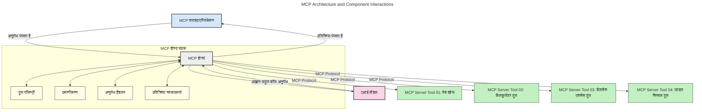
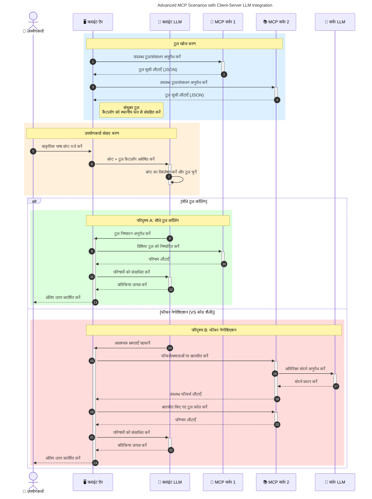

# मॉडल संदर्भ प्रोटोकॉल (MCP) का परिचय: स्केलेबल AI एप्लिकेशन के लिए इसका महत्व

[](https://youtu.be/agBbdiOPLQA)

_(इस पाठ का वीडियो देखने के लिए ऊपर की छवि पर क्लिक करें)_

जनरेटिव AI एप्लिकेशन एक बड़ा कदम हैं क्योंकि वे अक्सर उपयोगकर्ता को प्राकृतिक भाषा संकेतों का उपयोग करके एप्लिकेशन के साथ बातचीत करने देते हैं। हालांकि, जैसे-जैसे ऐसे एप्लिकेशन में अधिक समय और संसाधन निवेशित होते हैं, आप यह सुनिश्चित करना चाहते हैं कि आप कार्यक्षमताओं और संसाधनों को इस तरह से आसानी से एकीकृत कर सकें कि इसे बढ़ाना आसान हो, आपका एप्लिकेशन एक से अधिक मॉडल के उपयोग को संभाल सके, और विभिन्न मॉडल की जटिलताओं को संभाल सके। संक्षेप में, जेन AI एप्लिकेशन बनाना शुरू में आसान होता है, लेकिन जैसे-जैसे वे बढ़ते हैं और अधिक जटिल होते हैं, आपको एक आर्किटेक्चर परिभाषित करनी शुरू करनी होगी और संभवतः एक मानक पर निर्भर रहना होगा ताकि आपके एप्लिकेशन सुसंगत तरीके से बनाए जाएं। यहीं MCP काम आता है जो चीजों को व्यवस्थित करता है और एक मानक प्रदान करता है।

---

## **🔍 मॉडल संदर्भ प्रोटोकॉल (MCP) क्या है?**

**मॉडल संदर्भ प्रोटोकॉल (MCP)** एक **खुला, मानकीकृत इंटरफ़ेस** है जो बड़े भाषा मॉडल (LLMs) को बाहरी उपकरणों, API, और डेटा स्रोतों के साथ सहजता से संवाद करने की अनुमति देता है। यह AI मॉडल की क्षमताओं को उनके प्रशिक्षण डेटा से परे बढ़ाने के लिए एक सुसंगत आर्किटेक्चर प्रदान करता है, जिससे स्मार्ट, स्केलेबल, और अधिक प्रतिक्रियाशील AI सिस्टम बनते हैं।

---

## **🎯 AI में मानकीकरण क्यों महत्वपूर्ण है**

जैसे-जैसे जनरेटिव AI एप्लिकेशन अधिक जटिल होते जाते हैं, यह आवश्यक हो जाता है कि ऐसे मानकों को अपनाया जाए जो **स्केलेबिलिटी, विस्तारक्षमता, रखरखाव की सुविधा,** और **विक्रेता लॉक-इन से बचाव** सुनिश्चित करें। MCP इन आवश्यकताओं को निम्नलिखित तरीकों से पूरा करता है:

- मॉडल-उपकरण एकीकरण को एकीकृत करना
- कमजोर, एक बार के लिए विशेष समाधान को कम करना
- विभिन्न विक्रेताओं के कई मॉडल को एक इकोसिस्टम में सह-अस्तित्व देना

**नोट:** जबकि MCP खुद को एक खुला मानक बताता है, MCP को IEEE, IETF, W3C, ISO या किसी अन्य मानकीकरण निकाय के माध्यम से मानकीकृत करने की कोई योजना नहीं है।

---

## **📚 सीखने के उद्देश्य**

इस लेख के अंत तक, आप सक्षम होंगे:

- **मॉडल संदर्भ प्रोटोकॉल (MCP)** और इसके उपयोग मामलों को परिभाषित करना
- यह समझना कि MCP कैसे मॉडल-से-उपकरण संचार को मानकीकृत करता है
- MCP आर्किटेक्चर के मुख्य घटकों की पहचान करना
- व्यावसायिक और विकास संदर्भों में MCP के वास्तविक-विश्व अनुप्रयोगों का अन्वेषण करना

---

## **💡 मॉडल संदर्भ प्रोटोकॉल (MCP) क्यों एक गेम-चेंजर है**

### **🔗 MCP AI इंटरैक्शन में विखंडन को हल करता है**

MCP से पहले, मॉडल को उपकरणों के साथ एकीकृत करने के लिए आवश्यक था:

- उपकरण-मॉडल जोड़ी के लिए कस्टम कोड
- प्रत्येक विक्रेता के लिए गैर-मानकीकृत API
- अपडेट के कारण बार-बार टूट जाना
- अधिक उपकरणों के साथ खराब स्केलेबिलिटी

### **✅ MCP मानकीकरण के लाभ**

| **लाभ**                  | **विवरण**                                                                    |
|--------------------------|--------------------------------------------------------------------------------|
| इंटरऑपरेबिलिटी           | LLMs विभिन्न विक्रेताओं के उपकरणों के साथ सहजता से काम करता है                |
| सुसंगतता                  | प्लेटफॉर्म और उपकरणों के बीच एकरूप व्यवहार                                   |
| पुन: उपयोगयोग्यता          | एक बार निर्मित उपकरणों को परियोजनाओं और प्रणालियों में उपयोग किया जा सकता है |
| तेजी से विकास              | मानकीकृत, प्लग-एंड-प्ले इंटरफेस का उपयोग करके विकास समय को कम करना          |

---

## **🧱 उच्च-स्तरीय MCP आर्किटेक्चर अवलोकन**

MCP एक **क्लाइंट-सेवर मॉडल** का पालन करता है, जहां:

- **MCP होस्ट** AI मॉडल चलाते हैं
- **MCP क्लाइंट्स** अनुरोध शुरू करते हैं
- **MCP सर्वर** संदर्भ, उपकरण, और क्षमताएं प्रदान करते हैं

### **मुख्य घटक:**

- **संसाधन** – मॉडल के लिए स्थिर या गतिशील डेटा  
- **प्रॉम्प्ट्स** – निर्देशित सृजन के लिए पूर्वनिर्धारित कार्यप्रवाह  
- **उपकरण** – खोज, गणना जैसे निष्पादन योग्य कार्य  
- **नमूना संकलन** – पुनरावर्ती इंटरैक्शन के माध्यम से एजेंटिक व्यवहार (MCP `2026-07-28` में अप्रचलित; नए कार्यान्वयन सीधे LLM प्रदाता के साथ एकीकृत होने चाहिए)
    
    
- **प्रेरणा** – उपयोगकर्ता इनपुट के लिए सर्वर-प्रेरित अनुरोध
- **रूट्स** – सर्वर से संबंधित सूचना फ़ाइल सिस्टम स्थान (MCP `2026-07-28` में अप्रचलित; उपकरण पैरामीटर, संसाधन URI, या सर्वर कॉन्फ़िगरेशन पसंद करें)
    
    

### **प्रोटोकॉल आर्किटेक्चर:**

MCP दो-परत आर्किटेक्चर का उपयोग करता है:
- **डेटा परत**: JSON-RPC 2.0 संदेश, प्रति-आवेदन मेटाडाटा, खोज और प्रोटोकॉल प्रिमिटिव
 
- **ट्रांसपोर्ट परत**: स्थानीय उपप्रक्रियाओं के लिए stdio और दूरस्थ सर्वरों के लिए Streamable HTTP। Streamable HTTP स्ट्रीम की गई प्रतिक्रियाओं के लिए SSE फ्रेमिंग का उपयोग कर सकता है, लेकिन पुराना HTTP+SSE ट्रांसपोर्ट अप्रचलित है।
    
    

---

## MCP सर्वर कैसे काम करते हैं

MCP सर्वर निम्नलिखित तरीके से संचालित होते हैं:

- **अनुरोध प्रवाह**:
    1. अनुरोध एक अंतिम उपयोगकर्ता या उनके पक्ष में कार्यरत सॉफ़्टवेयर द्वारा शुरू किया जाता है।
    2. **MCP क्लाइंट** अनुरोध को एक **MCP होस्ट** को भेजता है, जो AI मॉडल रनटाइम का प्रबंधन करता है।
    3. **AI मॉडल** उपयोगकर्ता प्रॉम्प्ट प्राप्त करता है और एक या अधिक उपकरण कॉल के माध्यम से बाहरी उपकरणों या डेटा तक पहुंच का अनुरोध कर सकता है।
    4. **MCP होस्ट**, सीधे मॉडल के बजाय, उपयुक्त **MCP सर्वर(s)** के साथ मानकीकृत प्रोटोकॉल का उपयोग करके संवाद करता है।
- **MCP होस्ट कार्यक्षमता**:
    - **उपकरण रजिस्ट्री**: उपलब्ध उपकरणों और उनकी क्षमताओं की सूची रखता है।
    - **प्रमाणीकरण**: उपकरण पहुंच के अनुमतियों को सत्यापित करता है।
    - **अनुरोध हैंडलर**: मॉडल से आने वाले उपकरण अनुरोधों को संसाधित करता है।
    - **प्रतिक्रिया फॉर्मेटर**: उपकरण परिणामों को मॉडल समझ सके ऐसे स्वरूप में बनाता है।
- **MCP सर्वर निष्पादन**:
    - **MCP होस्ट** उपकरण कॉल को एक या अधिक **MCP सर्वर** को भेजता है, जो विशेष कार्य (जैसे खोज, गणना, डेटाबेस प्रश्न) करते हैं।
    - **MCP सर्वर** अपने संबंधित कार्य करते हैं और परिणामों को सुसंगत स्वरूप में **MCP होस्ट** को लौटाते हैं।
    - **MCP होस्ट** इन परिणामों को स्वरूपित करके **AI मॉडल** को भेजता है।
- **प्रतिक्रिया पूर्णता**:
    - **AI मॉडल** उपकरण आउटपुट को अंतिम प्रतिक्रिया में सम्मिलित करता है।
    - **MCP होस्ट** यह प्रतिक्रिया वापस **MCP क्लाइंट** को भेजता है, जो इसे अंतिम उपयोगकर्ता या कॉलिंग सॉफ़्टवेयर को प्रदान करता है।
    



## 👨‍💻 MCP सर्वर कैसे बनाएं (उदाहरणों के साथ)

MCP सर्वर आपको डेटा और कार्यक्षमता प्रदान करके LLM क्षमताओं का विस्तार करने की अनुमति देते हैं। 

इसे आज़माने के लिए तैयार हैं? यहाँ विभिन्न भाषाओं/स्टैक में सरल MCP सर्वर बनाने के उदाहरणों सहित SDKs हैं:

- **Python SDK**: https://github.com/modelcontextprotocol/python-sdk

- **TypeScript SDK**: https://github.com/modelcontextprotocol/typescript-sdk

- **Java SDK**: https://github.com/modelcontextprotocol/java-sdk


- **C#/.NET SDK**: https://github.com/modelcontextprotocol/csharp-sdk


## 🌍 MCP के लिए वास्तविक विश्व उपयोग के मामले

MCP AI क्षमताओं का विस्तार करके विभिन्न अनुप्रयोगों को सक्षम बनाता है:

| **अनुप्रयोग**              | **विवरण**                                                                |
|------------------------------|--------------------------------------------------------------------------------|
| एंटरप्राइज डेटा इंटीग्रेशन  | LLMs को डेटाबेस, CRM, या आंतरिक टूल से जोड़ें                             |
| एजेंटिक AI सिस्टम           | उपकरण एक्सेस और निर्णय-निर्माण वर्कफ़्लोज़ के साथ स्वायत्त एजेंट सक्षम करें        |
| मल्टी-मॉडल एप्लिकेशन     | एक एकीकृत AI ऐप के भीतर टेक्स्ट, इमेज, और ऑडियो टूल्स को मिलाएं            |
| रियल-टाइम डेटा इंटीग्रेशन   | अधिक सटीक, वर्तमान आउटपुट के लिए AI इंटरैक्शन में लाइव डेटा लाएं        |


### 🧠 MCP = AI इंटरैक्शन के लिए सार्वभौमिक मानक

मॉडल कॉन्टेक्स्ट प्रोटोकॉल (MCP) AI इंटरैक्शन के लिए एक सार्वभौमिक मानक के रूप में कार्य करता है, ठीक उसी तरह जैसे USB-C ने उपकरणों के लिए भौतिक कनेक्शनों को मानकीकृत किया। AI की दुनिया में, MCP एक संगत इंटरफ़ेस प्रदान करता है, जिससे मॉडल (क्लाइंट) बाहरी टूल और डेटा प्रदाताओं (सर्वर) के साथ सहज रूप से एकीकृत हो सकते हैं। इससे प्रत्येक API या डेटा स्रोत के लिए विभिन्न, कस्टम प्रोटोकॉल की आवश्यकता समाप्त हो जाती है।

MCP के तहत, एक MCP-संगत टूल (जिसे MCP सर्वर कहा जाता है) एक एकीकृत मानक का पालन करता है। ये सर्वर उन टूल्स या क्रियाओं को सूचीबद्ध कर सकते हैं जो वे प्रदान करते हैं और AI एजेंट द्वारा अनुरोध किए जाने पर उन क्रियाओं को निष्पादित कर सकते हैं। MCP समर्थित AI एजेंट प्लेटफ़ॉर्म सर्वरों से उपलब्ध टूल्स को खोजने और इस मानक प्रोटोकॉल के माध्यम से उन्हें कॉल करने में सक्षम हैं।

### 💡 ज्ञान तक पहुँच को सुविधाजनक बनाता है

टूल्स प्रदान करने के अलावा, MCP ज्ञान तक पहुँच को भी सुविधाजनक बनाता है। यह अनुप्रयोगों को बड़े भाषा मॉडल (LLMs) को संदर्भ प्रदान करने में सक्षम बनाता है, उन्हें विभिन्न डेटा स्रोतों से जोड़कर। उदाहरण के लिए, एक MCP सर्वर कंपनी की दस्तावेज़ भंडार का प्रतिनिधित्व कर सकता है, जिससे एजेंट मांग पर प्रासंगिक जानकारी प्राप्त कर सकते हैं। एक अन्य सर्वर विशिष्ट क्रियाएं जैसे ईमेल भेजना या रिकॉर्ड अपडेट करना संभाल सकता है। एजेंट के दृष्टिकोण से, ये बस टूल्स हैं जिनका वह उपयोग कर सकता है—कुछ टूल डेटा (ज्ञान संदर्भ) लौटाते हैं, जबकि अन्य क्रियाएं करते हैं। MCP दोनों को कुशलतापूर्वक प्रबंधित करता है।

एक एजेंट जो MCP सर्वर से जुड़ता है, वह सर्वर की उपलब्ध क्षमताओं और सुलभ डेटा को एक मानक प्रारूप के माध्यम से स्वचालित रूप से सीखता है। यह मानकीकरण टूल्स की गतिशील उपलब्धता को सक्षम बनाता है। उदाहरण के लिए, एक नए MCP सर्वर को एजेंट की प्रणाली में जोड़ने से उसके कार्य तुरंत उपयोग में आ जाते हैं, बिना एजेंट के निर्देशों को और अनुकूलित किए।

यह सुव्यवस्थित एकीकरण निम्नलिखित आरेख में दर्शाए प्रवाह के अनुसार मेल खाता है, जहाँ सर्वर टूल्स और ज्ञान दोनों प्रदान करते हैं, जिससे प्रणालियों के बीच निर्बाध सहयोग सुनिश्चित होता है।

### 👉 उदाहरण: स्केलेबल एजेंट समाधान

```mermaid
---
title: Scalable Agent Solution with MCP
description: A diagram illustrating how a user interacts with an LLM that connects to multiple MCP servers, with each server providing both knowledge and tools, creating a scalable AI system architecture
---
graph TD
    User -->|प्रॉम्प्ट| LLM
    LLM -->|प्रतिक्रिया| User
    LLM -->|MCP| ServerA
    LLM -->|MCP| ServerB
    ServerA -->|यूनिवर्सल कनेक्टर| ServerB
    ServerA --> KnowledgeA
    ServerA --> ToolsA
    ServerB --> KnowledgeB
    ServerB --> ToolsB

    subgraph सर्वर A
        KnowledgeA[ज्ञान]
        ToolsA[उपकरण]
    end

    subgraph सर्वर B
        KnowledgeB[ज्ञान]
        ToolsB[उपकरण]
    end
```
यूनिवर्सल कनेक्टर MCP सर्वरों को एक दूसरे के साथ संवाद करने और क्षमताएं साझा करने में सक्षम बनाता है, जिससे ServerA ServerB को कार्य सौंप सकता है या उसके टूल्स और ज्ञान तक पहुँच सकता है। यह सर्वरों के बीच टूल्स और डेटा का संघ बनाता है, जो स्केलेबल और मॉड्यूलर एजेंट आर्किटेक्चर का समर्थन करता है। चूंकि MCP टूल एक्सपोज़र को मानकीकृत करता है, एजेंट बिना हार्डकोडेड इंटीग्रेशन के सर्वरों के बीच गतिशील रूप से टूल खोज सकते हैं और अनुरोध मार्गित कर सकते हैं।


टूल और ज्ञान संघ: टूल्स और डेटा को सर्वरों में एक्सेस किया जा सकता है, जिससे अधिक स्केलेबल और मॉड्यूलर एजेंटिक आर्किटेक्चर संभव होता है।

### 🔄 क्लाइंट-साइड LLM इंटीग्रेशन के साथ उन्नत MCP परिदृश्य

मूल MCP आर्किटेक्चर के परे, ऐसे उन्नत परिदृश्य हैं जहाँ दोनों क्लाइंट और सर्वर में LLM होते हैं, जिससे अधिक परिष्कृत इंटरैक्शन संभव होते हैं। निम्नलिखित आरेख में, **क्लाइंट ऐप** एक IDE हो सकता है जिसमें LLM द्वारा उपयोग किए जाने वाले कई MCP टूल उपलब्ध हैं:



## 🔐 MCP के व्यावहारिक लाभ

MCP का उपयोग करने के व्यावहारिक लाभ यहाँ दिए गए हैं:

- **ताज़ा जानकारी**: मॉडल प्रशिक्षण डेटा से परे अद्यतित जानकारी तक पहुँच सकते हैं
- **क्षमता विस्तार**: मॉडल उन कार्यों के लिए विशिष्ट टूल्स का लाभ उठा सकते हैं जिनके लिए वे प्रशिक्षित नहीं थे
- **घाटों में कमी**: बाहरी डेटा स्रोत तथ्यात्मक आधार प्रदान करते हैं
- **गोपनीयता**: संवेदनशील डेटा सुरक्षित वातावरण में रह सकता है बजाय प्रॉम्प्ट में एम्बेड होने के

## 📌 मुख्य अंतर्दृष्टि

MCP का उपयोग करने के लिए मुख्य अंतर्दृष्टि निम्नलिखित हैं:

- **MCP** AI मॉडल्स के टूल्स और डेटा के साथ इंटरैक्शन को मानकीकृत करता है
- **पारगम्याता, सुसंगतता, और इंटरऑपरेबिलिटी** को बढ़ावा देता है
- MCP विकास समय को कम करने, विश्वसनीयता में सुधार करने, और मॉडल क्षमताओं का विस्तार करने में मदद करता है
- क्लाइंट-सर्वर आर्किटेक्चर **लचीले, विस्तार योग्य AI अनुप्रयोग सक्षम बनाता है**

## 🧠 अभ्यास

उस AI एप्लिकेशन के बारे में सोचें जिसे आप बनाना चाहते हैं।

- कौन से **बाहरी टूल्स या डेटा** इसकी क्षमताओं को बढ़ा सकते हैं?
- MCP एकीकरण को कैसे **सरल और अधिक विश्वसनीय** बना सकता है?

## अतिरिक्त संसाधन

- [MCP GitHub Repository](https://github.com/modelcontextprotocol)


## आगे क्या

अगला: [Chapter 1: Core Concepts](../01-CoreConcepts/README.md)

---

<!-- CO-OP TRANSLATOR DISCLAIMER START -->
**अस्वीकरण**:
इस दस्तावेज़ का अनुवाद AI अनुवाद सेवा [Co-op Translator](https://github.com/Azure/co-op-translator) का उपयोग करके किया गया है। जबकि हम सटीकता के लिए प्रयास करते हैं, कृपया ध्यान दें कि स्वचालित अनुवादों में त्रुटियाँ या अशुद्धियाँ हो सकती हैं। मूल दस्तावेज़ अपनी मूल भाषा में ही प्रामाणिक स्रोत माना जाना चाहिए। महत्वपूर्ण जानकारी के लिए, पेशेवर मानव अनुवाद की सिफारिश की जाती है। इस अनुवाद के उपयोग से उत्पन्न किसी भी गलतफहमी या गलत व्याख्या के लिए हम उत्तरदायी नहीं हैं।
<!-- CO-OP TRANSLATOR DISCLAIMER END -->