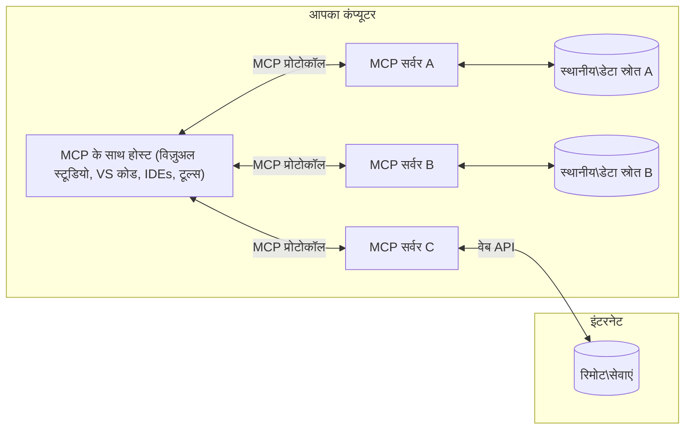

# MCP कोर अवधारणाएँ: AI एकीकरण के लिए मॉडल संदर्भ प्रोटोकॉल में महारत हासिल करना

[](https://youtu.be/earDzWGtE84)

_(इस पाठ का वीडियो देखने के लिए ऊपर की छवि पर क्लिक करें)_

[Model Context Protocol (MCP)](https://github.com/modelcontextprotocol) एक शक्तिशाली, मानकीकृत फ्रेमवर्क है जो बड़े भाषा मॉडल (LLMs) और बाहरी उपकरणों, अनुप्रयोगों, और डेटा स्रोतों के बीच संचार को अनुकूलित करता है।  
यह मार्गदर्शिका आपको MCP की कोर अवधारणाओं से परिचित कराएगी। आप इसके क्लाइंट-सर्वर आर्किटेक्चर, आवश्यक घटकों, संचार तंत्र, और कार्यान्वयन सर्वोत्तम प्रथाओं के बारे में जानेंगे।

- **स्पष्ट उपयोगकर्ता सहमति**: सभी डेटा एक्सेस और संचालन के लिए निष्पादन से पहले स्पष्ट उपयोगकर्ता अनुमोदन आवश्यक है। उपयोगकर्ताओं को स्पष्ट रूप से समझना चाहिए कि कौन सा डेटा एक्सेस किया जाएगा और कौन से कार्य किए जाएंगे, साथ ही अनुमतियों और प्राधिकरणों पर सूक्ष्म नियंत्रण होना चाहिए।

- **डेटा गोपनीयता संरक्षण**: उपयोगकर्ता डेटा केवल स्पष्ट सहमति के साथ ही प्रकट किया जाता है और पूरे इंटरैक्शन जीवनचक्र में मजबूत एक्सेस नियंत्रण द्वारा संरक्षित होना चाहिए। कार्यान्वयन को अनधिकृत डेटा ट्रांसमिशन को रोकना चाहिए और कड़े गोपनीयता सीमाएं बनाए रखनी चाहिए।

- **उपकरण निष्पादन सुरक्षा**: प्रत्येक उपकरण कॉल के लिए स्पष्ट उपयोगकर्ता सहमति आवश्यक है, जिसमें उपकरण की कार्यक्षमता, पैरामीटर, और संभावित प्रभाव की स्पष्ट समझ हो। मजबूत सुरक्षा सीमाएं अनचाहे, असुरक्षित, या दुर्भावनापूर्ण उपकरण निष्पादन को रोकनी चाहिए।

- **ट्रांसपोर्ट लेयर सुरक्षा**: सभी संचार चैनलों को उपयुक्त एन्क्रिप्शन और प्रमाणीकरण तंत्र का उपयोग करना चाहिए। रिमोट कनेक्शन को सुरक्षित ट्रांसपोर्ट प्रोटोकॉल और उचित क्रेडेंशियल प्रबंधन लागू करना चाहिए।

#### कार्यान्वयन दिशानिर्देश:

- **अनुमति प्रबंधन**: सूक्ष्म अनुमतियाँ लागू करें जो उपयोगकर्ताओं को नियंत्रित करने दें कि कौन से सर्वर, उपकरण, और संसाधन सुलभ हैं  
- **प्रमाणीकरण और प्राधिकरण**: सुरक्षित प्रमाणीकरण विधियों (OAuth, API कुंजी) का उपयोग करें, उचित टोकन प्रबंधन और समाप्ति के साथ  
- **इनपुट सत्यापन**: सभी पैरामीटर और डेटा इनपुट को परिभाषित स्कीमाओं के अनुसार सत्यापित करें ताकि इंजेक्शन हमलों को रोका जा सके  
- **ऑडिट लॉगिंग**: सुरक्षा निगरानी और अनुपालन के लिए सभी संचालन के व्यापक लॉग बनाए रखें

## अवलोकन

यह पाठ Model Context Protocol (MCP) पारिस्थितिकी तंत्र की मूलभूत वास्तुकला और घटकों का अन्वेषण करता है। आप MCP इंटरैक्शन को संचालित करने वाले क्लाइंट-सर्वर आर्किटेक्चर, प्रमुख घटकों, और संचार तंत्रों के बारे में जानेंगे।

## मुख्य सीखने के उद्देश्य

इस पाठ के अंत तक, आप:

- MCP क्लाइंट-सर्वर आर्किटेक्चर को समझेंगे।  
- होस्ट, क्लाइंट, और सर्वर की भूमिकाओं और जिम्मेदारियों की पहचान करेंगे।  
- MCP को एक लचीले एकीकरण परत बनाने वाली मुख्य विशेषताओं का विश्लेषण करेंगे।  
- MCP पारिस्थितिकी तंत्र के भीतर सूचना प्रवाह को सीखेंगे।  
- .NET, Java, Python, और JavaScript में कोड उदाहरणों के माध्यम से व्यावहारिक अंतर्दृष्टि प्राप्त करेंगे।

## MCP आर्किटेक्चर: एक गहरा दृष्टिकोण

MCP पारिस्थितिकी तंत्र क्लाइंट-सर्वर मॉडल पर आधारित है। यह मॉड्यूलर संरचना AI अनुप्रयोगों को उपकरणों, डेटाबेस, API, और संदर्भ संसाधनों के साथ कुशलतापूर्वक इंटरैक्ट करने की अनुमति देती है। आइए इस आर्किटेक्चर को इसके मुख्य घटकों में विभाजित करें।

मूल रूप से, MCP एक क्लाइंट-सर्वर आर्किटेक्चर का पालन करता है जहाँ एक होस्ट एप्लिकेशन कई सर्वरों से जुड़ सकता है:


- **MCP होस्ट्स**: VSCode, Claude Desktop, IDEs, या AI उपकरण जैसे प्रोग्राम जो MCP के माध्यम से डेटा एक्सेस करना चाहते हैं  
- **MCP क्लाइंट्स**: प्रोटोकॉल क्लाइंट जो सर्वरों के साथ 1:1 कनेक्शन बनाए रखते हैं  
- **MCP सर्वर्स**: हल्के प्रोग्राम जो मानकीकृत Model Context Protocol के माध्यम से विशिष्ट क्षमताएं प्रदान करते हैं  
- **स्थानीय डेटा स्रोत**: आपके कंप्यूटर की फाइलें, डेटाबेस, और सेवाएं जिन्हें MCP सर्वर सुरक्षित रूप से एक्सेस कर सकते हैं  
- **रिमोट सेवाएं**: इंटरनेट पर उपलब्ध बाहरी सिस्टम जिन्हें MCP सर्वर API के माध्यम से कनेक्ट कर सकते हैं।

MCP प्रोटोकॉल एक विकसित हो रहा मानक है जो तिथि-आधारित संस्करण (YYYY-MM-DD प्रारूप) का उपयोग करता है। वर्तमान प्रोटोकॉल संस्करण **2025-11-25** है। आप [प्रोटोकॉल विनिर्देशन](https://modelcontextprotocol.io/specification/2025-11-25/) में नवीनतम अपडेट देख सकते हैं।

### 1. होस्ट्स

Model Context Protocol (MCP) में, **होस्ट्स** AI अनुप्रयोग होते हैं जो उपयोगकर्ताओं के लिए प्रोटोकॉल के साथ इंटरैक्शन का प्राथमिक इंटरफ़ेस प्रदान करते हैं। होस्ट कई MCP सर्वरों से कनेक्शन का समन्वय और प्रबंधन करते हैं, प्रत्येक सर्वर कनेक्शन के लिए समर्पित MCP क्लाइंट बनाकर। होस्ट के उदाहरण हैं:

- **AI अनुप्रयोग**: Claude Desktop, Visual Studio Code, Claude Code  
- **डेवलपमेंट वातावरण**: IDEs और कोड संपादक जिनमें MCP एकीकरण है  
- **कस्टम अनुप्रयोग**: उद्देश्य-निर्मित AI एजेंट और उपकरण

**होस्ट्स** वे अनुप्रयोग हैं जो AI मॉडल इंटरैक्शन का समन्वय करते हैं। वे:

- **AI मॉडल का संचालन**: LLMs के साथ इंटरैक्ट करके प्रतिक्रियाएं उत्पन्न करना और AI वर्कफ़्लो का समन्वय करना  
- **क्लाइंट कनेक्शन प्रबंधन**: प्रत्येक MCP सर्वर कनेक्शन के लिए एक MCP क्लाइंट बनाना और बनाए रखना  
- **उपयोगकर्ता इंटरफ़ेस नियंत्रण**: बातचीत के प्रवाह, उपयोगकर्ता इंटरैक्शन, और प्रतिक्रिया प्रस्तुति को संभालना  
- **सुरक्षा लागू करना**: अनुमतियों, सुरक्षा प्रतिबंधों, और प्रमाणीकरण को नियंत्रित करना  
- **उपयोगकर्ता सहमति संभालना**: डेटा साझा करने और उपकरण निष्पादन के लिए उपयोगकर्ता अनुमोदन प्रबंधित करना

### 2. क्लाइंट्स

**क्लाइंट्स** आवश्यक घटक हैं जो होस्ट और MCP सर्वरों के बीच समर्पित एक-से-एक कनेक्शन बनाए रखते हैं। प्रत्येक MCP क्लाइंट होस्ट द्वारा एक विशिष्ट MCP सर्वर से कनेक्ट करने के लिए बनाया जाता है, जिससे व्यवस्थित और सुरक्षित संचार चैनल सुनिश्चित होते हैं। कई क्लाइंट होस्ट को एक साथ कई सर्वरों से जुड़ने की अनुमति देते हैं।

**क्लाइंट्स** होस्ट एप्लिकेशन के भीतर कनेक्टर घटक हैं। वे:

- **प्रोटोकॉल संचार**: सर्वरों को JSON-RPC 2.0 अनुरोध भेजना, जिसमें प्रॉम्प्ट और निर्देश होते हैं  
- **क्षमता वार्ता**: प्रारंभिक चरण में सर्वरों के साथ समर्थित सुविधाओं और प्रोटोकॉल संस्करणों पर बातचीत करना  
- **उपकरण निष्पादन**: मॉडलों से उपकरण निष्पादन अनुरोधों का प्रबंधन करना और प्रतिक्रियाओं को संसाधित करना  
- **रीयल-टाइम अपडेट**: सर्वरों से सूचनाएं और रीयल-टाइम अपडेट संभालना  
- **प्रतिक्रिया प्रसंस्करण**: उपयोगकर्ताओं को दिखाने के लिए सर्वर प्रतिक्रियाओं को संसाधित और स्वरूपित करना

### 3. सर्वर्स

**सर्वर्स** प्रोग्राम होते हैं जो MCP क्लाइंट्स को संदर्भ, उपकरण, और क्षमताएं प्रदान करते हैं। वे स्थानीय (होस्ट के समान मशीन पर) या दूरस्थ (बाहरी प्लेटफार्मों पर) निष्पादित हो सकते हैं, और क्लाइंट अनुरोधों को संभालने और संरचित प्रतिक्रियाएं प्रदान करने के लिए जिम्मेदार होते हैं। सर्वर मानकीकृत Model Context Protocol के माध्यम से विशिष्ट कार्यक्षमता प्रदान करते हैं।

**सर्वर्स** सेवाएं हैं जो संदर्भ और क्षमताएं प्रदान करती हैं। वे:

- **विशेषता पंजीकरण**: उपलब्ध प्रिमिटिव्स (संसाधन, प्रॉम्प्ट, उपकरण) को क्लाइंट्स के लिए पंजीकृत और प्रकट करना  
- **अनुरोध प्रसंस्करण**: क्लाइंट्स से उपकरण कॉल, संसाधन अनुरोध, और प्रॉम्प्ट अनुरोध प्राप्त करना और निष्पादित करना  
- **संदर्भ प्रदान करना**: मॉडल प्रतिक्रियाओं को बेहतर बनाने के लिए संदर्भ जानकारी और डेटा प्रदान करना  
- **स्थिति प्रबंधन**: सत्र की स्थिति बनाए रखना और आवश्यकतानुसार स्थिति-संबंधी इंटरैक्शन संभालना  
- **रीयल-टाइम सूचनाएं**: कनेक्टेड क्लाइंट्स को क्षमता परिवर्तनों और अपडेट के बारे में सूचनाएं भेजना

सर्वर किसी भी व्यक्ति द्वारा विकसित किए जा सकते हैं ताकि मॉडल क्षमताओं को विशेष कार्यक्षमता के साथ बढ़ाया जा सके, और वे स्थानीय और दूरस्थ दोनों परिनियोजन परिदृश्यों का समर्थन करते हैं।

### 4. सर्वर प्रिमिटिव्स

Model Context Protocol (MCP) में सर्वर तीन मुख्य **प्रिमिटिव्स** प्रदान करते हैं जो क्लाइंट्स, होस्ट्स, और भाषा मॉडलों के बीच समृद्ध इंटरैक्शन के लिए मौलिक निर्माण खंडों को परिभाषित करते हैं। ये प्रिमिटिव्स प्रोटोकॉल के माध्यम से उपलब्ध संदर्भ जानकारी और क्रियाओं के प्रकार निर्दिष्ट करते हैं।

MCP सर्वर निम्नलिखित तीन मुख्य प्रिमिटिव्स के किसी भी संयोजन को प्रकट कर सकते हैं:

#### संसाधन (Resources)

**संसाधन** डेटा स्रोत हैं जो AI अनुप्रयोगों को संदर्भ जानकारी प्रदान करते हैं। वे स्थैतिक या गतिशील सामग्री का प्रतिनिधित्व करते हैं जो मॉडल की समझ और निर्णय लेने को बढ़ा सकते हैं:

- **संदर्भात्मक डेटा**: AI मॉडल उपभोग के लिए संरचित जानकारी और संदर्भ  
- **ज्ञान आधार**: दस्तावेज़ भंडार, लेख, मैनुअल, और शोध पत्र  
- **स्थानीय डेटा स्रोत**: फाइलें, डेटाबेस, और स्थानीय सिस्टम जानकारी  
- **बाहरी डेटा**: API प्रतिक्रियाएं, वेब सेवाएं, और दूरस्थ सिस्टम डेटा  
- **गतिशील सामग्री**: बाहरी परिस्थितियों के आधार पर अपडेट होने वाला रीयल-टाइम डेटा

संसाधनों की पहचान URI द्वारा की जाती है और वे `resources/list` के माध्यम से खोज और `resources/read` के माध्यम से पुनः प्राप्त किए जा सकते हैं:

```text
file://documents/project-spec.md
database://production/users/schema
api://weather/current
```

#### प्रॉम्प्ट्स (Prompts)

**प्रॉम्प्ट्स** पुन: प्रयोज्य टेम्पलेट हैं जो भाषा मॉडलों के साथ इंटरैक्शन को संरचित करने में मदद करते हैं। वे मानकीकृत इंटरैक्शन पैटर्न और टेम्पलेटेड वर्कफ़्लो प्रदान करते हैं:

- **टेम्पलेट-आधारित इंटरैक्शन**: पूर्व-संरचित संदेश और बातचीत प्रारंभकर्ता  
- **वर्कफ़्लो टेम्पलेट्स**: सामान्य कार्यों और इंटरैक्शन के लिए मानकीकृत अनुक्रम  
- **फ्यू-शॉट उदाहरण**: मॉडल निर्देश के लिए उदाहरण-आधारित टेम्पलेट्स  
- **सिस्टम प्रॉम्प्ट्स**: मॉडल व्यवहार और संदर्भ को परिभाषित करने वाले मौलिक प्रॉम्प्ट्स  
- **गतिशील टेम्पलेट्स**: पैरामीटरयुक्त प्रॉम्प्ट्स जो विशिष्ट संदर्भों के अनुसार अनुकूलित होते हैं

प्रॉम्प्ट्स वेरिएबल प्रतिस्थापन का समर्थन करते हैं और `prompts/list` के माध्यम से खोजे जा सकते हैं तथा `prompts/get` के माध्यम से पुनः प्राप्त किए जा सकते हैं:

```markdown
Generate a {{task_type}} for {{product}} targeting {{audience}} with the following requirements: {{requirements}}
```

#### उपकरण (Tools)

**उपकरण** निष्पादित करने योग्य फ़ंक्शन हैं जिन्हें AI मॉडल विशिष्ट क्रियाएं करने के लिए कॉल कर सकते हैं। वे MCP पारिस्थितिकी तंत्र के "क्रियाएं" हैं, जो मॉडलों को बाहरी सिस्टम के साथ इंटरैक्ट करने में सक्षम बनाते हैं:

- **निष्पादित फ़ंक्शन**: विशिष्ट पैरामीटर के साथ मॉडलों द्वारा कॉल किए जाने वाले पृथक ऑपरेशन  
- **बाहरी सिस्टम एकीकरण**: API कॉल, डेटाबेस क्वेरी, फाइल ऑपरेशन, गणना  
- **अद्वितीय पहचान**: प्रत्येक उपकरण का एक विशिष्ट नाम, विवरण, और पैरामीटर स्कीमा होता है  
- **संरचित इनपुट/आउटपुट**: उपकरण मान्य पैरामीटर स्वीकार करते हैं और संरचित, टाइप किए गए प्रतिक्रियाएं लौटाते हैं  
- **क्रिया क्षमताएं**: मॉडलों को वास्तविक दुनिया की क्रियाएं करने और लाइव डेटा प्राप्त करने में सक्षम बनाना

उपकरण JSON स्कीमा के साथ पैरामीटर सत्यापन के लिए परिभाषित होते हैं और `tools/list` के माध्यम से खोजे जाते हैं तथा `tools/call` के माध्यम से निष्पादित किए जाते हैं:

```typescript
server.tool(
  "search_products", 
  {
    query: z.string().describe("Search query for products"),
    category: z.string().optional().describe("Product category filter"),
    max_results: z.number().default(10).describe("Maximum results to return")
  }, 
  async (params) => {
    // खोज निष्पादित करें और संरचित परिणाम लौटाएं
    return await productService.search(params);
  }
);
```

## क्लाइंट प्रिमिटिव्स

Model Context Protocol (MCP) में, **क्लाइंट्स** प्रिमिटिव्स प्रकट कर सकते हैं जो सर्वरों को होस्ट एप्लिकेशन से अतिरिक्त क्षमताओं का अनुरोध करने की अनुमति देते हैं। ये क्लाइंट-साइड प्रिमिटिव्स अधिक समृद्ध, इंटरैक्टिव सर्वर कार्यान्वयन की अनुमति देते हैं जो AI मॉडल क्षमताओं और उपयोगकर्ता इंटरैक्शन तक पहुंच सकते हैं।

### सैंपलिंग (Sampling)

**सैंपलिंग** सर्वरों को क्लाइंट के AI एप्लिकेशन से भाषा मॉडल पूर्णताएं अनुरोध करने की अनुमति देता है। यह प्रिमिटिव सर्वरों को अपनी स्वयं की मॉडल निर्भरताओं को शामिल किए बिना LLM क्षमताओं तक पहुंचने में सक्षम बनाता है:

- **मॉडल-स्वतंत्र पहुंच**: सर्वर पूर्णताएं अनुरोध कर सकते हैं बिना LLM SDK शामिल किए या मॉडल एक्सेस प्रबंधित किए  
- **सर्वर-प्रेरित AI**: सर्वरों को क्लाइंट के AI मॉडल का उपयोग करके स्वायत्त रूप से सामग्री उत्पन्न करने में सक्षम बनाता है  
- **पुनरावर्ती LLM इंटरैक्शन**: जटिल परिदृश्यों का समर्थन करता है जहाँ सर्वरों को प्रसंस्करण के लिए AI सहायता की आवश्यकता होती है  
- **गतिशील सामग्री निर्माण**: सर्वरों को होस्ट के मॉडल का उपयोग करके संदर्भात्मक प्रतिक्रियाएं बनाने की अनुमति देता है

सैंपलिंग `sampling/complete` विधि के माध्यम से शुरू किया जाता है, जहाँ सर्वर क्लाइंट को पूर्णता अनुरोध भेजते हैं।

### एलिसिटेशन (Elicitation)

**एलिसिटेशन** सर्वरों को क्लाइंट इंटरफ़ेस के माध्यम से उपयोगकर्ताओं से अतिरिक्त जानकारी या पुष्टि का अनुरोध करने की अनुमति देता है:

- **उपयोगकर्ता इनपुट अनुरोध**: जब उपकरण निष्पादन के लिए अतिरिक्त जानकारी की आवश्यकता हो तो सर्वर पूछ सकते हैं  
- **पुष्टि संवाद**: संवेदनशील या प्रभावशाली संचालन के लिए उपयोगकर्ता अनुमोदन का अनुरोध करना  
- **इंटरैक्टिव वर्कफ़्लो**: सर्वरों को चरण-दर-चरण उपयोगकर्ता इंटरैक्शन बनाने में सक्षम बनाना  
- **गतिशील पैरामीटर संग्रह**: उपकरण निष्पादन के दौरान गायब या वैकल्पिक पैरामीटर एकत्र करना

एलिसिटेशन अनुरोध `elicitation/request` विधि का उपयोग करके क्लाइंट के इंटरफ़ेस के माध्यम से उपयोगकर्ता इनपुट एकत्र करने के लिए किए जाते हैं।

### लॉगिंग (Logging)

**लॉगिंग** सर्वरों को डिबगिंग, निगरानी, और संचालन दृश्यता के लिए क्लाइंट्स को संरचित लॉग संदेश भेजने की अनुमति देता है:

- **डिबगिंग समर्थन**: सर्वरों को समस्या निवारण के लिए विस्तृत निष्पादन लॉग प्रदान करने में सक्षम बनाना  
- **संचालन निगरानी**: क्लाइंट्स को स्थिति अपडेट और प्रदर्शन मेट्रिक्स भेजना  
- **त्रुटि रिपोर्टिंग**: विस्तृत त्रुटि संदर्भ और निदान जानकारी प्रदान करना  
- **ऑडिट ट्रेल्स**: सर्वर संचालन और निर्णयों के व्यापक लॉग बनाना

लॉगिंग संदेश क्लाइंट्स को पारदर्शिता प्रदान करने और डिबगिंग को सुविधाजनक बनाने के लिए भेजे जाते हैं।

## MCP में सूचना प्रवाह

Model Context Protocol (MCP) होस्ट्स, क्लाइंट्स, सर्वर्स, और मॉडलों के बीच सूचना के संरचित प्रवाह को परिभाषित करता है। इस प्रवाह को समझना यह स्पष्ट करता है कि उपयोगकर्ता अनुरोध कैसे संसाधित होते हैं और बाहरी उपकरण और डेटा स्रोत मॉडल प्रतिक्रियाओं में कैसे एकीकृत होते हैं।

- **होस्ट कनेक्शन शुरू करता है**  
  होस्ट एप्लिकेशन (जैसे IDE या चैट इंटरफ़ेस) आमतौर पर STDIO, WebSocket, या किसी अन्य समर्थित ट्रांसपोर्ट के माध्यम से MCP सर्वर से कनेक्शन स्थापित करता है।

- **क्षमता वार्ता**  
  क्लाइंट (जो होस्ट में एम्बेडेड होता है) और सर्वर अपने समर्थित फीचर्स, उपकरण, संसाधन, और प्रोटोकॉल संस्करणों के बारे में जानकारी का आदान-प्रदान करते हैं। यह सुनिश्चित करता है कि दोनों पक्ष सत्र के लिए उपलब्ध क्षमताओं को समझें।

- **उपयोगकर्ता अनुरोध**  
  उपयोगकर्ता होस्ट के साथ इंटरैक्ट करता है (जैसे प्रॉम्प्ट या कमांड दर्ज करता है)। होस्ट इस इनपुट को एकत्र करता है और इसे प्रसंस्करण के लिए क्लाइंट को भेजता है।

- **संसाधन या उपकरण उपयोग**  
  - क्लाइंट मॉडल की समझ को समृद्ध करने के लिए सर्वर से अतिरिक्त संदर्भ या संसाधन (जैसे फाइलें, डेटाबेस प्रविष्टियां, या ज्ञान आधार लेख) अनुरोध कर सकता है।  
  - यदि मॉडल निर्धारित करता है कि उपकरण की आवश्यकता है (जैसे डेटा प्राप्त करना, गणना करना, या API कॉल करना), तो क्लाइंट उपकरण नाम और पैरामीटर निर्दिष्ट करते हुए उपकरण कॉल अनुरोध सर्वर को भेजता है।

- **सर्वर निष्पादन**  
  सर्वर संसाधन या उपकरण अनुरोध प्राप्त करता है, आवश्यक संचालन करता है (जैसे फ़ंक्शन चलाना, डेटाबेस क्वेरी करना, या फाइल पुनः प्राप्त करना), और परिणामों को संरचित प्रारूप में क्लाइंट को लौटाता है।

- **प्रतिक्रिया निर्माण**  
  क्लाइंट सर्वर की प्रतिक्रियाओं (संसाधन डेटा, उपकरण आउटपुट, आदि) को चल रहे मॉडल इंटरैक्शन में एकीकृत करता है। मॉडल इस जानकारी का उपयोग व्यापक और संदर्भानुकूल प्रतिक्रिया उत्पन्न करने के लिए करता है।

- **परिणाम प्रस्तुति**  
  होस्ट क्लाइंट से अंतिम आउटपुट प्राप्त करता है और इसे उपयोगकर्ता को प्रस्तुत करता है, अक्सर मॉडल द्वारा उत्पन्न पाठ और उपकरण निष्पादन या संसाधन खोज के परिणाम दोनों सहित।

यह प्रवाह MCP को उन्नत, इंटरैक्टिव, और संदर्भ-सचेत AI अनुप्रयोगों का समर्थन करने में सक्षम बनाता है जो मॉडल को बाहरी उपकरणों और डेटा स्रोतों से सहजता से जोड़ता है।

## प्रोटोकॉल आर्किटेक्चर और परतें

MCP दो विशिष्ट वास्तुशिल्प परतों से बना है जो एक साथ मिलकर संपूर्ण संचार फ्रेमवर्क प्रदान करती हैं:

### डेटा लेयर

**डेटा लेयर** MCP प्रोटोकॉल के कोर को लागू करता है, जो **JSON-RPC 2.0** को अपनी नींव के रूप में उपयोग करता है। यह परत संदेश संरचना, अर्थ, और इंटरैक्शन पैटर्न को परिभाषित करती है:

#### मुख्य घटक:

- **JSON-RPC 2.0 प्रोटोकॉल**: सभी संचार विधि कॉल, प्रतिक्रियाओं, और सूचनाओं के लिए मानकीकृत JSON-RPC 2.0 संदेश प्रारूप का उपयोग करता है
- **लाइफसाइकल प्रबंधन**: क्लाइंट और सर्वर के बीच कनेक्शन प्रारंभ, क्षमता वार्ता, और सत्र समाप्ति को संभालता है
- **सर्वर प्रिमिटिव्स**: सर्वरों को टूल्स, संसाधनों, और प्रॉम्प्ट्स के माध्यम से मूल कार्यक्षमता प्रदान करने में सक्षम बनाता है
- **क्लाइंट प्रिमिटिव्स**: सर्वरों को LLM से सैंपलिंग का अनुरोध करने, उपयोगकर्ता इनपुट प्राप्त करने, और लॉग संदेश भेजने में सक्षम बनाता है
- **रीयल-टाइम सूचनाएं**: पोलिंग के बिना गतिशील अपडेट के लिए असिंक्रोनस सूचनाओं का समर्थन करता है

#### मुख्य विशेषताएँ:

- **प्रोटोकॉल संस्करण वार्ता**: संगतता सुनिश्चित करने के लिए तिथि-आधारित संस्करण (YYYY-MM-DD) का उपयोग करता है
- **क्षमता खोज**: क्लाइंट और सर्वर प्रारंभिक चरण में समर्थित फीचर जानकारी का आदान-प्रदान करते हैं
- **स्टेटफुल सत्र**: संदर्भ निरंतरता के लिए कई इंटरैक्शन के दौरान कनेक्शन स्थिति बनाए रखता है

### ट्रांसपोर्ट लेयर

**ट्रांसपोर्ट लेयर** MCP प्रतिभागियों के बीच संचार चैनल, संदेश फ्रेमिंग, और प्रमाणीकरण का प्रबंधन करता है:

#### समर्थित ट्रांसपोर्ट तंत्र:

1. **STDIO ट्रांसपोर्ट**:
   - सीधे प्रक्रिया संचार के लिए मानक इनपुट/आउटपुट स्ट्रीम का उपयोग करता है
   - एक ही मशीन पर स्थानीय प्रक्रियाओं के लिए आदर्श, बिना नेटवर्क ओवरहेड के
   - आमतौर पर स्थानीय MCP सर्वर कार्यान्वयन के लिए उपयोग किया जाता है

2. **स्ट्रीम करने योग्य HTTP ट्रांसपोर्ट**:
   - क्लाइंट से सर्वर संदेशों के लिए HTTP POST का उपयोग करता है  
   - वैकल्पिक सर्वर-सेंट इवेंट्स (SSE) सर्वर से क्लाइंट स्ट्रीमिंग के लिए
   - नेटवर्क के पार दूरस्थ सर्वर संचार सक्षम करता है
   - मानक HTTP प्रमाणीकरण (बेयरर टोकन, API कुंजी, कस्टम हेडर) का समर्थन करता है
   - MCP सुरक्षित टोकन-आधारित प्रमाणीकरण के लिए OAuth की सिफारिश करता है

#### ट्रांसपोर्ट अमूर्तन:

ट्रांसपोर्ट लेयर डेटा लेयर से संचार विवरणों को अमूर्त करता है, जिससे सभी ट्रांसपोर्ट तंत्रों में समान JSON-RPC 2.0 संदेश प्रारूप संभव होता है। यह अमूर्तन अनुप्रयोगों को स्थानीय और दूरस्थ सर्वरों के बीच सहजता से स्विच करने की अनुमति देता है।

### सुरक्षा विचार

MCP कार्यान्वयन को सभी प्रोटोकॉल संचालन में सुरक्षित, विश्वसनीय, और सुरक्षित इंटरैक्शन सुनिश्चित करने के लिए कई महत्वपूर्ण सुरक्षा सिद्धांतों का पालन करना चाहिए:

- **उपयोगकर्ता सहमति और नियंत्रण**: किसी भी डेटा तक पहुँचने या संचालन करने से पहले उपयोगकर्ताओं को स्पष्ट सहमति प्रदान करनी चाहिए। उन्हें यह स्पष्ट नियंत्रण होना चाहिए कि कौन सा डेटा साझा किया जाता है और कौन से क्रियाकलाप अधिकृत हैं, साथ ही गतिविधियों की समीक्षा और अनुमोदन के लिए सहज उपयोगकर्ता इंटरफेस उपलब्ध होना चाहिए।

- **डेटा गोपनीयता**: उपयोगकर्ता डेटा केवल स्पष्ट सहमति के साथ ही प्रकट किया जाना चाहिए और उपयुक्त पहुँच नियंत्रण द्वारा संरक्षित होना चाहिए। MCP कार्यान्वयन को अनधिकृत डेटा ट्रांसमिशन से बचाना चाहिए और सभी इंटरैक्शन के दौरान गोपनीयता बनाए रखनी चाहिए।

- **टूल सुरक्षा**: किसी भी टूल को कॉल करने से पहले स्पष्ट उपयोगकर्ता सहमति आवश्यक है। उपयोगकर्ताओं को प्रत्येक टूल की कार्यक्षमता की स्पष्ट समझ होनी चाहिए, और अनपेक्षित या असुरक्षित टूल निष्पादन को रोकने के लिए मजबूत सुरक्षा सीमाएं लागू की जानी चाहिए।

इन सुरक्षा सिद्धांतों का पालन करके, MCP सभी प्रोटोकॉल इंटरैक्शन में उपयोगकर्ता विश्वास, गोपनीयता, और सुरक्षा सुनिश्चित करता है, साथ ही शक्तिशाली AI एकीकरण सक्षम करता है।

## कोड उदाहरण: मुख्य घटक

नीचे कई लोकप्रिय प्रोग्रामिंग भाषाओं में कोड उदाहरण दिए गए हैं जो दिखाते हैं कि कैसे प्रमुख MCP सर्वर घटकों और टूल्स को लागू किया जाए।

### .NET उदाहरण: टूल्स के साथ एक सरल MCP सर्वर बनाना

यहाँ एक व्यावहारिक .NET कोड उदाहरण है जो दिखाता है कि कैसे कस्टम टूल्स के साथ एक सरल MCP सर्वर को लागू किया जाए। यह उदाहरण टूल्स को परिभाषित और पंजीकृत करने, अनुरोधों को संभालने, और मॉडल कॉन्टेक्स्ट प्रोटोकॉल का उपयोग करके सर्वर को कनेक्ट करने का तरीका दिखाता है।

```csharp
using System;
using System.Threading.Tasks;
using ModelContextProtocol.Server;
using ModelContextProtocol.Server.Transport;
using ModelContextProtocol.Server.Tools;

public class WeatherServer
{
    public static async Task Main(string[] args)
    {
        // Create an MCP server
        var server = new McpServer(
            name: "Weather MCP Server",
            version: "1.0.0"
        );
        
        // Register our custom weather tool
        server.AddTool<string, WeatherData>("weatherTool", 
            description: "Gets current weather for a location",
            execute: async (location) => {
                // Call weather API (simplified)
                var weatherData = await GetWeatherDataAsync(location);
                return weatherData;
            });
        
        // Connect the server using stdio transport
        var transport = new StdioServerTransport();
        await server.ConnectAsync(transport);
        
        Console.WriteLine("Weather MCP Server started");
        
        // Keep the server running until process is terminated
        await Task.Delay(-1);
    }
    
    private static async Task<WeatherData> GetWeatherDataAsync(string location)
    {
        // This would normally call a weather API
        // Simplified for demonstration
        await Task.Delay(100); // Simulate API call
        return new WeatherData { 
            Temperature = 72.5,
            Conditions = "Sunny",
            Location = location
        };
    }
}

public class WeatherData
{
    public double Temperature { get; set; }
    public string Conditions { get; set; }
    public string Location { get; set; }
}
```

### Java उदाहरण: MCP सर्वर घटक

यह उदाहरण ऊपर दिए गए .NET उदाहरण के समान MCP सर्वर और टूल पंजीकरण को दर्शाता है, लेकिन इसे Java में लागू किया गया है।

```java
import io.modelcontextprotocol.server.McpServer;
import io.modelcontextprotocol.server.McpToolDefinition;
import io.modelcontextprotocol.server.transport.StdioServerTransport;
import io.modelcontextprotocol.server.tool.ToolExecutionContext;
import io.modelcontextprotocol.server.tool.ToolResponse;

public class WeatherMcpServer {
    public static void main(String[] args) throws Exception {
        // एक MCP सर्वर बनाएं
        McpServer server = McpServer.builder()
            .name("Weather MCP Server")
            .version("1.0.0")
            .build();
            
        // एक मौसम उपकरण पंजीकृत करें
        server.registerTool(McpToolDefinition.builder("weatherTool")
            .description("Gets current weather for a location")
            .parameter("location", String.class)
            .execute((ToolExecutionContext ctx) -> {
                String location = ctx.getParameter("location", String.class);
                
                // मौसम डेटा प्राप्त करें (सरलीकृत)
                WeatherData data = getWeatherData(location);
                
                // स्वरूपित प्रतिक्रिया लौटाएं
                return ToolResponse.content(
                    String.format("Temperature: %.1f°F, Conditions: %s, Location: %s", 
                    data.getTemperature(), 
                    data.getConditions(), 
                    data.getLocation())
                );
            })
            .build());
        
        // stdio ट्रांसपोर्ट का उपयोग करके सर्वर से कनेक्ट करें
        try (StdioServerTransport transport = new StdioServerTransport()) {
            server.connect(transport);
            System.out.println("Weather MCP Server started");
            // प्रक्रिया समाप्त होने तक सर्वर चलाते रहें
            Thread.currentThread().join();
        }
    }
    
    private static WeatherData getWeatherData(String location) {
        // कार्यान्वयन एक मौसम API को कॉल करेगा
        // उदाहरण के उद्देश्यों के लिए सरलीकृत
        return new WeatherData(72.5, "Sunny", location);
    }
}

class WeatherData {
    private double temperature;
    private String conditions;
    private String location;
    
    public WeatherData(double temperature, String conditions, String location) {
        this.temperature = temperature;
        this.conditions = conditions;
        this.location = location;
    }
    
    public double getTemperature() {
        return temperature;
    }
    
    public String getConditions() {
        return conditions;
    }
    
    public String getLocation() {
        return location;
    }
}
```

### Python उदाहरण: MCP सर्वर बनाना

यह उदाहरण fastmcp का उपयोग करता है, कृपया सुनिश्चित करें कि आपने इसे पहले इंस्टॉल किया है:

```python
pip install fastmcp
```
कोड नमूना:

```python
#!/usr/bin/env python3
import asyncio
from fastmcp import FastMCP
from fastmcp.transports.stdio import serve_stdio

# एक FastMCP सर्वर बनाएं
mcp = FastMCP(
    name="Weather MCP Server",
    version="1.0.0"
)

@mcp.tool()
def get_weather(location: str) -> dict:
    """Gets current weather for a location."""
    return {
        "temperature": 72.5,
        "conditions": "Sunny",
        "location": location
    }

# एक क्लास का उपयोग करके वैकल्पिक तरीका
class WeatherTools:
    @mcp.tool()
    def forecast(self, location: str, days: int = 1) -> dict:
        """Gets weather forecast for a location for the specified number of days."""
        return {
            "location": location,
            "forecast": [
                {"day": i+1, "temperature": 70 + i, "conditions": "Partly Cloudy"}
                for i in range(days)
            ]
        }

# क्लास टूल्स पंजीकृत करें
weather_tools = WeatherTools()

# सर्वर शुरू करें
if __name__ == "__main__":
    asyncio.run(serve_stdio(mcp))
```

### JavaScript उदाहरण: MCP सर्वर बनाना

यह उदाहरण JavaScript में MCP सर्वर निर्माण और दो मौसम संबंधित टूल्स को पंजीकृत करने का तरीका दिखाता है।

```javascript
// आधिकारिक मॉडल संदर्भ प्रोटोकॉल SDK का उपयोग करना
import { McpServer } from "@modelcontextprotocol/sdk/server/mcp.js";
import { StdioServerTransport } from "@modelcontextprotocol/sdk/server/stdio.js";
import { z } from "zod"; // पैरामीटर सत्यापन के लिए

// एक MCP सर्वर बनाएं
const server = new McpServer({
  name: "Weather MCP Server",
  version: "1.0.0"
});

// एक मौसम उपकरण परिभाषित करें
server.tool(
  "weatherTool",
  {
    location: z.string().describe("The location to get weather for")
  },
  async ({ location }) => {
    // यह सामान्यतः एक मौसम API को कॉल करेगा
    // प्रदर्शन के लिए सरल बनाया गया
    const weatherData = await getWeatherData(location);
    
    return {
      content: [
        { 
          type: "text", 
          text: `Temperature: ${weatherData.temperature}°F, Conditions: ${weatherData.conditions}, Location: ${weatherData.location}` 
        }
      ]
    };
  }
);

// एक पूर्वानुमान उपकरण परिभाषित करें
server.tool(
  "forecastTool",
  {
    location: z.string(),
    days: z.number().default(3).describe("Number of days for forecast")
  },
  async ({ location, days }) => {
    // यह सामान्यतः एक मौसम API को कॉल करेगा
    // प्रदर्शन के लिए सरल बनाया गया
    const forecast = await getForecastData(location, days);
    
    return {
      content: [
        { 
          type: "text", 
          text: `${days}-day forecast for ${location}: ${JSON.stringify(forecast)}` 
        }
      ]
    };
  }
);

// सहायक फ़ंक्शन
async function getWeatherData(location) {
  // API कॉल का अनुकरण करें
  return {
    temperature: 72.5,
    conditions: "Sunny",
    location: location
  };
}

async function getForecastData(location, days) {
  // API कॉल का अनुकरण करें
  return Array.from({ length: days }, (_, i) => ({
    day: i + 1,
    temperature: 70 + Math.floor(Math.random() * 10),
    conditions: i % 2 === 0 ? "Sunny" : "Partly Cloudy"
  }));
}

// stdio ट्रांसपोर्ट का उपयोग करके सर्वर से कनेक्ट करें
const transport = new StdioServerTransport();
server.connect(transport).catch(console.error);

console.log("Weather MCP Server started");
```

यह JavaScript उदाहरण दिखाता है कि कैसे एक MCP क्लाइंट बनाया जाए जो सर्वर से कनेक्ट होता है, प्रॉम्प्ट भेजता है, और प्रतिक्रिया को संसाधित करता है जिसमें किए गए किसी भी टूल कॉल शामिल हैं।

## सुरक्षा और प्राधिकरण

MCP प्रोटोकॉल में सुरक्षा और प्राधिकरण प्रबंधन के लिए कई अंतर्निहित अवधारणाएं और तंत्र शामिल हैं:

1. **टूल अनुमति नियंत्रण**:  
  क्लाइंट यह निर्दिष्ट कर सकते हैं कि मॉडल को सत्र के दौरान कौन से टूल उपयोग करने की अनुमति है। यह सुनिश्चित करता है कि केवल स्पष्ट रूप से अधिकृत टूल ही सुलभ हों, जिससे अनपेक्षित या असुरक्षित संचालन का जोखिम कम होता है। अनुमतियाँ उपयोगकर्ता प्राथमिकताओं, संगठनात्मक नीतियों, या इंटरैक्शन के संदर्भ के आधार पर गतिशील रूप से कॉन्फ़िगर की जा सकती हैं।

2. **प्रमाणीकरण**:  
  सर्वर टूल्स, संसाधनों, या संवेदनशील संचालन तक पहुँच प्रदान करने से पहले प्रमाणीकरण की मांग कर सकते हैं। इसमें API कुंजी, OAuth टोकन, या अन्य प्रमाणीकरण योजनाएं शामिल हो सकती हैं। उचित प्रमाणीकरण यह सुनिश्चित करता है कि केवल विश्वसनीय क्लाइंट और उपयोगकर्ता ही सर्वर-साइड क्षमताओं को कॉल कर सकें।

3. **मान्यता**:  
  सभी टूल कॉल के लिए पैरामीटर मान्यता लागू की जाती है। प्रत्येक टूल अपने पैरामीटर के अपेक्षित प्रकार, प्रारूप, और प्रतिबंधों को परिभाषित करता है, और सर्वर आने वाले अनुरोधों को तदनुसार मान्य करता है। यह गलत या दुर्भावनापूर्ण इनपुट को टूल कार्यान्वयन तक पहुँचने से रोकता है और संचालन की अखंडता बनाए रखता है।

4. **रेट लिमिटिंग**:  
  दुरुपयोग रोकने और सर्वर संसाधनों के उचित उपयोग को सुनिश्चित करने के लिए, MCP सर्वर टूल कॉल और संसाधन पहुँच के लिए रेट लिमिटिंग लागू कर सकते हैं। रेट लिमिट उपयोगकर्ता, सत्र, या वैश्विक स्तर पर लागू की जा सकती है, और सेवा अस्वीकृति हमलों या अत्यधिक संसाधन खपत से सुरक्षा करती है।

इन तंत्रों को संयोजित करके, MCP भाषा मॉडलों को बाहरी टूल्स और डेटा स्रोतों के साथ सुरक्षित रूप से एकीकृत करने के लिए एक मजबूत आधार प्रदान करता है, साथ ही उपयोगकर्ताओं और डेवलपर्स को पहुँच और उपयोग पर सूक्ष्म नियंत्रण देता है।

## प्रोटोकॉल संदेश और संचार प्रवाह

MCP संचार संरचित **JSON-RPC 2.0** संदेशों का उपयोग करता है ताकि होस्ट, क्लाइंट, और सर्वर के बीच स्पष्ट और विश्वसनीय इंटरैक्शन हो सके। प्रोटोकॉल विभिन्न प्रकार के संचालन के लिए विशिष्ट संदेश पैटर्न परिभाषित करता है:

### मुख्य संदेश प्रकार:

#### **प्रारंभिक संदेश**
- **`initialize` अनुरोध**: कनेक्शन स्थापित करता है और प्रोटोकॉल संस्करण तथा क्षमताओं पर वार्ता करता है
- **`initialize` प्रतिक्रिया**: समर्थित फीचर्स और सर्वर जानकारी की पुष्टि करता है  
- **`notifications/initialized`**: संकेत देता है कि प्रारंभिककरण पूरा हो गया है और सत्र तैयार है

#### **खोज संदेश**
- **`tools/list` अनुरोध**: सर्वर से उपलब्ध टूल खोजता है
- **`resources/list` अनुरोध**: उपलब्ध संसाधनों (डेटा स्रोतों) की सूची प्राप्त करता है
- **`prompts/list` अनुरोध**: उपलब्ध प्रॉम्प्ट टेम्पलेट्स प्राप्त करता है

#### **कार्य निष्पादन संदेश**  
- **`tools/call` अनुरोध**: प्रदान किए गए पैरामीटर के साथ एक विशिष्ट टूल निष्पादित करता है
- **`resources/read` अनुरोध**: एक विशिष्ट संसाधन से सामग्री प्राप्त करता है
- **`prompts/get` अनुरोध**: वैकल्पिक पैरामीटर के साथ एक प्रॉम्प्ट टेम्पलेट प्राप्त करता है

#### **क्लाइंट-साइड संदेश**
- **`sampling/complete` अनुरोध**: सर्वर क्लाइंट से LLM पूर्णता का अनुरोध करता है
- **`elicitation/request`**: सर्वर क्लाइंट इंटरफ़ेस के माध्यम से उपयोगकर्ता इनपुट का अनुरोध करता है
- **लॉगिंग संदेश**: सर्वर क्लाइंट को संरचित लॉग संदेश भेजता है

#### **सूचना संदेश**
- **`notifications/tools/list_changed`**: सर्वर क्लाइंट को टूल परिवर्तनों की सूचना देता है
- **`notifications/resources/list_changed`**: सर्वर क्लाइंट को संसाधन परिवर्तनों की सूचना देता है  
- **`notifications/prompts/list_changed`**: सर्वर क्लाइंट को प्रॉम्प्ट परिवर्तनों की सूचना देता है

### संदेश संरचना:

सभी MCP संदेश JSON-RPC 2.0 प्रारूप का पालन करते हैं जिसमें:
- **अनुरोध संदेश**: `id`, `method`, और वैकल्पिक `params` शामिल होते हैं
- **प्रतिक्रिया संदेश**: `id` और या तो `result` या `error` शामिल होते हैं  
- **सूचना संदेश**: `method` और वैकल्पिक `params` शामिल होते हैं (कोई `id` या प्रतिक्रिया अपेक्षित नहीं)

यह संरचित संचार विश्वसनीय, ट्रेस करने योग्य, और विस्तारित इंटरैक्शन सुनिश्चित करता है जो रीयल-टाइम अपडेट, टूल चेनिंग, और मजबूत त्रुटि हैंडलिंग जैसे उन्नत परिदृश्यों का समर्थन करता है।

## मुख्य निष्कर्ष

- **आर्किटेक्चर**: MCP क्लाइंट-सर्वर आर्किटेक्चर का उपयोग करता है जहाँ होस्ट कई क्लाइंट कनेक्शनों को सर्वरों से प्रबंधित करते हैं
- **प्रतिभागी**: पारिस्थितिकी तंत्र में होस्ट (AI अनुप्रयोग), क्लाइंट (प्रोटोकॉल कनेक्टर्स), और सर्वर (क्षमता प्रदाता) शामिल हैं
- **ट्रांसपोर्ट तंत्र**: संचार STDIO (स्थानीय) और स्ट्रीम करने योग्य HTTP के साथ वैकल्पिक SSE (दूरस्थ) का समर्थन करता है
- **कोर प्रिमिटिव्स**: सर्वर टूल्स (निष्पादनीय फ़ंक्शन), संसाधन (डेटा स्रोत), और प्रॉम्प्ट (टेम्पलेट) प्रदान करते हैं
- **क्लाइंट प्रिमिटिव्स**: सर्वर क्लाइंट से सैंपलिंग (LLM पूर्णता), एलिसिटेशन (उपयोगकर्ता इनपुट), और लॉगिंग का अनुरोध कर सकते हैं
- **प्रोटोकॉल आधार**: JSON-RPC 2.0 पर आधारित, तिथि-आधारित संस्करण के साथ (वर्तमान: 2025-11-25)
- **रीयल-टाइम क्षमताएं**: गतिशील अपडेट और रीयल-टाइम सिंक्रनाइज़ेशन के लिए सूचनाओं का समर्थन करता है
- **सुरक्षा प्रथम**: स्पष्ट उपयोगकर्ता सहमति, डेटा गोपनीयता संरक्षण, और सुरक्षित ट्रांसपोर्ट मुख्य आवश्यकताएं हैं

## अभ्यास

अपने डोमेन में उपयोगी एक सरल MCP टूल डिज़ाइन करें। परिभाषित करें:
1. टूल का नाम क्या होगा
2. यह कौन से पैरामीटर स्वीकार करेगा
3. यह क्या आउटपुट लौटाएगा
4. एक मॉडल इस टूल का उपयोग उपयोगकर्ता की समस्याओं को हल करने के लिए कैसे कर सकता है


---

## आगे क्या है

अगला: [अध्याय 2: सुरक्षा](../02-Security/README.md)

---

<!-- CO-OP TRANSLATOR DISCLAIMER START -->
**अस्वीकरण**:  
यह दस्तावेज़ AI अनुवाद सेवा [Co-op Translator](https://github.com/Azure/co-op-translator) का उपयोग करके अनुवादित किया गया है। जबकि हम सटीकता के लिए प्रयासरत हैं, कृपया ध्यान दें कि स्वचालित अनुवादों में त्रुटियाँ या अशुद्धियाँ हो सकती हैं। मूल दस्तावेज़ अपनी मूल भाषा में ही अधिकारिक स्रोत माना जाना चाहिए। महत्वपूर्ण जानकारी के लिए, पेशेवर मानव अनुवाद की सलाह दी जाती है। इस अनुवाद के उपयोग से उत्पन्न किसी भी गलतफहमी या गलत व्याख्या के लिए हम जिम्मेदार नहीं हैं।
<!-- CO-OP TRANSLATOR DISCLAIMER END -->