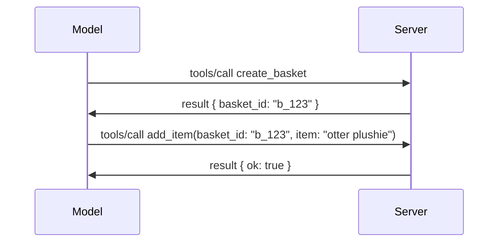

# MCP में क्या बदल गया है: 2026-07-28 विनिर्देशन

> **स्थिति:** अंतिम। MCP विनिर्देशन `2026-07-28` 28 जुलाई 2026 को जारी किया गया
> और वर्तमान प्रोटोकॉल संशोधन है। यह पाठ अंतिम
> विनिर्देशन का वर्णन करता है। कुछ पाठ्यक्रम उदाहरण स्पष्ट रूप से संस्करणित हैं
> `2025-11-25` के लिए क्योंकि उनके SDK ने अभी तक नया stateless API अपनाया नहीं है;
> उन उदाहरणों को विरासत संगतता मार्गदर्शन के रूप में मानें।

## सारांश

`2026-07-28` MCP का सबसे बड़ा संशोधन है जब से यह शुरू हुआ। छह
विनिर्देशन संवर्धन प्रस्ताव (SEPs) प्रोटोकॉल-स्तरीय सत्र हटाते हैं और
MCP को ट्रांसपोर्ट लेयर पर stateless बनाते हैं, एक्सटेंशन पहले दर्जे के,
संस्करणित तंत्र बन जाते हैं, और इस पाठ्यक्रम के कुछ पहले कवर किए गए फीचर्स
(रूट्स, सैंपलिंग, लॉगिंग) एक नए जीवनचक्र नीति के तहत अप्रचलित हो जाते हैं। यह
पाठ सारांश करता है कि क्या बदला, क्यों यह महत्वपूर्ण है, और इसका क्या अर्थ है
`2025-11-25` के खिलाफ लिखे गए कोड के लिए।

स्रोत: [The 2026-07-28 MCP Specification Release Candidate](https://blog.modelcontextprotocol.io/posts/2026-07-28-release-candidate/) (मॉडल कॉन्टेक्स्ट प्रोटोकॉल ब्लॉग, डेविड सोरिया पैर्रा और डेन डेलिमार्स्की)।

## सीखने के उद्देश्य

इस पाठ के अंत तक, आप सक्षम होंगे:

- समझाएं कि MCP stateless प्रोटोकॉल कोर की ओर क्यों बढ़ रहा है और यह क्षैतिज रूप से स्केल किए गए तैनाती के लिए कौन सी समस्या हल करता है।
- वर्णन करें कि `initialize`/`initialized` हैंडशेक और `Mcp-Session-Id` हेडर कैसे बदले गए हैं।
- नए `Mcp-Method` और `Mcp-Name` हेडर और `ttlMs`/`cacheScope` कैशिंग मेटाडेटा की पहचान करें।
- एक्सटेंशन्स फ्रेमवर्क और इस रिलीज के साथ आने वाले दो एक्सटेंशन्स: MCP Apps और Tasks को पहचानें।
- प्राधिकरण मजबूत बनाने और डायनेमिक क्लाइंट रजिस्ट्रेशन
  के अप्रचलन का सारांश दें।
- पहचानें कि कौन से कोर फीचर्स (रूट्स, सैंपलिंग, लॉगिंग) अब अप्रचलित हैं, और इसका व्यावहारिक अर्थ क्या है।
- उपकरण `inputSchema`/`outputSchema` के लिए पूर्ण JSON Schema 2020-12 परिवर्तन को समझाएं।

## एक Stateless प्रोटोकॉल

मुख्य बदलाव: MCP प्रोटोकॉल लेयर पर stateless हो जाता है।

### पहले (2025-11-25): सत्र आपको एक सर्वर उदाहरण पर पिन करते हैं

Streamable HTTP के माध्यम से किसी टूल को कॉल करना `initialize` हैंडशेक से शुरू होता है। सर्वर प्रत्येक बाद की अनुरोध में ले जाने के लिए एक `Mcp-Session-Id` हेडर भेजता है:

```http
POST /mcp HTTP/1.1
Mcp-Session-Id: 1868a90c-3a3f-4f5b
Content-Type: application/json

{"jsonrpc":"2.0","id":2,"method":"tools/call",
 "params":{"name":"search","arguments":{"q":"otters"}}}
```

क्योंकि सत्र उस सर्वर उदाहरण से जुड़ा होता है जिसने इसे जारी किया है, क्षैतिज रूप से स्केल किए गए तैनाती में लोड बैलेंसर पर **स्टिकी रूटिंग** और उदाहरणों के बीच **साझा सत्र स्टोर** की जरूरत होती है।

### बाद में (2026-07-28): प्रत्येक अनुरोध स्व-संपूर्ण होता है

```http
POST /mcp HTTP/1.1
MCP-Protocol-Version: 2026-07-28
Mcp-Method: tools/call
Mcp-Name: search
Content-Type: application/json

{"jsonrpc":"2.0","id":1,"method":"tools/call",
 "params":{"name":"search","arguments":{"q":"otters"},
           "_meta":{"io.modelcontextprotocol/protocolVersion":"2026-07-28",
                    "io.modelcontextprotocol/clientInfo":{"name":"my-app","version":"1.0"},
                    "io.modelcontextprotocol/clientCapabilities":{}}}}
```

कोई भी सर्वर उदाहरण इस अनुरोध को संभाल सकता है। मुख्य बदलाव:

- **`initialize`/`initialized` हैंडशेक हटा दिया गया है** ([SEP-2575](https://github.com/modelcontextprotocol/modelcontextprotocol/pull/2575))। प्रोटोकॉल संस्करण, ग्राहक जानकारी, और ग्राहक क्षमताएं हर अनुरोध पर `_meta` में चली गई हैं। एक नया `server/discover` मेथड ग्राहक को आवश्यकतानुसार सर्वर क्षमताएं पहले पाने देता है।
- **`Mcp-Session-Id` हेडर और प्रोटोकॉल-स्तरीय सत्र हटा दिए गए हैं** ([SEP-2567](https://github.com/modelcontextprotocol/modelcontextprotocol/pull/2567))। प्रोटोकॉल लेयर पर अब स्टिकी रूटिंग और साझा सत्र स्टोर की आवश्यकता नहीं है।

### Stateless प्रोटोकॉल, Stateful अनुप्रयोग

प्रोटोकॉल-स्तरीय सत्र हटाने का मतलब यह नहीं कि आपका सर्वर Stateful नहीं हो सकता। अनुशंसित पैटर्न वही है जो HTTP API हमेशा से इस्तेमाल करते रहे हैं: एक टूल कॉल से एक स्पष्ट हैंडल (जैसे `basket_id`, `browser_id`) बनाएँ, और बाद में मॉडल उस हैंडल को एक सामान्य तर्क के रूप में वापस भेजे।



इससे राज्य मॉडल के लिए दिखाई देने योग्य और प्रबंधनीय बन जाता है बजाय इसके कि इसे ट्रांसपोर्ट मेटाडेटा में छुपा रखा जाए, और इससे कोई भी सर्वर उदाहरण किसी भी कॉल को संभाल सकता है।

### सर्वर-से-क्लाइंट अनुरोध, पुन:संरचित

एक stateless प्रोटोकॉल को अभी भी सर्वर को ग्राहक से मध्य-कॉल कुछ माँगने का तरीका चाहिए (जैसे कि एक elicitation prompt):

- **सर्वर-प्रेरित अनुरोध केवल तब जारी किए जा सकते हैं जब सर्वर सक्रिय रूप से ग्राहक अनुरोध प्रक्रिया में हो** ([SEP-2260](https://github.com/modelcontextprotocol/modelcontextprotocol/pull/2260)) — पहले यह एक सिफारिश थी, अब अनिवार्य है। उपयोगकर्ता को अचानक बिना कारण प्रॉम्प्ट नहीं किया जाता।
- **मल्टी राउंड-ट्रिप अनुरोध** ([SEP-2322](https://github.com/modelcontextprotocol/modelcontextprotocol/pull/2322)) SSE स्ट्रीम को खुला रखने के विकल्प के रूप में आते हैं। इसके बजाय, सर्वर एक `InputRequiredResult` लौटाता है:

  ```json
  {
    "resultType": "input_required",
    "inputRequests": {
      "confirm": {
        "type": "elicitation",
        "message": "Delete 3 files?",
        "schema": { "type": "boolean" }
      }
    },
    "requestState": "eyJzdGVwIjoxLCJmaWxlcyI6WyJhIiwiYiIsImMiXX0="
  }
  ```

ग्राहक उत्तर संग्रहित करता है और `inputResponses` के साथ मूल कॉल को पुनः जारी करता है और साथ में `requestState` को भी। कोई भी सर्वर उदाहरण पुनः प्रयास को संभाल सकता है क्योंकि आवश्यक सब कुछ payload में है।

### रूटेबल, कैशेबल, ट्रेसबल

तीन छोटे बदलाव stateless ट्रैफिक को संचालित करना आसान बनाते हैं:

- **Streamable HTTP पर `Mcp-Method` और `Mcp-Name` हेडर आवश्यक हैं** ([SEP-2243](https://github.com/modelcontextprotocol/modelcontextprotocol/pull/2243)), ताकि लोड बैलेंसर, गेटवे, और रेट लिमिटर JSON बॉडी देखे बिना ऑपरेशन पर रूट कर सकें। जिन अनुरोधों में हेडर और बॉडी मेल नहीं खाते, वे सर्वर द्वारा अस्वीकृत किए जाएंगे।
- **`tools/list` और संसाधन पढ़ने के परिणामों में `ttlMs` और `cacheScope` शामिल हैं** ([SEP-2549](https://github.com/modelcontextprotocol/modelcontextprotocol/pull/2549)), जो HTTP `Cache-Control` पर आधारित हैं। ग्राहक जानते हैं कि कोई सूची परिणाम कितनी देर ताजा है और क्या इसे उपयोगकर्ताओं के बीच साझा करना सुरक्षित है, बिना किसी लंबे समय तक चले SSE स्ट्रीम के जो परिवर्तनों के बारे में सूचित कर सके।
- **`_meta` में W3C ट्रेस कॉन्टेक्स्ट प्रचार प्रलेखित किया गया है** ([SEP-414](https://github.com/modelcontextprotocol/modelcontextprotocol/pull/414)), `traceparent`, `tracestate`, और `baggage` कुंजी नामों को ठीक करते हुए ताकि एक वितरित ट्रेस कॉल को ग्राहक SDK, MCP सर्वर, और डाउनस्ट्रीम सिस्टमों में एक [OpenTelemetry](https://opentelemetry.io/)-अनुकूल बैकएंड में फॉलो कर सके।

## एक्सटेंशन्स प्रथम श्रेणी बनती हैं

एक्सटेंशन्स अनौपचारिक रूप से `2025-11-25` में मौजूद थीं। [SEP-2133](https://github.com/modelcontextprotocol/modelcontextprotocol/pull/2133) उन्हें औपचारिक बनाता है:

- एक्सटेंशन्स को रिवर्स-DNS आईडी द्वारा पहचाना जाता है।
- ये क्लाइंट और सर्वर क्षमताओं के `extensions` मैप के माध्यम से बातचीत करते हैं।
- ये अपने स्वयं के `ext-*` रिपॉजिटरीज में होते हैं जिनके पास प्रतिनिधि मेंटेनर होते हैं और ये कोर विनिर्देशन से स्वतंत्र रूप से संस्करणित होते हैं।
- SEP प्रक्रिया में एक नया एक्सटेंशन्स ट्रैक उन्हें प्रायोगिक से आधिकारिक बनाने का मार्ग देता है।

यह रिलीज दो आधिकारिक एक्सटेंशन्स के साथ आती है।


### MCP एप्लिकेशन: सर्वर-प्रदर्शित उपयोगकर्ता इंटरफ़ेस

[MCP एप्लिकेशन](https://blog.modelcontextprotocol.io/posts/2026-01-26-mcp-apps/) ([SEP-1865](https://github.com/modelcontextprotocol/modelcontextprotocol/pull/1865)) सर्वरों को इंटरैक्टिव HTML इंटरफेस भेजने देते हैं जिन्हें होस्ट एक सैंडबॉक्स्ड iframe में प्रस्तुत करते हैं। उपकरण अपने UI टेम्पलेट पहले से घोषित करते हैं ताकि होस्ट काम शुरू होने से पहले उन्हें प्रीफेच, कैश और सुरक्षा समीक्षा कर सकें। आपने इस आधार को पहले ही [Lesson 15: MCP Apps](../03-GettingStarted/15-mcp-apps/README.md) में कवर किया है — एक्सटेंशन फ्रेमवर्क के अंतर्गत, MCP एप्लिकेशन अब औपचारिक रूप से एक एक्सटेंशन है न कि कोई प्रायोगिक कोर फीचर।

### टास्क के रूप में ग्रेजुएट्स एक एक्सटेंशन में

टास्क `2025-11-25` में एक प्रायोगिक कोर फीचर के रूप में भेजे गए थे। उत्पादन उपयोग में इतना पुनः डिज़ाइन उत्पन्न हुआ कि इसका सही स्थान एक एक्सटेंशन है: [Tasks एक्सटेंशन](https://github.com/modelcontextprotocol/modelcontextprotocol/pull/2663) स्टेटलेस मॉडल के चारों ओर जीवनचक्र को पुनः आकार देता है — एक सर्वर `tools/call` के साथ एक टास्क हैंडल का उत्तर दे सकता है, और क्लाइंट इसे `tasks/get`, `tasks/update`, और `tasks/cancel` के साथ आगे बढ़ाता है। टास्क निर्माण सर्वर-द्वारा निर्देशित होता है: क्लाइंट एक्सटेंशन का विज्ञापन करता है, और सर्वर निर्णय लेता है कि कॉल को टास्क के रूप में कब चलाना चाहिए। `tasks/list` पूरी तरह से हटा दिया गया है क्योंकि इसे सेशन्स के बिना सुरक्षित रूप से स्कोप नहीं किया जा सकता।

> **स्थानांतरण नोट:** यदि आपने प्रायोगिक `2025-11-25` टास्क API को लागू किया है, तो आपको नए एक्सटेंशन जीवनचक्र में माइग्रेट करना होगा — यह पिछड़ा समर्थित नहीं है।

## प्राधिकरण सुदृढ़ीकरण

कई SEPs ने
[प्राधिकरण विनिर्देश](https://modelcontextprotocol.io/specification/2026-07-28/basic/authorization)
को वास्तविक OAuth 2.0 / OpenID Connect तैनाती के और करीब लाने के लिए सुदृढ़ किया है:

| SEP | परिवर्तन |
|---|---|
| [SEP-2468](https://github.com/modelcontextprotocol/modelcontextprotocol/pull/2468) | क्लाइंट प्राधिकरण प्रतिक्रियाओं में `iss` पैरामीटर को [RFC 9207](https://www.rfc-editor.org/rfc/rfc9207) के अनुसार वैधता दें, जिससे MCP के एकल क्लाइंट, कई सर्वर पैटर्न में आम मिश्रण (mix-up) हमलों से बचाव होता है। भविष्य के संस्करण में `iss` छूटे प्रतिक्रियाओं को अस्वीकार करना आवश्यक होगा। |
| [SEP-837](https://github.com/modelcontextprotocol/modelcontextprotocol/pull/837) | केवल संगतता के लिए डायनामिक क्लाइंट रजिस्ट्रेशन क्लाइंट अपने OpenID Connect `application_type` को घोषित करते हैं, जिससे डेस्कटॉप और CLI क्लाइंट के लिए गलत `"web"` डिफ़ॉल्ट से बचा जाता है। |
| [SEP-2352](https://github.com/modelcontextprotocol/modelcontextprotocol/pull/2352) | केवल संगतता के लिए पंजीकृत क्रेडेंशियल्स जारी करने वाले प्राधिकरण सर्वर के `issuer` से जुड़े होते हैं; अगर कस्टम संसाधन स्थानांतरित होता है तो क्लाइंट पुनः पंजीकरण करता है। |
| [SEP-2207](https://github.com/modelcontextprotocol/modelcontextprotocol/pull/2207) | OpenID Connect शैली प्राधिकरण सर्वरों से रिफ्रेश टोकन का अनुरोध कैसे करें इसका दस्तावेज़ीकरण करता है। |
| [SEP-2350](https://github.com/modelcontextprotocol/modelcontextprotocol/pull/2350) | स्टेप-अप प्राधिकरण के दौरान स्कोप संचयन स्पष्ट करता है। |
| [SEP-2351](https://github.com/modelcontextprotocol/modelcontextprotocol/pull/2351) | `.well-known` डिस्कवरी उपसर्ग स्पष्ट करता है। |

यदि आप MCP के लिए कोई प्राधिकरण सर्वर बना रहे हैं, तो प्राधिकरण प्रतिक्रियाओं पर `iss` प्रदान करें और अंतिम प्राधिकरण विनिर्देश का पालन करें। क्रियान्वयन मार्गदर्शन के लिए देखें

[02-Security](../02-Security/README.md)।

डायनामिक क्लाइंट रजिस्ट्रेशन संगतता के लिए उपलब्ध रहता है लेकिन यह भी
`2026-07-28` में अप्रचलित घोषित किया गया है। नए कार्यान्वयन को क्लाइंट आईडी मेटाडेटा
दस्तावेज़ों का उपयोग करना चाहिए।

## अप्रचलित फीचर्स

नए
[फीचर जीवनचक्र नीति](https://github.com/modelcontextprotocol/modelcontextprotocol/pull/2577)
के तहत,


| फीचर | अनुशंसित विकल्प |
|---|---|
| रूट्स | उपकरण पैरामीटर, संसाधन URI, या सर्वर कॉन्फ़िगरेशन |
| सैम्पलिंग | LLM प्रदाता API के साथ प्रत्यक्ष एकीकरण |
| लॉगिंग | stdio परिवहन के लिए `stderr`; संरचित निगरानी के लिए OpenTelemetry |


ये फीचर्स `2026-07-28` में संगतता के लिए बने रहेंगे। ये पहले संशोधन में
हटाने के योग्य हैं जो 28 जुलाई, 2027 या बाद में रिलीज़ होगा;
वास्तविक हटाना बाद में हो सकता है। नए कार्यान्वयन को ऊपर दिए गए विकल्प


- इनपुट स्कीमा में `type: "object"` रूट प्रतिबंध बरकरार है लेकिन अब रचना (`oneOf`, `anyOf`, `allOf`), कंडीशनल और संदर्भ (`$ref`, `$defs`) की अनुमति है।
- आउटपुट स्कीमा में कोई प्रतिबंध नहीं है, और `structuredContent` अब केवल ऑब्जेक्ट नहीं बल्कि कोई भी JSON मान हो सकता है।


- **फीचर जीवनचक्र नीति** हर फीचर को सक्रिय → अप्रचलित → हटाए जाने वाला रास्ता देती है, जिसमें अप्रचलन और हटाने के बीच कम से कम बारह महीने होते हैं।
- **एक्सटेंशंस फ्रेमवर्क** नई क्षमताओं को ऑप्ट-इन एक्सटेंशंस के रूप में भेजने और वहां स्थिर करने देता है, इससे पहले (यदि कभी) कि वे कोर विनिर्देश में जाएं।


- रिलीज़ कैंडिडेट 21 मई, 2026 को लॉक किया गया था।

- SDK समर्थन विशिष्टता से पीछे रह सकता है। माइग्रेट करने से पहले
  [SDK दस्तावेज़](https://modelcontextprotocol.io/docs/sdk) और SDK के
  रिलीज़ नोट देखें।
- अंतिम परिवर्तनों को ट्रैक करें
  [2026-07-28 विशिष्टता](https://modelcontextprotocol.io/specification/2026-07-28/)
  और इसकी
  [परिवर्तन सूची](https://modelcontextprotocol.io/specification/2026-07-28/changelog)।

## इस पाठ्यक्रम का अर्थ क्या है

पाठ्यक्रम `2025-11-25` उदाहरणों से वर्तमान
`2026-07-28` विशिष्टता में संक्रमण कर रहा है। स्पष्ट रूप से:

- **सत्र और `initialize` हैंडशेक** जो स्पष्ट रूप से लक्षित हैं
  `2025-11-25` उदाहरणों में पुराने व्यवहार हैं। `2026-07-28` प्रोटोकॉल उन्हें
  ऊपर बताए गए stateless अनुरोध मॉडल से बदलता है।
- **सैंपलिंग और रूट्स** संगतता के लिए उपलब्ध हैं लेकिन अप्रचलित हैं।
  नए डिज़ाइनों को ऊपर सूचीबद्ध प्रतिस्थापन पैटर्न का उपयोग करना चाहिए।
- **प्रायोगिक टास्क सुविधा**, यदि आपने इसका उपयोग किया है, तो इसे टास्क एक्सटेंशन के नए जीवनचक्र में माइग्रेट करना होगा।
- **MCP ऐप्स** ([Lesson 15](../03-GettingStarted/15-mcp-apps/README.md)) व्यावहारिक रूप से अप्रभावित हैं; यह बस औपचारिक एक्सटेंशन फ्रेमवर्क के तहत आ जाते हैं।

## अतिरिक्त संसाधन

- [MCP विशिष्टता 2026-07-28](https://modelcontextprotocol.io/specification/2026-07-28/)
- [2026-07-28 परिवर्तन सूची](https://modelcontextprotocol.io/specification/2026-07-28/changelog)
- [2026-07-28 MCP विशिष्टता रिलीज़ उम्मीदवार (ऐतिहासिक ब्लॉग पोस्ट)](https://blog.modelcontextprotocol.io/posts/2026-07-28-release-candidate/)
- [MCP ट्रांसपोर्ट्स का भविष्य](https://blog.modelcontextprotocol.io/posts/2025-12-19-mcp-transport-future/)
- [SEP दिशानिर्देश](https://modelcontextprotocol.io/community/sep-guidelines)
- [MCP SDK टियर सिस्टम](https://modelcontextprotocol.io/docs/sdk)

## अगले कदम

वापस जाएं [कोर कॉन्सेप्ट्स](./README.md) या जारी रखें
[सुरक्षा](../02-Security/README.md) पर वर्तमान `2026-07-28` मार्गदर्शन लागू करने के लिए।

---

<!-- CO-OP TRANSLATOR DISCLAIMER START -->
**अस्वीकरण**:
इस दस्तावेज़ का अनुवाद AI अनुवाद सेवा [Co-op Translator](https://github.com/Azure/co-op-translator) का उपयोग करके किया गया है। जबकि हम सटीकता के लिए प्रयास करते हैं, कृपया ध्यान दें कि स्वचालित अनुवादों में त्रुटियाँ या अशुद्धियाँ हो सकती हैं। मूल दस्तावेज़ अपनी मूल भाषा में ही प्रामाणिक स्रोत माना जाना चाहिए। महत्वपूर्ण जानकारी के लिए, पेशेवर मानव अनुवाद की सिफारिश की जाती है। इस अनुवाद के उपयोग से उत्पन्न किसी भी गलतफहमी या गलत व्याख्या के लिए हम उत्तरदायी नहीं हैं।
<!-- CO-OP TRANSLATOR DISCLAIMER END -->