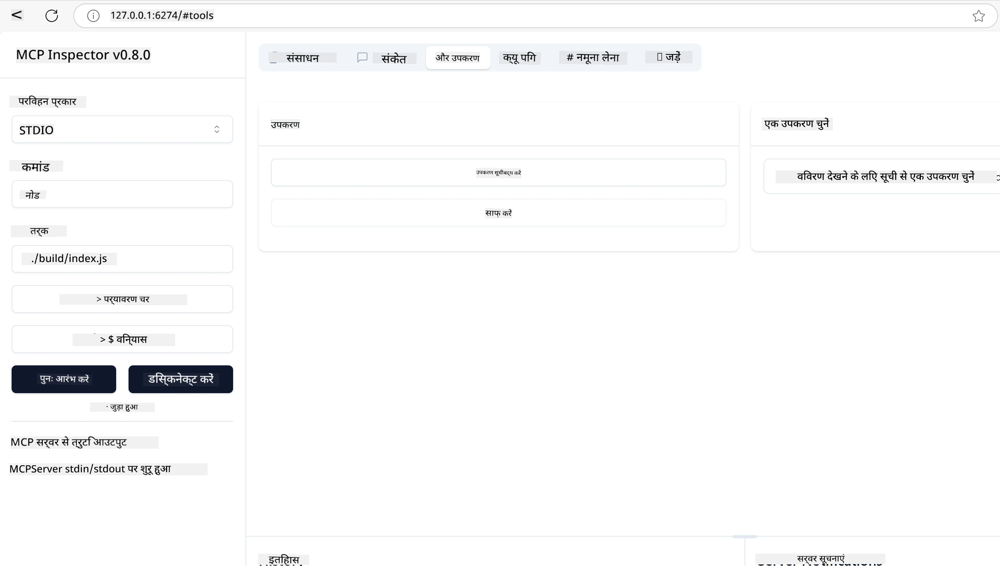
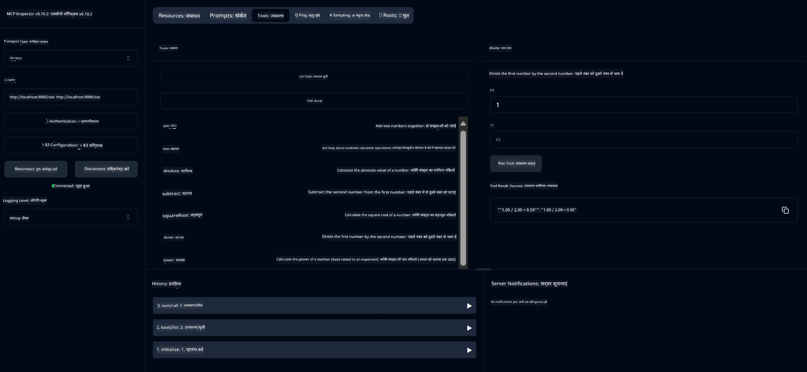
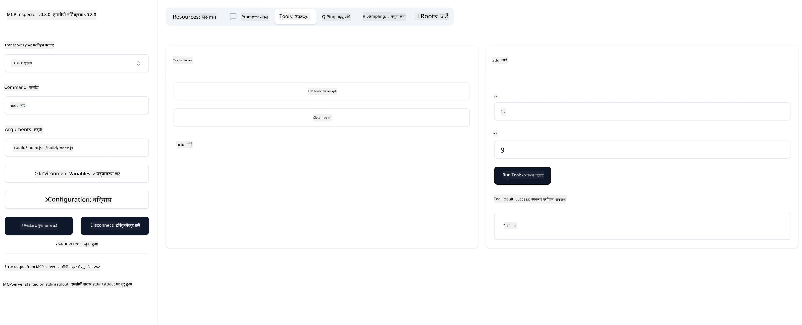

# MCP के साथ शुरुआत करना

> [!NOTE]
> इस पाठ में जावा HTTP उदाहरण पारंपरिक HTTP+SSE ट्रांसपोर्ट का उपयोग करता है और
> MCP `2025-11-25` के साथ संगत SDK को लक्षित करता है। नए रिमोट सर्वरों के लिए,
> `2026-07-28` स्ट्रीमेबल HTTP ट्रांसपोर्ट का उपयोग करें और अपने SDK में समर्थन की पुष्टि करें।

Model Context Protocol (MCP) के साथ आपके पहले कदम में आपका स्वागत है! चाहे आप MCP में नए हों या अपनी समझ को गहरा करना चाहते हों, यह मार्गदर्शिका आपको आवश्यक सेटअप और विकास प्रक्रिया से परिचित कराएगी। आप जानेंगे कि MCP कैसे AI मॉडल और एप्लिकेशन के बीच सहज एकीकरण सक्षम करता है, और MCP-संचालित समाधान बनाने और परीक्षण के लिए अपना वातावरण जल्दी से कैसे तैयार करें।

> TLDR; यदि आप AI ऐप बनाते हैं, तो आप जानते हैं कि आप अपने LLM (लार्ज लैंग्वेज मॉडल) में उपकरण और अन्य संसाधन जोड़ सकते हैं, ताकि LLM अधिक जानकार हो जाए। हालांकि, यदि आप उन उपकरणों और संसाधनों को एक सर्वर पर रखते हैं, तो ऐप और सर्वर क्षमताएं किसी भी क्लाइंट द्वारा LLM के साथ/बिना उपयोग किए जा सकती हैं।

## अवलोकन

यह पाठ MCP वातावरण स्थापित करने और अपने पहले MCP अनुप्रयोग बनाने पर व्यावहारिक मार्गदर्शन प्रदान करता है। आप आवश्यक टूल और फ्रेमवर्क सेट अप करना, बुनियादी MCP सर्वर बनाना, होस्ट एप्लिकेशन तैयार करना, और अपनी कार्यान्वयन का परीक्षण करना सीखेंगे।

Model Context Protocol (MCP) एक खुला प्रोटोकॉल है जो LLM को संदर्भ प्रदान करने के लिए ऐप्लिकेशन के तरीकों को मानकीकृत करता है। MCP को AI ऐप्लिकेशनों के लिए USB-C पोर्ट की तरह समझें - यह AI मॉडल को विभिन्न डेटा स्रोतों और उपकरणों से जोड़ने का मानकीकृत तरीका प्रदान करता है।

## सीखने के उद्देश्य

इस पाठ के अंत तक, आप सक्षम होंगे:

- C#, जावा, पाइथन, टाइपस्क्रिप्ट, और रस्ट में MCP के लिए विकास वातावरण सेट अप करना
- कस्टम फीचर्स (संसाधन, प्रॉम्प्ट्स, और उपकरण) के साथ बुनियादी MCP सर्वर बनाना और तैनात करना
- MCP सर्वरों से कनेक्ट करने वाले होस्ट एप्लिकेशन बनाना
- MCP कार्यान्वयन का परीक्षण और डीबग करना

## अपना MCP वातावरण सेट करना

MCP के साथ काम शुरू करने से पहले, यह महत्वपूर्ण है कि आप अपने विकास वातावरण को तैयार करें और बुनियादी कार्यप्रवाह को समझें। यह अनुभाग आपको MCP के साथ सुचारू शुरुआत के लिए प्रारंभिक सेटअप चरणों से मार्गदर्शन करेगा।

### पूर्व आवश्यकताएँ

MCP विकास में उतरने से पहले, सुनिश्चित करें कि आपके पास है:

- **विकास वातावरण**: आपके चुने हुए भाषा (C#, जावा, पाइथन, टाइपस्क्रिप्ट, या रस्ट) के लिए
- **IDE/एडिटर**: Visual Studio, Visual Studio Code, IntelliJ, Eclipse, PyCharm, या कोई आधुनिक कोड एडिटर
- **पैकेज मैनेजर**: NuGet, Maven/Gradle, pip, npm/yarn, या Cargo
- **API कुंजियाँ**: उन किसी भी AI सेवाओं के लिए जिन्हें आप अपने होस्ट एप्लिकेशन में उपयोग करना चाहते हैं

## बुनियादी MCP सर्वर संरचना

एक MCP सर्वर आमतौर पर शामिल करता है:

- **सर्वर कॉन्फ़िगरेशन**: पोर्ट, प्रमाणीकरण, और अन्य सेटिंग्स सेट करना
- **संसाधन**: LLM को उपलब्ध कराए गए डेटा और संदर्भ
- **उपकरण**: कार्यक्षमता जिसे मॉडल कॉल कर सकते हैं
- **प्रॉम्प्ट्स**: टेक्स्ट जनरेट करने या संरचित करने के लिए टेम्पलेट

यहाँ टाइपस्क्रिप्ट में एक सरलीकृत उदाहरण है:

```typescript
import { McpServer, ResourceTemplate } from "@modelcontextprotocol/sdk/server/mcp.js";
import { StdioServerTransport } from "@modelcontextprotocol/sdk/server/stdio.js";
import { z } from "zod";

// एक MCP सर्वर बनाएँ
const server = new McpServer({
  name: "Demo",
  version: "1.0.0"
});

// एक अतिरिक्त उपकरण जोड़ें
server.tool("add",
  { a: z.number(), b: z.number() },
  async ({ a, b }) => ({
    content: [{ type: "text", text: String(a + b) }]
  })
);

// एक गतिशील अभिवादन संसाधन जोड़ें
server.resource(
  "file",
  // 'list' पैरामीटर नियंत्रित करता है कि संसाधन उपलब्ध फ़ाइलों की सूची कैसे प्रस्तुत करता है। इसे undefined पर सेट करने से इस संसाधन के लिए सूची बनाना अक्षम हो जाता है।
  new ResourceTemplate("file://{path}", { list: undefined }),
  async (uri, { path }) => ({
    contents: [{
      uri: uri.href,
      text: `File, ${path}!`
    }]
  })
);

// एक फ़ाइल संसाधन जोड़ें जो फ़ाइल की सामग्री पढ़ता है
server.resource(
  "file",
  new ResourceTemplate("file://{path}", { list: undefined }),
  async (uri, { path }) => {
    let text;
    try {
      text = await fs.readFile(path, "utf8");
    } catch (err) {
      text = `Error reading file: ${err.message}`;
    }
    return {
      contents: [{
        uri: uri.href,
        text
      }]
    };
  }
);

server.prompt(
  "review-code",
  { code: z.string() },
  ({ code }) => ({
    messages: [{
      role: "user",
      content: {
        type: "text",
        text: `Please review this code:\n\n${code}`
      }
    }]
  })
);

// stdin पर संदेश प्राप्त करना शुरू करें और stdout पर संदेश भेजना शुरू करें
const transport = new StdioServerTransport();
await server.connect(transport);
```

ऊपर के कोड में हम:

- MCP टाइपस्क्रिप्ट SDK से आवश्यक क्लास आयात करते हैं।
- एक नया MCP सर्वर इंस्टेंस बनाते और कॉन्फ़िगर करते हैं।
- एक कस्टम टूल (`calculator`) एक हैंडलर फ़ंक्शन के साथ पंजीकृत करते हैं।
- आने वाले MCP अनुरोधों के लिए सर्वर को सुनने के लिए शुरू करते हैं।

## परीक्षण और डीबगिंग

अपने MCP सर्वर का परीक्षण शुरू करने से पहले, उपलब्ध टूल और डीबगिंग के सर्वोत्तम अभ्यासों को समझना महत्वपूर्ण है। प्रभावी परीक्षण सुनिश्चित करता है कि आपका सर्वर अपेक्षा के अनुसार व्यवहार करता है और आपको जल्दी से मुद्दों की पहचान और समाधान करने में मदद करता है। निम्नलिखित अनुभाग में आपकी MCP कार्यान्वयन को मान्य करने के लिए अनुशंसित दृष्टिकोण बताए गए हैं।

MCP आपको आपके सर्वरों का परीक्षण और डीबग करने में मदद करने वाले टूल प्रदान करता है:

- **इंस्पेक्टर टूल**, यह ग्राफिकल इंटरफेस आपको अपने सर्वर से कनेक्ट करने और अपने टूल्स, प्रॉम्प्ट्स और संसाधनों का परीक्षण करने की अनुमति देता है।
- **curl**, आप curl या अन्य क्लाइंट जैसे कमांड लाइन टूल का उपयोग करके भी अपने सर्वर से कनेक्ट कर सकते हैं जो HTTP कमांड बना और चला सकते हैं।

### MCP इंस्पेक्टर का उपयोग

[MCP Inspector](https://github.com/modelcontextprotocol/inspector) एक दृश्य परीक्षण उपकरण है जो आपको मदद करता है:

1. **सर्वर क्षमताओं की खोज करें**: उपलब्ध संसाधन, उपकरण और प्रॉम्प्ट्स को स्वचालित रूप से पहचानना
2. **उपकरण निष्पादन का परीक्षण करें**: विभिन्न पैरामीटर आज़माएं और रीयल-टाइम प्रतिक्रियाएँ देखें
3. **सर्वर मेटाडेटा देखें**: सर्वर की जानकारी, स्कीमा, और कॉन्फ़िगरेशन का निरीक्षण करें

```bash
# उदाहरण TypeScript, MCP निरीक्षक को इंस्टॉल करना और चलाना
npx @modelcontextprotocol/inspector node build/index.js
```

जब आप ऊपर दिए गए कमांड चलाते हैं, तो MCP इंस्पेक्टर ब्राउज़र में एक स्थानीय वेब इंटरफ़ेस लॉन्च करेगा। आप एक डैशबोर्ड देख सकते हैं जो आपके पंजीकृत MCP सर्वरों, उनके उपलब्ध टूल्स, संसाधनों, और प्रॉम्प्ट्स को प्रदर्शित करता है। यह इंटरफ़ेस आपको उपकरण निष्पादन का इंटरेक्टिव परीक्षण करने, सर्वर मेटाडेटा निरीक्षण करने, और रीयल-टाइम प्रतिक्रियाएँ देखने की अनुमति देता है, जिससे आपके MCP सर्वर कार्यान्वयनों को मान्य और डीबग करना आसान हो जाता है।

यहाँ इसका एक स्क्रीनशॉट है:



## सामान्य सेटअप मुद्दे और समाधान

| समस्या | संभावित समाधान |
|-------|-------------------|
| कनेक्शन अस्वीकृत | जांचें कि सर्वर चल रहा है और पोर्ट सही है |
| उपकरण निष्पादन त्रुटियां | पैरामीटर सत्यापन और त्रुटि हैंडलिंग की समीक्षा करें |
| प्रमाणीकरण विफलता | API कुंजियों और अनुमतियों की पुष्टि करें |
| स्कीमा सत्यापन त्रुटियां | सुनिश्चित करें कि पैरामीटर परिभाषित स्कीमा से मेल खाते हैं |
| सर्वर शुरू नहीं हो रहा | पोर्ट टकराव या आवश्यक निर्भरताएँ जांचें |
| CORS त्रुटियां | क्रॉस-उत्पत्ति अनुरोधों के लिए उचित CORS हेडर्स कॉन्फ़िगर करें |
| प्रमाणीकरण मुद्दे | टोकन वैधता और अनुमतियों की पुष्टि करें |

## लोकल विकास

लोकल विकास और परीक्षण के लिए, आप सीधे अपने मशीन पर MCP सर्वर चला सकते हैं:

1. **सर्वर प्रक्रिया शुरू करें**: अपना MCP सर्वर एप्लिकेशन चलाएं
2. **नेटवर्किंग कॉन्फ़िगर करें**: सुनिश्चित करें कि सर्वर अपेक्षित पोर्ट पर सुलभ है
3. **क्लाइंट कनेक्ट करें**: `http://localhost:3000` जैसे लोकल कनेक्शन URLs का प्रयोग करें

```bash
# उदाहरण: स्थानीय रूप से टाइपस्क्रिप्ट MCP सर्वर चलाना
npm run start
# सर्वर http://localhost:3000 पर चल रहा है
```

## अपना पहला MCP सर्वर बनाना

हमने पहले के पाठ में [कोर अवधारणाओं](../../01-CoreConcepts/README.md) को कवर किया है, अब समय है उस ज्ञान को काम में लाने का।

### एक सर्वर क्या कर सकता है

कोड लिखना शुरू करने से पहले, चलिए याद दिलाते हैं कि एक सर्वर क्या कर सकता है:

एक MCP सर्वर, उदाहरण के लिए, निम्न कर सकता है:

- लोकल फाइलों और डेटाबेस तक पहुँचना
- रिमोट API से कनेक्ट होना
- गणनाएँ करना
- अन्य उपकरणों और सेवाओं से एकीकृत होना
- इंटरैक्शन के लिए यूजर इंटरफेस प्रदान करना

बढ़िया, अब जब हमें पता चल गया कि हम इसके लिए क्या कर सकते हैं, चलिए कोडिंग शुरू करते हैं।

## अभ्यास: सर्वर बनाना

सर्वर बनाने के लिए, आपको निम्न कदमों का पालन करना होगा:

- MCP SDK इंस्टॉल करें।
- एक प्रोजेक्ट बनाएं और प्रोजेक्ट संरचना सेट करें।
- सर्वर कोड लिखें।
- सर्वर का परीक्षण करें।

### -1- प्रोजेक्ट बनाएं

#### टाइपस्क्रिप्ट

```sh
# प्रोजेक्ट निर्देशिका बनाएँ और npm प्रोजेक्ट प्रारंभ करें
mkdir calculator-server
cd calculator-server
npm init -y
```

#### पाइथन

```sh
# परियोजना निर्देशिका बनाएं
mkdir calculator-server
cd calculator-server
# Visual Studio Code में फ़ोल्डर खोलें - यदि आप अलग IDE उपयोग कर रहे हैं तो इसे अनदेखा करें
code .
```

#### .NET

```sh
dotnet new console -n McpCalculatorServer
cd McpCalculatorServer
```

#### जावा

जावा के लिए, एक स्प्रिंग बूट प्रोजेक्ट बनाएं:

```bash
curl https://start.spring.io/starter.zip \
  -d dependencies=web \
  -d javaVersion=21 \
  -d type=maven-project \
  -d groupId=com.example \
  -d artifactId=calculator-server \
  -d name=McpServer \
  -d packageName=com.microsoft.mcp.sample.server \
  -o calculator-server.zip
```

ज़िप फाइल निकालें:

```bash
unzip calculator-server.zip -d calculator-server
cd calculator-server
# वैकल्पिक रूप से अप्रयुक्त परीक्षण हटाएं
rm -rf src/test/java
```

अपनी *pom.xml* फाइल में निम्न पूर्ण कॉन्फ़िगरेशन जोड़ें:

```xml
<?xml version="1.0" encoding="UTF-8"?>
<project xmlns="http://maven.apache.org/POM/4.0.0"
    xmlns:xsi="http://www.w3.org/2001/XMLSchema-instance"
    xsi:schemaLocation="http://maven.apache.org/POM/4.0.0 http://maven.apache.org/xsd/maven-4.0.0.xsd">
    <modelVersion>4.0.0</modelVersion>
    
    <!-- Spring Boot parent for dependency management -->
    <parent>
        <groupId>org.springframework.boot</groupId>
        <artifactId>spring-boot-starter-parent</artifactId>
        <version>3.5.0</version>
        <relativePath />
    </parent>

    <!-- Project coordinates -->
    <groupId>com.example</groupId>
    <artifactId>calculator-server</artifactId>
    <version>0.0.1-SNAPSHOT</version>
    <name>Calculator Server</name>
    <description>Basic calculator MCP service for beginners</description>

    <!-- Properties -->
    <properties>
        <java.version>21</java.version>
        <maven.compiler.source>21</maven.compiler.source>
        <maven.compiler.target>21</maven.compiler.target>
    </properties>

    <!-- Spring AI BOM for version management -->
    <dependencyManagement>
        <dependencies>
            <dependency>
                <groupId>org.springframework.ai</groupId>
                <artifactId>spring-ai-bom</artifactId>
                <version>1.0.0-SNAPSHOT</version>
                <type>pom</type>
                <scope>import</scope>
            </dependency>
        </dependencies>
    </dependencyManagement>

    <!-- Dependencies -->
    <dependencies>
        <dependency>
            <groupId>org.springframework.ai</groupId>
            <artifactId>spring-ai-starter-mcp-server-webflux</artifactId>
        </dependency>
        <dependency>
            <groupId>org.springframework.boot</groupId>
            <artifactId>spring-boot-starter-actuator</artifactId>
        </dependency>
        <dependency>
         <groupId>org.springframework.boot</groupId>
         <artifactId>spring-boot-starter-test</artifactId>
         <scope>test</scope>
      </dependency>
    </dependencies>

    <!-- Build configuration -->
    <build>
        <plugins>
            <plugin>
                <groupId>org.springframework.boot</groupId>
                <artifactId>spring-boot-maven-plugin</artifactId>
            </plugin>
            <plugin>
                <groupId>org.apache.maven.plugins</groupId>
                <artifactId>maven-compiler-plugin</artifactId>
                <configuration>
                    <release>21</release>
                </configuration>
            </plugin>
        </plugins>
    </build>

    <!-- Repositories for Spring AI snapshots -->
    <repositories>
        <repository>
            <id>spring-milestones</id>
            <name>Spring Milestones</name>
            <url>https://repo.spring.io/milestone</url>
            <snapshots>
                <enabled>false</enabled>
            </snapshots>
        </repository>
        <repository>
            <id>spring-snapshots</id>
            <name>Spring Snapshots</name>
            <url>https://repo.spring.io/snapshot</url>
            <releases>
                <enabled>false</enabled>
            </releases>
        </repository>
    </repositories>
</project>
```

#### रस्ट

```sh
mkdir calculator-server
cd calculator-server
cargo init
```

### -2- निर्भरताएँ जोड़ें

अब जब आपका प्रोजेक्ट बन चुका है, चलिए अगला चरण निर्भरताएँ जोड़ने का करते हैं:

#### टाइपस्क्रिप्ट

```sh
# यदि पहले से इंस्टॉल नहीं है, तो TypeScript को वैश्विक रूप से इंस्टॉल करें
npm install typescript -g

# MCP SDK और Zod को स्कीमा मान्यता के लिए इंस्टॉल करें
npm install @modelcontextprotocol/sdk zod
npm install -D @types/node typescript
```

#### पाइथन

```sh
# एक वर्चुअल एन्विरॉनमेंट बनाएं और डिपेंडेंसी इंस्टॉल करें
python -m venv venv
venv\Scripts\activate
pip install "mcp[cli]"
```

#### जावा

```bash
cd calculator-server
./mvnw clean install -DskipTests
```

#### रस्ट

```sh
cargo add rmcp --features server,transport-io
cargo add serde
cargo add tokio --features rt-multi-thread
```

### -3- प्रोजेक्ट फाइलें बनाएं

#### टाइपस्क्रिप्ट

*package.json* फाइल खोलें और सर्वर को बिल्ड और चलाने के लिए निम्न सामग्री से बदलें:

```json
{
  "name": "calculator-server",
  "version": "1.0.0",
  "main": "index.js",
  "type": "module",
  "scripts": {
    "build": "tsc",
    "start": "npm run build && node ./build/index.js",
  },
  "keywords": [],
  "author": "",
  "license": "ISC",
  "description": "A simple calculator server using Model Context Protocol",
  "dependencies": {
    "@modelcontextprotocol/sdk": "^1.16.0",
    "zod": "^3.25.76"
  },
  "devDependencies": {
    "@types/node": "^24.0.14",
    "typescript": "^5.8.3"
  }
}
```

*tsconfig.json* बनाएं निम्न सामग्री के साथ:

```json
{
  "compilerOptions": {
    "target": "ES2022",
    "module": "Node16",
    "moduleResolution": "Node16",
    "outDir": "./build",
    "rootDir": "./src",
    "strict": true,
    "esModuleInterop": true,
    "skipLibCheck": true,
    "forceConsistentCasingInFileNames": true
  },
  "include": ["src/**/*"],
  "exclude": ["node_modules"]
}
```

अपने स्रोत कोड के लिए एक निर्देशिका बनाएं:

```sh
mkdir src
touch src/index.ts
```

#### पाइथन

*server.py* नामक एक फाइल बनाएं

```sh
touch server.py
```

#### .NET

आवश्यक NuGet पैकेज इंस्टॉल करें:

```sh
dotnet add package ModelContextProtocol --prerelease
dotnet add package Microsoft.Extensions.Hosting
```

#### जावा

जावा स्प्रिंग बूट प्रोजेक्ट के लिए, प्रोजेक्ट संरचना स्वचालित रूप से बन जाती है।

#### रस्ट

रस्ट के लिए, `cargo init` कमांड चलाने पर डिफ़ॉल्ट रूप से *src/main.rs* फाइल बनती है। उस फाइल को खोलें और डिफ़ॉल्ट कोड हटा दें।

### -4- सर्वर कोड बनाएं

#### टाइपस्क्रिप्ट

*index.ts* नामक एक फाइल बनाएं और निम्न कोड जोड़ें:

```typescript
import { McpServer, ResourceTemplate } from "@modelcontextprotocol/sdk/server/mcp.js";
import { StdioServerTransport } from "@modelcontextprotocol/sdk/server/stdio.js";
import { z } from "zod";
 
// एक MCP सर्वर बनाएं
const server = new McpServer({
  name: "Calculator MCP Server",
  version: "1.0.0"
});
```

अब आपके पास एक सर्वर है, लेकिन यह ज्यादा कुछ नहीं करता, इसे ठीक करते हैं।

#### पाइथन

```python
# server.py
from mcp.server.fastmcp import FastMCP

# एक MCP सर्वर बनाएँ
mcp = FastMCP("Demo")
```

#### .NET

```csharp
using Microsoft.Extensions.DependencyInjection;
using Microsoft.Extensions.Hosting;
using Microsoft.Extensions.Logging;
using ModelContextProtocol.Server;
using System.ComponentModel;

var builder = Host.CreateApplicationBuilder(args);
builder.Logging.AddConsole(consoleLogOptions =>
{
    // Configure all logs to go to stderr
    consoleLogOptions.LogToStandardErrorThreshold = LogLevel.Trace;
});

builder.Services
    .AddMcpServer()
    .WithStdioServerTransport()
    .WithToolsFromAssembly();
await builder.Build().RunAsync();

// add features
```

#### जावा

जावा के लिए, मुख्य सर्वर घटक बनाएं। सबसे पहले, मुख्य एप्लिकेशन क्लास संशोधित करें:

*src/main/java/com/microsoft/mcp/sample/server/McpServerApplication.java*:

```java
package com.microsoft.mcp.sample.server;

import org.springframework.ai.tool.ToolCallbackProvider;
import org.springframework.ai.tool.method.MethodToolCallbackProvider;
import org.springframework.boot.SpringApplication;
import org.springframework.boot.autoconfigure.SpringBootApplication;
import org.springframework.context.annotation.Bean;
import com.microsoft.mcp.sample.server.service.CalculatorService;

@SpringBootApplication
public class McpServerApplication {

    public static void main(String[] args) {
        SpringApplication.run(McpServerApplication.class, args);
    }
    
    @Bean
    public ToolCallbackProvider calculatorTools(CalculatorService calculator) {
        return MethodToolCallbackProvider.builder().toolObjects(calculator).build();
    }
}
```

कैलकुलेटर सेवा बनाएं *src/main/java/com/microsoft/mcp/sample/server/service/CalculatorService.java*:

```java
package com.microsoft.mcp.sample.server.service;

import org.springframework.ai.tool.annotation.Tool;
import org.springframework.stereotype.Service;

/**
 * Service for basic calculator operations.
 * This service provides simple calculator functionality through MCP.
 */
@Service
public class CalculatorService {

    /**
     * Add two numbers
     * @param a The first number
     * @param b The second number
     * @return The sum of the two numbers
     */
    @Tool(description = "Add two numbers together")
    public String add(double a, double b) {
        double result = a + b;
        return formatResult(a, "+", b, result);
    }

    /**
     * Subtract one number from another
     * @param a The number to subtract from
     * @param b The number to subtract
     * @return The result of the subtraction
     */
    @Tool(description = "Subtract the second number from the first number")
    public String subtract(double a, double b) {
        double result = a - b;
        return formatResult(a, "-", b, result);
    }

    /**
     * Multiply two numbers
     * @param a The first number
     * @param b The second number
     * @return The product of the two numbers
     */
    @Tool(description = "Multiply two numbers together")
    public String multiply(double a, double b) {
        double result = a * b;
        return formatResult(a, "*", b, result);
    }

    /**
     * Divide one number by another
     * @param a The numerator
     * @param b The denominator
     * @return The result of the division
     */
    @Tool(description = "Divide the first number by the second number")
    public String divide(double a, double b) {
        if (b == 0) {
            return "Error: Cannot divide by zero";
        }
        double result = a / b;
        return formatResult(a, "/", b, result);
    }

    /**
     * Calculate the power of a number
     * @param base The base number
     * @param exponent The exponent
     * @return The result of raising the base to the exponent
     */
    @Tool(description = "Calculate the power of a number (base raised to an exponent)")
    public String power(double base, double exponent) {
        double result = Math.pow(base, exponent);
        return formatResult(base, "^", exponent, result);
    }

    /**
     * Calculate the square root of a number
     * @param number The number to find the square root of
     * @return The square root of the number
     */
    @Tool(description = "Calculate the square root of a number")
    public String squareRoot(double number) {
        if (number < 0) {
            return "Error: Cannot calculate square root of a negative number";
        }
        double result = Math.sqrt(number);
        return String.format("√%.2f = %.2f", number, result);
    }

    /**
     * Calculate the modulus (remainder) of division
     * @param a The dividend
     * @param b The divisor
     * @return The remainder of the division
     */
    @Tool(description = "Calculate the remainder when one number is divided by another")
    public String modulus(double a, double b) {
        if (b == 0) {
            return "Error: Cannot divide by zero";
        }
        double result = a % b;
        return formatResult(a, "%", b, result);
    }

    /**
     * Calculate the absolute value of a number
     * @param number The number to find the absolute value of
     * @return The absolute value of the number
     */
    @Tool(description = "Calculate the absolute value of a number")
    public String absolute(double number) {
        double result = Math.abs(number);
        return String.format("|%.2f| = %.2f", number, result);
    }

    /**
     * Get help about available calculator operations
     * @return Information about available operations
     */
    @Tool(description = "Get help about available calculator operations")
    public String help() {
        return "Basic Calculator MCP Service\n\n" +
               "Available operations:\n" +
               "1. add(a, b) - Adds two numbers\n" +
               "2. subtract(a, b) - Subtracts the second number from the first\n" +
               "3. multiply(a, b) - Multiplies two numbers\n" +
               "4. divide(a, b) - Divides the first number by the second\n" +
               "5. power(base, exponent) - Raises a number to a power\n" +
               "6. squareRoot(number) - Calculates the square root\n" + 
               "7. modulus(a, b) - Calculates the remainder of division\n" +
               "8. absolute(number) - Calculates the absolute value\n\n" +
               "Example usage: add(5, 3) will return 5 + 3 = 8";
    }

    /**
     * Format the result of a calculation
     */
    private String formatResult(double a, String operator, double b, double result) {
        return String.format("%.2f %s %.2f = %.2f", a, operator, b, result);
    }
}
```

**प्रोडक्शन-तैयार सेवा के लिए वैकल्पिक घटक:**

स्टार्टअप कॉन्फ़िगरेशन बनाएं *src/main/java/com/microsoft/mcp/sample/server/config/StartupConfig.java*:

```java
package com.microsoft.mcp.sample.server.config;

import org.springframework.boot.CommandLineRunner;
import org.springframework.context.annotation.Bean;
import org.springframework.context.annotation.Configuration;

@Configuration
public class StartupConfig {
    
    @Bean
    public CommandLineRunner startupInfo() {
        return args -> {
            System.out.println("\n" + "=".repeat(60));
            System.out.println("Calculator MCP Server is starting...");
            System.out.println("SSE endpoint: http://localhost:8080/sse");
            System.out.println("Health check: http://localhost:8080/actuator/health");
            System.out.println("=".repeat(60) + "\n");
        };
    }
}
```

एक हेल्थ कंट्रोलर बनाएं *src/main/java/com/microsoft/mcp/sample/server/controller/HealthController.java*:

```java
package com.microsoft.mcp.sample.server.controller;

import org.springframework.http.ResponseEntity;
import org.springframework.web.bind.annotation.GetMapping;
import org.springframework.web.bind.annotation.RestController;
import java.time.LocalDateTime;
import java.util.HashMap;
import java.util.Map;

@RestController
public class HealthController {
    
    @GetMapping("/health")
    public ResponseEntity<Map<String, Object>> healthCheck() {
        Map<String, Object> response = new HashMap<>();
        response.put("status", "UP");
        response.put("timestamp", LocalDateTime.now().toString());
        response.put("service", "Calculator MCP Server");
        return ResponseEntity.ok(response);
    }
}
```

एक एक्सेप्शन हैंडलर बनाएं *src/main/java/com/microsoft/mcp/sample/server/exception/GlobalExceptionHandler.java*:

```java
package com.microsoft.mcp.sample.server.exception;

import org.springframework.http.HttpStatus;
import org.springframework.http.ResponseEntity;
import org.springframework.web.bind.annotation.ExceptionHandler;
import org.springframework.web.bind.annotation.RestControllerAdvice;

@RestControllerAdvice
public class GlobalExceptionHandler {

    @ExceptionHandler(IllegalArgumentException.class)
    public ResponseEntity<ErrorResponse> handleIllegalArgumentException(IllegalArgumentException ex) {
        ErrorResponse error = new ErrorResponse(
            "Invalid_Input", 
            "Invalid input parameter: " + ex.getMessage());
        return new ResponseEntity<>(error, HttpStatus.BAD_REQUEST);
    }

    public static class ErrorResponse {
        private String code;
        private String message;

        public ErrorResponse(String code, String message) {
            this.code = code;
            this.message = message;
        }

        // गेटर्स
        public String getCode() { return code; }
        public String getMessage() { return message; }
    }
}
```

एक कस्टम बैनर बनाएं *src/main/resources/banner.txt*:

```text
_____      _            _       _             
 / ____|    | |          | |     | |            
| |     __ _| | ___ _   _| | __ _| |_ ___  _ __ 
| |    / _` | |/ __| | | | |/ _` | __/ _ \| '__|
| |___| (_| | | (__| |_| | | (_| | || (_) | |   
 \_____\__,_|_|\___|\__,_|_|\__,_|\__\___/|_|   
                                                
Calculator MCP Server v1.0
Spring Boot MCP Application
```

</details>

#### रस्ट

*src/main.rs* फाइल की शुरुआत में निम्न कोड जोड़ें। यह आपके MCP सर्वर के लिए आवश्यक लाइब्रेरी और मॉड्यूल आयात करता है।

```rust
use rmcp::{
    handler::server::{router::tool::ToolRouter, tool::Parameters},
    model::{ServerCapabilities, ServerInfo},
    schemars, tool, tool_handler, tool_router,
    transport::stdio,
    ServerHandler, ServiceExt,
};
use std::error::Error;
```

कैलकुलेटर सर्वर एक सरल सर्वर होगा जो दो संख्याओं को जोड़ सकता है। आइए कैलकुलेटर अनुरोध का प्रतिनिधित्व करने के लिए एक स्ट्रक्चर बनाएं।

```rust
#[derive(Debug, serde::Deserialize, schemars::JsonSchema)]
pub struct CalculatorRequest {
    pub a: f64,
    pub b: f64,
}
```

अगला, कैलकुलेटर सर्वर का प्रतिनिधित्व करने के लिए एक स्ट्रक्चर बनाएं। यह स्ट्रक्चर टूल राउटर रखेगा, जिसका उपयोग उपकरण पंजीकृत करने के लिए होता है।

```rust
#[derive(Debug, Clone)]
pub struct Calculator {
    tool_router: ToolRouter<Self>,
}
```

अब, हम `Calculator` स्ट्रक्चर को लागू कर सकते हैं ताकि सर्वर का नया इंस्टेंस बनाया जा सके और सर्वर जानकारी प्रदान करने के लिए सर्वर हैंडलर को लागू किया जा सके।

```rust
#[tool_router]
impl Calculator {
    pub fn new() -> Self {
        Self {
            tool_router: Self::tool_router(),
        }
    }
}

#[tool_handler]
impl ServerHandler for Calculator {
    fn get_info(&self) -> ServerInfo {
        ServerInfo {
            instructions: Some("A simple calculator tool".into()),
            capabilities: ServerCapabilities::builder().enable_tools().build(),
            ..Default::default()
        }
    }
}
```

अंत में, हमें मुख्य फ़ंक्शन को लागू करना होगा ताकि सर्वर शुरू हो सके। यह फ़ंक्शन `Calculator` स्ट्रक्चर का एक उदाहरण बनाएगा और इसे स्टैंडर्ड इनपुट/आउटपुट पर सर्व करेगा।

```rust
#[tokio::main]
async fn main() -> Result<(), Box<dyn Error>> {
    let service = Calculator::new().serve(stdio()).await?;
    service.waiting().await?;
    Ok(())
}
```

अब सर्वर अपने बारे में बुनियादी जानकारी प्रदान करने के लिए स्थापित है। अगला, हम एक टूल जोड़ेंगे जो जोड़ का कार्य करेगा।

### -5- एक टूल और एक संसाधन जोड़ना

निम्न कोड जोड़कर एक टूल और एक संसाधन जोड़ें:

#### टाइपस्क्रिप्ट

```typescript
server.tool(
  "add",
  { a: z.number(), b: z.number() },
  async ({ a, b }) => ({
    content: [{ type: "text", text: String(a + b) }]
  })
);

server.resource(
  "greeting",
  new ResourceTemplate("greeting://{name}", { list: undefined }),
  async (uri, { name }) => ({
    contents: [{
      uri: uri.href,
      text: `Hello, ${name}!`
    }]
  })
);
```

आपका टूल पैरामीटर्स `a` और `b` लेता है और एक फ़ंक्शन चलाता है जो इस रूप में एक प्रतिक्रिया उत्पन्न करता है:

```typescript
{
  contents: [{
    type: "text", content: "some content"
  }]
}
```

आपका संसाधन स्ट्रिंग "greeting" के माध्यम से एक्सेस किया जाता है और पैरामीटर `name` लेता है, और टूल के समान प्रतिक्रिया उत्पन्न करता है:

```typescript
{
  uri: "<href>",
  text: "a text"
}
```

#### पाइथन

```python
# एक संधि उपकरण जोड़ें
@mcp.tool()
def add(a: int, b: int) -> int:
    """Add two numbers"""
    return a + b


# एक गतिशील अभिवादन संसाधन जोड़ें
@mcp.resource("greeting://{name}")
def get_greeting(name: str) -> str:
    """Get a personalized greeting"""
    return f"Hello, {name}!"
```

ऊपर के कोड में हमने:

- एक टूल `add` परिभाषित किया जो पैरामीटर्स `a` और `b`, दोनों पूर्णांक, लेता है।
- `greeting` नामक एक संसाधन बनाया जो पैरामीटर `name` लेता है।

#### .NET

इसे अपनी Program.cs फाइल में जोड़ें:

```csharp
[McpServerToolType]
public static class CalculatorTool
{
    [McpServerTool, Description("Adds two numbers")]
    public static string Add(int a, int b) => $"Sum {a + b}";
}
```

#### जावा

टूल पहले से ही पिछले चरण में बनाए जा चुके हैं।

#### रस्ट

`impl Calculator` ब्लॉक के अंदर एक नया टूल जोड़ें:

```rust
#[tool(description = "Adds a and b")]
async fn add(
    &self,
    Parameters(CalculatorRequest { a, b }): Parameters<CalculatorRequest>,
) -> String {
    (a + b).to_string()
}
```

### -6- अंतिम कोड

चलिए अंतिम कोड जोड़ते हैं जिसे सर्वर को शुरू करने के लिए चाहिए:

#### टाइपस्क्रिप्ट

```typescript
// स्ट्डिन पर संदेश प्राप्त करना शुरू करें और स्ट्डआउट पर संदेश भेजना शुरू करें
const transport = new StdioServerTransport();
await server.connect(transport);
```

यहाँ पूरा कोड है:

```typescript
// index.ts
import { McpServer, ResourceTemplate } from "@modelcontextprotocol/sdk/server/mcp.js";
import { StdioServerTransport } from "@modelcontextprotocol/sdk/server/stdio.js";
import { z } from "zod";

// एक MCP सर्वर बनाएं
const server = new McpServer({
  name: "Calculator MCP Server",
  version: "1.0.0"
});

// एक जोड़ने का उपकरण जोड़ें
server.tool(
  "add",
  { a: z.number(), b: z.number() },
  async ({ a, b }) => ({
    content: [{ type: "text", text: String(a + b) }]
  })
);

// एक गतिशील स्वागत संसाधन जोड़ें
server.resource(
  "greeting",
  new ResourceTemplate("greeting://{name}", { list: undefined }),
  async (uri, { name }) => ({
    contents: [{
      uri: uri.href,
      text: `Hello, ${name}!`
    }]
  })
);

// stdin पर संदेश प्राप्त करना शुरू करें और stdout पर संदेश भेजें
const transport = new StdioServerTransport();
server.connect(transport);
```

#### पाइथन

```python
# server.py
from mcp.server.fastmcp import FastMCP

# एक MCP सर्वर बनाएँ
mcp = FastMCP("Demo")


# एक जोड़ने का उपकरण जोड़ें
@mcp.tool()
def add(a: int, b: int) -> int:
    """Add two numbers"""
    return a + b


# एक गतिशील अभिवादन संसाधन जोड़ें
@mcp.resource("greeting://{name}")
def get_greeting(name: str) -> str:
    """Get a personalized greeting"""
    return f"Hello, {name}!"

# मुख्य निष्पादन खंड - यह सर्वर चलाने के लिए आवश्यक है
if __name__ == "__main__":
    mcp.run()
```

#### .NET

निम्न सामग्री के साथ एक Program.cs फाइल बनाएं:

```csharp
using Microsoft.Extensions.DependencyInjection;
using Microsoft.Extensions.Hosting;
using Microsoft.Extensions.Logging;
using ModelContextProtocol.Server;
using System.ComponentModel;

var builder = Host.CreateApplicationBuilder(args);
builder.Logging.AddConsole(consoleLogOptions =>
{
    // Configure all logs to go to stderr
    consoleLogOptions.LogToStandardErrorThreshold = LogLevel.Trace;
});

builder.Services
    .AddMcpServer()
    .WithStdioServerTransport()
    .WithToolsFromAssembly();
await builder.Build().RunAsync();

[McpServerToolType]
public static class CalculatorTool
{
    [McpServerTool, Description("Adds two numbers")]
    public static string Add(int a, int b) => $"Sum {a + b}";
}
```

#### जावा

आपकी पूरी मुख्य एप्लिकेशन क्लास इस तरह दिखनी चाहिए:

```java
// McpServerApplication.java
package com.microsoft.mcp.sample.server;

import org.springframework.ai.tool.ToolCallbackProvider;
import org.springframework.ai.tool.method.MethodToolCallbackProvider;
import org.springframework.boot.SpringApplication;
import org.springframework.boot.autoconfigure.SpringBootApplication;
import org.springframework.context.annotation.Bean;
import com.microsoft.mcp.sample.server.service.CalculatorService;

@SpringBootApplication
public class McpServerApplication {

    public static void main(String[] args) {
        SpringApplication.run(McpServerApplication.class, args);
    }
    
    @Bean
    public ToolCallbackProvider calculatorTools(CalculatorService calculator) {
        return MethodToolCallbackProvider.builder().toolObjects(calculator).build();
    }
}
```

#### रस्ट

रस्ट सर्वर के लिए अंतिम कोड इस प्रकार होना चाहिए:

```rust
use rmcp::{
    ServerHandler, ServiceExt,
    handler::server::{router::tool::ToolRouter, tool::Parameters},
    model::{ServerCapabilities, ServerInfo},
    schemars, tool, tool_handler, tool_router,
    transport::stdio,
};
use std::error::Error;

#[derive(Debug, serde::Deserialize, schemars::JsonSchema)]
pub struct CalculatorRequest {
    pub a: f64,
    pub b: f64,
}

#[derive(Debug, Clone)]
pub struct Calculator {
    tool_router: ToolRouter<Self>,
}

#[tool_router]
impl Calculator {
    pub fn new() -> Self {
        Self {
            tool_router: Self::tool_router(),
        }
    }
    
    #[tool(description = "Adds a and b")]
    async fn add(
        &self,
        Parameters(CalculatorRequest { a, b }): Parameters<CalculatorRequest>,
    ) -> String {
        (a + b).to_string()
    }
}

#[tool_handler]
impl ServerHandler for Calculator {
    fn get_info(&self) -> ServerInfo {
        ServerInfo {
            instructions: Some("A simple calculator tool".into()),
            capabilities: ServerCapabilities::builder().enable_tools().build(),
            ..Default::default()
        }
    }
}

#[tokio::main]
async fn main() -> Result<(), Box<dyn Error>> {
    let service = Calculator::new().serve(stdio()).await?;
    service.waiting().await?;
    Ok(())
}
```

### -7- सर्वर का परीक्षण करें

निम्न कमांड के साथ सर्वर शुरू करें:

#### टाइपस्क्रिप्ट

```sh
npm run build
```

#### पाइथन

```sh
mcp run server.py
```

> MCP इंस्पेक्टर का उपयोग करने के लिए, `mcp dev server.py` का प्रयोग करें जो स्वचालित रूप से इंस्पेक्टर लॉन्च करता है और आवश्यक प्रॉक्सी सेशन टोकन प्रदान करता है। यदि आप `mcp run server.py` का उपयोग करते हैं, तो आपको मैन्युअल रूप से इंस्पेक्टर शुरू करना होगा और कनेक्शन कॉन्फ़िगर करना होगा।

#### .NET

सुनिश्चित करें कि आप अपने प्रोजेक्ट डायरेक्टरी में हैं:

```sh
cd McpCalculatorServer
dotnet run
```

#### जावा

```bash
./mvnw clean install -DskipTests
java -jar target/calculator-server-0.0.1-SNAPSHOT.jar
```

#### रस्ट

सर्वर को फॉर्मेट और चलाने के लिए निम्न कमांड चलाएं:

```sh
cargo fmt
cargo run
```

### -8- इंस्पेक्टर का उपयोग कर चलाएं

इंस्पेक्टर एक उत्कृष्ट टूल है जो आपके सर्वर को शुरू कर सकता है और आपको इसके साथ इंटरैक्ट करने देता है ताकि आप परीक्षण कर सकें कि यह काम कर रहा है। चलिए इसे शुरू करते हैं:

> [!NOTE]
> यह "command" फील्ड में अलग दिख सकता है क्योंकि इसमें आपके विशिष्ट रनटाइम के साथ सर्वर चलाने का कमांड होता है।

#### टाइपस्क्रिप्ट

```sh
npx @modelcontextprotocol/inspector node build/index.js
```

या इसे अपनी *package.json* में इस तरह जोड़ें: `"inspector": "npx @modelcontextprotocol/inspector node build/index.js"` और फिर `npm run inspector` चलाएं

#### पाइथन

पाइथन, नोड.जेएस टूल जिसे इंस्पेक्टर कहते हैं, को रैप करता है। इस टूल को इस तरह कॉल करना संभव है:

```sh
mcp dev server.py
```


हालांकि, यह उपकरण पर उपलब्ध सभी तरीकों को लागू नहीं करता है इसलिए आपको सीधे नीचे दिए गए जैसे Node.js उपकरण चलाने की सिफारिश की जाती है:

```sh
npx @modelcontextprotocol/inspector mcp run server.py
```

यदि आप ऐसा टूल या IDE उपयोग कर रहे हैं जो स्क्रिप्ट चलाने के लिए कमांड और तर्क कॉन्फ़िगर करने की अनुमति देता है, 
तो सुनिश्चित करें कि `Command` फ़ील्ड में `python` सेट हो और `Arguments` में `server.py` हो। इससे स्क्रिप्ट सही ढंग से चलेगी।

#### .NET

सुनिश्चित करें कि आप अपनी परियोजना निर्देशिका में हैं:

```sh
cd McpCalculatorServer
npx @modelcontextprotocol/inspector dotnet run
```

#### जावा

सुनिश्चित करें कि आपका कैलकुलेटर सर्वर चल रहा है
फिर इंस्पेक्टर चलाएं:

```cmd
npx @modelcontextprotocol/inspector
```

इंस्पेक्टर वेब इंटरफ़ेस में:

1. ट्रांसपोर्ट प्रकार के रूप में "SSE" चुनें
2. URL सेट करें: `http://localhost:8080/sse`
3. "Connect" पर क्लिक करें



**अब आप सर्वर से जुड़े हुए हैं**
**जावा सर्वर परीक्षण अनुभाग अब पूरा हो चुका है**

अगला अनुभाग सर्वर के साथ इंटरैक्ट करने के बारे में है।

आपको निम्नलिखित उपयोगकर्ता इंटरफ़ेस दिखाई देना चाहिए:


1. कनेक्ट बटन चुनकर सर्वर से कनेक्ट करें
  एक बार जब आप सर्वर से कनेक्ट हो जाएं, तो आपको निम्नलिखित दिखेगा:

  

1. "Tools" और "listTools" चुनें, आपको "Add" दिखाई देगा, "Add" चुनें और पैरामीटर मान भरें।

  आपको निम्नलिखित प्रतिक्रिया दिखाई देगी, यानी "add" उपकरण से परिणाम:

  

बधाई हो, आपने अपना पहला सर्वर बना लिया और चलाया!

#### रस्ट

MCP इंस्पेक्टर CLI के साथ रस्ट सर्वर चलाने के लिए, निम्न कमांड का उपयोग करें:

```sh
npx @modelcontextprotocol/inspector cargo run --cli --method tools/call --tool-name add --tool-arg a=1 b=2
```

### आधिकारिक SDKs

MCP कई भाषाओं के लिए आधिकारिक SDKs प्रदान करता है:

- [C# SDK](https://github.com/modelcontextprotocol/csharp-sdk) - माइक्रोसॉफ्ट के सहयोग से रखरखाव किया गया
- [Java SDK](https://github.com/modelcontextprotocol/java-sdk) - Spring AI के सहयोग से रखरखाव किया गया
- [TypeScript SDK](https://github.com/modelcontextprotocol/typescript-sdk) - आधिकारिक TypeScript इंप्लीमेंटेशन
- [Python SDK](https://github.com/modelcontextprotocol/python-sdk) - आधिकारिक Python इंप्लीमेंटेशन
- [Kotlin SDK](https://github.com/modelcontextprotocol/kotlin-sdk) - आधिकारिक Kotlin इंप्लीमेंटेशन
- [Swift SDK](https://github.com/modelcontextprotocol/swift-sdk) - Loopwork AI के सहयोग से रखरखाव किया गया
- [Rust SDK](https://github.com/modelcontextprotocol/rust-sdk) - आधिकारिक Rust इंप्लीमेंटेशन

## मुख्य बातें

- भाषा-विशिष्ट SDKs के साथ MCP विकास पर्यावरण स्थापित करना सरल है
- MCP सर्वर बनाने में स्पष्ट स्कीमाओं के साथ उपकरण बनाना और पंजीकृत करना शामिल है
- विश्वसनीय MCP इंप्लीमेंटेशन के लिए परीक्षण और डिबगिंग आवश्यक है

## नमूने

- [जावा कैलकुलेटर](../samples/java/calculator/README.md)
- [.NET कैलकुलेटर](../../../../03-GettingStarted/samples/csharp)
- [जावास्क्रिप्ट कैलकुलेटर](../samples/javascript/README.md)
- [TypeScript कैलकुलेटर](../samples/typescript/README.md)
- [Python कैलकुलेटर](../../../../03-GettingStarted/samples/python)
- [Rust कैलकुलेटर](../../../../03-GettingStarted/samples/rust)

## असाइनमेंट

अपनी पसंद के उपकरण के साथ एक सरल MCP सर्वर बनाएँ:

1. अपने पसंदीदा भाषा (.NET, जावा, Python, TypeScript, या Rust) में उपकरण को लागू करें।
2. इनपुट पैरामीटर और रिटर्न मान परिभाषित करें।
3. यह सुनिश्चित करने के लिए इंस्पेक्टर टूल चलाएं कि सर्वर सही तरीके से काम करता है।
4. विभिन्न इनपुट के साथ इंप्लीमेंटेशन का परीक्षण करें।

## समाधान

[Solution](./solution/README.md)

## अतिरिक्त संसाधन

- [Azure पर Model Context Protocol का उपयोग करके एजेंट बनाएं](https://learn.microsoft.com/azure/developer/ai/intro-agents-mcp)
- [Azure Container Apps के साथ Remote MCP (Node.js/TypeScript/JavaScript)](https://learn.microsoft.com/samples/azure-samples/mcp-container-ts/mcp-container-ts/)
- [.NET OpenAI MCP एजेंट](https://learn.microsoft.com/samples/azure-samples/openai-mcp-agent-dotnet/openai-mcp-agent-dotnet/)

## अगला क्या है

अगला: [MCP क्लाइंट के साथ शुरुआत](../02-client/README.md)

---

<!-- CO-OP TRANSLATOR DISCLAIMER START -->
**अस्वीकरण**:
इस दस्तावेज़ का अनुवाद AI अनुवाद सेवा [Co-op Translator](https://github.com/Azure/co-op-translator) का उपयोग करके किया गया है। जबकि हम सटीकता के लिए प्रयास करते हैं, कृपया ध्यान दें कि स्वचालित अनुवादों में त्रुटियाँ या अशुद्धियाँ हो सकती हैं। मूल दस्तावेज़ अपनी मूल भाषा में ही प्रामाणिक स्रोत माना जाना चाहिए। महत्वपूर्ण जानकारी के लिए, पेशेवर मानव अनुवाद की सिफारिश की जाती है। इस अनुवाद के उपयोग से उत्पन्न किसी भी गलतफहमी या गलत व्याख्या के लिए हम उत्तरदायी नहीं हैं।
<!-- CO-OP TRANSLATOR DISCLAIMER END -->