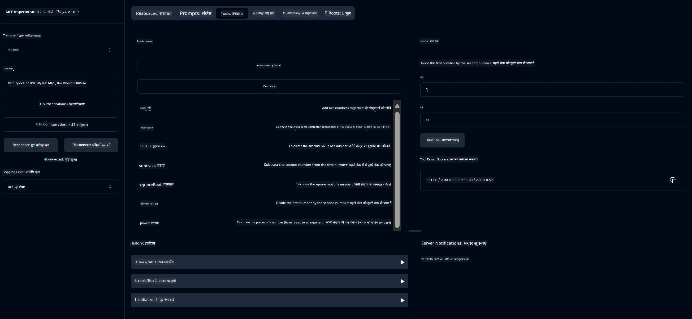

# बेसिक कैलकुलेटर MCP सेवा

> [!NOTE]
> यह Java समाधान लेगेसी HTTP+SSE ट्रांसपोर्ट का उपयोग करता है और एक SDK को लक्षित करता है
> जो MCP `2025-11-25` के अनुरूप है। इसे कोर्स कोड के साथ मेल खाने के लिए रखा गया है;
> नए रिमोट सर्वर को `2026-07-28` स्ट्रीमेबल HTTP सपोर्ट का उपयोग करना चाहिए।

यह सेवा Model Context Protocol (MCP) के माध्यम से बेसिक कैलकुलेटर ऑपरेशंस प्रदान करती है, जो Spring Boot के WebFlux ट्रांसपोर्ट का उपयोग करती है। यह MCP इम्प्लीमेंटेशन सीखने वाले शुरुआती लोगों के लिए एक सरल उदाहरण के रूप में डिज़ाइन की गई है।

अधिक जानकारी के लिए, देखें [MCP Server Boot Starter](https://docs.spring.io/spring-ai/reference/api/mcp/mcp-server-boot-starter-docs.html) संदर्भ दस्तावेज़।


## सेवा का उपयोग करना

सेवा MCP प्रोटोकॉल के माध्यम से निम्न API एंडपॉइंट प्रदान करती है:

- `add(a, b)`: दो नंबरों को जोड़ना
- `subtract(a, b)`: पहले नंबर में से दूसरे नंबर को घटाना
- `multiply(a, b)`: दो नंबरों को गुणा करना
- `divide(a, b)`: पहले नंबर को दूसरे नंबर से भाग देना (शून्य की जांच के साथ)
- `power(base, exponent)`: किसी नंबर की घात निकालना
- `squareRoot(number)`: वर्गमूल निकालना (ऋणात्मक संख्या की जांच के साथ)
- `modulus(a, b)`: विभाजन के बाद शेषफल निकालना
- `absolute(number)`: परिमित मान निकालना

## निर्भरता

प्रोजेक्ट के लिए निम्न प्रमुख निर्भरताएँ आवश्यक हैं:

```xml
<dependency>
    <groupId>org.springframework.ai</groupId>
    <artifactId>spring-ai-starter-mcp-server-webflux</artifactId>
</dependency>
```

## प्रोजेक्ट बनाना

Maven का उपयोग करके प्रोजेक्ट बनाएं:
```bash
./mvnw clean install -DskipTests
```

## सर्वर चलाना

### Java का उपयोग करना

```bash
java -jar target/calculator-server-0.0.1-SNAPSHOT.jar
```

### MCP इंस्पेक्टर का उपयोग करना

MCP इंस्पेक्टर MCP सेवाओं के साथ बातचीत करने के लिए एक उपयोगी उपकरण है। इस कैलकुलेटर सेवा के साथ इसका उपयोग करने के लिए:

1. **MCP इंस्पेक्टर इंस्टॉल और चलाएं** एक नए टर्मिनल विंडो में:
   ```bash
   npx @modelcontextprotocol/inspector
   ```

2. **वेब UI एक्सेस करें** ऐप द्वारा प्रदर्शित URL पर क्लिक करके (आमतौर पर http://localhost:6274)

3. **कनेक्शन कॉन्फ़िगर करें**:
   - ट्रांसपोर्ट प्रकार को "SSE" सेट करें
   - URL को अपने चल रहे सर्वर के SSE एंडपॉइंट पर सेट करें: `http://localhost:8080/sse`
   - "Connect" पर क्लिक करें

4. **टूल्स का उपयोग करें**:
   - उपलब्ध कैलकुलेटर ऑपरेशंस देखने के लिए "List Tools" पर क्लिक करें
   - किसी टूल को चुनें और ऑपरेशन निष्पादित करने के लिए "Run Tool" पर क्लिक करें



---

<!-- CO-OP TRANSLATOR DISCLAIMER START -->
**अस्वीकरण**:
इस दस्तावेज़ का अनुवाद AI अनुवाद सेवा [Co-op Translator](https://github.com/Azure/co-op-translator) का उपयोग करके किया गया है। जबकि हम सटीकता के लिए प्रयास करते हैं, कृपया ध्यान दें कि स्वचालित अनुवादों में त्रुटियाँ या अशुद्धियाँ हो सकती हैं। मूल दस्तावेज़ अपनी मूल भाषा में ही प्रामाणिक स्रोत माना जाना चाहिए। महत्वपूर्ण जानकारी के लिए, पेशेवर मानव अनुवाद की सिफारिश की जाती है। इस अनुवाद के उपयोग से उत्पन्न किसी भी गलतफहमी या गलत व्याख्या के लिए हम उत्तरदायी नहीं हैं।
<!-- CO-OP TRANSLATOR DISCLAIMER END -->