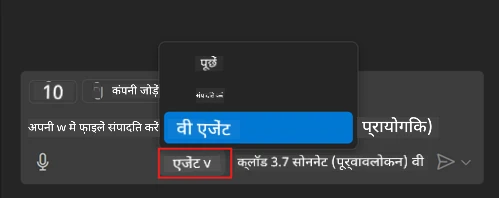
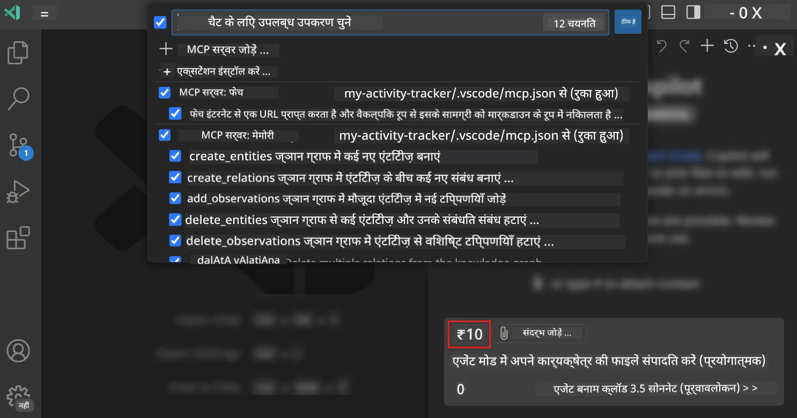
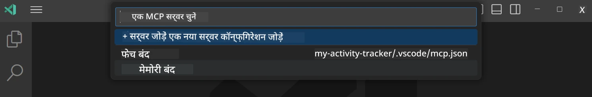
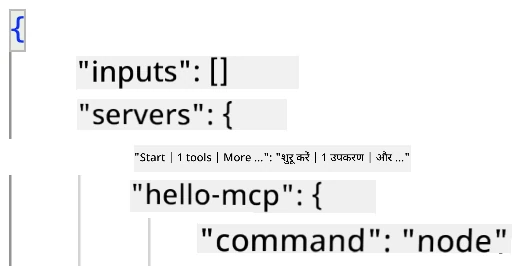
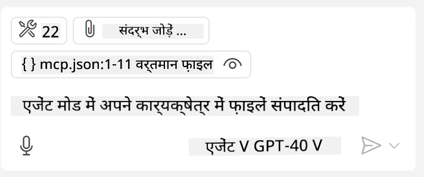
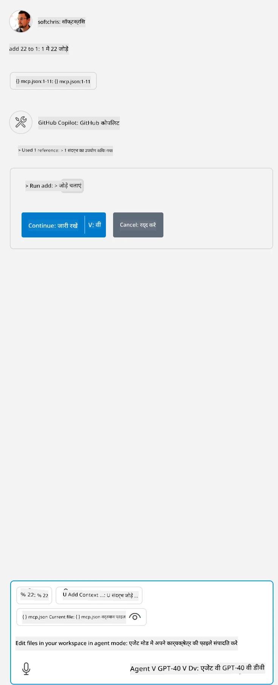

# GitHub Copilot एजेंट मोड से एक सर्वर का उपभोग करना

Visual Studio Code और GitHub Copilot एक क्लाइंट के रूप में कार्य कर सकते हैं और एक MCP सर्वर का उपभोग कर सकते हैं। आप पूछ सकते हैं कि हम ऐसा क्यों करना चाहेंगे? खैर, इसका मतलब है कि MCP सर्वर की जो भी विशेषताएं हैं, उन्हें अब आपके IDE के भीतर से उपयोग किया जा सकता है। कल्पना कीजिये कि आप उदाहरण के लिए GitHub का MCP सर्वर जोड़ रहे हैं, यह टर्मिनल में विशिष्ट आदेश टाइप करने के बजाय प्रॉम्प्ट के माध्यम से GitHub को नियंत्रित करने की अनुमति देगा। या सामान्य रूप में कुछ भी जो आपके डेवलपर अनुभव को बेहतर बना सकता है, वह सभी प्राकृतिक भाषा द्वारा नियंत्रित हो। अब आप जीत देखना शुरू करते हैं, है ना?

## अवलोकन

यह पाठ Visual Studio Code और GitHub Copilot के एजेंट मोड को आपके MCP सर्वर के लिए एक क्लाइंट के रूप में उपयोग करने का तरीका कवर करता है।

## सीखने के उद्देश्य

इस पाठ के अंत तक, आप सक्षम होंगे:

- Visual Studio Code के माध्यम से एक MCP सर्वर का उपभोग करना।
- GitHub Copilot के जरिए उपकरणों जैसी क्षमताओं को चलाना।
- Visual Studio Code को कॉन्फ़िगर करना ताकि वह आपके MCP सर्वर को खोज सके और प्रबंधित कर सके।

## उपयोग

आप दो अलग-अलग तरीकों से अपने MCP सर्वर को नियंत्रित कर सकते हैं:

- उपयोगकर्ता इंटरफ़ेस, आप देखेंगे कि इसे बाद में इस अध्याय में कैसे किया जाता है।
- टर्मिनल, `code` निष्पादन योग्य का उपयोग करके टर्मिनल से चीजों को नियंत्रित करना संभव है:

  अपने उपयोगकर्ता प्रोफ़ाइल में MCP सर्वर जोड़ने के लिए, --add-mcp कमांड लाइन विकल्प का उपयोग करें, और JSON सर्वर कॉन्फ़िगरेशन प्रदान करें जैसे {"name":"server-name","command":...}।

  ```
  code --add-mcp "{\"name\":\"my-server\",\"command\": \"uvx\",\"args\": [\"mcp-server-fetch\"]}"
  ```

### स्क्रीनशॉट्स





आइए अगले अनुभागों में हम विज़ुअल इंटरफ़ेस का उपयोग कैसे करते हैं इस पर और बात करें।

## दृष्टिकोण

उच्च स्तर पर हमें इसे इस प्रकार लेना होगा:

- एक फ़ाइल कॉन्फ़िगर करें ताकि हमारा MCP सर्वर मिल सके।
- उक्त सर्वर को स्टार्ट/कनेक्ट करें ताकि वह अपनी क्षमताओं की सूची दिखा सके।
- GitHub Copilot चैट इंटरफ़ेस के माध्यम से उन क्षमताओं का उपयोग करें।

बढ़िया, अब जब हम फ्लो समझ गए हैं, तो आइए एक अभ्यास के माध्यम से Visual Studio Code के जरिए MCP सर्वर का उपयोग करें।

## अभ्यास: एक सर्वर का उपभोग करना

इस अभ्यास में, हम Visual Studio Code को आपके MCP सर्वर को खोजने के लिए कॉन्फ़िगर करेंगे ताकि इसे GitHub Copilot चैट इंटरफ़ेस से उपयोग किया जा सके।

### -0- प्रीस्टेप, MCP सर्वर डिस्कवरी सक्षम करें

आपको MCP सर्वरों की खोज सक्षम करने की आवश्यकता हो सकती है।

1. Visual Studio Code में `File -> Preferences -> Settings` पर जाएं।

1. "MCP" खोजें और settings.json फ़ाइल में `chat.mcp.discovery.enabled` सक्षम करें।

### -1- कॉन्फ़िग फ़ाइल बनाएं

अपने प्रोजेक्ट रूट में एक कॉन्फ़िग फ़ाइल बनाएं, आपको MCP.json नाम की फ़ाइल बनानी होगी और इसे .vscode नामक फ़ोल्डर में रखना होगा। इसका स्वरूप कुछ इस प्रकार होगा:

```text
.vscode
|-- mcp.json
```

अब देखते हैं कि हम एक सर्वर प्रविष्टि कैसे जोड़ सकते हैं।

### -2- एक सर्वर कॉन्फ़िगर करें

*mcp.json* में निम्न सामग्री जोड़ें:

```json
{
    "inputs": [],
    "servers": {
       "hello-mcp": {
           "command": "node",
           "args": [
               "build/index.js"
           ]
       }
    }
}
```

ऊपर एक सरल उदाहरण है कि Node.js में लिखे गए सर्वर को कैसे शुरू किया जाए, अन्य रनटाइम्स के लिए `command` और `args` का उपयोग करके सर्वर शुरू करने के लिए उचित कमांड इंगित करें।

### -3- सर्वर शुरू करें

अब जब आप एक प्रविष्टि जोड़ चुके हैं, तो सर्वर शुरू करें:

1. *mcp.json* में अपनी प्रविष्टि खोजें और सुनिश्चित करें कि आप "play" आइकन देखें:

    

1. "play" आइकन पर क्लिक करें, आप GitHub Copilot Chat में टूल के आइकन को बढ़ता हुआ देखेंगे जो उपलब्ध टूल की संख्या बढ़ाएगा। यदि आप उक्त टूल आइकन पर क्लिक करते हैं, तो आपको पंजीकृत टूल की सूची दिखाई देगी। आप प्रत्येक टूल को चेक/अनचेक कर सकते हैं यह तय करने के लिए कि GitHub Copilot इन्हें संदर्भ के रूप में उपयोग करे या नहीं:

  

1. किसी टूल को चलाने के लिए, उस प्रॉम्प्ट को टाइप करें जिसे आप जानते हैं कि वह आपके टूल के वर्णन से मेल खाता है, उदाहरण के लिए ऐसा प्रॉम्प्ट "add 22 to 1":

  

  आपको 23 के उत्तर के रूप में दिखाई देना चाहिए।

## असाइनमेंट

अपने *mcp.json* फ़ाइल में एक सर्वर प्रविष्टि जोड़ें और सुनिश्चित करें कि आप सर्वर को शुरू/रोक सकते हैं। साथ ही देखें कि आप GitHub Copilot चैट इंटरफ़ेस के जरिए अपने सर्वर के टूल्स से संवाद कर सकते हैं।

## समाधान

[समाधान](./solution/README.md)

## मुख्य निष्कर्ष

इस अध्याय से निष्कर्ष यह हैं:

- Visual Studio Code एक शानदार क्लाइंट है जो आपको कई MCP सर्वर और उनके टूल्स का उपभोग करने देता है।
- GitHub Copilot चैट इंटरफ़ेस के माध्यम से आप सर्वरों से बातचीत करते हैं।
- आप उपयोगकर्ता से API कुंजी जैसी इनपुट के लिए प्रॉम्प्ट कर सकते हैं जिन्हें MCP सर्वर को *mcp.json* फ़ाइल में सर्वर प्रविष्टि कॉन्फ़िगर करते समय पास किया जा सकता है।

## नमूने

- [Java Calculator](../samples/java/calculator/README.md)
- [.Net Calculator](../../../../03-GettingStarted/samples/csharp)
- [JavaScript Calculator](../samples/javascript/README.md)
- [TypeScript Calculator](../samples/typescript/README.md)
- [Python Calculator](../../../../03-GettingStarted/samples/python)

## अतिरिक्त संसाधन

- [Visual Studio दस्तावेज़](https://code.visualstudio.com/docs/copilot/chat/mcp-servers)

## आगे क्या

- अगला: [एक stdio सर्वर बनाना](../05-stdio-server/README.md)

---

<!-- CO-OP TRANSLATOR DISCLAIMER START -->
**अस्वीकरण**:
इस दस्तावेज़ का अनुवाद AI अनुवाद सेवा [Co-op Translator](https://github.com/Azure/co-op-translator) का उपयोग करके किया गया है। जबकि हम सटीकता के लिए प्रयास करते हैं, कृपया ध्यान दें कि स्वचालित अनुवादों में त्रुटियाँ या अशुद्धियाँ हो सकती हैं। मूल दस्तावेज़ अपनी मूल भाषा में ही प्रामाणिक स्रोत माना जाना चाहिए। महत्वपूर्ण जानकारी के लिए, पेशेवर मानव अनुवाद की सिफारिश की जाती है। इस अनुवाद के उपयोग से उत्पन्न किसी भी गलतफहमी या गलत व्याख्या के लिए हम उत्तरदायी नहीं हैं।
<!-- CO-OP TRANSLATOR DISCLAIMER END -->