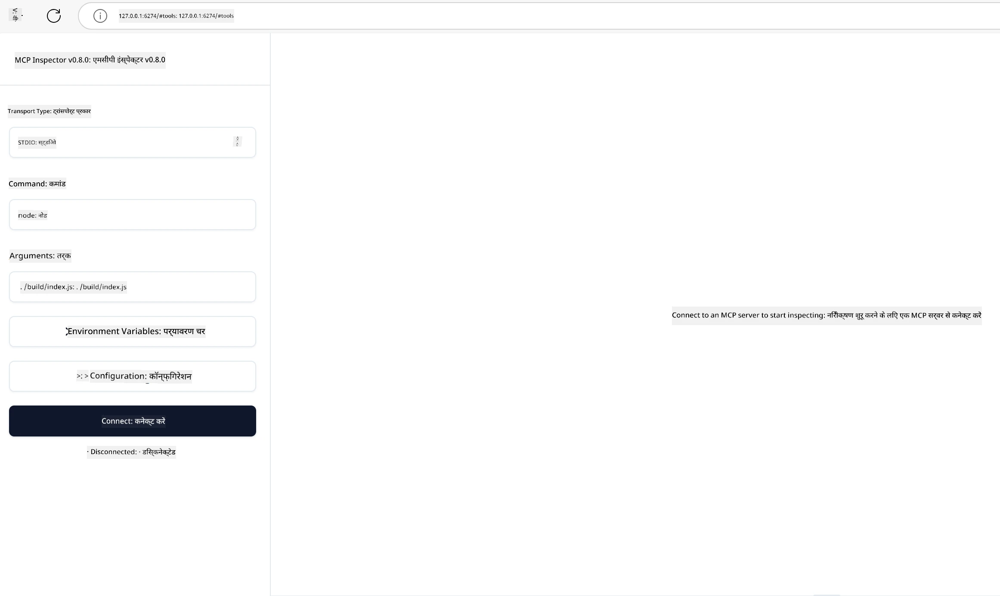

## परीक्षण और डिबगिंग

अपने MCP सर्वर का परीक्षण शुरू करने से पहले, उपलब्ध उपकरणों और डिबगिंग के लिए सर्वश्रेष्ठ प्रथाओं को समझना महत्वपूर्ण है। प्रभावी परीक्षण यह सुनिश्चित करता है कि आपका सर्वर अपेक्षित व्यवहार करता है और आपको जल्दी से समस्याएं पहचानने और हल करने में मदद करता है। निम्नलिखित अनुभाग आपके MCP कार्यान्वयन को मान्य करने के लिए अनुशंसित दृष्टिकोणों को प्रस्तुत करता है।

## अवलोकन

यह पाठ सही परीक्षण दृष्टिकोण और सबसे प्रभावी परीक्षण उपकरण कैसे चुनें, इस पर चर्चा करता है।

## सीखने के उद्देश्य

इस पाठ के अंत तक, आप सक्षम होंगे:

- परीक्षण के विभिन्न दृष्टिकोणों का वर्णन करें।
- प्रभावी रूप से अपने कोड का परीक्षण करने के लिए विभिन्न उपकरणों का उपयोग करें।


## MCP सर्वरों का परीक्षण

MCP ऐसे उपकरण प्रदान करता है जो आपको अपने सर्वरों का परीक्षण और डिबगिंग करने में मदद करते हैं:

- **MCP Inspector**: एक कमांड लाइन उपकरण जिसे CLI उपकरण के रूप में और विज़ुअल उपकरण के रूप में दोनों रूपों में चलाया जा सकता है।
- **मैनुअल परीक्षण**: आप curl जैसे उपकरण का उपयोग वेब अनुरोध चलाने के लिए कर सकते हैं, लेकिन HTTP चलाने में सक्षम कोई भी उपकरण चलेगा।
- **यूनिट परीक्षण**: आप दोनों सर्वर और क्लाइंट की सुविधाओं का परीक्षण करने के लिए अपने पसंदीदा परीक्षण फ्रेमवर्क का उपयोग कर सकते हैं।

### MCP Inspector का उपयोग करना

हमने पिछली पाठों में इस उपकरण के उपयोग का वर्णन किया है, लेकिन आइए इसे उच्च स्तर पर थोड़ा चर्चा करें। यह एक Node.js में निर्मित उपकरण है और आप इसे `npx` एक्सेम्पटेबल को कॉल करके उपयोग कर सकते हैं जो अस्थायी रूप से उपकरण को डाउनलोड और इंस्टॉल करेगा और आपकी अनुरोध चलाने के बाद खुद को साफ कर देगा।

[MCP Inspector](https://github.com/modelcontextprotocol/inspector) आपकी मदद करता है:

- **सर्वर क्षमताओं का पता लगाएं**: उपलब्ध संसाधन, उपकरण, और प्रॉम्प्ट का स्वचालित पता लगाएं
- **टूल निष्पादन का परीक्षण करें**: विभिन्न पैरामीटर आजमाएं और वास्तविक समय उत्तर देखें
- **सर्वर मेटाडेटा देखें**: सर्वर जानकारी, स्कीमाओं, और कॉन्फ़िगरेशन की जांच करें

उपकरण का एक सामान्य रन इस प्रकार दिखता है:

```bash
npx @modelcontextprotocol/inspector node build/index.js
```

ऊपर दिया गया कमांड एक MCP और उसका विज़ुअल इंटरफ़ेस शुरू करता है और आपके ब्राउज़र में एक स्थानीय वेब इंटरफ़ेस लॉन्च करता है। आप एक डैशबोर्ड देखने की उम्मीद कर सकते हैं जो आपके पंजीकृत MCP सर्वरों, उनके उपलब्ध उपकरणों, संसाधनों, और प्रॉम्प्ट्स को प्रदर्शित करता है। इंटरफ़ेस आपको इंटरैक्टिव रूप से टूल निष्पादन का परीक्षण करने, सर्वर मेटाडेटा का निरीक्षण करने, और वास्तविक समय उत्तर देखने की अनुमति देता है, जिससे आपके MCP सर्वर कार्यान्वयन को मान्य और डिबग करना आसान हो जाता है।

यह इस प्रकार दिखाई दे सकता है: 

आप इस उपकरण को CLI मोड में भी चला सकते हैं, जिसे आप `--cli` एट्रिब्यूट जोड़कर कर सकते हैं। यहाँ "CLI" मोड में उपकरण चलाने का एक उदाहरण है जो सर्वर पर सभी उपकरणों की सूची दिखाता है:

```sh
npx @modelcontextprotocol/inspector --cli node build/index.js --method tools/list
```

### मैनुअल परीक्षण

सर्वर क्षमताओं का परीक्षण करने के लिए इंस्पेक्टर उपकरण चलाने के अलावा, एक समान दृष्टिकोण यह है कि HTTP सक्षम क्लाइंट चलाएं, उदाहरण के लिए curl।

curl का उपयोग करके, आप सीधे HTTP अनुरोधों के माध्यम से MCP सर्वरों का परीक्षण कर सकते हैं:

```bash
# उदाहरण: टेस्ट सर्वर मेटाडेटा
curl http://localhost:3000/v1/metadata

# उदाहरण: एक उपकरण निष्पादित करें
curl -X POST http://localhost:3000/v1/tools/execute \
  -H "Content-Type: application/json" \
  -d '{"name": "calculator", "parameters": {"expression": "2+2"}}'
```

ऊपर दिए गए curl उपयोग से आप देख सकते हैं कि आप POST अनुरोध का उपयोग किसी उपकरण को चलाने के लिए करते हैं जिसमें उपकरण का नाम और उसके पैरामीटर शामिल होते हैं। वह तरीका चुनें जो आपके लिए सबसे उपयुक्त हो। आम तौर पर CLI उपकरण तेज़ होते हैं और इन्हें स्क्रिप्टेड करना आसान होता है, जो CI/CD वातावरण में उपयोगी हो सकता है।

### यूनिट परीक्षण

अपने उपकरणों और संसाधनों के लिए यूनिट टेस्ट बनाएं ताकि वे अपेक्षित रूप से काम करते रहें। यहाँ कुछ उदाहरण परीक्षण कोड है।

```python
import pytest

from mcp.server.fastmcp import FastMCP
from mcp.shared.memory import (
    create_connected_server_and_client_session as create_session,
)

# पूरे मॉड्यूल को एसिंक्रोनस परीक्षणों के लिए चिह्नित करें
pytestmark = pytest.mark.anyio


async def test_list_tools_cursor_parameter():
    """Test that the cursor parameter is accepted for list_tools.

    Note: FastMCP doesn't currently implement pagination, so this test
    only verifies that the cursor parameter is accepted by the client.
    """

 server = FastMCP("test")

    # कुछ परीक्षण उपकरण बनाएं
    @server.tool(name="test_tool_1")
    async def test_tool_1() -> str:
        """First test tool"""
        return "Result 1"

    @server.tool(name="test_tool_2")
    async def test_tool_2() -> str:
        """Second test tool"""
        return "Result 2"

    async with create_session(server._mcp_server) as client_session:
        # कर्सर पैरामीटर के बिना परीक्षण करें (छोड़ दिया गया)
        result1 = await client_session.list_tools()
        assert len(result1.tools) == 2

        # कर्सर=None के साथ परीक्षण करें
        result2 = await client_session.list_tools(cursor=None)
        assert len(result2.tools) == 2

        # कर्सर को स्ट्रिंग के रूप में टेस्ट करें
        result3 = await client_session.list_tools(cursor="some_cursor_value")
        assert len(result3.tools) == 2

        # खाली स्ट्रिंग कर्सर के साथ परीक्षण करें
        result4 = await client_session.list_tools(cursor="")
        assert len(result4.tools) == 2
    
```

पिछले कोड में निम्न कार्य होते हैं:

- pytest फ्रेमवर्क का उपयोग करता है जो आपको कार्यों के रूप में परीक्षण बनाने और assert कथनों का उपयोग करने देता है।
- दो विभिन्न उपकरणों के साथ एक MCP सर्वर बनाता है।
- सुनिश्चित करता है कि कुछ शर्तें पूरी हों, इसके लिए `assert` कथन का उपयोग करता है।

[पूर्ण फ़ाइल यहाँ देखें](https://github.com/modelcontextprotocol/python-sdk/blob/main/tests/client/test_list_methods_cursor.py)

ऊपर दी गई फ़ाइल के अनुसार, आप अपने सर्वर का परीक्षण कर सकते हैं ताकि यह सुनिश्चित हो सके कि क्षमताएं ठीक से बनाई गई हैं।

सभी प्रमुख SDK में इसी तरह के परीक्षण अनुभाग होते हैं ताकि आप अपने चुने हुए रनटाइम के लिए समायोजित कर सकें।

## नमूने

- [Java Calculator](../samples/java/calculator/README.md)
- [.Net Calculator](../../../../03-GettingStarted/samples/csharp)
- [JavaScript Calculator](../samples/javascript/README.md)
- [TypeScript Calculator](../samples/typescript/README.md)
- [Python Calculator](../../../../03-GettingStarted/samples/python)

## अतिरिक्त संसाधन

- [Python SDK](https://github.com/modelcontextprotocol/python-sdk)

## आगे क्या है

- अगला: [डिप्लॉयमेंट](../09-deployment/README.md)

---

<!-- CO-OP TRANSLATOR DISCLAIMER START -->
**अस्वीकरण**:
इस दस्तावेज़ का अनुवाद AI अनुवाद सेवा [Co-op Translator](https://github.com/Azure/co-op-translator) का उपयोग करके किया गया है। जबकि हम सटीकता के लिए प्रयास करते हैं, कृपया ध्यान दें कि स्वचालित अनुवादों में त्रुटियाँ या अशुद्धियाँ हो सकती हैं। मूल दस्तावेज़ अपनी मूल भाषा में ही प्रामाणिक स्रोत माना जाना चाहिए। महत्वपूर्ण जानकारी के लिए, पेशेवर मानव अनुवाद की सिफारिश की जाती है। इस अनुवाद के उपयोग से उत्पन्न किसी भी गलतफहमी या गलत व्याख्या के लिए हम उत्तरदायी नहीं हैं।
<!-- CO-OP TRANSLATOR DISCLAIMER END -->