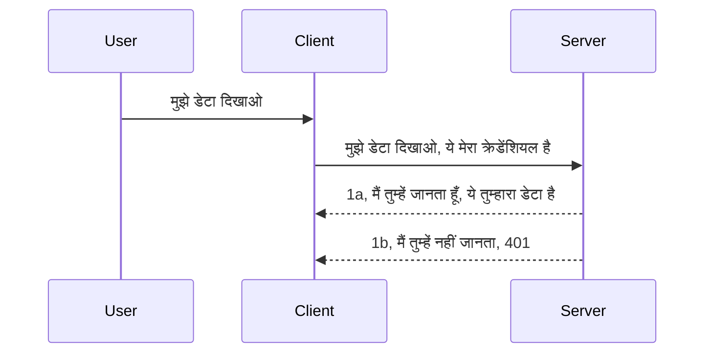

# सरल प्रमाणीकरण

MCP SDKs OAuth 2.1 के उपयोग का समर्थन करते हैं, जो कि एक जटिल प्रक्रिया है जिसमें ऑथ सर्वर, रिसोर्स सर्वर, क्रेडेंशियल्स भेजना, कोड प्राप्त करना, कोड को बेयरर टोकन के लिए एक्सचेंज करना शामिल है जब तक कि आप अंततः अपने रिसोर्स डेटा तक पहुंच न प्राप्त कर लें। अगर आप OAuth के इस्तेमाल के अभ्यस्त नहीं हैं, जो कि लागू करने के लिए एक बहुत अच्छी चीज़ है, तो कुछ बुनियादी स्तर के प्रमाणीकरण से शुरू करना और बेहतर सुरक्षा की ओर बढ़ना एक अच्छा विचार है। इसी कारण यह अध्याय मौजूद है, ताकि आप अधिक उन्नत प्रमाणीकरण की ओर बढ़ सकें।

## प्रमाणीकरण, हम क्या मतलब करते हैं?

प्रमाणीकरण और प्राधिकरण के लिए शॉर्ट फॉर्म है ऑथ। विचार यह है कि हमें दो चीजें करनी हैं:

- **प्रमाणीकरण**, जो यह सुनिश्चित करने की प्रक्रिया है कि हम किसी व्यक्ति को हमारे घर में आने देते हैं या नहीं, कि उनके पास "यहाँ" होने का अधिकार है, अर्थात् हमारे MCP सर्वर की विशेषताओं वाले रिसोर्स सर्वर तक पहुंच है।
- **प्राधिकरण**, यह पता लगाने की प्रक्रिया है कि क्या उपयोगकर्ता को वे विशिष्ट संसाधन देखने की अनुमति होनी चाहिए जिनके लिए वे अनुरोध कर रहे हैं, उदाहरण के लिए ये ऑर्डर या ये उत्पाद, या क्या वे सामग्री पढ़ सकते हैं लेकिन उसे मिटा नहीं सकते, जैसा कि एक और उदाहरण है।

## क्रेडेंशियल्स: हम सिस्टम को कैसे बताते हैं कि हम कौन हैं

अधिकांश वेब डेवलपर्स आमतौर पर सर्वर को एक क्रेडेंशियल प्रदान करने के बारे में सोचते हैं, आमतौर पर एक सीक्रेट जो बताता है कि क्या वे यहाँ होने की अनुमति प्राप्त हैं "प्रमाणीकरण"। यह क्रेडेंशियल आमतौर पर उपयोगकर्ता नाम और पासवर्ड के बेस64 एन्कोडेड संस्करण या एक API कुंजी होती है जो विशिष्ट उपयोगकर्ता की पहचान करती है।

यह एक हेडर "Authorization" के माध्यम से भेजा जाता है इस प्रकार:

```json
{ "Authorization": "secret123" }
```

इसे आमतौर पर बेसिक ऑथेंटिकेशन कहा जाता है। कुल प्रवाह काम करता है निम्नलिखित तरीके से:


अब जब हम समझ गए हैं कि यह प्रवाह की दृष्टि से कैसे काम करता है, तो हम इसे कैसे लागू करें? अधिकांश वेब सर्वरों के पास मिडलवेयर का एक कॉन्सेप्ट होता है, कोड का एक हिस्सा जो अनुरोध के दौरान चलाया जाता है जो क्रेडेंशियल्स की जांच कर सकता है, और यदि क्रेडेंशियल्स वैध हैं तो अनुरोध को पास कर सकता है। अगर अनुरोध में वैध क्रेडेंशियल्स नहीं हैं तो आपको ऑथ त्रुटि मिलती है। देखें कि इसे कैसे लागू किया जा सकता है:

**Python**

```python
class AuthMiddleware(BaseHTTPMiddleware):
    async def dispatch(self, request, call_next):

        has_header = request.headers.get("Authorization")
        if not has_header:
            print("-> Missing Authorization header!")
            return Response(status_code=401, content="Unauthorized")

        if not valid_token(has_header):
            print("-> Invalid token!")
            return Response(status_code=403, content="Forbidden")

        print("Valid token, proceeding...")
       
        response = await call_next(request)
        # प्रतिक्रिया में कोई भी कस्टमर हेडर जोड़ें या किसी भी प्रकार का परिवर्तन करें
        return response


starlette_app.add_middleware(CustomHeaderMiddleware)
```

यहाँ हमारे पास है:

- `AuthMiddleware` नामक एक मिडलवेयर बनाया गया है जहाँ इसका `dispatch` मेथड वेब सर्वर द्वारा कॉल किया जाता है।
- मिडलवेयर को वेब सर्वर में जोड़ा गया:

    ```python
    starlette_app.add_middleware(AuthMiddleware)
    ```

- प्रमाणीकरण जांच लिखी गई है जो जांचती है कि Authorization हेडर मौजूद है और भेजा गया सीक्रेट वैध है या नहीं:

    ```python
    has_header = request.headers.get("Authorization")
    if not has_header:
        print("-> Missing Authorization header!")
        return Response(status_code=401, content="Unauthorized")

    if not valid_token(has_header):
        print("-> Invalid token!")
        return Response(status_code=403, content="Forbidden")
    ```

    यदि सीक्रेट मौजूद और वैध है तो हम `call_next` कॉल करके अनुरोध को पास करते हैं और उत्तर लौटाते हैं।

    ```python
    response = await call_next(request)
    # कोई भी ग्राहक हेडर जोड़ें या प्रतिक्रिया में किसी प्रकार का परिवर्तन करें
    return response
    ```

यह काम करता है कि जब वेब अनुरोध सर्वर की ओर किया जाता है, तो मिडलवेयर कॉल होगा और अपनी कार्यप्रणाली के अनुसार अनुरोध को पास कर देगा या त्रुटि लौटाएगा जो संकेत करता है कि क्लाइंट को अनुमति नहीं है।

**TypeScript**

यहाँ हम Express फ्रेमवर्क के साथ मिडलवेयर बनाते हैं और अनुरोध को MCP सर्वर तक पहुँचने से पहले इंटरसेप्ट करते हैं। कोड इस प्रकार है:

```typescript
function isValid(secret) {
    return secret === "secret123";
}

app.use((req, res, next) => {
    // 1. प्राधिकरण हेडर मौजूद है?
    if(!req.headers["Authorization"]) {
        res.status(401).send('Unauthorized');
    }
    
    let token = req.headers["Authorization"];

    // 2. वैधता जांचें।
    if(!isValid(token)) {
        res.status(403).send('Forbidden');
    }

   
    console.log('Middleware executed');
    // 3. अनुरोध को अनुरोध पाइपलाइन के अगले चरण को पास करता है।
    next();
});
```

इस कोड में हम:

1. सबसे पहले जांचते हैं कि Authorization हेडर मौजूद है, यदि नहीं, तो 401 त्रुटि भेजते हैं।
2. क्रेडेंशियल/टोकन वैध है या नहीं, यदि नहीं, तो 403 त्रुटि भेजते हैं।
3. अंत में अनुरोध पाइपलाइन में अनुरोध को आगे बढ़ाते हैं और मांगे गए संसाधन को वापस करते हैं।

## अभ्यास: प्रमाणीकरण लागू करें

आइए अपने ज्ञान का उपयोग करते हुए इसे लागू करने का प्रयास करें। योजना इस प्रकार है:

सर्वर

- एक वेब सर्वर और MCP इंस्टेंस बनाएँ।
- सर्वर के लिए एक मिडलवेयर लागू करें।

क्लाइंट

- हेडर के माध्यम से क्रेडेंशियल के साथ वेब अनुरोध भेजें।

### -1- एक वेब सर्वर और MCP इंस्टेंस बनाएँ

पहले चरण में, हमें वेब सर्वर इंस्टेंस और MCP सर्वर बनाना होगा।

**Python**

यहाँ हम MCP सर्वर इंस्टेंस बनाते हैं, एक starlette वेब ऐप बनाते हैं और इसे uvicorn के साथ होस्ट करते हैं।

```python
# MCP सर्वर बना रहे हैं

app = FastMCP(
    name="MCP Resource Server",
    instructions="Resource Server that validates tokens via Authorization Server introspection",
    host=settings["host"],
    port=settings["port"],
    debug=True
)

# स्टारलेट वेब ऐप बना रहे हैं
starlette_app = app.streamable_http_app()

# ऐप को uvicorn के माध्यम से सर्व कर रहे हैं
async def run(starlette_app):
    import uvicorn
    config = uvicorn.Config(
            starlette_app,
            host=app.settings.host,
            port=app.settings.port,
            log_level=app.settings.log_level.lower(),
        )
    server = uvicorn.Server(config)
    await server.serve()

run(starlette_app)
```

इस कोड में:

- MCP सर्वर बनाते हैं।
- MCP सर्वर से starlette वेब ऐप का निर्माण करते हैं, `app.streamable_http_app()`.
- uvicorn `server.serve()` का उपयोग करके वेब ऐप को होस्ट और सर्व करते हैं।

**TypeScript**

यहाँ MCP सर्वर इंस्टेंस बनाया गया है।

```typescript
const server = new McpServer({
      name: "example-server",
      version: "1.0.0"
    });

    // ... सर्वर संसाधनों, उपकरणों, और प्रॉम्प्ट्स को सेट अप करें ...
```

यह MCP सर्वर निर्माण POST /mcp रूट परिभाषा के भीतर होना चाहिए, तो ऊपर दिए कोड को इस प्रकार हिलाते हैं:

```typescript
import express from "express";
import { randomUUID } from "node:crypto";
import { McpServer } from "@modelcontextprotocol/sdk/server/mcp.js";
import { StreamableHTTPServerTransport } from "@modelcontextprotocol/sdk/server/streamableHttp.js";
import { isInitializeRequest } from "@modelcontextprotocol/sdk/types.js"

const app = express();
app.use(express.json());

// सत्र आईडी द्वारा ट्रांसपोर्ट्स को स्टोर करने के लिए मानचित्र
const transports: { [sessionId: string]: StreamableHTTPServerTransport } = {};

// क्लाइंट-से-सर्वर संचार के लिए POST अनुरोधों को संभालें
app.post('/mcp', async (req, res) => {
  // मौजूदा सत्र आईडी जांचें
  const sessionId = req.headers['mcp-session-id'] as string | undefined;
  let transport: StreamableHTTPServerTransport;

  if (sessionId && transports[sessionId]) {
    // मौजूदा ट्रांसपोर्ट पुन: उपयोग करें
    transport = transports[sessionId];
  } else if (!sessionId && isInitializeRequest(req.body)) {
    // नया इनिशियलाइजेशन अनुरोध
    transport = new StreamableHTTPServerTransport({
      sessionIdGenerator: () => randomUUID(),
      onsessioninitialized: (sessionId) => {
        // सत्र आईडी द्वारा ट्रांसपोर्ट स्टोर करें
        transports[sessionId] = transport;
      },
      // DNS रिबाइंडिंग सुरक्षा पिछड़े अनुकूलता के लिए डिफ़ॉल्ट रूप से अक्षम है। यदि आप यह सर्वर
      // स्थानीय रूप से चला रहे हैं, तो सुनिश्चित करें कि आप सेट करें:
      // enableDnsRebindingProtection: true,
      // allowedHosts: ['127.0.0.1'],
    });

    // बंद होने पर ट्रांसपोर्ट साफ़ करें
    transport.onclose = () => {
      if (transport.sessionId) {
        delete transports[transport.sessionId];
      }
    };
    const server = new McpServer({
      name: "example-server",
      version: "1.0.0"
    });

    // ... सर्वर संसाधनों, उपकरणों और प्रांप्ट्स को सेट अप करें ...

    // MCP सर्वर से कनेक्ट करें
    await server.connect(transport);
  } else {
    // अमान्य अनुरोध
    res.status(400).json({
      jsonrpc: '2.0',
      error: {
        code: -32000,
        message: 'Bad Request: No valid session ID provided',
      },
      id: null,
    });
    return;
  }

  // अनुरोध को संभालें
  await transport.handleRequest(req, res, req.body);
});

// GET और DELETE अनुरोधों के लिए पुन: प्रयोज्य हैंडलर
const handleSessionRequest = async (req: express.Request, res: express.Response) => {
  const sessionId = req.headers['mcp-session-id'] as string | undefined;
  if (!sessionId || !transports[sessionId]) {
    res.status(400).send('Invalid or missing session ID');
    return;
  }
  
  const transport = transports[sessionId];
  await transport.handleRequest(req, res);
};

// SSE के माध्यम से सर्वर-से-क्लाइंट सूचनाओं के लिए GET अनुरोधों को संभालें
app.get('/mcp', handleSessionRequest);

// सत्र समाप्ति के लिए DELETE अनुरोधों को संभालें
app.delete('/mcp', handleSessionRequest);

app.listen(3000);
```

अब आप देख सकते हैं कि MCP सर्वर निर्माण `app.post("/mcp")` के अंदर चला गया है।

आइए अगला कदम लें, मिडलवेयर बनाएं ताकि हम आने वाले क्रेडेंशियल को मान्य कर सकें।

### -2- सर्वर के लिए मिडलवेयर लागू करें

अब मिडलवेयर भाग पर आते हैं। यहाँ हम ऐसा मिडलवेयर बनाएंगे जो `Authorization` हेडर में क्रेडेंशियल देखेगा और उसे मान्य करेगा। यदि यह स्वीकार्य है, तो अनुरोध आगे बढ़ेगा और आवश्यक कार्य करेगा (जैसे उपकरण सूचीबद्ध करना, किसी संसाधन को पढ़ना या जो भी MCP क्लाइंट मांग रहा है)।

**Python**

मिडलवेयर बनाने के लिए, हमें एक क्लास बनानी होगी जो `BaseHTTPMiddleware` से विरासत में हो। दो महत्वपूर्ण चीजें हैं:

- अनुरोध `request`, जिससे हम हेडर जानकारी पढ़ते हैं।
- `call_next` वह कॉलबैक जिसे हमें कॉल करना है यदि क्लाइंट ने ऐसी क्रेडेंशियल भेजी है जिसे हम स्वीकार करते हैं।

पहले, हमें यह संभालना होगा कि `Authorization` हेडर गायब हो तो क्या करें:

```python
has_header = request.headers.get("Authorization")

# कोई हेडर मौजूद नहीं है, 401 के साथ असफल हो जाएं, अन्यथा आगे बढ़ें।
if not has_header:
    print("-> Missing Authorization header!")
    return Response(status_code=401, content="Unauthorized")
```

यहाँ हम 401 अनऑथराइज़्ड संदेश भेजते हैं क्योंकि क्लाइंट प्रमाणीकरण में विफल हो गया है।

फिर यदि कोई क्रेडेंशियल भेजा गया है, तो हमें इसकी वैधता इस प्रकार जांचनी होगी:

```python
 if not valid_token(has_header):
    print("-> Invalid token!")
    return Response(status_code=403, content="Forbidden")
```

ध्यान दें कि ऊपर हमने 403 फोर्बिडन संदेश भेजा है। पूरा मिडलवेयर नीचे देखें जो सब कुछ लागू करता है:

```python
class AuthMiddleware(BaseHTTPMiddleware):
    async def dispatch(self, request, call_next):

        has_header = request.headers.get("Authorization")
        if not has_header:
            print("-> Missing Authorization header!")
            return Response(status_code=401, content="Unauthorized")

        if not valid_token(has_header):
            print("-> Invalid token!")
            return Response(status_code=403, content="Forbidden")

        print("Valid token, proceeding...")
        print(f"-> Received {request.method} {request.url}")
        response = await call_next(request)
        response.headers['Custom'] = 'Example'
        return response

```

बहुत बढ़िया, लेकिन `valid_token` फ़ंक्शन क्या है? यहाँ है:

```python
# उत्पादन के लिए इसका उपयोग न करें - इसे सुधारें !!
def valid_token(token: str) -> bool:
    # "Bearer " उपसर्ग हटा दें
    if token.startswith("Bearer "):
        token = token[7:]
        return token == "secret-token"
    return False
```

यह स्पष्ट रूप से सुधार की गुंजाइश है।

महत्वपूर्ण: आपको कभी भी इस तरह का सीक्रेट कोड में नहीं रखना चाहिए। आपको आदर्श रूप से इसे डेटा स्रोत या कोई IDP (पहचान सेवा प्रदाता) से प्राप्त करना चाहिए या बेहतर यह कि IDP स्वयं मान्यता करे।

**TypeScript**

Express के साथ इसे लागू करने के लिए, हमें `use` मेथड कॉल करना होगा जो मिडलवेयर फ़ंक्शन लेता है।

हमें करना होगा:

- अनुरोध वेरिएबल के साथ इंटरैक्ट करना और `Authorization` प्रॉपर्टी में पास किए गए क्रेडेंशियल की जांच करनी है।
- क्रेडेंशियल को मान्य करना, और यदि ठीक है तो अनुरोध को आगे बढ़ने देना और MCP क्लाइंट के अनुरोध के अनुसार कार्य करना।

यहाँ हम जांचते हैं कि `Authorization` हेडर मौजूद है या नहीं, अगर नहीं, तो हम अनुरोध को आगे जाने से रोकते हैं:

```typescript
if(!req.headers["authorization"]) {
    res.status(401).send('Unauthorized');
    return;
}
```

यदि हेडर भेजा ही नहीं गया है, तो आपको 401 मिलती है।

अगला, हम जांचते हैं कि क्रेडेंशियल वैध है या नहीं, यदि नहीं हम फिर अनुरोध रोकते हैं लेकिन एक अलग संदेश के साथ:

```typescript
if(!isValid(token)) {
    res.status(403).send('Forbidden');
    return;
} 
```

आप देखते हैं कि अब 403 त्रुटि मिलती है।

पूरा कोड यहाँ है:

```typescript
app.use((req, res, next) => {
    console.log('Request received:', req.method, req.url, req.headers);
    console.log('Headers:', req.headers["authorization"]);
    if(!req.headers["authorization"]) {
        res.status(401).send('Unauthorized');
        return;
    }
    
    let token = req.headers["authorization"];

    if(!isValid(token)) {
        res.status(403).send('Forbidden');
        return;
    }  

    console.log('Middleware executed');
    next();
});
```

हमने वेब सर्वर को इस तरह तैयार किया है कि वह मिडलवेयर को स्वीकार करें जो क्लाइंट से भेजे गए क्रेडेंशियल की जांच करेगा। अब क्लाइंट का क्या?

### -3- हेडर के जरिए क्रेडेंशियल के साथ वेब अनुरोध भेजें

हमें सुनिश्चित करना होगा कि क्लाइंट क्रेडेंशियल हेडर के जरिए भेज रहा है। चूंकि हम इसे MCP क्लाइंट के साथ करेंगे, तो हमें पता लगाना होगा कि यह कैसे किया जाता है।

**Python**

क्लाइंट के लिए, हमें इस प्रकार हेडर के साथ क्रेडेंशियल भेजना होगा:

```python
# मान को हार्डकोड न करें, इसे कम से कम एक पर्यावरण चर या अधिक सुरक्षित भंडारण में रखें
token = "secret-token"

async with streamablehttp_client(
        url = f"http://localhost:{port}/mcp",
        headers = {"Authorization": f"Bearer {token}"}
    ) as (
        read_stream,
        write_stream,
        session_callback,
    ):
        async with ClientSession(
            read_stream,
            write_stream
        ) as session:
            await session.initialize()
      
            # TODO, आप क्लाइंट में क्या करना चाहते हैं, जैसे उपकरण सूचीबद्ध करना, उपकरण कॉल करना आदि।
```

ध्यान दें कि हमने `headers` प्रॉपर्टी इस तरह भरी है: `headers = {"Authorization": f"Bearer {token}"}`।

**TypeScript**

हम इसे दो चरणों में हल कर सकते हैं:

1. अपनी क्रेडेंशियल के साथ एक कॉन्फ़िगरेशन ऑब्जेक्ट बनाएं।
2. उस कॉन्फ़िगरेशन ऑब्जेक्ट को ट्रांसपोर्ट को पास करें।

```typescript

// यहाँ दिखाए गए मान को हार्डकोड न करें। कम से कम इसे एक env वेरिएबल के रूप में रखें और dev मोड में dotenv जैसी कोई चीज़ उपयोग करें।
let token = "secret123"

// एक क्लाइंट ट्रांसपोर्ट विकल्प ऑब्जेक्ट परिभाषित करें
let options: StreamableHTTPClientTransportOptions = {
  sessionId: sessionId,
  requestInit: {
    headers: {
      "Authorization": "secret123"
    }
  }
};

// ट्रांसपोर्ट को विकल्प ऑब्जेक्ट पास करें
async function main() {
   const transport = new StreamableHTTPClientTransport(
      new URL(serverUrl),
      options
   );
```

यहाँ ऊपर आप देख सकते हैं कि हमें एक `options` ऑब्जेक्ट बनाना पड़ा और अपने हेडर्स को `requestInit` प्रॉपर्टी के अंतर्गत रखना पड़ा।

महत्वपूर्ण: हम इसे यहाँ से कैसे सुधारें? वर्तमान कार्यान्वयन में कुछ समस्याएं हैं। सबसे पहले, क्रेडेंशियल इस तरह भेजना जोखिम भरा है जब तक कि आपके पास कम से कम HTTPS न हो। इसके बाद भी, क्रेडेंशियल चोरी हो सकता है इसलिए आपको एक ऐसी प्रणाली की जरूरत है जहां आप टोकन को आसानी से रद कर सकें और अतिरिक्त जांचें जोड़ सकें जैसे कि यह दुनिया के किस हिस्से से आ रहा है, क्या अनुरोध बहुत बार होता है (बोट जैसा व्यवहार), संक्षेप में, चिंताओं का पूरा समूह है।

फिर भी, बहुत सरल API के लिए जहाँ आप नहीं चाहते कि कोई बिना प्रमाणीकरण के आपकी API कॉल करे, हमारे पास अच्छी शुरुआत है।

इतना कहने के बाद, आइए सुरक्षा को थोड़ा मजबूत करें और JSON Web Token, जिसे JWT या "JOT" टोकन भी कहा जाता है, जैसी मानकीकृत फॉर्मेट का उपयोग करें।

## JSON वेब टोकन, JWT

तो, हम बहुत सरल क्रेडेंशियल भेजने से बेहतर बनाने की कोशिश कर रहे हैं। JWT अपनाने के तुरंत बाद क्या सुधार मिलते हैं?

- **सुरक्षा सुधार**। बेसिक ऑथ में आप उपयोगकर्ता नाम और पासवर्ड को बार-बार बेस64 एन्कोडेड टोकन के रूप में भेजते हैं (या API कुंजी भेजते हैं), जो जोखिम बढ़ाता है। JWT के साथ, आप उपयोगकर्ता नाम और पासवर्ड भेजते हैं और बदले में आपको टोकन मिलता है, जो समय-सीमा से बंधा होता है यानी यह समाप्त हो जाएगा। JWT आपको रोल, स्कोप और अनुमतियों का उपयोग करके बारीकी से नियंत्रित एक्सेस देने देता है।
- **स्टेटलेसनेस और स्केलेबिलिटी**। JWT आत्म-निहित होते हैं, वे सभी उपयोगकर्ता जानकारी ले जाते हैं और सर्वर-साइड सत्र भंडारण की आवश्यकता समाप्त कर देते हैं। टोकन को स्थानीय रूप से भी मान्य किया जा सकता है।
- **इंटरऑपरेबिलिटी और फेडरेशन**। JWT Open ID Connect के केंद्र हैं और ज्ञात पहचान प्रदाताओं जैसे Entra ID, Google Identity और Auth0 के साथ उपयोग किए जाते हैं। ये सिंगल साइन-ऑन को संभव बनाते हैं और बहुत कुछ, जिससे यह एंटरप्राइज़-ग्रेड हो जाता है।
- **मॉड्यूलरिटी और लचीलापन**। JWTs का उपयोग API गेटवे जैसे Azure API Management, NGINX आदि के साथ भी किया जा सकता है। यह उपयोगकर्ता प्रमाणीकरण परिदृश्य और सर्वर से सेवा संचार के लिए भी उपयोगी है जिसमें प्रतिरूपण और प्रतिनिधित्व परिदृश्य शामिल हैं।
- **प्रदर्शन और कैशिंग**। JWTs को डिकोड करने के बाद कैश किया जा सकता है, जिससे पार्सिंग की आवश्यकता कम होती है। यह विशेष रूप से उच्च-ट्रैफिक ऐप्स के लिए उपयोगी है क्योंकि यह थ्रूपुट बढ़ाता है और आपके चुने हुए इंफ्रास्ट्रक्चर पर लोड कम करता है।
- **उन्नत विशेषताएं**। यह इंट्रोस्पेक्शन (सर्वर पर वैधता जांच) और रद्दीकरण (टोकन को अमान्य बनाना) का भी समर्थन करता है।

इन सभी फायदों के साथ, आइए देखें कि हम अपनी कार्यान्वयन को अगले स्तर तक कैसे ले जा सकते हैं।

## बेसिक ऑथ को JWT में बदलना

तो, उच्च स्तरीय रूप से हमें जो बदलाव करने हैं वे हैं:

- **JWT टोकन बनाना सीखें** और इसे क्लाइंट से सर्वर भेजने के लिए तैयार करें।
- **JWT टोकन को मान्य करें**, और यदि सही हो, तो क्लाइंट को हमारे संसाधन देने दें।
- **सुरक्षित टोकन भंडारण**। हम इस टोकन को कैसे संग्रहीत करते हैं।
- **रूट्स की सुरक्षा**। हमें रूट्स और विशिष्ट MCP फीचर्स की सुरक्षा करनी होगी।
- **रिफ्रेश टोकन जोड़ें**। यह सुनिश्चित करें कि हम छोटे समय के टोकन बनाएं लेकिन रिफ्रेश टोकन भी बनाएं जो लंबे समय तक वैध रहें जो समाप्त हो जाने पर नए टोकन प्राप्त कर सकें। साथ ही रिफ्रेश एंडपॉइंट और रोटेशन रणनीति होनी चाहिए।

### -1- JWT टोकन बनाएं

सबसे पहले, एक JWT टोकन में निम्नलिखित भाग होते हैं:

- **हेडर**, उपयोग किए गए एल्गोरिद्म और टोकन प्रकार।
- **पेलोड**, दावे, जैसे sub (टोकन किस उपयोगकर्ता या इकाई का प्रतिनिधित्व करता है। एक प्रमाणीकरण परिदृश्य में यह आमतौर पर userid होता है), exp (समाप्ति समय), role (भूमिका)
- **सिग्नेचर**, एक सीक्रेट या प्राइवेट की से हस्ताक्षरित।

इसके लिए हमें हेडर, पेलोड और एन्कोडेड टोकन बनाना होगा।

**Python**

```python

import jwt
import jwt
from jwt.exceptions import ExpiredSignatureError, InvalidTokenError
import datetime

# JWT पर हस्ताक्षर करने के लिए उपयोग किया गया गुप्त कुंजी
secret_key = 'your-secret-key'

header = {
    "alg": "HS256",
    "typ": "JWT"
}

# उपयोगकर्ता सूचना और इसके दावे और समाप्ति समय
payload = {
    "sub": "1234567890",               # विषय (उपयोगकर्ता आईडी)
    "name": "User Userson",                # कस्टम दावा
    "admin": True,                     # कस्टम दावा
    "iat": datetime.datetime.utcnow(),# जारी किया गया
    "exp": datetime.datetime.utcnow() + datetime.timedelta(hours=1)  # समाप्ति
}

# इसे एनकोड करें
encoded_jwt = jwt.encode(payload, secret_key, algorithm="HS256", headers=header)
```

ऊपर के कोड में हमने:

- HS256 को एल्गोरिद्म और JWT को टाइप के रूप में उपयोग करते हुए हेडर परिभाषित किया।
- एक पेलोड बनाया जिसमें सब्जेक्ट या उपयोगकर्ता आईडी, उपयोगकर्ता नाम, भूमिका, जारी होने का समय और समाप्ति का समय शामिल है, इस तरह हमने ऊपर बताया गया समय-सीमा वाला पहलू लागू किया।

**TypeScript**

यहाँ हमें कुछ डिपेंडेंसी की आवश्यकता होगी जो JWT टोकन बनाने में मदद करेंगी।

डिपेंडेंसी

```sh

npm install jsonwebtoken
npm install --save-dev @types/jsonwebtoken
```

अब जब यह तैयार है, तो हेडर, पेलोड बनाएं और उससे एन्कोडेड टोकन बनाएं।

```typescript
import jwt from 'jsonwebtoken';

const secretKey = 'your-secret-key'; // उत्पादन में पर्यावरण चर का उपयोग करें

// पेलोड परिभाषित करें
const payload = {
  sub: '1234567890',
  name: 'User usersson',
  admin: true,
  iat: Math.floor(Date.now() / 1000), // जारी किया गया
  exp: Math.floor(Date.now() / 1000) + 60 * 60 // 1 घंटे में समाप्त होता है
};

// हेडर परिभाषित करें (वैकल्पिक, jsonwebtoken डिफ़ॉल्ट सेट करता है)
const header = {
  alg: 'HS256',
  typ: 'JWT'
};

// टोकन बनाएँ
const token = jwt.sign(payload, secretKey, {
  algorithm: 'HS256',
  header: header
});

console.log('JWT:', token);
```

यह टोकन:

HS256 का उपयोग करके साइन किया गया है
1 घंटे के लिए वैध है
sub, name, admin, iat, और exp जैसे दावे शामिल करता है।

### -2- टोकन को मान्य करें

हमें टोकन को मान्य भी करना होगा, यह सर्वर पर किया जाना चाहिए ताकि यह सुनिश्चित हो सके कि क्लाइंट जो भेज रहा है वह वास्तव में वैध है। हमें कई जांचें करनी चाहिए जैसे संरचना की जांच से लेकर वैधता तक। आपको यह भी प्रोत्साहित किया जाता है कि आप अतिरिक्त जांच करें ताकि यह सुनिश्चित हो सके कि यह टोकन आपके सिस्टम में किसी उपयोगकर्ता को इंगित करता है और उपयोगकर्ता के पास दावा किए गए अधिकार हैं।

टोकन को मान्य करने के लिए, हमें इसे डिकोड करना होगा ताकि हम इसे पढ़ सकें और फिर इसकी वैधता जांचनी शुरू करें:

**Python**

```python

# JWT डिकोड और सत्यापित करें
try:
    decoded = jwt.decode(token, secret_key, algorithms=["HS256"])
    print("✅ Token is valid.")
    print("Decoded claims:")
    for key, value in decoded.items():
        print(f"  {key}: {value}")
except ExpiredSignatureError:
    print("❌ Token has expired.")
except InvalidTokenError as e:
    print(f"❌ Invalid token: {e}")

```

इस कोड में, हम टोकन, सीक्रेट की और चुने हुए एल्गोरिद्म के साथ `jwt.decode` कॉल करते हैं। ध्यान दें कि हम try-catch संरचना का उपयोग करते हैं क्योंकि विफल मान्यता पर त्रुटि उत्पन्न होती है।

**TypeScript**

यहाँ हमें `jwt.verify` कॉल करनी होगी ताकि टोकन का एक डिकोडेड संस्करण प्राप्त हो सके, जिसे हम आगे विश्लेषण कर सकें। यदि यह कॉल विफल हो जाती है, तो इसका मतलब है कि टोकन की संरचना गलत है या यह अब वैध नहीं है।

```typescript

try {
  const decoded = jwt.verify(token, secretKey);
  console.log('Decoded Payload:', decoded);
} catch (err) {
  console.error('Token verification failed:', err);
}
```

नोट: जैसा कि पहले बताया गया है, हमें अतिरिक्त जांच करनी चाहिए ताकि सुनिश्चित हो सके कि यह टोकन हमारे सिस्टम में किसी उपयोगकर्ता की ओर इंगित करता है और उपयोगकर्ता के पास जो अधिकार दावा किया गया है वे सही हैं।

अगले, आइए भूमिका आधारित एक्सेस नियंत्रण (RBAC) देखें।
## भूमिका आधारित एक्सेस नियंत्रण जोड़ना

विचार यह है कि हम यह व्यक्त करना चाहते हैं कि विभिन्न भूमिकाओं के पास विभिन्न अनुमतियां होती हैं। उदाहरण के लिए, हम मानते हैं कि एक एडमिन सब कुछ कर सकता है और एक सामान्य उपयोगकर्ता पढ़/लिख सकता है और एक अतिथि केवल पढ़ सकता है। इसलिए, यहाँ कुछ संभावित अनुमति स्तर हैं:

- Admin.Write  
- User.Read  
- Guest.Read

आइए देखें कि हम मिडलवेयर के साथ ऐसे नियंत्रण को कैसे लागू कर सकते हैं। मिडलवेयर को प्रति मार्ग के लिए या सभी मार्गों के लिए जोड़ा जा सकता है।

**Python**

```python
from starlette.middleware.base import BaseHTTPMiddleware
from starlette.responses import JSONResponse
import jwt

# कोड में सीक्रेट न रखें जैसे, यह केवल प्रदर्शन उद्देश्यों के लिए है। इसे किसी सुरक्षित स्थान से पढ़ें।
SECRET_KEY = "your-secret-key" # इसे env वेरिएबल में रखें
REQUIRED_PERMISSION = "User.Read"

class JWTPermissionMiddleware(BaseHTTPMiddleware):
    async def dispatch(self, request, call_next):
        auth_header = request.headers.get("Authorization")
        if not auth_header or not auth_header.startswith("Bearer "):
            return JSONResponse({"error": "Missing or invalid Authorization header"}, status_code=401)

        token = auth_header.split(" ")[1]
        try:
            decoded = jwt.decode(token, SECRET_KEY, algorithms=["HS256"])
        except jwt.ExpiredSignatureError:
            return JSONResponse({"error": "Token expired"}, status_code=401)
        except jwt.InvalidTokenError:
            return JSONResponse({"error": "Invalid token"}, status_code=401)

        permissions = decoded.get("permissions", [])
        if REQUIRED_PERMISSION not in permissions:
            return JSONResponse({"error": "Permission denied"}, status_code=403)

        request.state.user = decoded
        return await call_next(request)


```
  
मिडलवेयर जोड़ने के कुछ अलग-अलग तरीके हैं, जैसे नीचे:

```python

# विकल्प 1: स्टारलेट एप बनाने के दौरान मिडलवेयर जोड़ें
middleware = [
    Middleware(JWTPermissionMiddleware)
]

app = Starlette(routes=routes, middleware=middleware)

# विकल्प 2: स्टारलेट एप पहले से निर्मित होने के बाद मिडलवेयर जोड़ें
starlette_app.add_middleware(JWTPermissionMiddleware)

# विकल्प 3: प्रत्येक रूट के लिए मिडलवेयर जोड़ें
routes = [
    Route(
        "/mcp",
        endpoint=..., # हैंडलर
        middleware=[Middleware(JWTPermissionMiddleware)]
    )
]
```
  
**TypeScript**

हम `app.use` और एक मिडलवेयर का उपयोग कर सकते हैं जो सभी अनुरोधों के लिए चलेगा। 

```typescript
app.use((req, res, next) => {
    console.log('Request received:', req.method, req.url, req.headers);
    console.log('Headers:', req.headers["authorization"]);

    // 1. जांचें कि प्राधिकरण हेडर भेजा गया है या नहीं

    if(!req.headers["authorization"]) {
        res.status(401).send('Unauthorized');
        return;
    }
    
    let token = req.headers["authorization"];

    // 2. जांचें कि टोकन मान्य है या नहीं
    if(!isValid(token)) {
        res.status(403).send('Forbidden');
        return;
    }  

    // 3. जांचें कि टोकन उपयोगकर्ता हमारे सिस्टम में मौजूद है या नहीं
    if(!isExistingUser(token)) {
        res.status(403).send('Forbidden');
        console.log("User does not exist");
        return;
    }
    console.log("User exists");

    // 4. सत्यापित करें कि टोकन के पास सही अनुमति है
    if(!hasScopes(token, ["User.Read"])){
        res.status(403).send('Forbidden - insufficient scopes');
    }

    console.log("User has required scopes");

    console.log('Middleware executed');
    next();
});

```
  
हमारी मिडलवेयर और जो हमारी मिडलवेयर को जरूर करना चाहिए, उसके लिए कुछ मुख्य बातें हैं, अर्थात्:

1. जांचें कि ऑथराइजेशन हेडर मौजूद है या नहीं  
2. जांचें कि टोकन वैध है या नहीं, हम `isValid` कॉल करते हैं जो हमने लिखा है और जो JWT टोकन की अखंडता और वैधता जांचता है।  
3. सत्यापित करें कि उपयोगकर्ता हमारे सिस्टम में मौजूद है, हमें इसे जांचना चाहिए।

   ```typescript
    // DB में उपयोगकर्ता
   const users = [
     "user1",
     "User usersson",
   ]

   function isExistingUser(token) {
     let decodedToken = verifyToken(token);

     // TODO, जांचें कि उपयोगकर्ता DB में मौजूद है या नहीं
     return users.includes(decodedToken?.name || "");
   }
   ```
  
   ऊपर, हमने एक बहुत सरल `users` सूची बनाई है, जो जाहिरा तौर पर एक डेटाबेस में होनी चाहिए।

4. इसके अतिरिक्त, हमें यह भी सुनिश्चित करना चाहिए कि टोकन में सही अनुमतियां हैं।

   ```typescript
   if(!hasScopes(token, ["User.Read"])){
        res.status(403).send('Forbidden - insufficient scopes');
   }
   ```
  
   ऊपर इस मिडलवेयर कोड में, हम जांचते हैं कि टोकन में User.Read अनुमति है, अगर नहीं है तो हम 403 त्रुटि भेजते हैं। नीचे `hasScopes` सहायक विधि है।

   ```typescript
   function hasScopes(scope: string, requiredScopes: string[]) {
     let decodedToken = verifyToken(scope);
    return requiredScopes.every(scope => decodedToken?.scopes.includes(scope));
  }  
   ```

Have a think which additional checks you should be doing, but these are the absolute minimum of checks you should be doing.

Using Express as a web framework is a common choice. There are helpers library when you use JWT so you can write less code.

- `express-jwt`, helper library that provides a middleware that helps decode your token.
- `express-jwt-permissions`, this provides a middleware `guard` that helps check if a certain permission is on the token.

Here's what these libraries can look like when used:

```typescript
const express = require('express');
const jwt = require('express-jwt');
const guard = require('express-jwt-permissions')();

const app = express();
const secretKey = 'your-secret-key'; // put this in env variable

// Decode JWT and attach to req.user
app.use(jwt({ secret: secretKey, algorithms: ['HS256'] }));

// Check for User.Read permission
app.use(guard.check('User.Read'));

// multiple permissions
// app.use(guard.check(['User.Read', 'Admin.Access']));

app.get('/protected', (req, res) => {
  res.json({ message: `Welcome ${req.user.name}` });
});

// Error handler
app.use((err, req, res, next) => {
  if (err.code === 'permission_denied') {
    return res.status(403).send('Forbidden');
  }
  next(err);
});

```
  
अब आपने देखा कि मिडलवेयर का उपयोग प्रमाणीकरण और प्राधिकरण दोनों के लिए कैसे किया जा सकता है, लेकिन MCP के मामले में क्या, क्या यह हमारे प्रमाणीकरण के तरीके को बदलता है? चलिए अगली अनुभाग में पता लगाते हैं।

### -3- MCP में RBAC जोड़ना

अब तक आपने देखा कि आप मिडलवेयर के माध्यम से RBAC कैसे जोड़ सकते हैं, हालांकि, MCP के लिए हर MCP फीचर के लिए RBAC जोड़ना आसान नहीं है, तो हम क्या करते हैं? खैर, हमें बस इतना कोड जोड़ना होगा जो इस मामले में यह जांचता हो कि क्लाइंट के पास किसी विशिष्ट टूल को कॉल करने का अधिकार है या नहीं:

आपके पास फीचर-विशिष्ट RBAC हासिल करने के लिए कुछ अलग विकल्प हैं, यहाँ कुछ हैं:

- प्रत्येक टूल, रिसोर्स, प्रम्प्ट के लिए जांच जोड़ें जहाँ आपको अनुमतियों के स्तर की जांच करनी है।

   **python**

   ```python
   @tool()
   def delete_product(id: int):
      try:
          check_permissions(role="Admin.Write", request)
      catch:
        pass # क्लाइंट प्रमाणीकरण असफल हुआ, प्रमाणीकरण त्रुटि उठाएं
   ```
  
   **typescript**

   ```typescript
   server.registerTool(
    "delete-product",
    {
      title: Delete a product",
      description: "Deletes a product",
      inputSchema: { id: z.number() }
    },
    async ({ id }) => {
      
      try {
        checkPermissions("Admin.Write", request);
        // करना है, productService और remote entry को id भेजें
      } catch(Exception e) {
        console.log("Authorization error, you're not allowed");  
      }

      return {
        content: [{ type: "text", text: `Deletected product with id ${id}` }]
      };
    }
   );
   ```


- उन्नत सर्वर दृष्टिकोण और अनुरोध हैंडलर का उपयोग करें ताकि आप जांच के लिए आवश्यक स्थानों की संख्या न्यूनतम कर सकें।

   **Python**

   ```python
   
   tool_permission = {
      "create_product": ["User.Write", "Admin.Write"],
      "delete_product": ["Admin.Write"]
   }

   def has_permission(user_permissions, required_permissions) -> bool:
      # user_permissions: उपयोगकर्ता के पास अनुमति की सूची
      # required_permissions: उपकरण के लिए आवश्यक अनुमति की सूची
      return any(perm in user_permissions for perm in required_permissions)

   @server.call_tool()
   async def handle_call_tool(
     name: str, arguments: dict[str, str] | None
   ) -> list[types.TextContent]:
    # मान लें कि request.user.permissions उपयोगकर्ता के लिए अनुमति की एक सूची है
     user_permissions = request.user.permissions
     required_permissions = tool_permission.get(name, [])
     if not has_permission(user_permissions, required_permissions):
        # त्रुटि उठाएं "आपके पास उपकरण {name} को कॉल करने की अनुमति नहीं है"
        raise Exception(f"You don't have permission to call tool {name}")
     # जारी रखें और उपकरण को कॉल करें
     # ...
   ```   
    

   **TypeScript**

   ```typescript
   function hasPermission(userPermissions: string[], requiredPermissions: string[]): boolean {
       if (!Array.isArray(userPermissions) || !Array.isArray(requiredPermissions)) return false;
       // यदि उपयोगकर्ता के पास कम से कम एक आवश्यक अनुमति है तो true लौटाएं
       
       return requiredPermissions.some(perm => userPermissions.includes(perm));
   }
  
   server.setRequestHandler(CallToolRequestSchema, async (request) => {
      const { params: { name } } = request;
  
      let permissions = request.user.permissions;
  
      if (!hasPermission(permissions, toolPermissions[name])) {
         return new Error(`You don't have permission to call ${name}`);
      }
  
      // जारी रखें..
   });
   ```
  
   ध्यान दें, आपको यह सुनिश्चित करना होगा कि आपका मिडलवेयर डिकोड किया गया टोकन अनुरोध के user प्रॉपर्टी को सौंपे ताकि ऊपर का कोड सरल बनाया जा सके।

### सारांश

अब जब हमने सामान्य रूप से और विशेष रूप से MCP के लिए RBAC समर्थन जोड़ने पर चर्चा कर ली है, तो यह स्वतंत्र रूप से सुरक्षा लागू करने का प्रयास करने का समय है ताकि आप समझ सकें कि आपको जो अवधारणाएं प्रस्तुत की गई हैं उन्हें आप समझ चुके हैं।

## असाइनमेंट 1: बेसिक प्रमाणीकरण का उपयोग करके mcp सर्वर और mcp क्लाइंट बनाएं

यहां आप जो सीखे हैं, जैसे क्रेडेंशियल्स को हेडर के माध्यम से भेजना, उसे लागू करेंगे।

## समाधान 1

[Solution 1](./code/basic/README.md)

## असाइनमेंट 2: असाइनमेंट 1 के समाधान को JWT का उपयोग करने के लिए अपग्रेड करें

पहले समाधान को लें पर इस बार, इसे सुधारें।

Basic Auth के बजाय, JWT का उपयोग करें।

## समाधान 2

[Solution 2](./solution/jwt-solution/README.md)

## चुनौती

"Add RBAC to MCP" अनुभाग में वर्णित प्रति टूल RBAC जोड़ें।

## सारांश

आशा है कि आपने इस अध्याय में बहुत कुछ सीखा होगा, न तो कोई सुरक्षा, फिर बेसिक सुरक्षा, फिर JWT और कैसे इसे MCP में जोड़ा जा सकता है।

हमने कस्टम JWTs के साथ एक मजबूत आधार बनाया है, लेकिन जैसे-जैसे हम बढ़ रहे हैं, हम एक मानक-आधारित पहचान मॉडल की ओर बढ़ रहे हैं। Entra या Keycloak जैसे IdP को अपनाने से हमें टोकन जारी करने, मान्यकरण, और जीवनचक्र प्रबंधन को एक भरोसेमंद प्लेटफ़ॉर्म पर सौंपने की अनुमति मिलती है — जिससे हम ऐप लॉजिक और उपयोगकर्ता अनुभव पर ध्यान केंद्रित कर सकें।

इसके लिए हमारे पास Entra पर एक अधिक [उन्नत अध्याय है](../../05-AdvancedTopics/mcp-security-entra/README.md)

## अगला क्या है

- अगला: [MCP होस्ट सेट करना](../12-mcp-hosts/README.md)

---

<!-- CO-OP TRANSLATOR DISCLAIMER START -->
**अस्वीकरण**:  
यह दस्तावेज़ AI अनुवाद सेवा [Co-op Translator](https://github.com/Azure/co-op-translator) का उपयोग करते हुए अनुवादित किया गया है। जबकि हम सटीकता के लिए प्रयासरत हैं, कृपया ध्यान दें कि स्वचालित अनुवाद में त्रुटियाँ या असंगतियाँ हो सकती हैं। मूल दस्तावेज़ अपनी मूल भाषा में प्रामाणिक स्रोत माना जाना चाहिए। महत्वपूर्ण जानकारी के लिए पेशेवर मानव अनुवाद की सलाह दी जाती है। इस अनुवाद के उपयोग से उत्पन्न किसी भी गलतफहमी या गलत व्याख्या के लिए हम जिम्मेदार नहीं हैं।
<!-- CO-OP TRANSLATOR DISCLAIMER END -->