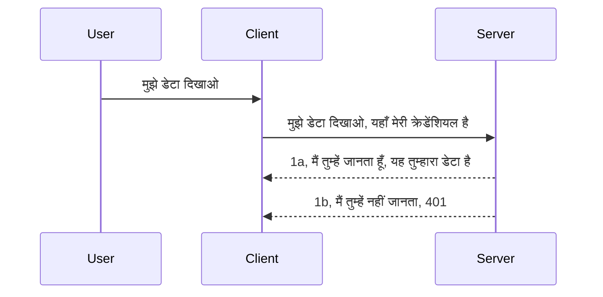

# सरल प्रमाणिकरण

MCP SDKs OAuth 2.1 के उपयोग का समर्थन करते हैं, जो कि एक काफी जटिल प्रक्रिया है जिसमें प्रमाणिकरण सर्वर, संसाधन सर्वर, प्रमाण-पत्र भेजना, कोड प्राप्त करना, उस कोड को बियरर टोकन के लिए एक्सचेंज करना शामिल है जब तक कि आप अंत में अपने संसाधन डेटा तक पहुँच नहीं पाते। यदि आप OAuth से अपरिचित हैं, जो कि लागू करने के लिए एक बेहतरीन चीज़ है, तो कुछ मूल स्तर के प्रमाणिकरण के साथ शुरू करना और बेहतर और बेहतर सुरक्षा की ओर बढ़ना अच्छा होता है। यही कारण है कि यह अध्याय अस्तित्व में है, ताकि आपको अधिक उन्नत प्रमाणिकरण की ओर ले जाया जा सके।

## प्रमाणिकरण, हमारा मतलब क्या है?

प्रमाणिकरण का तात्पर्य authentication और authorization से है। विचार यह है कि हमें दो चीजें करनी होती हैं:

- **प्रमाणिकरण (Authentication)**, यह यह पता लगाने की प्रक्रिया है कि क्या हम किसी व्यक्ति को हमारे घर में प्रवेश करने देते हैं, कि वे "यहाँ" होने का अधिकार रखते हैं यानी हमारे संसाधन सर्वर जिसमें हमारे MCP Server की सुविधाएँ होती हैं, तक उनकी पहुँच है।
- **अधिकार निर्धारण (Authorization)**, यह यह पता लगाने की प्रक्रिया है कि उपयोगकर्ता को उन विशेष संसाधनों तक पहुँच मिलनी चाहिए जिन्हें वे माँग रहे हैं, उदाहरण के लिए ये ऑर्डर या ये उत्पाद, या वे सामग्री पढ़ सकते हैं लेकिन डिलीट नहीं कर सकते, जैसे एक और उदाहरण।

## प्रमाण-पत्र: हम सिस्टम को कैसे बताते हैं कि हम कौन हैं

खैर, अधिकांश वेब डेवलपर्स सर्वर को एक प्रमाण-पत्र देने के बारे में सोचते हैं, जो आमतौर पर एक गुप्त कुंजी होती है जो बताती है कि क्या उन्हें यहाँ होने की अनुमति है "प्रमाणिकरण"। यह प्रमाण-पत्र आमतौर पर यूजरनाम और पासवर्ड का बेस64 एन्कोडेड संस्करण या एक API कुंजी होती है जो विशिष्ट उपयोगकर्ता की पहचान करती है।

इसे "Authorization" नामक हेडर के माध्यम से भेजा जाता है, इस प्रकार:

```json
{ "Authorization": "secret123" }
```

इसे आमतौर पर बेसिक प्रमाणिकरण कहा जाता है। संपूर्ण प्रवाह तब निम्न प्रकार कार्य करता है:


```mermaid
sequenceDiagram
   participant User
   participant Client
   participant Server

   User->>Client: मुझे डेटा दिखाओ
   Client->>Server: मुझे डेटा दिखाओ, यहाँ मेरी क्रेडेंशियल है
   Server-->>Client: 1a, मैं तुम्हें जानता हूँ, यह तुम्हारा डेटा है
   Server-->>Client: 1b, मैं तुम्हें नहीं जानता, 401 
```

अब जब हम समझ गए हैं कि यह प्रवाह के दृष्टिकोण से कैसे काम करता है, तो हम इसे कैसे लागू करें? खैर, अधिकांश वेब सर्वरों में मिडलवेयर की अवधारणा होती है, जो अनुरोध के हिस्से के रूप में चलने वाला एक कोड है जो प्रमाण-पत्रों की जाँच कर सकता है, और यदि प्रमाण-पत्र वैध हैं तो अनुरोध को पास कर सकता है। यदि अनुरोध में वैध प्रमाण-पत्र नहीं हैं तो आपको एक प्रमाणिकरण त्रुटि मिलती है। आइए देखें कि इसे कैसे लागू किया जा सकता है:

**पायथन**

```python
class AuthMiddleware(BaseHTTPMiddleware):
    async def dispatch(self, request, call_next):

        has_header = request.headers.get("Authorization")
        if not has_header:
            print("-> Missing Authorization header!")
            return Response(status_code=401, content="Unauthorized")

        if not valid_token(has_header):
            print("-> Invalid token!")
            return Response(status_code=403, content="Forbidden")

        print("Valid token, proceeding...")
       
        response = await call_next(request)
        # किसी भी ग्राहक हेडर जोड़ें या प्रतिक्रिया में किसी भी तरह का परिवर्तन करें
        return response


starlette_app.add_middleware(CustomHeaderMiddleware)
```

यहाँ हमने:

- `AuthMiddleware` नामक मिडलवेयर बनाया है जहाँ इसका `dispatch` मेथड वेब सर्वर द्वारा चलाया जाता है।
- मिडलवेयर को वेब सर्वर में जोड़ा गया है:

    ```python
    starlette_app.add_middleware(AuthMiddleware)
    ```

- वैधता जांच लॉजिक लिखा है जो जाँच करता है कि Authorization हेडर मौजूद है और जो गुप्त कुंजी भेजी जा रही है वह वैध है या नहीं:

    ```python
    has_header = request.headers.get("Authorization")
    if not has_header:
        print("-> Missing Authorization header!")
        return Response(status_code=401, content="Unauthorized")

    if not valid_token(has_header):
        print("-> Invalid token!")
        return Response(status_code=403, content="Forbidden")
    ```

    यदि गुप्त कुंजी मौजूद और वैध होती है तो हम `call_next` को कॉल करके अनुरोध को पास कर देते हैं और प्रतिक्रिया लौटाते हैं।

    ```python
    response = await call_next(request)
    # किसी भी ग्राहक हेडर जोड़ें या प्रतिक्रिया में किसी भी तरह का बदलाव करें
    return response
    ```

यह इस प्रकार काम करता है कि यदि वेब अनुरोध सर्वर की ओर किया जाता है तो मिडलवेयर को बुलाया जाएगा और उसके कार्यान्वयन के अनुसार यह या तो अनुरोध को पास करने देगा या एक त्रुटि लौटाएगा जो बताती है कि क्लाइंट आगे बढ़ने की अनुमति नहीं रखता।

**टाइपस्क्रिप्ट**

यहाँ हम लोकप्रिय फ्रेमवर्क Express के साथ एक मिडलवेयर बनाते हैं और अनुरोध को MCP सर्वर तक पहुँचने से पहले इंटरसेप्ट करते हैं। इसका कोड इस प्रकार है:

```typescript
function isValid(secret) {
    return secret === "secret123";
}

app.use((req, res, next) => {
    // 1. प्राधिकरण हेडर मौजूद है?
    if(!req.headers["Authorization"]) {
        res.status(401).send('Unauthorized');
    }
    
    let token = req.headers["Authorization"];

    // 2. वैधता जांचें।
    if(!isValid(token)) {
        res.status(403).send('Forbidden');
    }

   
    console.log('Middleware executed');
    // 3. अनुरोध को अनुरोध पाइपलाइन के अगले चरण में भेजता है।
    next();
});
```

इस कोड में हम:

1. पहले जाँचते हैं कि Authorization हेडर मौजूद है या नहीं, यदि नहीं तो 401 त्रुटि भेजते हैं।
2. यह सुनिश्चित करते हैं कि प्रमाण-पत्र/टोकन वैध है या नहीं, यदि नहीं तो 403 त्रुटि भेजते हैं।
3. अंततः अनुरोध पाइपलाइन में अनुरोध को पास करते हैं और माँगे गए संसाधन को लौटाते हैं।

## अभ्यास: प्रमाणिकरण लागू करें

आइए अपने ज्ञान का उपयोग करके इसे लागू करने की कोशिश करें। योजना इस प्रकार है:

सर्वर

- एक वेब सर्वर और MCP उदाहरण बनाएं।
- सर्वर के लिए एक मिडलवेयर लागू करें।

क्लाइंट

- हेडर के माध्यम से प्रमाण-पत्र के साथ वेब अनुरोध भेजें।

### -1- एक वेब सर्वर और MCP उदाहरण बनाएं

> [!WARNING]
> नीचे दिया गया टाइपस्क्रिप्ट उदाहरण MCP `2025-11-25` को लक्षित करता है। यह ट्रांसपोर्ट्स को `mcp-session-id` से ट्रैक करता है और वर्तमान `2026-07-28` ट्रांसपोर्ट उदाहरण नहीं है। MCP `2026-07-28` `initialize` हैंडशेक और प्रोटोकॉल सेशन ID को हटाता है; नए कार्यान्वयन सेल्फ-कंटेंडेड अनुरोधों का उपयोग करते हैं। देखें [MCP में क्या बदला है: 2026-07-28 स्पेसिफिकेशन](../../01-CoreConcepts/mcp-2026-07-28.md)।


हमारे पहले कदम में, हमें वेब सर्वर उदाहरण और MCP सर्वर बनाना होगा।

**पायथन**

यहाँ हम एक MCP सर्वर उदाहरण बनाते हैं, starlette वेब ऐप बनाते हैं और इसे uvicorn के साथ होस्ट करते हैं।

```python
# MCP सर्वर बना रहा है

app = FastMCP(
    name="MCP Resource Server",
    instructions="Resource Server that validates tokens via Authorization Server introspection",
    host=settings["host"],
    port=settings["port"],
    debug=True
)

# स्टारलेट वेब ऐप बना रहा है
starlette_app = app.streamable_http_app()

# uvicorn के माध्यम से ऐप सर्व कर रहा है
async def run(starlette_app):
    import uvicorn
    config = uvicorn.Config(
            starlette_app,
            host=app.settings.host,
            port=app.settings.port,
            log_level=app.settings.log_level.lower(),
        )
    server = uvicorn.Server(config)
    await server.serve()

run(starlette_app)
```

इस कोड में हमने:

- MCP सर्वर बनाया।
- MCP सर्वर से starlette वेब ऐप का निर्माण किया `app.streamable_http_app()`।
- uvicorn `server.serve()` के उपयोग से वेब ऐप को होस्ट और सर्व किया।

**टाइपस्क्रिप्ट**

यहाँ हम एक MCP सर्वर उदाहरण बनाते हैं।

```typescript
const server = new McpServer({
      name: "example-server",
      version: "1.0.0"
    });

    // ... सर्वर संसाधन, उपकरण, और प्रॉम्प्ट सेट करें ...
```

इस MCP सर्वर निर्माण को हमें हमारे POST /mcp रूट परिभाषा के भीतर करना होगा, इसलिए ऊपर दिया गया कोड इस प्रकार स्थानांतरित करें:

```typescript
import express from "express";
import { randomUUID } from "node:crypto";
import { McpServer } from "@modelcontextprotocol/sdk/server/mcp.js";
import { StreamableHTTPServerTransport } from "@modelcontextprotocol/sdk/server/streamableHttp.js";
import { isInitializeRequest } from "@modelcontextprotocol/sdk/types.js"

const app = express();
app.use(express.json());

// सत्र ID द्वारा ट्रांसपोर्ट को स्टोर करने के लिए मानचित्र
const transports: { [sessionId: string]: StreamableHTTPServerTransport } = {};

// क्लाइंट-से-सरवर संचार के लिए POST अनुरोधों को संभालना
app.post('/mcp', async (req, res) => {
  // मौजूदा सत्र ID की जांच करें
  const sessionId = req.headers['mcp-session-id'] as string | undefined;
  let transport: StreamableHTTPServerTransport;

  if (sessionId && transports[sessionId]) {
    // मौजूदा ट्रांसपोर्ट का पुन: उपयोग करें
    transport = transports[sessionId];
  } else if (!sessionId && isInitializeRequest(req.body)) {
    // नई आरंभिक अनुरोध
    transport = new StreamableHTTPServerTransport({
      sessionIdGenerator: () => randomUUID(),
      onsessioninitialized: (sessionId) => {
        // सत्र ID द्वारा ट्रांसपोर्ट स्टोर करें
        transports[sessionId] = transport;
      },
      // DNS रिबाइंडिंग सुरक्षा पिछली संगतता के लिए डिफ़ॉल्ट रूप से अक्षम है। यदि आप यह सर्वर
      // स्थानीय रूप से चला रहे हैं, तो सुनिश्चित करें कि सेट करें:
      // enableDnsRebindingProtection: true,
      // allowedHosts: ['127.0.0.1'],
    });

    // बंद होने पर ट्रांसपोर्ट को साफ़ करें
    transport.onclose = () => {
      if (transport.sessionId) {
        delete transports[transport.sessionId];
      }
    };
    const server = new McpServer({
      name: "example-server",
      version: "1.0.0"
    });

    // ... सर्वर संसाधन, टूल्स, और प्रॉम्प्ट्स सेट करें ...

    // MCP सर्वर से कनेक्ट करें
    await server.connect(transport);
  } else {
    // अमान्य अनुरोध
    res.status(400).json({
      jsonrpc: '2.0',
      error: {
        code: -32000,
        message: 'Bad Request: No valid session ID provided',
      },
      id: null,
    });
    return;
  }

  // अनुरोध को संभालें
  await transport.handleRequest(req, res, req.body);
});

// GET और DELETE अनुरोधों के लिए पुन: उपयोग योग्य हैंडलर
const handleSessionRequest = async (req: express.Request, res: express.Response) => {
  const sessionId = req.headers['mcp-session-id'] as string | undefined;
  if (!sessionId || !transports[sessionId]) {
    res.status(400).send('Invalid or missing session ID');
    return;
  }
  
  const transport = transports[sessionId];
  await transport.handleRequest(req, res);
};

// SSE के माध्यम से सर्वर-से-क्लाइंट सूचनाओं के लिए GET अनुरोधों को संभालना
app.get('/mcp', handleSessionRequest);

// सत्र समाप्ति के लिए DELETE अनुरोध को संभालना
app.delete('/mcp', handleSessionRequest);

app.listen(3000);
```

अब आप देख सकते हैं कि MCP सर्वर निर्माण `app.post("/mcp")` के भीतर कैसे किया गया।

आइए अगले चरण की ओर बढ़ते हैं, मिडलवेयर बनाने का ताकि हम आने वाले प्रमाण-पत्र का सत्यापन कर सकें।

### -2- सर्वर के लिए एक मिडलवेयर लागू करें

अब मिडलवेयर भाग पर आते हैं। यहाँ हम एक मिडलवेयर बनाएंगे जो `Authorization` हेडर में प्रमाण-पत्र की खोज करेगा और उसे सत्यापित करेगा। यदि स्वीकार्य है तो अनुरोध वह करेगा जो आवश्यक है (उदाहरण के लिए उपकरणों की सूची दिखाएगा, संसाधन पढ़ेगा या जो भी MCP कार्यक्षमता क्लाइंट मांग रहा था)।

**पायथन**

मिडलवेयर बनाने के लिए, हमें एक क्लास बनानी होगी जो `BaseHTTPMiddleware` से विरासत में हो। दो महत्वपूर्ण हिस्से हैं:

- अनुरोध `request`, जिससे हम हेडर जानकारी पढ़ते हैं।
- `call_next` वह कॉलबैक जिसे हमें कॉल करना है यदि क्लाइंट ने कोई स्वीकार्य प्रमाण-पत्र लाया है।

सबसे पहले, हमें उस स्थिति को संभालना होगा जब `Authorization` हेडर अनुपस्थित हो:

```python
has_header = request.headers.get("Authorization")

# कोई हेडर मौजूद नहीं है, 401 के साथ असफल हो, अन्यथा आगे बढ़ें।
if not has_header:
    print("-> Missing Authorization header!")
    return Response(status_code=401, content="Unauthorized")
```

यहाँ हम 401 unauthorized संदेश भेजते हैं क्योंकि क्लाइंट प्रमाणीकरण विफल कर रहा है।

अगले चरण में, यदि कोई प्रमाण-पत्र प्रस्तुत किया गया है, तो हमें उसकी वैधता जाँचना होता है इस प्रकार:

```python
 if not valid_token(has_header):
    print("-> Invalid token!")
    return Response(status_code=403, content="Forbidden")
```

ऊपर देखें कि हमने 403 forbidden संदेश भेजा। नीचे पूरा मिडलवेयर देखें जिसमें हमने ऊपर बताए गए सभी कार्यान्वयन किए हैं:

```python
class AuthMiddleware(BaseHTTPMiddleware):
    async def dispatch(self, request, call_next):

        has_header = request.headers.get("Authorization")
        if not has_header:
            print("-> Missing Authorization header!")
            return Response(status_code=401, content="Unauthorized")

        if not valid_token(has_header):
            print("-> Invalid token!")
            return Response(status_code=403, content="Forbidden")

        print("Valid token, proceeding...")
        print(f"-> Received {request.method} {request.url}")
        response = await call_next(request)
        response.headers['Custom'] = 'Example'
        return response

```

शानदार, लेकिन `valid_token` फ़ंक्शन के बारे में क्या? यह नीचे है:

```python
# उत्पादन के लिए उपयोग न करें - इसे सुधारें !!
def valid_token(token: str) -> bool:
    # "Bearer " उपसर्ग हटा दें
    if token.startswith("Bearer "):
        token = token[7:]
        return token == "secret-token"
    return False
```

यह निश्चित रूप से बेहतर हो सकता है।

महत्वपूर्ण: आपको इस प्रकार के गुप्त कोड कोड में कभी रखना नहीं चाहिए। आदर्श रूप से इसे किसी डेटा स्रोत या IDP (पहचान सेवा प्रदाता) से मान्य करने के लिए प्राप्त किया जाना चाहिए या बेहतर यह है कि IDP स्वयं सत्यापन करे।

**टाइपस्क्रिप्ट**

इसे Express के साथ लागू करने के लिए, हमें `use` मेथड कॉल करना होता है जो मिडलवेयर फ़ंक्शन लेता है।


हमें करना होगा:

- पास किए गए प्रमाणपत्र की जांच के लिए अनुरोध चर के साथ इंटरैक्ट करें जो `Authorization` प्रॉपर्टी में है।
- प्रमाणपत्र को मान्य करें, और यदि सही हो तो अनुरोध को आगे बढ़ने दें और क्लाइंट के MCP अनुरोध को वह करने दें जो उसे करना चाहिए (उदाहरण के लिए उपकरण सूचीबद्ध करना, संसाधन पढ़ना या कोई अन्य MCP संबंधित कार्य)।

यहाँ, हम जांच रहे हैं कि `Authorization` हेडर मौजूद है या नहीं और यदि नहीं, तो हम अनुरोध को आगे जाने से रोकते हैं:

```typescript
if(!req.headers["authorization"]) {
    res.status(401).send('Unauthorized');
    return;
}
```

यदि हेडर सबसे पहले भेजा नहीं गया है, तो आपको 401 प्राप्त होता है।

अगला, हम जांचते हैं कि प्रमाणपत्र मान्य है या नहीं, यदि नहीं तो हम फिर से अनुरोध को रोकते हैं लेकिन एक अलग संदेश के साथ:

```typescript
if(!isValid(token)) {
    res.status(403).send('Forbidden');
    return;
} 
```

ध्यान दें कि अब आपको 403 त्रुटि मिलती है।

यहाँ पूरा कोड है:

```typescript
app.use((req, res, next) => {
    console.log('Request received:', req.method, req.url, req.headers);
    console.log('Headers:', req.headers["authorization"]);
    if(!req.headers["authorization"]) {
        res.status(401).send('Unauthorized');
        return;
    }
    
    let token = req.headers["authorization"];

    if(!isValid(token)) {
        res.status(403).send('Forbidden');
        return;
    }  

    console.log('Middleware executed');
    next();
});
```

हमने वेब सर्वर को एक मिडलवेयर स्वीकार करने के लिए सेट किया है जो उम्मीद है कि क्लाइंट हमें जो प्रमाणपत्र भेज रहा है उसकी जांच करेगा। क्लाइंट के बारे में क्या?

### -3- प्रमाणपत्र के साथ वेब अनुरोध भेजें हेडर के जरिए

हमें सुनिश्चित करना होगा कि क्लाइंट प्रमाणपत्र हेडर के जरिए भेज रहा है। चूंकि हम यह करने के लिए MCP क्लाइंट का उपयोग करने जा रहे हैं, हमें यह पता लगाना होगा कि यह कैसे किया जाता है।

**Python**

क्लाइंट के लिए, हमें इस तरह प्रमाणपत्र के साथ हेडर पास करना होगा:

```python
# मान को हार्डकोड न करें, इसे न्यूनतम रूप से पर्यावरण चर या अधिक सुरक्षित भंडारण में रखें
token = "secret-token"

async with streamablehttp_client(
        url = f"http://localhost:{port}/mcp",
        headers = {"Authorization": f"Bearer {token}"}
    ) as (
        read_stream,
        write_stream,
        session_callback,
    ):
        async with ClientSession(
            read_stream,
            write_stream
        ) as session:
            await session.initialize()
      
            # TODO, क्लाइंट में आप क्या करना चाहते हैं, जैसे टूल सूचीबद्ध करें, टूल कॉल करें आदि।
```

ध्यान दें कि हम `headers` प्रॉपर्टी को इस तरह भरते हैं ` headers = {"Authorization": f"Bearer {token}"}`।

**TypeScript**

हम इसे दो चरणों में समाधान कर सकते हैं:

1. एक कॉन्फ़िगरेशन ऑब्जेक्ट को हमारे प्रमाणपत्र के साथ भरें।
2. कॉन्फ़िगरेशन ऑब्जेक्ट को ट्रांसपोर्ट को पास करें।

```typescript

// यहाँ दिखाए गए जैसा मान हार्डकोड न करें। न्यूनतम इसे एक पर्यावरण चर के रूप में रखें और विकास मोड में dotenv जैसी चीज़ का उपयोग करें।
let token = "secret123"

// एक क्लाइंट ट्रांसपोर्ट विकल्प ऑब्जेक्ट परिभाषित करें
let options: StreamableHTTPClientTransportOptions = {
  sessionId: sessionId,
  requestInit: {
    headers: {
      "Authorization": "secret123"
    }
  }
};

// विकल्प ऑब्जेक्ट को ट्रांसपोर्ट में पास करें
async function main() {
   const transport = new StreamableHTTPClientTransport(
      new URL(serverUrl),
      options
   );
```

ऊपर आप देख सकते हैं कैसे हमें एक `options` ऑब्जेक्ट बनाना पड़ा और हमारे हेडर को `requestInit` प्रॉपर्टी के तहत रखना पड़ा।

महत्वपूर्ण: हालांकि हम इसे कैसे सुधारते हैं? वर्तमान कार्यान्वयन में कुछ समस्याएं हैं। सबसे पहले, इस तरह से प्रमाणपत्र भेजना काफी जोखिम भरा है जब तक कि आपके पास कम से कम HTTPS न हो। तब भी, प्रमाणपत्र चोरी हो सकता है इसलिए आपको एक ऐसा सिस्टम चाहिए जहाँ आप आसानी से टोकन को रद्द कर सकें और अतिरिक्त जांच जोड़ सकें जैसे कि यह दुनिया में कहाँ से आ रहा है, क्या अनुरोध बहुत बार हो रहा है (बॉट जैसी गतिविधि), संक्षेप में, बहुत सारी चिंताएं हैं। 

यह कहा जाना चाहिए कि बहुत सरल API के लिए जहाँ आप नहीं चाहते कि कोई बिना प्रमाणीकरण के आपके API को कॉल करे, और जो हमारे पास यहाँ है वह एक अच्छा प्रारंभिक बिंदु है। 

इसके साथ कहा जाए, तो चलिए सुरक्षा को थोड़ा मजबूत बनाने की कोशिश करते हैं एक मानकीकृत प्रारूप का उपयोग करके जैसे JSON Web Token, जिसे JWT या "JOT" टोकन के नाम से भी जाना जाता है।

## JSON Web टोकन, JWT

तो, हम बहुत सरल प्रमाणपत्र भेजने की बजाय चीजों को बेहतर बनाने की कोशिश कर रहे हैं। JWT स्वीकार करने से हमें तत्काल क्या सुधार मिलते हैं?

- **सुरक्षा सुधार**। बेसिक ऑथ में, आप बार-बार बेस64 एन्कोडेड टोकन के रूप में उपयोगकर्ता नाम और पासवर्ड भेजते हैं (या API कुंजी भेजते हैं) जो जोखिम बढ़ाता है। JWT के साथ, आप अपने उपयोगकर्ता नाम और पासवर्ड भेजते हैं और बदले में एक टोकन प्राप्त करते हैं जो समय-सीमा में बंधा होता है, यानी यह समाप्त हो जाएगा। JWT आपको भूमिका, स्कोप और अनुमतियों के साथ सूक्ष्म-सूत्रीय पहुँच नियंत्रण का उपयोग करने देता है।
- **स्टेटलेसनेस और स्केलेबिलिटी**। JWT स्वयं-संपूर्ण होते हैं, वे सभी उपयोगकर्ता जानकारी लेकर चलते हैं और सर्वर-साइड सेशन स्टोरेज को खत्म करते हैं। टोकन को स्थानीय स्तर पर भी मान्य किया जा सकता है।
- **इंटरऑपरेबिलिटी और फेडरेशन**। JWT Open ID Connect का केंद्र है और इसे ज्ञात पहचान प्रदाताओं जैसे Entra ID, Google Identity और Auth0 के साथ उपयोग किया जाता है। ये सिंगल साइन ऑन और बहुत कुछ की अनुमति देते हैं जो इसे एंटरप्राइज-ग्रेड बनाता है।
- **मॉड्युलैरिटी और लचीलापन**। JWTs को Azure API Management, NGINX जैसे API Gateways के साथ भी उपयोग किया जा सकता है। यह उपयोगकर्ता प्रमाणीकरण परिदृश्यों और सर्वर-से-सर्विस संचार सहित इम्पर्सोनेशन और प्रतिनिधि परिदृश्यों का समर्थन करता है।
- **प्रदर्शन और कैशिंग**। JWTs को डिकोड करने के बाद कैश किया जा सकता है जिससे पार्सिंग की आवश्यकता कम हो जाती है। यह उच्च-ट्रैफिक ऐप्स में सहायक होता है क्योंकि यह थ्रूपुट को बढ़ाता है और आपके चुने हुए इंफ्रास्ट्रक्चर पर लोड को कम करता है।
- **उन्नत फीचर्स**। यह इंट्रोस्पेक्शन (सर्वर पर वैधता जांचना) और रद्दीकरण (टोकन को अमान्य बनाना) को भी सपोर्ट करता है।

इन सभी लाभों के साथ, आइए देखें कि हम अपनी कार्यान्वयन को अगले स्तर पर कैसे ले जा सकते हैं।

## बेसिक ऑथ को JWT में बदलना

तो, हमें उच्च स्तर पर जो बदलाव करने होंगे वे हैं:

- **JWT टोकन बनाना सीखें** और इसे क्लाइंट से सर्वर को भेजने के लिए तैयार करें।
- **JWT टोकन की पुष्टि करें**, और यदि सही हो, तो क्लाइंट को हमारे संसाधन उपलब्ध कराएं।
- **सुरक्षित टोकन स्टोरेज**। हम इस टोकन को कैसे स्टोर करते हैं।
- **रूट्स की सुरक्षा करें**। हमें रूट्स की सुरक्षा करनी होगी, हमारे केस में, हमें रूट्स और विशिष्ट MCP फीचर्स की सुरक्षा करनी होगी।
- **रिफ्रेश टोकन जोड़ें**। सुनिश्चित करें कि हम ऐसे टोकन बनाएं जो अल्पकालिक हों लेकिन रिफ्रेश टोकन लंबे समय तक चलने वाले हों जिन्हें अगर टोकन समाप्त हो जाए तो नए टोकन प्राप्त करने के लिए उपयोग किया जा सके। साथ ही एक रिफ्रेश एंडपॉइंट और रोटेशन स्ट्रेटेजी हो।

### -1- एक JWT टोकन बनाएं

सबसे पहले, एक JWT टोकन में निम्न भाग होते हैं:

- **हेडर**, इस्तेमाल किया गया एल्गोरिदम और टोकन प्रकार।
- **पेलोड**, दावे, जैसे sub (टोकन किन उपयोगकर्ता या इकाई का प्रतिनिधित्व करता है। ऑथ परिदृश्य में यह आमतौर पर userid होता है), exp (कब समाप्त होता है), role (भूमिका)
- **सिग्नेचर**, एक सीक्रेट या प्राइवेट की के साथ साइन किया गया।

इसके लिए, हमें हेडर, पेलोड और एन्कोडेड टोकन बनाने होंगे।

**Python**

```python

import jwt
import jwt
from jwt.exceptions import ExpiredSignatureError, InvalidTokenError
import datetime

# JWT को साइन करने के लिए गुप्त कुंजी
secret_key = 'your-secret-key'

header = {
    "alg": "HS256",
    "typ": "JWT"
}

# उपयोगकर्ता जानकारी और इसके दावे और समाप्ति समय
payload = {
    "sub": "1234567890",               # विषय (उपयोगकर्ता आईडी)
    "name": "User Userson",                # कस्टम दावा
    "admin": True,                     # कस्टम दावा
    "iat": datetime.datetime.utcnow(),# जारी किया गया
    "exp": datetime.datetime.utcnow() + datetime.timedelta(hours=1)  # समाप्ति
}

# इसे एन्कोड करें
encoded_jwt = jwt.encode(payload, secret_key, algorithm="HS256", headers=header)
```

ऊपर दिए गए कोड में हमने:

- HS256 को एल्गोरिदम के रूप में और टाइप को JWT के रूप में परिभाषित किया है।
- एक पेलोड बनाया है जिसमें सब्जेक्ट या उपयोगकर्ता id, उपयोगकर्ता नाम, भूमिका, जारी होने का समय और समाप्ति का समय शामिल है जिससे हमने पहले वर्णित समय से बंधे पहलू को लागू किया है। 

**TypeScript**

यहाँ हमें कुछ निर्भरताएँ चाहिए होंगी जो JWT टोकन बनाने में मदद करेंगी।

निर्भरताएँ

```sh

npm install jsonwebtoken
npm install --save-dev @types/jsonwebtoken
```

अब जब यह सेटअप हो गया है, तो चलिए हेडर, पेलोड बनाएं और इसके माध्यम से एन्कोडेड टोकन बनाएं।

```typescript
import jwt from 'jsonwebtoken';

const secretKey = 'your-secret-key'; // उत्पादन में env वेरिएबल का उपयोग करें

// पेलोड को परिभाषित करें
const payload = {
  sub: '1234567890',
  name: 'User usersson',
  admin: true,
  iat: Math.floor(Date.now() / 1000), // जारी किया गया
  exp: Math.floor(Date.now() / 1000) + 60 * 60 // 1 घंटे में समाप्त होता है
};

// हेडर को परिभाषित करें (वैकल्पिक, jsonwebtoken डिफ़ॉल्ट सेट करता है)
const header = {
  alg: 'HS256',
  typ: 'JWT'
};

// टोकन बनाएँ
const token = jwt.sign(payload, secretKey, {
  algorithm: 'HS256',
  header: header
});

console.log('JWT:', token);
```

यह टोकन है:

HS256 के साथ साइन किया गया
1 घंटे के लिए मान्य
इसमें दावे जैसे sub, name, admin, iat, और exp शामिल हैं।

### -2- टोकन का मान्यकरण करें

हमें टोकन को मान्य भी करना होगा, यह कुछ ऐसा है जो हमें सर्वर पर करना चाहिए ताकि हम सुनिश्चित कर सकें कि जो क्लाइंट हमें भेज रहा है वह वास्तव में मान्य है। हमें यहाँ इसके स्ट्रक्चर से इसकी वैधता तक कई जांच करें। आप अन्य जांच जोड़ने के लिए भी प्रोत्साहित हैं जैसे कि उपयोगकर्ता आपके सिस्टम में है या नहीं और बहुत कुछ।

टोकन को वैध करने के लिए, हमें इसे डिकोड करना होगा ताकि हम इसे पढ़ सकें और फिर इसकी वैधता जांचना शुरू करें:

**Python**

```python

# JWT को डिकोड और सत्यापित करें
try:
    decoded = jwt.decode(token, secret_key, algorithms=["HS256"])
    print("✅ Token is valid.")
    print("Decoded claims:")
    for key, value in decoded.items():
        print(f"  {key}: {value}")
except ExpiredSignatureError:
    print("❌ Token has expired.")
except InvalidTokenError as e:
    print(f"❌ Invalid token: {e}")

```


इस कोड में, हम `jwt.decode` को टोकन, सीक्रेट की और चयनित एल्गोरिदम का उपयोग करते हुए कॉल करते हैं। ध्यान दें कि हम एक try-catch संरचना का उपयोग करते हैं क्योंकि सत्यापन विफल होने पर एक त्रुटि उत्पन्न होती है।

**TypeScript**

यहां हमें टोकन का एक डिकोड किया हुआ संस्करण प्राप्त करने के लिए `jwt.verify` को कॉल करना होगा जिसे हम आगे विश्लेषण कर सकें। यदि यह कॉल विफल होती है, तो इसका मतलब है कि टोकन की संरचना गलत है या यह अब मान्य नहीं है।

```typescript

try {
  const decoded = jwt.verify(token, secretKey);
  console.log('Decoded Payload:', decoded);
} catch (err) {
  console.error('Token verification failed:', err);
}
```

ध्यान दें: जैसा कि पहले बताया गया था, हमें अतिरिक्त जांच करनी चाहिए यह सुनिश्चित करने के लिए कि यह टोकन हमारे सिस्टम में एक उपयोगकर्ता को इंगित करता है और उपयोगकर्ता के पास वह अधिकार हैं जो वह दावा करता है।

अब, चलिए भूमिका आधारित अभिगम नियंत्रण, जिसे RBAC भी कहा जाता है, पर नज़र डालते हैं।

## भूमिका आधारित अभिगम नियंत्रण जोड़ना

विचार यह है कि हम व्यक्त करना चाहते हैं कि विभिन्न भूमिकाओं के पास विभिन्न अनुमतियाँ हैं। उदाहरण के लिए, हम मानते हैं कि एक प्रशासक सब कुछ कर सकता है और एक सामान्य उपयोगकर्ता पढ़/लिख सकता है और एक अतिथि केवल पढ़ सकता है। इसलिए, यहां कुछ संभावित अनुमति स्तर हैं:

- Admin.Write 
- User.Read
- Guest.Read

चलिए देखते हैं कि हम इस तरह के नियंत्रण को मिडलवेयर के साथ कैसे लागू कर सकते हैं। मिडलवेयर को प्रत्येक मार्ग के लिए या सभी मार्गों के लिए जोड़ा जा सकता है।

**Python**

```python
from starlette.middleware.base import BaseHTTPMiddleware
from starlette.responses import JSONResponse
import jwt

# कोड में रहस्य न रखें, यह केवल प्रदर्शन उद्देश्यों के लिए है। इसे किसी सुरक्षित स्थान से पढ़ें।
SECRET_KEY = "your-secret-key" # इसे env वेरिएबल में रखें।
REQUIRED_PERMISSION = "User.Read"

class JWTPermissionMiddleware(BaseHTTPMiddleware):
    async def dispatch(self, request, call_next):
        auth_header = request.headers.get("Authorization")
        if not auth_header or not auth_header.startswith("Bearer "):
            return JSONResponse({"error": "Missing or invalid Authorization header"}, status_code=401)

        token = auth_header.split(" ")[1]
        try:
            decoded = jwt.decode(token, SECRET_KEY, algorithms=["HS256"])
        except jwt.ExpiredSignatureError:
            return JSONResponse({"error": "Token expired"}, status_code=401)
        except jwt.InvalidTokenError:
            return JSONResponse({"error": "Invalid token"}, status_code=401)

        permissions = decoded.get("permissions", [])
        if REQUIRED_PERMISSION not in permissions:
            return JSONResponse({"error": "Permission denied"}, status_code=403)

        request.state.user = decoded
        return await call_next(request)


```

मिडलवेयर जोड़ने के कुछ अलग तरीके हैं, जैसे नीचे:

```python

# विकल्प 1: स्टारलेट ऐप का निर्माण करते समय मिडलवेयर जोड़ें
middleware = [
    Middleware(JWTPermissionMiddleware)
]

app = Starlette(routes=routes, middleware=middleware)

# विकल्प 2: स्टारलेट ऐप पहले से निर्मित होने के बाद मिडलवेयर जोड़ें
starlette_app.add_middleware(JWTPermissionMiddleware)

# विकल्प 3: प्रत्येक रूट पर मिडलवेयर जोड़ें
routes = [
    Route(
        "/mcp",
        endpoint=..., # हैंडलर
        middleware=[Middleware(JWTPermissionMiddleware)]
    )
]
```

**TypeScript**

हम `app.use` और एक मिडलवेयर का उपयोग कर सकते हैं जो सभी अनुरोधों के लिए चलेगा।

```typescript
app.use((req, res, next) => {
    console.log('Request received:', req.method, req.url, req.headers);
    console.log('Headers:', req.headers["authorization"]);

    // 1. जांचें कि क्या प्राधिकरण हेडर भेजा गया है

    if(!req.headers["authorization"]) {
        res.status(401).send('Unauthorized');
        return;
    }
    
    let token = req.headers["authorization"];

    // 2. जांचें कि टोकन वैध है या नहीं
    if(!isValid(token)) {
        res.status(403).send('Forbidden');
        return;
    }  

    // 3. जांचें कि टोकन उपयोगकर्ता हमारे सिस्टम में मौजूद है
    if(!isExistingUser(token)) {
        res.status(403).send('Forbidden');
        console.log("User does not exist");
        return;
    }
    console.log("User exists");

    // 4. सत्यापित करें कि टोकन के पास सही अनुमतियाँ हैं
    if(!hasScopes(token, ["User.Read"])){
        res.status(403).send('Forbidden - insufficient scopes');
    }

    console.log("User has required scopes");

    console.log('Middleware executed');
    next();
});

```

मिडलवेयर द्वारा की जाने वाली और जो मिडलवेयर को करना चाहिए, उनमें कई महत्वपूर्ण बातें हैं, विशेष रूप से:

1. जांचें कि प्राधिकरण हेडर मौजूद है या नहीं
2. जांचें कि टोकन मान्य है या नहीं, हम `isValid` को कॉल करते हैं जो एक विधि है जिसे हमने JWT टोकन की अखंडता और वैधता जांचने के लिए लिखा है।
3. सत्यापित करें कि उपयोगकर्ता हमारे सिस्टम में मौजूद है, हमें इसे जांचना चाहिए।

   ```typescript
    // DB में उपयोगकर्ता
   const users = [
     "user1",
     "User usersson",
   ]

   function isExistingUser(token) {
     let decodedToken = verifyToken(token);

     // TODO, जांचें कि उपयोगकर्ता DB में मौजूद है या नहीं
     return users.includes(decodedToken?.name || "");
   }
   ```

   ऊपर, हमने एक बहुत सरल `users` सूची बनाई है, जो स्पष्ट रूप से एक डेटाबेस में होनी चाहिए।

4. इसके अलावा, हमें यह भी जांचना चाहिए कि टोकन में सही अनुमतियां हैं।

   ```typescript
   if(!hasScopes(token, ["User.Read"])){
        res.status(403).send('Forbidden - insufficient scopes');
   }
   ```

   इस कोड में, मिडलवेयर से हम जांचते हैं कि टोकन में User.Read अनुमति है, यदि नहीं तो हम 403 त्रुटि भेजते हैं। नीचे `hasScopes` सहायक विधि है।

   ```typescript
   function hasScopes(scope: string, requiredScopes: string[]) {
     let decodedToken = verifyToken(scope);
    return requiredScopes.every(scope => decodedToken?.scopes.includes(scope));
  }
   ```

Have a think which additional checks you should be doing, but these are the absolute minimum of checks you should be doing.

Using Express as a web framework is a common choice. There are helpers library when you use JWT so you can write less code.

- `express-jwt`, helper library that provides a middleware that helps decode your token.
- `express-jwt-permissions`, this provides a middleware `guard` that helps check if a certain permission is on the token.

Here's what these libraries can look like when used:

```typescript
const express = require('express');
const jwt = require('express-jwt');
const guard = require('express-jwt-permissions')();

const app = express();
const secretKey = 'your-secret-key'; // put this in env variable

// Decode JWT and attach to req.user
app.use(jwt({ secret: secretKey, algorithms: ['HS256'] }));

// Check for User.Read permission
app.use(guard.check('User.Read'));

// multiple permissions
// app.use(guard.check(['User.Read', 'Admin.Access']));

app.get('/protected', (req, res) => {
  res.json({ message: `Welcome ${req.user.name}` });
});

// Error handler
app.use((err, req, res, next) => {
  if (err.code === 'permission_denied') {
    return res.status(403).send('Forbidden');
  }
  next(err);
});

```

अब आपने देखा कि मिडलवेयर का उपयोग प्रमाणितकरण और प्राधिकरण दोनों के लिए कैसे किया जा सकता है, तो MCP के लिए क्या होता है, क्या यह हमारे प्रमाणीकरण के तरीके को बदलता है? आइए अगले अनुभाग में देखें।

### -3- MCP में RBAC जोड़ें

अब तक आपने देखा कि आप मिडलवेयर के माध्यम से RBAC कैसे जोड़ सकते हैं, हालांकि MCP के लिए प्रति MCP फीचर RBAC जोड़ने का कोई सरल तरीका नहीं है, तो अब क्या करें? खैर, हमें बस ऐसा कोड जोड़ना होगा जो इस मामले में जांचे कि ग्राहक के पास किसी विशिष्ट उपकरण को कॉल करने के अधिकार हैं या नहीं:

प्रति फीचर RBAC को हासिल करने के लिए आपके पास कुछ अलग विकल्प हैं, यहां कुछ हैं:

- प्रत्येक उपकरण, संसाधन, या प्रॉम्प्ट के लिए एक जांच जोड़ें जहाँ आपको अनुमति स्तर जांचना है।

   **python**

   ```python
   @tool()
   def delete_product(id: int):
      try:
          check_permissions(role="Admin.Write", request)
      catch:
        pass # क्लाइंट प्राधिकरण में असफल रहा, प्राधिकरण त्रुटि उत्पन्न करें
   ```

   **typescript**

   ```typescript
   server.registerTool(
    "delete-product",
    {
      title: Delete a product",
      description: "Deletes a product",
      inputSchema: { id: z.number() }
    },
    async ({ id }) => {
      
      try {
        checkPermissions("Admin.Write", request);
        // करना है, productService और remote entry को id भेजें
      } catch(Exception e) {
        console.log("Authorization error, you're not allowed");  
      }

      return {
        content: [{ type: "text", text: `Deletected product with id ${id}` }]
      };
    }
   );
   ```


- उन्नत सर्वर दृष्टिकोण और अनुरोध हैंडलर्स का उपयोग करें ताकि आप जांच करने के लिए आवश्यक जगहों की संख्या न्यूनतम कर सकें।

   **Python**

   ```python
   
   tool_permission = {
      "create_product": ["User.Write", "Admin.Write"],
      "delete_product": ["Admin.Write"]
   }

   def has_permission(user_permissions, required_permissions) -> bool:
      # user_permissions: उपयोगकर्ता के पास अनुमतियों की सूची
      # required_permissions: उपकरण के लिए आवश्यक अनुमतियों की सूची
      return any(perm in user_permissions for perm in required_permissions)

   @server.call_tool()
   async def handle_call_tool(
     name: str, arguments: dict[str, str] | None
   ) -> list[types.TextContent]:
    # मान लें कि request.user.permissions उपयोगकर्ता के लिए अनुमतियों की सूची है
     user_permissions = request.user.permissions
     required_permissions = tool_permission.get(name, [])
     if not has_permission(user_permissions, required_permissions):
        # त्रुटि उठाएं "आपके पास टूल {name} को कॉल करने की अनुमति नहीं है"
        raise Exception(f"You don't have permission to call tool {name}")
     # जारी रखें और उपकरण को कॉल करें
     # ...
   ```   
   

   **TypeScript**

   ```typescript
   function hasPermission(userPermissions: string[], requiredPermissions: string[]): boolean {
       if (!Array.isArray(userPermissions) || !Array.isArray(requiredPermissions)) return false;
       // यदि उपयोगकर्ता के पास कम से कम एक आवश्यक अनुमति हो तो सत्य लौटाएं
       
       return requiredPermissions.some(perm => userPermissions.includes(perm));
   }
  
   server.setRequestHandler(CallToolRequestSchema, async (request) => {
      const { params: { name } } = request;
  
      let permissions = request.user.permissions;
  
      if (!hasPermission(permissions, toolPermissions[name])) {
         return new Error(`You don't have permission to call ${name}`);
      }
  
      // जारी रखें..
   });
   ```

   ध्यान दें, आपको यह सुनिश्चित करना होगा कि आपका मिडलवेयर डिकोड किया हुआ टोकन अनुरोध की user प्रॉपर्टी को सौंपे ताकि ऊपर का कोड सरल बनाया जा सके।

### सारांश

अब जब हमने सामान्य रूप से और विशेष रूप से MCP के लिए RBAC जोड़ने पर चर्चा की है, तो यह समय है कि आप स्वयं सुरक्षा लागू करने का प्रयास करें ताकि आप प्रस्तुत किए गए सिद्धांतों को समझ सकें।

## असाइनमेंट 1: बेसिक प्रमाणिकरण का उपयोग करके MCP सर्वर और MCP क्लाइंट बनाएं

यहां आप सीखे हुए चीज़ों का उपयोग करते हुए हेडर के माध्यम से क्रेडेंशियल्स भेजेंगे।

## समाधान 1

[Solution 1](./code/basic/README.md)

## असाइनमेंट 2: असाइनमेंट 1 के समाधान को JWT का उपयोग करने के लिए अपग्रेड करें

पहले समाधान को लेकर इस बार इसे सुधारें।

बेसिक ऑथ की बजाय, चलिए JWT का उपयोग करते हैं।

## समाधान 2

[Solution 2](./solution/jwt-solution/README.md)

## चुनौती

"MCP में RBAC जोड़ें" अनुभाग में वर्णित प्रति टूल RBAC जोड़ें।

## सारांश

आशा है आपने इस अध्याय में बहुत कुछ सीखा, बिना सुरक्षा के, मूल सुरक्षा से लेकर JWT तक और कैसे इसे MCP में जोड़ा जा सकता है।

हमने कस्टम JWTs के साथ एक मजबूत आधार बनाया है, लेकिन जैसे-जैसे हम स्केल करते हैं, हम एक मानक-आधारित पहचान मॉडल की ओर बढ़ रहे हैं। Entra या Keycloak जैसे IdP को अपनाने से हम टोकन जारी करने, सत्यापन और जीवन चक्र प्रबंधन को एक भरोसेमंद प्लेटफॉर्म पर सौंप सकते हैं — जिससे हम ऐप लॉजिक और उपयोगकर्ता अनुभव पर ध्यान केंद्रित कर सकें।

इसके लिए, हमारे पास Entra पर एक अधिक [उन्नत अध्याय](../../05-AdvancedTopics/mcp-security-entra/README.md) है।

## आगे क्या है

- अगला: [MCP होस्ट सेटअप](../12-mcp-hosts/README.md)

---

<!-- CO-OP TRANSLATOR DISCLAIMER START -->
**अस्वीकरण**:
इस दस्तावेज़ का अनुवाद AI अनुवाद सेवा [Co-op Translator](https://github.com/Azure/co-op-translator) का उपयोग करके किया गया है। जबकि हम सटीकता के लिए प्रयास करते हैं, कृपया ध्यान दें कि स्वचालित अनुवादों में त्रुटियाँ या अशुद्धियाँ हो सकती हैं। मूल दस्तावेज़ अपनी मूल भाषा में ही प्रामाणिक स्रोत माना जाना चाहिए। महत्वपूर्ण जानकारी के लिए, पेशेवर मानव अनुवाद की सिफारिश की जाती है। इस अनुवाद के उपयोग से उत्पन्न किसी भी गलतफहमी या गलत व्याख्या के लिए हम उत्तरदायी नहीं हैं।
<!-- CO-OP TRANSLATOR DISCLAIMER END -->