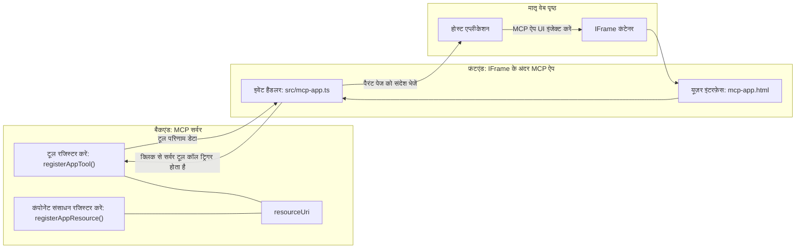
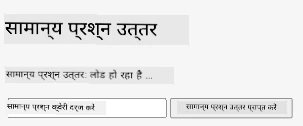
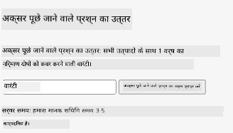
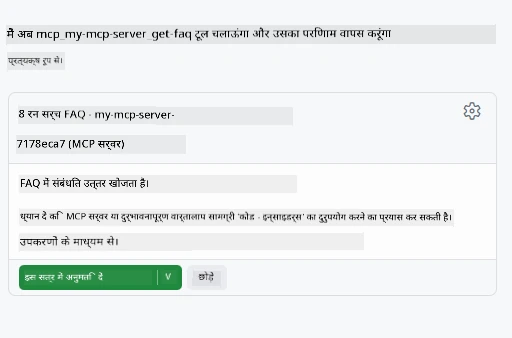

# MCP Apps

MCP Apps MCP में एक नया दृष्टिकोण है। विचार यह है कि आप केवल टूल कॉल से डेटा वापस नहीं करते बल्कि यह भी बताते हैं कि इस जानकारी के साथ कैसे इंटरैक्ट किया जाना चाहिए। इसका मतलब है कि टूल के परिणाम अब UI जानकारी भी शामिल कर सकते हैं। हालांकि, हम इसे क्यों चाहते हैं? खैर, सोचिए कि आप आज क्या करते हैं। आप संभवतः MCP सर्वर के परिणामों का उपयोग किसी प्रकार के फ्रंटएंड को उसके सामने रखकर कर रहे हैं, वह कोड आपको लिखना और बनाए रखना होता है। कभी-कभी यही आप चाहते हैं, लेकिन कभी-कभी यह बहुत अच्छा होगा अगर आप जानकारी का एक ऐसा स्निपेट ला सकें जो स्वयं में संपूर्ण हो, जिसमें सब कुछ हो — डेटा से लेकर उपयोगकर्ता इंटरफ़ेस तक।

## अवलोकन

यह पाठ MCP Apps पर व्यावहारिक मार्गदर्शन प्रदान करता है, इसे कैसे शुरू करें और अपने मौजूदा वेब ऐप्स में इसे कैसे इंटीग्रेट करें। MCP Apps MCP स्टैंडर्ड में एक बहुत नया जुड़ाव है।

## सीखने के उद्देश्य

इस पाठ के अंत में, आप सक्षम होंगे:

- बताना कि MCP Apps क्या हैं।
- MCP Apps का उपयोग कब करें।
- अपने खुद के MCP Apps बनाएं और इंटीग्रेट करें।

## MCP Apps - यह कैसे काम करता है

MCP Apps के साथ विचार यह है कि एक प्रतिक्रिया प्रदान की जाए जो मूल रूप से एक घटक हो जिसे रेंडर किया जाना है। ऐसा घटक दोनों दृश्य और इंटरएक्टिविटी रख सकता है, जैसे बटन क्लिक, उपयोगकर्ता इनपुट और अधिक। चलिए सर्वर साइड और हमारे MCP सर्वर से शुरू करते हैं। एक MCP App घटक बनाने के लिए आपको एक टूल और एप्लिकेशन रिसोर्स दोनों बनाना पड़ता है। ये दोनों आधे एक resourceUri से जुड़े होते हैं।

यहाँ एक उदाहरण है। आइए देखें कि इसमें क्या शामिल है और कौन सा भाग क्या करता है:

```text
server.ts -- responsible for registering tools and the component as a UI component
src/
  mcp-app.ts -- wiring up event handlers
mcp-app.html -- the user interface
```

यह विज़ुअल एक घटक और इसकी लॉजिक बनाने की वास्तुकला को दर्शाता है।


आइए अगला बैकएंड और फ्रंटेंड के लिए जिम्मेदारियों का वर्णन करें।

### बैकएंड

हमें यहां दो चीजें पूरी करनी हैं:

- उन टूल्स को रजिस्टर करना जिनसे हम इंटरैक्ट करना चाहते हैं।
- घटक को परिभाषित करना।

**टूल रजिस्टर करना**

```typescript
registerAppTool(
    server,
    "get-time",
    {
      title: "Get Time",
      description: "Returns the current server time.",
      inputSchema: {},
      _meta: { ui: { resourceUri } }, // इस टूल को इसके UI संसाधन से लिंक करता है
    },
    async () => {
      const time = new Date().toISOString();
      return { content: [{ type: "text", text: time }] };
    },
  );

```

उपरोक्त कोड उस व्यवहार का वर्णन करता है जहाँ यह `get-time` नामक टूल को एक्सपोज़ करता है। यह कोई इनपुट नहीं लेता लेकिन अंत में वर्तमान समय प्रदान करता है। हमारे पास `inputSchema` परिभाषित करने की क्षमता है उन टूल्स के लिए जिन्हें उपयोगकर्ता इनपुट स्वीकार करना होता है।

**घटक रजिस्टर करना**

इसी फाइल में, हमें घटक को भी रजिस्टर करना होगा:

```typescript
const resourceUri = "ui://get-time/mcp-app.html";

// संसाधन को पंजीकृत करें, जो UI के लिए बंडल किया गया HTML/JavaScript वापस करता है।
registerAppResource(
  server,
  resourceUri,
  resourceUri,
  { mimeType: RESOURCE_MIME_TYPE },
  async () => {
    const html = await fs.readFile(path.join(DIST_DIR, "mcp-app.html"), "utf-8");

    return {
    contents: [
        { uri: resourceUri, mimeType: RESOURCE_MIME_TYPE, text: html },
    ],
    };
  },
);
```

देखिए हमने `resourceUri` का उल्लेख कैसे किया है जो घटक को उसके टूल्स से जोड़ता है। रुचि का विषय है वह कॉलबैक जहाँ हम UI फ़ाइल लोड करते हैं और घटक लौटाते हैं।

### घटक फ्रंटेंड

बैकएंड की तरह, यहां भी दो भाग हैं:

- शुद्ध HTML में लिखा फ्रंटेंड।
- कोड जो इवेंट्स को हैंडल करता है और क्या करना है जैसे टूल कॉल करना या पैरेंट विंडो को संदेश भेजना।

**उपयोगकर्ता इंटरफ़ेस**

आइए उपयोगकर्ता इंटरफ़ेस देखें।

```html
<!-- mcp-app.html -->
<!DOCTYPE html>
<html lang="en">
  <head>
    <meta charset="UTF-8" />
    <title>Get Time App</title>
  </head>
  <body>
    <p>
      <strong>Server Time:</strong> <code id="server-time">Loading...</code>
    </p>
    <button id="get-time-btn">Get Server Time</button>
    <script type="module" src="/src/mcp-app.ts"></script>
  </body>
</html>
```

**इवेंट वायरअप**

अंतिम भाग इवेंट वायरअप है। इसका मतलब है कि हम यह पहचानते हैं कि UI के कौन से भाग को इवेंट हैंडलर की आवश्यकता है और इवेंट उठने पर क्या करना है:

```typescript
// mcp-app.ts

import { App } from "@modelcontextprotocol/ext-apps";

// तत्व संदर्भ प्राप्त करें
const serverTimeEl = document.getElementById("server-time")!;
const getTimeBtn = document.getElementById("get-time-btn")!;

// ऐप इंस्टेंस बनाएं
const app = new App({ name: "Get Time App", version: "1.0.0" });

// सर्वर से टूल परिणामों को संभालें। प्रारंभिक टूल परिणाम को चूकने से बचाने के लिए `app.connect()` से पहले सेट करें।
// प्रारंभिक टूल परिणाम नहीं मिलने से बचने के लिए।
app.ontoolresult = (result) => {
  const time = result.content?.find((c) => c.type === "text")?.text;
  serverTimeEl.textContent = time ?? "[ERROR]";
};

// बटन क्लिक कनेक्ट करें
getTimeBtn.addEventListener("click", async () => {
  // `app.callServerTool()` UI को सर्वर से ताजा डेटा अनुरोध करने देता है
  const result = await app.callServerTool({ name: "get-time", arguments: {} });
  const time = result.content?.find((c) => c.type === "text")?.text;
  serverTimeEl.textContent = time ?? "[ERROR]";
});

// होस्ट से कनेक्ट करें
app.connect();
```

जैसा कि ऊपर देखा गया, यह DOM एलिमेंट्स को इवेंट्स से जोड़ने के लिए सामान्य कोड है। विशेष उल्लेखनीय है `callServerTool` कॉल जो अंत में बैकएंड पर टूल को कॉल करता है।

## उपयोगकर्ता इनपुट से निपटना

अब तक, हमने एक ऐसा घटक देखा है जिसमें एक बटन है जो क्लिक होने पर टूल कॉल करता है। आइए देखें कि क्या हम एक इनपुट फ़ील्ड जैसे और UI एलिमेंट जोड़ सकते हैं और टूल को आर्ग्यूमेंट्स भेज सकते हैं। आइए एक FAQ कार्यक्षमता कार्यान्वित करें। यह इस प्रकार काम करना चाहिए:

- एक बटन और एक इनपुट एलिमेंट होना चाहिए जहाँ उपयोगकर्ता एक कीवर्ड टाइप करता है, उदाहरण के लिए "Shipping"। यह बैकएंड पर एक टूल को कॉल करता है जो FAQ डेटा में खोज करता है।
- एक टूल जो उल्लेखित FAQ खोज को सपोर्ट करता है।

सबसे पहले बैकएंड के लिए आवश्यक समर्थन जोड़ते हैं:

```typescript
const faq: { [key: string]: string } = {
    "shipping": "Our standard shipping time is 3-5 business days.",
    "return policy": "You can return any item within 30 days of purchase.",
    "warranty": "All products come with a 1-year warranty covering manufacturing defects.",
  }

registerAppTool(
    server,
    "get-faq",
    {
      title: "Search FAQ",
      description: "Searches the FAQ for relevant answers.",
      inputSchema: zod.object({
        query: zod.string().default("shipping"),
      }),
      _meta: { ui: { resourceUri: faqResourceUri } }, // इस टूल को इसके UI स्रोत से जोड़ता है
    },
    async ({ query }) => {
      const answer: string = faq[query.toLowerCase()] || "Sorry, I don't have an answer for that.";
      return { content: [{ type: "text", text: answer }] };
    },
  );
```

यहाँ हम देख रहे हैं कि कैसे हम `inputSchema` भरते हैं और इसे इस प्रकार एक `zod` स्कीमा देते हैं:

```typescript
inputSchema: zod.object({
  query: zod.string().default("shipping"),
})
```

ऊपर दिए गए स्कीमा में हमने यह घोषित किया है कि हमारे पास `query` नामक एक इनपुट पैरामीटर है जो वैकल्पिक है और जिसका डिफॉल्ट मान "shipping" है।

ठीक है, अब *mcp-app.html* पर चलते हैं यह देखने के लिए कि हमें क्या UI बनानी है:

```html
<div class="faq">
    <h1>FAQ response</h1>
    <p>FAQ Response: <code id="faq-response">Loading...</code></p>
    <input type="text" id="faq-query" placeholder="Enter FAQ query" />
    <button id="get-faq-btn">Get FAQ Response</button>
  </div>
```

बहुत बढ़िया, अब हमारे पास एक इनपुट एलिमेंट और बटन है। अब *mcp-app.ts* पर चलते हैं और इन इवेंट्स को वायर अप करें:

```typescript
const getFaqBtn = document.getElementById("get-faq-btn")!;
const faqQueryInput = document.getElementById("faq-query") as HTMLInputElement;

getFaqBtn.addEventListener("click", async () => {
  const query = faqQueryInput.value;
  const result = await app.callServerTool({ name: "get-faq", arguments: { query } });
  const faq = result.content?.find((c) => c.type === "text")?.text;
  faqResponseEl.textContent = faq ?? "[ERROR]";
});
```

ऊपर के कोड में हमने:

- दिलचस्प UI एलिमेंट्स के लिए संदर्भ बनाए।
- एक बटन क्लिक को हैंडल किया, इनपुट एलिमेंट मान को पार्स किया और `app.callServerTool()` को `name` और `arguments` के साथ कॉल किया जहाँ बाद वाला `query` को मान के रूप में भेजता है।

जब आप `callServerTool` कॉल करते हैं तो वास्तव में क्या होता है कि यह पैरेंट विंडो को एक संदेश भेजता है और वह विंडो अंत में MCP सर्वर को कॉल करती है।

### इसे आज़माएं

इसे आजमाते हुए, हमें अब निम्न देखना चाहिए:



और यहाँ हम "warranty" जैसे इनपुट से कोशिश कर रहे हैं



इस कोड को चलाने के लिए, [Code section](./code/README.md) पर जाएं

## Visual Studio Code में परीक्षण

Visual Studio Code MVP Apps के लिए शानदार समर्थन प्रदान करता है और आपके MCP Apps का परीक्षण करने का शायद सबसे आसान तरीका है। Visual Studio Code का उपयोग करने के लिए, *mcp.json* में एक सर्वर एंट्री जोड़ें इस प्रकार:

```json
"my-mcp-server-7178eca7": {
    "url": "http://localhost:3001/mcp",
    "type": "http"
  }
```

फिर सर्वर शुरू करें, आप चैट विंडो के माध्यम से अपने MVP App के साथ संवाद करने में सक्षम होंगे, यदि आपने GitHub Copilot इंस्टॉल किया है।

प्रॉम्प्ट के माध्यम से ट्रिगर करते हुए, उदाहरण के लिए "#get-faq":



और ठीक वैसे ही जैसे आपने वेब ब्राउज़र के माध्यम से चलाया, यह इसी तरह प्रदर्शित होता है:


## असाइनमेंट

एक रॉक पेपर सिजर गेम बनाएं। इसमें निम्नलिखित शामिल होने चाहिए:

UI:

- विकल्पों के साथ एक ड्रॉप डाउन सूची
- एक विकल्प सबमिट करने के लिए बटन
- एक लेबल जो दिखाता हो कि किसने क्या चुना और कौन जीता

सर्वर:

- एक रॉक पेपर सिजर टूल होना चाहिए जो "choice" को इनपुट के रूप में लेता है। इसे एक कंप्यूटर विकल्प भी प्रस्तुत करना चाहिए और विजेता का निर्धारण करना चाहिए

## समाधान

[Solution](./assignment/README.md)

## सारांश

हमने MCP Apps इस नए दृष्टिकोण के बारे में जाना। यह एक नया दृष्टिकोण है जो MCP सर्वरों को केवल डेटा के बारे में ही नहीं बल्कि यह भी बताता है कि इस डेटा को कैसे प्रस्तुत किया जाना चाहिए।

अतिरिक्त रूप से, हमने जाना कि ये MCP Apps एक IFrame में होस्ट किए जाते हैं और MCP सर्वरों से संवाद करने के लिए इन्हें पैरेंट वेब ऐप को संदेश भेजने होंगे। कई पुस्तकालय plain JavaScript, React और अन्य के लिए उपलब्ध हैं जो इस संचार को आसान बनाते हैं।

## मुख्य बातें

आपने यह सीखा:

- MCP Apps एक नया मानक है जो तब उपयोगी हो सकता है जब आप डेटा और UI सुविधाओं दोनों को भेजना चाहते हैं।
- ये प्रकार की ऐप्स सुरक्षा कारणों से IFrame में चलती हैं।

## आगे क्या है

- [Chapter 4](../../04-PracticalImplementation/README.md)

---

<!-- CO-OP TRANSLATOR DISCLAIMER START -->
**अस्वीकरण**:  
इस दस्तावेज़ का अनुवाद AI अनुवाद सेवा [Co-op Translator](https://github.com/Azure/co-op-translator) का उपयोग करके किया गया है। हम सटीकता के लिए प्रयासरत हैं, लेकिन कृपया ध्यान दें कि स्वचालित अनुवादों में त्रुटियां या अशुद्धियां हो सकती हैं। मूल दस्तावेज़ अपनी मूल भाषा में प्रामाणिक स्रोत माना जाना चाहिए। महत्वपूर्ण जानकारी के लिए, पेशेवर मानव अनुवाद की सलाह दी जाती है। इस अनुवाद के उपयोग से उत्पन्न किसी भी गलतफहमी या गलत व्याख्या के लिए हम उत्तरदायी नहीं हैं।
<!-- CO-OP TRANSLATOR DISCLAIMER END -->