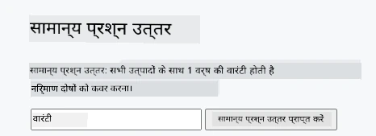
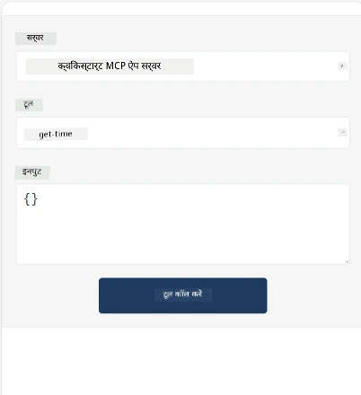
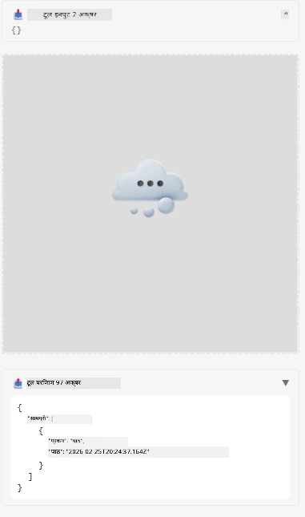

यहाँ MCP ऐप दिखाने वाला एक उदाहरण है

## इंस्टॉल करें

1. *mcp-app* फ़ोल्डर में जाएँ
1. `npm install` चलाएँ, यह फ्रंटेंड और बैकएंड निर्भरताएँ इंस्टॉल करेगा

बैक्सेंड कम्पाइल हो रहा है यह सत्यापित करने के लिए चलाएँ:

```sh
npx tsc --noEmit
```

अगर सब कुछ ठीक है तो कोई आउटपुट नहीं आएगा।

## बैकएंड चलाएँ

> अगर आप विंडोज़ मशीन पर हैं तो इसमें थोड़ा अतिरिक्त काम करना पड़ता है क्योंकि MCP ऐप समाधान `concurrently` लाइब्रेरी का उपयोग करता है जिसे चलाने के लिए आपको एक विकल्प ढूँढना होगा। यहाँ MCP ऐप के *package.json* में वह समस्या उत्पन्न करने वाली पंक्ति है:

    ```json
    "start": "concurrently \"cross-env NODE_ENV=development INPUT=mcp-app.html vite build --watch\" \"tsx watch main.ts\""
    ```

इस ऐप के दो भाग हैं, एक बैकएंड भाग और एक होस्ट भाग।

बैक्सेंड शुरू करने के लिए कॉल करें:

```sh
npm start
```

यह बैकएंड को `http://localhost:3001/mcp` पर शुरू कर देगा।

> ध्यान दें, अगर आप Codespace में हैं, तो आपको पोर्ट दृश्यता सार्वजनिक सेट करनी पड़ सकती है। सुनिश्चित करें कि आप ब्राउज़र के माध्यम से https://<name of Codespace>.app.github.dev/mcp पर एंडपॉइंट तक पहुँच सकते हैं।

## विकल्प -1: ऐप को Visual Studio Code में टेस्ट करें

Visual Studio Code में समाधान का परीक्षण करने के लिए, निम्न करें:

- `mcp.json` में एक सर्वर एंट्री इस प्रकार जोड़ें:

    ```json
    {
        "servers": {
            "my-mcp-server-7178eca7": {
                "url": "http://localhost:3001/mcp",
                "type": "http"
            }
        },
        "inputs": []
    }
    ```

1. *mcp.json* में "start" बटन पर क्लिक करें
1. सुनिश्चित करें कि एक चैट विंडो खुली है और `get-faq` टाइप करें, आपको इस प्रकार का परिणाम दिखेगा:

    

## विकल्प -2: होस्ट के साथ ऐप का परीक्षण करें

रिपॉ <https://github.com/modelcontextprotocol/ext-apps> में कई अलग-अलग होस्ट मौजूद हैं जिनका उपयोग आप अपने MVP ऐप्स का परीक्षण करने के लिए कर सकते हैं।

हम यहाँ आपको दो अलग-अलग विकल्प प्रस्तुत करेंगे:

### लोकल मशीन

- रिपॉ क्लोन करने के बाद *ext-apps* में जाएँ।

- निर्भरताएँ इंस्टॉल करें

   ```sh
   npm install
   ```

- एक अलग टर्मिनल विंडो में *ext-apps/examples/basic-host* में जाएँ

    > अगर आप Codespace में हैं, तो आपको serve.ts में लाइन 27 पर जाना होगा और http://localhost:3001/mcp को अपने Codespace के बैकएंड URL से बदलना होगा, जैसे https://psychic-xylophone-657rpjgvxpc5g64-3001.app.github.dev/mcp

- होस्ट को चलाएँ:

    ```sh
    npm start
    ```

    यह होस्ट को बैकएंड से कनेक्ट कर देगा और आपको ऐप इस प्रकार चलता हुआ दिखेगा:

    

### Codespace

Codespace पर्यावरण को काम करने के लिए थोड़ा अतिरिक्त प्रयास करना पड़ता है। Codespace के माध्यम से होस्ट उपयोग करने के लिए:

- *ext-apps* निर्देशिका देखें और *examples/basic-host* में जाएँ।
- निर्भरताएँ इंस्टॉल करने के लिए `npm install` चलाएँ
- होस्ट शुरू करने के लिए `npm start` चलाएँ।

## ऐप का परीक्षण करें

ऐप का परीक्षण निम्न प्रकार करें:

- "Call Tool" बटन चुनें और आपको परिणाम इस प्रकार दिखना चाहिए:

    

बहुत अच्छा, सब कुछ काम कर रहा है।

---

<!-- CO-OP TRANSLATOR DISCLAIMER START -->
**अस्वीकरण**:  
इस दस्तावेज़ का अनुवाद एआई अनुवाद सेवा [Co-op Translator](https://github.com/Azure/co-op-translator) का उपयोग करके किया गया है। जबकि हम सटीकता के लिए प्रयासरत हैं, कृपया ध्यान दें कि स्वचालित अनुवादों में त्रुटियाँ या असाम्यताएँ हो सकती हैं। मूल दस्तावेज़ अपनी मूल भाषा में ही सर्वाधिक प्रामाणिक स्रोत माना जाना चाहिए। महत्वपूर्ण जानकारी के लिए पेशेवर मानव अनुवाद की सिफारिश की जाती है। इस अनुवाद के उपयोग से उत्पन्न किसी भी गलतफहमी या गलत व्याख्या के लिए हम जिम्मेदार नहीं हैं।
<!-- CO-OP TRANSLATOR DISCLAIMER END -->