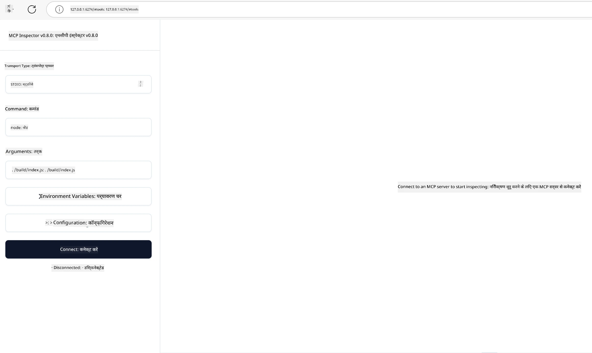

# व्यावहारिक कार्यान्वयन

[](https://youtu.be/vCN9-mKBDfQ)

_(इस पाठ का वीडियो देखने के लिए ऊपर दी गई छवि पर क्लिक करें)_

व्यावहारिक कार्यान्वयन वह जगह है जहाँ Model Context Protocol (MCP) की शक्ति मूर्त रूप में आती है। जबकि MCP के पीछे की थ्योरी और आर्किटेक्चर को समझना महत्वपूर्ण है, असली मूल्य तब उत्पन्न होता है जब आप इन अवधारणाओं को लागू करके ऐसे समाधान बनाते हैं, परीक्षण करते हैं और तैनात करते हैं जो वास्तविक दुनिया की समस्याओं को हल करते हैं। यह अध्याय सैद्धांतिक ज्ञान और व्यावहारिक विकास के बीच का अंतर कम करता है, और आपको MCP-आधारित ऐप्लिकेशन को जीवन में लाने की प्रक्रिया में मार्गदर्शन करता है।

चाहे आप बुद्धिमान सहायक विकसित कर रहे हों, व्यावसायिक वर्कफ़्लो में AI का एकीकरण कर रहे हों, या डेटा प्रोसेसिंग के लिए कस्टम टूल बना रहे हों, MCP एक लचीला आधार प्रदान करता है। इसका भाषा-अग्नोस्टिक डिजाइन और लोकप्रिय प्रोग्रामिंग भाषाओं के लिए आधिकारिक SDK इसे विभिन्न विकासकर्ताओं के लिए सुलभ बनाता है। इन SDKs का उपयोग करके, आप जल्दी से प्रोटोटाइप बना सकते हैं, पुनरावृत्ति कर सकते हैं, और अपने समाधानों को विभिन्न प्लेटफार्मों और वातावरणों में स्केल कर सकते हैं।

आगे के खंडों में, आपको व्यावहारिक उदाहरण, नमूना कोड, और तैनाती रणनीतियाँ मिलेंगी जो दिखाती हैं कि C#, Java with Spring, TypeScript, JavaScript, और Python में MCP को कैसे लागू किया जाए। आप यह भी सीखेंगे कि MCP सर्वरों को कैसे डिबग और टेस्ट करें, APIs को कैसे प्रबंधित करें, और Azure का उपयोग करके क्लाउड पर समाधान कैसे तैनात करें। ये व्यावहारिक संसाधन आपकी सीखने की गति तेज़ करने और आपको मजबूत, प्रोडक्शन-रेडी MCP ऐप्लिकेशन बनाने में आत्मविश्वास देने के लिए डिज़ाइन किए गए हैं।

## सिंहावलोकन

यह पाठ MCP के व्यावहारिक पहलुओं पर केंद्रित है जो कई प्रोग्रामिंग भाषाओं में कार्यान्वयन से संबंधित हैं। हम देखेंगे कि C#, Java with Spring, TypeScript, JavaScript, और Python में MCP SDK का कैसे उपयोग करके मजबूत ऐप्लिकेशन बनाए जाएँ, MCP सर्वरों को डिबग और टेस्ट किया जाए, और पुन: उपयोग योग्य संसाधन, प्रॉम्प्ट, और टूल्स कैसे बनाए जाएँ।

## सीखने के उद्देश्य

इस पाठ के अंत तक, आप सक्षम होंगे:

- विभिन्न प्रोग्रामिंग भाषाओं में आधिकारिक SDK का उपयोग करके MCP समाधान लागू करना
- MCP सर्वरों को व्यवस्थित रूप से डिबग और टेस्ट करना
- सर्वर फीचर्स (Resources, Prompts, और Tools) बनाना और उपयोग करना
- जटिल कार्यों के लिए प्रभावी MCP वर्कफ़्लो डिज़ाइन करना
- प्रदर्शन और विश्वसनीयता के लिए MCP कार्यान्वयन का अनुकूलन करना

## आधिकारिक SDK संसाधन

Model Context Protocol कई भाषाओं के लिए आधिकारिक SDK प्रदान करता है (जो [MCP Specification 2025-11-25](https://spec.modelcontextprotocol.io/specification/2025-11-25/) के अनुरूप हैं):

- [C# SDK](https://github.com/modelcontextprotocol/csharp-sdk)
- [Java with Spring SDK](https://github.com/modelcontextprotocol/java-sdk) **ध्यान दें:** इसके लिए [Project Reactor](https://projectreactor.io) पर निर्भरता आवश्यक है। (देखें [चर्चा मुद्दा 246](https://github.com/orgs/modelcontextprotocol/discussions/246)।)
- [TypeScript SDK](https://github.com/modelcontextprotocol/typescript-sdk)
- [Python SDK](https://github.com/modelcontextprotocol/python-sdk)
- [Kotlin SDK](https://github.com/modelcontextprotocol/kotlin-sdk)
- [Go SDK](https://github.com/modelcontextprotocol/go-sdk)

## MCP SDKs के साथ काम करना

यह अनुभाग विभिन्न प्रोग्रामिंग भाषाओं में MCP कार्यान्वयन के व्यावहारिक उदाहरण प्रदान करता है। आप `samples` निर्देशिका में भाषा के अनुसार व्यवस्थित नमूना कोड पा सकते हैं।

### उपलब्ध नमूने

यह रिपॉजिटरी निम्नलिखित भाषाओं में [नमूना कार्यान्वयन](../../../04-PracticalImplementation/samples) शामिल करता है:

- [C#](./samples/csharp/README.md)
- [Java with Spring](./samples/java/containerapp/README.md)
- [TypeScript](./samples/typescript/README.md)
- [JavaScript](./samples/javascript/README.md)
- [Python](./samples/python/README.md)

प्रत्येक नमूना उस विशिष्ट भाषा और पारिस्थितिकी तंत्र के लिए MCP की महत्वपूर्ण अवधारणाओं और कार्यान्वयन पैटर्नों को प्रदर्शित करता है।

### व्यावहारिक मार्गदर्शिकाएँ

प्रैक्टिकल MCP कार्यान्वयन के लिए अतिरिक्त मार्गदर्शिकाएं:

- [पेजिनेशन और बड़े परिणाम सेट](./pagination/README.md) - टूल्स, संसाधनों, और बड़े डेटा सेट्स के लिए कर्सर-आधारित पेजिनेशन संभालें

## कोर सर्वर फीचर्स

MCP सर्वर निम्नलिखित फीचर्स में से किसी भी संयोजन को लागू कर सकते हैं:

### Resources

Resources उपयोगकर्ता या AI मॉडल को संदर्भ और डेटा प्रदान करते हैं:

- दस्तावेज़ भंडार
- ज्ञान आधार
- संरचित डेटा स्रोत
- फ़ाइल सिस्टम

### Prompts

Prompts उपयोगकर्ताओं के लिए टेम्पलेटेड संदेश और वर्कफ़्लो होते हैं:

- पूर्व-परिभाषित बातचीत टेम्पलेट
- निर्देशित इंटरेक्शन पैटर्न
- विशिष्ट संवाद संरचनाएँ

### Tools

Tools AI मॉडल के निष्पादन के लिए फ़ंक्शन होते हैं:

- डेटा प्रोसेसिंग उपयोगिताएँ
- बाहरी API एकीकरण
- कम्प्यूटेशनल क्षमताएँ
- खोज कार्यक्षमता

## नमूना कार्यान्वयन: C# कार्यान्वयन

आधिकारिक C# SDK रिपॉजिटरी में कई नमूना कार्यान्वयन हैं जो MCP के विभिन्न पहलुओं को प्रदर्शित करते हैं:

- **मूल MCP क्लाइंट**: एक सरल उदाहरण जो दिखाता है कि MCP क्लाइंट कैसे बनाया जाता है और टूल्स को कैसे कॉल किया जाता है
- **मूल MCP सर्वर**: बुनियादी टूल पंजीकरण के साथ न्यूनतम सर्वर कार्यान्वयन
- **उन्नत MCP सर्वर**: टूल पंजीकरण, प्रमाणीकरण, और त्रुटि हैंडलिंग के साथ पूर्ण-विशेषता वाला सर्वर
- **ASP.NET एकीकरण**: ASP.NET Core के साथ एकीकरण दिखाने वाले उदाहरण
- **टूल कार्यान्वयन पैटर्न**: विभिन्न जटिलता स्तरों के साथ टूल कार्यान्वयन के लिए विभिन्न पैटर्न

MCP C# SDK प्रिव्यू में है और APIs में परिवर्तन हो सकता है। जैसे-जैसे SDK विकसित होगा, हम इस ब्लॉग को लगातार अपडेट करते रहेंगे।

### मुख्य फीचर्स

- [C# MCP Nuget ModelContextProtocol](https://www.nuget.org/packages/ModelContextProtocol)
- अपना [पहला MCP सर्वर बनाएँ](https://devblogs.microsoft.com/dotnet/build-a-model-context-protocol-mcp-server-in-csharp/)।

पूर्ण C# कार्यान्वयन नमूनों के लिए, आधिकारिक [C# SDK नमूना रिपॉजिटरी](https://github.com/modelcontextprotocol/csharp-sdk) देखें।

## नमूना कार्यान्वयन: Java with Spring कार्यान्वयन

Java with Spring SDK कॉर्पोरेट-ग्रेड फीचर्स के साथ मजबूत MCP कार्यान्वयन विकल्प प्रदान करता है।

### मुख्य फीचर्स

- Spring Framework एकीकरण
- मजबूत प्रकार सुरक्षा
- प्रतिक्रियाशील प्रोग्रामिंग समर्थन
- व्यापक त्रुटि हैंडलिंग

पूर्ण Java with Spring कार्यान्वयन नमूने के लिए, samples निर्देशिका में [Java with Spring sample](samples/java/containerapp/README.md) देखें।

## नमूना कार्यान्वयन: JavaScript कार्यान्वयन

JavaScript SDK MCP कार्यान्वयन के लिए हल्का और लचीला दृष्टिकोण प्रदान करता है।

### मुख्य फीचर्स

- Node.js और ब्राउज़र समर्थन
- प्रॉमिस-आधारित API
- Express और अन्य फ्रेमवर्क के साथ आसान एकीकरण
- स्ट्रीमिंग के लिए WebSocket समर्थन

पूर्ण JavaScript कार्यान्वयन नमूने के लिए, samples निर्देशिका में [JavaScript sample](samples/javascript/README.md) देखें।

## नमूना कार्यान्वयन: Python कार्यान्वयन

Python SDK अत्युत्तम ML फ्रेमवर्क एकीकरण के साथ Python-रूपवाला MCP कार्यान्वयन प्रदान करता है।

### मुख्य फीचर्स

- asyncio के साथ Async/await समर्थन
- FastAPI एकीकरण
- सरल टूल पंजीकरण
- लोकप्रिय ML लाइब्रेरीज़ के साथ नेटिव एकीकरण

पूर्ण Python कार्यान्वयन नमूने के लिए, samples निर्देशिका में [Python sample](samples/python/README.md) देखें।

## API प्रबंधन

Azure API Management MCP सर्वरों की सुरक्षा सुनिश्चित करने के लिए एक उत्कृष्ट समाधान है। विचार यह है कि आप अपने MCP सर्वर के सामने एक Azure API Management इंस्टेंस रखें और इसे ऐसी विशेषताएं प्रदान करने दें जो आपको चाहिए हों जैसे:

- दर सीमित करना
- टोकन प्रबंधन
- निगरानी
- लोड बैलेंसिंग
- सुरक्षा

### Azure नमूना

यहाँ एक Azure नमूना है जो बिल्कुल यही करता है, अर्थात् [MCP सर्वर बनाना और इसे Azure API Management से सुरक्षित करना](https://github.com/Azure-Samples/remote-mcp-apim-functions-python)।

नीचे दी गई छवि में देखें कि प्राधिकरण प्रवाह कैसे होता है:


उपरोक्त छवि में निम्नलिखित होता है:

- Microsoft Entra का उपयोग करके प्रामाणिकता/प्राधिकरण होता है।
- Azure API Management एक गेटवे के रूप में काम करता है और नीतियों का उपयोग करके ट्रैफ़िक को डायरेक्ट और प्रबंधित करता है।
- Azure Monitor सभी अनुरोधों को आगे के विश्लेषण के लिए लॉग करता है।

#### प्राधिकरण प्रवाह

आइए प्राधिकरण प्रवाह को अधिक विस्तार से देखें:


#### MCP प्राधिकरण विनिर्देश

[MCP Authorization specification](https://spec.modelcontextprotocol.io/specification/2025-11-25/basic/authorization/) के बारे में अधिक जानें।

## Remote MCP Server को Azure पर तैनात करें

आइए देखें कि क्या हम पहले उल्लिखित नमूने को तैनात कर सकते हैं:

1. रिपॉजिटरी क्लोन करें

    ```bash
    git clone https://github.com/Azure-Samples/remote-mcp-apim-functions-python.git
    cd remote-mcp-apim-functions-python
    ```

1. `Microsoft.App` संसाधन प्रदाता पंजीकृत करें।

   - यदि आप Azure CLI उपयोग कर रहे हैं, तो चलाएँ `az provider register --namespace Microsoft.App --wait`।
   - यदि आप Azure PowerShell उपयोग कर रहे हैं, तो चलाएँ `Register-AzResourceProvider -ProviderNamespace Microsoft.App`। कुछ समय बाद जांच करने के लिए चलाएँ `(Get-AzResourceProvider -ProviderNamespace Microsoft.App).RegistrationState` कि पंजीकरण पूरा हुआ या नहीं।

1. यह [azd](https://aka.ms/azd) कमांड चलाएँ ताकि API Management सेवा, function app (कोड सहित), और सभी आवश्यक Azure संसाधन उपलब्ध हो सकें

    ```shell
    azd up
    ```

    यह कमांड Azure पर सभी क्लाउड संसाधनों को तैनात करेगा।

### MCP Inspector के साथ अपने सर्वर का परीक्षण करें

1. एक **नई टर्मिनल विंडो** में MCP Inspector इंस्टॉल और चलाएं

    ```shell
    npx @modelcontextprotocol/inspector
    ```

    आपको एक ऐसा इंटरफ़ेस दिखाई देना चाहिए:

    

1. CTRL क्लिक करें ताकि MCP Inspector वेब ऐप को उससे मिले URL (जैसे [http://127.0.0.1:6274/#resources](http://127.0.0.1:6274/#resources)) से लोड किया जा सके
1. ट्रांसपोर्ट प्रकार को `SSE` पर सेट करें
1. URL को अपने चल रहे API Management SSE एंडपॉइंट पर सेट करें जो `azd up` के बाद दिखाया गया हो और **Connect** करें:

    ```shell
    https://<apim-servicename-from-azd-output>.azure-api.net/mcp/sse
    ```

1. **List Tools**। एक टूल पर क्लिक करें और **Run Tool** करें।

यदि सभी चरण सफल रहे, तो आप अब MCP सर्वर से जुड़े हैं और आप टूल को कॉल करने में सक्षम हुए हैं।

## Azure के लिए MCP सर्वर

[Remote-mcp-functions](https://github.com/Azure-Samples/remote-mcp-functions-dotnet): यह रिपॉजिटरी सेट एज़्योर Functions के साथ Python, C# .NET या Node/TypeScript का उपयोग करके कस्टम रिमोट MCP (Model Context Protocol) सर्वर बनाने और तैनात करने के लिए क्विकस्टार्ट टेम्पलेट हैं।

यह नमूने एक पूर्ण समाधान प्रदान करते हैं जो डेवलपर्स को निम्नलिखित करने की अनुमति देता है:

- लोकली बनाएं और चलाएं: स्थानीय मशीन पर MCP सर्वर का विकास और डिबग करें
- Azure पर तैनात करें: एक साधारण azd up कमांड के साथ क्लाउड में आसानी से तैनाती करें
- क्लाइंट्स से कनेक्ट करें: विभिन्न क्लाइंट्स जैसे VS कोड के Copilot एजेंट मोड और MCP Inspector टूल से MCP सर्वर से कनेक्ट करें

### मुख्य फीचर्स

- डिज़ाइन द्वारा सुरक्षा: MCP सर्वर की सुरक्षा कीजेस और HTTPS का उपयोग करके की गई है
- प्रमाणीकरण विकल्प: बिल्ट-इन ऑथ और/या API Management के साथ OAuth को सपोर्ट करता है
- नेटवर्क पृथक्करण: Azure Virtual Networks (VNET) का उपयोग करके नेटवर्क पृथक्करण की अनुमति देता है
- सर्वरलेस आर्किटेक्चर: स्केलेबल, इवेंट-ड्रिवन निष्पादन के लिए Azure Functions का उपयोग करता है
- स्थानीय विकास: व्यापक स्थानीय विकास और डिबगिंग समर्थन
- सरल तैनाती: Azure पर सुलभ और सहज तैनाती प्रक्रिया

यह रिपॉजिटरी सभी आवश्यक कॉन्फ़िगरेशन फाइलें, स्रोत कोड, और इन्फ्रास्ट्रक्चर परिभाषाएँ शामिल करता है ताकि आप शीघ्रता से प्रोडक्शन-रेडी MCP सर्वर कार्यान्वयन के साथ शुरू कर सकें।

- [Azure Remote MCP Functions Python](https://github.com/Azure-Samples/remote-mcp-functions-python) - Python के साथ Azure Functions का उपयोग करके MCP का नमूना कार्यान्वयन

- [Azure Remote MCP Functions .NET](https://github.com/Azure-Samples/remote-mcp-functions-dotnet) - C# .NET के साथ Azure Functions का उपयोग करके MCP का नमूना कार्यान्वयन

- [Azure Remote MCP Functions Node/Typescript](https://github.com/Azure-Samples/remote-mcp-functions-typescript) - Node/TypeScript के साथ Azure Functions का उपयोग करके MCP का नमूना कार्यान्वयन।

## मुख्य निष्कर्ष

- MCP SDK भाषा-विशिष्ट टूल प्रदान करते हैं जो मजबूत MCP समाधान लागू करने में मदद करते हैं
- डिबगिंग और परीक्षण प्रक्रिया विश्वसनीय MCP ऐप्लिकेशन के लिए अनिवार्य है
- पुन: उपयोग योग्य प्रॉम्प्ट टेम्पलेट AI इंटरेक्शन को सुसंगत बनाते हैं
- अच्छी तरह डिज़ाइन किए गए वर्कफ़्लोज़ कई टूल का उपयोग करके जटिल कार्यों का समन्वय कर सकते हैं
- MCP समाधान लागू करते समय सुरक्षा, प्रदर्शन, और त्रुटि हैंडलिंग पर विचार करना आवश्यक है

## अभ्यास

अपने क्षेत्र में एक वास्तविक दुनिया की समस्या को ध्यान में रखते हुए एक व्यावहारिक MCP वर्कफ़्लो डिज़ाइन करें:

1. 3-4 ऐसे टूल्स की पहचान करें जो इस समस्या के समाधान में सहायक हों
2. एक वर्कफ़्लो आरेख बनाएं जो दिखाए कि ये टूल कैसे परस्पर क्रिया करते हैं
3. अपनी पसंदीदा भाषा का उपयोग करके एक टूल का बुनियादी संस्करण कार्यान्वित करें
4. एक प्रॉम्प्ट टेम्पलेट बनाएँ जो मॉडल को आपके टूल का प्रभावी रूप से उपयोग करने में मदद करे

## अतिरिक्त संसाधन

---

## आगे क्या

अगला: [उन्नत विषय](../05-AdvancedTopics/README.md)

---

<!-- CO-OP TRANSLATOR DISCLAIMER START -->
**अस्वीकरण**:  
इस दस्तावेज़ का अनुवाद एआई अनुवाद सेवा [Co-op Translator](https://github.com/Azure/co-op-translator) का उपयोग करके किया गया है। जबकि हम सटीकता के लिए प्रयासरत हैं, कृपया ध्यान दें कि स्वचालित अनुवाद में त्रुटियाँ या असंगतियाँ हो सकती हैं। मूल दस्तावेज़ अपनी मूल भाषा में प्रामाणिक स्रोत माना जाना चाहिए। महत्वपूर्ण जानकारी के लिए, पेशेवर मानव अनुवाद की सलाह दी जाती है। इस अनुवाद के उपयोग से उत्पन्न किसी भी गलतफहमी या गलत व्याख्या के लिए हम उत्तरदायी नहीं हैं।
<!-- CO-OP TRANSLATOR DISCLAIMER END -->