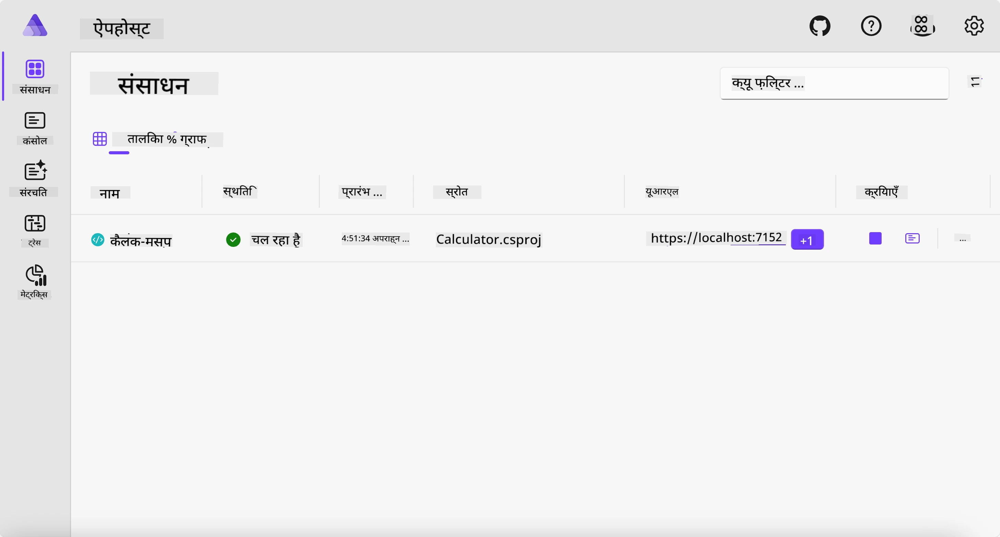
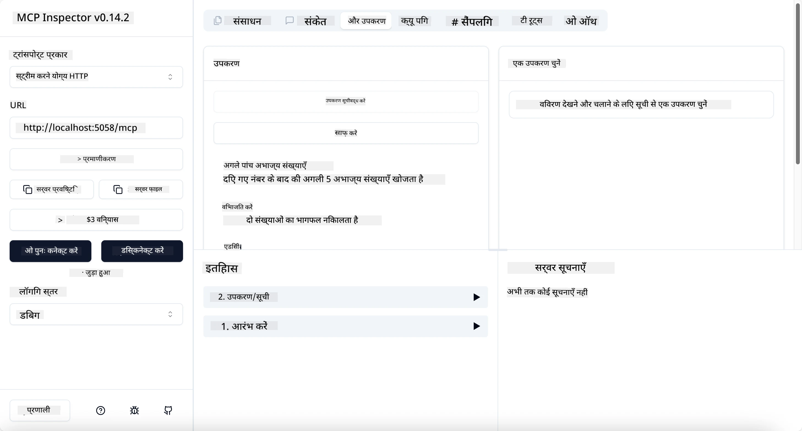
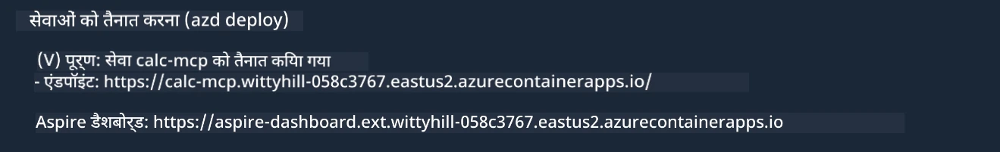

# नमूना

पिछला उदाहरण दिखाता है कि कैसे स्थानीय .NET प्रोजेक्ट को `stdio` प्रकार के साथ उपयोग किया जाता है। और कैसे कंटेनर में सर्वर को स्थानीय रूप से चलाया जाता है। यह कई स्थितियों में एक अच्छा समाधान है। हालांकि, सर्वर को दूरस्थ रूप से चलाना, जैसे कि किसी क्लाउड वातावरण में, उपयोगी हो सकता है। यही वह जगह है जहां `http` प्रकार आता है।

`04-PracticalImplementation` फोल्डर में समाधान को देखने पर, यह पिछली तुलना में बहुत अधिक जटिल लग सकता है। लेकिन वास्तव में ऐसा नहीं है। यदि आप प्रोजेक्ट `src/Calculator` को ध्यान से देखेंगे, तो आप पाएंगे कि यह ज्यादातर पिछला उदाहरण जैसा ही है। एकमात्र अंतर यह है कि हम HTTP अनुरोधों को संभालने के लिए एक अलग लाइब्रेरी `ModelContextProtocol.AspNetCore` का उपयोग कर रहे हैं। और हम `IsPrime` मेथड को प्राइवेट कर देते हैं, सिर्फ यह दिखाने के लिए कि आप अपने कोड में प्राइवेट मेथड्स भी रख सकते हैं। बाकी का कोड पहले जैसा ही है।

अन्य प्रोजेक्ट [Aspire](https://aspire.dev/get-started/what-is-aspire/) से हैं। समाधान में Aspire होने से डेवलपर के लिए विकास और परीक्षण के दौरान अनुभव बेहतर होता है और यह प्रेक्षणीयता में मदद करता है। सर्वर चलाने के लिए आवश्यक नहीं है, लेकिन इसे अपने समाधान में रखना अच्छी प्रैक्टिस है।

## सर्वर को स्थानीय रूप से शुरू करें

1. VS Code (C# DevKit एक्सटेंशन के साथ) से, `04-PracticalImplementation/samples/csharp` निर्देशिका में जाएं।
1. सर्वर शुरू करने के लिए निम्न कमांड चलाएं:

   ```bash
    dotnet watch run --project ./src/AppHost
   ```

1. जब वेब ब्राउज़र Aspire डैशबोर्ड खोलता है, तो `http` URL नोट करें। यह कुछ ऐसा होना चाहिए `http://localhost:5058/`।

   

## MCP इंस्पेक्टर के साथ स्ट्रीम करने योग्य HTTP का परीक्षण करें

यदि आपके पास Node.js 22.7.5 या उससे ऊपर है, तो आप MCP इंस्पेक्टर का उपयोग करके अपने सर्वर का परीक्षण कर सकते हैं।

सर्वर शुरू करें और टर्मिनल में निम्न कमांड चलाएं:

```bash
npx @modelcontextprotocol/inspector http://localhost:5058
```



- ट्रांसपोर्ट प्रकार के रूप में `Streamable HTTP` चुनें।
- Url फील्ड में, पहले नोट किए गए सर्वर के URL को दर्ज करें, और उसके बाद `/mcp` जोड़ें। यह `http` (https नहीं) होना चाहिए, कुछ ऐसा `http://localhost:5058/mcp`।
- Connect बटन चुनें।

इंस्पेक्टर का एक अच्छा पहलू यह है कि यह आपको क्या हो रहा है उस पर अच्छी दृश्यता प्रदान करता है।

- उपलब्ध टूल्स की सूची बनाने का प्रयास करें
- कुछ टूल्स का प्रयोग करें, यह पहले की तरह काम करना चाहिए।

## VS Code में GitHub Copilot Chat के साथ MCP Server का परीक्षण करें

Streamable HTTP ट्रांसपोर्ट का उपयोग करने के लिए, पहले बनाए गए `calc-mcp` सर्वर की कॉन्फ़िगरेशन को इस तरह बदलें:

```jsonc
// .vscode/mcp.json
{
  "servers": {
    "calc-mcp": {
      "type": "http",
      "url": "http://localhost:5058/mcp"
    }
  }
}
```

कुछ परीक्षण करें:

- "3 prime numbers after 6780" पूछें। ध्यान दें कि Copilot नए टूल्स `NextFivePrimeNumbers` का उपयोग करेगा और केवल पहले 3 अभाज्य संख्याएँ लौटाएगा।
- "7 prime numbers after 111" पूछें, यह देखने के लिए कि क्या होता है।
- "John has 24 lollies and wants to distribute them all to his 3 kids. How many lollies does each kid have?" पूछें, यह देखने के लिए कि क्या होता है।

## सर्वर को Azure पर तैनात करें

आइए सर्वर को Azure पर तैनात करें ताकि अधिक लोग इसका उपयोग कर सकें।

टर्मिनल से, `04-PracticalImplementation/samples/csharp` फोल्डर में जाएं और निम्न कमांड चलाएं:

```bash
azd up
```

तैनाती समाप्त होने के बाद, आपको ऐसा संदेश दिखाई देगा:



URL लें और इसे MCP इंस्पेक्टर और GitHub Copilot Chat में उपयोग करें।

```jsonc
// .vscode/mcp.json
{
  "servers": {
    "calc-mcp": {
      "type": "http",
      "url": "https://calc-mcp.gentleriver-3977fbcf.australiaeast.azurecontainerapps.io/mcp"
    }
  }
}
```

## अगला क्या है?

हमने विभिन्न ट्रांसपोर्ट प्रकार और परीक्षण टूल्स को आजमाया। हमने आपके MCP सर्वर को Azure पर भी तैनात किया। लेकिन क्या होगा अगर हमारे सर्वर को निजी संसाधनों तक पहुंचने की आवश्यकता हो? उदाहरण के लिए, किसी डेटाबेस या निजी API तक? अगले अध्याय में, हम देखेंगे कि हम अपने सर्वर की सुरक्षा को कैसे सुधार सकते हैं।

---

<!-- CO-OP TRANSLATOR DISCLAIMER START -->
**अस्वीकरण**:
इस दस्तावेज़ का अनुवाद AI अनुवाद सेवा [Co-op Translator](https://github.com/Azure/co-op-translator) का उपयोग करके किया गया है। जबकि हम सटीकता के लिए प्रयास करते हैं, कृपया ध्यान दें कि स्वचालित अनुवादों में त्रुटियाँ या अशुद्धियाँ हो सकती हैं। मूल दस्तावेज़ अपनी मूल भाषा में ही प्रामाणिक स्रोत माना जाना चाहिए। महत्वपूर्ण जानकारी के लिए, पेशेवर मानव अनुवाद की सिफारिश की जाती है। इस अनुवाद के उपयोग से उत्पन्न किसी भी गलतफहमी या गलत व्याख्या के लिए हम उत्तरदायी नहीं हैं।
<!-- CO-OP TRANSLATOR DISCLAIMER END -->