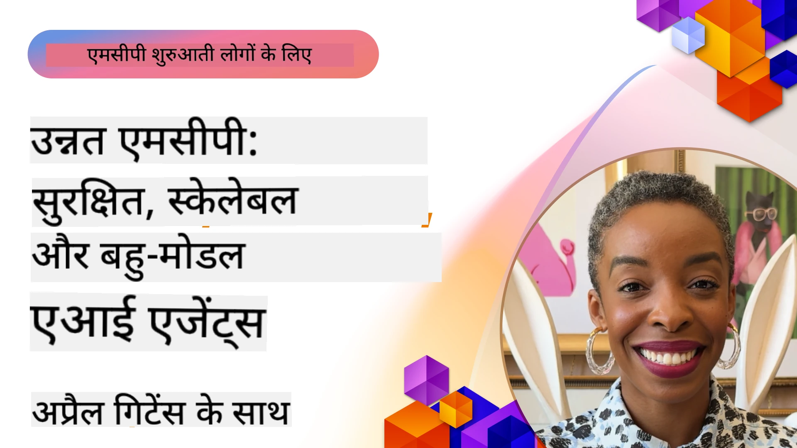

# MCP में उन्नत विषय

_(इस पाठ का वीडियो देखने के लिए ऊपर की छवि पर क्लिक करें)_

यह अध्याय मॉडल कॉन्टेक्स्ट प्रोटोकॉल (MCP) कार्यान्वयन में उन्नत विषयों की एक श्रृंखला को कवर करता है, जिसमें मल्टी-मोडल एकीकरण, स्केलेबिलिटी, सुरक्षा सर्वोत्तम प्रथाएं, और एंटरप्राइज एकीकरण शामिल हैं। ये विषय आधुनिक AI सिस्टमों की मांगों को पूरा करने वाले मजबूत और उत्पादन-तैयार MCP अनुप्रयोग बनाने के लिए बहुत महत्वपूर्ण हैं।

## अवलोकन

यह पाठ MCP कार्यान्वयन में उन्नत अवधारणाओं की खोज करता है, जो मल्टी-मोडल एकीकरण, स्केलेबिलिटी, सुरक्षा सर्वोत्तम प्रथाओं, और एंटरप्राइज एकीकरण पर केंद्रित है। ये विषय उत्पादन-ग्रेड MCP अनुप्रयोगों के निर्माण के लिए आवश्यक हैं जो उद्यमी वातावरण में जटिल आवश्यकताओं को संभाल सकते हैं।

> **मौजूदा विनिर्देश नोट:** MCP `2026-07-28` उस रूट्स और
> सैंपलिंग प्रिमिटिव्स को अप्रचलित करता है जो पाठ 5.4 और 5.6 में कवर हैं। यह
> प्रोटोकॉल फीचर्स (5.16) में संदर्भित प्रयोगात्मक टास्क फीचर को एक
> समर्पित टास्क एक्सटेंशन में स्थानांतरित करता है। वे पाठ विरासत
> `2025-11-25` कार्यान्वयन के लिए रखे गए हैं और इसमें माइग्रेशन मार्गदर्शन शामिल है। देखें
> [MCP में क्या बदला: 2026-07-28 विनिर्देश](../01-CoreConcepts/mcp-2026-07-28.md)।

## सीखने के उद्देश्य

इस पाठ के अंत तक, आप सक्षम होंगे:

- MCP फ्रेमवर्क के भीतर मल्टी-मोडल क्षमताओं को लागू करें
- उच्च मांग वाले परिदृश्यों के लिए स्केलेबल MCP वास्तुकला डिजाइन करें
- MCP की सुरक्षा सिद्धांतों के अनुरूप सुरक्षा सर्वोत्तम प्रथाओं को लागू करें
- MCP को एंटरप्राइज AI सिस्टम और फ्रेमवर्क के साथ एकीकृत करें
- उत्पादन वातावरण में प्रदर्शन और विश्वसनीयता का अनुकूलन करें

## पाठ और नमूना परियोजनाएं

| लिंक | शीर्षक | विवरण |
|------|-------|-------------|
| [5.1 Azure के साथ एकीकरण](./mcp-integration/README.md) | Azure के साथ एकीकरण | जानें कि Azure पर अपने MCP सर्वर को कैसे एकीकृत करें |
| [5.2 मल्टी-मोडल नमूना](./mcp-multi-modality/README.md) | MCP मल्टी-मोडल नमूने | ऑडियो, छवि और मल्टी-मोडल प्रतिक्रिया के लिए नमूने |
| [5.3 MCP OAuth2 नमूना](../../../05-AdvancedTopics/mcp-oauth2-demo) | MCP OAuth2 डेमो | OAuth2 को MCP के साथ दिखाने वाला न्यूनतम स्प्रिंग बूट ऐप, दोनों ऑथोराइजेशन और रिसोर्स सर्वर के रूप में। सुरक्षित टोकन जारी करना, संरक्षित एंडपॉइंट्स, Azure कंटेनर ऐप्स तैनाती, और API प्रबंधन एकीकरण को दर्शाता है। |
| [5.4 रूट कॉन्टेक्स्ट](./mcp-root-contexts/README.md) | रूट कॉन्टेक्स्ट | विरासत `2025-11-25` रूट्स प्रिमिटिव और वर्तमान माइग्रेशन विकल्प सीखें (जिसे `2026-07-28` में अप्रचलित घोषित किया गया है) |
| [5.5 रूटिंग](./mcp-routing/README.md) | रूटिंग | रूटिंग के विभिन्न प्रकार सीखें |
| [5.6 सैंपलिंग](./mcp-sampling/README.md) | सैंपलिंग | विरासत `2025-11-25` सैंपलिंग प्रिमिटिव और वर्तमान माइग्रेशन विकल्प सीखें (जिसे `2026-07-28` में अप्रचलित घोषित किया गया है) |
| [5.7 स्केलिंग](./mcp-scaling/README.md) | स्केलिंग | स्केलिंग के बारे में जानें |
| [5.8 सुरक्षा](./mcp-security/README.md) | सुरक्षा | अपने MCP सर्वर को सुरक्षित करें |
| [5.9 वेब सर्च नमूना](./web-search-mcp/README.md) | वेब सर्च MCP | Python MCP सर्वर और क्लाइंट जो SerpAPI के साथ वास्तविक समय वेब, समाचार, उत्पाद खोज, और प्रश्नोत्तर का एकीकरण करता है। मल्टी-टूल ऑर्केस्ट्रेशन, बाहरी API एकीकरण, और मजबूत त्रुटि प्रबंधन दर्शाता है। |
| [5.10 रियलटाइम स्ट्रीमिंग](./mcp-realtimestreaming/README.md) | स्ट्रीमिंग | वास्तविक समय डेटा स्ट्रीमिंग आज के डेटा-संचालित विश्व में आवश्यक हो गई है, जहां व्यवसाय और अनुप्रयोग समय पर निर्णय लेने के लिए तुरंत जानकारी चाहते हैं। |
| [5.11 रियलटाइम वेब सर्च](./mcp-realtimesearch/README.md) | वेब सर्च | वास्तविक समय वेब खोज कैसे MCP AI मॉडल, खोज इंजनों, और अनुप्रयोगों के बीच कॉन्टेक्स्ट प्रबंधन के लिए मानकीकृत दृष्टिकोण प्रदान करके बदलता है। |
| [5.12 मॉडल कॉन्टेक्स्ट प्रोटोकॉल सर्वरों के लिए Entra ID प्रमाणीकरण](./mcp-security-entra/README.md) | Entra ID प्रमाणीकरण | Microsoft Entra ID एक मजबूत क्लाउड-आधारित पहचान और पहुँच प्रबंधन समाधान प्रदान करता है, जो यह सुनिश्चित करता है कि केवल अधिकृत उपयोगकर्ता और अनुप्रयोग आपके MCP सर्वर के साथ इंटरैक्ट कर सकते हैं। |
| [5.13 Microsoft Foundry एजेंट एकीकरण](./mcp-foundry-agent-integration/README.md) | Microsoft Foundry एकीकरण | Microsoft Foundry एजेंट के साथ मॉडल कॉन्टेक्स्ट प्रोटोकॉल सर्वरों को एकीकृत करना सीखें, जिससे शक्तिशाली उपकरण ऑर्केस्ट्रेशन और एंटरप्राइज AI क्षमताएं मानकीकृत बाहरी डेटा स्रोत कनेक्शनों के साथ सक्षम होती हैं। |
| [5.14 कॉन्टेक्स्ट इंजीनियरिंग](./mcp-contextengineering/README.md) | कॉन्टेक्स्ट इंजीनियरिंग | MCP सर्वरों के लिए कॉन्टेक्स्ट इंजीनियरिंग तकनीकों का भविष्य, जिसमें कॉन्टेक्स्ट ऑप्टिमाइजेशन, डायनामिक कॉन्टेक्स्ट प्रबंधन, और MCP फ्रेमवर्क के भीतर प्रभावी प्रॉम्प्ट इंजीनियरिंग के लिए रणनीतियां शामिल हैं। |
| [5.15 MCP कस्टम ट्रांसपोर्ट](./mcp-transport/README.md) | कस्टम ट्रांसपोर्ट | विशेष MCP संचार परिदृश्यों के लिए कस्टम ट्रांसपोर्ट तंत्र को लागू करना सीखें। |
| [5.16 प्रोटोकॉल फीचर्स डीप डायव](./mcp-protocol-features/README.md) | प्रोटोकॉल फीचर्स | प्रगति सूचनाएं, अनुरोध रद्द करना, संसाधन टेम्पलेट्स, और त्रुटि प्रबंधन पैटर्न सहित उन्नत प्रोटोकॉल फीचर्स में महारत हासिल करें। |
| [5.17 एडवर्सेरियल मल्टी-एजेंट रीज़निंग](./mcp-adversarial-agents/README.md) | विरोधी एजेंट | दो एजेंटों का उपयोग करें जिनकी विरोधी स्थिति होती है, जो एक ही MCP टूल सेट साझा करते हैं, भ्रमों को पकड़ने, किनारे मामलों को उजागर करने, और संरचित बहस के माध्यम से बेहतर-कैलिब्रेटेड आउटपुट उत्पन्न करने के लिए। |

> **ऐतिहासिक `2025-11-25` नोट:** उस संशोधन ने प्रयोगात्मक
> टास्क पेश किए और कई प्रोटोकॉल फीचर्स का विस्तार किया। `2026-07-28` में, टास्क
> एक आधिकारिक एक्सटेंशन बन गए और रूट्स अप्रचलित हो गए। कृपया
> `2025-11-25` फीचर स्थिति को वर्तमान मार्गदर्शन के रूप में उपयोग न करें; देखें
> [2026-07-28 चेंजलॉग](https://modelcontextprotocol.io/specification/2026-07-28/changelog)।

## अतिरिक्त संदर्भ

उन्नत MCP विषयों पर नवीनतम जानकारी के लिए, देखें:
- [MCP प्रलेखन](https://modelcontextprotocol.io/)
- [MCP विनिर्देश (2026-07-28)](https://modelcontextprotocol.io/specification/2026-07-28/)
- [GitHub रिपॉजिटरी](https://github.com/modelcontextprotocol)
- [OWASP MCP शीर्ष 10](https://microsoft.github.io/mcp-azure-security-guide/mcp/) - सुरक्षा जोखिम और निवारण
- [MCP सुरक्षा शिखर सम्मेलन कार्यशाला (Sherpa)](https://azure-samples.github.io/sherpa/) - व्यावहारिक सुरक्षा प्रशिक्षण

## मुख्य बातें

- मल्टी-मोडल MCP कार्यान्वयन AI क्षमताओं को पाठ प्रसंस्करण से आगे बढ़ाते हैं
- उद्यम तैनाती के लिए स्केलेबिलिटी आवश्यक है और इसे हॉरिजॉन्टल और वर्टिकल स्केलिंग के माध्यम से संबोधित किया जा सकता है
- व्यापक सुरक्षा उपाय डेटा की सुरक्षा करते हैं और उचित पहुँच नियंत्रण सुनिश्चित करते हैं
- Azure OpenAI और Microsoft AI Foundry जैसे प्लेटफॉर्म के साथ एंटरप्राइज एकीकरण MCP क्षमताओं को बढ़ाता है
- उन्नत MCP कार्यान्वयन अनुकूलित वास्तुकला और सावधान संसाधन प्रबंधन से लाभान्वित होते हैं

## अभ्यास

किसी विशिष्ट उपयोग मामले के लिए एक एंटरप्राइज-ग्रेड MCP कार्यान्वयन डिजाइन करें:

1. अपने उपयोग मामले के लिए मल्टी-मोडल आवश्यकताओं की पहचान करें
2. संवेदनशील डेटा की सुरक्षा के लिए आवश्यक सुरक्षा नियंत्रणों का रूपरेखा बनाएं
3. ऐसी स्केलेबल वास्तुकला डिजाइन करें जो भिन्न लोड को संभाल सके
4. एंटरप्राइज AI सिस्टम के साथ एकीकरण के बिंदुओं की योजना बनाएं
5. संभावित प्रदर्शन बाधाओं और निवारण रणनीतियों का प्रलेखन करें

## अतिरिक्त संसाधन

- [Azure OpenAI प्रलेखन](https://learn.microsoft.com/en-us/azure/ai-services/openai/)
- [Microsoft AI Foundry प्रलेखन](https://learn.microsoft.com/en-us/ai-services/)

---

## आगे क्या

इस मॉड्यूल में पाठों का अन्वेषण शुरू करें: [5.1 MCP एकीकरण](./mcp-integration/README.md)

इस मॉड्यूल को पूरा करने के बाद जारी रखें: [मॉड्यूल 6: समुदाय योगदान](../06-CommunityContributions/README.md)

---

<!-- CO-OP TRANSLATOR DISCLAIMER START -->
**अस्वीकरण**:
इस दस्तावेज़ का अनुवाद AI अनुवाद सेवा [Co-op Translator](https://github.com/Azure/co-op-translator) का उपयोग करके किया गया है। जबकि हम सटीकता के लिए प्रयास करते हैं, कृपया ध्यान दें कि स्वचालित अनुवादों में त्रुटियाँ या अशुद्धियाँ हो सकती हैं। मूल दस्तावेज़ अपनी मूल भाषा में ही प्रामाणिक स्रोत माना जाना चाहिए। महत्वपूर्ण जानकारी के लिए, पेशेवर मानव अनुवाद की सिफारिश की जाती है। इस अनुवाद के उपयोग से उत्पन्न किसी भी गलतफहमी या गलत व्याख्या के लिए हम उत्तरदायी नहीं हैं।
<!-- CO-OP TRANSLATOR DISCLAIMER END -->