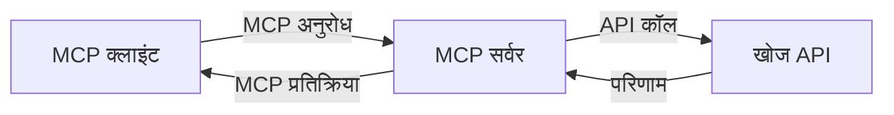
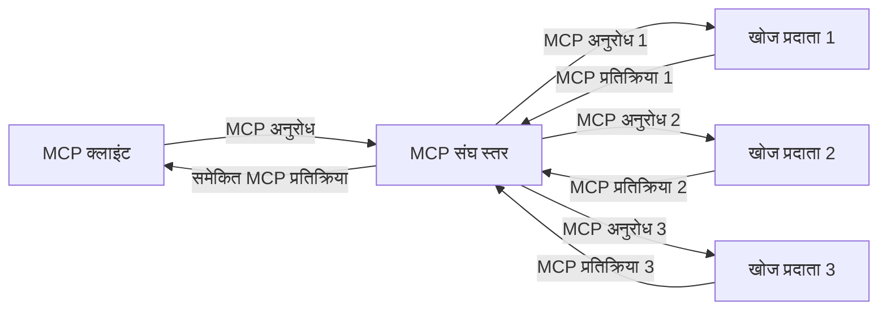
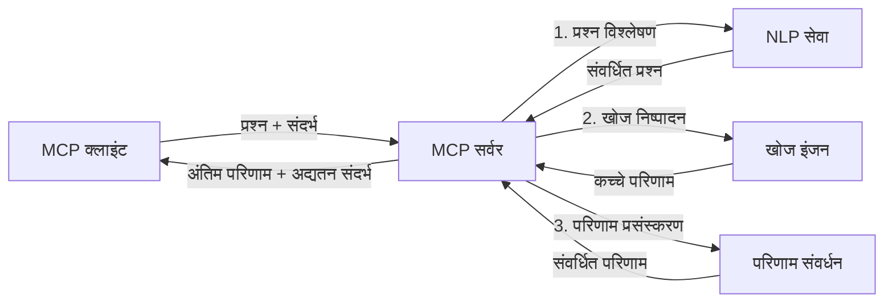

# रियल-टाइम वेब सर्च के लिए मॉडल संदर्भ प्रोटोकॉल

## अवलोकन

आज की सूचना-प्रधान दुनिया में रियल-टाइम वेब सर्च आवश्यक हो गया है, जहाँ एप्लिकेशन को प्रासंगिक और समयोचित प्रतिक्रियाएं प्रदान करने के लिए इंटरनेट पर अद्यतन जानकारी तक तुरंत पहुंच की आवश्यकता होती है। मॉडल संदर्भ प्रोटोकॉल (MCP) इन रियल-टाइम खोज प्रक्रियाओं को अनुकूलित करने में एक महत्वपूर्ण प्रगति का प्रतिनिधित्व करता है, खोज दक्षता को बढ़ाता है, संदर्भीय अखंडता बनाए रखता है, और समग्र प्रणाली प्रदर्शन में सुधार करता है।

यह मॉड्यूल बताता है कि कैसे MCP वास्तविक समय वेब खोज को बदलता है, एआई मॉडलों, खोज इंजनों, और एप्लिकेशनों के बीच संदर्भ प्रबंधन के लिए एक मानकीकृत दृष्टिकोण प्रदान करके।

### आप क्या सीखेंगे

इस व्यापक गाइड में, आप पाएंगे:

- MCP कैसे एआई मॉडलों और रियल-टाइम वेब सर्च क्षमताओं के बीच एक सहज पुल बनाता है
- MCP के साथ कुशल और स्केलेबल खोज समाधानों को लागू करने के वास्तुशिल्प पैटर्न
- कई प्रश्नों और इंटरैक्शन में खोज संदर्भ को बनाए रखने की तकनीकें
- विभिन्न खोज परिदृश्यों के लिए Python और JavaScript में व्यावहारिक कोड कार्यान्वयन
- MCP-संचालित खोज प्रणालियों में प्रासंगिकता, नवीनता, और प्रदर्शन का संतुलन बनाने के तरीके

## रियल-टाइम वेब सर्च का परिचय

रियल-टाइम वेब सर्च एक तकनीकी दृष्टिकोण है जो वेब-आधारित जानकारी के निरंतर क्वेरी, संसाधन, और विश्लेषण को सक्षम बनाता है जैसे ही यह प्रकाशित या अपडेट होती है, जिससे सिस्टम न्यूनतम विलंब के साथ ताजा और प्रासंगिक जानकारी प्रदान कर सकते हैं। पारंपरिक खोज प्रणालियों के विपरीत जो घंटे या दिन पुरानी अनुक्रमित जानकारी पर काम करती हैं, रियल-टाइम खोज वेब से लाइव डेटा का उपयोग करती है, ऑनलाइन सामग्री की वर्तमान स्थिति को प्रतिबिंबित करने वाली अंतर्दृष्टि और जानकारी प्रदान करती है।

### रियल-टाइम वेब सर्च की मूल अवधारणाएं:

- **निरंतर क्वेरी प्रसंस्करण**: खोज क्वेरी लगातार अपडेट हो रहे डेटा स्रोतों के विरुद्ध संसाधित होती है
- **नवीनता प्राथमिकता**: सिस्टम ताजा जानकारी को प्राथमिकता देने के लिए डिज़ाइन किए जाते हैं
- **प्रासंगिकता का संतुलन**: प्रासंगिकता और नवीनता के बीच संतुलन बनाए रखना
- **स्केलेबल आर्किटेक्चर**: सिस्टम को विभिन्न क्वेरी भार और डेटा मात्रा को संभालना चाहिए
- **संदर्भीय समझ**: सार्थक परिणामों के लिए खोज पुनरावृत्तियों में उपयोगकर्ता संदर्भ बनाए रखना आवश्यक है
- **गतिशील क्वेरी पुन:सृजन**: संदर्भ और पिछले परिणामों के आधार पर क्वेरियों को अनुकूल रूप से संशोधित करना
- **मल्टी-स्रोत एकीकरण**: कई खोज प्रदाताओं और वेब स्रोतों से परिणामों को जोड़ना
- **सामान्य समझ**: केवल कीवर्ड के बजाय अर्थ के आधार पर क्वेरी और सामग्री को संसाधित करना
- **रियल-टाइम रैंकिंग**: नई जानकारी के उपलब्ध होते ही परिणाम रैंकिंग को लगातार समायोजित करना

### मॉडल संदर्भ प्रोटोकॉल और रियल-टाइम वेब सर्च

मॉडल संदर्भ प्रोटोकॉल (MCP) रियल-टाइम वेब सर्च वातावरण में कई महत्वपूर्ण चुनौतियों को संबोधित करता है:

1. **खोज संदर्भ संरक्षण**: MCP संदर्भ के वितरण को मानकीकृत करता है, यह सुनिश्चित करते हुए कि AI मॉडल और प्रसंस्करण नोड्स को संबंधित क्वेरी इतिहास और उपयोगकर्ता पसंद तक पहुंच हो।

2. **कुशल क्वेरी प्रबंधन**: संदर्भ संचरण के लिए संरचित तंत्र प्रदान करके, MCP प्रत्येक खोज पुनरावृत्ति में संदर्भ दोहराने के ओवरहेड को कम करता है।

3. **अंतरसंचालितता**: MCP विविध खोज तकनीकों और AI मॉडलों के बीच संदर्भ साझा करने के लिए एक सामान्य भाषा बनाता है, जिससे अधिक लचीली और विस्तारशील वास्तुकलाएं संभव होती हैं।

4. **खोज-अनुकूलित संदर्भ**: MCP कार्यान्वयन यह प्राथमिकता दे सकते हैं कि कौन से संदर्भ तत्व प्रभावी खोज के लिए सबसे प्रासंगिक हैं, जिससे प्रदर्शन और सटीकता दोनों का अनुकूलन होता है।

5. **अनुकूलित खोज प्रसंस्करण**: MCP के माध्यम से उचित संदर्भ प्रबंधन के साथ, खोज प्रणालियाँ बदलती उपयोगकर्ता आवश्यकताओं और सूचना परिदृश्यों के आधार पर प्रोसेसिंग को गतिशील रूप से समायोजित कर सकती हैं।

समाचार एकत्रीकरण से लेकर अनुसंधान सहायक तक आधुनिक अनुप्रयोगों में, MCP का वेब सर्च तकनीकों के साथ संयोजन अधिक बुद्धिमान, संदर्भ-सचेत खोज सक्षम करता है जो उपयोगकर्ता इंटरैक्शन के साथ अधिक प्रासंगिक परिणाम प्रदान कर सकता है।

## सीखने के उद्देश्य

इस पाठ के अंत तक, आप सक्षम होंगे:

- रियल-टाइम वेब सर्च के मूल सिद्धांतों और आधुनिक अनुप्रयोगों में इसकी चुनौतियों को समझना
- समझाना कि मॉडल संदर्भ प्रोटोकॉल (MCP) रियल-टाइम वेब सर्च क्षमताओं को कैसे बढ़ाता है
- लोकप्रिय फ्रेमवर्क और एपीआई का उपयोग करके MCP-आधारित खोज समाधान लागू करना
- MCP के साथ स्केलेबल, उच्च-प्रदर्शन खोज वास्तुकलाएं डिजाइन और तैनात करना
- एमसीपी अवधारणाओं को विभिन्न उपयोग मामलों पर लागू करना जिसमें साधारण खोज, अनुसंधान सहायता, और AI-संवर्धित ब्राउज़िंग शामिल हैं
- MCP-आधारित खोज तकनीकों में उभरती प्रवृत्तियों और भावी नवाचारों का मूल्यांकन करना
- उपयोगकर्ता इंटरैक्शन से सीखने वाली संदर्भ-सचेत खोज प्रणालियाँ विकसित करना
- मानकीकृत MCP प्रोटोकॉल का उपयोग करके AI सहायकों में वेब सर्च क्षमताओं को एकीकृत करना
- संदर्भ के आधार पर परिणामों को क्रमिक रूप से परिष्कृत करने वाली बहु-चरण खोज पाइपलाइनों का निर्माण करना
- व्यापक संदर्भ जागरूकता बनाए रखते हुए खोज प्रदर्शन का अनुकूलन करना

### परिभाषा और महत्व

रियल-टाइम वेब सर्च में न्यूनतम विलंब के साथ वेब-आधारित जानकारी की लगातार क्वेरी, पुनःप्राप्ति, और वितरण शामिल है। पारंपरिक खोज इंजन जो वेब पर आवधिक रूप से क्रॉल और इंडेक्स करते हैं, रियल-टाइम खोज उस समय उपलब्ध जानकारी को सतह पर लाने का प्रयास करता है, जिससे सबसे वर्तमान सामग्री तक तुरंत पहुंच संभव होती है।

रियल-टाइम वेब सर्च की मुख्य विशेषताएं हैं:

- **ताजगी**: हाल की सामग्री और अपडेट को प्राथमिकता देना
- **निरंतर प्रसंस्करण**: नई जानकारी के लिए लगातार निगरानी
- **क्वेरी अनुकूलन**: संदर्भ और फीडबैक के आधार पर खोज क्वेरी को परिष्कृत करना
- **तत्काल वितरण**: न्यूनतम विलंब के साथ खोज परिणाम प्रदान करना
- **संदर्भ धारणा**: बेहतर प्रासंगिकता के लिए पिछले क्वेरी पर निर्माण करना

### पारंपरिक वेब सर्च की चुनौतियाँ

पारंपरिक वेब सर्च दृष्टिकोणों को रियल-टाइम परिदृश्यों में लागू करते समय कई सीमाओं का सामना करना पड़ता है:

1. **संदर्भ खंडन**: कई क्वेरी के बीच खोज संदर्भ बनाए रखने में कठिनाई
2. **सूचना की ताजगी**: सबसे हाल की जानकारी तक पहुंच और प्राथमिकता देने में चुनौतियाँ
3. **एकीकरण जटिलता**: खोज प्रणालियों और एप्लिकेशनों के बीच अंतर-क्रियाशीलता की समस्याएँ
4. **विलंब समस्याएँ**: व्यापक खोज और प्रतिक्रिया समय आवश्यकताओं के बीच संतुलन बनाना
5. **प्रासंगिकता ट्यूनिंग**: नवीनता को प्राथमिकता देते हुए सटीकता और प्रासंगिकता सुनिश्चित करना

## खोज के लिए मॉडल संदर्भ प्रोटोकॉल (MCP) की समझ

### सर्च संदर्भ में MCP क्या है?

मॉडल संदर्भ प्रोटोकॉल (MCP) एक मानकीकृत संचार प्रोटोकॉल है जो AI मॉडल और एप्लिकेशनों के बीच कुशल अंतःक्रिया की सुविधा प्रदान करने के लिए डिज़ाइन किया गया है। रियल-टाइम वेब सर्च के संदर्भ में, MCP प्रदान करता है:

- क्वेरी अनुक्रमों में खोज संदर्भ को बरकरार रखना
- खोज क्वेरी और परिणाम स्वरूपों को मानकीकृत करना
- खोज पैरामीटर और परिणामों के संचरण का अनुकूलन करना
- मॉडल से खोज इंजन संचार को बेहतर बनाना

### मुख्य घटक और वास्तुकला

रियल-टाइम वेब सर्च के लिए MCP वास्तुकला में कई प्रमुख घटक शामिल हैं:

1. **क्वेरी संदर्भ हैंडलर**: कई क्वेरियों के बीच खोज संदर्भ का प्रबंधन और रखरखाव करना
2. **खोज प्रोसेसर**: संदर्भ-सचेत तकनीकों का उपयोग करके आने वाली खोज अनुरोधों को संसाधित करना
3. **प्रोटोकॉल एडाप्टर**: संदर्भ बनाए रखते हुए विभिन्न खोज APIs के बीच रूपांतरण करना
4. **संदर्भ स्टोर**: खोज इतिहास और प्राथमिकताओं को कुशलतापूर्वक संग्रहित और पुनःप्राप्त करना
5. **खोज कनेक्टर**: विभिन्न खोज इंजनों और वेब APIs से कनेक्ट करना


### MCP कैसे रियल-टाइम वेब सर्च में सुधार करता है

MCP पारंपरिक वेब सर्च चुनौतियों को निम्नलिखित द्वारा संबोधित करता है:

- **संदर्भ निरंतरता**: पूरे खोज सत्र में क्वेरियों के बीच संबंध बनाए रखना
- **अनुकूलित संचरण**: बुद्धिमान संदर्भ प्रबंधन के माध्यम से खोज पैरामीटर में पुनरावृत्ति को कम करना
- **मानकीकृत इंटरफेस**: खोज घटकों के लिए सुसंगत APIs प्रदान करना
- **विलंब कम करना**: कुशल संदर्भ हैंडलिंग के माध्यम से प्रसंस्करण ओवरहेड न्यूनतम करना
- **प्रासंगिकता बढ़ाना**: कई क्वेरियों में उपयोगकर्ता इरादे को बनाए रखकर खोज प्रासंगिकता में सुधार करना

## एकीकरण और कार्यान्वयन

रियल-टाइम वेब सर्च प्रणालियों को प्रदर्शन और संदर्भीय अखंडता दोनों बनाए रखने के लिए सावधानीपूर्वक वास्तुकला डिज़ाइन और कार्यान्वयन की आवश्यकता होती है। मॉडल संदर्भ प्रोटोकॉल AI मॉडल और खोज तकनीकों को एकीकृत करने के लिए मानकीकृत दृष्टिकोण प्रदान करता है, जिससे अधिक जटिल, संदर्भ-सचेत खोज पाइपलाइन संभव होती हैं।

### खोज वास्तुकलाओं में MCP एकीकरण का अवलोकन

रियल-टाइम वेब सर्च वातावरण में MCP को लागू करते समय कई महत्वपूर्ण विचार होते हैं:

1. **खोज संदर्भ सीरियलाइजेशन**: MCP खोज अनुरोधों में संदर्भात्मक जानकारी को कोडित करने के लिए कुशल तंत्र प्रदान करता है, यह सुनिश्चित करता है कि आवश्यक संदर्भ क्वेरी के दौरान प्रसंस्करण पाइपलाइन के माध्यम से चलता रहे। इसमें खोज-संबंधित मेटाडेटा के लिए अनुकूलित मानकीकृत सीरियलाइजेशन प्रारूप शामिल हैं।

2. **राज्यपूर्ण खोज प्रसंस्करण**: MCP अधिक बुद्धिमान राज्यपूर्ण प्रसंस्करण सक्षम करता है, जो खोज पुनरावृत्तियों के दौरान स्थिर संदर्भ प्रतिनिधित्व बनाए रखता है। यह विशेष रूप से बहु-चरण खोज पाइपलाइनों में उपयोगी होता है जहाँ संदर्भ परिष्करण परिणामों में सुधार करता है।

3. **क्वेरी विस्तार और परिष्करण**: खोज प्रणालियों में MCP कार्यान्वयन संचयित संदर्भ के आधार पर परिष्कृत क्वेरी विस्तार और सुधार को सुविधाजनक बना सकते हैं, जिससे खोज सत्र के विस्तार के साथ अधिक प्रासंगिक परिणाम मिलते हैं।

4. **परिणाम कैशिंग और प्राथमिकता**: संदर्भ हैंडलिंग को मानकीकृत करके, MCP परिणाम कैशिंग और प्राथमिकता प्रबंधन में सहायता करता है, जिससे घटक विकसित हो रहे खोज संदर्भ के अनुसार अनुकूलित हो सकते हैं।

5. **खोज संघ और संग्रह**: MCP कई बैकएंड्स के बीच खोज के अधिक परिष्कृत संघ की सुविधा प्रदान करता है, खोज संदर्भ का संरचित प्रतिनिधित्व प्रदान करके विभिन्न स्रोतों से परिणामों के अधिक सार्थक संग्रह को संभव बनाता है।

विभिन्न खोज तकनीकों में MCP के कार्यान्वयन से संदर्भ प्रबंधन के लिए एकीकृत दृष्टिकोण बनता है, कस्टम एकीकरण कोड की आवश्यकता को कम करते हुए खोज क्वेरियों के विकास के साथ सार्थक संदर्भ बनाए रखने की प्रणाली की क्षमता को बढ़ाता है।

### विभिन्न वेब खोज कार्यान्वयनों में MCP

ये उदाहरण वर्तमान MCP विनिर्देशन का पालन करते हैं जो एक JSON-RPC आधारित प्रोटोकॉल पर केंद्रित है जिसमें विशिष्ट परिवहन तंत्र होते हैं। कोड इस बात को दर्शाता है कि आप किस प्रकार कस्टम खोज एकीकरण कर सकते हैं जबकि MCP प्रोटोकॉल के साथ पूर्ण संगतता बनाए रखते हैं।


<details>
<summary>Generic Search API के साथ Python कार्यान्वयन</summary>

```python
import asyncio
import json
import aiohttp
from typing import Dict, Any, Optional, List
from contextlib import asynccontextmanager
from collections.abc import AsyncIterator

# मानक MCP लाइब्रेरी आयात करें
from mcp.client.session import ClientSession
from mcp.client.streamable_http import streamablehttp_client
from mcp.types import TextContent, CreateMessageRequestParams, CreateMessageResult
from mcp.server.fastmcp import FastMCP

# वेब खोज के लिए एक FastMCP सर्वर बनाएं
search_server = FastMCP("WebSearch")

# वेब खोज संचालन को संभालने के लिए क्लास
class WebSearchHandler:
    def __init__(self, api_endpoint: str, api_key: str):
        self.api_endpoint = api_endpoint
        self.api_key = api_key
        self.session = None
        
    async def initialize(self):
        """Initialize the HTTP session"""
        self.session = aiohttp.ClientSession(
            headers={"Authorization": f"Bearer {self.api_key}"}
        )
    
    async def close(self):
        """Close the HTTP session"""
        if self.session:
            await self.session.close()
            
    async def perform_search(self, query: str, max_results: int = 5, 
                           include_domains: List[str] = None, 
                           exclude_domains: List[str] = None,
                           time_period: str = "any") -> Dict[str, Any]:
        """Perform web search using the search API"""
        # खोज पैरामीटर तैयार करें
        search_params = {
            "q": query,
            "limit": max_results,
            "time": time_period
        }
        
        if include_domains:
            search_params["site"] = ",".join(include_domains)
            
        if exclude_domains:
            search_params["exclude_site"] = ",".join(exclude_domains)
        
        # खोज अनुरोध को निष्पादित करें
        try:
            async with self.session.get(
                self.api_endpoint,
                params=search_params
            ) as response:
                if response.status != 200:
                    error_text = await response.text()
                    raise Exception(f"Search API error: {response.status} - {error_text}")
                
                search_data = await response.json()
                
                # एपीआई-विशिष्ट प्रतिक्रिया को मानक प्रारूप में परिवर्तित करें
                results = []
                for item in search_data.get("results", []):
                    results.append({
                        "title": item.get("title", ""),
                        "url": item.get("url", ""),
                        "snippet": item.get("snippet", ""),
                        "date": item.get("published_date", ""),
                        "source": item.get("source", "")
                    })
                
                return {
                    "query": query,
                    "totalResults": len(results),
                    "results": results
                }
        except Exception as e:
            print(f"Search API request error: {e}")
            raise

# खोज हैंडलर को प्रारंभ करें
search_handler = WebSearchHandler(
    api_endpoint="https://api.search-service.example/search",
    api_key="your-api-key-here"
)

# खोज हैंडलर का प्रबंधन करने के लिए लाइफस्पैन सेट करें
@asyncio.asynccontextmanager
async def app_lifespan(server: FastMCP):
    """Manage application lifecycle"""
    await search_handler.initialize()
    try:
        yield {"search_handler": search_handler}
    finally:
        await search_handler.close()

# सर्वर के लिए लाइफस्पैन सेट करें
search_server = FastMCP("WebSearch", lifespan=app_lifespan)

# एक वेब खोज टूल दर्ज करें
@search_server.tool()
async def web_search(query: str, max_results: int = 5, 
                   include_domains: List[str] = None,
                   exclude_domains: List[str] = None,
                   time_period: str = "any") -> Dict[str, Any]:
    """
    Search the web for information
    
    Args:
        query: The search query
        max_results: Maximum number of results to return (default: 5)
        include_domains: List of domains to include in search results
        exclude_domains: List of domains to exclude from search results
        time_period: Time period for results ("day", "week", "month", "any")
        
    Returns:
        Dictionary containing search results
    """
    ctx = search_server.get_context()
    search_handler = ctx.request_context.lifespan_context["search_handler"]
    
    results = await search_handler.perform_search(
        query=query,
        max_results=max_results,
        include_domains=include_domains,
        exclude_domains=exclude_domains,
        time_period=time_period
    )
    
    return results

# उदाहरण क्लाइंट उपयोग
async def client_example():
    # Streamable HTTP ट्रांसपोर्ट का उपयोग करके खोज सर्वर से कनेक्ट करें
    async with streamablehttp_client("http://localhost:8000/mcp") as (read, write, _):
        async with ClientSession(read, write) as session:
            # कनेक्शन प्रारंभ करें
            await session.initialize()
            
            # वेब_सर्च टूल को कॉल करें
            search_results = await session.call_tool(
                "web_search", 
                {
                    "query": "latest developments in AI and Model Context Protocol",
                    "max_results": 5,
                    "time_period": "day",
                    "include_domains": ["github.com", "microsoft.com"]
                }
            )
            
            print(f"Search results: {search_results}")

# सर्वर निष्पादन उदाहरण
if __name__ == "__main__":
    # Streamable HTTP ट्रांसपोर्ट के साथ सर्वर चलाएं
    search_server.run(transport="streamable-http")
```
</details> 

<details>
<summary>ब्राउज़र-आधारित खोज के साथ JavaScript कार्यान्वयन</summary>


```javascript
// वेब खोज के लिए MCP सर्वर कार्यान्वयन
import { McpServer, ResourceTemplate } from '@modelcontextprotocol/sdk/server/mcp.js';
import { StreamableHTTPServerTransport } from '@modelcontextprotocol/sdk/server/streamableHttp.js';
import { z } from 'zod';

// वेब खोज के लिए एक MCP सर्वर बनाएं
const searchServer = new McpServer({
    name: "BrowserSearch",
    description: "A server that provides web search capabilities"
});

// खोज सेवा वर्ग
class SearchService {
    constructor(searchApiUrl, apiKey) {
        this.searchApiUrl = searchApiUrl;
        this.apiKey = apiKey;
    }

    async performSearch(parameters) {
        const {
            query = '',
            maxResults = 5,
            includeDomains = [],
            excludeDomains = [],
            timePeriod = 'any'
        } = parameters;
        
        // पैरामीटर के साथ खोज URL बनाएं
        const url = new URL(this.searchApiUrl);
        url.searchParams.append('q', query);
        url.searchParams.append('limit', maxResults);
        url.searchParams.append('time', timePeriod);
        
        if (includeDomains.length > 0) {
            url.searchParams.append('site', includeDomains.join(','));
        }
        
        if (excludeDomains.length > 0) {
            url.searchParams.append('exclude_site', excludeDomains.join(','));
        }
        
        try {
            const response = await fetch(url.toString(), {
                method: 'GET',
                headers: {
                    'Authorization': `Bearer ${this.apiKey}`,
                    'Content-Type': 'application/json'
                }
            });
            
            if (!response.ok) {
                const errorText = await response.text();
                throw new Error(`Search API error: ${response.status} - ${errorText}`);
            }
            
            const searchData = await response.json();
            
            // API-विशिष्ट प्रतिक्रिया को एक मानक प्रारूप में बदलें
            const results = searchData.results?.map(item => ({
                title: item.title || '',
                url: item.url || '',
                snippet: item.snippet || '',
                date: item.published_date || '',
                source: item.source || ''
            })) || [];
            
            return {
                query,
                totalResults: results.length,
                results
            };
        } catch (error) {
            console.error('Search API request error:', error);
            throw error;
        }
    }
}

// खोज सेवा आरंभ करें
const searchService = new SearchService(
    'https://api.search-service.example/search',
    'your-api-key-here'
);

// सर्वर के लिए संदर्भ प्रदाता सेटअप करें
searchServer.setContextProvider(() => {
    return {
        searchService
    };
});

// वेब खोज टूल पंजीकृत करें
searchServer.tool({
    name: 'web_search',
    description: 'Search the web for information',
    parameters: {
        type: 'object',
        properties: {
            query: {
                type: 'string',
                description: 'The search query'
            },
            maxResults: {
                type: 'integer',
                description: 'Maximum number of results to return',
                default: 5
            },
            includeDomains: {
                type: 'array',
                items: { type: 'string' },
                description: 'List of domains to include in search results'
            },
            excludeDomains: {
                type: 'array',
                items: { type: 'string' },
                description: 'List of domains to exclude from search results'
            },
            timePeriod: {
                type: 'string',
                description: 'Time period for results',
                enum: ['day', 'week', 'month', 'any'],
                default: 'any'
            }
        },
        required: ['query']
    },
    handler: async (params, context) => {
        const { searchService } = context;
        return await searchService.performSearch(params);
    }
});

// खोज सर्वर से कनेक्ट करने के लिए उदाहरण क्लाइंट कोड
import { Client } from '@modelcontextprotocol/sdk/client/index.js';
import { StreamableHTTPClientTransport } from '@modelcontextprotocol/sdk/client/streamableHttp.js';

async function connectToSearchServer() {
    // खोज सर्वर से कनेक्ट करें
    const transport = new StreamableHTTPClientTransport(
        new URL('http://localhost:8000/mcp')
    );
    
    const client = new Client({
        name: 'search-client',
        version: '1.0.0'
    });
    
    await client.connect(transport);
    
    // खोज टूल निष्पादित करें
    const searchResults = await client.callTool({
        name: 'web_search',
        arguments: {
            query: 'Model Context Protocol implementation examples',
            maxResults: 10,
            timePeriod: 'week',
            includeDomains: ['github.com', 'docs.microsoft.com']
        }
    });
    
    console.log('Search results:', searchResults);
    
    // सफाई करें
    await client.disconnect();
}

// सर्वर शुरू करें
const transport = new StreamableHTTPServerTransport();
await searchServer.connect(transport);
console.log('Search server running at http://localhost:8000/mcp');

// एक अलग प्रक्रिया में या सर्वर शुरू होने के बाद
// connectToSearchServer().catch(console.error);
```
</details> 


## कोड उदाहरणों की अस्वीकरण

> **महत्वपूर्ण नोट**: नीचे दिए गए कोड उदाहरण मॉडल संदर्भ प्रोटोकॉल (MCP) के वेब खोज कार्यक्षमता के साथ एकीकरण को दर्शाते हैं। जबकि ये आधिकारिक MCP SDK के पैटर्न और संरचनाओं का पालन करते हैं, उन्हें शैक्षिक उद्देश्यों के लिए सरल बनाया गया है।
> 
> ये उदाहरण प्रदर्शित करते हैं:
> 
> 1. **Python कार्यान्वयन**: एक FastMCP सर्वर कार्यान्वयन जो एक वेब खोज उपकरण प्रदान करता है और बाहरी खोज API से जुड़ता है। यह उदाहरण उचित जीवनकाल प्रबंधन, संदर्भ प्रबंधन, और [आधिकारिक MCP Python SDK](https://github.com/modelcontextprotocol/python-sdk) के पैटर्न के अनुसार उपकरण कार्यान्वयन दिखाता है। सर्वर सिफारिश की गई Streamable HTTP ट्रांसपोर्ट का उपयोग करता है, जो उत्पादन तैनाती के लिए पुराने SSE ट्रांसपोर्ट की जगह ले चुका है।
> 
> 2. **JavaScript कार्यान्वयन**: [आधिकारिक MCP TypeScript SDK](https://github.com/modelcontextprotocol/typescript-sdk) से FastMCP पैटर्न का उपयोग करते हुए एक TypeScript/JavaScript कार्यान्वयन जो उचित उपकरण परिभाषाओं और ग्राहक कनेक्शनों के साथ एक खोज सर्वर बनाता है। यह सत्र प्रबंधन और संदर्भ संरक्षण के लिए नवीनतम अनुशंसित पैटर्न का पालन करता है।
> 
> ये उदाहरण उत्पादन उपयोग के लिए अतिरिक्त त्रुटि हैंडलिंग, प्रमाणीकरण, और विशिष्ट API एकीकरण कोड की आवश्यकता होगी। प्रदर्शित खोज API एंडपॉइंट (`https://api.search-service.example/search`) प्लेसहोल्डर हैं और इन्हें वास्तविक खोज सेवा एंडपॉइंट्स से प्रतिस्थापित किया जाना चाहिए।
> 
> पूर्ण कार्यान्वयन विवरण और सबसे अद्यतित दृष्टिकोणों के लिए,
> [आधिकारिक MCP विनिर्देशन](https://modelcontextprotocol.io/specification/2026-07-28/)
> और SDK दस्तावेज़ देखें।

## मुख्य अवधारणाएं

### मॉडल संदर्भ प्रोटोकॉल (MCP) फ्रेमवर्क

इसके मूल में, मॉडल संदर्भ प्रोटोकॉल एआई मॉडल, एप्लिकेशन, और सेवाओं के बीच संदर्भ साझा करने का एक मानकीकृत तरीका प्रदान करता है। रियल-टाइम वेब सर्च में, यह फ्रेमवर्क सुसंगत, बहु-चरण खोज अनुभवों के निर्माण के लिए आवश्यक है। मुख्य घटकों में शामिल हैं:

1. **क्लाइंट-सर्वर आर्किटेक्चर**: MCP खोज क्लाइंट (अनुरोधकर्ता) और खोज सर्वर (प्रदाता) के बीच एक स्पष्ट विभाजन स्थापित करता है, जो लचीले तैनाती मॉडल की अनुमति देता है।

2. **JSON-RPC संचार**: प्रोटोकॉल संदेश विनिमय के लिए JSON-RPC का उपयोग करता है, जिससे यह वेब तकनीकों के साथ संगत और विभिन्न प्लेटफार्मों पर लागू करना आसान होता है।

3. **संदर्भ प्रबंधन**: MCP कई इंटरैक्शन में खोज संदर्भ बनाए रखने, अद्यतन करने, और उपयोग करने के लिए संरचित तरीके परिभाषित करता है।

4. **टूल परिभाषाएं**: खोज क्षमताएं मानकीकृत उपकरणों के रूप में प्रकट होती हैं जिनके स्पष्ट पैरामीटर और परिणाम मान होते हैं।

5. **स्ट्रीमिंग समर्थन**: प्रोटोकॉल स्ट्रीमिंग परिणामों का समर्थन करता है, जो रियल-टाइम खोज में आवश्यक है जहां परिणाम क्रमिक रूप से आ सकते हैं।

### वेब खोज एकीकरण पैटर्न

MCP को वेब खोज के साथ एकीकृत करते समय, कई पैटर्न प्रस्तुत होते हैं:

#### 1. सीधे खोज प्रदाता एकीकरण



इस पैटर्न में, MCP सर्वर सीधे एक या अधिक खोज APIs के साथ इंटरफेस करता है, MCP अनुरोधों का API-विशिष्ट कॉल में अनुवाद करता है और परिणामों को MCP प्रतिक्रियाओं के रूप में स्वरूपित करता है।

#### 2. संदर्भ संरक्षण के साथ संघीयकृत खोज



यह पैटर्न खोज क्वेरियों को कई MCP-संगत खोज प्रदाताओं में वितरित करता है, प्रत्येक संभवतः विभिन्न प्रकार की सामग्री या खोज क्षमताओं में विशेषज्ञता रखता है, जबकि एकीकृत संदर्भ बनाए रखता है।

#### 3. संदर्भ-विकसित खोज श्रृंखला



इस पैटर्न में, खोज प्रक्रिया को कई चरणों में विभाजित किया जाता है, प्रत्येक चरण में संदर्भ समृद्ध होता है, जिसके परिणामस्वरूप क्रमिक रूप से अधिक प्रासंगिक परिणाम मिलते हैं।

### खोज संदर्भ घटक

MCP-आधारित वेब खोज में, संदर्भ में आमतौर पर शामिल होते हैं:

- **क्वेरी इतिहास**: सत्र में पिछली खोज क्वेरियाँ
- **उपयोगकर्ता प्राथमिकताएं**: भाषा, क्षेत्र, सुरक्षित खोज सेटिंग्स
- **इंटरैक्शन इतिहास**: कौन से परिणाम क्लिक किए गए, परिणामों पर बिताया गया समय
- **खोज पैरामीटर**: फ़िल्टर, क्रमबद्ध आदेश, और अन्य खोज संशोधक
- **डोमेन ज्ञान**: खोज से संबंधित विषय-विशिष्ट संदर्भ
- **कालिक संदर्भ**: समय-आधारित प्रासंगिकता कारक
- **स्रोत प्राथमिकताएं**: विश्वसनीय या पसंदीदा सूचना स्रोत

## उपयोग मामले और अनुप्रयोग

### अनुसंधान और सूचना संग्रह

MCP अनुसंधान कार्यप्रवाहों को बढ़ाता है:

- खोज सत्रों में अनुसंधान संदर्भ को संरक्षित करके
- अधिक परिष्कृत और संदर्भ-संबंधित क्वेरियों को सक्षम बनाकर
- बहु-स्रोत खोज संघ का समर्थन करके
- खोज परिणामों से ज्ञान निष्कर्षण की सुविधा प्रदान करके

### रियल-टाइम समाचार और रुझान निगरानी

MCP-संचालित खोज समाचार निगरानी के लिए फायदे प्रदान करता है:

- उभरती समाचार कहानियों की लगभग रियल-टाइम खोज
- प्रासंगिक जानकारी का संदर्भीय फ़िल्टरिंग
- कई स्रोतों में विषय और इकाई ट्रैकिंग
- उपयोगकर्ता संदर्भ के आधार पर व्यक्तिगत समाचार अलर्ट

### AI-संवर्धित ब्राउज़िंग और अनुसंधान

MCP AI-संवर्धित ब्राउज़िंग के लिए नई संभावनाएँ बनाता है:

- वर्तमान ब्राउज़र गतिविधि के आधार पर संदर्भीय खोज सुझाव
- LLM-संचालित सहायकों के साथ वेब खोज का सहज एकीकरण
- संदर्भ बनाए रखते हुए बहु-चरण खोज परिष्करण
- बेहतर तथ्य-जांच और सूचना सत्यापन

## भविष्य की प्रवृत्तियाँ और नवाचार

### वेब खोज में MCP का विकास

भविष्य में, हम उम्मीद करते हैं कि MCP निम्नलिखित विषयों को संबोधित करेगा:


- **मल्टीमोडल सर्च**: टेक्स्ट, इमेज, ऑडियो, और वीडियो सर्च को संदर्भ संरक्षित करते हुए एकीकृत करना
- **विकेन्द्रीकृत सर्च**: वितरित और संघीय सर्च इकोसिस्टम का समर्थन
- **सर्च प्राइवेसी**: संदर्भ-सचेत, गोपनीयता-संरक्षित सर्च तंत्र
- **क्वेरी समझ**: प्राकृतिक भाषा सर्च क्वेरी की गहन वैचारिक व्याख्या

### प्रौद्योगिकी में संभावित प्रगति

उभरती प्रौद्योगिकियां जो MCP सर्च के भविष्य को आकार देंगी:

1. **न्यूरल सर्च आर्किटेक्चर**: MCP के लिए अनुकूलित एम्बेडिंग-आधारित सर्च सिस्टम
2. **व्यक्तिगत सर्च संदर्भ**: समय के साथ व्यक्तिगत उपयोगकर्ता सर्च पैटर्न सीखना
3. **नॉलेज ग्राफ इंटीग्रेशन**: डोमेन-विशिष्ट नॉलेज ग्राफ द्वारा संदर्भात्मक सर्च में सुधार
4. **क्रॉस-मोडल संदर्भ**: विभिन्न सर्च माध्यमों में संदर्भ बनाए रखना

## व्यावहारिक अभ्यास

### अभ्यास 1: एक मूल MCP सर्च पाइपलाइन सेटअप करना

इस अभ्यास में, आप सीखेंगे कि कैसे:
- एक मूल MCP सर्च वातावरण कॉन्फ़िगर करें
- वेब सर्च के लिए संदर्भ हैंडलर लागू करें
- सर्च पुनरावृत्तियों में संदर्भ संरक्षा की परीक्षण और सत्यापन करें

### अभ्यास 2: MCP सर्च के साथ एक रिसर्च असिस्टेंट बनाना

एक पूर्ण एप्लिकेशन बनाएं जो:
- प्राकृतिक भाषा अनुसंधान प्रश्नों को संसाधित करता है
- संदर्भ-सचेत वेब सर्च करता है
- कई स्रोतों से जानकारी संश्लेषित करता है
- व्यवस्थित अनुसंधान निष्कर्ष प्रस्तुत करता है

### अभ्यास 3: MCP के साथ मल्टी-सोर्स सर्च फेडरेशन लागू करना

उन्नत अभ्यास जिसमें शामिल हैं:
- संदर्भ-सचेत क्वेरी डिस्पैचिंग कई सर्च इंजनों को
- परिणाम रैंकिंग और एकत्रीकरण
- सर्च परिणामों का संदर्भात्मक डुप्लिकेशन निष्पादन
- स्रोत-विशिष्ट मेटाडेटा का प्रबंधन

## अतिरिक्त स्रोत

- [Model Context Protocol Specification](https://modelcontextprotocol.io/specification/2026-07-28/) - आधिकारिक MCP विनिर्देशन और विस्तृत प्रोटोकॉल दस्तावेज़ीकरण
- [Model Context Protocol Documentation](https://modelcontextprotocol.io/) - विस्तृत ट्यूटोरियल और कार्यान्वयन मार्गदर्शक
- [MCP Python SDK](https://github.com/modelcontextprotocol/python-sdk) - MCP प्रोटोकॉल का आधिकारिक पायथन कार्यान्वयन
- [MCP TypeScript SDK](https://github.com/modelcontextprotocol/typescript-sdk) - MCP प्रोटोकॉल का आधिकारिक टाइपस्क्रिप्ट कार्यान्वयन
- [MCP Reference Servers](https://github.com/modelcontextprotocol/servers) - MCP सर्वरों के संदर्भ कार्यान्वयन
- [Bing Web Search API Documentation](https://learn.microsoft.com/en-us/bing/search-apis/bing-web-search/overview) - माइक्रोसॉफ्ट का वेब सर्च API
- [Google Custom Search JSON API](https://developers.google.com/custom-search/v1/overview) - गूगल का प्रोग्रामेबल सर्च इंजन
- [SerpAPI Documentation](https://serpapi.com/search-api) - सर्च इंजन परिणाम पृष्ठ API
- [Meilisearch Documentation](https://www.meilisearch.com/docs) - ओपन-सोर्स सर्च इंजन
- [Elasticsearch Documentation](https://www.elastic.co/guide/index.html) - वितरित सर्च और एनालिटिक्स इंजन
- [LangChain Documentation](https://python.langchain.com/docs/get_started/introduction) - LLMs के साथ एप्लिकेशन बनाना

## सीखने के परिणाम

इस मॉड्यूल को पूरा करके, आप सक्षम होंगे:

- वास्तविक समय वेब सर्च के मूल सिद्धांतों और चुनौतियों को समझें
- समझाएं कि मॉडल संदर्भ प्रोटोकॉल (MCP) कैसे वास्तविक समय वेब सर्च क्षमताओं को बढ़ाता है
- लोकप्रिय फ्रेमवर्क और API का उपयोग करके MCP आधारित सर्च समाधान लागू करें
- MCP के साथ स्केलेबल, उच्च प्रदर्शन सर्च आर्किटेक्चर डिजाइन और तैनात करें
- सेमांटिक सर्च, अनुसंधान सहायता, और AI-संवर्धित ब्राउज़िंग सहित विभिन्न उपयोग मामलों में MCP अवधारणाओं को लागू करें
- MCP आधारित सर्च तकनीकों में उभरती प्रवृत्तियों और भविष्य के नवाचारों का मूल्यांकन करें


### विश्वास और सुरक्षा विचार

जब MCP आधारित वेब सर्च समाधान लागू कर रहे हों, तो MCP विनिर्देशन से ये महत्वपूर्ण सिद्धांत याद रखें:

1. **उपयोगकर्ता सहमति और नियंत्रण**: उपयोगकर्ताओं को सभी डेटा पहुंच और संचालन के लिए स्पष्ट रूप से सहमति देनी और समझनी चाहिए। यह विशेष रूप से वेब सर्च कार्यान्वयन के लिए महत्वपूर्ण है जो बाहरी डेटा स्रोतों तक पहुंच सकते हैं।

2. **डेटा गोपनीयता**: सर्च क्वेरी और परिणामों का उचित हैंडलिंग सुनिश्चित करें, विशेष रूप से जब वे संवेदनशील जानकारी शामिल कर सकते हैं। उपयोगकर्ता डेटा की सुरक्षा के लिए उपयुक्त एक्सेस नियंत्रण लागू करें।

3. **उपकरण सुरक्षा**: सर्च टूल्स के लिए उचित प्राधिकरण और सत्यापन लागू करें, क्योंकि वे मनमाने कोड निष्पादन के माध्यम से संभावित सुरक्षा जोखिम प्रस्तुत करते हैं। टूल व्यवहार का विवरण केवल तब विश्वसनीय माना जाना चाहिए जब वह विश्वसनीय सर्वर से प्राप्त हो।

4. **स्पष्ट दस्तावेज़ीकरण**: MCP आधारित आपके सर्च कार्यान्वयन की क्षमताओं, सीमाओं, और सुरक्षा विचारों के बारे में स्पष्ट दस्तावेज़ीकरण प्रदान करें, MCP विनिर्देशन के कार्यान्वयन दिशानिर्देशों का पालन करते हुए।

5. **मजबूत सहमति प्रवाह**: मजबूत सहमति और प्राधिकरण प्रवाह बनाएं जो स्पष्ट रूप से बताते हैं कि प्रत्येक टूल क्या करता है, विशेष रूप से उन टूल के लिए जो बाहरी वेब संसाधनों के साथ संवाद करते हैं।

MCP सुरक्षा और विश्वास विचारों के पूर्ण विवरण के लिए, देखें
[आधिकारिक दस्तावेज़ीकरण](https://modelcontextprotocol.io/specification/2026-07-28/basic/security_best_practices)।

## अगला क्या है

- [5.12 Model Context Protocol सर्वरों के लिए Entra ID प्रमाणीकरण](../mcp-security-entra/README.md)

---

<!-- CO-OP TRANSLATOR DISCLAIMER START -->
**अस्वीकरण**:
इस दस्तावेज़ का अनुवाद AI अनुवाद सेवा [Co-op Translator](https://github.com/Azure/co-op-translator) का उपयोग करके किया गया है। जबकि हम सटीकता के लिए प्रयास करते हैं, कृपया ध्यान दें कि स्वचालित अनुवादों में त्रुटियाँ या अशुद्धियाँ हो सकती हैं। मूल दस्तावेज़ अपनी मूल भाषा में ही प्रामाणिक स्रोत माना जाना चाहिए। महत्वपूर्ण जानकारी के लिए, पेशेवर मानव अनुवाद की सिफारिश की जाती है। इस अनुवाद के उपयोग से उत्पन्न किसी भी गलतफहमी या गलत व्याख्या के लिए हम उत्तरदायी नहीं हैं।
<!-- CO-OP TRANSLATOR DISCLAIMER END -->