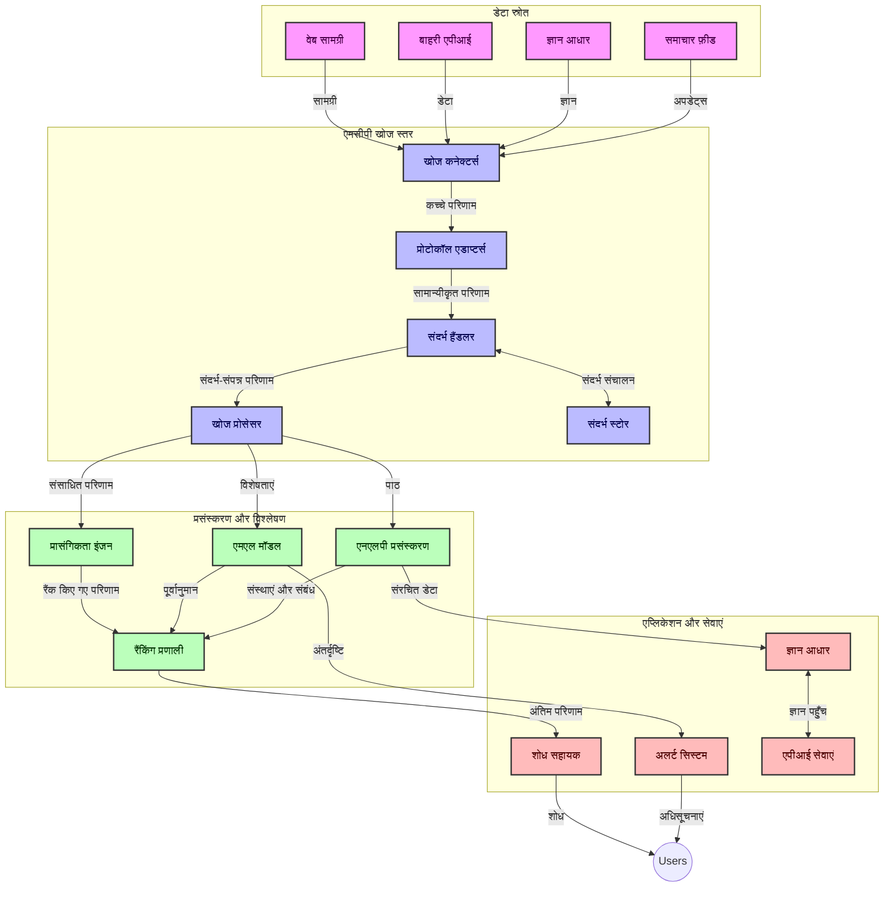
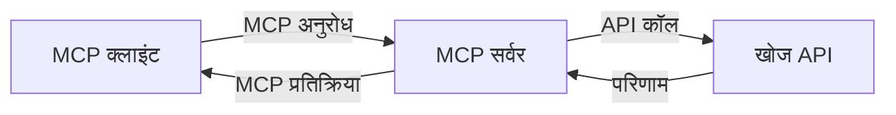
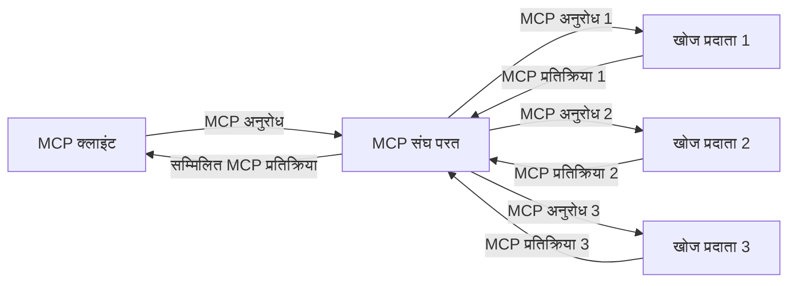
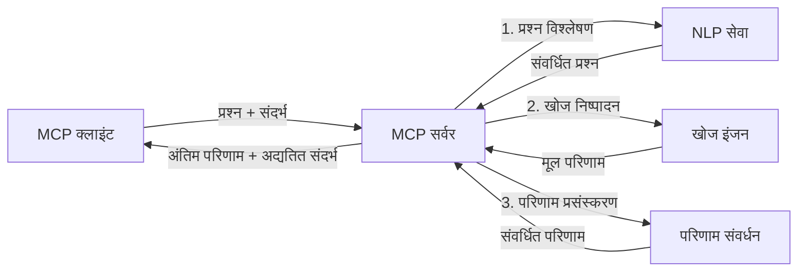

# रियल-टाइम वेब सर्च के लिए मॉडल संदर्भ प्रोटोकॉल

## अवलोकन

आज के सूचना-प्रेरित माहौल में रियल-टाइम वेब सर्च आवश्यक हो गया है, जहां अनुप्रयोगों को इंटरनेट में ताज़ा जानकारी तक तत्काल पहुँच की जरूरत होती है ताकि वे प्रासंगिक और समयोचित उत्तर प्रदान कर सकें। मॉडल संदर्भ प्रोटोकॉल (MCP) इन रियल-टाइम सर्च प्रक्रियाओं के अनुकूलन में एक महत्वपूर्ण प्रगति का प्रतिनिधित्व करता है, जिससे खोज की दक्षता बढ़ती है, संदर्भ की अखंडता बनी रहती है, और समग्र प्रणाली प्रदर्शन में सुधार होता है।

यह मॉड्यूल यह दर्शाता है कि MCP कैसे AI मॉडल, सर्च इंजन, और अनुप्रयोगों के बीच संदर्भ प्रबंधन के लिए एक मानकीकृत दृष्टिकोण प्रदान करके रियल-टाइम वेब सर्च को परिवर्तित करता है।

### आप क्या सीखेंगे

इस व्यापक मार्गदर्शिका में, आप जानेंगे:

- कैसे MCP AI मॉडल और रियल-टाइम वेब सर्च क्षमताओं के बीच एक निर्बाध पुल बनाता है
- MCP के साथ कुशल और स्केलेबल सर्च समाधान लागू करने के वास्तुकला पैटर्न
- कई प्रश्नों और इंटरैक्शनों के दौरान खोज संदर्भ को बनाए रखने की तकनीकें
- विभिन्न सर्च परिदृश्यों के लिए Python और JavaScript में व्यावहारिक कोड कार्यान्वयन
- MCP संचालित खोज प्रणालियों में प्रासंगिकता, नवीनता, और प्रदर्शन का संतुलन बनाए रखने के तरीके

## रियल-टाइम वेब सर्च का परिचय

रियल-टाइम वेब सर्च एक तकनीकी दृष्टिकोण है जो वेब आधारित जानकारी के लगातार क्वेरी करने, संसाधित करने, और विश्लेषण करने को सक्षम बनाता है जैसे ही यह प्रकाशित या अपडेट होती है, जिससे प्रणालियाँ न्यूनतम विलंबता के साथ ताज़ा और प्रासंगिक जानकारी प्रदान कर सकती हैं। पारंपरिक खोज प्रणालियों के विपरीत जो पुराने डेटा पर आधारित हैं जो घंटे या दिन पुराने हो सकते हैं, रियल-टाइम सर्च वेब से लाइव डेटा का उपयोग करता है, ऑनलाइन सामग्री की वर्तमान स्थिति को प्रतिबिंबित करने वाली सूचनाएँ और जानकारी प्रदान करता है।

### रियल-टाइम वेब सर्च के मूल सिद्धांत:

- **लगातार क्वेरी प्रोसेसिंग**: खोज क्वेरीज लगातार अपडेट हो रहे डेटा स्रोतों के खिलाफ संसाधित होती हैं
- **नवीनता प्राथमिकता**: प्रणालियाँ ताज़ा जानकारी को प्राथमिकता देने के लिए डिजाइन की गई हैं
- **प्रासंगिकता संतुलन**: प्रासंगिकता और नवीनता के बीच संतुलन बनाए रखना
- **स्केलेबल आर्किटेक्चर**: प्रणालियाँ विविध क्वेरी लोड और डेटा मात्रा को संभालनी चाहिए
- **संदर्भ समझ**: खोज पुनरावृत्तियों के दौरान उपयोगकर्ता संदर्भ बनाए रखना सार्थक परिणामों के लिए महत्वपूर्ण है
- **गतिशील क्वेरी पुनर्कल्पना**: संदर्भ और पूर्व परिणामों के आधार पर क्वेरीज को अनुकूलित करना
- **मल्टी-स्रोत एकीकरण**: विभिन्न खोज प्रदाताओं और वेब स्रोतों से परिणामों का संयोजन
- **सामान्य अर्थ की समझ**: केवल कीवर्ड्स के बजाय अर्थ पर आधारित क्वेरी और सामग्री प्रोसेसिंग
- **रियल-टाइम रैंकिंग**: जैसे-जैसे नई जानकारी उपलब्ध होती है, परिणाम रैंकिंग को लगातार समायोजित करना

### मॉडल संदर्भ प्रोटोकॉल और रियल-टाइम वेब सर्च

मॉडल संदर्भ प्रोटोकॉल (MCP) रियल-टाइम वेब सर्च वातावरण में कई महत्वपूर्ण चुनौतियों को संबोधित करता है:

1. **खोज संदर्भ संरक्षण**: MCP यह मानकीकृत करता है कि संदर्भ वितरित खोज घटकों में कैसे बनाए रखा जाता है, यह सुनिश्चित करता है कि AI मॉडल और प्रोसेसिंग नोड्स के पास प्रासंगिक क्वेरी इतिहास और उपयोगकर्ता प्राथमिकताएँ उपलब्ध हों।

2. **प्रभावी क्वेरी प्रबंधन**: संदर्भ संचरण के लिए संरचित तंत्र प्रदान करके, MCP प्रत्येक खोज पुनरावृत्ति में संदर्भ दोहराने के ओवरहेड को कम करता है।

3. **इंटरऑपरेबिलिटी**: MCP विभिन्न खोज तकनीकों और AI मॉडलों के बीच संदर्भ साझा करने के लिए एक सामान्य भाषा बनाता है, जिससे अधिक लचीली और विस्तार योग्य आर्किटेक्चर संभव होते हैं।

4. **खोज-अनुकूलित संदर्भ**: MCP कार्यान्वयन यह प्राथमिकता दे सकते हैं कि कौन से संदर्भ तत्व प्रभावी खोज के लिए सबसे प्रासंगिक हैं, प्रदर्शन और सटीकता दोनों के लिए अनुकूलन करते हुए।

5. **अनुकूलनशील खोज प्रोसेसिंग**: MCP के माध्यम से उचित संदर्भ प्रबंधन के साथ, खोज प्रणालियाँ विकसित हो रही उपयोगकर्ता आवश्यकताओं और सूचना परिदृश्यों के आधार पर प्रोसेसिंग को गतिशील रूप से समायोजित कर सकती हैं।

समाचार एकत्रीकरण से लेकर शोध सहायक तक के आधुनिक अनुप्रयोगों में, MCP का वेब खोज तकनीकों के साथ एकीकरण अधिक बुद्धिमान, संदर्भ-सचेत खोज सक्षम करता है जो उपयोगकर्ता इंटरैक्शन जारी रहने पर अधिक प्रासंगिक परिणाम प्रदान कर सकता है।

## शिक्षण उद्देश्य

इस पाठ के अंत तक, आप सक्षम होंगे:

- आधुनिक अनुप्रयोगों में रियल-टाइम वेब सर्च के मूल और इसकी चुनौतियाँ समझना
- समझाना कि मॉडल संदर्भ प्रोटोकॉल (MCP) रियल-टाइम वेब सर्च क्षमताओं को कैसे बढ़ाता है
- लोकप्रिय फ्रेमवर्क और API का उपयोग करके MCP आधारित खोज समाधान लागू करना
- MCP के साथ स्केलेबल, उच्च प्रदर्शन खोज आर्किटेक्चर डिज़ाइन और तैनात करना
- MCP अवधारणाओं को विभिन्न उपयोग मामलों जैसे कि सिमेंटिक सर्च, शोध सहायता, और AI-संवर्धित ब्राउज़िंग में लागू करना
- MCP आधारित खोज तकनीकों में उभरती प्रवृत्तियों और भविष्य के नवाचारों का मूल्यांकन करना
- उपयोगकर्ता इंटरैक्शन से सीखने वाली संदर्भ-सचेत खोज प्रणालियाँ विकसित करना
- मानकीकृत MCP प्रोटोकॉल का उपयोग करके AI सहायक में वेब खोज क्षमताओं को एकीकृत करना
- संदर्भ के आधार पर धीरे-धीरे परिणामों को परिष्कृत करने वाली बहु-चरण खोज पाइपलाइनों का निर्माण करना
- व्यापक संदर्भ जागरूकता बनाए रखते हुए खोज प्रदर्शन का अनुकूलन करना

### परिभाषा और महत्व

रियल-टाइम वेब सर्च में न्यूनतम विलंबता के साथ वेब आधारित जानकारी की लगातार क्वेरी, पुनःप्राप्ति, और डिलीवरी शामिल है। पारंपरिक खोज इंजन जो नियमित रूप से वेब को क्रॉलर करते हैं और इंडेक्स बनाते हैं, के विपरीत, रियल-टाइम सर्च का लक्ष्य जैसे ही जानकारी उपलब्ध हो, उसे तुरंत प्रदर्शित करना है, जिससे सबसे वर्तमान सामग्री तक त्वरित पहुँच संभव हो।

रियल-टाइम वेब सर्च के मुख्य गुण हैं:

- **ताज़गी**: हाल की सामग्री और अपडेट को प्राथमिकता देना
- **लगातार प्रोसेसिंग**: नई जानकारी के लिए लगातार निगरानी
- **क्वेरी अनुकूलन**: संदर्भ और प्रतिक्रिया के आधार पर खोज क्वेरी को परिष्कृत करना
- **तात्कालिक डिलीवरी**: न्यूनतम विलंबता के साथ खोज परिणाम प्रदान करना
- **संदर्भ अवधारण**: बेहतर प्रासंगिकता के लिए पिछली क्वेरीज़ पर आधारित निर्माण

### पारंपरिक वेब सर्च में चुनौतियाँ

पारंपरिक वेब सर्च दृष्टिकोण रियल-टाइम परिदृश्यों में कई सीमाओं का सामना करते हैं:

1. **संदर्भ विखंडन**: कई क्वेरीज़ के बीच खोज संदर्भ बनाए रखने में कठिनाई
2. **जानकारी ताजगी**: सबसे हाल की जानकारी तक पहुंचने और उसे प्राथमिकता देने में बाधाएँ
3. **एकीकरण जटिलता**: खोज प्रणालियों और अनुप्रयोगों के बीच इंटरऑपरेबिलिटी में समस्याएँ
4. **विलंब समस्या**: प्रतिक्रिया समय आवश्यकताओं के साथ व्यापक खोज संतुलित करना
5. **प्रासंगिकता ट्यूनिंग**: नवीनता को प्राथमिकता देते हुए सटीकता और प्रासंगिकता सुनिश्चित करना

## खोज के लिए मॉडल संदर्भ प्रोटोकॉल (MCP) की समझ

### खोज संदर्भों में MCP क्या है?

मॉडल संदर्भ प्रोटोकॉल (MCP) एक मानकीकृत संचार प्रोटोकॉल है जो AI मॉडल और अनुप्रयोगों के बीच कुशल इंटरैक्शन को सक्षम बनाने के लिए डिज़ाइन किया गया है। रियल-टाइम वेब सर्च के संदर्भ में, MCP निम्नलिखित के लिए एक ढांचा प्रदान करता है:

- खोज संदर्भ को क्वेरी अनुक्रमों में संरक्षित करना
- खोज क्वेरी और परिणाम स्वरूपों को मानकीकृत करना
- खोज पैरामीटर और परिणामों के संचार को अनुकूलित करना
- मॉडल से खोज इंजन संचार को बढ़ाना

### मुख्य घटक और वास्तुकला

रियल-टाइम वेब सर्च के लिए MCP वास्तुकला में कई मुख्य घटक होते हैं:

1. **क्वेरी संदर्भ हैंडलर्स**: कई क्वेरियों में खोज संदर्भ का प्रबंधन और रखरखाव करना
2. **खोज प्रोसेसर्स**: संदर्भ-सचेत तकनीकों का उपयोग करते हुए इनकमिंग खोज अनुरोधों को संसाधित करना
3. **प्रोटोकॉल एडाप्टर्स**: संदर्भ बनाए रखते हुए विभिन्न खोज API के बीच रूपांतरण करना
4. **संदर्भ स्टोर**: खोज इतिहास और प्राथमिकताओं को कुशलतापूर्वक संग्रहीत और पुनःप्राप्त करना
5. **खोज कनेक्टर्स**: विभिन्न खोज इंजनों और वेब API से कनेक्ट करना



### MCP रियल-टाइम वेब सर्च को कैसे सुधारता है

MCP पारंपरिक वेब सर्च चुनौतियों का समाधान करता है:

- **संदर्भ निरंतरता**: पूरे खोज सत्र में क्वेरियों के बीच संबंध बनाए रखना
- **अनुकूलित संचार**: बुद्धिमान संदर्भ प्रबंधन के माध्यम से खोज पैरामीटरों में पुनरावृत्ति को कम करना
- **मानकीकृत इंटरफेस**: खोज घटकों के लिए सुसंगत API प्रदान करना
- **कम विलंबता**: कुशल संदर्भ हैंडलिंग के द्वारा प्रसंस्करण ओवरहेड कम करना
- **बेहतर प्रासंगिकता**: कई क्वेरियों में उपयोगकर्ता इरादे को संरक्षित करके खोज प्रासंगिकता सुधारना

## एकीकरण और कार्यान्वयन

रियल-टाइम वेब सर्च प्रणालियों को प्रदर्शन और संदर्भ अखंडता दोनों बनाए रखने के लिए सावधानी से आर्किटेक्चरल डिज़ाइन और कार्यान्वयन की आवश्यकता होती है। मॉडल संदर्भ प्रोटोकॉल AI मॉडल और खोज तकनीकों के एकीकरण के लिए एक मानकीकृत दृष्टिकोण प्रदान करता है, जिससे अधिक परिष्कृत, संदर्भ-सचेत खोज पाइपलाइनों की अनुमति मिलती है।

### खोज आर्किटेक्चर में MCP एकीकरण का अवलोकन

रियल-टाइम वेब सर्च वातावरण में MCP को लागू करते समय कई प्रमुख विचार होते हैं:

1. **खोज संदर्भ सीरियलाइज़ेशन**: MCP खोज अनुरोधों के भीतर संदर्भ जानकारी को एन्कोड करने के लिए कुशल तंत्र प्रदान करता है, यह सुनिश्चित करते हुए कि आवश्यक संदर्भ क्वेरी के साथ प्रोसेसिंग पाइपलाइन में चलता रहे। इसमें खोज-संबंधित मेटाडेटा के लिए अनुकूलित मानकीकृत सीरियलाइज़ेशन फॉर्मेट शामिल हैं।

2. **राज्यपूर्ण खोज प्रोसेसिंग**: MCP अधिक बुद्धिमान राज्यपूर्ण प्रोसेसिंग सक्षम करता है जो खोज पुनरावृत्तियों के दौरान निरंतर संदर्भ प्रतिनिधित्व बनाए रखता है। यह विशेष रूप से मल्टी-स्टेज खोज पाइपलाइनों में मूल्यवान है जहाँ संदर्भ सुधार परिणामों को बेहतर बनाता है।

3. **क्वेरी विस्तार और सुधार**: खोज प्रणालियों में MCP कार्यान्वयन संग्रहीत संदर्भ के आधार पर परिष्कृत क्वेरी विस्तार और सुधार की सुविधा प्रदान कर सकते हैं, जिससे खोज सत्र के प्रगति के साथ और अधिक प्रासंगिक परिणाम मिलते हैं।

4. **परिणाम कैशिंग और प्राथमिकता**: संदर्भ हैंडलिंग को मानकीकृत करके, MCP परिणाम कैशिंग और प्राथमिकता प्रबंधन में सहायता करता है, जिससे घटक विकसित हो रहे संदर्भ के आधार पर अनुकूलित हो सकें।

5. **खोज संघ और एकत्रीकरण**: MCP विभिन्न बैकएंड पर फैली खोजों का अधिक परिष्कृत संघ प्रदान करता है, खोज संदर्भ के संरचित प्रतिनिधित्व प्रदान करके विविध स्रोतों से परिणामों के अधिक सार्थक एकत्रीकरण सक्षम करता है।

विभिन्न खोज तकनीकों में MCP के कार्यान्वयन से संदर्भ प्रबंधन के लिए एकीकृत दृष्टिकोण बनता है, जो कस्टम एकीकरण कोड की आवश्यकता को कम करता है और जैसे-जैसे खोज क्वेरियाँ विकसित होती हैं, संदर्भ को अर्थपूर्ण बनाए रखने की प्रणाली की क्षमता को बढ़ाता है।

### विभिन्न वेब खोज कार्यान्वयनों में MCP

ये उदाहरण वर्तमान MCP विनिर्देशन का अनुसरण करते हैं जो JSON-RPC आधारित प्रोटोकॉल पर केंद्रित है जिसमें विशिष्ट ट्रांसपोर्ट तंत्र होते हैं। कोड यह दिखाता है कि आप कैसे MCP प्रोटोकॉल के साथ पूर्ण अनुकूलता बनाए रखते हुए कस्टम खोज एकीकरण लागू कर सकते हैं।


<details>
<summary>सामान्य सर्च API के साथ Python कार्यान्वयन</summary>

```python
import asyncio
import json
import aiohttp
from typing import Dict, Any, Optional, List
from contextlib import asynccontextmanager
from collections.abc import AsyncIterator

# मानक MCP पुस्तकालय आयात करें
from mcp.client.session import ClientSession
from mcp.client.streamable_http import streamablehttp_client
from mcp.types import TextContent, CreateMessageRequestParams, CreateMessageResult
from mcp.server.fastmcp import FastMCP

# वेब खोज के लिए एक FastMCP सर्वर बनाएं
search_server = FastMCP("WebSearch")

# वेब खोज संचालन को संभालने के लिए क्लास
class WebSearchHandler:
    def __init__(self, api_endpoint: str, api_key: str):
        self.api_endpoint = api_endpoint
        self.api_key = api_key
        self.session = None
        
    async def initialize(self):
        """Initialize the HTTP session"""
        self.session = aiohttp.ClientSession(
            headers={"Authorization": f"Bearer {self.api_key}"}
        )
    
    async def close(self):
        """Close the HTTP session"""
        if self.session:
            await self.session.close()
            
    async def perform_search(self, query: str, max_results: int = 5, 
                           include_domains: List[str] = None, 
                           exclude_domains: List[str] = None,
                           time_period: str = "any") -> Dict[str, Any]:
        """Perform web search using the search API"""
        # खोज मापदंड बनाएं
        search_params = {
            "q": query,
            "limit": max_results,
            "time": time_period
        }
        
        if include_domains:
            search_params["site"] = ",".join(include_domains)
            
        if exclude_domains:
            search_params["exclude_site"] = ",".join(exclude_domains)
        
        # खोज अनुरोध निष्पादित करें
        try:
            async with self.session.get(
                self.api_endpoint,
                params=search_params
            ) as response:
                if response.status != 200:
                    error_text = await response.text()
                    raise Exception(f"Search API error: {response.status} - {error_text}")
                
                search_data = await response.json()
                
                # API-विशिष्ट प्रतिक्रिया को एक मानक स्वरूप में परिवर्तित करें
                results = []
                for item in search_data.get("results", []):
                    results.append({
                        "title": item.get("title", ""),
                        "url": item.get("url", ""),
                        "snippet": item.get("snippet", ""),
                        "date": item.get("published_date", ""),
                        "source": item.get("source", "")
                    })
                
                return {
                    "query": query,
                    "totalResults": len(results),
                    "results": results
                }
        except Exception as e:
            print(f"Search API request error: {e}")
            raise

# खोज हैंडलर को प्रारंभ करें
search_handler = WebSearchHandler(
    api_endpoint="https://api.search-service.example/search",
    api_key="your-api-key-here"
)

# खोज हैंडलर को प्रबंधित करने के लिए जीवनकाल सेटअप करें
@asyncio.asynccontextmanager
async def app_lifespan(server: FastMCP):
    """Manage application lifecycle"""
    await search_handler.initialize()
    try:
        yield {"search_handler": search_handler}
    finally:
        await search_handler.close()

# सर्वर के लिए जीवनकाल सेट करें
search_server = FastMCP("WebSearch", lifespan=app_lifespan)

# एक वेब खोज उपकरण पंजीकृत करें
@search_server.tool()
async def web_search(query: str, max_results: int = 5, 
                   include_domains: List[str] = None,
                   exclude_domains: List[str] = None,
                   time_period: str = "any") -> Dict[str, Any]:
    """
    Search the web for information
    
    Args:
        query: The search query
        max_results: Maximum number of results to return (default: 5)
        include_domains: List of domains to include in search results
        exclude_domains: List of domains to exclude from search results
        time_period: Time period for results ("day", "week", "month", "any")
        
    Returns:
        Dictionary containing search results
    """
    ctx = search_server.get_context()
    search_handler = ctx.request_context.lifespan_context["search_handler"]
    
    results = await search_handler.perform_search(
        query=query,
        max_results=max_results,
        include_domains=include_domains,
        exclude_domains=exclude_domains,
        time_period=time_period
    )
    
    return results

# क्लाइंट उपयोग का उदाहरण
async def client_example():
    # Streamable HTTP ट्रांसपोर्ट का उपयोग करके खोज सर्वर से कनेक्ट करें
    async with streamablehttp_client("http://localhost:8000/mcp") as (read, write, _):
        async with ClientSession(read, write) as session:
            # कनेक्शन प्रारंभ करें
            await session.initialize()
            
            # web_search टूल कॉल करें
            search_results = await session.call_tool(
                "web_search", 
                {
                    "query": "latest developments in AI and Model Context Protocol",
                    "max_results": 5,
                    "time_period": "day",
                    "include_domains": ["github.com", "microsoft.com"]
                }
            )
            
            print(f"Search results: {search_results}")

# सर्वर निष्पादन उदाहरण
if __name__ == "__main__":
    # Streamable HTTP ट्रांसपोर्ट के साथ सर्वर चलाएं
    search_server.run(transport="streamable-http")
```
</details> 

<details>
<summary>ब्राउज़र-आधारित खोज के साथ JavaScript कार्यान्वयन</summary>


```javascript
// वेब खोज के लिए MCP सर्वर कार्यान्वयन
import { McpServer, ResourceTemplate } from '@modelcontextprotocol/sdk/server/mcp.js';
import { StreamableHTTPServerTransport } from '@modelcontextprotocol/sdk/server/streamableHttp.js';
import { z } from 'zod';

// वेब खोज के लिए MCP सर्वर बनाएँ
const searchServer = new McpServer({
    name: "BrowserSearch",
    description: "A server that provides web search capabilities"
});

// खोज सेवा वर्ग
class SearchService {
    constructor(searchApiUrl, apiKey) {
        this.searchApiUrl = searchApiUrl;
        this.apiKey = apiKey;
    }

    async performSearch(parameters) {
        const {
            query = '',
            maxResults = 5,
            includeDomains = [],
            excludeDomains = [],
            timePeriod = 'any'
        } = parameters;
        
        // पैरामीटर के साथ खोज URL बनाएँ
        const url = new URL(this.searchApiUrl);
        url.searchParams.append('q', query);
        url.searchParams.append('limit', maxResults);
        url.searchParams.append('time', timePeriod);
        
        if (includeDomains.length > 0) {
            url.searchParams.append('site', includeDomains.join(','));
        }
        
        if (excludeDomains.length > 0) {
            url.searchParams.append('exclude_site', excludeDomains.join(','));
        }
        
        try {
            const response = await fetch(url.toString(), {
                method: 'GET',
                headers: {
                    'Authorization': `Bearer ${this.apiKey}`,
                    'Content-Type': 'application/json'
                }
            });
            
            if (!response.ok) {
                const errorText = await response.text();
                throw new Error(`Search API error: ${response.status} - ${errorText}`);
            }
            
            const searchData = await response.json();
            
            // API-विशिष्ट प्रतिक्रिया को एक मानक प्रारूप में परिवर्तित करें
            const results = searchData.results?.map(item => ({
                title: item.title || '',
                url: item.url || '',
                snippet: item.snippet || '',
                date: item.published_date || '',
                source: item.source || ''
            })) || [];
            
            return {
                query,
                totalResults: results.length,
                results
            };
        } catch (error) {
            console.error('Search API request error:', error);
            throw error;
        }
    }
}

// खोज सेवा प्रारंभ करें
const searchService = new SearchService(
    'https://api.search-service.example/search',
    'your-api-key-here'
);

// सर्वर के लिए संदर्भ प्रदाता सेटअप करें
searchServer.setContextProvider(() => {
    return {
        searchService
    };
});

// वेब खोज उपकरण पंजीकृत करें
searchServer.tool({
    name: 'web_search',
    description: 'Search the web for information',
    parameters: {
        type: 'object',
        properties: {
            query: {
                type: 'string',
                description: 'The search query'
            },
            maxResults: {
                type: 'integer',
                description: 'Maximum number of results to return',
                default: 5
            },
            includeDomains: {
                type: 'array',
                items: { type: 'string' },
                description: 'List of domains to include in search results'
            },
            excludeDomains: {
                type: 'array',
                items: { type: 'string' },
                description: 'List of domains to exclude from search results'
            },
            timePeriod: {
                type: 'string',
                description: 'Time period for results',
                enum: ['day', 'week', 'month', 'any'],
                default: 'any'
            }
        },
        required: ['query']
    },
    handler: async (params, context) => {
        const { searchService } = context;
        return await searchService.performSearch(params);
    }
});

// खोज सर्वर से कनेक्ट करने के लिए उदाहरण क्लाइंट कोड
import { Client } from '@modelcontextprotocol/sdk/client/index.js';
import { StreamableHTTPClientTransport } from '@modelcontextprotocol/sdk/client/streamableHttp.js';

async function connectToSearchServer() {
    // खोज सर्वर से जुड़ें
    const transport = new StreamableHTTPClientTransport(
        new URL('http://localhost:8000/mcp')
    );
    
    const client = new Client({
        name: 'search-client',
        version: '1.0.0'
    });
    
    await client.connect(transport);
    
    // खोज उपकरण चलाएँ
    const searchResults = await client.callTool({
        name: 'web_search',
        arguments: {
            query: 'Model Context Protocol implementation examples',
            maxResults: 10,
            timePeriod: 'week',
            includeDomains: ['github.com', 'docs.microsoft.com']
        }
    });
    
    console.log('Search results:', searchResults);
    
    // सफाई करें
    await client.disconnect();
}

// सर्वर शुरू करें
const transport = new StreamableHTTPServerTransport();
await searchServer.connect(transport);
console.log('Search server running at http://localhost:8000/mcp');

// एक अलग प्रक्रिया में या सर्वर शुरू होने के बाद
// connectToSearchServer().catch(console.error);
```
</details> 


## कोड उदाहरण अस्वीकृति

> **महत्वपूर्ण नोट**: नीचे दिए गए कोड उदाहरण मॉडल संदर्भ प्रोटोकॉल (MCP) को वेब खोज कार्यक्षमता के साथ एकीकृत करने का प्रदर्शन करते हैं। जबकि वे आधिकारिक MCP SDK के पैटर्न और संरचनाओं का अनुसरण करते हैं, इन्हें शैक्षणिक प्रयोजनों के लिए सरलीकृत किया गया है।
> 
> ये उदाहरण प्रदर्शित करते हैं:
> 
> 1. **Python कार्यान्वयन**: FastMCP सर्वर कार्यान्वयन जो एक वेब खोज उपकरण प्रदान करता है और बाहरी खोज API से कनेक्ट करता है। यह उदाहरण उचित लाइफस्पैन प्रबंधन, संदर्भ हैंडलिंग, और उपकरण कार्यान्वयन दिखाता है, जो [आधिकारिक MCP Python SDK](https://github.com/modelcontextprotocol/python-sdk) के पैटर्न का पालन करता है। सर्वर अनुशंसित Streamable HTTP ट्रांसपोर्ट का उपयोग करता है जिसने उत्पादन तैनाती के लिए पुराने SSE ट्रांसपोर्ट को प्रतिस्थापित कर दिया है।
> 
> 2. **JavaScript कार्यान्वयन**: [आधिकारिक MCP TypeScript SDK](https://github.com/modelcontextprotocol/typescript-sdk) से FastMCP पैटर्न का उपयोग करते हुए TypeScript/JavaScript कार्यान्वयन जो उचित उपकरण परिभाषाएँ और क्लाइंट कनेक्शन के साथ एक खोज सर्वर बनाता है। यह सत्र प्रबंधन और संदर्भ संरक्षण के नवीनतम अनुशंसित पैटर्न का पालन करता है।
> 
> उत्पादन उपयोग के लिए अतिरिक्त त्रुटि हैंडलिंग, प्रमाणीकरण, और विशिष्ट API एकीकरण कोड की आवश्यकता होगी। दिखाए गए खोज API एंडपॉइंट (`https://api.search-service.example/search`) प्लेसहोल्डर हैं और इन्हें वास्तविक खोज सेवा एंडपॉइंट्स से बदलना होगा।
> 
> पूर्ण कार्यान्वयन विवरण और नवीनतम दृष्टिकोणों के लिए कृपया [आधिकारिक MCP विनिर्देशन](https://spec.modelcontextprotocol.io/) और SDK दस्तावेज़ देखें।

## मुख्य अवधारणाएँ

### मॉडल संदर्भ प्रोटोकॉल (MCP) फ्रेमवर्क

मूल रूप से, मॉडल संदर्भ प्रोटोकॉल AI मॉडल, अनुप्रयोगों, और सेवाओं के बीच संदर्भ आदान-प्रदान के लिए मानकीकृत तरीका प्रदान करता है। रियल-टाइम वेब सर्च में, यह फ्रेमवर्क सुसंगत, बहु-चरण सर्च अनुभव बनाने के लिए आवश्यक है। मुख्य घटकों में शामिल हैं:

1. **क्लाइंट-सर्वर आर्किटेक्चर**: MCP खोज क्लाइंट्स (अनुरोधकर्ता) और खोज सर्वरों (प्रदाता) के बीच स्पष्ट विभाजन स्थापित करता है, जिससे लचीले तैनाती मॉडल संभव होते हैं।

2. **JSON-RPC संचार**: प्रोटोकॉल संदेश आदान-प्रदान के लिए JSON-RPC का उपयोग करता है, जो वेब तकनीकों के साथ संगत है और विभिन्न प्लेटफार्मों पर लागू करना आसान है।

3. **संदर्भ प्रबंधन**: MCP एकाधिक इंटरैक्शनों में खोज संदर्भ बनाए रखने, अपडेट करने, और उसका उपयोग करने के लिए संरचित विधियाँ परिभाषित करता है।

4. **उपकरण परिभाषाएँ**: खोज क्षमताएं मानकीकृत उपकरणों के रूप में उजागर की जाती हैं जिनके पैरामीटर और पुनः प्राप्त मान स्पष्ट रूप से परिभाषित होते हैं।

5. **स्ट्रिमिंग समर्थन**: प्रोटोकॉल रियल-टाइम खोज के लिए आवश्यक परिणामों को प्रगतिशील रूप से प्राप्त करने के लिए परिणाम स्ट्रीमिंग का समर्थन करता है।

### वेब खोज एकीकरण पैटर्न

जब MCP को वेब खोज के साथ एकीकृत किया जाता है, तो कई पैटर्न उभरते हैं:

#### 1. सीधे खोज प्रदाता एकीकरण



इस पैटर्न में, MCP सर्वर सीधे एक या अधिक खोज API के साथ इंटरफेस करता है, MCP अनुरोधों को API-विशिष्ट कॉल में अनुवाद करता है और परिणामों को MCP प्रतिक्रियाओं के रूप में स्वरूपित करता है।

#### 2. संदर्भ संरक्षण के साथ संधारित खोज



यह पैटर्न कई MCP-अनुकूल खोज प्रदाताओं में खोज क्वेरियों को वितरित करता है, प्रत्येक संभावित रूप से विभिन्न प्रकार की सामग्री या खोज क्षमताओं में विशेषज्ञ होता है, जबकि एकीकृत संदर्भ बनाए रखता है।

#### 3. संदर्भ-संवर्धित खोज श्रृंखला



इस पैटर्न में, खोज प्रक्रिया कई चरणों में विभाजित होती है, प्रत्येक चरण में संदर्भ समृद्ध किया जाता है, परिणामस्वरूप परिणाम धीरे-धीरे अधिक प्रासंगिक हो जाते हैं।

### खोज संदर्भ घटक

MCP-आधारित वेब खोज में, संदर्भ आमतौर पर शामिल होता है:

- **क्वेरी इतिहास**: सत्र में पिछली खोज क्वेरियाँ
- **उपयोगकर्ता प्राथमिकताएँ**: भाषा, क्षेत्र, सुरक्षित खोज सेटिंग्स
- **इंटरैक्शन इतिहास**: कौन से परिणाम क्लिक किए गए, परिणामों पर बिताया गया समय
- **खोज पैरामीटर**: फ़िल्टर, सॉर्ट आदेश, और अन्य खोज संशोधक
- **डोमेन ज्ञान**: खोज से संबंधित विषय-विशेष संदर्भ
- **कालिक संदर्भ**: समय-आधारित प्रासंगिकता कारक
- **स्रोत प्राथमिकताएँ**: विश्वसनीय या पसंदीदा सूचना स्रोत

## उपयोग के मामले और अनुप्रयोग

### शोध और जानकारी संग्रह

MCP शोध कार्यप्रणाली को बढ़ाता है:

- खोज सत्रों में शोध संदर्भ बनाए रखने से
- अधिक परिष्कृत और संदर्भानुसार प्रासंगिक क्वेरी सक्षम करने से
- मल्टी-स्रोत खोज संघ का समर्थन करके
- खोज परिणामों से ज्ञान निष्कर्षण को सुविधा देकर

### रियल-टाइम समाचार और ट्रेंड मॉनिटरिंग

MCP संचालित खोज समाचार मॉनिटरिंग के लिए लाभ प्रदान करता है:

- नए समाचार कहानियों का लगभग रियल-टाइम में पता लगाना
- प्रासंगिक जानकारी का संदर्भानुसार फ़िल्टरिंग
- कई स्रोतों में विषय और इकाई ट्रैकिंग
- उपयोगकर्ता संदर्भ पर आधारित व्यक्तिगत समाचार अलर्ट

### AI-संवर्धित ब्राउज़िंग और शोध

MCP AI-संवर्धित ब्राउज़िंग के लिए नई संभावनाएँ बनाता है:

- वर्तमान ब्राउज़र गतिविधि के आधार पर संदर्भानुसार खोज सुझाव
- LLM-संचालित सहायक के साथ वेब खोज का सहज एकीकरण
- बनाए रखे गए संदर्भ के साथ बहु-चरण खोज परिष्करण
- बेहतर तथ्य-जांच और सूचना सत्यापन

## भविष्य के रुझान और नवाचार

### वेब खोज में MCP का विकास

आगे देखते हुए, हम आशा करते हैं कि MCP निम्नलिखित क्षेत्रों को संबोधित करने के लिए विकसित होगा:


- **मल्टीमॉडल खोज**: संरक्षित संदर्भ के साथ टेक्स्ट, इमेज, ऑडियो, और वीडियो खोज का एकीकरण
- **विकेन्द्रीकृत खोज**: वितरित और संघीय खोज पारिस्थितिक तंत्र का समर्थन
- **खोज गोपनीयता**: संदर्भ-सक्षम गोपनीयता-रक्षा खोज तंत्र
- **प्रश्न समझना**: प्राकृतिक भाषा खोज प्रश्नों का गहरा अर्थ-संयोजन पार्सिंग

### प्रौद्योगिकी में संभावित प्रगति

उभरती प्रौद्योगिकियां जो MCP खोज के भविष्य को आकार देंगी:

1. **न्यूरल खोज आर्किटेक्चर**: एमसीपी के लिए अनुकूलित एम्बेडिंग-आधारित खोज प्रणालियां
2. **व्यक्तिगत खोज संदर्भ**: समय के साथ व्यक्तिगत उपयोगकर्ता खोज पैटर्न सीखना
3. **ज्ञान ग्राफ एकीकरण**: डोमेन-विशिष्ट ज्ञान ग्राफ के माध्यम से संदर्भात्मक खोज को बढ़ावा देना
4. **क्रॉस-मोडल संदर्भ**: विभिन्न खोज_MODALITIES के बीच संदर्भ बनाए रखना

## व्यावहारिक अभ्यास

### अभ्यास 1: एक बेसिक MCP खोज पाइपलाइन सेटअप करना

इस अभ्यास में, आप सीखेंगे कि:
- एक बेसिक MCP खोज पर्यावरण कॉन्फ़िगर करना
- वेब खोज के लिए संदर्भ हैंडलर लागू करना
- खोज पुनरावृत्तियों में संदर्भ संरक्षण का परीक्षण और मान्यता करना

### अभ्यास 2: MCP खोज के साथ एक अनुसंधान सहायक बनाना

एक पूर्ण एप्लिकेशन बनाएँ जो:
- प्राकृतिक भाषा के अनुसंधान प्रश्नों को संसाधित करता है
- संदर्भ-सक्षम वेब खोज करता है
- कई स्रोतों से जानकारी संश्लेषित करता है
- व्यवस्थित अनुसंधान निष्कर्ष प्रस्तुत करता है

### अभ्यास 3: MCP के साथ मल्टी-सोर्स खोज संघ कार्यान्वयन

उन्नत अभ्यास जिसमें शामिल हैं:
- कई खोज इंजनों को संदर्भ-संवेदनशील प्रश्न प्रेषण
- परिणाम रैंकिंग और समेकन
- खोज परिणामों का संदर्भात्मक डिडुप्लिकेशन
- स्रोत-विशिष्ट मेटाडेटा को संभालना

## अतिरिक्त संसाधन

- [Model Context Protocol Specification](https://spec.modelcontextprotocol.io/) - आधिकारिक MCP विनिर्देशन और विस्तृत प्रोटोकॉल दस्तावेज़ीकरण
- [Model Context Protocol Documentation](https://modelcontextprotocol.io/) - विस्तृत ट्यूटोरियल और कार्यान्वयन गाइड
- [MCP Python SDK](https://github.com/modelcontextprotocol/python-sdk) - MCP प्रोटोकॉल का आधिकारिक पायथन कार्यान्वयन
- [MCP TypeScript SDK](https://github.com/modelcontextprotocol/typescript-sdk) - MCP प्रोटोकॉल का आधिकारिक टाइपस्क्रिप्ट कार्यान्वयन
- [MCP Reference Servers](https://github.com/modelcontextprotocol/servers) - MCP सर्वरों के संदर्भ कार्यान्वयन
- [Bing Web Search API Documentation](https://learn.microsoft.com/en-us/bing/search-apis/bing-web-search/overview) - माइक्रोसॉफ्ट का वेब खोज API
- [Google Custom Search JSON API](https://developers.google.com/custom-search/v1/overview) - गूगल का प्रोग्रामेबल खोज इंजन
- [SerpAPI Documentation](https://serpapi.com/search-api) - खोज इंजन परिणाम पृष्ठ API
- [Meilisearch Documentation](https://www.meilisearch.com/docs) - ओपन-सोर्स खोज इंजन
- [Elasticsearch Documentation](https://www.elastic.co/guide/index.html) - वितरित खोज और एनालिटिक्स इंजन
- [LangChain Documentation](https://python.langchain.com/docs/get_started/introduction) - LLMs के साथ एप्लिकेशन बनाना

## सीखने के परिणाम

इस मॉड्यूल को पूरा करके, आप सक्षम होंगे:

- वास्तविक समय वेब खोज के मूल सिद्धांतों और इसकी चुनौतियों को समझना
- समझाना कि Model Context Protocol (MCP) वास्तविक समय वेब खोज क्षमताओं को कैसे बढ़ाता है
- लोकप्रिय फ्रेमवर्क और API का उपयोग करके MCP-आधारित खोज समाधान लागू करना
- MCP के साथ स्केलेबल, उच्च प्रदर्शन खोज आर्किटेक्चर डिजाइन और तैनात करना
- MCP अवधारणाओं को विभिन्न उपयोग मामलों में लागू करना जैसे कि अर्थपूर्ण खोज, अनुसंधान सहायता, और AI-उन्नत ब्राउज़िंग
- MCP-आधारित खोज तकनीकों में उभरती प्रवृत्तियों और भविष्य के नवाचारों का मूल्यांकन करना


### विश्वास और सुरक्षा विचार

MCP-आधारित वेब खोज समाधान लागू करते समय, MCP विनिर्देशन से ये महत्वपूर्ण सिद्धांत याद रखें:

1. **उपयोगकर्ता सहमति और नियंत्रण**: उपयोगकर्ताओं को सभी डेटा पहुंच और ऑपरेशनों के लिए स्पष्ट सहमति देना और समझना आवश्यक है। यह विशेष रूप से वेब खोज कार्यान्वयन के लिए महत्वपूर्ण है जो बाहरी डेटा स्रोतों तक पहुंच सकता है।

2. **डेटा गोपनीयता**: खोज प्रश्नों और परिणामों के उपयुक्त हेंडलिंग की व्यवस्था करें, खासकर जब वे संवेदनशील जानकारी हो सकते हैं। उपयोगकर्ता डेटा की सुरक्षा के लिए उचित पहुंच नियंत्रण लागू करें।

3. **टूल सुरक्षा**: खोज उपकरणों के लिए सही प्राधिकरण और सत्यापन लागू करें, क्योंकि वे मनमाने कोड निष्पादन के माध्यम से संभावित सुरक्षा जोखिम प्रस्तुत करते हैं। उपकरण व्यवहार के विवरण को तब तक अविश्वसनीय माना जाना चाहिए जब तक कि वे विश्वसनीय सर्वर से प्राप्त न हों।

4. **स्पष्ट दस्तावेज़ीकरण**: आपके MCP-आधारित खोज कार्यान्वयन की क्षमताओं, सीमाओं, और सुरक्षा विचारों के बारे में स्पष्ट दस्तावेज़ प्रदान करें, MCP विनिर्देशन के कार्यान्वयन दिशानिर्देशों का पालन करते हुए।

5. **मजबूत सहमति प्रवाह**: मजबूत सहमति और प्राधिकरण प्रवाह बनाएं जो प्रत्येक उपकरण के उपयोग को अधिकृत करने से पहले यह स्पष्ट करें कि वह क्या करता है, खासकर उन उपकरणों के लिए जो बाहरी वेब संसाधनों के साथ इंटरैक्ट करते हैं।

MCP सुरक्षा और भरोसेमंदता विचारों के पूर्ण विवरण के लिए, [आधिकारिक दस्तावेज़ीकरण](https://modelcontextprotocol.io/specification/2025-11-25/basic/security_best_practices) देखें।

## अगला क्या है

- [5.12 Entra ID Authentication for Model Context Protocol Servers](../mcp-security-entra/README.md)

---

<!-- CO-OP TRANSLATOR DISCLAIMER START -->
**अस्वीकरण**:
इस दस्तावेज़ का अनुवाद AI अनुवाद सेवा [Co-op Translator](https://github.com/Azure/co-op-translator) का उपयोग करके किया गया है। जबकि हम सटीकता के लिए प्रयास करते हैं, कृपया ध्यान दें कि स्वचालित अनुवादों में त्रुटियाँ या अशुद्धियाँ हो सकती हैं। मूल दस्तावेज़ अपनी मूल भाषा में ही प्रामाणिक स्रोत माना जाना चाहिए। महत्वपूर्ण जानकारी के लिए, पेशेवर मानव अनुवाद की सिफारिश की जाती है। इस अनुवाद के उपयोग से उत्पन्न किसी भी गलतफहमी या गलत व्याख्या के लिए हम उत्तरदायी नहीं हैं।
<!-- CO-OP TRANSLATOR DISCLAIMER END -->