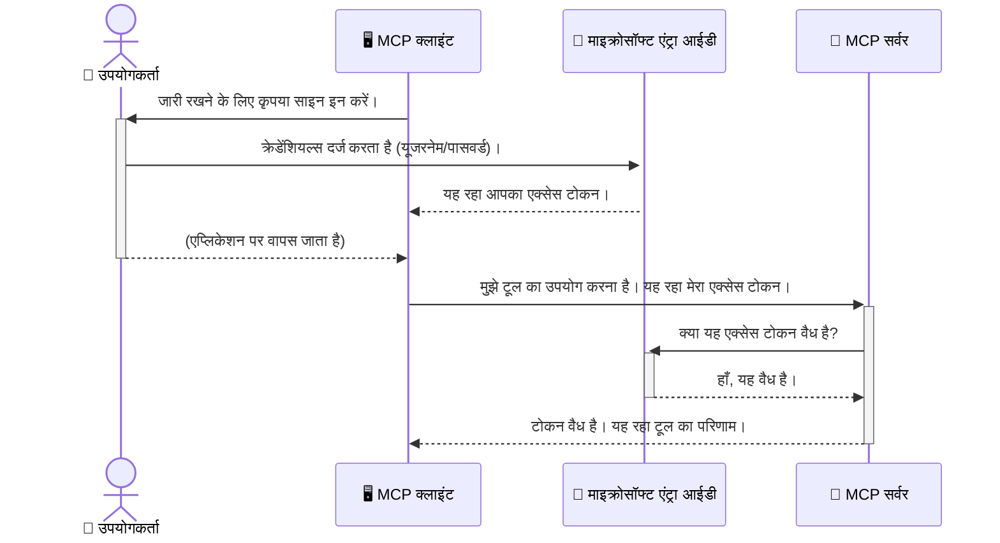

# एआई वर्कफ़्लोज़ की सुरक्षा: मॉडल कॉन्टेक्स्ट प्रोटोकॉल सर्वर के लिए Entra ID प्रमाणीकरण

> [!NOTE]
> इस पाठ में रिमोट सर्वर कोड विरासत `/sse` और `/message`
> endpoints की सुरक्षा करता है और MCP `2025-11-25` को लक्ष्य करता है। इसकी पहचान और टोकन सत्यापन
> प्रथाओं को बनाए रखें, लेकिन नए कार्यान्वयनों के लिए `2026-07-28`-संगत Streamable HTTP ट्रांसपोर्ट का उपयोग करें।


## परिचय
अपने मॉडल कॉन्टेक्स्ट प्रोटोकॉल (MCP) सर्वर की सुरक्षा करना ठीक वैसे ही महत्वपूर्ण है जैसे आप अपने घर के मुख्य द्वार को लॉक करते हैं। अपना MCP सर्वर खुला छोड़ना आपके उपकरणों और डेटा को अनधिकृत पहुंच के लिए उजागर कर देता है, जिससे सुरक्षा उल्लंघनों का खतरा हो सकता है। Microsoft Entra ID एक मजबूत क्लाउड-आधारित पहचान और पहुंच प्रबंधन समाधान प्रदान करता है, जो मदद करता है यह सुनिश्चित करने में कि केवल अधिकृत उपयोगकर्ता और एप्लिकेशन ही आपके MCP सर्वर से संवाद कर सकते हैं। इस अनुभाग में, आप सीखेंगे कि Entra ID प्रमाणीकरण का उपयोग करके अपने एआई वर्कफ़्लोज़ की कैसे सुरक्षा करें।

## सीखने के उद्देश्य
इस अनुभाग के अंत तक, आप सक्षम होंगे:

- MCP सर्वरों की सुरक्षा के महत्व को समझना।
- Microsoft Entra ID और OAuth 2.0 प्रमाणीकरण के मूल सिद्धांत समझाना।
- सार्वजनिक और गोपनीय क्लाइंट के बीच अंतर पहचानना।
- स्थानीय (सार्वजनिक क्लाइंट) और दूरस्थ (गोपनीय क्लाइंट) MCP सर्वर परिदृश्यों में Entra ID प्रमाणीकरण लागू करना।
- एआई वर्कफ़्लोज़ विकसित करते समय सुरक्षा सर्वोत्तम प्रथाओं को लागू करना।

## सुरक्षा और MCP

जैसे आप अपने घर के मुख्य द्वार को बिना लॉक छोड़े नहीं छोड़ेंगे, वैसे ही अपने MCP सर्वर को कोई भी एक्सेस कर सके, ऐसा भी नहीं होना चाहिए। अपने एआई वर्कफ़्लोज़ की सुरक्षा करना मजबूत, विश्वसनीय और सुरक्षित अनुप्रयोग बनाने के लिए आवश्यक है। यह अध्याय आपको Microsoft Entra ID का उपयोग करके अपने MCP सर्वरों की सुरक्षा करने का परिचय देगा, यह सुनिश्चित करते हुए कि केवल अधिकृत उपयोगकर्ता और एप्लिकेशन ही आपके उपकरणों और डेटा से संवाद कर सकें।

## MCP सर्वरों के लिए सुरक्षा क्यों महत्वपूर्ण है

कल्पना करें कि आपके MCP सर्वर में एक उपकरण है जो ईमेल भेज सकता है या ग्राहक डेटाबेस तक पहुंच सकता है। एक अस्पष्ट (असुरक्षित) सर्वर का अर्थ होगा कि कोई भी उस उपकरण का उपयोग कर सकता है, जिससे अनधिकृत डेटा पहुंच, स्पैम या अन्य दुर्भावनापूर्ण गतिविधियाँ हो सकती हैं।

प्रमाणीकरण को लागू करके, आप सुनिश्चित करते हैं कि आपके सर्वर को किया गया हर अनुरोध सत्यापित है, अनुरोध करने वाले उपयोगकर्ता या एप्लिकेशन की पहचान की पुष्टि करता है। यह आपके एआई वर्कफ़्लोज़ की सुरक्षा में पहला और सबसे महत्वपूर्ण कदम है।

## Microsoft Entra ID का परिचय

[**Microsoft Entra ID**](https://adoption.microsoft.com/microsoft-security/entra/) एक क्लाउड-आधारित पहचान और पहुंच प्रबंधन सेवा है। इसे अपने अनुप्रयोगों के लिए एक सार्वभौमिक सुरक्षा गार्ड के रूप में सोचें। यह उपयोगकर्ता पहचान (प्रमाणीकरण) सत्यापित करने और उन्हें क्या करने की अनुमति है (अधिकार) निर्धारित करने की जटिल प्रक्रिया को संभालता है।

Entra ID का उपयोग करके, आप:

- उपयोगकर्ताओं के लिए सुरक्षित साइन-इन सक्षम कर सकते हैं।
- एपीआई और सेवाओं की सुरक्षा कर सकते हैं।
- केंद्रीकृत स्थान से पहुंच नीतियों का प्रबंधन कर सकते हैं।

MCP सर्वरों के लिए, Entra ID एक मजबूत और व्यापक रूप से विश्वसनीय समाधान प्रदान करता है जो यह प्रबंधित करता है कि कौन आपके सर्वर की क्षमताओं तक पहुंच सकता है।

---

## जादू को समझना: Entra ID प्रमाणीकरण कैसे काम करता है

Entra ID प्रमाणीकरण संभालने के लिए **OAuth 2.0** जैसे खुले मानकों का उपयोग करता है। जबकि विवरण जटिल हो सकते हैं, मूल अवधारणा सरल है और इसे एक उपमात्मक उदाहरण से समझा जा सकता है।

### OAuth 2.0 का एक सरल परिचय: वैलेट की

OAuth 2.0 को अपने कार के लिए वैलेट सेवा की तरह सोचें। जब आप एक रेस्तरां पहुंचते हैं, तो आप वैलेट को अपनी मास्टर चाबी नहीं देते। इसके बजाय, आप एक **वैलेट की** देते हैं जिसमें सीमित अनुमतियाँ होती हैं—यह कार को स्टार्ट कर सकता है और दरवाजे लॉक कर सकता है, लेकिन ट्रंक या ग्लव कंम्पार्टमेंट खोल नहीं सकता।

इस उपमा में:

- **आप** हैं **उपयोगकर्ता**।
- **आपकी कार** है **MCP सर्वर** जिसमें उसके मूल्यवान उपकरण और डेटा हैं।
- **वैलेट** है **Microsoft Entra ID**।
- **पार्किंग एटेन्डेंट** है **MCP क्लाइंट** (जो सर्वर तक पहुंचने की कोशिश करता एप्लिकेशन)।
- **वैलेट की** है **एक्सेस टोकन**।

एक्सेस टोकन एक सुरक्षित टेक्स्ट स्ट्रिंग है जो MCP क्लाइंट Entra ID से साइन-इन करने के बाद प्राप्त करता है। क्लाइंट फिर इस टोकन को MCP सर्वर को हर अनुरोध के साथ प्रस्तुत करता है। सर्वर टोकन की सत्यता जांच सकता है यह सुनिश्चित करने के लिए कि अनुरोध वैध है और क्लाइंट के पास आवश्यक अनुमतियाँ हैं, यह सब बिना आपके वास्तविक प्रमाणीकरण विवरण (जैसे पासवर्ड) को संभाले।

### प्रमाणीकरण प्रवाह

प्रक्रिया व्यावहारिक रूप में कैसे काम करती है:



### Microsoft Authentication Library (MSAL) का परिचय

कोड में जाने से पहले, यह महत्वपूर्ण है कि आप एक प्रमुख घटक से परिचित हों जो उदाहरणों में देखेंगे: **Microsoft Authentication Library (MSAL)**।

MSAL Microsoft द्वारा विकसित एक लाइब्रेरी है जो विकासकर्ताओं के लिए प्रमाणीकरण संभालना बहुत आसान बनाती है। सुरक्षा टोकन संभालने, साइन-इन प्रबंधन, और सत्रों को ताज़ा करने के सारे जटिल कोड लिखने की बजाय, MSAL इन सभी भारी कामों को संभालता है।

MSAL जैसी लाइब्रेरी का उपयोग करना अत्यंत अनुशंसित है क्योंकि:

- **यह सुरक्षित है:** यह उद्योग-मानक प्रोटोकॉल और सुरक्षा सर्वोत्तम प्रथाओं को लागू करता है, जिससे आपकी कोड में कमजोरियों का जोखिम कम होता है।
- **यह विकास को सरल बनाता है:** यह OAuth 2.0 और OpenID Connect प्रोटोकॉल की जटिलताओं को हटाकर कुछ कोड लाइनों में आपके एप्लिकेशन में मजबूत प्रमाणीकरण जोड़ना आसान बनाता है।
- **यह बनाए रखा जाता है:** Microsoft सक्रिय रूप से MSAL को नए सुरक्षा खतरों और प्लेटफ़ॉर्म परिवर्तनों के अनुसार अपडेट करता है।

MSAL .NET, JavaScript/TypeScript, Python, Java, Go, और मोबाइल प्लेटफ़ॉर्म जैसे iOS और Android सहित विभिन्न भाषाओं और एप्लिकेशन फ्रेमवर्क का समर्थन करता है। इसका मतलब है कि आप अपने पूरे तकनीकी स्टैक में एक समान प्रमाणीकरण पैटर्न का उपयोग कर सकते हैं।

MSAL के बारे में अधिक जानने के लिए आप आधिकारिक [MSAL अवलोकन दस्तावेज़](https://learn.microsoft.com/entra/identity-platform/msal-overview) देख सकते हैं।

---

## Entra ID के साथ अपने MCP सर्वर की सुरक्षा: चरण-दर-चरण गाइड

अब, आइए देखें कि कैसे स्थानीय MCP सर्वर (जो `stdio` के माध्यम से संचार करता है) को Entra ID का उपयोग करके सुरक्षित किया जाए। यह उदाहरण एक **सार्वजनिक क्लाइंट** का उपयोग करता है, जो उपयोगकर्ता के मशीन पर चलने वाले एप्लिकेशन जैसे डेस्कटॉप ऐप या स्थानीय विकास सर्वर के लिए उपयुक्त है।

### परिदृश्य 1: स्थानीय MCP सर्वर की सुरक्षा (सार्वजनिक क्लाइंट के साथ)

इस परिदृश्य में, हम एक स्थानीय रूप से चलने वाले MCP सर्वर को देखेंगे, जो `stdio` के माध्यम से संचार करता है और उपयोगकर्ता को प्रमाणित करने के लिए Entra ID का उपयोग करता है ताकि इसके उपकरणों की पहुंच की अनुमति दी जा सके। सर्वर में एक उपकरण होगा जो Microsoft Graph API से उपयोगकर्ता की प्रोफ़ाइल जानकारी लाता है।

#### 1. Entra ID में एप्लिकेशन सेट अप करना

कोई कोड लिखने से पहले, आपको Microsoft Entra ID में अपना एप्लिकेशन पंजीकृत करना होगा। यह Entra ID को आपके एप्लिकेशन के बारे में बताता है और प्रमाणीकरण सेवा का उपयोग करने की अनुमति देता है।

1. **[Microsoft Entra portal](https://entra.microsoft.com/)** पर जाएं।
2. **App registrations** पर जाएं और **New registration** पर क्लिक करें।
3. अपने एप्लिकेशन का नाम दें (जैसे, "My Local MCP Server")।
4. **Supported account types** के लिए, **Accounts in this organizational directory only** चुनें।
5. इस उदाहरण के लिए, **Redirect URI** खाली छोड़ सकते हैं।
6. **Register** पर क्लिक करें।

पंजीकृत होने के बाद, **Application (client) ID** और **Directory (tenant) ID** नोट करें। आपको ये अपने कोड में चाहिए होंगे।

#### 2. कोड: एक ब्रेकडाउन

आइए उन मुख्य भागों को देखें जो प्रमाणीकरण संभालते हैं। इस उदाहरण का पूरा कोड [Entra ID - Local - WAM](https://github.com/Azure-Samples/mcp-auth-servers/tree/main/src/entra-id-local-wam) फ़ोल्डर में [mcp-auth-servers GitHub रिपॉजिटरी](https://github.com/Azure-Samples/mcp-auth-servers) में उपलब्ध है।

**`AuthenticationService.cs`**

यह वर्ग Entra ID के साथ इंटरैक्शन संभालता है।

- **`CreateAsync`**: यह विधि MSAL (Microsoft Authentication Library) से `PublicClientApplication` को प्रारंभ करती है। यह आपके एप्लिकेशन के `clientId` और `tenantId` के साथ कॉन्फ़िगर होता है।
- **`WithBroker`**: यह ब्रोकरेज (जैसे Windows Web Account Manager) के उपयोग को सक्षम करता है, जो एक अधिक सुरक्षित और सहज एकल साइन-ऑन अनुभव प्रदान करता है।
- **`AcquireTokenAsync`**: यह मुख्य विधि है। यह पहले चुपके से (साइलेंटली) टोकन प्राप्त करने का प्रयास करता है (यानी उपयोगकर्ता को फिर से साइन-इन करने की आवश्यकता नहीं होती यदि उनका सत्र वैध है)। यदि चुपके टोकन नहीं मिलता, तो यह उपयोगकर्ता को इंटरैक्टिव साइन-इन के लिए पूछेगा।

```csharp
// Simplified for clarity
public static async Task<AuthenticationService> CreateAsync(ILogger<AuthenticationService> logger)
{
    var msalClient = PublicClientApplicationBuilder
        .Create(_clientId) // Your Application (client) ID
        .WithAuthority(AadAuthorityAudience.AzureAdMyOrg)
        .WithTenantId(_tenantId) // Your Directory (tenant) ID
        .WithBroker(new BrokerOptions(BrokerOptions.OperatingSystems.Windows))
        .Build();

    // ... cache registration ...

    return new AuthenticationService(logger, msalClient);
}

public async Task<string> AcquireTokenAsync()
{
    try
    {
        // Try silent authentication first
        var accounts = await _msalClient.GetAccountsAsync();
        var account = accounts.FirstOrDefault();

        AuthenticationResult? result = null;

        if (account != null)
        {
            result = await _msalClient.AcquireTokenSilent(_scopes, account).ExecuteAsync();
        }
        else
        {
            // If no account, or silent fails, go interactive
            result = await _msalClient.AcquireTokenInteractive(_scopes).ExecuteAsync();
        }

        return result.AccessToken;
    }
    catch (Exception ex)
    {
        _logger.LogError(ex, "An error occurred while acquiring the token.");
        throw; // Optionally rethrow the exception for higher-level handling
    }
}
```

**`Program.cs`**

यहाँ MCP सर्वर सेटअप किया जाता है और प्रमाणीकरण सेवा एकीकृत की जाती है।

- **`AddSingleton<AuthenticationService>`**: यह `AuthenticationService` को डिपेंडेंसी इंजेक्शन कंटेनर में पंजीकृत करता है, ताकि एप्लिकेशन के अन्य हिस्से (जैसे हमारा उपकरण) इसका उपयोग कर सकें।
- **`GetUserDetailsFromGraph` टूल**: इस टूल को `AuthenticationService` का इंस्टेंस चाहिए। इससे पहले कि यह कुछ करे, यह `authService.AcquireTokenAsync()` कॉल करता है ताकि एक वैध एक्सेस टोकन प्राप्त किया जा सके। यदि प्रमाणीकरण सफल होता है, तो यह टोकन का उपयोग Microsoft Graph API को कॉल करने और उपयोगकर्ता का विवरण लाने के लिए करता है।

```csharp
// Simplified for clarity
[McpServerTool(Name = "GetUserDetailsFromGraph")]
public static async Task<string> GetUserDetailsFromGraph(
    AuthenticationService authService)
{
    try
    {
        // This will trigger the authentication flow
        var accessToken = await authService.AcquireTokenAsync();

        // Use the token to create a GraphServiceClient
        var graphClient = new GraphServiceClient(
            new BaseBearerTokenAuthenticationProvider(new TokenProvider(authService)));

        var user = await graphClient.Me.GetAsync();

        return System.Text.Json.JsonSerializer.Serialize(user);
    }
    catch (Exception ex)
    {
        return $"Error: {ex.Message}";
    }
}
```

#### 3. यह सब मिलकर कैसे काम करता है

1. जब MCP क्लाइंट `GetUserDetailsFromGraph` टूल का उपयोग करने की कोशिश करता है, तो टूल पहले `AcquireTokenAsync` कॉल करता है।
2. `AcquireTokenAsync` MSAL लाइब्रेरी को वैध टोकन के लिए जांच करने को ट्रिगर करता है।
3. यदि कोई टोकन नहीं मिलता, तो MSAL ब्रोकरेज के ज़रिये उपयोगकर्ता को Entra ID खाते से साइन-इन के लिए प्रेरित करेगा।
4. एक बार जब उपयोगकर्ता साइन इन कर लेते हैं, तो Entra ID एक्सेस टोकन जारी करता है।
5. टूल को यह टोकन प्राप्त होता है और इसका उपयोग Microsoft Graph API को सुरक्षित कॉल करने के लिए करता है।
6. उपयोगकर्ता का विवरण MCP क्लाइंट को वापस भेजा जाता है।

यह प्रक्रिया सुनिश्चित करती है कि केवल प्रमाणित उपयोगकर्ता ही उपकरण का उपयोग कर सकें, जिससे आपका स्थानीय MCP सर्वर प्रभावी रूप से सुरक्षित होता है।

### परिदृश्य 2: दूरस्थ MCP सर्वर की सुरक्षा (गोपनीय क्लाइंट के साथ)

जब आपका MCP सर्वर किसी दूरस्थ मशीन (जैसे क्लाउड सर्वर) पर चल रहा हो और HTTP Streaming जैसे प्रोटोकॉल के माध्यम से संचार कर रहा हो, तो सुरक्षा आवश्यकताएँ अलग होती हैं। इस स्थिति में, आपको एक **गोपनीय क्लाइंट** और **Authorization Code Flow** का उपयोग करना चाहिए। यह अधिक सुरक्षित विधि है क्योंकि एप्लिकेशन के गुप्त डेटा ब्राउज़र के सामने कभी प्रकट नहीं होते।

यह उदाहरण एक TypeScript आधारित MCP सर्वर का उपयोग करता है जो Express.js के माध्यम से HTTP अनुरोधों को संभालता है।

#### 1. Entra ID में एप्लिकेशन सेट अप करना

Entra ID में सेटअप सार्वजनिक क्लाइंट जैसा ही है, लेकिन एक मुख्य अंतर के साथ: आपको एक **क्लाइंट सीक्रेट** बनाना होगा।

1. **[Microsoft Entra portal](https://entra.microsoft.com/)** पर जाएं।
2. अपने एप्लिकेशन पंजीकरण में, **Certificates & secrets** टैब पर जाएं।
3. **New client secret** पर क्लिक करें, इसे एक विवरण दें, और **Add** पर क्लिक करें।
4. **महत्त्वपूर्ण:** सीक्रेट मान को तुरंत कॉपी कर लें। इसे दोबारा देखना संभव नहीं होगा।
5. आपको एक **Redirect URI** भी कॉन्फ़िगर करना होगा। **Authentication** टैब पर जाएं, **Add a platform** पर क्लिक करें, **Web** चुनें, और अपने एप्लिकेशन के लिए रीडायरेक्ट URI दर्ज करें (जैसे, `http://localhost:3001/auth/callback`)।

> **⚠️ महत्वपूर्ण सुरक्षा नोट:** प्रोडक्शन एप्लिकेशन के लिए, Microsoft क्लींट सीक्रेट्स के बजाय **सीक्रेटलेस प्रमाणीकरण** विधियाँ जैसे **Managed Identity** या **Workload Identity Federation** उपयोग करने की कड़ी सिफारिश करता है। क्लाइंट सीक्रेट्स सुरक्षा जोखिम उत्पन्न करते हैं क्योंकि वे प्रकट या समझौता किए जा सकते हैं। प्रबंधित पहचान एक अधिक सुरक्षित तरीका प्रदान करती है, जो आपके कोड या कॉन्फ़िगरेशन में क्रेडेंशियल स्टोर करने की जरूरत को खत्म करती है।
>
> प्रबंधित पहचान के बारे में और उन्हें कैसे लागू किया जाता है, इसके लिए देखें [Managed identities for Azure resources overview](https://learn.microsoft.com/entra/identity/managed-identities-azure-resources/overview)।

#### 2. कोड: एक ब्रेकडाउन

यह उदाहरण सत्र आधारित (session-based) दृष्टिकोण का उपयोग करता है। जब उपयोगकर्ता प्रमाणीकरण करता है, तो सर्वर एक्सेस टोकन और रिफ्रेश टोकन सत्र में संग्रहीत करता है और उपयोगकर्ता को सत्र टोकन देता है। बाद में हुए अनुरोधों के लिए यह सत्र टोकन उपयोग किया जाता है। इसका पूरा कोड [Entra ID - Confidential client](https://github.com/Azure-Samples/mcp-auth-servers/tree/main/src/entra-id-cca-session) फ़ोल्डर में [mcp-auth-servers GitHub रिपॉजिटरी](https://github.com/Azure-Samples/mcp-auth-servers) में उपलब्ध है।

**`Server.ts`**

यह फ़ाइल Express सर्वर और MCP ट्रांसपोर्ट लेयर सेटअप करती है।

- **`requireBearerAuth`**: यह मिडलवेयर है जो `/sse` और `/message` endpoints की सुरक्षा करता है। यह अनुरोध के `Authorization` हेडर में वैध बेयरर टोकन की जांच करता है।
- **`EntraIdServerAuthProvider`**: यह एक कस्टम क्लास है जो `McpServerAuthorizationProvider` इंटरफ़ेस को लागू करता है। यह OAuth 2.0 प्रवाह को संभालने के लिए जिम्मेदार है।
- **`/auth/callback`**: यह endpoint Entra ID से उपयोगकर्ता प्रमाणित होने के बाद रीडायरेक्ट को संभालता है। यह authorization कोड को एक्सेस टोकन और रिफ्रेश टोकन में बदल देता है।

```typescript
// स्पष्टता के लिए सरल बनाया गया
const app = express();
const { server } = createServer();
const provider = new EntraIdServerAuthProvider();

// SSE अंत बिंदु की सुरक्षा करें
app.get("/sse", requireBearerAuth({
  provider,
  requiredScopes: ["User.Read"]
}), async (req, res) => {
  // ... परिवहन से कनेक्ट करें ...
});

// संदेश अंत बिंदु की सुरक्षा करें
app.post("/message", requireBearerAuth({
  provider,
  requiredScopes: ["User.Read"]
}), async (req, res) => {
  // ... संदेश को संभालें ...
});

// OAuth 2.0 कॉलबैक को संभालें
app.get("/auth/callback", (req, res) => {
  provider.handleCallback(req.query.code, req.query.state)
    .then(result => {
      // ... सफलता या विफलता को संभालें ...
    });
});
```

**`Tools.ts`**

यह फ़ाइल MCP सर्वर द्वारा प्रदान किए जाने वाले टूल्स को परिभाषित करती है। `getUserDetails` टूल पिछले उदाहरण की तरह है, लेकिन यह टोकन सत्र से प्राप्त करता है।

```typescript
// स्पष्टता के लिए सरलित
server.setRequestHandler(CallToolRequestSchema, async (request) => {
  const { name } = request.params;
  const context = request.params?.context as { token?: string } | undefined;
  const sessionToken = context?.token;

  if (name === ToolName.GET_USER_DETAILS) {
    if (!sessionToken) {
      throw new AuthenticationError("Authentication token is missing or invalid. Ensure the token is provided in the request context.");
    }

    // सत्र स्टोर से Entra ID टोकन प्राप्त करें
    const tokenData = tokenStore.getToken(sessionToken);
    const entraIdToken = tokenData.accessToken;

    const graphClient = Client.init({
      authProvider: (done) => {
        done(null, entraIdToken);
      }
    });

    const user = await graphClient.api('/me').get();

    // ... उपयोगकर्ता विवरण लौटाएं ...
  }
});
```

**`auth/EntraIdServerAuthProvider.ts`**

यह वर्ग निम्नलिखित लॉजिक को संभालता है:

- उपयोगकर्ता को Entra ID साइन-इन पेज पर रीडायरेक्ट करना।
- authorization कोड को एक्सेस टोकन में बदलना।
- `tokenStore` में टोकन स्टोर करना।
- एक्सेस टोकन की समाप्ति पर इसे रिफ्रेश करना।


#### 3. यह सब कैसे मिलकर काम करता है

1. जब कोई उपयोगकर्ता पहली बार MCP सर्वर से कनेक्ट होने की कोशिश करता है, तो `requireBearerAuth` मिडलवेयर यह देखेगा कि उनके पास वैध सत्र नहीं है और उन्हें Entra ID साइन-इन पेज पर पुनः निर्देशित कर देगा।
2. उपयोगकर्ता अपने Entra ID खाते से साइन इन करता है।
3. Entra ID उपयोगकर्ता को `/auth/callback` एंडपॉइंट पर एक प्राधिकरण कोड के साथ वापस पुनः निर्देशित करता है।
4. सर्वर कोड का आदान-प्रदान करता है एक एक्सेस टोकन और एक रिफ्रेश टोकन के लिए, उन्हें संग्रहीत करता है, और एक सत्र टोकन बनाता है जिसे क्लाइंट को भेजा जाता है।
5. अब क्लाइंट इस सत्र टोकन का उपयोग `Authorization` हेडर में सभी भविष्य के अनुरोधों के लिए MCP सर्वर को कर सकता है।
6. जब `getUserDetails` टूल को कॉल किया जाता है, तो यह सत्र टोकन का उपयोग करके Entra ID एक्सेस टोकन खोजता है और फिर इसका उपयोग Microsoft Graph API को कॉल करने के लिए करता है।

यह प्रवाह सार्वजनिक क्लाइंट प्रवाह से अधिक जटिल है, लेकिन इंटरनेट-उन्मुख एंडपॉइंट्स के लिए आवश्यक है। चूंकि रिमोट MCP सर्वरों को सार्वजनिक इंटरनेट के माध्यम से एक्सेस किया जा सकता है, उन्हें अनधिकृत एक्सेस और संभावित हमलों से बचाने के लिए मजबूत सुरक्षा उपायों की आवश्यकता होती है।


## सुरक्षा सर्वोत्तम प्रथाएं

- **हमेशा HTTPS का उपयोग करें**: क्लाइंट और सर्वर के बीच संचार को एन्क्रिप्ट करें ताकि टोकन को इंटरसेप्ट होने से बचाया जा सके।
- **रोल-आधारित एक्सेस कंट्रोल (RBAC) लागू करें**: केवल यह जांचें कि उपयोगकर्ता प्रमाणित है *या नहीं*; यह भी जांचें कि वे *क्या* करने के लिए अधिकृत हैं। आप Entra ID में भूमिकाएं परिभाषित कर सकते हैं और उन्हें अपने MCP सर्वर में जाँचना कर सकते हैं।
- **निगरानी और ऑडिट करें**: सभी प्रमाणीकरण घटनाओं को लॉग करें ताकि आप संदिग्ध गतिविधियों का पता लगा सकें और प्रतिक्रिया दे सकें।
- **रेट लिमिटिंग और थ्रॉटलिंग को संभालें**: Microsoft Graph और अन्य APIs दुरुपयोग रोकने के लिए रेट लिमिटिंग लागू करते हैं। अपने MCP सर्वर में एक्सपोनेंशियल बैकऑफ और पुनः प्रयास लॉजिक लागू करें ताकि HTTP 429 (बहुत अधिक अनुरोध) प्रतिक्रियाओं को सहजता से संभाला जा सके। अक्सर एक्सेस किए गए डेटा को कैश करने पर विचार करें ताकि API कॉल कम हों।
- **टोकन सुरक्षा भंडारण**: एक्सेस टोकन और रिफ्रेश टोकन को सुरक्षित रूप से स्टोर करें। स्थानीय अनुप्रयोगों के लिए, सिस्टम के सुरक्षित भंडारण तंत्र का उपयोग करें। सर्वर अनुप्रयोगों के लिए, एन्क्रिप्टेड संग्रहण या Azure Key Vault जैसे सुरक्षित कुंजी प्रबंधन सेवाओं का उपयोग करने पर विचार करें।
- **टोकन समाप्ति प्रबंधन**: एक्सेस टोकन की सीमित अवधि होती है। निर्बाध उपयोगकर्ता अनुभव बनाए रखने के लिए रिफ्रेश टोकन का उपयोग करके स्वचालित टोकन रिफ्रेश लागू करें, ताकि पुनः प्रमाणीकरण की आवश्यकता न पड़े।
- **Azure API Management का उपयोग करने पर विचार करें**: जबकि अपने MCP सर्वर में सीधे सुरक्षा लागू करना आपको सूक्ष्म नियंत्रण देता है, Azure API Management जैसे API गेटवे कई सुरक्षा चिंताओं को स्वतः संभाल सकते हैं, जिसमें प्रमाणीकरण, प्राधिकरण, रेट लिमिटिंग, और निगरानी शामिल हैं। ये आपके क्लाइंट्स और MCP सर्वरों के बीच एक केंद्रीकृत सुरक्षा परत प्रदान करते हैं। MCP के साथ API गेटवे उपयोग के बारे में अधिक जानकारी के लिए, हमारे [Azure API Management Your Auth Gateway For MCP Servers](https://techcommunity.microsoft.com/blog/integrationsonazureblog/azure-api-management-your-auth-gateway-for-mcp-servers/4402690) देखें।


## मुख्य बातें

- अपने MCP सर्वर को सुरक्षित करना आपके डेटा और टूल्स की सुरक्षा के लिए महत्वपूर्ण है।
- Microsoft Entra ID प्रमाणीकरण और प्राधिकरण के लिए एक सशक्त और मापक समाधान प्रदान करता है।
- स्थानीय अनुप्रयोगों के लिए **सार्वजनिक क्लाइंट** और दूरस्थ सर्वरों के लिए **गोपनीय क्लाइंट** का उपयोग करें।
- **Authorization Code Flow** वेब अनुप्रयोगों के लिए सबसे सुरक्षित विकल्प है।


## अभ्यास

1. किसी MCP सर्वर के बारे में सोचें जिसे आप बना सकते हैं। क्या यह एक स्थानीय सर्वर होगा या एक दूरस्थ सर्वर?
2. अपने उत्तर के आधार पर, क्या आप सार्वजनिक या गोपनीय क्लाइंट का उपयोग करेंगे?
3. Microsoft Graph के खिलाफ क्रियाएँ करने के लिए आपका MCP सर्वर कौन-सी अनुमति मांगेगा?


## व्यावहारिक अभ्यास

### अभ्यास 1: Entra ID में एक अनुप्रयोग पंजीकृत करें
Microsoft Entra पोर्टल पर जाएं।
अपने MCP सर्वर के लिए एक नया अनुप्रयोग पंजीकृत करें।
एप्लिकेशन (क्लाइंट) आईडी और डायरेक्टरी (टेनेंट) आईडी रिकॉर्ड करें।

### अभ्यास 2: एक स्थानीय MCP सर्वर को सुरक्षित करें (सार्वजनिक क्लाइंट)
- उपयोगकर्ता प्रमाणीकरण के लिए MSAL (Microsoft Authentication Library) एकीकरण के लिए कोड उदाहरण का पालन करें।
- Microsoft Graph से उपयोगकर्ता विवरण प्राप्त करने वाले MCP टूल को कॉल करके प्रमाणीकरण प्रवाह का परीक्षण करें।

### अभ्यास 3: एक दूरस्थ MCP सर्वर को सुरक्षित करें (गोपनीय क्लाइंट)
- Entra ID में एक गोपनीय क्लाइंट पंजीकृत करें और एक क्लाइंट गुप्त बनाएँ।
- अपने Express.js MCP सर्वर को Authorization Code Flow का उपयोग करने के लिए कॉन्फ़िगर करें।
- संरक्षित एंडपॉइंट्स का परीक्षण करें और टोकन-आधारित पहुंच की पुष्टि करें।

### अभ्यास 4: सुरक्षा सर्वोत्तम प्रथाएँ लागू करें
- अपने स्थानीय या दूरस्थ सर्वर के लिए HTTPS सक्षम करें।
- अपने सर्वर लॉजिक में रोल-आधारित एक्सेस कंट्रोल (RBAC) लागू करें।
- टोकन समाप्ति प्रबंधन और सुरक्षित टोकन भंडारण जोड़ें।

## संसाधन

1. **MSAL अवलोकन दस्तावेज़**  
   जानें कि Microsoft Authentication Library (MSAL) कैसे प्लेटफार्मों पर सुरक्षित टोकन प्राप्ति सक्षम करता है:  
   [MSAL Overview on Microsoft Learn](https://learn.microsoft.com/en-gb/entra/msal/overview)

2. **Azure-Samples/mcp-auth-servers GitHub रिपॉजिटरी**  
   MCP सर्वरों के प्रमाणीकरण प्रवाहों को प्रदर्शित करने वाली संदर्भ कार्यान्वयन:  
   [Azure-Samples/mcp-auth-servers on GitHub](https://github.com/Azure-Samples/mcp-auth-servers)

3. **Azure संसाधनों के लिए प्रबंधित पहचान अवलोकन**  
   सिस्टम- या उपयोगकर्ता-आवंटित प्रबंधित पहचानों का उपयोग करके गुप्त समाप्त करना समझें:  
   [Managed Identities Overview on Microsoft Learn](https://learn.microsoft.com/en-us/entra/identity/managed-identities-azure-resources/)

4. **Azure API प्रबंधन: MCP सर्वरों के लिए आपका प्रमाणीकरण गेटवे**  
   MCP सर्वरों के लिए एक सुरक्षित OAuth2 गेटवे के रूप में APIM का गहरा विश्लेषण:  
   [Azure API Management Your Auth Gateway For MCP Servers](https://techcommunity.microsoft.com/blog/integrationsonazureblog/azure-api-management-your-auth-gateway-for-mcp-servers/4402690)

5. **Microsoft Graph अनुमतियाँ संदर्भ**  
   Microsoft Graph के लिए प्रतिनिधित्व और अनुप्रयोग अनुमतियों की व्यापक सूची:  
   [Microsoft Graph Permissions Reference](https://learn.microsoft.com/zh-tw/graph/permissions-reference)


## सीखने के परिणाम
इस अनुभाग को पूरा करने के बाद, आप सक्षम होंगे:

- यह स्पष्ट रूप से बताएं कि MCP सर्वरों और AI वर्कफ़्लोज़ के लिए प्रमाणीकरण क्यों महत्वपूर्ण है।
- स्थानीय और दूरस्थ MCP सर्वर परिदृश्यों के लिए Entra ID प्रमाणीकरण सेट अप और कॉन्फ़िगर करें।
- अपनी सर्वर की तैनाती के आधार पर उपयुक्त क्लाइंट प्रकार (सार्वजनिक या गोपनीय) चुनें।
- सुरक्षित कोडिंग प्रथाएं लागू करें, जिसमें टोकन भंडारण और रोल-आधारित प्राधिकरण शामिल हैं।
- अपने MCP सर्वर और उसके उपकरणों को अनधिकृत पहुंच से आत्मविश्वास से सुरक्षित रखें।

## आगे क्या है 

- [5.13 मॉडल कंटेक्स्ट प्रोटोकॉल (MCP) का माइक्रोसॉफ्ट फाउंड्री के साथ एकीकरण](../mcp-foundry-agent-integration/README.md)

---

<!-- CO-OP TRANSLATOR DISCLAIMER START -->
**अस्वीकरण**:
इस दस्तावेज़ का अनुवाद AI अनुवाद सेवा [Co-op Translator](https://github.com/Azure/co-op-translator) का उपयोग करके किया गया है। जबकि हम सटीकता के लिए प्रयास करते हैं, कृपया ध्यान दें कि स्वचालित अनुवादों में त्रुटियाँ या अशुद्धियाँ हो सकती हैं। मूल दस्तावेज़ अपनी मूल भाषा में ही प्रामाणिक स्रोत माना जाना चाहिए। महत्वपूर्ण जानकारी के लिए, पेशेवर मानव अनुवाद की सिफारिश की जाती है। इस अनुवाद के उपयोग से उत्पन्न किसी भी गलतफहमी या गलत व्याख्या के लिए हम उत्तरदायी नहीं हैं।
<!-- CO-OP TRANSLATOR DISCLAIMER END -->