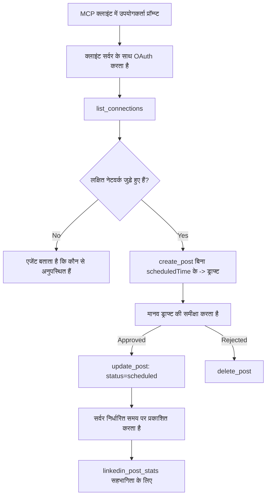

# केस स्टडी: रिमोट MCP सर्वर वाले एजेंट से सोशल नेटवर्क्स पर प्रकाशन

> **अस्वीकरण:** कई सेवाएं और ओपन-सोर्स प्रोजेक्ट सोशल नेटवर्क्स पर प्रकाशन कर सकते हैं, और एक टीम प्रत्येक नेटवर्क के API को सीधे एकीकृत कर सकती है। नीचे का परिदृश्य इस बात का एक कार्यशील उदाहरण है कि कैसे एक **लिखने में सक्षम रिमोट MCP सर्वर** को डिजाइन और उपभोग किया जा सकता है। पब्लोरा एक वाणिज्यिक सेवा है जिसका एक मुफ्त स्तर भी है; यहां वर्णित पैटर्न किसी भी MCP सर्वर पर लागू होते हैं जो उपयोगकर्ता की ओर से अपरिवर्तनीय क्रियाएं करता है।

## अवलोकन

एजेंट सामग्री का ड्राफ्ट बनाने में अच्छे होते हैं और उसे डिलीवर करने में कमजोर। एक मॉडल सेकंडों में एक रिलीज़ घोषणा लिख सकता है, और फिर काम रुक जाता है: इसे प्रकाशित करने के लिए हर नेटवर्क के लिए एक API, हर नेटवर्क के लिए एक OAuth ऐप, और प्रत्येक के लिए अलग मीडिया नियम होते हैं। अधिकांश टीमें इसे इस तरह हल करती हैं कि टेक्स्ट को हाथ से ब्राउज़र में कॉपी करती हैं।

यह केस स्टडी देखती है कि अंतिम चरण को एकल रिमोट MCP सर्वर के साथ कैसे बंद किया जाता है, और — जो इसे बनाने वाले किसी के लिए अधिक उपयोगी है — एक **लिखने में सक्षम** सर्वर को कौन-कौन से डिजाइन निर्णय सही करने होते हैं। डेटा पढ़ना माफ़ करने वाला होता है। प्रकाशन ऐसा नहीं: एक गलत टूल कॉल ऑडियेंस के सामने दिखाई देता है और इसे पूर्ववत नहीं किया जा सकता।

## परिदृश्य

एक छोटा डेवलपर-रिलेशन टीम एक एजेंट (Claude, VS Code, Cursor — क्लाइंट मायने नहीं रखता) के अंदर पोस्ट के ड्राफ्ट बनाती है। वे चाहते हैं कि एजेंट:

- देखें कि टीम ने किन सोशल अकाउंट्स को कनेक्ट किया है,
- एक पोस्ट ड्राफ्ट करें और इसे एक मानव की मंजूरी के लिए ड्राफ्ट के रूप में रखें,
- एक इमेज संलग्न करें,
- इसे चुने हुए समय पर कई नेटवर्क्स पर शेड्यूल करें,
- और बाद में इसकी प्रदर्शन रिपोर्ट करें।

सबसे अहम बात, वे चाहते हैं कि एजेंट गलती से तब प्रकाशित न कर पाए जब वे अभी भी प्रयोग कर रहे हों।

## उपयोग किए गए टूल्स

- [Publora MCP Server](https://github.com/publora/mcp-server) — एक रिमोट MCP सर्वर (`streamable-http`) जो प्रकाशन, शेड्यूलिंग, मीडिया और LinkedIn एनालिटिक्स टूल्स को प्रदर्शित करता है। MCP के आधिकारिक रजिस्ट्री में `com.publora/mcp-server` के रूप में रजिस्टर्ड।

## चरण-दर-चरण कार्यप्रवाह

1. **सर्वर से कनेक्ट करें।** OAuth बोलने वाले क्लाइंट्स सर्वर की अपनी सहमति स्क्रीन पर PKCE के साथ.authorization-code flow पूरा करते हैं; जो क्लाइंट ऐसा नहीं करते, जैसे हेडलेस CLI, वे हेडर में Publora API कुंजी का उपयोग करते हैं। दोनों मार्ग समर्थित हैं, और यह निर्भर करता है कि क्लाइंट कौन सा है, सर्वर पर नहीं।
2. **कनेक्शन सूचीबद्ध करें।** एजेंट `list_connections` कॉल करता है और कनेक्ट किए गए अकाउंट्स अपने पहचानकर्ताओं के साथ प्राप्त करता है।
3. **ड्राफ्ट बनाएं।** एजेंट बिना शेड्यूल किए हुए समय के `create_post` कॉल करता है। पोस्ट ड्राफ्ट के रूप में संग्रहित की जाती है — कुछ भी प्रकाशित नहीं होता।
4. **मीडिया संलग्न करें।** सार्वजनिक इमेज URL समान कॉल में पास किए जाते हैं; सर्वर उन्हें डाउनलोड और मान्य करता है।
5. **शेड्यूल करें।** मानव की मंजूरी के बाद, `update_post` स्थिति को ISO 8601 समय के साथ शेड्यूल्ड सेट करता है।
6. **मापें।** LinkedIn के लिए, `linkedin_post_stats` पोस्ट लाइव होने के बाद एंगेजमेंट लौटाता है।

## उदाहरण प्रॉम्प्ट

```text
Which social accounts do I have connected?
Draft a post announcing our new changelog page, attach the screenshot at
https://example.com/changelog.png, and keep it as a draft — do not publish it.
Once I approve, schedule it to LinkedIn and Bluesky for tomorrow at 09:00 UTC.
```

## मर्मेड फ्लोचार्ट



## तकनीकी कार्यान्वयन

नीचे दी गई सीखें इस केस स्टडी का वह स्थानांतरणीय हिस्सा हैं।

### खुला डिस्कवरी, प्रमाणीकृत निष्पादन

`tools/list` बिना प्रमाणपत्र के उपलब्ध है; हर `tools/call` को टोकन की आवश्यकता होती है
और अन्यथा `401` लौटाता है जिसमें एक `WWW-Authenticate` हेडर होता है जो
संरक्षित- संसाधन मेटाडेटा की ओर संकेत करता है। सर्वर का लेगेसी एंडपॉइंट पुराने
क्लाइंट्स के लिए `initialize` का अनप्रमाणिकृत उत्तर भी देता है जिनकी प्रोटोकॉल वर्शन
`2026-07-28` से पहले है; वर्तमान क्लाइंट उस हैंडशेक का उपयोग नहीं करते।

यह सर्वर-विशिष्ट विभाजन रजिस्ट्री, कैटलॉग और क्लाइंट्स को बिना सीक्रेट के टूल के नाम,
स्कीमा, और एनोटेशन निरीक्षण की अनुमति देता है जबकि अनाम निष्पादन को रोकता है।
खुला डिस्कवरी एक तैनाती विकल्प है, MCP की आवश्यकता नहीं; एक संरक्षित तैनाती `tools/list`
के लिए भी प्राधिकरण आवश्यक कर सकती है।

### पंजीकरण: डायनेमिक क्लाइंट पंजीकरण, और जो इसे प्रतिस्थापित करता है

सर्वर `/.well-known/oauth-protected-resource` और `/.well-known/oauth-authorization-server` विज्ञापित करता है, और PKCE (`S256`), रिफ्रेश टोकन के साथ authorization-code flow का समर्थन करता है, और **डायनेमिक क्लाइंट पंजीकरण** भी करता है।

डायनेमिक पंजीकरण legacy क्लाइंट्स के लिए मैनुअल स्टेप को हटाता है: इसके बिना,
प्रत्येक क्लाइंट को विक्रेता से एक पहले से जारी किया गया `client_id` चाहिए था।

इसे संगतता व्यवहार के रूप में लें न कि नकल करने के लिए डिजाइन के रूप में। विनिर्देशन का `2026-07-28` संशोधन डायनेमिक क्लाइंट पंजीकरण को Client ID Metadata Documents की ओर खारिज करता है, जहां क्लाइंट स्थिर HTTPS URL पर मेटाडेटा दस्तावेज होस्ट करता है और वह URL *ही* `client_id` होता है। DCR अभी भी काम करता है, लेकिन आज बन रहे सर्वर को CIMD के लिए योजना बनानी चाहिए और DCR केवल पुराने क्लाइंट्स के लिए रखें।

### टूल एनोटेशन सजावट नहीं हैं

प्रत्येक टूल में एक `title` और लागू संकेत होते हैं: `readOnlyHint`, `destructiveHint`, `idempotentHint`, `openWorldHint`।

दो कारण हैं उन पर निवेश करने के। पहला, क्लाइंट्स संकेतों का उपयोग यह तय करने के लिए करते हैं कि उपयोगकर्ता से क्या पुष्टि करनी है — एक क्लाइंट एक पढ़ने-केवल खोज को स्वतः चला सकता है और हटाने से पहले पुष्टि के लिए रुक सकता है। विनिर्देशन स्पष्ट करता है कि एनोटेशन अविश्वसनीय संकेत हैं, प्राधिकरण तंत्र नहीं: वे तय करते हैं कि क्लाइंट क्या करने की पेशकश करता है, वे सर्वर पर कुछ नहीं रोकते, और सर्वर को अपनी स्वयं की नियमों को लागू करना चाहिए। दूसरा, मुख्य कनेक्टर निर्देशिकाएं अब समीक्षा के लिए उन्हें *आवश्यक* करती हैं; जिन सर्वरों के टूल में टाइटल्स और संकेत नहीं हैं उन्हें वापस भेजा जाएगा चाहे वे कितने भी अच्छे काम कर रहे हों।

### पहचानकर्ताओं को अटकलबाजी से मुक्त बनाएं

प्लेटफ़ॉर्म पहचानकर्ता अपारदर्शी स्ट्रिंग्स होते हैं जो `list_connections` द्वारा लौटाए जाते हैं, और स्कीमा विवरण स्पष्ट रूप से कहता है कि उन्हें वर्बेटिम कॉपी किया जाना चाहिए और कभी अनुमान नहीं लगाना चाहिए। सर्वर कोई भी अन्य मान स्वीकार नहीं करता।

मॉडल सुझाने वाले प्रवाही होते हैं। कोई भी लिखने में सक्षम सर्वर मान ले कि पहचानकर्ता अंततः कल्पना किया जाएगा और उस पथ को जोर से और जल्द असफल करा देना चाहिए, बजाय किसी संभावित दिखने वाले मान पर कार्रवाई करने के।

### प्रकाशन से पहले विफल हों, क्रियान्वित संदेश के साथ

कुछ नेटवर्क केवल टेक्स्ट पोस्ट अस्वीकार करते हैं और एक छवि या वीडियो आवश्यक करते हैं। इसे पोस्ट शेड्यूल करने पर मान्य किया जाता है, और त्रुटि प्लेटफ़ॉर्म और गायब आवश्यकता का नाम बताती है।

एक एजेंट "Instagram को मीडिया चाहिए — एक छवि या वीडियो संलग्न करें" से बिना और यात्रा किए ठीक हो सकता है। यह एक सामान्य `400` से ठीक नहीं हो सकता।

### पुनः प्रयास सुरक्षित बनाएं

दो टूल जो सामग्री बनाते हैं, `create_post` और `update_post`, एक idempotency कुंजी स्वीकार करते हैं: इसका पुन: उपयोग एक समान अनुरोध के साथ मूल प्रतिक्रिया दोहराता है बजाय दूसरी पोस्ट बनाने के। एजेंट रनटाइम टाइमआउट पर पुनः प्रयास करते हैं; बिना idempotency के, धीमा जवाब डुप्लिकेट प्रकाशन बन जाता है। अन्य लिखने वाले टूल — हटाना, मीडिया कदम, LinkedIn प्रतिक्रियाएं और टिप्पणियां — idempotency कुंजी नहीं लेते, इसलिए वहां पुनः प्रयास स्वचालित रूप से सुरक्षित नहीं है। यह जानना जरुरी है कि आपकी कौन सी म्युटेशन सुरक्षित हैं और कौन सी नहीं।

### ऐसा तरीका दें जो कुछ भी प्रकाशित न करे, परीक्षण के लिए

सर्वर एक आरक्षित लक्ष्य `publora-playground` स्वीकार करता है, जिसे एक असली गंतव्य की तरह मान्य और स्वीकार किया जाता है और फिर हटा दिया जाता है — कुछ भी लाइव अकाउंट तक नहीं पहुंचता। इसे टूल स्कीमा में ही वर्णित किया गया है, जिसे कोई भी क्लाइंट बिना प्रमाणपत्र पढ़ सकता है: `create_post` के `platforms` फ़ील्ड में इसे "एक कनेक्शन-परीक्षण लक्ष्य जो असली कनेक्शन की मांग नहीं करता — पोस्ट स्वीकार की जाती है और हटा दी जाती है, कुछ भी प्रकाशित नहीं होता" के रूप में दस्तावेजीकृत करता है। इसे एकमात्र प्रविष्टि के रूप में पास करके बुलाएं: `platforms: ["publora-playground"]`।

यह पूरी सतह का सबसे उपयोगी विवरणों में से एक निकला। कनेक्टर निर्देशिकाओं के समीक्षकों, योगदानकर्ताओं और CI को बिना किसी जोखिम के पूर्ण लेखन पथ का अंत-से-अंत व्यायाम करने की अनुमति देता है। कोई भी MCP सर्वर जिसमें अपरिवर्तनीय क्रियाएं हैं, एक दस्तावेजीकृत no-op लक्ष्य से लाभान्वित होता है।

## परिणाम और प्रभाव

- प्रकाशन चरण ब्राउज़र से उसी बातचीत में चला गया जहां सामग्री लिखी जाती है, और ड्राफ्ट-प्रथम आदत मानव को लूप में रखती है। यह स्पष्ट करें कि ड्राफ्ट एक संधि है, सीमा नहीं। एक ही प्रमाण-पत्र शेड्यूल या प्रकाशन कर सकता है, इसलिए जो भी असली मंजूरी द्वार चाहता है उसे टूल सतह के बाहर इसे लागू करना होगा — अलग प्रमाण-पत्र या सर्वर के सामने एक नीति परत।
- नेटवर्क-विशेष अंतर — मीडिया आवश्यकताएं, थ्रेडिंग, उत्तर नियंत्रण — हर एजेंट में नहीं बल्कि सर्वर में एक बार संभाले जाते हैं।
- एक ही सर्वर कई MCP क्लाइंट्स का समर्थन करता है बिना पहले से जारी प्रमाण-पत्र के।
    वर्तमान क्लाइंट Client ID Metadata Documents का उपयोग कर सकते हैं; DCR पुराने क्लाइंट्स के लिए बैकअप रहता है।

- उपरोक्त डिजाइन बाधाओं को उपयोगकर्ताओं के साथ-साथ कनेक्टर-डायरेक्टरी समीक्षाओं ने आकार दिया: एनोटेशन, OAuth और एक सुरक्षित परीक्षण लक्ष्य कम से कम एक समीक्षा ने आवश्यक किया।

## संदर्भ

- [Publora MCP Server (स्रोत)](https://github.com/publora/mcp-server)
- [Publora API और MCP दस्तावेज़ीकरण](https://docs.publora.com)
- [MCP रजिस्ट्री प्रविष्टि: `com.publora/mcp-server`](https://registry.modelcontextprotocol.io/v0/servers?search=com.publora/mcp-server)
- [MCP विनिर्देशन — प्राधिकरण](https://modelcontextprotocol.io/specification/2026-07-28/basic/authorization)
- [MCP विनिर्देशन — टूल एनोटेशन](https://modelcontextprotocol.io/docs/concepts/tools)

## आगे क्या

- कोई MCP सर्वर लें जो आप बना रहे हैं और यहां तीन सबसे सस्ते विजयों की जांच करें: हर टूल पर एनोटेशन, हर लिखने वाले टूल पर idempotency कुंजी, और एक दस्तावेजीकृत no-op लक्ष्य।
- खुला-डिस्कवरी विभाजन का प्रयास करें: बिना प्रमाण-पत्र के किसी सार्वजनिक रिमोट सर्वर पर `tools/list` कॉल करें, फिर एक टूल कॉल करें और `401` चुनौती का निरीक्षण करें।
- विचार करें कि आपके डोमेन में "पूर्ववत करें" क्या मतलब है। प्रकाशन के ड्राफ्ट और हटाना होते हैं; यदि आपके क्रियाएं इसके समकक्ष नहीं हैं, तो पुष्टि टूल डिजाइन में होनी चाहिए, प्रॉम्प्ट में नहीं।

---

<!-- CO-OP TRANSLATOR DISCLAIMER START -->
**अस्वीकरण**:
इस दस्तावेज़ का अनुवाद AI अनुवाद सेवा [Co-op Translator](https://github.com/Azure/co-op-translator) का उपयोग करके किया गया है। जबकि हम सटीकता के लिए प्रयास करते हैं, कृपया ध्यान दें कि स्वचालित अनुवादों में त्रुटियाँ या अशुद्धियाँ हो सकती हैं। मूल दस्तावेज़ अपनी मूल भाषा में ही प्रामाणिक स्रोत माना जाना चाहिए। महत्वपूर्ण जानकारी के लिए, पेशेवर मानव अनुवाद की सिफारिश की जाती है। इस अनुवाद के उपयोग से उत्पन्न किसी भी गलतफहमी या गलत व्याख्या के लिए हम उत्तरदायी नहीं हैं।
<!-- CO-OP TRANSLATOR DISCLAIMER END -->