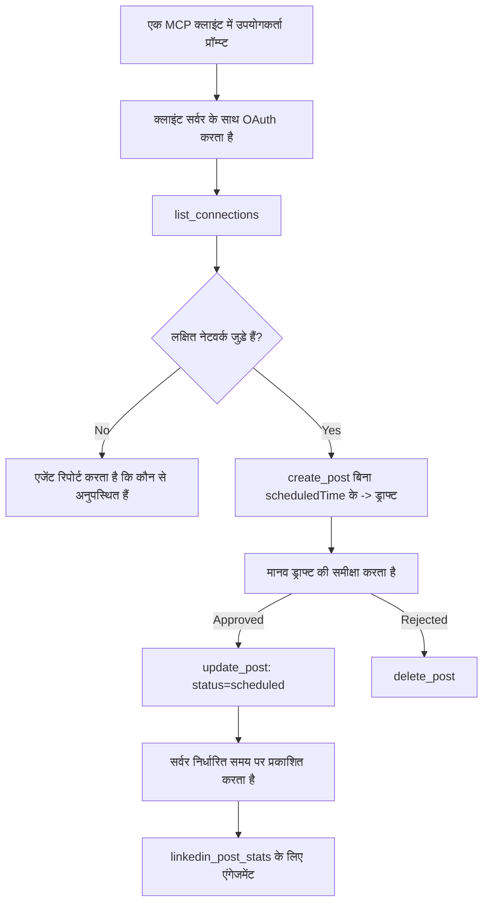

# केस स्टडी: एक एजेंट से रिमोट MCP सर्वर के साथ सोशल नेटवर्क पर पब्लिशिंग करना

> **अस्वीकरण:** कई सेवाएं और ओपन-सोर्स प्रोजेक्ट सोशल नेटवर्क पर पब्लिश कर सकते हैं, और एक टीम सीधे प्रत्येक नेटवर्क के API को भी इंटीग्रेट कर सकती है। नीचे दिया गया परिदृश्य दिखाता है कि किस प्रकार एक **लिखने योग्य रिमोट MCP सर्वर** डिज़ाइन किया जा सकता है और उपयोग में लाया जा सकता है। Publora एक व्यावसायिक सेवा है जिसमें एक फ्री टियर है; यहाँ वर्णित पैटर्न किसी भी MCP सर्वर पर लागू होते हैं जो उपयोगकर्ता की ओर से अपरिवर्तनीय क्रियाएं करता है।

## अवलोकन

एजेंट कंटेंट ड्राफ्ट करने में अच्छे होते हैं और उसे भेजने में कमजोर। एक मॉडल सेकंडों में एक रिलीज़ घोषणा लिख सकता है, और फिर काम रुक जाता है: इसे प्रकाशित करना मतलब है हर नेटवर्क के लिए API, हर नेटवर्क के लिए OAuth ऐप, और प्रत्येक के लिए अलग मीडिया नियम। अधिकांश टीम इसे हल करती हैं कि वे टेक्स्ट को मैन्युअल रूप से ब्राउज़र में कॉपी कर देते हैं।

यह केस स्टडी देखती है कि वह अंतिम चरण कैसे एक ही रिमोट MCP सर्वर के साथ बंद होता है, और—जिसके लिए कोई भी ऐसा बना रहा हो—**लिखने योग्य** सर्वर को सही तरीके से डिजाइन करने के निर्णय। डेटा पढ़ना सहनशील होता है। पब्लिशिंग नहीं: गलत टूल कॉल दर्शकों को दिखाई देता है और उसे बदला नहीं जा सकता।

## परिदृश्य

एक छोटी डेवलपर-रिलेशन टीम एजेंट (Claude, VS Code, Cursor—क्लाइंट का कोई महत्व नहीं) के अंदर पोस्ट ड्राफ्ट करती है। वे चाहते हैं कि एजेंट:

- देखे कि टीम ने कौन से सोशल अकाउंट्स कनेक्ट किए हैं,
- एक पोस्ट ड्राफ्ट करे और इसे मानव द्वारा मंजूर होने तक ड्राफ्ट के रूप में रखे,
- एक इमेज संलग्न करे,
- उसे एक चुने हुए समय पर कई नेटवर्क्स पर शेड्यूल करे,
- और बाद में रिपोर्ट करे कि यह कैसा प्रदर्शन किया।

महत्वपूर्ण बात यह है कि वे यह चाहें कि एजेंट आंकलन करते हुए गलती से पोस्ट पब्लिश न करे।

## उपयोग किए गए उपकरण

- [Publora MCP सर्वर](https://github.com/publora/mcp-server) — एक रिमोट MCP सर्वर (`streamable-http`) जो पब्लिशिंग, शेड्यूलिंग, मीडिया और लिंक्डइन एनालिटिक्स टूल्स प्रदान करता है। आधिकारिक MCP रजिस्ट्री में `com.publora/mcp-server` के रूप में पंजीकृत।

## कदम-दर-कदम कार्यप्रवाह

1. **सर्वर से कनेक्ट करें।** OAuth समर्थित क्लाइंट सर्वर की अपनी सहमति स्क्रीन के खिलाफ PKCE के साथ ऑथराइजेशन-कोड फ़्लो पूरा करते हैं; जो क्लाइंट समर्थित नहीं हैं, जैसे हेडलेस CLI, वे हेडर में Publora API की का उपयोग करते हैं। दोनों रास्ते समर्थित हैं, और आप किसे पाते हैं यह क्लाइंट पर निर्भर करता है, सर्वर पर नहीं।
2. **कनेक्शन सूची बनाएँ।** एजेंट `list_connections` कॉल करता है और कनेक्टेड अकाउंट्स उनके पहचानकर्ताओं के साथ प्राप्त करता है।
3. **ड्राफ्ट करें।** एजेंट `create_post` कॉल करता है *बिना* शेड्यूल्ड समय के। पोस्ट एक ड्राफ्ट के रूप में संग्रहीत होती है — कुछ भी प्रकाशित नहीं होता।
4. **मीडिया संलग्न करें।** सार्वजनिक इमेज URLs उसी कॉल में पास किए जाते हैं; सर्वर उन्हें डाउनलोड और सत्यापित करता है।
5. **शेड्यूल करें।** मानव द्वारा मंजूरी के बाद, `update_post` स्थिति को शेड्यूल्ड में ISO 8601 समय के साथ सेट करता है।
6. **मापें।** लिंक्डइन के लिए, `linkedin_post_stats` पोस्ट लाइव होने के बाद एंगेजमेंट लौटाता है।

## उदाहरण प्रॉम्प्ट

```text
Which social accounts do I have connected?
Draft a post announcing our new changelog page, attach the screenshot at
https://example.com/changelog.png, and keep it as a draft — do not publish it.
Once I approve, schedule it to LinkedIn and Bluesky for tomorrow at 09:00 UTC.
```

## मर्मेड फ्लोचार्ट



## तकनीकी कार्यान्वयन

नीचे दिए गए पाठ इस केस स्टडी का वह हिस्सा हैं जिसे अन्यत्र भी लागू किया जा सकता है।

### खुला डिस्कवरी, प्रमाणित निष्पादन

`tools/list` क्रेडेंशियल के बिना सर्व किया जाता है; हर `tools/call` टोकन मांगता है और अन्यथा `401` लौटाता है जिसमें `WWW-Authenticate` हेडर होता है जो प्रोटेक्टेड-रिसोर्स मेटाडेटा की ओर संकेत करता है। (सर्वर बिना प्रमाणीकरण के `initialize` का जवाब भी देता है, जो केवल `2026-07-28` से पहले वाले प्रोटोकॉल संस्करण के क्लाइंट के लिए मायने रखता है; उस संशोधन ने हैंडशेक पूरी तरह हटा दिया।)

यह विभाजन व्यवहार में मायने रखता है। रजिस्ट्री, कैटलॉग और क्लाइंट टूल सतह — नाम, स्कीमा, एनोटेशन — बिना गुप्त बद्ध हुए निरीक्षण कर सकते हैं, जबकि कुछ भी गुमनाम रूप से *निष्पादित* नहीं किया जा सकता। जो सर्वर `initialize` के लिए टोकन मांगता है वह टूलिंग के लिए लगभग अदृश्य होता है; जो गुमनाम `tools/call` की अनुमति देता है वह जोखिम भरा है।

### पंजीकरण: डायनामिक क्लाइंट पंजीकरण, और जो इसे बदलता है

सर्वर `/.well-known/oauth-protected-resource` और `/.well-known/oauth-authorization-server` विज्ञापित करता है, और PKCE (`S256`), रिफ्रेश टोकन, और **डायनामिक क्लाइंट रजिस्ट्रेशन** के साथ ऑथराइजेशन-कोड फ्लो का समर्थन करता है।

डायनामिक पंजीकरण मैन्युअल कदम को हटा देता है: बिना इसके हर क्लाइंट को एक पूर्व-इश्यू किया गया `client_id` चाहिए, जिसका मतलब हर नए क्लाइंट के लिए विक्रेता से आउट-ऑफ-बैंड अनुरोध है।

इसे एक संगतता व्यवहार के रूप में देखें न कि कॉपी करने का डिज़ाइन। `2026-07-28` का संशोधन डायनामिक क्लाइंट पंजीकरण को डिप्रिकेट करता है और इसके बजाय क्लाइंट आईडी मेटाडेटा डॉक्युमेंट्स की सलाह देता है, जहां क्लाइंट एक स्थिर HTTPS URL पर मेटाडेटा दस्तावेज होस्ट करता है और वह URL *खुद* `client_id` होता है। DCR अभी भी काम करता है, लेकिन आज बन रहा सर्वर CIMD के लिए योजना बनाएं और DCR को केवल पुराने क्लाइंट के लिए रखें।

### टूल एनोटेशन सिर्फ सजावट नहीं हैं

हर टूल में एक `title` होता है और लागू संकेत होते हैं: `readOnlyHint`, `destructiveHint`, `idempotentHint`, `openWorldHint`।

दो कारण हैं जिनके लिए उनमें निवेश करना जरूरी है। पहला, क्लाइंट उपयोगकर्ता से क्या पुष्टि करनी है यह फैसला करने के लिए संकेतों का उपयोग करते हैं—क्लाइंट एक पढ़ने-केवल खोज को ऑटो-रन कर सकता है और डिलीट से पहले मंजूरी मांग सकता है। विशिष्टता स्पष्ट है कि एनोटेशन गैर-विश्वसनीय संकेत हैं, कोई प्राधिकरण तंत्र नहीं: वे क्लाइंट को यह आकार देते हैं कि वह क्या करेगा, वे सर्वर पर कुछ नहीं रोकते, और सर्वर को अब भी अपने नियम लागू करने चाहिए। दूसरा, प्रमुख कनेक्टर निर्देशिकाएं अब समीक्षा के लिए इन्हें *आवश्यक* करती हैं; जिन सर्वरों के टूल के टाइटल और संकेत नहीं होते, उन्हें चाहे कितना भी अच्छा काम करें वापस भेज दिया जाता है।

### पहचानकर्ता अविनाशी बनाएं

प्लेटफ़ॉर्म पहचानकर्ता अस्पष्ट स्ट्रिंग्स हैं जो `list_connections` से लौटाए जाते हैं, और स्कीमा विवरण स्पष्ट रूप से कहता है कि उन्हें यथावत कॉपी करना है और कभी अनुमान नहीं लगाना। सर्वर अन्यथा कुछ स्वीकार नहीं करता।

मॉडल सहज अनुमान लगाने वाले होते हैं। कोई भी लिखने योग्य सर्वर मान लेना चाहिए कि कोई पहचानकर्ता अंततः होलुसिनेटेड होगा और उस मार्ग को जल्द और ज़ोर से विफल कर देना चाहिए, बजाय इसके कि वह एक संभावित दिखने वाले मान पर कार्रवाई करे।

### पब्लिश करने से पहले विफल करें, कारगर संदेश के साथ

कुछ नेटवर्क केवल टेक्स्ट पोस्ट को अस्वीकार करते हैं और इमेज या वीडियो की मांग करते हैं। यह पोस्ट शेड्यूल करते समय सत्यापित होता है, और त्रुटि प्लेटफ़ॉर्म और गुम आवश्यकता का नाम बताती है।

एक एजेंट "इंस्टाग्राम को मीडिया चाहिए — एक इमेज या वीडियो संलग्न करें" से बिना और चक्कर के उबर सकता है। वह सामान्य `400` से नहीं उबर सकता।

### पुन: प्रयास सुरक्षित बनाएं

दो टूल जो कंटेंट बनाते हैं, `create_post` और `update_post`, एक आइडेम्पोटेंसी की स्वीकार करते हैं: इसे एक समान अनुरोध के साथ पुनः उपयोग करने पर मूल प्रतिक्रिया को दोहराते हैं बजाय दूसरी पोस्ट बनाने के। एजेंट रनटाइम टाइमआउट पर पुनः प्रयास करता है; आइडेम्पोटेंसी के बिना, एक धीमा जवाब डुप्लीकेट प्रकाशन हो जाता है। अन्य लिखने वाले टूल—हटाना, मीडिया स्टेप्स, लिंक्डइन रिएक्शन और कमेंट्स—को यह नहीं मिलता, इसलिए वहां पुनः प्रयास स्वचालित रूप से सुरक्षित नहीं है। यह जानना जरूरी है कि आपके अपने परिवर्तन में से कौन से सुरक्षित हैं और कौन से नहीं।

### एक तरीका दें जिससे कुछ भी प्रकाशित न हो, उसकी जांच करें

सर्वर एक आरक्षित लक्ष्य, `publora-playground` स्वीकार करता है, जिसे सत्यापित और मान्य किया जाता है जैसे यह एक वास्तव में मंजूर गंतव्य हो और फिर त्याग दिया जाता है—कुछ भी लाइव अकाउंट तक नहीं पहुंचता। यह टूल स्कीमा में खुद वर्णित है, जिसे कोई भी क्लाइंट बिना क्रेडेंशियल के पढ़ सकता है: `create_post` का `platforms` फ़ील्ड इसे "एक कनेक्शन-परिक्षण लक्ष्य के रूप में दस्तावेज़ित करता है जिसे असली कनेक्शन की जरूरत नहीं है—पोस्ट स्वीकार किया जाता है और छोड़ दिया जाता है, कुछ भी प्रकाशित नहीं होता"। इसे एकमात्र प्रविष्टि के रूप में पास करके बुलाएं: `platforms: ["publora-playground"]`।

यह पूरे टूल सतह का सबसे उपयोगी विवरणों में से एक साबित हुआ। कनेक्टर निर्देशिका समीक्षा करने वाले, योगदानकर्ता और CI बिना किसी वास्तविक दर्शकों को जोखिम में डाले पूरी लेखन प्रक्रिया को अंत तक अभ्यास कर सकते हैं। कोई भी MCP सर्वर जिसमें अपरिवर्तनीय क्रियाएं हैं, एक दस्तावेजीकृत नो-ऑप लक्ष्य से लाभान्वित होता है।

## परिणाम और प्रभाव

- पब्लिशिंग चरण ब्राउज़र से उस ही बातचीत में आ गया जहां कंटेंट लिखा जाता है, और ड्राफ्ट-प्रथम आदत मानव को प्रक्रिया में रखती है। ध्यान दें कि ड्राफ्ट एक कन्वेंशन है, एक सीमा नहीं। एक ही प्रमाणपत्र द्वारा शेड्यूल या पब्लिश किया जा सकता है, इसलिए जो कोई भी वास्तविक अनुमोदन गेट चाहता है उसे इसे टूल सतह के बाहर लागू करना होगा—अलग क्रेडेंशियल, या सर्वर के आगे एक नीति लेयर।
- नेटवर्क-विशिष्ट अंतर — मीडिया आवश्यकताएँ, थ्रेडिंग, रिप्लाई नियंत्रण — सर्वर में एक बार संभाले जाते हैं, बजाय हर एजेंट में उन्हें संभालने के।
- वही सर्वर कई MCP क्लाइंट्स का समर्थन करता है बिना हर क्लाइंट के लिए अलग काम किए, क्योंकि डिस्कवरी खुली होती है और पंजीकरण डायनामिक है।
- ऊपर दिए गए डिजाइन प्रतिबंध कनेक्टर-निर्देशिका समीक्षाओं और उपयोगकर्ताओं दोनों द्वारा आकारित हुए थे: एनोटेशन, OAuth और एक सुरक्षित परीक्षण लक्ष्य कम से कम एक समीक्षा द्वारा आवश्यक थे।

## संदर्भ

- [Publora MCP सर्वर (सोर्स)](https://github.com/publora/mcp-server)
- [Publora API और MCP दस्तावेज़](https://docs.publora.com)
- [MCP रजिस्ट्री प्रविष्टि: `com.publora/mcp-server`](https://registry.modelcontextprotocol.io/v0/servers?search=com.publora/mcp-server)
- [MCP विनिर्देशन — प्राधिकरण](https://modelcontextprotocol.io/specification/draft/basic/authorization)
- [MCP विनिर्देशन — टूल एनोटेशन](https://modelcontextprotocol.io/docs/concepts/tools)

## अगला क्या है

- कोई MCP सर्वर लें जिसे आप बना रहे हैं और यहां तीन सबसे सस्ते सुधार देखें: हर टूल पर एनोटेशन, हर लेखन में आइडेम्पोटेंसी की, और एक दस्तावेजीकृत नो-ऑप लक्ष्य।
- खुला-डिस्कवरी विभाजन आजमाएं: सार्वजनिक रिमोट सर्वर पर बिना क्रेडेंशियल के `tools/list` कॉल करें, फिर `401` चुनौती देखकर किसी टूल को कॉल करें।
- विचार करें कि आपके डोमेन में "पूर्ववत" का क्या मतलब है। पब्लिशिंग में ड्राफ्ट और डिलीट होता है; यदि आपके क्रियाओं का कोई समकक्ष नहीं है, तो पुष्टि प्रॉम्प्ट में नहीं बल्कि टूल डिज़ाइन में होनी चाहिए।

---

<!-- CO-OP TRANSLATOR DISCLAIMER START -->
**अस्वीकरण**:
इस दस्तावेज़ का अनुवाद AI अनुवाद सेवा [Co-op Translator](https://github.com/Azure/co-op-translator) का उपयोग करके किया गया है। जबकि हम सटीकता के लिए प्रयास करते हैं, कृपया ध्यान दें कि स्वचालित अनुवादों में त्रुटियाँ या अशुद्धियाँ हो सकती हैं। मूल दस्तावेज़ अपनी मूल भाषा में ही प्रामाणिक स्रोत माना जाना चाहिए। महत्वपूर्ण जानकारी के लिए, पेशेवर मानव अनुवाद की सिफारिश की जाती है। इस अनुवाद के उपयोग से उत्पन्न किसी भी गलतफहमी या गलत व्याख्या के लिए हम उत्तरदायी नहीं हैं।
<!-- CO-OP TRANSLATOR DISCLAIMER END -->