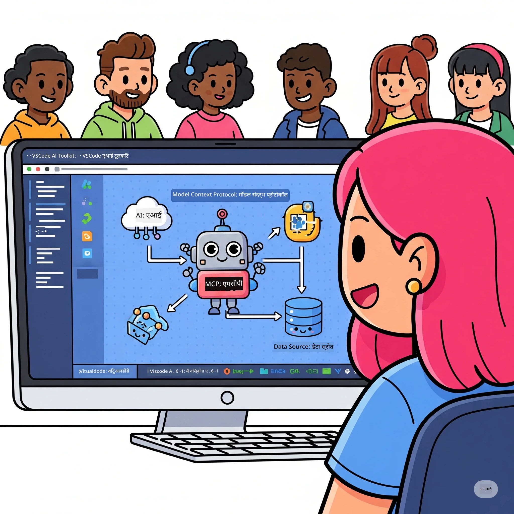

# एआई वर्कफ़्लोज़ को सहज बनाना: Microsoft Foundry Toolkit के साथ MCP सर्वर बनाना

## 🎯  अवलोकन

_(इस पाठ का वीडियो देखने के लिए ऊपर की छवि पर क्लिक करें)_

**Model Context Protocol (MCP) कार्यशाला** में आपका स्वागत है! यह व्यापक हैंड्स-ऑन कार्यशाला दो अत्याधुनिक तकनीकों को जोड़ती है जो एआई अनुप्रयोग विकास में क्रांति ला रही हैं:

> **संगतता नोट:** कार्यशाला कोड MCP `2025-11-25` के साथ बनाया और परीक्षण किया गया है, जैसा कि ऊपर बैज से दिखाया गया है। कृपया नए प्रोटोकॉल कार्यान्वयन के लिए [वर्तमान `2026-07-28` स्पेसिफिकेशन](https://modelcontextprotocol.io/specification/2026-07-28/) का उपयोग करें और लैब्स माइग्रेट करने से पहले SDK रिलीज नोट्स की समीक्षा करें।

- **🔗 Model Context Protocol (MCP)**: एआई-टूल इंटीग्रेशन के लिए एक खुला मानक
- **🛠️ Microsoft Foundry Toolkit Extension for VS Code**: Microsoft का शक्तिशाली एआई विकास एक्सटेंशन

### 🎓 आप क्या सीखेंगे

इस कार्यशाला के अंत तक, आप बुद्धिमान अनुप्रयोग बनाना सीख जाएंगे जो एआई मॉडल को वास्तविक दुनिया के टूल्स और सेवाओं से जोड़ते हैं। स्वचालित परीक्षण से लेकर कस्टम API इंटीग्रेशन तक, आप जटिल व्यावसायिक चुनौतियों को हल करने के लिए व्यावहारिक कौशल प्राप्त करेंगे।

## 🏗️ तकनीकी स्टैक

### 🔌 Model Context Protocol (MCP)

MCP एआई के लिए **"USB-C"** है - एक सार्वभौमिक मानक जो एआई मॉडल्स को बाहरी उपकरणों और डेटा स्रोतों से जोड़ता है।

**✨ मुख्य विशेषताएं:**

- 🔄 **मानकीकृत इंटीग्रेशन**: एआई-टूल कनेक्शंस के लिए सार्वभौमिक इंटरफ़ेस
- 🏛️ **लचीला आर्किटेक्चर**: स्थानीय और रिमोट सर्वर stdio/SSE ट्रांसपोर्ट के माध्यम से
- 🧰 **समृद्ध ईकोसिस्टम**: उपकरण, प्रॉम्प्ट्स, और संसाधन एक ही प्रोटोकॉल में
- 🔒 **एंटरप्राइज़-रेडी**: बिल्ट-इन सुरक्षा और विश्वसनीयता

**🎯 MCP क्यों महत्वपूर्ण है:**
जैसे USB-C ने केबल की गड़बड़ी खत्म की, वैसे ही MCP एआई इंटीग्रेशन की जटिलता को खत्म करता है। एक प्रोटोकॉल, अनंत संभावनाएं।

### 🤖 Microsoft Foundry Toolkit Extension for VS Code

Microsoft का प्रमुख AI विकास एक्सटेंशन जो VS Code को एक AI पावरहाउस में बदल देता है।

**🚀 मुख्य क्षमताएं:**

- 📦 **मॉडल कैटलॉग**: Azure AI, GitHub, Hugging Face, Ollama से मॉडल तक पहुंच
- ⚡ **लोकल इन्फरेंस**: ONNX-ऑप्टिमाइज़्ड CPU/GPU/NPU निष्पादन
- 🏗️ **एजेंट बिल्डर**: MCP इंटीग्रेशन के साथ विज़ुअल AI एजेंट विकास
- 🎭 **मल्टी-मोडल**: टेक्स्ट, विज़न, और संरचित आउटपुट का समर्थन

**💡 विकास के फायदे:**

- ज़ीरो-कॉन्फ़िग मॉडल डिप्लॉयमेंट
- विज़ुअल प्रॉम्प्ट इंजीनियरिंग
- रियल-टाइम परीक्षण प्लेग्राउंड
- निर्बाध MCP सर्वर इंटीग्रेशन

## 📚 सीखने की यात्रा

### [🚀 मॉड्यूल 1: Microsoft Foundry Toolkit के मूल तत्व](./lab1/README.md)

**समय अवधि**: 15 मिनट

- 🛠️ Microsoft Foundry Toolkit को VS Code में इंस्टॉल और कॉन्फ़िगर करें
- 🗂️ मॉडल कैटलॉग का पता लगाएं (GitHub, ONNX, OpenAI, Anthropic, Google से 100+ मॉडल)
- 🎮 रियल-टाइम मॉडल परीक्षण के लिए इंटरैक्टिव प्लेग्राउंड में महारत हासिल करें
- 🤖 Agent Builder के साथ अपना पहला AI एजेंट बनाएं
- 📊 बिल्ट-इन मेट्रिक्स के साथ मॉडल प्रदर्शन का मूल्यांकन करें (F1, प्रासंगिकता, समानता, संगति)
- ⚡ बैच प्रोसेसिंग और मल्टी-मोडल समर्थन क्षमताओं को सीखें

**🎯 सीखने का परिणाम**: Microsoft Foundry Toolkit क्षमताओं की व्यापक समझ के साथ एक कार्यात्मक AI एजेंट बनाएं

### [🌐 मॉड्यूल 2: Microsoft Foundry Toolkit के साथ MCP के मूल तत्व](./lab2/README.md)

**समय अवधि**: 20 मिनट

- 🧠 Model Context Protocol (MCP) की वास्तुकला और अवधारणाएँ सीखें
- 🌐 Microsoft के MCP सर्वर ईकोसिस्टम का अन्वेषण करें
- 🤖 Playwright MCP सर्वर का उपयोग करके ब्राउज़र ऑटोमेशन एजेंट बनाएं
- 🔧 MCP सर्वरों को Microsoft Foundry Toolkit Agent Builder के साथ इंटीग्रेट करें
- 📊 अपने एजेंटों के अंदर MCP उपकरणों को कॉन्फ़िगर और परीक्षण करें
- 🚀 उत्पादन उपयोग के लिए MCP-पावर्ड एजेंटों को निर्यात और तैनात करें

**🎯 सीखने का परिणाम**: MCP के माध्यम से बाहरी उपकरणों से जुड़े एक सुपरचार्ज्ड AI एजेंट को तैनात करें

### [🔧 मॉड्यूल 3: Microsoft Foundry Toolkit के साथ उन्नत MCP विकास](./lab3/README.md)

**समय अवधि**: 20 मिनट

- 💻 Microsoft Foundry Toolkit का उपयोग करके कस्टम MCP सर्वर बनाएं
- 🐍 नवीनतम MCP Python SDK (v1.9.3) का कॉन्फ़िगर और उपयोग करें
- 🔍 डिबगिंग के लिए MCP इंस्पेक्टर सेट अप करें और उपयोग करें
- 🛠️ पेशेवर डिबगिंग वर्कफ़्लोज़ के साथ एक वेदर MCP सर्वर बनाएं
- 🧪 Agent Builder और Inspector दोनों वातावरणों में MCP सर्वर्स का डिबग करें

**🎯 सीखने का परिणाम**: आधुनिक टूलिंग के साथ कस्टम MCP सर्वर विकसित और डिबग करें

### [🐙 मॉड्यूल 4: व्यावहारिक MCP विकास - कस्टम GitHub क्लोन सर्वर](./lab4/README.md)

**समय अवधि**: 30 मिनट

- 🏗️ विकास वर्कफ़्लोज़ के लिए एक वास्तविक GitHub क्लोन MCP सर्वर बनाएं
- 🔄 सत्यापन और त्रुटि हैंडलिंग के साथ स्मार्ट रिपॉजिटरी क्लोनिंग लागू करें
- 📁 स्मार्ट डायरेक्टरी प्रबंधन और VS Code इंटीग्रेशन बनाएं
- 🤖 कस्टम MCP टूल के साथ GitHub Copilot एजेंट मोड का उपयोग करें
- 🛡️ उत्पादन-तैयार विश्वसनीयता और क्रॉस-प्लेटफ़ॉर्म संगतता लागू करें

**🎯 सीखने का परिणाम**: एक उत्पादन-तैयार MCP सर्वर तैनात करें जो वास्तविक विकास वर्कफ़्लोज़ को सहज बनाता है

## 💡 वास्तविक दुनिया के अनुप्रयोग और प्रभाव

### 🏢 एंटरप्राइज़ उपयोग मामले

#### 🔄 DevOps ऑटोमेशन

अपने विकास वर्कफ़्लो को बुद्धिमान ऑटोमेशन के साथ बदलें:

- **स्मार्ट रिपॉजिटरी प्रबंधन**: एआई संचालित कोड समीक्षा और मर्ज निर्णय
- **बुद्धिमान CI/CD**: कोड परिवर्तन के आधार पर स्वचालित पाइपलाइन अनुकूलन
- **इशू ट्रायज**: स्वचालित बग वर्गीकरण और असाइनमेंट

#### 🧪 गुणवत्ता आश्वासन में क्रांति

एआई-संचालित स्वचालन के साथ परीक्षण को उच्च स्तर पर ले जाएं:

- **बुद्धिमान टेस्ट जेनरेशन**: स्वचालित रूप से व्यापक परीक्षण सूट बनाएं
- **विज़ुअल रिग्रेशन टेस्टिंग**: एआई-संचालित UI बदलाव पहचान
- **परफ़ॉर्मेंस मॉनिटरिंग**: सक्रिय मुद्दा पहचान और समाधान

#### 📊 डेटा पाइपलाइन इंटेलिजेंस

स्मार्ट डेटा प्रोसेसिंग वर्कफ़्लो बनाएं:

- **अनुकूली ETL प्रक्रियाएं**: आत्म-उन्नत डेटा ट्रांसफॉर्मेशन
- **विसंगति पहचान**: रीयल-टाइम डेटा गुणवत्ता निगरानी
- **बुद्धिमान रूटिंग**: स्मार्ट डेटा प्रवाह प्रबंधन

#### 🎧 ग्राहक अनुभव सुधार

असाधारण ग्राहक इंटरैक्शन बनाएं:

- **प्रसंग-संवेदनशील समर्थन**: ग्राहक इतिहास तक पहुँच वाले AI एजेंट
- **सक्रिय समस्या समाधान**: पूर्वानुमानित ग्राहक सेवा
- **मल्टी-चैनल एकीकरण**: प्लेटफॉर्म के across एकीकृत AI अनुभव

## 🛠️ आवश्यकताएँ और सेटअप

### 💻 सिस्टम आवश्यकताएँ

| घटक | आवश्यकता | नोट्स |
|-----------|-------------|-------|
| **ऑपरेटिंग सिस्टम** | Windows 10+, macOS 10.15+, Linux | कोई भी आधुनिक OS |
| **Visual Studio Code** | नवीनतम स्थिर संस्करण | Microsoft Foundry Toolkit के लिए आवश्यक |
| **Node.js** | v18.0+ और npm | MCP सर्वर विकास के लिए |
| **Python** | 3.10+ | Python MCP सर्वरों के लिए वैकल्पिक |
| **मेमोरी** | न्यूनतम 8GB RAM | स्थानीय मॉडल के लिए 16GB अनुशंसित |

### 🔧 विकास पर्यावरण

#### अनुशंसित VS Code एक्सटेंशन्स

- **Microsoft Foundry Toolkit** (ms-windows-ai-studio.windows-ai-studio)
- **Python** (ms-python.python)
- **Python Debugger** (ms-python.debugpy)
- **GitHub Copilot** (GitHub.copilot) - वैकल्पिक लेकिन सहायक

#### वैकल्पिक टूल्स

- **uv**: आधुनिक Python पैकेज मैनेजर
- **MCP Inspector**: MCP सर्वरों के लिए दृश्यात्मक डिबगिंग टूल
- **Playwright**: वेब ऑटोमेशन उदाहरणों के लिए

## 🎖️ सीखने के परिणाम और प्रमाणन पथ

### 🏆 कौशल मास्टरी चेकलिस्ट

इस कार्यशाला को पूरा करके, आप मास्टरी प्राप्त करेंगे:

#### 🎯 मुख्य दक्षताएँ

- [ ] **MCP प्रोटोकॉल मास्टरी**: वास्तुकला और कार्यान्वयन पैटर्न की गहरी समझ
- [ ] **Microsoft Foundry Toolkit प्रवीणता**: Microsoft Foundry Toolkit का विशेषज्ञ स्तर का उपयोग तेज़ विकास के लिए
- [ ] **कस्टम सर्वर विकास**: उत्पादन MCP सर्वर बनाना, तैनात करना और बनाए रखना
- [ ] **टूल इंटीग्रेशन उत्कृष्टता**: मौजूदा विकास वर्कफ़्लो में AI का सहज समाकलन
- [ ] **समस्या-समाधान अनुप्रयोग**: सीखे गए कौशल का वास्तविक व्यावसायिक चुनौतियों पर प्रयोग

#### 🔧 तकनीकी कौशल

- [ ] VS Code में Microsoft Foundry Toolkit सेटअप और कॉन्फ़िगर करें
- [ ] कस्टम MCP सर्वर डिज़ाइन और कार्यान्वयन करें
- [ ] GitHub मॉडल्स को MCP आर्किटेक्चर के साथ इंटीग्रेट करें
- [ ] Playwright के साथ स्वचालित परीक्षण वर्कफ़्लो बनाएं
- [ ] उत्पादन उपयोग के लिए AI एजेंट तैनात करें
- [ ] MCP सर्वर प्रदर्शन को डिबग और अनुकूलित करें

#### 🚀 उन्नत क्षमताएँ

- [ ] एंटरप्राइज़-स्तरीय AI इंटीग्रेशन का आर्किटेक्ट बनाएं
- [ ] AI अनुप्रयोगों के लिए सुरक्षा सर्वोत्तम प्रथाओं को लागू करें
- [ ] स्केलेबल MCP सर्वर आर्किटेक्चर डिज़ाइन करें
- [ ] विशिष्ट डोमेन के लिए कस्टम टूल चेन बनाएं
- [ ] AI-नेटिव विकास में दूसरों का मार्गदर्शन करें

## 📖 अतिरिक्त संसाधन

- [MCP विनिर्देश (2026-07-28)](https://modelcontextprotocol.io/specification/2026-07-28/)
- [Microsoft Foundry Toolkit GitHub रिपोजिटरी](https://github.com/microsoft/vscode-ai-toolkit)
- [नमूना MCP सर्वर संग्रह](https://github.com/modelcontextprotocol/servers)
- [सर्वोत्तम प्रथाएँ गाइड](https://modelcontextprotocol.io/docs/best-practices)
- [OWASP MCP शीर्ष 10](https://microsoft.github.io/mcp-azure-security-guide/mcp/) - सुरक्षा सर्वोत्तम प्रथाएँ

---

**🚀 क्या आप अपने AI विकास वर्कफ़्लो को क्रांतिकारी बनाना चाहते हैं?**

आइए MCP और Microsoft Foundry Toolkit के साथ मिलकर बुद्धिमान एप्लिकेशन का भविष्य बनाएं!

## अगला क्या है

जारी रखें: [मॉड्यूल 11: MCP सर्वर हैंड्स-ऑन लैब्स](../11-MCPServerHandsOnLabs/README.md)

---

<!-- CO-OP TRANSLATOR DISCLAIMER START -->
**अस्वीकरण**:
इस दस्तावेज़ का अनुवाद AI अनुवाद सेवा [Co-op Translator](https://github.com/Azure/co-op-translator) का उपयोग करके किया गया है। जबकि हम सटीकता के लिए प्रयास करते हैं, कृपया ध्यान दें कि स्वचालित अनुवादों में त्रुटियाँ या अशुद्धियाँ हो सकती हैं। मूल दस्तावेज़ अपनी मूल भाषा में ही प्रामाणिक स्रोत माना जाना चाहिए। महत्वपूर्ण जानकारी के लिए, पेशेवर मानव अनुवाद की सिफारिश की जाती है। इस अनुवाद के उपयोग से उत्पन्न किसी भी गलतफहमी या गलत व्याख्या के लिए हम उत्तरदायी नहीं हैं।
<!-- CO-OP TRANSLATOR DISCLAIMER END -->