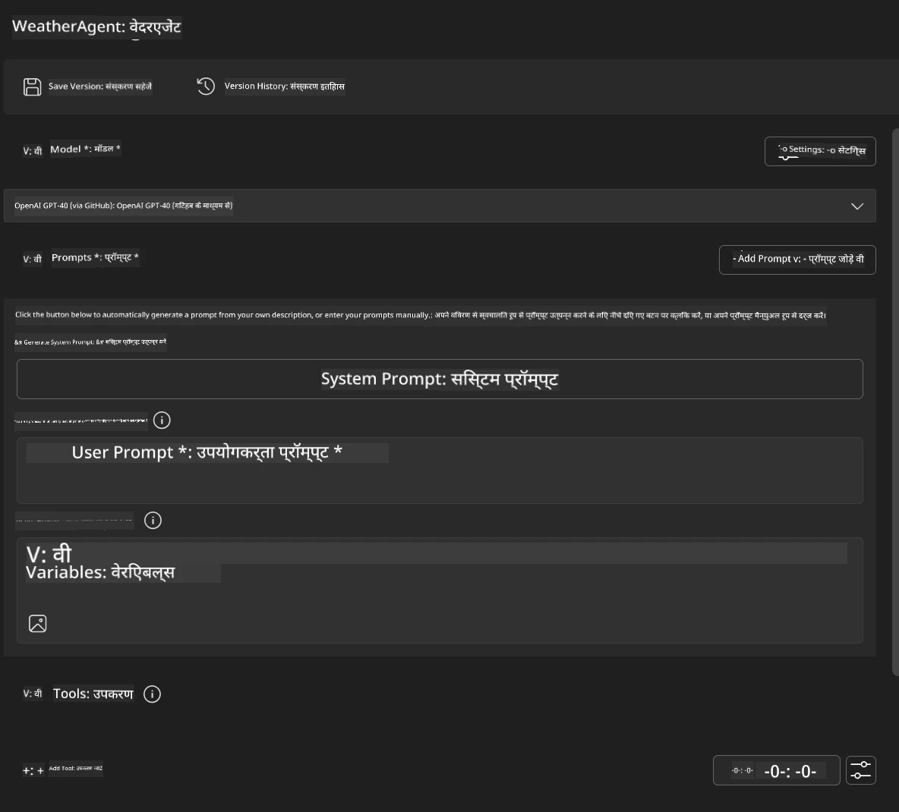
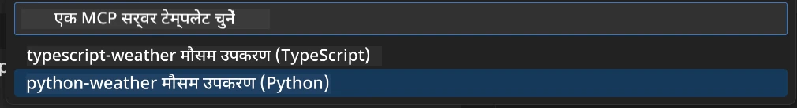
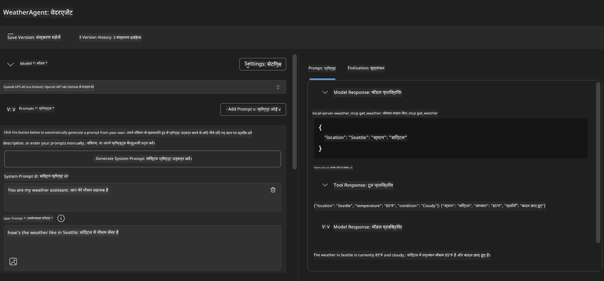
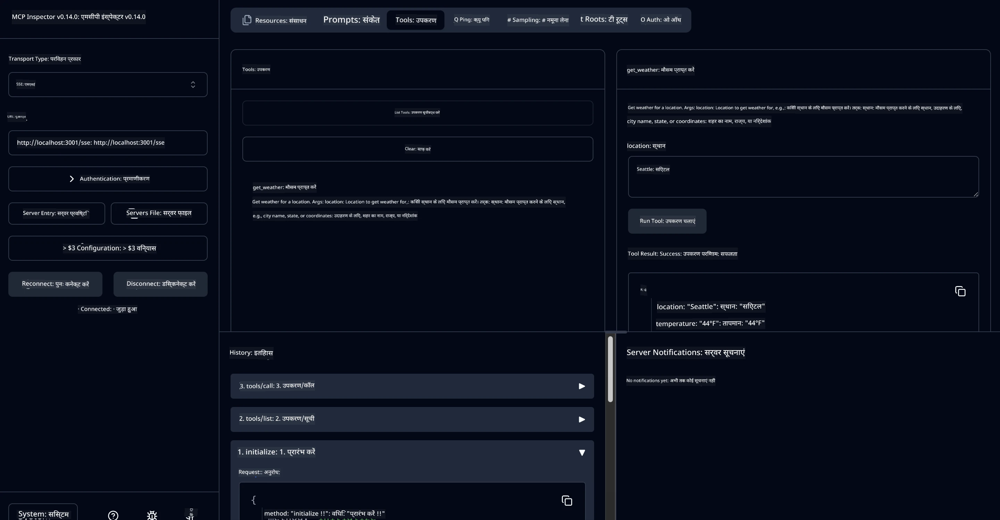

# 🔧 मॉड्यूल 3: Microsoft Foundry Toolkit के साथ उन्नत MCP विकास

> [!NOTE]
> इस लेब में इंस्पेक्टर यूआरएल पर लेगेसी `/sse` एंडपॉइंट का उपयोग होता है और यह पिन्ड MCP SDK `1.9.3` और इंस्पेक्टर `0.14.0` डिपेंडेंसियों को लक्षित करता है। ये वर्तमान `2026-07-28` स्ट्रीमेबल एचटीटीपी उदाहरण नहीं हैं।
> 
> 


## 🎯 सीखने के उद्देश्य

इस लेब के अंत तक, आप सक्षम होंगे:

- ✅ Microsoft Foundry Toolkit का उपयोग कर कस्टम MCP सर्वर बनाना
- ✅ नवीनतम MCP Python SDK (v1.9.3) को कॉन्फ़िगर और उपयोग करना
- ✅ डिबगिंग के लिए MCP इंस्पेक्टर सेट अप और उपयोग करना
- ✅ एजेंट बिल्डर और इंस्पेक्टर दोनों वातावरण में MCP सर्वर डिबग करना
- ✅ उन्नत MCP सर्वर विकास कार्यप्रवाहों को समझना

## 📋 पूर्व आवश्यकताएँ

- लेब 2 (MCP फंडामेंटल्स) पूरा किया हुआ हो
- Microsoft Foundry Toolkit एक्सटेंशन के साथ VS कोड इंस्टॉल हो
- Python 3.10+ पर्यावरण
- इंस्पेक्टर सेटअप के लिए Node.js और npm

## 🏗️ आप क्या बनाएंगे

इस लेब में, आप एक **Weather MCP Server** बनाएंगे जो दिखाता है:
- कस्टम MCP सर्वर कार्यान्वयन
- Microsoft Foundry Toolkit एजेंट बिल्डर के साथ एकीकरण
- पेशेवर डिबगिंग कार्यप्रवाह
- आधुनिक MCP SDK उपयोग पैटर्न

---

## 🔧 कोर कंपोनेंट्स अवलोकन

### 🐍 MCP Python SDK
मॉडल कंटेक्स्ट प्रोटोकॉल पाइथन SDK कस्टम MCP सर्वर बनाने की नींव प्रदान करता है। आप संस्करण 1.9.3 का उपयोग करेंगे जिसमें उन्नत डिबगिंग क्षमताएँ हैं।

### 🔍 MCP Inspector
एक शक्तिशाली डिबगिंग टूल जो प्रदान करता है:
- वास्तविक समय में सर्वर मॉनिटरिंग
- टूल निष्पादन विजुअलाइज़ेशन
- नेटवर्क अनुरोध/प्रतिक्रिया निरीक्षण
- इंटरैक्टिव परीक्षण वातावरण

---

## 📖 चरण-दर-चरण कार्यान्वयन

### चरण 1: Agent Builder में WeatherAgent बनाएँ

1. **Microsoft Foundry Toolkit एक्सटेंशन के जरिए VS कोड में Agent Builder लॉन्च करें**
2. **निम्न कॉन्फ़िगरेशन के साथ नया एजेंट बनाएं:**
   - एजेंट का नाम: `WeatherAgent`



### चरण 2: MCP सर्वर प्रोजेक्ट इनिशियलाइज़ करें

1. **Agent Builder में Tools → Add Tool पर जाएं**
2. **उपलब्ध विकल्पों में से "MCP Server" चुनें**
3. **"Create A new MCP Server" चुनें**
4. **`python-weather` टेम्प्लेट चुनें**
5. **अपने सर्वर का नाम दें:** `weather_mcp`



### चरण 3: प्रोजेक्ट खोलें और जांचें

1. **जनरेट किया गया प्रोजेक्ट VS कोड में खोलें**
2. **प्रोजेक्ट संरचना की समीक्षा करें:**
   ```
   weather_mcp/
   ├── src/
   │   ├── __init__.py
   │   └── server.py
   ├── inspector/
   │   ├── package.json
   │   └── package-lock.json
   ├── .vscode/
   │   ├── launch.json
   │   └── tasks.json
   ├── pyproject.toml
   └── README.md
   ```

### चरण 4: नवीनतम MCP SDK में अपग्रेड करें

> **🔍 क्यों अपग्रेड करें?** हम नवीनतम MCP SDK (v1.9.3) और इंस्पेक्टर सेवा (0.14.0) का उपयोग करना चाहते हैं ताकि बेहतर फीचर्स और डिबगिंग क्षमताएँ मिलें।

#### 4a. पाइथन डिपेंडेंसियों को अपडेट करें

**`pyproject.toml` संपादित करें:** [./code/weather_mcp/pyproject.toml](../../../../10-StreamliningAIWorkflowsBuildingAnMCPServerWithAIToolkit/lab3/code/weather_mcp/pyproject.toml) अपडेट करें


#### 4b. इंस्पेक्टर कॉन्फ़िगरेशन अपडेट करें

**`inspector/package.json` संपादित करें:** [./code/weather_mcp/inspector/package.json](../../../../10-StreamliningAIWorkflowsBuildingAnMCPServerWithAIToolkit/lab3/code/weather_mcp/inspector/package.json) अपडेट करें

#### 4c. इंस्पेक्टर डिपेंडेंसियों को अपडेट करें

**`inspector/package-lock.json` संपादित करें:** [./code/weather_mcp/inspector/package-lock.json](../../../../10-StreamliningAIWorkflowsBuildingAnMCPServerWithAIToolkit/lab3/code/weather_mcp/inspector/package-lock.json) अपडेट करें

> **📝 नोट:** इस फ़ाइल में व्यापक डिपेंडेंसी परिभाषाएँ हैं। नीचे आवश्यक संरचना दी गई है - पूरा कंटेंट सुनिश्चित करता है कि डिपेंडेंसी ठीक से हल हो।


> **⚡ पूर्ण पैकेज लॉक:** पूरा package-lock.json लगभग 3000 पंक्तियों के डिपेंडेंसी परिभाषाओं से भरा है। ऊपर मुख्य संरचना दिखाई गई है - पूर्ण डिपेंडेंसी समाधान के लिए उपलब्ध फ़ाइल का उपयोग करें।

### चरण 5: VS कोड डिबगिंग कॉन्फ़िगरेशन करें

*ध्यान दें: कृपया निर्दिष्ट पथ में फ़ाइल को कॉपी करें ताकि संबंधित स्थानीय फ़ाइल प्रतिस्थापित हो जाए*

#### 5a. लॉन्च कॉन्फ़िगरेशन अपडेट करें

**`.vscode/launch.json` संपादित करें:**

```json
{
  "version": "0.2.0",
  "configurations": [
    {
      "name": "Attach to Local MCP",
      "type": "debugpy",
      "request": "attach",
      "connect": {
        "host": "localhost",
        "port": 5678
      },
      "presentation": {
        "hidden": true
      },
      "internalConsoleOptions": "neverOpen",
      "postDebugTask": "Terminate All Tasks"
    },
    {
      "name": "Launch Inspector (Edge)",
      "type": "msedge",
      "request": "launch",
      "url": "http://localhost:6274?timeout=60000&serverUrl=http://localhost:3001/sse#tools",
      "cascadeTerminateToConfigurations": [
        "Attach to Local MCP"
      ],
      "presentation": {
        "hidden": true
      },
      "internalConsoleOptions": "neverOpen"
    },
    {
      "name": "Launch Inspector (Chrome)",
      "type": "chrome",
      "request": "launch",
      "url": "http://localhost:6274?timeout=60000&serverUrl=http://localhost:3001/sse#tools",
      "cascadeTerminateToConfigurations": [
        "Attach to Local MCP"
      ],
      "presentation": {
        "hidden": true
      },
      "internalConsoleOptions": "neverOpen"
    }
  ],
  "compounds": [
    {
      "name": "Debug in Agent Builder",
      "configurations": [
        "Attach to Local MCP"
      ],
      "preLaunchTask": "Open Agent Builder",
    },
    {
      "name": "Debug in Inspector (Edge)",
      "configurations": [
        "Launch Inspector (Edge)",
        "Attach to Local MCP"
      ],
      "preLaunchTask": "Start MCP Inspector",
      "stopAll": true
    },
    {
      "name": "Debug in Inspector (Chrome)",
      "configurations": [
        "Launch Inspector (Chrome)",
        "Attach to Local MCP"
      ],
      "preLaunchTask": "Start MCP Inspector",
      "stopAll": true
    }
  ]
}
```

**`.vscode/tasks.json` संपादित करें:**

```
{
  "version": "2.0.0",
  "tasks": [
    {
      "label": "Start MCP Server",
      "type": "shell",
      "command": "python -m debugpy --listen 127.0.0.1:5678 src/__init__.py sse",
      "isBackground": true,
      "options": {
        "cwd": "${workspaceFolder}",
        "env": {
          "PORT": "3001"
        }
      },
      "problemMatcher": {
        "pattern": [
          {
            "regexp": "^.*$",
            "file": 0,
            "location": 1,
            "message": 2
          }
        ],
        "background": {
          "activeOnStart": true,
          "beginsPattern": ".*",
          "endsPattern": "Application startup complete|running"
        }
      }
    },
    {
      "label": "Start MCP Inspector",
      "type": "shell",
      "command": "npm run dev:inspector",
      "isBackground": true,
      "options": {
        "cwd": "${workspaceFolder}/inspector",
        "env": {
          "CLIENT_PORT": "6274",
          "SERVER_PORT": "6277",
        }
      },
      "problemMatcher": {
        "pattern": [
          {
            "regexp": "^.*$",
            "file": 0,
            "location": 1,
            "message": 2
          }
        ],
        "background": {
          "activeOnStart": true,
          "beginsPattern": "Starting MCP inspector",
          "endsPattern": "Proxy server listening on port"
        }
      },
      "dependsOn": [
        "Start MCP Server"
      ]
    },
    {
      "label": "Open Agent Builder",
      "type": "shell",
      "command": "echo ${input:openAgentBuilder}",
      "presentation": {
        "reveal": "never"
      },
      "dependsOn": [
        "Start MCP Server"
      ],
    },
    {
      "label": "Terminate All Tasks",
      "command": "echo ${input:terminate}",
      "type": "shell",
      "problemMatcher": []
    }
  ],
  "inputs": [
    {
      "id": "openAgentBuilder",
      "type": "command",
      "command": "ai-mlstudio.agentBuilder",
      "args": {
        "initialMCPs": [ "local-server-weather_mcp" ],
        "triggeredFrom": "vsc-tasks"
      }
    },
    {
      "id": "terminate",
      "type": "command",
      "command": "workbench.action.tasks.terminate",
      "args": "terminateAll"
    }
  ]
}
```


---

## 🚀 अपना MCP सर्वर चलाना और टेस्ट करना

### चरण 6: डिपेंडेंसियों को इंस्टॉल करें

कॉन्फ़िगरेशन परिवर्तन करने के बाद, निम्नलिखित कमांड चलाएं:

**पाइथन डिपेंडेंसियाँ इंस्टॉल करें:**
```bash
uv sync
```

**इंस्पेक्टर डिपेंडेंसियाँ इंस्टॉल करें:**
```bash
cd inspector
npm install
```

### चरण 7: Agent Builder के साथ डिबग करें

1. **F5 दबाएं** या **"Debug in Agent Builder"** कॉन्फ़िगरेशन का उपयोग करें
2. **डिबग पैनल से कंपाउंड कॉन्फ़िगरेशन चुनें**
3. **सर्वर के शुरू होने और Agent Builder के खुलने की प्रतीक्षा करें**
4. **अपना weather MCP सर्वर प्राकृतिक भाषा क्वेरीज़ से टेस्ट करें**

इनपुट प्रॉम्प्ट इस प्रकार

SYSTEM_PROMPT

```
You are my weather assistant
```

USER_PROMPT

```
How's the weather like in Seattle
```



### चरण 8: MCP Inspector के साथ डिबग करें

1. **"Debug in Inspector"** कॉन्फ़िगरेशन (Edge या Chrome) का उपयोग करें
2. **Inspector इंटरफ़ेस खोलें** `http://localhost:6274` पर
3. **इंटरैक्टिव परीक्षण वातावरण का अन्वेषण करें:**
   - उपलब्ध टूल देखें
   - टूल निष्पादन का परीक्षण करें
   - नेटवर्क अनुरोधों की निगरानी करें
   - सर्वर प्रतिक्रियाओं को डिबग करें



---

## 🎯 मुख्य सीखने के परिणाम

इस लेब को पूरा करने पर, आप:

- [x] **Microsoft Foundry Toolkit टेम्प्लेट्स का उपयोग करके कस्टम MCP सर्वर बनाए**
- [x] **बेहतर फ़ंक्शन के लिए नवीनतम MCP SDK** (v1.9.3) में अपग्रेड किया
- [x] **Agent Builder और Inspector दोनों के लिए पेशेवर डिबगिंग कार्यप्रवाह कॉन्फ़िगर किए**
- [x] **इंटरैक्टिव सर्वर परीक्षण के लिए MCP Inspector सेट अप किया**
- [x] **MCP विकास के लिए VS कोड डिबगिंग कॉन्फिगरेशन में निपुणता हासिल की**

## 🔧 उन्नत विशेषताएं एक्सप्लोर की गईं

| विशेषता | विवरण | उपयोग मामला |
|---------|-------------|----------|
| **MCP Python SDK v1.9.3** | नवीनतम प्रोटोकॉल कार्यान्वयन | आधुनिक सर्वर विकास |
| **MCP Inspector 0.14.0** | इंटरैक्टिव डिबगिंग टूल | वास्तविक समय सर्वर परीक्षण |
| **VS Code डिबगिंग** | एकीकृत विकास वातावरण | पेशेवर डिबगिंग कार्यप्रवाह |
| **Agent Builder एकीकरण** | Microsoft Foundry Toolkit से प्रत्यक्ष कनेक्शन | एंड-टू-एंड एजेंट परीक्षण |

## 📚 अतिरिक्त संसाधन

- [MCP Python SDK डाक्यूमेंटेशन](https://modelcontextprotocol.io/docs/sdk/python)
- [Microsoft Foundry Toolkit एक्सटेंशन गाइड](https://code.visualstudio.com/docs/ai/ai-toolkit)
- [VS Code डिबगिंग डाक्यूमेंटेशन](https://code.visualstudio.com/docs/editor/debugging)
- [Model Context Protocol विनिर्देशन](https://modelcontextprotocol.io/docs/concepts/architecture)

---

**🎉 बधाई हो!** आपने सफलतापूर्वक लेब 3 पूरा कर लिया है और अब आप कस्टम MCP सर्वर बना सकते हैं, डिबग कर सकते हैं, और पेशेवर विकास कार्यप्रवाहों का उपयोग करके उन्हें डिप्लॉय कर सकते हैं।

### 🔜 अगले मॉड्यूल पर जारी रखें

क्या आप अपने MCP कौशल को वास्तविक विकास कार्यप्रवाह पर लागू करने के लिए तैयार हैं? जारी रखें **[मॉड्यूल 4: व्यावहारिक MCP विकास - कस्टम GitHub क्लोन सर्वर](../lab4/README.md)** जहाँ आप:
- एक प्रोडक्शन-तैयार MCP सर्वर बनाएंगे जो GitHub रिपॉजिटरी संचालन को स्वचालित करता है
- MCP के माध्यम से GitHub रिपॉजिटरी क्लोनिंग कार्यक्षमता लागू करेंगे
- VS कोड और GitHub Copilot एजेंट मोड के साथ कस्टम MCP सर्वर एकीकृत करेंगे
- प्रोडक्शन वातावरण में कस्टम MCP सर्वरों का परीक्षण और डिप्लॉय करेंगे
- डेवलपर्स के लिए व्यावहारिक वर्कफ़्लो ऑटोमेशन सीखेंगे

---

<!-- CO-OP TRANSLATOR DISCLAIMER START -->
**अस्वीकरण**:
इस दस्तावेज़ का अनुवाद AI अनुवाद सेवा [Co-op Translator](https://github.com/Azure/co-op-translator) का उपयोग करके किया गया है। जबकि हम सटीकता के लिए प्रयास करते हैं, कृपया ध्यान दें कि स्वचालित अनुवादों में त्रुटियाँ या अशुद्धियाँ हो सकती हैं। मूल दस्तावेज़ अपनी मूल भाषा में ही प्रामाणिक स्रोत माना जाना चाहिए। महत्वपूर्ण जानकारी के लिए, पेशेवर मानव अनुवाद की सिफारिश की जाती है। इस अनुवाद के उपयोग से उत्पन्न किसी भी गलतफहमी या गलत व्याख्या के लिए हम उत्तरदायी नहीं हैं।
<!-- CO-OP TRANSLATOR DISCLAIMER END -->