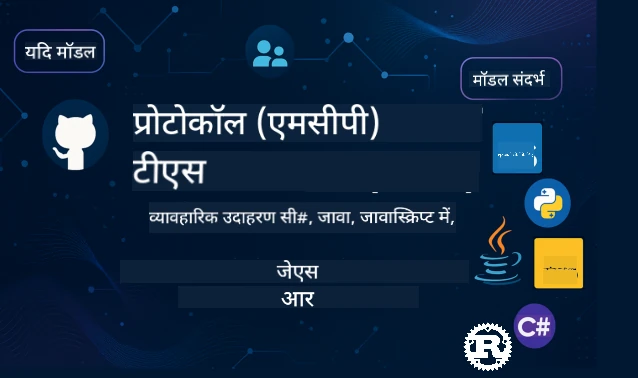

<!--
CO_OP_TRANSLATOR_METADATA:
{
  "original_hash": "35240f904db8c08d6198f6f15767d218",
  "translation_date": "2026-01-15T03:45:54+00:00",
  "source_file": "README.md",
  "language_code": "hi"
}
-->
 

[](https://GitHub.com/microsoft/mcp-for-beginners/graphs/contributors)
[](https://GitHub.com/microsoft/mcp-for-beginners/issues)
[](https://GitHub.com/microsoft/mcp-for-beginners/pulls)
[](http://makeapullrequest.com)

[](https://GitHub.com/microsoft/mcp-for-beginners/watchers)
[](https://GitHub.com/microsoft/mcp-for-beginners/fork)
[](https://GitHub.com/microsoft/mcp-for-beginners/stargazers)


[](https://discord.gg/nTYy5BXMWG)

इन संसाधनों का उपयोग करना शुरू करने के लिए ये चरण अपनाएँ:
1. **रिपॉजिटरी को फोर्क करें**: क्लिक करें [](https://GitHub.com/microsoft/mcp-for-beginners/fork)
2. **रिपॉजिटरी क्लोन करें**:   `git clone https://github.com/microsoft/mcp-for-beginners.git`
3. **इससे जुड़ें** [](https://discord.gg/nTYy5BXMWG)


### 🌐 बहुभाषी समर्थन

#### GitHub Action के माध्यम से समर्थित (स्वचालित और हमेशा अपडेट रहता है)

<!-- CO-OP TRANSLATOR LANGUAGES TABLE START -->
[Arabic](../ar/README.md) | [Bengali](../bn/README.md) | [Bulgarian](../bg/README.md) | [Burmese (Myanmar)](../my/README.md) | [Chinese (Simplified)](../zh/README.md) | [Chinese (Traditional, Hong Kong)](../hk/README.md) | [Chinese (Traditional, Macau)](../mo/README.md) | [Chinese (Traditional, Taiwan)](../tw/README.md) | [Croatian](../hr/README.md) | [Czech](../cs/README.md) | [Danish](../da/README.md) | [Dutch](../nl/README.md) | [Estonian](../et/README.md) | [Finnish](../fi/README.md) | [French](../fr/README.md) | [German](../de/README.md) | [Greek](../el/README.md) | [Hebrew](../he/README.md) | [Hindi](./README.md) | [Hungarian](../hu/README.md) | [Indonesian](../id/README.md) | [Italian](../it/README.md) | [Japanese](../ja/README.md) | [Kannada](../kn/README.md) | [Korean](../ko/README.md) | [Lithuanian](../lt/README.md) | [Malay](../ms/README.md) | [Malayalam](../ml/README.md) | [Marathi](../mr/README.md) | [Nepali](../ne/README.md) | [Nigerian Pidgin](../pcm/README.md) | [Norwegian](../no/README.md) | [Persian (Farsi)](../fa/README.md) | [Polish](../pl/README.md) | [Portuguese (Brazil)](../br/README.md) | [Portuguese (Portugal)](../pt/README.md) | [Punjabi (Gurmukhi)](../pa/README.md) | [Romanian](../ro/README.md) | [Russian](../ru/README.md) | [Serbian (Cyrillic)](../sr/README.md) | [Slovak](../sk/README.md) | [Slovenian](../sl/README.md) | [Spanish](../es/README.md) | [Swahili](../sw/README.md) | [Swedish](../sv/README.md) | [Tagalog (Filipino)](../tl/README.md) | [Tamil](../ta/README.md) | [Telugu](../te/README.md) | [Thai](../th/README.md) | [Turkish](../tr/README.md) | [Ukrainian](../uk/README.md) | [Urdu](../ur/README.md) | [Vietnamese](../vi/README.md)

> **लोकल रूप से क्लोन करना पसंद करते हैं?**

> इस रिपॉजिटरी में 50+ भाषा अनुवाद शामिल हैं जो डाउनलोड आकार को काफी बढ़ा देते हैं। अनुवाद के बिना क्लोन करने के लिए sparse checkout का उपयोग करें:
> ```bash
> git clone --filter=blob:none --sparse https://github.com/microsoft/mcp-for-beginners.git
> cd mcp-for-beginners
> git sparse-checkout set --no-cone '/*' '!translations' '!translated_images'
> ```
> यह आपको पूरे कोर्स के लिए आवश्यक सब कुछ तेज़ डाउनलोड के साथ देता है।
<!-- CO-OP TRANSLATOR LANGUAGES TABLE END -->

# 🚀 मॉडल कॉन्टेक्स्ट प्रोटोकॉल (MCP) शुरुआत के लिए करिकुलम

## **C#, Java, JavaScript, Rust, Python, और TypeScript में व्यावहारिक कोड उदाहरणों के साथ MCP सीखें**

## 🧠 मॉडल कॉन्टेक्स्ट प्रोटोकॉल करिकुलम का अवलोकन
मॉडल कॉन्टेक्स्ट प्रोटोकॉल में आपका स्वागत है! अगर आपने कभी सोचा है कि एआई एप्लिकेशन विभिन्न टूल्स और सेवाओं के साथ कैसे संवाद करते हैं, तो आप उस उत्कृष्ट समाधान की खोज करने वाले हैं जो डेवलपर्स को बुद्धिमान सिस्टम बनाने का तरीका बदल रहा है।

MCP को AI एप्लिकेशन के लिए एक सार्वभौमिक अनुवादक के रूप में सोचें — ठीक वैसे ही जैसे यूएसबी पोर्ट आपको किसी भी डिवाइस को अपने कंप्यूटर से जोड़ने देते हैं, वैसे ही MCP AI मॉडल्स को किसी भी टूल या सेवा के साथ मानकीकृत तरीके से कनेक्ट होने देता है। चाहे आप अपना पहला चैटबॉट बना रहे हों या जटिल AI वर्कफ़्लोज़ पर काम कर रहे हों, MCP को समझना आपको अधिक सक्षम और लचीली एप्लिकेशन बनाने की शक्ति देगा।

यह करिकुलम आपकी सीखने की यात्रा के लिए धैर्य और सावधानी से डिज़ाइन किया गया है। हम सरल अवधारणाओं से शुरू करेंगे जिन्हें आप पहले से समझते हैं, और अपनी पसंदीदा प्रोग्रामिंग भाषा में व्यावहारिक अभ्यास के माध्यम से आपका कौशल धीरे-धीरे विकसित करेंगे। हर चरण में स्पष्ट व्याख्याएं, व्यावहारिक उदाहरण, और बहुत समर्थन शामिल है।

जब आप इस यात्रा को पूरा कर लेंगे, तो आपके पास अपना स्वयं का MCP सर्वर बनाने, लोकप्रिय AI प्लेटफ़ॉर्म्स के साथ उन्हें एकीकृत करने, और यह समझने का आत्मविश्वास होगा कि यह तकनीक AI विकास के भविष्य को कैसे नया आकार दे रही है। चलिए इस रोमांचक साहसिक कार्य को साथ में शुरू करते हैं!

### आधिकारिक प्रलेखन और विनिर्देश

जैसे-जैसे आपकी समझ बढ़ेगी, ये संसाधन और भी मूल्यवान हो जाएंगे, लेकिन तुरंत सब कुछ पढ़ने का दबाव न लें। सबसे पहले उन क्षेत्रों से शुरू करें जो आपकी रुचि के सबसे अधिक हैं!
- 📘 [MCP प्रलेखन](https://modelcontextprotocol.io/) – यह आपका स्टेप-बाय-स्टेप ट्यूटोरियल और उपयोगकर्ता मार्गदर्शिका का स्रोत है। प्रलेखन शुरुआती लोगों के लिए लिखा गया है, जिसमें स्पष्ट उदाहरण होते हैं जिन्हें आप अपनी गति से अनुसरण कर सकते हैं।
- 📜 [MCP विनिर्देश](https://modelcontextprotocol.io/docs/) – इसे आपका व्यापक संदर्भ मैनुअल मानें। करिकुलम के दौरान, आप विशिष्ट विवरण देखने और उन्नत सुविधाओं की खोज करने के लिए यहां बार-बार लौटेंगे।
- 📜 [मूल MCP विनिर्देश](https://modelcontextprotocol.io/specification/versioning) – इसमें अतिरिक्त तकनीकी विवरण होते हैं जो उन्नत कार्यान्वयन के लिए सहायक हो सकते हैं। जब आवश्यकता हो, इसे देखें, लेकिन शुरुआत में इसके बारे में चिंता न करें।
- 🧑‍💻 [MCP GitHub रिपॉजिटरी](https://github.com/modelcontextprotocol) – यहाँ आपको कई प्रोग्रामिंग भाषाओं में SDK, टूल्स और कोड उदाहरण मिलेंगे। यह व्यावहारिक उदाहरणों और तैयार-से-उपयोग घटकों का खजाना है।
- 🌐 [MCP समुदाय](https://github.com/orgs/modelcontextprotocol/discussions) – अन्य शिक्षार्थियों और अनुभवी डेवलपर्स के साथ MCP पर चर्चा में शामिल हों। यह एक समर्थनकारी समुदाय है जहाँ प्रश्न स्वागत योग्य हैं और ज्ञान स्वतंत्र रूप से साझा किया जाता है।

## सीखने के उद्देश्य

इस करिकुलम को पूरा करने पर, आप अपनी नई क्षमताओं के प्रति आत्मविश्वास और उत्साहित महसूस करेंगे। आप ये हासिल करेंगे:

• **MCP के मूल तत्व समझें**: आप समझेंगे कि मॉडल कॉन्टेक्स्ट प्रोटोकॉल क्या है और क्यों यह AI एप्लिकेशन के सहकार्य के तरीके में क्रांति ला रहा है, उन उदाहरणों और उपमाओं के साथ जो सहज रूप से समझ में आते हैं।

• **अपना पहला MCP सर्वर बनाएं**: आप अपनी पसंदीदा प्रोग्रामिंग भाषा में काम करने वाला MCP सर्वर बनाएंगे, सरल उदाहरणों से शुरू करके धीरे-धीरे अपने कौशल को बढ़ाएंगे।

• **AI मॉडल्स को वास्तविक टूल्स से कनेक्ट करें**: आप जानेंगे कि AI मॉडल्स और वास्तविक सेवाओं के बीच पुल कैसे बनाया जाता है, जिससे आपके एप्लिकेशन को शक्तिशाली नई क्षमताएं मिलती हैं।

• **सुरक्षा के सर्वोत्तम कार्यान्वयन करें**: आप समझेंगे कि अपने MCP कार्यान्वयन को सुरक्षित रखने के लिए कैसे काम करें, जिससे आपके एप्लिकेशन और उपयोगकर्ता दोनों की रक्षा हो सके।

• **आत्मविश्वास के साथ तैनाती करें**: आप जानेंगे कि अपने MCP प्रोजेक्ट्स को विकास से उत्पादन तक कैसे ले जाएं, साथ ही व्यावहारिक तैनाती रणनीतियां जो असली दुनिया में काम करती हैं।

• **MCP समुदाय में शामिल हों**: आप उन डेवलपर्स के बढ़ते समुदाय का हिस्सा बनेंगे जो AI एप्लिकेशन विकास के भविष्य को आकार दे रहे हैं।

## आवश्यक पृष्ठभूमि

MCP के विशिष्ट विषयों में जाने से पहले, आइए सुनिश्चित करें कि आप कुछ बुनियादी अवधारणाओं में सहज हैं। चिंता न करें यदि आप इन क्षेत्रों के विशेषज्ञ नहीं हैं — हम आपको ज़रूरी सब कुछ समझाएंगे!

### प्रोटोकॉल को समझना (नींव)

प्रोटोकॉल को एक बातचीत के नियमों के रूप में सोचें। जब आप अपने मित्र को कॉल करते हैं, तो आप दोनों जानते हैं कि जब जवाब देते हैं तो "हैलो" कहें, अपनी बारी का इंतजार करें, और समाप्ति पर "अलविदा" कहें। कंप्यूटर प्रोग्राम्स को भी प्रभावी संवाद के लिए ऐसे ही नियमों की जरूरत होती है।

MCP एक प्रोटोकॉल है — एक सहमति से तय नियमों का सेट जो AI मॉडल्स और एप्लिकेशन को टूल्स और सेवाओं के साथ उत्पादक "बातचीत" करने में मदद करता है। जैसे बातचीत के नियम मानवीय संवाद को सरल बनाते हैं, वैसे ही MCP AI एप्लिकेशन संवाद को अधिक विश्वसनीय और शक्तिशाली बनाता है।

### क्लाइंट-सर्वर संबंध (प्रोग्राम कैसे साथ काम करते हैं)

आप रोजाना क्लाइंट-सर्वर संबंधों का उपयोग करते हैं! जब आप वेब ब्राउजर (क्लाइंट) से किसी वेबसाइट पर जाते हैं, तो आप वेब सर्वर से जुड़ते हैं जो आपको पेज सामग्री भेजता है। ब्राउजर जानता है सूचना कैसे मांगनी है, और सर्वर जानता है कैसे जवाब देना है।

MCP में, एक समान संबंध होता है: AI मॉडल्स क्लाइंट के रूप में काम करते हैं जो जानकारी या कार्य मांगते हैं, जबकि MCP सर्वर वे क्षमताएं प्रदान करता है। यह ऐसा है जैसे AI का एक सहायक (सर्वर) है जिसे वह विशिष्ट कार्य करने के लिए कह सकता है।

### मानकीकरण क्यों महत्वपूर्ण है (चीजों को साथ काम करना)

कल्पना करें कि अगर हर कार निर्माता अलग-अलग आकार के गैस पंप उपयोग करता — आपको हर कार के लिए अलग एडेप्टर चाहिए होगा! मानकीकरण का मतलब है सामान्य तरीकों पर सहमति बनाना ताकि चीजें आसानी से साथ काम करें।

MCP AI एप्लिकेशन के लिए यह मानकीकरण प्रदान करता है। हर AI मॉडल को हर टूल के साथ कस्टम कोड लिखने की जगह, MCP एक सार्वभौमिक तरीका बनाता है जिससे वे संवाद कर सकते हैं। इसका मतलब है कि डेवलपर्स एक बार टूल बना सकते हैं और यह कई अलग AI सिस्टम्स के साथ काम करेगा।

## 🧭 आपकी सीखने की राह का अवलोकन

आपकी MCP यात्रा को धीरे-धीरे आत्मविश्वास और कौशल विकसित करने के लिए सावधानीपूर्वक संरचित किया गया है। प्रत्येक चरण नई अवधारणाएँ प्रस्तुत करता है जबकि आपने जो कुछ सीखा है उसे मजबूत करता है।

### 🌱 नींव चरण: मूल बातें समझना (मॉड्यूल 0-2)

यहां से आपकी यात्रा शुरू होती है! हम आपको MCP अवधारणाओं से परिचित करवाएंगे, परिचित उपमाओं और सरल उदाहरणों के माध्यम से। आप समझेंगे कि MCP क्या है, यह क्यों मौजूद है, और AI विकास की बड़ी दुनिया में इसकी भूमिका क्या है।

• **मॉड्यूल 0 - MCP परिचय**: हम शुरुआत करेंगे यह जानने से कि MCP क्या है और आधुनिक AI एप्लिकेशन के लिए यह क्यों महत्वपूर्ण है। आप MCP के वास्तविक उदाहरण देखेंगे और समझेंगे कि यह डेवलपर्स के सामने आने वाली सामान्य समस्याओं को कैसे हल करता है।

• **मॉड्यूल 1 - मुख्य अवधारणाओं की व्याख्या**: यहाँ आप MCP के आवश्यक आधारभूत तत्व सीखेंगे। हम बहुत सारी उपमाओं और दृश्य उदाहरणों का उपयोग करेंगे ताकि ये अवधारणाएँ सहज और स्पष्ट लगें।

• **मॉड्यूल 2 - MCP में सुरक्षा**: सुरक्षा intimidating लग सकती है, लेकिन हम दिखाएंगे कि MCP में निहित सुरक्षा सुविधाएं कैसे हैं और आपको सर्वोत्तम प्रथाएँ सिखाएंगे जो आपके एप्लिकेशन की शुरुआत से सुरक्षा करती हैं।

### 🔨 निर्माण चरण: अपने पहले कार्यान्वयन बनाना (मॉड्यूल 3)

अब असली मज़ा शुरू होता है! आप व्यावहारिक अनुभव प्राप्त करेंगे वास्तविक MCP सर्वर्स और क्लाइंट्स बनाकर। चिंता न करें - हम सरल से शुरू करेंगे और हर कदम पर आपका मार्गदर्शन करेंगे।

इस मॉड्यूल में कई व्यावहारिक गाइड शामिल हैं जो आपको अपनी पसंदीदा प्रोग्रामिंग भाषा में अभ्यास करने देते हैं। आप अपना पहला सर्वर बनाएंगे, उसके साथ कनेक्ट करने के लिए क्लाइंट बनाएंगे, और VS Code जैसे लोकप्रिय विकास टूल्स के साथ भी एकीकृत करेंगे।

प्रत्येक गाइड में पूर्ण कोड उदाहरण, समस्या निवारण सुझाव, और यह समझाया गया है कि हमने विशिष्ट डिजाइन विकल्प क्यों चुने। इस चरण के अंत तक, आपके पास कार्यशील MCP कार्यान्वयन होंगे जिन पर आप गर्व कर सकेंगे!
### 🚀 विकास चरण: उन्नत अवधारणाएँ और वास्तविक दुनिया का अनुप्रयोग (मॉड्यूल 4-5)

मूल बातें सीख लेने के बाद, आप अधिक परिष्कृत MCP फीचर्स को खोजने के लिए तैयार हैं। हम व्यावहारिक कार्यान्वयन रणनीतियाँ, डिबगिंग तकनीकें, और मल्टी-मॉडल AI एकीकरण जैसे उन्नत विषयों को कवर करेंगे।

आप यह भी सीखेंगे कि अपनी MCP कार्यान्वयन को उत्पादन उपयोग के लिए कैसे स्केल करें और Azure जैसे क्लाउड प्लेटफ़ॉर्म के साथ एकीकृत करें। ये मॉड्यूल आपको वास्तविक दुनिया की मांगों को संभालने वाले MCP समाधान बनाने के लिए तैयार करते हैं।

### 🌟 महारत चरण: समुदाय और विशेषज्ञता (मॉड्यूल 6-11)

अंतिम चरण MCP समुदाय में शामिल होने और उन क्षेत्रों में विशेषज्ञता विकसित करने पर केंद्रित है जिनमें आपकी अधिक रुचि है। आप सीखेंगे कि कैसे ओपन-सोर्स MCP परियोजनाओं में योगदान दें, उन्नत प्रमाणीकरण पैटर्न लागू करें, और व्यापक डेटाबेस-इंटीग्रेटेड समाधान बनाएं।

मॉड्यूल 11 विशेष उल्लेख योग्य है - यह एक पूरा 13-प्रयोगशाला व्यावहारिक सीखने का रास्ता है जो आपको PostgreSQL एकीकरण के साथ उत्पादन-तैयार MCP सर्वर बनाने सिखाता है। यह एक कैपस्टोन प्रोजेक्ट की तरह है जो आपने जो कुछ भी सीखा है उसे एक साथ लाता है!

### 📚 पूर्ण पाठ्यक्रम संरचना

| मॉड्यूल | विषय | विवरण | लिंक |
|--------|-------|-------------|------|
| **मॉड्यूल 1-3: मूल बातें** | | | |
| 00 | MCP का परिचय | मॉडल संदर्भ प्रोटोकॉल का अवलोकन और AI पाइपलाइनों में इसका महत्व | [और पढ़ें](./00-Introduction/README.md) |
| 01 | कोर अवधारणाएँ समझाई गईं | कोर MCP अवधारणाओं का गहन अन्वेषण | [और पढ़ें](./01-CoreConcepts/README.md) |
| 02 | MCP में सुरक्षा | सुरक्षा खतरों और सर्वोत्तम प्रथाओं | [और पढ़ें](./02-Security/README.md) |
| 03 | MCP के साथ शुरुआत | पर्यावरण सेटअप, मूल सर्वर/क्लाइंट, एकीकरण | [और पढ़ें](./03-GettingStarted/README.md) |
| **मॉड्यूल 3: अपना पहला सर्वर और क्लाइंट बनाना** | | | |
| 3.1 | पहला सर्वर | अपना पहला MCP सर्वर बनाएं | [मार्गदर्शिका](./03-GettingStarted/01-first-server/README.md) |
| 3.2 | पहला क्लाइंट | एक मूल MCP क्लाइंट विकसित करें | [मार्गदर्शिका](./03-GettingStarted/02-client/README.md) |
| 3.3 | LLM के साथ क्लाइंट | बड़े भाषा मॉडल को एकीकृत करें | [मार्गदर्शिका](./03-GettingStarted/03-llm-client/README.md) |
| 3.4 | VS कोड एकीकरण | VS कोड में MCP सर्वरों का उपयोग करें | [मार्गदर्शिका](./03-GettingStarted/04-vscode/README.md) |
| 3.5 | stdio सर्वर | stdio ट्रांसपोर्ट का उपयोग करके सर्वर बनाएं | [मार्गदर्शिका](./03-GettingStarted/05-stdio-server/README.md) |
| 3.6 | HTTP स्ट्रीमिंग | MCP में HTTP स्ट्रीमिंग लागू करें | [मार्गदर्शिका](./03-GettingStarted/06-http-streaming/README.md) |
| 3.7 | AI टूलकिट | MCP के साथ AI टूलकिट का उपयोग करें | [मार्गदर्शिका](./03-GettingStarted/07-aitk/README.md) |
| 3.8 | परीक्षण | अपने MCP सर्वर कार्यान्वयन का परीक्षण करें | [मार्गदर्शिका](./03-GettingStarted/08-testing/README.md) |
| 3.9 | तैनाती | MCP सर्वरों को उत्पादन के लिए तैनात करें | [मार्गदर्शिका](./03-GettingStarted/09-deployment/README.md) |
| 3.10 | उन्नत सर्वर उपयोग | उन्नत फीचर उपयोग और बेहतर वास्तुकला के लिए उन्नत सर्वरों का उपयोग करें | [मार्गदर्शिका](./03-GettingStarted/10-advanced/README.md) |
| 3.11 | सरल प्रमाणीकरण | शुरुआत से आपको प्रमाणीकरण और RBAC दिखाने वाला अध्याय | [मार्गदर्शिका](./03-GettingStarted/11-simple-auth/README.md) |
| **मॉड्यूल 4-5: व्यावहारिक और उन्नत** | | | |
| 04 | व्यावहारिक कार्यान्वयन | SDKs, डिबगिंग, परीक्षण, पुन: उपयोग योग्य प्रॉम्प्ट टेम्पलेट्स | [और पढ़ें](./04-PracticalImplementation/README.md) |
| 05 | MCP में उन्नत विषय | मल्टी-मॉडल AI, स्केलिंग, उद्यम उपयोग | [और पढ़ें](./05-AdvancedTopics/README.md) |
| 5.1 | Azure एकीकरण | Azure के साथ MCP एकीकरण | [मार्गदर्शिका](./05-AdvancedTopics/mcp-integration/README.md) |
| 5.2 | बहु-मॉडालिटी | कई प्रकार की मोडैलिटी के साथ कार्य | [मार्गदर्शिका](./05-AdvancedTopics/mcp-multi-modality/README.md) |
| 5.3 | OAuth2 डेमो | OAuth2 प्रमाणीकरण लागू करें | [मार्गदर्शिका](./05-AdvancedTopics/mcp-oauth2-demo/README.md) |
| 5.4 | रूट संदर्भ | रूट संदर्भों को समझें और लागू करें | [मार्गदर्शिका](./05-AdvancedTopics/mcp-root-contexts/README.md) |
| 5.5 | रूटिंग | MCP रूटिंग रणनीतियाँ | [मार्गदर्शिका](./05-AdvancedTopics/mcp-routing/README.md) |
| 5.6 | सैंपलिंग | MCP में सैंपलिंग तकनीकें | [मार्गदर्शिका](./05-AdvancedTopics/mcp-sampling/README.md) |
| 5.7 | स्केलिंग | MCP कार्यान्वयन स्केल करें | [मार्गदर्शिका](./05-AdvancedTopics/mcp-scaling/README.md) |
| 5.8 | सुरक्षा | उन्नत सुरक्षा विचार | [मार्गदर्शिका](./05-AdvancedTopics/mcp-security/README.md) |
| 5.9 | वेब खोज | वेब खोज क्षमताओं को लागू करें | [मार्गदर्शिका](./05-AdvancedTopics/web-search-mcp/README.md) |
| 5.10 | रियलटाइम स्ट्रीमिंग | रियलटाइम स्ट्रीमिंग कार्यक्षमता बनाएं | [मार्गदर्शिका](./05-AdvancedTopics/mcp-realtimestreaming/README.md) |
| 5.11 | रियलटाइम खोज | रियलटाइम खोज लागू करें | [मार्गदर्शिका](./05-AdvancedTopics/mcp-realtimesearch/README.md) |
| 5.12 | Entra ID प्रमाणीकरण | Microsoft Entra ID के साथ प्रमाणीकरण | [मार्गदर्शिका](./05-AdvancedTopics/mcp-security-entra/README.md) |
| 5.13 | Foundry एकीकरण | Azure AI Foundry के साथ एकीकृत करें | [मार्गदर्शिका](./05-AdvancedTopics/mcp-foundry-agent-integration/README.md) |
| 5.14 | संदर्भ अभियांत्रिकी | प्रभावी संदर्भ अभियांत्रिकी के लिए तकनीकें | [मार्गदर्शिका](./05-AdvancedTopics/mcp-contextengineering/README.md) |
| 5.15 | MCP कस्टम ट्रांसपोर्ट | कस्टम ट्रांसपोर्ट कार्यान्वयन | [मार्गदर्शिका](./05-AdvancedTopics/mcp-transport/README.md) |
| **मॉड्यूल 6-10: समुदाय और सर्वोत्तम प्रथाएँ** | | | |
| 06 | समुदाय योगदान | MCP इकोसिस्टम में योगदान कैसे करें | [मार्गदर्शिका](./06-CommunityContributions/README.md) |
| 07 | प्रारंभिक गोद लेने से अंतर्दृष्टि | वास्तविक दुनिया के कार्यान्वयन कहानियाँ | [मार्गदर्शिका](./07-LessonsFromEarlyAdoption/README.md) |
| 08 | MCP के लिए सर्वोत्तम प्रथाएँ | प्रदर्शन, दोष-सहिष्णुता, लचीलापन | [मार्गदर्शिका](./08-BestPractices/README.md) |
| 09 | MCP केस स्टडीज | व्यावहारिक कार्यान्वयन उदाहरण | [मार्गदर्शिका](./09-CaseStudy/README.md) |
| 10 | व्यावहारिक कार्यशाला | AI टूलकिट के साथ MCP सर्वर बनाना | [प्रयोगशाला](./10-StreamliningAIWorkflowsBuildingAnMCPServerWithAIToolkit/README.md) |
| **मॉड्यूल 11: MCP सर्वर व्यावहारिक प्रयोगशाला** | | | |
| 11 | MCP सर्वर डेटाबेस एकीकरण | PostgreSQL एकीकरण के लिए व्यापक 13-प्रयोगशाला व्यावहारिक सीखने का रास्ता | [प्रयोगशालाएँ](./11-MCPServerHandsOnLabs/README.md) |
| 11.1 | परिचय | डेटाबेस एकीकरण और रिटेल एनालिटिक्स उपयोग मामलों के साथ MCP का अवलोकन | [प्रयोगशाला 00](./11-MCPServerHandsOnLabs/00-Introduction/README.md) |
| 11.2 | मुख्य वास्तुकला | MCP सर्वर वास्तुकला, डेटाबेस लेयर, और सुरक्षा पैटर्न की समझ | [प्रयोगशाला 01](./11-MCPServerHandsOnLabs/01-Architecture/README.md) |
| 11.3 | सुरक्षा और मल्टी-टेनेंसी | रो लेवल सुरक्षा, प्रमाणीकरण, और मल्टी-टेनेंट डेटा एक्सेस | [प्रयोगशाला 02](./11-MCPServerHandsOnLabs/02-Security/README.md) |
| 11.4 | पर्यावरण सेटअप | विकास पर्यावरण, डॉकर, Azure संसाधनों की स्थापना | [प्रयोगशाला 03](./11-MCPServerHandsOnLabs/03-Setup/README.md) |
| 11.5 | डेटाबेस डिज़ाइन | PostgreSQL सेटअप, रिटेल स्कीमा डिज़ाइन, और नमूना डेटा | [प्रयोगशाला 04](./11-MCPServerHandsOnLabs/04-Database/README.md) |
| 11.6 | MCP सर्वर कार्यान्वयन | डेटाबेस एकीकरण के साथ FastMCP सर्वर बनाना | [प्रयोगशाला 05](./11-MCPServerHandsOnLabs/05-MCP-Server/README.md) |
| 11.7 | उपकरण विकास | डेटाबेस क्वेरी टूल और स्कीमा इंट्रोस्पेक्शन बनाना | [प्रयोगशाला 06](./11-MCPServerHandsOnLabs/06-Tools/README.md) |
| 11.8 | सेमांटिक खोज | Azure OpenAI और pgvector के साथ वेक्टर एम्बेडिंग्स लागू करना | [प्रयोगशाला 07](./11-MCPServerHandsOnLabs/07-Semantic-Search/README.md) |
| 11.9 | परीक्षण और डिबगिंग | परीक्षण रणनीतियाँ, डिबगिंग टूल्स, और सत्यापन विधियाँ | [प्रयोगशाला 08](./11-MCPServerHandsOnLabs/08-Testing/README.md) |
| 11.10 | VS कोड एकीकरण | VS कोड MCP एकीकरण और AI चैट उपयोग का विन्यास | [प्रयोगशाला 09](./11-MCPServerHandsOnLabs/09-VS-Code/README.md) |
| 11.11 | तैनाती रणनीतियाँ | डॉकर तैनाती, Azure कंटेनर ऐप्स, और स्केलिंग विचार | [प्रयोगशाला 10](./11-MCPServerHandsOnLabs/10-Deployment/README.md) |
| 11.12 | निगरानी | एप्लिकेशन इनसाइट्स, लॉगिंग, प्रदर्शन निगरानी | [प्रयोगशाला 11](./11-MCPServerHandsOnLabs/11-Monitoring/README.md) |
| 11.13 | सर्वोत्तम प्रथाएँ | प्रदर्शन अनुकूलन, सुरक्षा सुदृढ़ीकरण, और उत्पादन सुझाव | [प्रयोगशाला 12](./11-MCPServerHandsOnLabs/12-Best-Practices/README.md) |

### 💻 नमूना कोड परियोजनाएँ

MCP सीखने का सबसे रोमांचक हिस्सा आपके कोड कौशल का क्रमिक विकास देखना है। हमने अपने कोड उदाहरणों को इस तरह डिजाइन किया है कि वे सरल से शुरू हों और आपकी समझ बढ़ने के साथ अधिक परिष्कृत हों। यहां हम अवधारणाओं को इस तरह प्रस्तुत करते हैं - ऐसे कोड के साथ जो समझने में आसान हैं लेकिन वास्तविक MCP सिद्धांत दिखाते हैं, आप न केवल यह समझेंगे कि यह कोड क्या करता है, बल्कि यह भी कि इसे इस तरह क्यों बनाया गया है और यह बड़े MCP अनुप्रयोगों में कैसे फिट बैठता है।

#### बेसिक MCP कैलकुलेटर नमूने

| भाषा | विवरण | लिंक |
|----------|-------------|------|
| C# | MCP सर्वर उदाहरण | [कोड देखें](./03-GettingStarted/samples/csharp/README.md) |
| Java | MCP कैलकुलेटर | [कोड देखें](./03-GettingStarted/samples/java/calculator/README.md) |
| JavaScript | MCP डेमो | [कोड देखें](./03-GettingStarted/samples/javascript/README.md) |
| Python | MCP सर्वर | [कोड देखें](../../03-GettingStarted/samples/python/mcp_calculator_server.py) |
| TypeScript | MCP उदाहरण | [कोड देखें](./03-GettingStarted/samples/typescript/README.md) |
| Rust | MCP उदाहरण | [कोड देखें](./03-GettingStarted/samples/rust/README.md) |

#### उन्नत MCP कार्यान्वयन

| भाषा | विवरण | लिंक |
|----------|-------------|------|
| C# | उन्नत नमूना | [कोड देखें](./04-PracticalImplementation/samples/csharp/README.md) |
| Java with Spring | कंटेनर ऐप उदाहरण | [कोड देखें](./04-PracticalImplementation/samples/java/containerapp/README.md) |
| JavaScript | उन्नत नमूना | [कोड देखें](./04-PracticalImplementation/samples/javascript/README.md) |
| Python | जटिल कार्यान्वयन | [कोड देखें](../../04-PracticalImplementation/samples/python/READMEmd) |
| TypeScript | कंटेनर नमूना | [कोड देखें](./04-PracticalImplementation/samples/typescript/README.md) |


## 🎯 MCP सीखने के लिए पूर्व आवश्यकताएँ

इस पाठ्यक्रम से अधिकतम लाभ प्राप्त करने के लिए, आपके पास निम्न होना चाहिए:

- कम से कम एक निम्न भाषाओं में प्रोग्रामिंग का बुनियादी ज्ञान: C#, Java, JavaScript, Python, या TypeScript  
- क्लाइंट-सर्वर मॉडल और APIs की समझ  
- REST और HTTP अवधारणाओं की परिचितता  
- (ऐच्छिक) AI/ML अवधारणाओं का पृष्ठभूमि  

- सहायता के लिए हमारे समुदाय चर्चाओं में शामिल होना  

## 📚 अध्ययन गाइड और संसाधन

इस रिपॉजिटरी में कई संसाधन शामिल हैं जो आपकी नेविगेशन और प्रभावी सीखने में मदद करते हैं:

### अध्ययन गाइड

एक व्यापक [अध्ययन गाइड](./study_guide.md) उपलब्ध है जो आपको इस रिपॉजिटरी का प्रभावी ढंग से उपयोग करने में मदद करती है। यह दृष्टिगत पाठ्यक्रम मानचित्र दिखाता है कि सभी विषय कैसे जुड़े हैं और नमूना परियोजनाओं का प्रभावी उपयोग कैसे करें इसका मार्गदर्शन देता है। यह विशेष रूप से उन लर्नर्स के लिए उपयोगी है जो बड़े चित्र को देखना पसंद करते हैं।

गाइड में शामिल हैं:  
- सभी विषयों का एक दृष्टिगत पाठ्यक्रम मानचित्र  
- प्रत्येक रिपॉजिटरी अनुभाग का विस्तृत विवरण  
- नमूना परियोजनाओं का उपयोग करने का मार्गदर्शन  
- विभिन्न कौशल स्तरों के लिए अनुशंसित सीखने के रास्ते  
- आपकी अध्ययन यात्रा के पूरक अतिरिक्त संसाधन  

### चेंजलॉग

हम एक विस्तृत [चेंजलॉग](./changelog.md) बनाए रखते हैं जो पाठ्यक्रम सामग्री में सभी महत्वपूर्ण अपडेट को ट्रैक करता है, ताकि आप नवीनतम सुधारों और जोड़ियों से अवगत रह सकें।  
- नई सामग्री जोड़ना  
- संरचनात्मक परिवर्तन  
- फीचर सुधार  
- प्रलेखन अपडेट  

## 🛠️ इस पाठ्यक्रम का प्रभावी उपयोग कैसे करें

इस गाइड में प्रत्येक पाठ में शामिल हैं:

1. MCP अवधारणाओं की स्पष्ट व्याख्याएँ  
2. कई भाषाओं में लाइव कोड उदाहरण  
3. वास्तविक MCP अनुप्रयोग बनाने के अभ्यास  
4. उन्नत शिक्षार्थियों के लिए अतिरिक्त संसाधन  

## मांग पर सामग्री

### [MCP Dev Days जुलाई 2025](https://developer.microsoft.com/en-us/reactor/series/S-1563/)
#### [➡️मांग पर देखें - MCP Dev Days](https://developer.microsoft.com/en-us/reactor/series/S-1563/)
MCP Dev Days में दो दिनों के गहन तकनीकी अंतर्दृष्टि, समुदाय कनेक्शन, और व्यावहारिक सीखने के लिए तैयार हो जाएं, यह एक वर्चुअल इवेंट है जो Model Context Protocol (MCP) को समर्पित है — एक उभरता हुआ मानक जो AI मॉडल और उनके भरोसेमंद टूल्स के बीच पुल बनाता है।  
आप हमारे इवेंट पेज पर पंजीकरण करके MCP Dev Days देख सकते हैं: https://aka.ms/mcpdevdays.

#### [दिन 1: MCP उत्पादकता, DevTools, & समुदाय:](https://developer.microsoft.com/en-us/reactor/series/S-1563/)

यह डेवलपर्स को उनके डेवलपर वर्कफ़्लो में MCP का उपयोग करने के लिए सशक्त बनाने और अद्भुत MCP समुदाय का जश्न मनाने के बारे में है। हम समुदाय के सदस्यों और भागीदारों जैसे कि Arcade, Block, Okta, और Neon के साथ जुड़ेंगे ताकि देखें कि वे Microsoft के साथ मिलकर एक खुला, विस्तारित MCP इकोसिस्टम किस तरह बना रहे हैं।  
VS Code, Visual Studio, GitHub Copilot, और लोकप्रिय समुदाय टूल्स की वास्तविक दुनिया के डेमो  
व्यावहारिक, संदर्भ-उन्मुख डेवलपर वर्कफ़्लोज़  
समुदाय नेतृत्व वाले सत्र और अंतर्दृष्टि  
चाहे आप MCP के साथ अभी शुरुआत कर रहे हों या पहले से ही इसका निर्माण कर रहे हों, दिन 1 प्रेरणा और क्रियान्वयन योग्य निष्कर्षों के साथ मंच तैयार करेगा।

#### [दिन 2: आत्मविश्वास के साथ MCP सर्वर बनाएं](https://developer.microsoft.com/en-us/reactor/series/S-1563/)

यह MCP बिल्डरों के लिए है। हम MCP सर्वरों को बनाने और MCP को अपने AI वर्कफ़्लोज़ में एकीकृत करने के लिए कार्यान्वयन रणनीतियों और सर्वोत्तम प्रथाओं में गहराई से जाएंगे।

#### विषयों में शामिल हैं:

- MCP सर्वर बनाना और उन्हें एजेंट अनुभवों में एकीकृत करना  
- प्रॉम्प्ट-चालित विकास  
- सुरक्षा सर्वोत्तम प्रथाएं  
- Functions, ACA, और API Management जैसे बिल्डिंग ब्लॉक्स का उपयोग  
- रजिस्ट्री संरेखण और टूलिंग (1P + 3P)

यदि आप डेवलपर, टूल बिल्डर, या AI उत्पाद रणनीतिकार हैं, तो यह दिन आपके लिए पैक्ड है जिसमें स्केलेबल, सुरक्षित, और भविष्य-तैयार MCP सॉल्यूशंस बनाने के लिए आवश्यक अंतर्दृष्टि है।

### MCP बूट कैंप अगस्त 2025
गहन वीडियो सत्रों में सीखें कि कैसे MCP सर्वर बनाएँ, VS Code के साथ एकीकृत करें, और Azure पर पेशेवर तरीके से तैनात करें, यह सब MCP फॉर बिगिनर्स पाठ्यक्रम की सामग्री पर आधारित है। व्यावहारिक कौशल के साथ निकलें, जो तकनीक मुख्य कंपनियां पहले से उपयोग कर रही हैं।

#### [➡️मांग पर देखें MCP बूटकैम्प | अंग्रेज़ी](https://developer.microsoft.com/en-us/reactor/series/s-1568/)
#### [➡️मांग पर देखें MCP बूटकैम्प | ब्राजील](https://developer.microsoft.com/en-us/reactor/series/S-1566/)
#### [➡️मांग पर देखें MCP बूटकैम्प | स्पेनिश](https://developer.microsoft.com/en-us/reactor/series/S-1567/)

### चलो C# के साथ MCP सीखें - ट्यूटोरियल सीरीज  
आइए Model Context Protocol (MCP) के बारे में सीखें, एक अत्याधुनिक फ्रेमवर्क जो AI मॉडल और क्लाइंट एप्लिकेशन्स के बीच परस्पर संवाद को मानकीकृत करने के लिए डिज़ाइन किया गया है। इस शुरुआती मैत्रीपूर्ण सत्र के माध्यम से, हम आपको MCP से परिचित कराएंगे और आपके पहले MCP सर्वर को बनाने में मार्गदर्शित करेंगे।  
#### C#: [https://aka.ms/letslearnmcp-csharp](https://aka.ms/letslearnmcp-csharp)  
#### Java: [https://aka.ms/letslearnmcp-java](https://aka.ms/letslearnmcp-java)  
#### JavaScript: [https://aka.ms/letslearnmcp-javascript](https://aka.ms/letslearnmcp-javascript)  
#### Python: [https://aka.ms/letslearnmcp-python](https://aka.ms/letslearnmcp-python)

## 🎓 आपकी MCP यात्रा शुरू होती है

बधाई हो! आपने एक रोमांचक यात्रा का पहला कदम उठाया है जो आपकी प्रोग्रामिंग क्षमताओं का विस्तार करेगा और आपको AI विकास की अग्रिम पंक्ति से जोड़ेगा।

### आपने अब तक क्या हासिल किया है

इस परिचय को पढ़ते हुए, आप पहले ही अपनी MCP ज्ञान की नींव मजबूत करना शुरू कर चुके हैं। आप समझते हैं कि MCP क्या है, यह क्यों महत्वपूर्ण है, और यह पाठ्यक्रम आपकी सीखने की यात्रा का कैसे समर्थन करेगा। यह एक महत्वपूर्ण उपलब्धि है और इस महत्वपूर्ण तकनीक में आपकी विशेषज्ञता की शुरुआत है।

### आगे का रोमांच

जैसे-जैसे आप मॉड्यूल के माध्यम से आगे बढ़ेंगे, याद रखें कि हर विशेषज्ञ कभी न कभी शुरुआती था। जो अवधारणाएँ अभी जटिल लग सकती हैं, वे अभ्यास और प्रयोग के साथ आपकी दूसरी प्रकृति बन जाएंगी। हर छोटा कदम शक्तिशाली क्षमताओं की ओर बढ़ता है जो आपकी विकास यात्रा में काम आएगा।

### आपका समर्थन नेटवर्क

आप MCP के प्रति उत्साही और दूसरों को सफल बनाने में मदद करने के लिए तैयार शिक्षार्थियों और विशेषज्ञों के समुदाय में शामिल हो रहे हैं। चाहे आप किसी कोडिंग चुनौती में फंसे हों या कोई सफलता साझा करने के लिए उत्साहित हों, समुदाय आपकी यात्रा में समर्थन के लिए यहाँ है।

यदि आप फंसते हैं या AI ऐप्स बनाने के बारे में कोई प्रश्न है, तो MCP पर चर्चा में साथी शिक्षार्थियों और अनुभवी डेवलपर्स के साथ जुड़ें। यह एक सहायक समुदाय है जहाँ प्रश्न स्वागत योग्य हैं और ज्ञान को स्वतंत्र रूप से साझा किया जाता है।

[](https://discord.gg/nTYy5BXMWG)

यदि आपके पास उत्पाद प्रतिक्रिया या निर्माण के दौरान त्रुटियां हैं तो जाएँ:

[](https://aka.ms/foundry/forum)

### शुरू करने के लिए तैयार हैं?

आपकी MCP यात्रा अब शुरू होती है! मॉड्यूल 0 के साथ शुरू करें अपने पहले व्यावहारिक MCP अनुभव में डुबकी लगाने के लिए, या सैंपल प्रोजेक्ट्स की खोज करें यह देखने के लिए कि आप क्या बना रहे हैं। याद रखें - हर विशेषज्ञ ठीक उसी जगह से शुरू हुआ जहाँ आप अब हैं, और धैर्य और अभ्यास से, आप जो हासिल कर सकते हैं उस पर आप आश्चर्यचकित होंगे।

Model Context Protocol विकास की दुनिया में आपका स्वागत है। आइए कुछ अद्भुत बनाएं साथ में!

## 🤝 सीखने वाले समुदाय में योगदान

यह पाठ्यक्रम आपके जैसे शिक्षार्थियों के योगदान से मजबूत होता है! चाहे आप कोई टाइपो सुधार रहे हों, स्पष्ट व्याख्या सुझा रहे हों, या नया उदाहरण जोड़ रहे हों, आपके योगदान अन्य शुरुआती लोगों को सफलता पाने में मदद करते हैं।

Microsoft Valued Professional [Shivam Goyal](https://www.linkedin.com/in/shivam2003/) को कोड उदाहरण प्रदान करने के लिए धन्यवाद।

योगदान प्रक्रिया स्वागत योग्य और सहायक होने के लिए डिज़ाइन की गई है। अधिकांश योगदानों के लिए Contributor License Agreement (CLA) की आवश्यकता होती है, लेकिन स्वचालित उपकरण आपको इस प्रक्रिया में सहजता से मार्गदर्शन करेंगे।

## 📜 खुला स्रोत सीखना

यह पूरा पाठ्यक्रम MIT [LICENSE](../../LICENSE) के तहत उपलब्ध है, जिसका अर्थ है कि आप इसे स्वतंत्र रूप से उपयोग, संशोधित, और साझा कर सकते हैं। यह हमारा मिशन है कि MCP ज्ञान को सभी डेवलपर्स के लिए सुलभ बनाया जाए।

## 🤝 योगदान दिशानिर्देश

यह प्रोजेक्ट योगदान और सुझावों का स्वागत करता है। अधिकांश योगदानों के लिए आपको Contributor License Agreement (CLA) पर सहमत होना आवश्यक है, जिसमें यह घोषणा होती है कि आपके पास अपने योगदान के उपयोग के लिए अधिकार हैं। विवरण के लिए देखें <https://cla.opensource.microsoft.com>।

जब आप एक पुल अनुरोध जमा करते हैं, तो एक CLA बॉट स्वचालित रूप से निर्धारित करेगा कि क्या आपको CLA प्रस्तुत करना आवश्यक है और PR को उचित रूप से सजाएगा (जैसे, स्थिति जांच, टिप्पणी)। बस बॉट द्वारा प्रदान किए गए निर्देशों का पालन करें। आपको इसे हमारे सभी रिपॉजिटरीज़ में सिर्फ एक बार करना होगा।

इस प्रोजेक्ट ने [Microsoft Open Source Code of Conduct](https://opensource.microsoft.com/codeofconduct/) को अपनाया है। अधिक जानकारी के लिए देखें [Code of Conduct FAQ](https://opensource.microsoft.com/codeofconduct/faq/) या [opencode@microsoft.com](mailto:opencode@microsoft.com) पर संपर्क करें।

---

*क्या आप अपनी MCP यात्रा शुरू करने के लिए तैयार हैं? [मॉड्यूल 00 - MCP परिचय](./00-Introduction/README.md) से शुरू करें और Model Context Protocol विकास की दुनिया में अपने पहले कदम उठाएं!*

## 🎒 अन्य कोर्सेस  
हमारी टीम अन्य कोर्स भी बनाती है! जरूर देखें:

<!-- CO-OP TRANSLATOR OTHER COURSES START -->
### LangChain  
[](https://aka.ms/langchain4j-for-beginners)  
[](https://aka.ms/langchainjs-for-beginners?WT.mc_id=m365-94501-dwahlin)

---

### Azure / Edge / MCP / Agents  
[](https://github.com/microsoft/AZD-for-beginners?WT.mc_id=academic-105485-koreyst)  
[](https://github.com/microsoft/edgeai-for-beginners?WT.mc_id=academic-105485-koreyst)  
[](https://github.com/microsoft/mcp-for-beginners?WT.mc_id=academic-105485-koreyst)  
[](https://github.com/microsoft/ai-agents-for-beginners?WT.mc_id=academic-105485-koreyst)

---

### Generative AI Series  
[](https://github.com/microsoft/generative-ai-for-beginners?WT.mc_id=academic-105485-koreyst)  
[-9333EA?style=for-the-badge&labelColor=E5E7EB&color=9333EA)](https://github.com/microsoft/Generative-AI-for-beginners-dotnet?WT.mc_id=academic-105485-koreyst)  
[-C084FC?style=for-the-badge&labelColor=E5E7EB&color=C084FC)](https://github.com/microsoft/generative-ai-for-beginners-java?WT.mc_id=academic-105485-koreyst)  
[-E879F9?style=for-the-badge&labelColor=E5E7EB&color=E879F9)](https://github.com/microsoft/generative-ai-with-javascript?WT.mc_id=academic-105485-koreyst)

---

### मूल सीखना  
[](https://aka.ms/ml-beginners?WT.mc_id=academic-105485-koreyst)  
[](https://aka.ms/datascience-beginners?WT.mc_id=academic-105485-koreyst)  
[](https://aka.ms/ai-beginners?WT.mc_id=academic-105485-koreyst)  
[](https://github.com/microsoft/Security-101?WT.mc_id=academic-96948-sayoung)  
[](https://aka.ms/webdev-beginners?WT.mc_id=academic-105485-koreyst)
[](https://aka.ms/iot-beginners?WT.mc_id=academic-105485-koreyst)
[](https://github.com/microsoft/xr-development-for-beginners?WT.mc_id=academic-105485-koreyst)

---
 
### कोपाइलट श्रृंखला
[](https://aka.ms/GitHubCopilotAI?WT.mc_id=academic-105485-koreyst)
[](https://github.com/microsoft/mastering-github-copilot-for-dotnet-csharp-developers?WT.mc_id=academic-105485-koreyst)
[](https://github.com/microsoft/CopilotAdventures?WT.mc_id=academic-105485-koreyst)
<!-- CO-OP TRANSLATOR OTHER COURSES END -->

---

<!-- CO-OP TRANSLATOR DISCLAIMER START -->
**अस्वीकरण**:  
यह दस्तावेज़ AI अनुवाद सेवा [Co-op Translator](https://github.com/Azure/co-op-translator) का उपयोग करके अनुवादित किया गया है। जहां हम सटीकता के लिए प्रयासरत हैं, कृपया ध्यान दें कि स्वचालित अनुवादों में त्रुटियाँ या असंगतियाँ हो सकती हैं। मूल भाषा में मूल दस्तावेज़ को अधिकारसंपन्न स्रोत माना जाना चाहिए। महत्वपूर्ण जानकारी के लिए पेशेवर मानव अनुवाद की सलाह दी जाती है। इस अनुवाद के उपयोग से उत्पन्न किसी भी गलतफ़हमी या गलत व्याख्या के लिए हम जिम्मेदार नहीं हैं।
<!-- CO-OP TRANSLATOR DISCLAIMER END -->