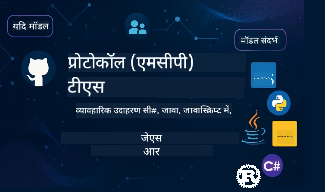

 

[](https://GitHub.com/microsoft/mcp-for-beginners/graphs/contributors)
[](https://GitHub.com/microsoft/mcp-for-beginners/issues)
[](https://GitHub.com/microsoft/mcp-for-beginners/pulls)
[](http://makeapullrequest.com)

[](https://GitHub.com/microsoft/mcp-for-beginners/watchers)
[](https://GitHub.com/microsoft/mcp-for-beginners/fork)
[](https://GitHub.com/microsoft/mcp-for-beginners/stargazers)


[](https://discord.gg/nTYy5BXMWG)

इन संसाधनों का उपयोग शुरू करने के लिए इन चरणों का पालन करें:
1. **रिपॉजिटरी को फोर्क करें**: क्लिक करें [](https://GitHub.com/microsoft/mcp-for-beginners/fork)
2. **रिपॉजिटरी को क्लोन करें**:   `git clone https://github.com/microsoft/mcp-for-beginners.git`
3. **शामिल हों** [](https://discord.gg/nTYy5BXMWG)


### 🌐 बहुभाषी समर्थन

#### GitHub Action के माध्यम से समर्थित (स्वचालित और हमेशा अद्यतन)

<!-- CO-OP TRANSLATOR LANGUAGES TABLE START -->
[Arabic](../ar/README.md) | [Bengali](../bn/README.md) | [Bulgarian](../bg/README.md) | [Burmese (Myanmar)](../my/README.md) | [Chinese (Simplified)](../zh-CN/README.md) | [Chinese (Traditional, Hong Kong)](../zh-HK/README.md) | [Chinese (Traditional, Macau)](../zh-MO/README.md) | [Chinese (Traditional, Taiwan)](../zh-TW/README.md) | [Croatian](../hr/README.md) | [Czech](../cs/README.md) | [Danish](../da/README.md) | [Dutch](../nl/README.md) | [Estonian](../et/README.md) | [Finnish](../fi/README.md) | [French](../fr/README.md) | [German](../de/README.md) | [Greek](../el/README.md) | [Hebrew](../he/README.md) | [Hindi](./README.md) | [Hungarian](../hu/README.md) | [Indonesian](../id/README.md) | [Italian](../it/README.md) | [Japanese](../ja/README.md) | [Kannada](../kn/README.md) | [Korean](../ko/README.md) | [Lithuanian](../lt/README.md) | [Malay](../ms/README.md) | [Malayalam](../ml/README.md) | [Marathi](../mr/README.md) | [Nepali](../ne/README.md) | [Nigerian Pidgin](../pcm/README.md) | [Norwegian](../no/README.md) | [Persian (Farsi)](../fa/README.md) | [Polish](../pl/README.md) | [Portuguese (Brazil)](../pt-BR/README.md) | [Portuguese (Portugal)](../pt-PT/README.md) | [Punjabi (Gurmukhi)](../pa/README.md) | [Romanian](../ro/README.md) | [Russian](../ru/README.md) | [Serbian (Cyrillic)](../sr/README.md) | [Slovak](../sk/README.md) | [Slovenian](../sl/README.md) | [Spanish](../es/README.md) | [Swahili](../sw/README.md) | [Swedish](../sv/README.md) | [Tagalog (Filipino)](../tl/README.md) | [Tamil](../ta/README.md) | [Telugu](../te/README.md) | [Thai](../th/README.md) | [Turkish](../tr/README.md) | [Ukrainian](../uk/README.md) | [Urdu](../ur/README.md) | [Vietnamese](../vi/README.md)

> **स्थानीय रूप से क्लोन करना पसंद है?**
>
> इस रिपॉजिटरी में 50+ भाषा अनुवाद शामिल हैं जो डाउनलोड आकार को काफी बढ़ाते हैं। ट्रांसलेशन्स के बिना क्लोन करने के लिए स्पार्स चेकआउट का उपयोग करें:
>
> **Bash / macOS / Linux:**
> ```bash
> git clone --filter=blob:none --sparse https://github.com/microsoft/mcp-for-beginners.git
> cd mcp-for-beginners
> git sparse-checkout set --no-cone '/*' '!translations' '!translated_images'
> ```
>
> **CMD (Windows):**
> ```cmd
> git clone --filter=blob:none --sparse https://github.com/microsoft/mcp-for-beginners.git
> cd mcp-for-beginners
> git sparse-checkout set --no-cone "/*" "!translations" "!translated_images"
> ```
>
> यह आपको कोर्स पूरा करने के लिए आवश्यक सब कुछ तेज़ डाउनलोड के साथ देता है।
<!-- CO-OP TRANSLATOR LANGUAGES TABLE END -->

# 🚀 मॉडल कॉन्टेक्सट प्रोटोकॉल (MCP) पाठ्यक्रम शुरुआती लोगों के लिए

## **C#, Java, JavaScript, Rust, Python, और TypeScript में व्यावहारिक कोड उदाहरणों के साथ MCP सीखें**

## 🧠 मॉडल कॉन्टेक्सट प्रोटोकॉल पाठ्यक्रम का अवलोकन
मॉडल कॉन्टेक्सट प्रोटोकॉल की दुनिया में आपका स्वागत है! यदि आपने कभी सोचा है कि एआई एप्लिकेशन विभिन्न टूल्स और सेवाओं से कैसे संवाद करते हैं, तो आप उस शानदार समाधान को जानने वाले हैं जो डेवलपर्स को बुद्धिमान सिस्टम बनाने का तरीका बदल रहा है।

MCP को एक सार्वभौमिक अनुवादक के रूप में सोचें - जैसे USB पोर्ट आपके कंप्यूटर से किसी भी डिवाइस को जोड़ने देते हैं, MCP एआई मॉडल्स को किसी भी टूल या सेवा से एक मानकीकृत तरीके से जुड़ने देता है। चाहे आप अपना पहला चैटबॉट बना रहे हों या जटिल एआई कार्यप्रवाहों पर काम कर रहे हों, MCP को समझना आपको अधिक सक्षम और लचीले एप्लिकेशन बनाने की शक्ति देगा।

यह पाठ्यक्रम आपकी सीखने की यात्रा के लिए धैर्य और देखभाल के साथ डिजाइन किया गया है। हम सरल अवधारणाओं से शुरू करेंगे जिन्हें आप पहले से समझते हैं और आपके पसंदीदा प्रोग्रामिंग भाषा में व्यावहारिक अभ्यास के माध्यम से धीरे-धीरे आपकी विशेषज्ञता बनाएंगे। हर चरण में स्पष्ट व्याख्याएं, व्यावहारिक उदाहरण, और बहुत प्रोत्साहन शामिल हैं।

जब आप इस यात्रा को पूरा कर लेंगे, तो आप अपनी खुद की MCP सर्वर बनाने, उन्हें लोकप्रिय AI प्लेटफार्मों के साथ एकीकृत करने, और समझने में सक्षम होंगे कि यह तकनीक AI विकास के भविष्य को कैसे आकार दे रही है। आइए साथ में इस रोमांचक साहसिक की शुरुआत करें!

### आधिकारिक दस्तावेज़ और विनिर्देश

यह पाठ्यक्रम **MCP विनिर्देश 2025-11-25** (ताजा स्थिर रिलीज) के अनुसार संरेखित है। MCP विनिर्देश तारीख-आधारित संस्करण (YYYY-MM-DD प्रारूप) का उपयोग करता है ताकि प्रोटोकॉल संस्करण ट्रैकिंग स्पष्ट हो।

ये संसाधन आपकी समझ बढ़ने के साथ अधिक मूल्यवान हो जाते हैं, लेकिन तुरंत सब कुछ पढ़ने का दबाव महसूस न करें। उन क्षेत्रों से शुरू करें जो आपको सबसे अधिक रुचिकर लगते हैं!
- 📘 [MCP दस्तावेज़](https://modelcontextprotocol.io/) – यह आपकी स्टेप-बाय-स्टेप ट्यूटोरियल और उपयोगकर्ता मार्गदर्शिकाएँ हैं। दस्तावेज़ शुरुआती लोगों के लिए लिखा गया है, जिसमें स्पष्ट उदाहरण होते हैं जिन्हें आप अपनी गति से फॉलो कर सकते हैं।
- 📜 [MCP विनिर्देश](https://modelcontextprotocol.io/specification/2025-11-25) – इसे अपने व्यापक संदर्भ मैनुअल के रूप में सोचें। जैसे-जैसे आप पाठ्यक्रम के माध्यम से काम करेंगे, आप विशिष्ट विवरण देखने और उन्नत विशेषताओं की खोज के लिए यहां लौटेंगे।
- 📜 [MCP विनिर्देश संस्करण](https://modelcontextprotocol.io/specification/versioning) – इसमें प्रोटोकॉल संस्करण इतिहास और MCP की तारीख-आधारित संस्करण (YYYY-MM-DD प्रारूप) का उपयोग कैसे करता है, के बारे में जानकारी है।
- 🧑‍💻 [MCP GitHub रिपॉजिटरी](https://github.com/modelcontextprotocol) – यहाँ आपको SDKs, टूल्स, और कई प्रोग्रामिंग भाषाओं में कोड नमूने मिलेंगे। यह व्यावहारिक उदाहरणों और तैयार उपयोग घटकों का खजाना है।
- 🌐 [MCP समुदाय](https://github.com/orgs/modelcontextprotocol/discussions) – fellow learners और अनुभवी डेवलपर्स के साथ MCP पर चर्चाओं में शामिल हों। यह एक सहायक समुदाय है जहाँ प्रश्न स्वागत योग्य हैं और ज्ञान स्वतंत्र रूप से साझा किया जाता है।
  
## सीखने के उद्देश्य

इस पाठ्यक्रम के अंत तक, आपको अपनी नई क्षमताओं के प्रति आत्मविश्वास और उत्साह महसूस होगा। आप ये हासिल करेंगे:

• **MCP के मूल बातें समझें**: आप समझेंगे कि मॉडल कॉन्टेक्सट प्रोटोकॉल क्या है और यह क्यों AI एप्लिकेशन के काम करने के तरीके में क्रांति ला रहा है, उदाहरणों और उपमाओं के साथ जो समझ में आसान हों।

• **अपना पहला MCP सर्वर बनाएं**: आप अपनी पसंदीदा प्रोग्रामिंग भाषा में एक कार्यशील MCP सर्वर बनाएंगे, सरल उदाहरणों से शुरू करके और कौशल धीरे-धीरे विकसित करेंगे।

• **AI मॉडल्स को वास्तविक टूल्स से कनेक्ट करें**: आप सीखेंगे कि AI मॉडल्स और वास्तविक सेवाओं के बीच सेतु कैसे बनाएं, जिससे आपके एप्लिकेशन को शक्तिशाली नए फीचर मिलते हैं।

• **सुरक्षा की सर्वोत्तम प्रथाओं को लागू करें**: आप समझेंगे कि अपने MCP कार्यान्वयन को कैसे सुरक्षित और सुरक्षित रखें, अपने एप्लिकेशन और उपयोगकर्ताओं दोनों की रक्षा करते हुए।

• **आत्मविश्वास के साथ तैनात करें**: आप जानेंगे कि अपने MCP प्रोजेक्ट्स को विकास से प्रोडक्शन में कैसे ले जाएँ, व्यावहारिक तैनाती रणनीतियों के साथ जो वास्तविक दुनिया में काम करते हैं।

• **MCP समुदाय में शामिल हों**: आप एक बढ़ते हुए डेवलपर्स समुदाय का हिस्सा बनेंगे जो AI एप्लिकेशन विकास के भविष्य को आकार दे रहे हैं।

## आवश्यक पृष्ठभूमि

MCP के विशिष्ट विवरण में जाने से पहले, आइए यह सुनिश्चित करें कि आप कुछ मौलिक अवधारणाओं में सहज महसूस करते हैं। चिंता न करें यदि आप इन क्षेत्रों में विशेषज्ञ नहीं हैं - हम आपको आवश्यक सब कुछ समझाएंगे!

### प्रोटोकॉल को समझना (आधार)

प्रोटोकॉल को एक बातचीत के नियमों के रूप में सोचें। जब आप किसी मित्र को कॉल करते हैं, तो दोनों जानते हैं कि "हेलो" कहें, बारी-बारी से बात करें, और खत्म होने पर "अलविदा" कहें। कंप्यूटर प्रोग्राम्स को भी प्रभावी संवाद के लिए समान नियमों की जरूरत होती है।

MCP एक प्रोटोकॉल है - सहमति से निर्धारित नियमों का सेट जो AI मॉडल्स और एप्लिकेशन को टूल्स और सेवाओं के साथ सफल "बातचीत" करने में मदद करता है। जैसे मानव संचार को आसान बनाने के लिए बातचीत के नियम होते हैं, वैसे ही MCP AI एप्लिकेशन संचार को अधिक विश्वसनीय और शक्तिशाली बनाता है।

### क्लाइंट-सर्वर संबंध (प्रोग्राम एक साथ कैसे काम करते हैं)

आप रोज़ क्लाइंट-सर्वर संबंधों का उपयोग करते हैं! जब आप वेब ब्राउज़र (क्लाइंट) से किसी वेबसाइट पर जाते हैं, तो आप वेब सर्वर से जुड़ते हैं जो आपको पेज सामग्री भेजता है। ब्राउज़र जानता है कि जानकारी कैसे मांगनी है, और सर्वर जानता है कि प्रत्युत्तर कैसे देना है।

MCP में, एक समान संबंध होता है: AI मॉडल क्लाइंट के रूप में काम करते हैं जो जानकारी या क्रियाएँ मांगते हैं, जबकि MCP सर्वर ये क्षमताएँ प्रदान करते हैं। यह ऐसा है जैसे AI के पास एक मददगार सहायक (सर्वर) हो जिसे वह विशिष्ट कार्य करने के लिए कह सकता है।

### मानकीकरण क्यों महत्वपूर्ण है (चीज़ों को एक साथ काम करने योग्य बनाना)

कल्पना करें कि हर कार निर्माता एक अलग आकार के गैस पंप का उपयोग करता है - आपके पास हर कार के लिए अलग एडाप्टर होना पड़ेगा! मानकीकरण का मतलब सामान्य दृष्टिकोणों पर सहमति होना है ताकि चीज़ें निर्बाध रूप से काम करें।

MCP AI एप्लिकेशन के लिए यह मानकीकरण प्रदान करता है। हर AI मॉडल को हर टूल के साथ कस्टम कोड बनाने की बजाय, MCP उनके बीच संवाद का एक सार्वभौमिक तरीका बनाता है। इसका मतलब है कि डेवलपर्स एक बार टूल बनाएँ और वे कई अलग-अलग AI सिस्टम के साथ काम करें।

## 🧭 आपकी सीखने की यात्रा का अवलोकन

आपकी MCP यात्रा सावधानीपूर्वक संरचित है ताकि आपकी आत्मविश्वास और कौशल क्रमिक रूप से विकसित हो। हर चरण नई अवधारणाएँ introduce करता है जबकि आपने जो पहले सीखा है उसकी पुनरावृत्ति करता है।

### 🌱 आधार चरण: मूल बातें समझना (मॉड्यूल 0-2)

यहीं से आपकी यात्रा शुरू होती है! हम आपको MCP अवधारणाओं से परिचित कराएंगे जो परिचित उपमाओं और सरल उदाहरणों का उपयोग करती हैं। आप समझेंगे MCP क्या है, यह क्यों मौजूद है, और यह AI विकास की बड़ी दुनिया में कैसे फिट बैठता है।

• **मॉड्यूल 0 - MCP का परिचय**: हम शुरू करेंगे यह पता लगाकर कि MCP क्या है और यह आधुनिक AI एप्लिकेशन के लिए क्यों महत्वपूर्ण है। आप लाइव उदाहरण देखेंगे कि MCP कैसे काम करता है और यह डेवलपर्स की आम समस्याएँ कैसे हल करता है।

• **मॉड्यूल 1 - मुख्य अवधारणाएँ समझाई गईं**: यहां आप MCP के आवश्यक बिल्डिंग ब्लॉक सीखेंगे। हम कई उपमाएँ और दृश्य उदाहरणों का उपयोग करेंगे ताकि ये अवधारणाएं प्राकृतिक और समझने योग्य लगें।

• **मॉड्यूल 2 - MCP में सुरक्षा**: सुरक्षा भले ही intimidating लगती हो, लेकिन हम आपको दिखाएंगे कि MCP में अंतर्निर्मित सुरक्षा विशेषताएं कैसे हैं और आपको सबसे अच्छी प्रैक्टिस सिखाएँगे जो शुरुआत से आपके एप्लिकेशन की रक्षा करती हैं।

### 🔨 निर्माण चरण: अपनी पहली कार्यान्वयन बनाना (मॉड्यूल 3)

अब असली मज़ा शुरू होता है! आप व्यावहारिक अनुभव प्राप्त करेंगे वास्तविक MCP सर्वर और क्लाइंट बनाने का। चिंता न करें - हम सरल से शुरू करेंगे और हर कदम में आपका मार्गदर्शन करेंगे।
यह मॉड्यूल कई हैंड्स-ऑन गाइड शामिल करता है जो आपको अपनी पसंदीदा प्रोग्रामिंग भाषा में अभ्यास करने देते हैं। आप अपना पहला सर्वर बनाएंगे, उससे कनेक्ट करने के लिए एक क्लाइंट बनाएंगे, और यहां तक कि VS कोड जैसे लोकप्रिय विकास उपकरणों के साथ एकीकरण करेंगे।

प्रत्येक गाइड में पूर्ण कोड उदाहरण, समस्याओं को हल करने के सुझाव और यह बताया गया है कि हम विशिष्ट डिज़ाइन विकल्प क्यों बनाते हैं। इस चरण के अंत तक, आपके पास काम करने वाले MCP निष्पादन होंगे जिन पर आप गर्व कर सकते हैं!

### 🚀 विकास चरण: उन्नत अवधारणाएं और वास्तविक दुनिया का अनुप्रयोग (मॉड्यूल 4-5)

बुनियादी बातें समझने के बाद, आप अधिक परिष्कृत MCP विशेषताओं को खोजने के लिए तैयार हैं। हम व्यावहारिक निष्पादन रणनीतियों, डिबगिंग तकनीकों, और मल्टी-मोडल AI एकीकरण जैसे उन्नत विषयों को कवर करेंगे।

आप यह भी सीखेंगे कि उत्पादन उपयोग के लिए अपने MCP निष्पादनों को किस प्रकार स्केल करें और Azure जैसे क्लाउड प्लेटफार्मों के साथ एकीकृत करें। ये मॉड्यूल आपको MCP समाधान बनाने के लिए तैयार करते हैं जो वास्तविक दुनिया की मांगों को संभाल सकते हैं।

### 🌟 महारत चरण: समुदाय और विशेषज्ञता (मॉड्यूल 6-11)

अंतिम चरण MCP समुदाय में शामिल होने और उन क्षेत्रों में विशेषज्ञता प्राप्त करने पर केंद्रित है जिनमें आपकी सबसे अधिक रुचि है। आप सीखेंगे कि ओपन-सोर्स MCP परियोजनाओं में कैसे योगदान करें, उन्नत प्रमाणीकरण पैटर्न को लागू करें, और व्यापक डेटाबेस-एकीकृत समाधान बनाएं।

मॉड्यूल 11 विशेष उल्लेख योग्य है - यह एक पूर्ण 13-प्रयोगशाला हैंड्स-ऑन सीखने का पथ है जो आपको PostgreSQL एकीकरण के साथ उत्पादन-तैयार MCP सर्वर बनाना सिखाता है। यह एक कैपस्टोन परियोजना की तरह है जो आपने जो कुछ भी सीखा है उसे एक साथ लाता है!

### 📚 पूर्ण पाठ्यक्रम संरचना

| Module | विषय | विवरण | लिंक |
|--------|-------|-------------|------|
| **मॉड्यूल 0-3: मूल बातें** | | | |
| 00 | MCP परिचय | मॉडल संदर्भ प्रोटोकॉल का अवलोकन और AI पाइपलाइनों में इसकी महत्वपूर्णता | [और पढ़ें](./00-Introduction/README.md) |
| 01 | मुख्य अवधारणाओं का व्याख्यान | मुख्य MCP अवधारणाओं का गहन अन्वेषण | [और पढ़ें](./01-CoreConcepts/README.md) |
| 02 | MCP में सुरक्षा | सुरक्षा जोखिम और सर्वोत्तम प्रथाएं | [और पढ़ें](./02-Security/README.md) |
| 03 | MCP के साथ शुरुआत | वातावरण सेटअप, मूल सर्वर/क्लाइंट, एकीकरण | [और पढ़ें](./03-GettingStarted/README.md) |
| **मॉड्यूल 3: अपना पहला सर्वर और क्लाइंट बनाना** | | | |
| 3.1 | पहला सर्वर | अपना पहला MCP सर्वर बनाएँ | [गाइड](./03-GettingStarted/01-first-server/README.md) |
| 3.2 | पहला क्लाइंट | एक बुनियादी MCP क्लाइंट विकसित करें | [गाइड](./03-GettingStarted/02-client/README.md) |
| 3.3 | LLM के साथ क्लाइंट | बड़े भाषा मॉडल एकीकृत करें | [गाइड](./03-GettingStarted/03-llm-client/README.md) |
| 3.4 | VS कोड एकीकरण | VS कोड में MCP सर्वर का उपयोग करें | [गाइड](./03-GettingStarted/04-vscode/README.md) |
| 3.5 | stdio सर्वर | stdio ट्रांसपोर्ट का उपयोग करके सर्वर बनाएँ | [गाइड](./03-GettingStarted/05-stdio-server/README.md) |
| 3.6 | HTTP स्ट्रीमिंग | MCP में HTTP स्ट्रीमिंग लागू करें | [गाइड](./03-GettingStarted/06-http-streaming/README.md) |
| 3.7 | AI उपकरण किट | MCP के साथ AI टूलकिट का उपयोग करें | [गाइड](./03-GettingStarted/07-aitk/README.md) |
| 3.8 | परीक्षण | अपने MCP सर्वर निष्पादन का परीक्षण करें | [गाइड](./03-GettingStarted/08-testing/README.md) |
| 3.9 | तैनाती | उत्पादन के लिए MCP सर्वर तैनात करें | [गाइड](./03-GettingStarted/09-deployment/README.md) |
| 3.10 | उन्नत सर्वर उपयोग | उन्नत विशेषताओं के उपयोग और बेहतर वास्तुकला के लिए उन्नत सर्वरों का उपयोग करें | [गाइड](./03-GettingStarted/10-advanced/README.md) |
| 3.11 | सरल प्रमाणीकरण | आरंभ से प्रमाणीकरण दिखाने और RBAC के लिए एक अध्याय | [गाइड](./03-GettingStarted/11-simple-auth/README.md) |
| 3.12 | MCP होस्ट्स | Claude Desktop, Cursor, Cline, और अन्य MCP होस्ट्स कॉन्फ़िगर करें | [गाइड](./03-GettingStarted/12-mcp-hosts/README.md) |
| 3.13 | MCP इंस्पेक्टर | Inspector टूल के साथ MCP सर्वर का डिबग और परीक्षण करें | [गाइड](./03-GettingStarted/13-mcp-inspector/README.md) |
| 3.14 | सैंपलिंग | क्लाइंट के साथ सहयोग करने के लिए सैंपलिंग का उपयोग करें | [गाइड](./03-GettingStarted/14-sampling/README.md) |
| 3.15 | MCP ऐप्स | MCP ऐप्स बनाएं | [गाइड](./03-GettingStarted/15-mcp-apps/README.md) |
| **मॉड्यूल 4-5: व्यावहारिक और उन्नत** | | | |
| 04 | व्यावहारिक निष्पादन | SDK, डिबगिंग, परीक्षण, पुन: प्रयोज्य प्रॉम्प्ट टेम्पलेट्स | [और पढ़ें](./04-PracticalImplementation/README.md) |
| 4.1 | पेजिनेशन | करसर-आधारित पेजिनेशन के साथ बड़े परिणाम सेट संभालें | [गाइड](./04-PracticalImplementation/pagination/README.md) |
| 05 | MCP में उन्नत विषय | मल्टी-मोडल AI, स्केलिंग, उद्यम उपयोग | [और पढ़ें](./05-AdvancedTopics/README.md) |
| 5.1 | Azure एकीकरण | MCP में Azure एकीकरण | [गाइड](./05-AdvancedTopics/mcp-integration/README.md) |
| 5.2 | मल्टी-मोडैलिटी | कई प्रकारों के साथ काम करना | [गाइड](./05-AdvancedTopics/mcp-multi-modality/README.md) |
| 5.3 | OAuth2 डेमो | OAuth2 प्रमाणीकरण लागू करें | [गाइड](./05-AdvancedTopics/mcp-oauth2-demo/README.md) |
| 5.4 | रूट संदर्भ | रूट संदर्भ को समझना और लागू करना | [गाइड](./05-AdvancedTopics/mcp-root-contexts/README.md) |
| 5.5 | रूटिंग | MCP रूटिंग रणनीतियाँ | [गाइड](./05-AdvancedTopics/mcp-routing/README.md) |
| 5.6 | सैंपलिंग | MCP में सैंपलिंग तकनीक | [गाइड](./05-AdvancedTopics/mcp-sampling/README.md) |
| 5.7 | स्केलिंग | MCP निष्पादनों को स्केल करें | [गाइड](./05-AdvancedTopics/mcp-scaling/README.md) |
| 5.8 | सुरक्षा | उन्नत सुरक्षा विचार | [गाइड](./05-AdvancedTopics/mcp-security/README.md) |
| 5.9 | वेब सर्च | वेब सर्च क्षमताओं को लागू करें | [गाइड](./05-AdvancedTopics/web-search-mcp/README.md) |
| 5.10 | रियलटाइम स्ट्रीमिंग | रियलटाइम स्ट्रीमिंग कार्यक्षमता बनाएँ | [गाइड](./05-AdvancedTopics/mcp-realtimestreaming/README.md) |
| 5.11 | रियलटाइम सर्च | रियलटाइम सर्च लागू करें | [गाइड](./05-AdvancedTopics/mcp-realtimesearch/README.md) |
| 5.12 | Entra ID प्रमाणीकरण | Microsoft Entra ID के साथ प्रमाणीकरण | [गाइड](./05-AdvancedTopics/mcp-security-entra/README.md) |
| 5.13 | Foundry एकीकरण | Azure AI Foundry के साथ एकीकरण | [गाइड](./05-AdvancedTopics/mcp-foundry-agent-integration/README.md) |
| 5.14 | संदर्भ अभियांत्रिकी | प्रभावी संदर्भ अभियांत्रिकी के लिए तकनीकें | [गाइड](./05-AdvancedTopics/mcp-contextengineering/README.md) |
| 5.15 | MCP कस्टम ट्रांसपोर्ट | कस्टम ट्रांसपोर्ट निष्पादन | [गाइड](./05-AdvancedTopics/mcp-transport/README.md) |
| 5.16 | प्रोटोकॉल विशेषताएं | प्रगति नोटिफिकेशन, रद्दीकरण, संसाधन टेम्पलेट्स | [गाइड](./05-AdvancedTopics/mcp-protocol-features/README.md) |
| **मॉड्यूल 6-10: समुदाय और सर्वोत्तम प्रथाएं** | | | |
| 06 | समुदाय योगदान | MCP इकोसिस्टम में कैसे योगदान करें | [गाइड](./06-CommunityContributions/README.md) |
| 07 | प्रारंभिक अपनाने से अंतर्दृष्टि | वास्तविक दुनिया के निष्पादन कहानियां | [गाइड](./07-LessonsfromEarlyAdoption/README.md) |
| 08 | MCP के लिए सर्वोत्तम प्रथाएं | प्रदर्शन, दोष-टॉलरेंस, सहनशीलता | [गाइड](./08-BestPractices/README.md) |
| 09 | MCP केस स्टडीज | व्यावहारिक निष्पादन उदाहरण | [गाइड](./09-CaseStudy/README.md) |
| 10 | हैंड्स-ऑन कार्यशाला | AI टूलकिट के साथ MCP सर्वर बनाना | [प्रयोगशाला](./10-StreamliningAIWorkflowsBuildingAnMCPServerWithAIToolkit/README.md) |
| **मॉड्यूल 11: MCP सर्वर हैंड्स ऑन लैब** | | | |
| 11 | MCP सर्वर डेटाबेस एकीकरण | PostgreSQL एकीकरण के लिए व्यापक 13-प्रयोगशाला हैंड्स-ऑन सीखने का पथ | [प्रयोगशालाएं](./11-MCPServerHandsOnLabs/README.md) |
| 11.1 | परिचय | डेटाबेस एकीकरण और रिटेल एनालिटिक्स उपयोग मामला के साथ MCP का अवलोकन | [प्रयोगशाला 00](./11-MCPServerHandsOnLabs/00-Introduction/README.md) |
| 11.2 | मुख्य वास्तुकला | MCP सर्वर वास्तुकला, डेटाबेस लेयर्स, और सुरक्षा पैटर्न को समझना | [प्रयोगशाला 01](./11-MCPServerHandsOnLabs/01-Architecture/README.md) |
| 11.3 | सुरक्षा और मल्टी-टेनेंसी | रो लेवल सुरक्षा, प्रमाणीकरण, और मल्टी-टेनेंट डेटा एक्सेस | [प्रयोगशाला 02](./11-MCPServerHandsOnLabs/02-Security/README.md) |
| 11.4 | पर्यावरण सेटअप | विकास वातावरण सेटअप, डॉकटर, Azure संसाधन | [प्रयोगशाला 03](./11-MCPServerHandsOnLabs/03-Setup/README.md) |
| 11.5 | डेटाबेस डिज़ाइन | PostgreSQL सेटअप, रिटेल स्कीमा डिज़ाइन, और नमूना डेटा | [प्रयोगशाला 04](./11-MCPServerHandsOnLabs/04-Database/README.md) |
| 11.6 | MCP सर्वर निष्पादन | डेटाबेस एकीकरण के साथ FastMCP सर्वर बनाना | [प्रयोगशाला 05](./11-MCPServerHandsOnLabs/05-MCP-Server/README.md) |
| 11.7 | टूल विकास | डेटाबेस क्वेरी टूल और स्कीमा इंट्रोस्पेक्शन बनाना | [प्रयोगशाला 06](./11-MCPServerHandsOnLabs/06-Tools/README.md) |
| 11.8 | सेमांटिक सर्च | Azure OpenAI और pgvector के साथ वेक्टर एम्बेडिंग लागू करना | [प्रयोगशाला 07](./11-MCPServerHandsOnLabs/07-Semantic-Search/README.md) |
| 11.9 | परीक्षण और डिबगिंग | परीक्षण रणनीतियां, डिबगिंग उपकरण, और मान्यता के दृष्टिकोण | [प्रयोगशाला 08](./11-MCPServerHandsOnLabs/08-Testing/README.md) |
| 11.10 | VS कोड एकीकरण | VS कोड MCP एकीकरण और AI चैट उपयोग कॉन्फ़िगर करना | [प्रयोगशाला 09](./11-MCPServerHandsOnLabs/09-VS-Code/README.md) |
| 11.11 | तैनाती रणनीतियां | डॉकटर तैनाती, Azure कंटेनर ऐप्स, और स्केलिंग पर विचार | [प्रयोगशाला 10](./11-MCPServerHandsOnLabs/10-Deployment/README.md) |
| 11.12 | मॉनिटरिंग | एप्लिकेशन इनसाइट्स, लॉगिंग, प्रदर्शन मॉनिटरिंग | [प्रयोगशाला 11](./11-MCPServerHandsOnLabs/11-Monitoring/README.md) |
| 11.13 | सर्वोत्तम प्रथाएं | प्रदर्शन अनुकूलन, सुरक्षा सुदृढ़ीकरण, और उत्पादन सुझाव | [प्रयोगशाला 12](./11-MCPServerHandsOnLabs/12-Best-Practices/README.md) |

### 💻 नमूना कोड परियोजनाएं

MCP सीखने का सबसे रोमांचक हिस्सा है अपने कोड कौशल का धीरे-धीरे विकास देखना। हमने अपने कोड उदाहरण सरल से शुरू करके और आपकी समझ के साथ अधिक परिष्कृत बनाते हुए डिजाइन किए हैं। यहाँ हम अवधारणाओं को कैसे पेश करते हैं - ऐसा कोड जो समझने में आसान है लेकिन असली MCP सिद्धांतों को दर्शाता है। आप समझेंगे कि यह कोड क्या करता है, क्यों यह इस तरह संरचित है, और यह बड़े MCP अनुप्रयोगों में कैसे फिट बैठता है।

#### बेसिक MCP कैलकुलेटर नमूने

| भाषा | विवरण | लिंक |
|----------|-------------|------|
| C# | MCP सर्वर उदाहरण | [कोड देखें](./03-GettingStarted/samples/csharp/README.md) |
| Java | MCP कैलकुलेटर | [कोड देखें](./03-GettingStarted/samples/java/calculator/README.md) |
| JavaScript | MCP डेमो | [कोड देखें](./03-GettingStarted/samples/javascript/README.md) |
| Python | MCP सर्वर | [कोड देखें](../../03-GettingStarted/samples/python/mcp_calculator_server.py) |
| TypeScript | MCP उदाहरण | [कोड देखें](./03-GettingStarted/samples/typescript/README.md) |
| Rust | MCP उदाहरण | [कोड देखें](./03-GettingStarted/samples/rust/README.md) |

#### उन्नत MCP निष्पादन

| भाषा | विवरण | लिंक |
|----------|-------------|------|
| C# | उन्नत नमूना | [कोड देखें](./04-PracticalImplementation/samples/csharp/README.md) |
| Java with Spring | कंटेनर ऐप उदाहरण | [कोड देखें](./04-PracticalImplementation/samples/java/containerapp/README.md) |
| JavaScript | उन्नत नमूना | [कोड देखें](./04-PracticalImplementation/samples/javascript/README.md) |
| Python | जटिल निष्पादन | [कोड देखें](./04-PracticalImplementation/samples/python/README.md) |
| TypeScript | कंटेनर नमूना | [कोड देखें](./04-PracticalImplementation/samples/typescript/README.md) |


## 🎯 MCP सीखने के लिए पूर्वापेक्षाएँ

इस पाठ्यक्रम से अधिकतम लाभ उठाने के लिए, आपके पास होना चाहिए:
- निम्नलिखित भाषाओं में से कम से कम एक में प्रोग्रामिंग का बुनियादी ज्ञान: C#, Java, JavaScript, Python, या TypeScript
- क्लाइंट-सर्वर मॉडल और API की समझ
- REST और HTTP अवधारणाओं से परिचित होना
- (वैकल्पिक) AI/ML अवधारणाओं में पृष्ठभूमि

- सहायता के लिए हमारे समुदाय चर्चाओं में शामिल होना

## 📚 अध्ययन गाइड और संसाधन

इस रिपॉजिटरी में आपको प्रभावी ढंग से नेविगेट और सीखने में मदद करने के लिए कई संसाधन शामिल हैं:

### अध्ययन गाइड

एक व्यापक [अध्ययन गाइड](./study_guide.md) उपलब्ध है, जो आपको इस रिपॉजिटरी को प्रभावी ढंग से नेविगेट करने में मदद करती है। यह दृश्य पाठ्यक्रम मानचित्र दिखाता है कि सभी विषय कैसे जुड़े हुए हैं और नमूना परियोजनाओं का प्रभावी उपयोग कैसे करें, इसका मार्गदर्शन भी प्रदान करता है। यह विशेष रूप से उन लोगों के लिए सहायक है जो एक दृश्य शिक्षार्थी हैं और बड़ी तस्वीर देखना पसंद करते हैं।

इस गाइड में शामिल हैं:
- सभी सम्मिलित विषयों का दृश्य पाठ्यक्रम मानचित्र
- प्रत्येक रिपॉजिटरी अनुभाग का विस्तृत विवरण
- नमूना परियोजनाओं का उपयोग कैसे करें, इसकी मार्गदर्शन
- विभिन्न कौशल स्तरों के लिए अनुशंसित शिक्षण पथ
- आपकी सीखने की यात्रा को पूरा करने के लिए अतिरिक्त संसाधन

### चेंजलॉग

हम एक विस्तृत [चेंजलॉग](./changelog.md) को बनाए रखते हैं जो पाठ्यक्रम सामग्री में सभी महत्वपूर्ण अपडेट का ट्रैक रखता है, ताकि आप नवीनतम सुधारों और परिवर्तनों के साथ अपडेट रह सकें।
- नए कंटेंट जोड़ना
- संरचनात्मक बदलाव
- फीचर सुधार
- दस्तावेज़ीकरण अपडेट्स

## 🛠️ इस पाठ्यक्रम का प्रभावी उपयोग कैसे करें

इस गाइड में प्रत्येक पाठ में शामिल हैं:

1. MCP अवधारणाओं की स्पष्ट व्याख्याएं  
2. कई भाषाओं में लाइव कोड उदाहरण  
3. वास्तविक MCP एप्लिकेशन बनाने के लिए अभ्यास  
4. उन्नत शिक्षार्थियों के लिए अतिरिक्त संसाधन

### आइए C# के साथ MCP सीखें - ट्यूटोरियल श्रृंखला
आइए Model Context Protocol (MCP) के बारे में जानें, जो AI मॉडल और क्लाइंट एप्लिकेशन के बीच इंटरैक्शन को मानकीकृत करने के लिए एक अत्याधुनिक फ्रेमवर्क है। इस शुरुआती सत्र के माध्यम से, हम आपको MCP से परिचित कराएंगे और आपके पहले MCP सर्वर को बनाने के लिए मार्गदर्शन करेंगे।
#### C#: [https://aka.ms/letslearnmcp-csharp](https://aka.ms/letslearnmcp-csharp)
#### Java: [https://aka.ms/letslearnmcp-java](https://aka.ms/letslearnmcp-java)
#### JavaScript: [https://aka.ms/letslearnmcp-javascript](https://aka.ms/letslearnmcp-javascript)
#### Python: [https://aka.ms/letslearnmcp-python](https://aka.ms/letslearnmcp-python)

## 🎓 आपकी MCP यात्रा शुरू होती है

बधाई हो! आपने एक रोमांचक यात्रा का पहला कदम उठाया है जो आपकी प्रोग्रामिंग क्षमताओं का विस्तार करेगी और आपको AI विकास के अग्रिम पथ से जोड़ती है।

### आपने अब तक क्या हासिल किया है

इस परिचय को पढ़कर, आपने पहले ही अपना MCP ज्ञान आधार बनाना शुरू कर दिया है। आप समझते हैं कि MCP क्या है, यह क्यों महत्वपूर्ण है, और यह पाठ्यक्रम आपकी सीखने की यात्रा में कैसे मदद करेगा। यह एक महत्वपूर्ण उपलब्धि है और इस महत्वपूर्ण तकनीक में आपकी विशेषज्ञता की शुरूआत है।

### आगे की यात्रा

जैसे-जैसे आप मॉड्यूल के माध्यम से प्रगति करेंगे, याद रखें कि हर विशेषज्ञ कभी शुरुआत में था। जो अवधारणाएँ अब जटिल लग सकती हैं, वे अभ्यास और आवेदन के साथ सहज हो जाएंगी। हर छोटा कदम मजबूत क्षमताओं की ओर ले जाएगा जो आपके पूरे विकास करियर में काम आएंगी।

### आपका समर्थन नेटवर्क

आप ऐसे शिक्षार्थियों और विशेषज्ञों के समुदाय का हिस्सा बन रहे हैं जो MCP को लेकर उत्साहित हैं और दूसरों की सफलता में मदद करने के लिए तत्पर हैं। चाहे आप कोडिंग चुनौती में फंसे हों या किसी सफलता को साझा करने के लिए उत्साहित हों, समुदाय आपकी यात्रा का समर्थन करने के लिए यहाँ है।

यदि आप फंस जाएं या AI एप्लिकेशन बनाने में कोई प्रश्न हो, तो MCP के बारे में चर्चाओं में साथी शिक्षार्थियों और अनुभवी डेवलपर्स के साथ जुड़ें। यह एक सहायक समुदाय है जहाँ प्रश्नों का स्वागत है और ज्ञान स्वतंत्र रूप से साझा किया जाता है।

[](https://discord.gg/nTYy5BXMWG)

यदि आपके पास उत्पाद प्रतिक्रिया या निर्माण के दौरान त्रुटियां हों, तो यहां जाएँ:

[](https://aka.ms/foundry/forum)

### शुरू करने के लिए तैयार?

आपकी MCP यात्रा अब शुरू होती है! मॉड्यूल 0 से शुरुआत करें ताकि आप पहला व्यावहारिक MCP अनुभव कर सकें, या देखें कि आप क्या बनाएंगे नमूना परियोजनाओं को एक्सप्लोर करें। याद रखें - हर विशेषज्ञ ठीक उसी जगह से शुरू हुआ जहां आप हैं, और धैर्य व अभ्यास के साथ, आप आश्चर्यचकित होंगे कि आप क्या हासिल कर सकते हैं।

Model Context Protocol विकास की दुनिया में आपका स्वागत है। आइए साथ में कुछ अद्भुत बनाएं!

## 🤝 सीखने वाले समुदाय में योगदान दें

यह पाठ्यक्रम आपके जैसे शिक्षार्थियों के योगदान से मजबूत होता है! चाहे आप टाइपो ठीक कर रहे हों, स्पष्ट व्याख्या सुझाव दे रहे हों, या नया उदाहरण जोड़ रहे हों, आपके योगदान अन्य शुरुआती लोगों की सफलता में मदद करते हैं।

कोड नमूनों का योगदान देने के लिए Microsoft वैल्यूड प्रोफेशनल [Shivam Goyal](https://www.linkedin.com/in/shivam2003/) को धन्यवाद।

योगदान प्रक्रिया स्वागतयोग्य और सहायक होने के लिए डिज़ाइन की गई है। अधिकांश योगदानों के लिए एक कॉन्ट्रिब्यूटर लाइसेंस एग्रीमेंट (CLA) की आवश्यकता होती है, लेकिन स्वचालित उपकरण आपको इस प्रक्रिया में आसानी से मार्गदर्शन करेंगे।

## 📜 ओपन सोर्स लर्निंग

यह पूरा पाठ्यक्रम MIT [LICENSE](../../LICENSE) के अंतर्गत उपलब्ध है, जिसका अर्थ है कि आप इसे स्वतंत्र रूप से उपयोग, संशोधित, और साझा कर सकते हैं। यह हमारे मिशन का समर्थन करता है जिससे MCP ज्ञान दुनिया भर के डेवलपर्स तक पहुँचे।

## 🤝 योगदान दिशानिर्देश

यह प्रोजेक्ट योगदान और सुझावों का स्वागत करता है। अधिकांश योगदानों के लिए आपको एक कॉन्ट्रिब्यूटर लाइसेंस एग्रीमेंट (CLA) पर सहमत होना होगा जिसमें यह घोषणा होती है कि आपके पास अपने योगदान के उपयोग के अधिकार हैं और वास्तव में आप हमें यह अधिकार दे रहे हैं। विवरण के लिए, <https://cla.opensource.microsoft.com> पर जाएं।

जब आप एक पुल रिक्वेस्ट सबमिट करते हैं, तो एक CLA बोट स्वचालित रूप से निर्धारित करेगा कि आपको CLA प्रदान करने की आवश्यकता है या नहीं और उचित रूप से PR को सजाएगा (जैसे, स्थिति जांच, टिप्पणी)। बस बोट द्वारा प्रदान किए गए निर्देशों का पालन करें। आपको हमारे CLA का उपयोग करने वाले सभी रिपॉजिटरीज़ में यह केवल एक बार करना होगा।

इस प्रोजेक्ट ने [Microsoft Open Source Code of Conduct](https://opensource.microsoft.com/codeofconduct/) को अपनाया है। अधिक जानकारी के लिए [Code of Conduct FAQ](https://opensource.microsoft.com/codeofconduct/faq/) देखें या किसी अतिरिक्त प्रश्न या टिप्पणी के लिए [opencode@microsoft.com](mailto:opencode@microsoft.com) से संपर्क करें।

---

*क्या आप अपनी MCP यात्रा शुरू करने के लिए तैयार हैं? [Module 00 - Introduction to MCP](./00-Introduction/README.md) से शुरुआत करें और Model Context Protocol विकास की दुनिया में अपने पहले कदम उठाएं!*


## 🎒 अन्य पाठ्यक्रम
हमारी टीम अन्य पाठ्यक्रम भी बनाती है! देखें:

<!-- CO-OP TRANSLATOR OTHER COURSES START -->
### LangChain
[](https://aka.ms/langchain4j-for-beginners)
[](https://aka.ms/langchainjs-for-beginners?WT.mc_id=m365-94501-dwahlin)
[](https://github.com/microsoft/langchain-for-beginners?WT.mc_id=m365-94501-dwahlin)
---

### Azure / Edge / MCP / एजेंट्स
[](https://github.com/microsoft/AZD-for-beginners?WT.mc_id=academic-105485-koreyst)
[](https://github.com/microsoft/edgeai-for-beginners?WT.mc_id=academic-105485-koreyst)
[](https://github.com/microsoft/mcp-for-beginners?WT.mc_id=academic-105485-koreyst)
[](https://github.com/microsoft/ai-agents-for-beginners?WT.mc_id=academic-105485-koreyst)

---
 
### जनरेटिव AI श्रृंखला
[](https://github.com/microsoft/generative-ai-for-beginners?WT.mc_id=academic-105485-koreyst)
[-9333EA?style=for-the-badge&labelColor=E5E7EB&color=9333EA)](https://github.com/microsoft/Generative-AI-for-beginners-dotnet?WT.mc_id=academic-105485-koreyst)
[-C084FC?style=for-the-badge&labelColor=E5E7EB&color=C084FC)](https://github.com/microsoft/generative-ai-for-beginners-java?WT.mc_id=academic-105485-koreyst)
[-E879F9?style=for-the-badge&labelColor=E5E7EB&color=E879F9)](https://github.com/microsoft/generative-ai-with-javascript?WT.mc_id=academic-105485-koreyst)

---
 
### कोर लर्निंग
[](https://aka.ms/ml-beginners?WT.mc_id=academic-105485-koreyst)
[](https://aka.ms/datascience-beginners?WT.mc_id=academic-105485-koreyst)
[](https://aka.ms/ai-beginners?WT.mc_id=academic-105485-koreyst)
[](https://github.com/microsoft/Security-101?WT.mc_id=academic-96948-sayoung)
[](https://aka.ms/webdev-beginners?WT.mc_id=academic-105485-koreyst)
[](https://aka.ms/iot-beginners?WT.mc_id=academic-105485-koreyst)
[](https://github.com/microsoft/xr-development-for-beginners?WT.mc_id=academic-105485-koreyst)

---
 
### Copilot श्रृंखला
[](https://aka.ms/GitHubCopilotAI?WT.mc_id=academic-105485-koreyst)
[](https://github.com/microsoft/mastering-github-copilot-for-dotnet-csharp-developers?WT.mc_id=academic-105485-koreyst)
[](https://github.com/microsoft/CopilotAdventures?WT.mc_id=academic-105485-koreyst)
<!-- CO-OP TRANSLATOR OTHER COURSES END -->

---

<!-- CO-OP TRANSLATOR DISCLAIMER START -->
**अस्वीकरण**:  
यह दस्तावेज़ AI अनुवाद सेवा [Co-op Translator](https://github.com/Azure/co-op-translator) का उपयोग करके अनूदित किया गया है। यद्यपि हम सही अनुवाद के प्रयास करते हैं, कृपया ध्यान रखें कि स्वचालित अनुवाद में त्रुटियाँ या असंगतियाँ हो सकती हैं। मूल दस्तावेज़ अपनी मूल भाषा में अधिकृत स्रोत माना जाना चाहिए। महत्वपूर्ण जानकारी के लिए पेशेवर मानव अनुवाद की सलाह दी जाती है। इस अनुवाद के उपयोग से उत्पन्न किसी भी गलतफ़हमी या गलत व्याख्या के लिए हम उत्तरदायी नहीं हैं।
<!-- CO-OP TRANSLATOR DISCLAIMER END -->