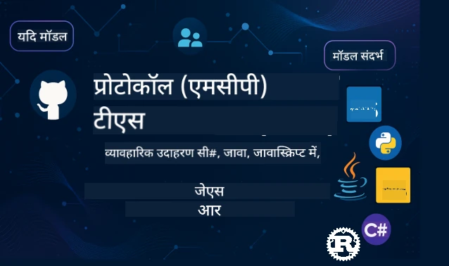

 

[](https://GitHub.com/microsoft/mcp-for-beginners/graphs/contributors)
[](https://GitHub.com/microsoft/mcp-for-beginners/issues)
[](https://GitHub.com/microsoft/mcp-for-beginners/pulls)
[](http://makeapullrequest.com)
[](https://mcptoplist.com/server/mcp.so%2Fmcp-for-beginners%2Fmicrosoft)

[](https://GitHub.com/microsoft/mcp-for-beginners/watchers)
[](https://GitHub.com/microsoft/mcp-for-beginners/fork)
[](https://GitHub.com/microsoft/mcp-for-beginners/stargazers)


[](https://discord.gg/nTYy5BXMWG)

इन संसाधनों का उपयोग शुरू करने के लिए इन चरणों का पालन करें:
1. **रिपॉजिटरी फोर्क करें**: क्लिक करें [](https://GitHub.com/microsoft/mcp-for-beginners/fork)
2. **रिपॉजिटरी क्लोन करें**:   `git clone https://github.com/microsoft/mcp-for-beginners.git`
3. **शामिल हों** [](https://discord.gg/nTYy5BXMWG)


### 🌐 बहुभाषी समर्थन

#### GitHub Action के माध्यम से समर्थित (स्वचालित और हमेशा अद्यतन)

<!-- CO-OP TRANSLATOR LANGUAGES TABLE START -->
[Arabic](../ar/README.md) | [Bengali](../bn/README.md) | [Bulgarian](../bg/README.md) | [Burmese (Myanmar)](../my/README.md) | [Chinese (Simplified)](../zh-CN/README.md) | [Chinese (Traditional, Hong Kong)](../zh-HK/README.md) | [Chinese (Traditional, Macau)](../zh-MO/README.md) | [Chinese (Traditional, Taiwan)](../zh-TW/README.md) | [Croatian](../hr/README.md) | [Czech](../cs/README.md) | [Danish](../da/README.md) | [Dutch](../nl/README.md) | [Estonian](../et/README.md) | [Finnish](../fi/README.md) | [French](../fr/README.md) | [German](../de/README.md) | [Greek](../el/README.md) | [Hebrew](../he/README.md) | [Hindi](./README.md) | [Hungarian](../hu/README.md) | [Indonesian](../id/README.md) | [Italian](../it/README.md) | [Japanese](../ja/README.md) | [Kannada](../kn/README.md) | [Khmer](../km/README.md) | [Korean](../ko/README.md) | [Lithuanian](../lt/README.md) | [Malay](../ms/README.md) | [Malayalam](../ml/README.md) | [Marathi](../mr/README.md) | [Nepali](../ne/README.md) | [Nigerian Pidgin](../pcm/README.md) | [Norwegian](../no/README.md) | [Persian (Farsi)](../fa/README.md) | [Polish](../pl/README.md) | [Portuguese (Brazil)](../pt-BR/README.md) | [Portuguese (Portugal)](../pt-PT/README.md) | [Punjabi (Gurmukhi)](../pa/README.md) | [Romanian](../ro/README.md) | [Russian](../ru/README.md) | [Serbian (Cyrillic)](../sr/README.md) | [Slovak](../sk/README.md) | [Slovenian](../sl/README.md) | [Spanish](../es/README.md) | [Swahili](../sw/README.md) | [Swedish](../sv/README.md) | [Tagalog (Filipino)](../tl/README.md) | [Tamil](../ta/README.md) | [Telugu](../te/README.md) | [Thai](../th/README.md) | [Turkish](../tr/README.md) | [Ukrainian](../uk/README.md) | [Urdu](../ur/README.md) | [Vietnamese](../vi/README.md)

> **स्थानीय रूप से क्लोन करना पसंद करते हैं?**
>
> इस रिपॉजिटरी में 50+ भाषा अनुवाद शामिल हैं जो डाउनलोड आकार को काफी बढ़ाते हैं। अनुवादों के बिना क्लोन करने के लिए, sparse checkout का उपयोग करें:
>
> **Bash / macOS / Linux:**
> ```bash
> git clone --filter=blob:none --sparse https://github.com/microsoft/mcp-for-beginners.git
> cd mcp-for-beginners
> git sparse-checkout set --no-cone '/*' '!translations' '!translated_images'
> ```
>
> **CMD (Windows):**
> ```cmd
> git clone --filter=blob:none --sparse https://github.com/microsoft/mcp-for-beginners.git
> cd mcp-for-beginners
> git sparse-checkout set --no-cone "/*" "!translations" "!translated_images"
> ```
>
> यह आपको कोर्स पूरा करने के लिए आवश्यक सब कुछ तेजी से डाउनलोड के साथ देता है।
<!-- CO-OP TRANSLATOR LANGUAGES TABLE END -->

# 🚀 मॉडल कंटेक्स्ट प्रोटोकॉल (MCP) प्रारंभिक प्रशिक्षण

## **C#, Java, JavaScript, Rust, Python, और TypeScript में हैंड्स-ऑन कोड उदाहरणों के साथ MCP सीखें**

## 🧠 मॉडल कंटेक्स्ट प्रोटोकॉल करिकुलम का अवलोकन
मॉडल कंटेक्स्ट प्रोटोकॉल (MCP) की आपकी यात्रा में आपका स्वागत है! यदि आपने कभी सोचा है कि AI एप्लिकेशन अलग-अलग टूल्स और सेवाओं के साथ कैसे संवाद करते हैं, तो आप उस शानदार समाधान को खोजने वाले हैं जो डेवलपर्स को बुद्धिमान सिस्टम बनाने का तरीका बदल रहा है।

MCP को AI एप्लिकेशन के लिए एक सार्वभौमिक अनुवादक के रूप में सोचें - जैसे USB पोर्ट आपको किसी भी डिवाइस को अपने कंप्यूटर से जोड़ने देते हैं, उसी तरह MCP AI मॉडल को किसी भी टूल या सेवा के साथ एक मानकीकृत तरीके से जोड़ता है। आप अपना पहला चैटबॉट बना रहे हों या जटिल AI वर्कफ्लोज़ पर काम कर रहे हों, MCP को समझना आपको अधिक सक्षम और लचीले एप्लिकेशन बनाने की शक्ति देगा।

यह करिकुलम आपकी सीखने की यात्रा के लिए धैर्य और सावधानी से डिजाइन किया गया है। हम सरल अवधारणाओं से शुरू करेंगे जिन्हें आप पहले से समझते हैं और धीरे-धीरे हैंड्स-ऑन अभ्यास के माध्यम से आपकी विशेषज्ञता बनाएंगे, आपकी पसंदीदा प्रोग्रामिंग भाषा में। हर चरण में स्पष्ट व्याख्याएँ, व्यावहारिक उदाहरण और बहुत प्रोत्साहन शामिल हैं।

जब आप यह यात्रा पूरी करेंगे, तो आपके पास अपने MCP सर्वर बनाने, उन्हें लोकप्रिय AI प्लेटफॉर्म के साथ एकीकृत करने और यह समझने का आत्मविश्वास होगा कि यह तकनीक AI विकास के भविष्य को कैसे बदल रही है। आइए इस रोमांचक साहसिक कार्य को साथ मिलकर शुरू करें!

### आधिकारिक प्रलेखन और विशिष्टताएँ

वर्तमान प्रोटोकॉल संशोधन **MCP स्पेसिफिकेशन 2026-07-28** है। MCP
स्पेसिफिकेशन तिथि-आधारित संस्करण का उपयोग करता है (YYYY-MM-DD प्रारूप) ताकि प्रोटोकॉल
संगतता स्पष्ट हो।

> **संस्करण नोट:** यह करिकुलम वर्तमान `2026-07-28`
> अवधारणाओं को सिखाता है, जिसमें स्टेटलेस अनुरोध, एक्सटेंशन्स फ्रेमवर्क,
> और Roots, Sampling, और Logging के नकारात्मककरण शामिल हैं। कुछ हैंड्स-ऑन उदाहरण
> स्पष्ट रूप से `2025-11-25` संस्करण में हैं जब तक SDK समर्थन बराबर न हो जाए। देखें
> [MCP में क्या बदला: 2026-07-28 स्पेसिफिकेशन](./01-CoreConcepts/mcp-2026-07-28.md)
> परिवर्तनों और माइग्रेशन मार्गदर्शन के लिए।

ये संसाधन आपके समझ के साथ और अधिक मूल्यवान हो जाते हैं, लेकिन तुरंत सब कुछ पढ़ने का दबाव न लें। उन क्षेत्रों से शुरू करें जो आपको सबसे अधिक रुचिकर लगते हैं!
- 📘 [MCP दस्तावेज़ीकरण](https://modelcontextprotocol.io/) – यह आपका चरण-दर-चरण ट्यूटोरियल और उपयोगकर्ता गाइड्स के लिए प्रमुख संसाधन है। दस्तावेज़ीकरण शुरुआती लोगों को ध्यान में रखकर लिखा गया है, जो स्पष्ट उदाहरण प्रदान करता है जिनका आप अपने अनुसार पालन कर सकते हैं।
- 📜 [MCP स्पेसिफिकेशन](https://modelcontextprotocol.io/specification/2026-07-28) – इसे अपनी व्यापक संदर्भ पुस्तिका समझें। जैसे-जैसे आप करिकुलम के माध्यम से काम करेंगे, आप विशिष्ट विवरण देखने और उन्नत विशेषताओं का पता लगाने के लिए इसे बार-बार आएंगे।
- 📜 [MCP स्पेसिफिकेशन संस्करणन](https://modelcontextprotocol.io/specification/versioning) – इसमें प्रोटोकॉल संस्करण इतिहास और MCP द्वारा तिथि-आधारित संस्करणन (YYYY-MM-DD प्रारूप) के उपयोग के बारे में जानकारी है।
- 🧑‍💻 [MCP GitHub रिपॉजिटरी](https://github.com/modelcontextprotocol) – यहाँ आप SDK, उपकरण, और कई प्रोग्रामिंग भाषाओं में कोड उदाहरण पाएंगे। यह व्यावहारिक उदाहरणों और तैयार उपयोग घटकों का खजाना है।
- 🌐 [MCP समुदाय](https://github.com/orgs/modelcontextprotocol/discussions) – सह-पाठकों और अनुभवी डेवलपर्स के साथ MCP पर चर्चा में शामिल हों। यह एक सहायक समुदाय है जहाँ प्रश्न स्वागत योग्य हैं और ज्ञान स्वतंत्र रूप से साझा किया जाता है।
  
## सीखने के लक्ष्य

इस करिकुलम को समाप्त करने तक, आप अपनी नई क्षमताओं के बारे में आत्मविश्वास और उत्साहित महसूस करेंगे। आप जो हासिल करेंगे:

• **MCP मूल बातें समझें**: आप समझेंगे कि मॉडल कंटेक्स्ट प्रोटोकॉल क्या है और क्यों यह AI एप्लिकेशन के सहयोग करने के तरीके में क्रांति ला रहा है, उन उदाहरणों और उपमाओं के साथ जो समझने में आसान हैं।

• **अपना पहला MCP सर्वर बनाएं**: आप अपनी पसंदीदा प्रोग्रामिंग भाषा में एक कार्यशील MCP सर्वर बनाएंगे, सरल उदाहरणों से शुरू करके और धीरे-धीरे अपनी कौशल विकसित करेंगे।

• **AI मॉडल को वास्तविक टूल्स से जोड़ें**: आप सीखेंगे कि AI मॉडल और वास्तविक सेवाओं के बीच पुल कैसे बनाया जाए, जिससे आपके एप्लिकेशन को नई शक्तिशाली क्षमताएँ मिलें।

• **सुरक्षा सर्वोत्तम प्रथाओं को लागू करें**: आप समझेंगे कि अपने MCP कार्यान्वयन को सुरक्षित कैसे रखें, जिससे आपके एप्लिकेशन और उपयोगकर्ताओं दोनों की सुरक्षा हो।

• **आत्मविश्वास के साथ तैनाती करें**: आप जानेंगे कि अपने MCP परियोजनाओं को विकास से उत्पादन तक कैसे ले जाना है, व्यवहारिक तैनाती रणनीतियों के साथ जो वास्तविक दुनिया में काम करते हैं।

• **MCP समुदाय में शामिल हों**: आप विकसित हो रहे डेवलपर्स के समुदाय का हिस्सा बनेंगे जो AI एप्लिकेशन विकास के भविष्य को आकार दे रहे हैं।

## आवश्यक पृष्ठभूमि

MCP विशिष्टताओं में जाने से पहले, चलिए यह सुनिश्चित करते हैं कि आप कुछ بنیادی अवधारणाओं में आरामदायक महसूस करें। यदि आप इन क्षेत्रों में विशेषज्ञ नहीं हैं तो चिंता न करें - हम आपको आवश्यक सब कुछ समझाएंगे!

### प्रोटोकॉल की समझ (आधार)

एक प्रोटोकॉल को इस तरह सोचें जैसे बातचीत के नियम। जब आप किसी मित्र को कॉल करते हैं, तो आप दोनों जानते हैं कि उत्तर देते समय "हैलो" कहना है, बोलने के लिए बारी लेनी है, और अंत में "गुडबाय" कहना है। कंप्यूटर प्रोग्राम्स को भी प्रभावी संवाद के लिए इसी तरह के नियम चाहिए होते हैं।

MCP एक प्रोटोकॉल है - एक स्वीकृत नियमों का सेट जो AI मॉडल और एप्लिकेशन को टूल्स और सेवाओं के साथ उपयोगी "बातचीत" करने में मदद करता है। जैसे मानव संवाद को सुचारू बनाने के लिए बातचीत के नियम होते हैं, वैसे ही MCP AI एप्लिकेशन संचार को अधिक विश्वसनीय और शक्तिशाली बनाता है।

### क्लाइंट-सर्वर संबंध (प्रोग्राम्स कैसे साथ काम करते हैं)

आप रोजाना क्लाइंट-सर्वर संबंधों का उपयोग करते हैं! जब आप एक वेब ब्राउज़र (क्लाइंट) का उपयोग करते हैं किसी वेबसाइट पर जाने के लिए, तो आप एक वेब सर्वर से जुड़ते हैं जो आपको पेज कंटेंट भेजता है। ब्राउज़र जानता है कि जानकारी कैसे मांगी जाए, और सर्वर जानता है कि कैसे जवाब देना है।

MCP में, हमारे पास एक समान संबंध है: AI मॉडल क्लाइंट के रूप में काम करते हैं जो जानकारी या क्रियाओं का अनुरोध करते हैं, जबकि MCP सर्वर उन क्षमताओं को प्रदान करते हैं। यह ऐसा है जैसे AI के पास एक सहायक (सर्वर) हो जो विशिष्ट कार्यों को करने के लिए कह सके।

### मानकीकरण क्यों महत्वपूर्ण है (एक साथ काम करने के लिए)

कल्पना करें अगर हर कार निर्माता विभिन्न आकार के गैस पंप का उपयोग करता - तो हर कार के लिए एक अलग एडेप्टर चाहिए! मानकीकरण का मतलब है सामान्य तरीकों पर सहमति बनाना ताकि चीजें बिना किसी बाधा के साथ काम करें।

MCP AI एप्लिकेशन के लिए यही मानकीकरण प्रदान करता है। हर AI मॉडल को प्रत्येक टूल के साथ काम करने के लिए कस्टम कोड की जरूरत नहीं, MCP एक सार्वभौमिक तरीका बनाता है जो उन्हें संवाद करने देता है। इसका मतलब है कि डेवलपर्स एक बार टूल बना सकते हैं और इसे कई विभिन्न AI सिस्टम के साथ काम करने दे सकते हैं।

## 🧭 आपकी सीखने की राह का अवलोकन

आपकी MCP यात्रा सावधानीपूर्वक संरचित है ताकि आपका आत्मविश्वास और कौशल धीरे-धीरे बढ़े। हर चरण नई अवधारणाएँ पेश करता है जबकि आपने जो सीखा है उसे मजबूत करता है।

### 🌱 आधार चरण: मूल बातों की समझ (मॉड्यूल 0-2)

यहाँ से आपका साहसिक कार्य शुरू होता है! हम परिचित उपमाओं और सरल उदाहरणों के माध्यम से आपको MCP अवधारणाओं से परिचित कराएंगे। आप समझेंगे MCP क्या है, यह क्यों मौजूद है, और यह AI विकास की बड़ी दुनिया में कैसे फिट होता है।


• **मॉड्यूल 0 - MCP का परिचय**: हम यह समझेंगे कि MCP क्या है और आधुनिक AI अनुप्रयोगों के लिए यह इतना महत्वपूर्ण क्यों है। आप MCP के उपयोग में वास्तविक दुनिया के उदाहरण देखेंगे और समझेंगे कि यह डेवलपर्स को आम समस्याएं कैसे हल करता है।

• **मॉड्यूल 1 - मूल अवधारणाओं की व्याख्या**: यहां आप MCP के आवश्यक आधारभूत तत्व सीखेंगे। हम कई उपमाओं और दृश्य उदाहरणों का उपयोग करेंगे ताकि ये अवधारणाएं सहज और समझने में आसान लगें।

• **मॉड्यूल 2 - MCP में सुरक्षा**: सुरक्षा सुनने में कठिन लग सकती है, लेकिन हम आपको दिखाएंगे कि MCP में अंतर्निर्मित सुरक्षा सुविधाएं कैसे शामिल हैं और आप अपनी अनुप्रयोगों को शुरुआत से सुरक्षित रखने के लिए सर्वोत्तम प्रथाओं को सीखेंगे।

### 🔨 निर्माण चरण: अपनी पहली कार्यान्वयन बनाना (मॉड्यूल 3)

अब असली मजा शुरू होता है! आपको वास्तविक MCP सर्वर और क्लाइंट बनाने का व्यावहारिक अनुभव मिलेगा। चिंता मत करें - हम सरल से शुरू करेंगे और हर कदम पर आपका मार्गदर्शन करेंगे।

इस मॉड्यूल में कई व्यावहारिक मार्गदर्शिकाएँ शामिल हैं जो आपको आपकी पसंदीदा प्रोग्रामिंग भाषा में अभ्यास करने देती हैं। आप अपना पहला सर्वर बनाएंगे, उससे जुड़ने के लिए क्लाइंट तैयार करेंगे, और VS Code जैसे लोकप्रिय विकास उपकरणों के साथ भी इंटीग्रेट करेंगे।

प्रत्येक मार्गदर्शिका में पूर्ण कोड उदाहरण, समस्या निवारण सुझाव, और यह भी समझाया गया है कि हम विशिष्ट डिज़ाइन विकल्प क्यों करते हैं। इस चरण के अंत तक, आपके पास काम करने वाले MCP कार्यान्वयन होंगे जिन पर आप गर्व कर सकते हैं!

### 🚀 विकास चरण: उन्नत अवधारणाएँ और वास्तविक दुनिया में अनुप्रयोग (मॉड्यूल 4-5)

बुनियादी बातें सीख लेने के बाद, आप अधिक परिष्कृत MCP फीचर्स की खोज के लिए तैयार हैं। हम व्यावहारिक कार्यान्वयन रणनीतियाँ, डिबगिंग तकनीक, और मल्टी-मॉडल AI इंटीग्रेशन जैसे उन्नत विषय कवर करेंगे।

आप यह भी सीखेंगे कि अपने MCP कार्यान्वयन को प्रोडक्शन उपयोग के लिए कैसे स्केल करें और Azure जैसे क्लाउड प्लेटफ़ॉर्म के साथ एकीकृत करें। ये मॉड्यूल आपको वास्तविक दुनिया की मांगों को संभालने वाले MCP समाधान बनाने के लिए तैयार करते हैं।

### 🌟 मास्टरी चरण: समुदाय और विशेषज्ञता (मॉड्यूल 6-11)

अंतिम चरण MCP समुदाय में शामिल होने और उन क्षेत्रों में विशेषज्ञता प्राप्त करने पर केंद्रित है जो आपकी सबसे अधिक रुचि रखते हैं। आप यह सीखेंगे कि कैसे ओपन-सोर्स MCP परियोजनाओं में योगदान करें, उन्नत प्रमाणीकरण पैटर्न लागू करें, और व्यापक डेटाबेस-एकीकृत समाधान बनाएँ।

मॉड्यूल 11 विशेष उल्लेख के योग्य है - यह एक पूर्ण 13-लैब व्यावहारिक सीखने का मार्ग है जो आपको PostgreSQL एकीकरण के साथ उत्पादन-तैयार MCP सर्वर बनाने के लिए सिखाता है। यह ऐसा है जैसे एक समापन परियोजना जो आपने सीखी हुई सभी चीजों को एक साथ लाता है!

### 📚 पूर्ण पाठ्यक्रम संरचना

| मॉड्यूल | विषय | विवरण | लिंक |
|--------|-------|-------------|------|
| **मॉड्यूल 0-3: आधारभूत बातें** | | | |
| 00 | MCP का परिचय | मॉडल कंटेक्स्ट प्रोटोकॉल का अवलोकन और AI पाइपलाइनों में इसका महत्व | [Read more](./00-Introduction/README.md) |
| 01 | मूल अवधारणाओं की व्याख्या | MCP के मूलभूत अवधारणाओं की गहन खोज | [Read more](./01-CoreConcepts/README.md) |
| 1.1 | MCP में क्या बदला है (2026-07-28) | स्टेटलेस प्रोटोकॉल, एक्सटेंशन्स फ्रेमवर्क, और वर्तमान विनिर्देशन में फीचर डिप्रीकेशन्स | [Guide](./01-CoreConcepts/mcp-2026-07-28.md) |
| 02 | MCP में सुरक्षा | सुरक्षा खतरों और सर्वोत्तम प्रथाओं | [Read more](./02-Security/README.md) |
| 2.1 | CIMD और DCR प्रमाणीकरण | प्रोटेक्टेड MCP सर्वर का उपयोग कर वरीय CIMD पंजीकरण की तुलना डिप्रीकेटेड DCR फालबैक से | [Sample](./02-Security/samples/cimd-dcr-auth/README.md) |
| 03 | MCP के साथ शुरुआत | वातावरण सेटअप, बुनियादी सर्वर/क्लाइंट, एकीकरण | [Read more](./03-GettingStarted/README.md) |
| **मॉड्यूल 3: अपना पहला सर्वर और क्लाइंट बनाना** | | | |
| 3.1 | पहला सर्वर | अपना पहला MCP सर्वर बनाएँ | [Guide](./03-GettingStarted/01-first-server/README.md) |
| 3.2 | पहला क्लाइंट | एक बुनियादी MCP क्लाइंट विकसित करें | [Guide](./03-GettingStarted/02-client/README.md) |
| 3.3 | LLM के साथ क्लाइंट | बड़े भाषा मॉडल्स को एकीकृत करें | [Guide](./03-GettingStarted/03-llm-client/README.md) |
| 3.4 | VS कोड इंटीग्रेशन | VS कोड में MCP सर्वर का उपयोग करें | [Guide](./03-GettingStarted/04-vscode/README.md) |
| 3.5 | stdio सर्वर | stdio ट्रांसपोर्ट का उपयोग कर सर्वर बनाएं | [Guide](./03-GettingStarted/05-stdio-server/README.md) |
| 3.6 | HTTP स्ट्रीमिंग | MCP में HTTP स्ट्रीमिंग लागू करें | [Guide](./03-GettingStarted/06-http-streaming/README.md) |
| 3.7 | Microsoft Foundry टूलकिट | MCP के साथ Microsoft Foundry टूलकिट का उपयोग करें | [Guide](./03-GettingStarted/07-aitk/README.md) |
| 3.8 | परीक्षण | अपने MCP सर्वर कार्यान्वयन का परीक्षण करें | [Guide](./03-GettingStarted/08-testing/README.md) |
| 3.9 | तैनाती | MCP सर्वर को प्रोडक्शन में तैनात करें | [Guide](./03-GettingStarted/09-deployment/README.md) |
| 3.10 | उन्नत सर्वर उपयोग | उन्नत फीचर उपयोग और बेहतर आर्किटेक्चर के लिए उन्नत सर्वरों का उपयोग करें | [Guide](./03-GettingStarted/10-advanced/README.md) |
| 3.11 | सरल प्रमाणीकरण | आरंभ से प्रमाणीकरण और RBAC दिखाने वाला अध्याय | [Guide](./03-GettingStarted/11-simple-auth/README.md) |
| 3.12 | MCP होस्ट्स | Claude Desktop, Cursor, Cline, और अन्य MCP होस्ट्स का कॉन्फ़िगर करें | [Guide](./03-GettingStarted/12-mcp-hosts/README.md) |
| 3.13 | MCP इंस्पेक्टर | इंस्पेक्टर टूल के साथ MCP सर्वरों को डिबग और टेस्ट करें | [Guide](./03-GettingStarted/13-mcp-inspector/README.md) |
| 3.14 | सैम्पलिंग | क्लाइंट के साथ सहयोग के लिए सैम्पलिंग का उपयोग करें | [Guide](./03-GettingStarted/14-sampling/README.md) |
| 3.15 | MCP ऐप्स | MCP ऐप्स बनाएं | [Guide](./03-GettingStarted/15-mcp-apps/README.md) |
| **मॉड्यूल 4-5: व्यावहारिक एवं उन्नत** | | | |
| 04 | व्यावहारिक कार्यान्वयन | SDKs, डिबगिंग, परीक्षण, पुन: उपयोग योग्य प्रॉम्प्ट टेम्पलेट्स | [Read more](./04-PracticalImplementation/README.md) |
| 4.1 | पेजिनेशन | कर्सर-आधारित पेजिनेशन के साथ बड़े परिणाम सेट को संभालें | [Guide](./04-PracticalImplementation/pagination/README.md) |
| 05 | MCP में उन्नत विषय | मल्टी-मॉडल AI, स्केलिंग, एंटरप्राइज़ उपयोग | [Read more](./05-AdvancedTopics/README.md) |
| 5.1 | Azure इंटीग्रेशन | Azure के साथ MCP की एकीकरण | [Guide](./05-AdvancedTopics/mcp-integration/README.md) |
| 5.2 | मल्टी-मॉडालिटी | कई प्रकार की सूचनाओं के साथ काम करना | [Guide](./05-AdvancedTopics/mcp-multi-modality/README.md) |
| 5.3 | OAuth2 डेमो | OAuth2 प्रमाणीकरण लागू करें | [Guide](./05-AdvancedTopics/mcp-oauth2-demo/README.md) |
| 5.4 | रूट कंटेक्स्ट | रूट कंटेक्स्ट को समझें और लागू करें | [Guide](./05-AdvancedTopics/mcp-root-contexts/README.md) |
| 5.5 | राउटिंग | MCP राउटिंग रणनीतियाँ | [Guide](./05-AdvancedTopics/mcp-routing/README.md) |
| 5.6 | सैम्पलिंग | MCP में सैम्पलिंग तकनीकें | [Guide](./05-AdvancedTopics/mcp-sampling/README.md) |
| 5.7 | स्केलिंग | MCP कार्यान्वयन के स्केलिंग | [Guide](./05-AdvancedTopics/mcp-scaling/README.md) |
| 5.8 | सुरक्षा | उन्नत सुरक्षा विचार | [Guide](./05-AdvancedTopics/mcp-security/README.md) |
| 5.9 | वेब खोज | वेब खोज क्षमताएँ लागू करें | [Guide](./05-AdvancedTopics/web-search-mcp/README.md) |
| 5.10 | रीयलटाइम स्ट्रीमिंग | रीयलटाइम स्ट्रीमिंग कार्यक्षमता बनाएं | [Guide](./05-AdvancedTopics/mcp-realtimestreaming/README.md) |
| 5.11 | रीयलटाइम खोज | रीयलटाइम खोज लागू करें | [Guide](./05-AdvancedTopics/mcp-realtimesearch/README.md) |
| 5.12 | Entra ID प्रमाणीकरण | Microsoft Entra ID के साथ प्रमाणीकरण | [Guide](./05-AdvancedTopics/mcp-security-entra/README.md) |
| 5.13 | Foundry इंटीग्रेशन | Microsoft Foundry के साथ इंटीग्रेशन | [Guide](./05-AdvancedTopics/mcp-foundry-agent-integration/README.md) |
| 5.14 | कंटेक्स्ट इंजीनियरिंग | प्रभावी कंटेक्स्ट इंजीनियरिंग के लिए तकनीकें | [Guide](./05-AdvancedTopics/mcp-contextengineering/README.md) |
| 5.15 | MCP कस्टम ट्रांसपोर्ट | कस्टम ट्रांसपोर्ट कार्यान्वयन | [Guide](./05-AdvancedTopics/mcp-transport/README.md) |
| 5.16 | प्रोटोकॉल फीचर्स | प्रगति सूचनाएं, रद्दीकरण, संसाधन टेम्पलेट्स | [Guide](./05-AdvancedTopics/mcp-protocol-features/README.md) |
| 5.17 | विरोधी मल्टी-एजेंट रीजनिंग | दो एजेंट दिए गए MCP टूल्स का उपयोग कर परस्पर विरोधी तर्क करें, एक न्यायाधीश एजेंट द्वारा मूल्यांकन | [Guide](./05-AdvancedTopics/mcp-adversarial-agents/README.md) |
| **मॉड्यूल 6-10: समुदाय और सर्वोत्तम प्रथाएं** | | | |
| 06 | समुदाय में योगदान | MCP पारिस्थितिकी तंत्र में योगदान कैसे करें | [Guide](./06-CommunityContributions/README.md) |
| 07 | प्रारंभिक स्वीकृति से अंतर्दृष्टि | वास्तविक दुनिया के कार्यान्वयन कथानक | [Guide](./07-LessonsfromEarlyAdoption/README.md) |
| 08 | MCP के लिए सर्वोत्तम प्रथाएं | प्रदर्शन, दोष सहिष्णुता, पुनर्स्थापनक्षमता | [Guide](./08-BestPractices/README.md) |
| 09 | MCP केस अध्ययन | व्यावहारिक कार्यान्वयन उदाहरण | [Guide](./09-CaseStudy/README.md) |
| 10 | व्यावहारिक कार्यशाला | Microsoft Foundry टूलकिट के साथ MCP सर्वर बनाना | [Lab](./10-StreamliningAIWorkflowsBuildingAnMCPServerWithAIToolkit/README.md) |
| **मॉड्यूल 11: MCP सर्वर व्यावहारिक लैब** | | | |
| 11 | MCP सर्वर डेटाबेस एकीकरण | PostgreSQL एकीकरण के लिए व्यापक 13-लैब व्यावहारिक सीखने का मार्ग | [Labs](./11-MCPServerHandsOnLabs/README.md) |
| 11.1 | परिचय | डेटाबेस एकीकरण के साथ MCP और रिटेल एनालिटिक्स उपयोग केस का अवलोकन | [Lab 00](./11-MCPServerHandsOnLabs/00-Introduction/README.md) |
| 11.2 | कोर आर्किटेक्चर | MCP सर्वर आर्किटेक्चर, डेटाबेस लेयर्स, और सुरक्षा पैटर्न को समझना | [Lab 01](./11-MCPServerHandsOnLabs/01-Architecture/README.md) |
| 11.3 | सुरक्षा और मल्टी-टेनेंसी | रो लेवल सुरक्षा, प्रमाणीकरण, और मल्टी-टेनेंट डेटा एक्सेस | [Lab 02](./11-MCPServerHandsOnLabs/02-Security/README.md) |
| 11.4 | वातावरण सेटअप | विकास पर्यावरण, Docker, Azure संसाधन सेट करना | [Lab 03](./11-MCPServerHandsOnLabs/03-Setup/README.md) |
| 11.5 | डेटाबेस डिज़ाइन | PostgreSQL सेटअप, रिटेल स्कीमा डिज़ाइन, और नमूना डेटा | [Lab 04](./11-MCPServerHandsOnLabs/04-Database/README.md) |
| 11.6 | MCP सर्वर कार्यान्वयन | डेटाबेस एकीकरण के साथ FastMCP सर्वर बनाना | [Lab 05](./11-MCPServerHandsOnLabs/05-MCP-Server/README.md) |
| 11.7 | टूल डेवलपमेंट | डेटाबेस क्वेरी टूल और स्कीमा इंट्रोस्पेक्शन बनाना | [Lab 06](./11-MCPServerHandsOnLabs/06-Tools/README.md) |
| 11.8 | सेमांटिक खोज | Azure OpenAI और pgvector के साथ वेक्टर एम्बेडिंग लागू करना | [Lab 07](./11-MCPServerHandsOnLabs/07-Semantic-Search/README.md) |
| 11.9 | परीक्षण और डिबगिंग | परीक्षण रणनीतियाँ, डिबगिंग उपकरण, और सत्यापन तरीके | [Lab 08](./11-MCPServerHandsOnLabs/08-Testing/README.md) |
| 11.10 | VS कोड इंटीग्रेशन | VS कोड MCP एकीकरण और AI चैट उपयोग सेट करना | [Lab 09](./11-MCPServerHandsOnLabs/09-VS-Code/README.md) |
| 11.11 | तैनाती रणनीतियाँ | Docker तैनाती, Azure कंटेनर ऐप्स, और स्केलिंग विचार | [Lab 10](./11-MCPServerHandsOnLabs/10-Deployment/README.md) |
| 11.12 | निगरानी | एप्लिकेशन इनसाइट्स, लॉगिंग, प्रदर्शन निगरानी | [Lab 11](./11-MCPServerHandsOnLabs/11-Monitoring/README.md) |
| 11.13 | सर्वोत्तम प्रथाएं | प्रदर्शन अनुकूलन, सुरक्षा कड़ीकरण, और उत्पादन सुझाव | [Lab 12](./11-MCPServerHandsOnLabs/12-Best-Practices/README.md) |
| **मॉड्यूल 12: MCP टूलिंग** | | | |
| 12.1 | टूलिंग | Copilot App में MCP का उपयोग | [ Guide ](./12-tooling/README.md) |

### 💻 नमूना कोड परियोजनाएं


MCP सीखने के सबसे रोमांचक हिस्सों में से एक यह देखना है कि आपका कोड कौशल धीरे-धीरे कैसे विकसित होता है। हमने अपने कोड उदाहरणों को इस तरह डिज़ाइन किया है कि वे सरल से शुरू होकर आपकी समझ के गहरे होने के साथ अधिक परिष्कृत होते जाएं। यहां हम अवधारणाओं को इस तरह प्रस्तुत करते हैं - ऐसे कोड के साथ जो समझने में आसान हैं लेकिन वास्तविक MCP सिद्धांतों को दर्शाते हैं, आप न केवल समझेंगे कि यह कोड क्या करता है, बल्कि यह भी कि इसे इस तरह क्यों संरचित किया गया है और यह बड़े MCP अनुप्रयोगों में कैसे फिट बैठता है।

#### मूलभूत MCP कैलकुलेटर उदाहरण

| भाषा | विवरण | लिंक |
|----------|-------------|------|
| C# | MCP सर्वर उदाहरण | [View Code](./03-GettingStarted/samples/csharp/README.md) |
| Java | MCP कैलकुलेटर | [View Code](./03-GettingStarted/samples/java/calculator/README.md) |
| JavaScript | MCP डेमो | [View Code](./03-GettingStarted/samples/javascript/README.md) |
| Python | MCP सर्वर | [View Code](../../03-GettingStarted/samples/python/mcp_calculator_server.py) |
| TypeScript | MCP उदाहरण | [View Code](./03-GettingStarted/samples/typescript/README.md) |
| Rust | MCP उदाहरण | [View Code](./03-GettingStarted/samples/rust/README.md) |

#### उन्नत MCP कार्यान्वयन

| भाषा | विवरण | लिंक |
|----------|-------------|------|
| C# | उन्नत उदाहरण | [View Code](./04-PracticalImplementation/samples/csharp/README.md) |
| Java विथ स्प्रिंग | कंटेनर ऐप उदाहरण | [View Code](./04-PracticalImplementation/samples/java/containerapp/README.md) |
| JavaScript | उन्नत उदाहरण | [View Code](./04-PracticalImplementation/samples/javascript/README.md) |
| Python | जटिल कार्यान्वयन | [View Code](./04-PracticalImplementation/samples/python/README.md) |
| TypeScript | कंटेनर उदाहरण | [View Code](./04-PracticalImplementation/samples/typescript/README.md) |


## 🎯 MCP सीखने के लिए पूर्वापेक्षाएँ

इस पाठ्यक्रम से सबसे अधिक लाभ पाने के लिए आपके पास होना चाहिए:

- कम से कम निम्न भाषाओं में से किसी एक में प्रोग्रामिंग का बुनियादी ज्ञान: C#, Java, JavaScript, Python, या TypeScript
- क्लाइंट-सर्वर मॉडल और APIs की समझ
- REST और HTTP अवधारणाओं की परिचितता
- (वैकल्पिक) AI/ML अवधारणाओं में पृष्ठभूमि

- समर्थन के लिए हमारे समुदाय चर्चाओं में शामिल होना

## 📚 अध्ययन गाइड और संसाधन

इस रिपॉजिटरी में कई संसाधन शामिल हैं जो आपको प्रभावी ढंग से सीखने और नेविगेट करने में मदद करते हैं:

### अध्ययन गाइड

एक व्यापक [अध्ययन गाइड](./study_guide.md) उपलब्ध है जो आपको इस रिपॉजिटरी को प्रभावी रूप से नेविगेट करने में मदद करता है। यह दृश्यात्मक पाठ्यक्रम मानचित्र दिखाता है कि सभी विषय कैसे जुड़े हुए हैं और नमूना परियोजनाओं का प्रभावी उपयोग कैसे करें, इस पर मार्गदर्शन प्रदान करता है। यह विशेष रूप से आपके लिए उपयोगी है यदि आप एक दृष्टिगत शिक्षार्थी हैं जो बड़ी तस्वीर देखना पसंद करते हैं।

गाइड में शामिल हैं:
- सभी कवरेज किए गए विषयों का दृश्यात्मक पाठ्यक्रम मानचित्र
- प्रत्येक रिपॉजिटरी खंड का विस्तृत विवरण
- नमूना परियोजनाओं का उपयोग कैसे करें इस पर मार्गदर्शन
- विभिन्न कौशल स्तरों के लिए अनुशंसित सीखने के मार्ग
- आपकी सीखने की यात्रा को पूरा करने के लिए अतिरिक्त संसाधन

### परिवर्तन सूची

हम एक विस्तार से [चेंजलॉग](./changelog.md) बनाए रखते हैं जो पाठ्यक्रम सामग्रियों में सभी महत्वपूर्ण अपडेट को ट्रैक करता है, ताकि आप नवीनतम सुधारों और परिवर्धनों के साथ अद्यतित रह सकें।
- नए सामग्री परिवर्धन
- संरचनात्मक परिवर्तन
- फ़ीचर सुधार
- दस्तावेज़ अपडेट

## 🛠️ इस पाठ्यक्रम का प्रभावी उपयोग कैसे करें

इस गाइड के प्रत्येक पाठ में शामिल हैं:

1. MCP अवधारणाओं के स्पष्ट स्पष्टीकरण  
2. कई भाषाओं में लाइव कोड उदाहरण  
3. वास्तविक MCP अनुप्रयोग बनाने के लिए अभ्यास  
4. उन्नत शिक्षार्थियों के लिए अतिरिक्त संसाधन

### C# के साथ MCP सीखें - ट्यूटोरियल श्रृंखला
आइए Model Context Protocol (MCP) के बारे में सीखें, एक उन्नत फ्रेमवर्क जो AI मॉडल और क्लाइंट एप्लिकेशन के बीच इंटरैक्शन को मानकीकृत करने के लिए डिज़ाइन किया गया है। इस शुरुआती सत्र के माध्यम से, हम आपको MCP से परिचित कराएंगे और आपका पहला MCP सर्वर बनाने में मार्गदर्शन करेंगे।
#### C#: [https://aka.ms/letslearnmcp-csharp](https://aka.ms/letslearnmcp-csharp)
#### Java: [https://aka.ms/letslearnmcp-java](https://aka.ms/letslearnmcp-java)
#### JavaScript: [https://aka.ms/letslearnmcp-javascript](https://aka.ms/letslearnmcp-javascript)
#### Python: [https://aka.ms/letslearnmcp-python](https://aka.ms/letslearnmcp-python)

## 🎓 आपकी MCP यात्रा शुरू होती है

बधाई हो! आपने एक रोमांचक यात्रा में पहला कदम लिया है जो आपकी प्रोग्रामिंग क्षमताओं का विस्तार करेगा और आपको AI विकास के अग्रिम पंक्ति से जोड़ेगा।

### आपने क्या हासिल किया है

इस परिचय को पढ़कर, आपने पहले ही अपनी MCP ज्ञान की नींव बनानी शुरू कर दी है। आप समझते हैं कि MCP क्या है, यह क्यों महत्वपूर्ण है, और यह पाठ्यक्रम आपकी सीखने की यात्रा का समर्थन कैसे करेगा। यह एक महत्वपूर्ण उपलब्धि है और इस महत्वपूर्ण तकनीक में आपकी विशेषज्ञता की शुरुआत है।

### आगे का रोमांच

जैसे-जैसे आप मॉड्यूल के माध्यम से प्रगति करते हैं, याद रखें कि हर विशेषज्ञ कभी शुरुआती था। जो अवधारणाएँ अभी जटिल लग सकती हैं, वे अभ्यास और अनुप्रयोग के साथ दूसरी प्रकृति बन जाएंगी। हर छोटा कदम शक्तिशाली क्षमताओं की ओर बढ़ता है जो आपके विकास कैरियर में आपकी सेवा करेगा।

### आपका सहायता नेटवर्क

आप ऐसे शिक्षार्थियों और विशेषज्ञों के समुदाय में शामिल हो रहे हैं जो MCP के लिए उत्साहित हैं और दूसरों की सफलता में मदद करने के लिए तत्पर हैं। चाहे आप किसी कोडिंग चुनौती में फंसे हों या किसी सफलता को साझा करने के उत्साहित हों, समुदाय आपकी यात्रा में समर्थन के लिए यहाँ है।

यदि आप फंस जाते हैं या AI ऐप्स बनाने के बारे में कोई प्रश्न है, तो MCP के बारे में चर्चा में साथी शिक्षार्थियों और अनुभवी डेवलपर्स से जुड़ें। यह एक सहायक समुदाय है जहाँ प्रश्न स्वागत योग्य हैं और ज्ञान स्वतंत्र रूप से साझा किया जाता है।

[](https://discord.gg/nTYy5BXMWG)

यदि आपके पास उत्पाद प्रतिक्रिया या निर्माण के दौरान त्रुटियां हैं तो यहाँ जाएं:

[](https://aka.ms/foundry/forum)

### शुरू करने के लिए तैयार हैं?

आपकी MCP यात्रा अभी शुरू होती है! मॉड्यूल 0 से शुरू करें और अपनी पहली व्यावहारिक MCP अनुभव में गोता लगाएं, या नमूना परियोजनाओं को एक्सप्लोर करें कि आप क्या बना रहे होंगे। याद रखें - हर विशेषज्ञ ने ठीक वहीं से शुरुआत की है जहाँ आप अब हैं, और धैर्य और अभ्यास के साथ, आप देखेंगे कि आप क्या हासिल कर सकते हैं।

Model Context Protocol विकास की दुनिया में आपका स्वागत है। आइए मिलकर कुछ अद्भुत बनाएं!

## 🤝 सीखने वाले समुदाय में योगदान

यह पाठ्यक्रम आपके जैसे शिक्षार्थियों के योगदान से मजबूत होता है! चाहे आप कोई टाइपो ठीक कर रहे हों, एक स्पष्ट स्पष्टीकरण सुझा रहे हों, या नया उदाहरण जोड़ रहे हों, आपके योगदान अन्य शुरुआती लोगों की सफलता में मदद करते हैं।

Microsoft Valued Professional [Shivam Goyal](https://www.linkedin.com/in/shivam2003/) को कोड नमूने देने के लिए धन्यवाद।


योगदान प्रक्रिया स्वागतयोग्य और सहायक होने के लिए डिज़ाइन की गई है। ज्यादातर योगदानों के लिए एक Contributor License Agreement (CLA) की आवश्यकता होती है, लेकिन स्वचालित उपकरण आपको प्रक्रिया में सहजता से मार्गदर्शन करेंगे।

## 📜 ओपन सोर्स लर्निंग

यह पूरा पाठ्यक्रम MIT [LICENSE](../../LICENSE) के अंतर्गत उपलब्ध है, जिसका मतलब है कि आप इसे स्वतंत्र रूप से उपयोग, संशोधित और साझा कर सकते हैं। यह हमारे मिशन का समर्थन करता है कि MCP ज्ञान को सभी डेवलपर्स के लिए सुलभ बनाया जाए।
## 🤝 योगदान दिशानिर्देश

यह परियोजना योगदानों और सुझावों का स्वागत करती है। अधिकांश योगदानों के लिए आपको सहमत होना होगा
Contributor License Agreement (CLA) से जिसमें आप घोषणा करते हैं कि आपके पास अधिकार है, और आप वास्तव में हमें
आपके योगदान का उपयोग करने के अधिकार देते हैं। विवरण के लिए, <https://cla.opensource.microsoft.com> पर जाएं।

जब आप एक पुल अनुरोध सबमिट करते हैं, तो एक CLA बॉट स्वतः निर्धारित करेगा कि क्या आपको एक CLA प्रदान करनी है
और PR को उचित रूप से सजाएगा (जैसे, स्थिति जांच, टिप्पणी)। बस बॉट द्वारा प्रदान किए गए निर्देशों का पालन करें।
आपको यह सभी रिपॉजिटरीज में एक बार ही करना होगा जो हमारे CLA का उपयोग करती हैं।

इस परियोजना ने [Microsoft Open Source Code of Conduct](https://opensource.microsoft.com/codeofconduct/) को अपनाया है।
अधिक जानकारी के लिए देखें [Code of Conduct FAQ](https://opensource.microsoft.com/codeofconduct/faq/) या
किसी भी अतिरिक्त प्रश्न या टिप्पणियों के लिए संपर्क करें [opencode@microsoft.com](mailto:opencode@microsoft.com)।

---

*क्या आप अपनी MCP यात्रा शुरू करने के लिए तैयार हैं? [Module 00 - Introduction to MCP](./00-Introduction/README.md) से शुरुआत करें और Model Context Protocol विकास की दुनिया में अपने पहले कदम उठाएं!*


## 🎒 अन्य पाठ्यक्रम
हमारी टीम अन्य पाठ्यक्रम भी बनाती है! देखें:

<!-- CO-OP TRANSLATOR OTHER COURSES START -->
### LangChain
[](https://aka.ms/langchain4j-for-beginners)
[](https://aka.ms/langchainjs-for-beginners?WT.mc_id=m365-94501-dwahlin)
[](https://github.com/microsoft/langchain-for-beginners?WT.mc_id=m365-94501-dwahlin)
---

### Azure / Edge / MCP / Agents
[](https://github.com/microsoft/AZD-for-beginners?WT.mc_id=academic-105485-koreyst)
[](https://github.com/microsoft/edgeai-for-beginners?WT.mc_id=academic-105485-koreyst)
[](https://github.com/microsoft/mcp-for-beginners?WT.mc_id=academic-105485-koreyst)
[](https://github.com/microsoft/ai-agents-for-beginners?WT.mc_id=academic-105485-koreyst)

---
 
### जनरेटिव AI श्रृंखला
[](https://github.com/microsoft/generative-ai-for-beginners?WT.mc_id=academic-105485-koreyst)
[-9333EA?style=for-the-badge&labelColor=E5E7EB&color=9333EA)](https://github.com/microsoft/Generative-AI-for-beginners-dotnet?WT.mc_id=academic-105485-koreyst)
[-C084FC?style=for-the-badge&labelColor=E5E7EB&color=C084FC)](https://github.com/microsoft/generative-ai-for-beginners-java?WT.mc_id=academic-105485-koreyst)
[-E879F9?style=for-the-badge&labelColor=E5E7EB&color=E879F9)](https://github.com/microsoft/generative-ai-with-javascript?WT.mc_id=academic-105485-koreyst)

---
 
### मूल सीखना
[](https://aka.ms/ml-beginners?WT.mc_id=academic-105485-koreyst)
[](https://aka.ms/datascience-beginners?WT.mc_id=academic-105485-koreyst)

[](https://aka.ms/ai-beginners?WT.mc_id=academic-105485-koreyst)
[](https://github.com/microsoft/Security-101?WT.mc_id=academic-96948-sayoung)
[](https://aka.ms/webdev-beginners?WT.mc_id=academic-105485-koreyst)
[](https://aka.ms/iot-beginners?WT.mc_id=academic-105485-koreyst)
[](https://github.com/microsoft/xr-development-for-beginners?WT.mc_id=academic-105485-koreyst)

---
 
### कोपाइलट श्रृंखला
[](https://aka.ms/GitHubCopilotAI?WT.mc_id=academic-105485-koreyst)
[](https://github.com/microsoft/mastering-github-copilot-for-dotnet-csharp-developers?WT.mc_id=academic-105485-koreyst)
[](https://github.com/microsoft/CopilotAdventures?WT.mc_id=academic-105485-koreyst)
<!-- CO-OP TRANSLATOR OTHER COURSES END -->

---

<!-- CO-OP TRANSLATOR DISCLAIMER START -->
**अस्वीकरण**:
इस दस्तावेज़ का अनुवाद AI अनुवाद सेवा [Co-op Translator](https://github.com/Azure/co-op-translator) का उपयोग करके किया गया है। जबकि हम सटीकता के लिए प्रयास करते हैं, कृपया ध्यान दें कि स्वचालित अनुवादों में त्रुटियाँ या अशुद्धियाँ हो सकती हैं। मूल दस्तावेज़ अपनी मूल भाषा में ही प्रामाणिक स्रोत माना जाना चाहिए। महत्वपूर्ण जानकारी के लिए, पेशेवर मानव अनुवाद की सिफारिश की जाती है। इस अनुवाद के उपयोग से उत्पन्न किसी भी गलतफहमी या गलत व्याख्या के लिए हम उत्तरदायी नहीं हैं।
<!-- CO-OP TRANSLATOR DISCLAIMER END -->