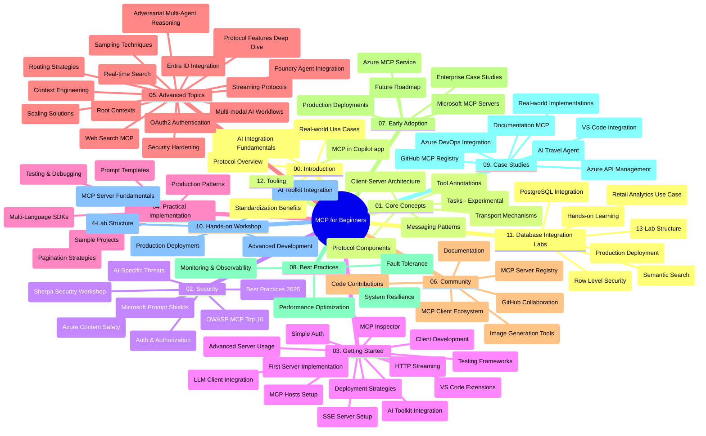

# शुरुआती के लिए मॉडल संदर्भ प्रोटोकॉल (MCP) - अध्ययन मार्गदर्शिका

यह अध्ययन मार्गदर्शिका "शुरुआती के लिए मॉडल संदर्भ प्रोटोकॉल (MCP)" पाठ्यक्रम के लिए रिपॉजिटरी संरचना और सामग्री का अवलोकन प्रदान करती है। इस मार्गदर्शिका का उपयोग रिपॉजिटरी को कुशलतापूर्वक नेविगेट करने के लिए करें और उपलब्ध संसाधनों का सर्वोत्तम लाभ उठाएं।

## रिपॉजिटरी अवलोकन

मॉडल संदर्भ प्रोटोकॉल (MCP) AI मॉडलों और क्लाइंट एप्लिकेशन के बीच इंटरैक्शन के लिए एक मानकीकृत फ्रेमवर्क है। इसे शुरू में Anthropic द्वारा बनाया गया था, अब MCP समुदाय द्वारा आधिकारिक GitHub संगठन के माध्यम से बनाए रखा जाता है। यह रिपॉजिटरी C#, Java, JavaScript, Python, और TypeScript में व्यावहारिक कोड उदाहरणों के साथ व्यापक पाठ्यक्रम प्रदान करती है, जो AI डेवलपर्स, सिस्टम आर्किटेक्ट्स, और सॉफ्टवेयर इंजीनियरों के लिए डिज़ाइन किया गया है।

## दृश्य पाठ्यक्रम मानचित्र

## रिपॉजिटरी संरचना

यह रिपॉजिटरी बारह मुख्य अनुभागों में संगठित है, जो MCP के विभिन्न पहलुओं पर केंद्रित हैं:

1. **परिचय (00-Introduction/)**
   - मॉडल संदर्भ प्रोटोकॉल का अवलोकन
   - AI पाइपलाइनों में मानकीकरण क्यों महत्वपूर्ण है
   - व्यावहारिक उपयोग केस और लाभ

2. **मूल अवधारणाएँ (01-CoreConcepts/)**
   - क्लाइंट-सर्वर वास्तुकला
   - मुख्य प्रोटोकॉल घटक
   - MCP में मैसेजिंग पैटर्न
   - वर्तमान विनिर्देशन: [MCP में क्या बदला: 2026-07-28 विनिर्देशन](./01-CoreConcepts/mcp-2026-07-28.md) — स्टेटलेस प्रोटोकॉल कोर, एक्सटेंशन्स फ्रेमवर्क, और रूट्स/सैम्पलिंग/लॉगिंग डिप्रिकेट्स

3. **सुरक्षा (02-Security/)**
   - MCP-आधारित सिस्टम में सुरक्षा खतरे
   - कार्यान्वयन की सुरक्षा के लिए सर्वोत्तम प्रथाएँ
   - प्रमाणीकरण और प्राधिकरण रणनीतियाँ
   - व्यावहारिक [CIMD और DCR प्राधिकरण नमूना](./02-Security/samples/cimd-dcr-auth/README.md)
   - **व्यापक सुरक्षा दस्तावेज़ीकरण**:
     - MCP सुरक्षा सर्वोत्तम प्रथाएँ
     - Azure कंटेंट सेफ़्टी कार्यान्वयन गाइड
     - MCP सुरक्षा नियंत्रण और तकनीकें
     - MCP सर्वोत्तम प्रथाएँ त्वरित संदर्भ
   - **मुख्य सुरक्षा विषय**:
     - प्रांप्ट इंजेक्शन और टूल पॉइज़निंग हमले
     - सेशन हाईजैकिंग और कंफ्यूज्ड डिप्टी समस्याएँ
     - टोकन पासथ्रू कमजोरियां
     - अत्यधिक अनुमतियाँ और पहुंच नियंत्रण
     - AI घटकों के लिए आपूर्ति श्रृंखला सुरक्षा
     - Microsoft प्रांप्ट शील्ड्स इंटीग्रेशन

4. **शुरुआत करना (03-GettingStarted/)**
   - पर्यावरण सेटअप और कॉन्फ़िगरेशन
   - बुनियादी MCP सर्वर और क्लाइंट बनाना
   - मौजूदा एप्लिकेशन के साथ समाकलन
   - इसमें शामिल हैं:
     - पहला सर्वर कार्यान्वयन
     - क्लाइंट विकास
     - LLM क्लाइंट एकीकरण
     - VS कोड एकीकरण
     - सर्वर-सेंट इवेंट्स (SSE) सर्वर
     - उन्नत सर्वर उपयोग
     - HTTP स्ट्रीमिंग
     - AI टूलकिट एकीकरण
     - परीक्षण रणनीतियाँ
     - परिनियोजन दिशानिर्देश

5. **व्यावहारिक कार्यान्वयन (04-PracticalImplementation/)**
   - विभिन्न प्रोग्रामिंग भाषाओं में SDKs का उपयोग
   - डिबगिंग, परीक्षण, और मान्यकरण तकनीकें
   - पुन: उपयोग योग्य प्रांप्ट टेम्प्लेट और वर्कफ़्लो बनाना
   - कार्यान्वयन उदाहरणों के साथ नमूना परियोजनाएं

6. **उन्नत विषय (05-AdvancedTopics/)**
   - संदर्भ इंजीनियरिंग तकनीकें
   - फाउंड्री एजेंट एकीकरण
   - मल्टी-मॉडल AI वर्कफ़्लो
   - OAuth2 प्रमाणीकरण डेमो
   - रियल-टाइम खोज क्षमताएँ
   - रियल-टाइम स्ट्रीमिंग
   - रूट संदर्भ कार्यान्वयन
   - राउटिंग रणनीतियाँ
   - सैम्पलिंग तकनीकें
   - स्केलिंग दृष्टिकोण
   - सुरक्षा विचार
   - Entra ID सुरक्षा एकीकरण
   - वेब खोज एकीकरण
   - विरोधी बहु-एजेंट तर्क (बहस पैटर्न)

7. **समुदाय योगदान (06-CommunityContributions/)**
   - कोड और दस्तावेज़ीकरण में योगदान कैसे करें
   - GitHub के माध्यम से सहयोग
   - समुदाय संचालित सुधार और प्रतिक्रिया
   - विभिन्न MCP क्लाइंट्स का उपयोग (Claude Desktop, Cline, VSCode)
   - लोकप्रिय MCP सर्वरों के साथ काम करना जिसमें इमेज जनरेशन शामिल है

8. **प्रारंभिक अपनाने से प्राप्त सबक (07-LessonsfromEarlyAdoption/)**
   - वास्तविक दुनिया के कार्यान्वयन और सफलता की कहानियां
   - MCP-आधारित समाधान बनाना और परिनियोजित करना
   - रुझान और भविष्य का रोडमैप
   - **Microsoft MCP सर्वर गाइड**: 10 उत्पादन-तैयार Microsoft MCP सर्वरों का व्यापक गाइड जिसमें शामिल हैं:
     - Microsoft Learn Docs MCP सर्वर
     - Azure MCP सर्वर (15+ विशिष्ट कनेक्टर्स)
     - GitHub MCP सर्वर
     - Azure DevOps MCP सर्वर
     - MarkItDown MCP सर्वर
     - SQL Server MCP सर्वर
     - Playwright MCP सर्वर
     - Dev Box MCP सर्वर
     - Microsoft Foundry MCP सर्वर
     - Microsoft 365 Agents Toolkit MCP सर्वर

9. **सर्वोत्तम प्रथाएँ (08-BestPractices/)**
   - प्रदर्शन ट्यूनिंग और अनुकूलन
   - फॉल्ट-टॉलरेंट MCP सिस्टम डिजाइन करना
   - परीक्षण और लचीलापन रणनीतियाँ

10. **केस स्टडीज़ (09-CaseStudy/)**
    - **सात व्यापक केस स्टडीज** जो विविध परिदृश्यों में MCP की बहुमुखी प्रतिभा दिखाती हैं:
    - **Azure AI ट्रैवल एजेंट्स**: Azure OpenAI और AI खोज के साथ मल्टी-एजेंट ऑर्केस्ट्रेशन
    - **Azure DevOps एकीकरण**: YouTube डेटा अपडेट के साथ वर्कफ़्लो प्रक्रियाओं का स्वचालितकरण
    - **रियल-टाइम दस्तावेज़ पुनःप्राप्ति**: स्ट्रीमिंग HTTP के साथ Python कंसोल क्लाइंट
    - **इंटरैक्टिव अध्ययन योजना जनरेटर**: Chainlit वेब ऐप संवादात्मक AI के साथ
    - **इन-एडिटर दस्तावेज़ीकरण**: GitHub Copilot वर्कफ़्लोज़ के साथ VS कोड एकीकरण
    - **Azure API प्रबंधन**: MCP सर्वर निर्माण के साथ एंटरप्राइज़ API एकीकरण
    - **GitHub MCP रजिस्ट्री**: इकोसिस्टम विकास और एजेंटिक इंटीग्रेशन प्लेटफ़ॉर्म
    - एंटरप्राइज़ एकीकरण, डेवलपर उत्पादकता, और इकोसिस्टम विकास को कवर करने वाले कार्यान्वयन उदाहरण

11. **व्यावहारिक कार्यशाला (10-StreamliningAIWorkflowsBuildingAnMCPServerWithAIToolkit/)**
    - MCP और AI टूलकिट को संयोजित करते हुए व्यापक व्यावहारिक कार्यशाला
    - बुद्धिमान एप्लिकेशन बनाना जो AI मॉडलों को वास्तविक दुनिया के उपकरणों से जोड़ते हैं
    - मूल बातें, कस्टम सर्वर विकास, और उत्पादन परिनियोजन रणनीतियों को कवर करने वाले व्यावहारिक मॉड्यूल
    - **लैब संरचना**:
      - लैब 1: MCP सर्वर मूल बातें
      - लैब 2: उन्नत MCP सर्वर विकास
      - लैब 3: AI टूलकिट एकीकरण
      - लैब 4: उत्पादन परिनियोजन और स्केलिंग
    - चरण-दर-चरण निर्देशों के साथ लैब-आधारित सीखने का दृष्टिकोण

12. **MCP सर्वर डेटाबेस इंटीग्रेशन लैब्स (11-MCPServerHandsOnLabs/)**
    - PostgreSQL इंटीग्रेशन के साथ उत्पादन-तैयार MCP सर्वर बनाने के लिए **व्यापक 13-लैब सीखने का मार्ग**
    - Zava रिटेल उपयोग केस के साथ **वास्तविक दुनिया खुदरा एनालिटिक्स कार्यान्वयन**
    - रो लेवल सुरक्षा (RLS), सैमांटिक खोज, और मल्टी-टेनेंट डेटा एक्सेस सहित **एंटरप्राइज़-ग्रेड पैटर्न**
    - **पूरा लैब संरचना**:
      - **लैब 00-03: आधार** - परिचय, वास्तुकला, सुरक्षा, पर्यावरण सेटअप
      - **लैब 04-06: MCP सर्वर बनाना** - डेटाबेस डिजाइन, MCP सर्वर कार्यान्वयन, टूल विकास

      - **प्रयोगशालाएँ 07-09: उन्नत विशेषताएं** - सेमांटिक सर्च, परीक्षण और डीबगिंग, VS कोड इंटीग्रेशन
      - **प्रयोगशालाएँ 10-12: प्रोडक्शन और सर्वोत्तम प्रथाएँ** - डिप्लॉयमेंट, मॉनिटरिंग, अनुकूलन
    - **आवरण प्रौद्योगिकियां**: FastMCP फ्रेमवर्क, PostgreSQL, Azure OpenAI, Azure कंटेनर ऐप्स, एप्लिकेशन इनसाइट्स
    - **सीखने के परिणाम**: प्रोडक्शन-तैयार MCP सर्वर, डेटाबेस इंटीग्रेशन पैटर्न, AI-चालित विश्लेषण, एंटरप्राइज सुरक्षा

13. **टूलिंग (12-tooling/)**
    - MCP को Copilot ऐप और अन्य टूल्स में कैसे उपयोग करें सीखें

## अतिरिक्त संसाधन

इस रिपॉजिटरी में सहायक संसाधन शामिल हैं:

- **Images फ़ोल्डर**: पाठ्यक्रम में उपयोग किए गए आरेख और चित्र
- **अनुवाद**: दस्तावेज़ीकरण के स्वचालित अनुवाद के साथ बहुभाषी समर्थन
- **आधिकारिक MCP संसाधन**:
  - [MCP Documentation](https://modelcontextprotocol.io/)
  - [MCP Specification](https://modelcontextprotocol.io/specification/2026-07-28/)
  - [MCP GitHub Repository](https://github.com/modelcontextprotocol)

## इस रिपॉजिटरी का उपयोग कैसे करें

1. **क्रमवार शिक्षा**: संरचित शिक्षा अनुभव के लिए अध्यायों को क्रम में (00 से 11 तक) पढ़ें।
2. **भाषा-विशिष्ट फोकस**: यदि आप किसी विशेष प्रोग्रामिंग भाषा में रुचि रखते हैं, तो अपनी पसंदीदा भाषा में कार्यान्वयन के लिए नमूना निर्देशिकाएँ देखें।
3. **प्रायोगिक कार्यान्वयन**: "Getting Started" अनुभाग से शुरू करें ताकि आप अपना पर्यावरण सेट कर सकें और अपना पहला MCP सर्वर और क्लाइंट बना सकें।
4. **उन्नत खोज**: जब बुनियादी बातों में सहज हों, तो अपनी जानकारी बढ़ाने के लिए उन्नत विषयों में डुबकी लगाएं।
5. **समुदाय की भागीदारी**: विशेषज्ञों और साथी डेवलपर्स से जुड़ने के लिए GitHub चर्चाओं और Discord चैनलों के माध्यम से MCP समुदाय में शामिल हों।

## MCP क्लाइंट और टूल्स

पाठ्यक्रम में विभिन्न MCP क्लाइंट और टूल्स शामिल हैं:

1. **आधिकारिक क्लाइंट**:
   - Visual Studio Code 
   - Visual Studio Code में MCP
   - Claude डेस्कटॉप
   - VSCode में Claude 
   - Claude API

2. **समुदाय क्लाइंट**:
   - Cline (टर्मिनल आधारित)
   - Cursor (कोड संपादक)
   - ChatMCP
   - Windsurf

3. **MCP प्रबंधन उपकरण**:
   - MCP CLI
   - MCP Manager
   - MCP Linker
   - MCP Router

## लोकप्रिय MCP सर्वर

इस रिपॉजिटरी में विभिन्न MCP सर्वर प्रस्तुत किए गए हैं, जिनमें शामिल हैं:

1. **आधिकारिक Microsoft MCP सर्वर**:
   - Microsoft Learn Docs MCP सर्वर
   - Azure MCP सर्वर (15+ विशेष कनेक्टर)
   - GitHub MCP सर्वर
   - Azure DevOps MCP सर्वर
   - MarkItDown MCP सर्वर
   - SQL Server MCP सर्वर
   - Playwright MCP सर्वर
   - Dev Box MCP सर्वर
   - Microsoft Foundry MCP सर्वर
   - Microsoft 365 Agents Toolkit MCP सर्वर

2. **आधिकारिक संदर्भ सर्वर**:
   - Filesystem
   - Fetch
   - Memory
   - Sequential Thinking

3. **छवि उत्पादन**:
   - Azure OpenAI DALL-E 3
   - Stable Diffusion WebUI
   - Replicate

4. **डेवलपमेंट टूल्स**:
   - Git MCP
   - Terminal Control
   - Code Assistant

5. **विशेषीकृत सर्वर**:
   - Salesforce
   - Microsoft Teams
   - Jira & Confluence

## योगदान देना

यह रिपॉजिटरी समुदाय से योगदान स्वीकार करती है। MCP इकोसिस्टम में प्रभावी योगदान के लिए समुदाय योगदान अनुभाग देखें।

----

*यह अध्ययन गाइड अंतिम बार 9 सितंबर, 2026 को अपडेट किया गया था। यह MCP
विनिर्देशन `2026-07-28`, वर्तमान प्रोटोकॉल संशोधन को दर्शाता है। कुछ हाथों-हाथ
उदाहरण स्पष्ट रूप से `2025-11-25` तक संस्करणित हैं जबकि उनके SDK और टूल्स
स्थिति-रहित प्रोटोकॉल API को अपनाते हैं।*

---

<!-- CO-OP TRANSLATOR DISCLAIMER START -->
**अस्वीकरण**:
इस दस्तावेज़ का अनुवाद AI अनुवाद सेवा [Co-op Translator](https://github.com/Azure/co-op-translator) का उपयोग करके किया गया है। जबकि हम सटीकता के लिए प्रयास करते हैं, कृपया ध्यान दें कि स्वचालित अनुवादों में त्रुटियाँ या अशुद्धियाँ हो सकती हैं। मूल दस्तावेज़ अपनी मूल भाषा में ही प्रामाणिक स्रोत माना जाना चाहिए। महत्वपूर्ण जानकारी के लिए, पेशेवर मानव अनुवाद की सिफारिश की जाती है। इस अनुवाद के उपयोग से उत्पन्न किसी भी गलतफहमी या गलत व्याख्या के लिए हम उत्तरदायी नहीं हैं।
<!-- CO-OP TRANSLATOR DISCLAIMER END -->