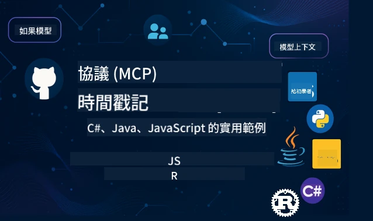

<!--
CO_OP_TRANSLATOR_METADATA:
{
  "original_hash": "35240f904db8c08d6198f6f15767d218",
  "translation_date": "2026-01-14T15:23:48+00:00",
  "source_file": "README.md",
  "language_code": "hk"
}
-->
 

[](https://GitHub.com/microsoft/mcp-for-beginners/graphs/contributors)
[](https://GitHub.com/microsoft/mcp-for-beginners/issues)
[](https://GitHub.com/microsoft/mcp-for-beginners/pulls)
[](http://makeapullrequest.com)

[](https://GitHub.com/microsoft/mcp-for-beginners/watchers)
[](https://GitHub.com/microsoft/mcp-for-beginners/fork)
[](https://GitHub.com/microsoft/mcp-for-beginners/stargazers)


[](https://discord.gg/nTYy5BXMWG)

Follow these steps to get started using these resources:
1. **Fork the Repository**: Click [](https://GitHub.com/microsoft/mcp-for-beginners/fork)
2. **Clone the Repository**:   `git clone https://github.com/microsoft/mcp-for-beginners.git`
3. **Join The** [](https://discord.gg/nTYy5BXMWG)


### 🌐 多語言支援

#### 透過 GitHub Action 支援（自動化且隨時更新）

<!-- CO-OP TRANSLATOR LANGUAGES TABLE START -->
[Arabic](../ar/README.md) | [Bengali](../bn/README.md) | [Bulgarian](../bg/README.md) | [Burmese (Myanmar)](../my/README.md) | [Chinese (Simplified)](../zh/README.md) | [Chinese (Traditional, Hong Kong)](./README.md) | [Chinese (Traditional, Macau)](../mo/README.md) | [Chinese (Traditional, Taiwan)](../tw/README.md) | [Croatian](../hr/README.md) | [Czech](../cs/README.md) | [Danish](../da/README.md) | [Dutch](../nl/README.md) | [Estonian](../et/README.md) | [Finnish](../fi/README.md) | [French](../fr/README.md) | [German](../de/README.md) | [Greek](../el/README.md) | [Hebrew](../he/README.md) | [Hindi](../hi/README.md) | [Hungarian](../hu/README.md) | [Indonesian](../id/README.md) | [Italian](../it/README.md) | [Japanese](../ja/README.md) | [Kannada](../kn/README.md) | [Korean](../ko/README.md) | [Lithuanian](../lt/README.md) | [Malay](../ms/README.md) | [Malayalam](../ml/README.md) | [Marathi](../mr/README.md) | [Nepali](../ne/README.md) | [Nigerian Pidgin](../pcm/README.md) | [Norwegian](../no/README.md) | [Persian (Farsi)](../fa/README.md) | [Polish](../pl/README.md) | [Portuguese (Brazil)](../br/README.md) | [Portuguese (Portugal)](../pt/README.md) | [Punjabi (Gurmukhi)](../pa/README.md) | [Romanian](../ro/README.md) | [Russian](../ru/README.md) | [Serbian (Cyrillic)](../sr/README.md) | [Slovak](../sk/README.md) | [Slovenian](../sl/README.md) | [Spanish](../es/README.md) | [Swahili](../sw/README.md) | [Swedish](../sv/README.md) | [Tagalog (Filipino)](../tl/README.md) | [Tamil](../ta/README.md) | [Telugu](../te/README.md) | [Thai](../th/README.md) | [Turkish](../tr/README.md) | [Ukrainian](../uk/README.md) | [Urdu](../ur/README.md) | [Vietnamese](../vi/README.md)

> **想本地 Clone？**

> 此倉庫包含 50 多種語言翻譯，會大幅增加下載大小。若想不帶翻譯地 Clone，請使用 sparse checkout：
> ```bash
> git clone --filter=blob:none --sparse https://github.com/microsoft/mcp-for-beginners.git
> cd mcp-for-beginners
> git sparse-checkout set --no-cone '/*' '!translations' '!translated_images'
> ```
> 這樣可以讓你以更快速的速度下載，且具備完成課程所需全部內容。
<!-- CO-OP TRANSLATOR LANGUAGES TABLE END -->

# 🚀 Model Context Protocol (MCP) 新手課程

## **使用 C#、Java、JavaScript、Rust、Python 和 TypeScript 的實作範例學習 MCP**

## 🧠 Model Context Protocol 課程概述
歡迎展開你的 Model Context Protocol 之旅！如果你曾好奇 AI 應用程式如何與不同工具和服務溝通，現在你即將發現這個改變開發者構建智能系統的優雅解決方案。

可以把 MCP 想像成 AI 應用的萬用翻譯器——就像 USB 埠能讓你將任何裝置連接到電腦，MCP 讓 AI 模型以標準化的方式連接到任何工具或服務。不論你是要建立第一個聊天機器人，還是在打造複雜的 AI 工作流程，了解 MCP 將賦予你打造更強大、更靈活應用的能力。

此課程設計周全，耐心引導你的學習旅程。從你已熟悉的簡單概念開始，並透過實作逐步累積專業技能。每個階段都包含清晰說明、實務範例以及不斷的鼓勵。

完成此旅程時，你將有信心自行建立 MCP 伺服器，將它們整合到流行的 AI 平台，並了解這項技術如何重新塑造 AI 開發的未來。讓我們一起開始這段令人振奮的冒險吧！

### 官方文件與規範

這些資源隨著你理解的加深而變得更有價值，但不必急著立刻閱讀全部內容。請先從你最感興趣的領域開始！
- 📘 [MCP 文件](https://modelcontextprotocol.io/) – 這是你逐步教學與使用指南的首選資源。文件專為初學者撰寫，提供明確的範例讓你依照自己的節奏學習。
- 📜 [MCP 規範](https://modelcontextprotocol.io/docs/) – 把它當作你的完整參考手冊。當你學習課程時，你會常回來查閱特定細節並探索進階功能。
- 📜 [原始 MCP 規範](https://modelcontextprotocol.io/specification/versioning) – 這裡含有其他技術細節，對於進階實作相當有幫助。初期不必擔心，可以等需要時再參考。
- 🧑‍💻 [MCP GitHub 倉庫](https://github.com/modelcontextprotocol) – 你可以在這裡找到多種程式語言的 SDK、工具和程式範例，是實作範例與現成元件的寶庫。
- 🌐 [MCP 社群](https://github.com/orgs/modelcontextprotocol/discussions) – 加入一起討論 MCP 的學習者與經驗豐富的開發者行列。這是一個支持性強、歡迎提問、知識自由分享的社群。
  
## 學習目標

完成本課程後，你將感到自信並對新技能充滿熱情。你會達成以下目標：

• **理解 MCP 基礎**：你會明白什麼是 Model Context Protocol，以及它如何革命性地改變 AI 應用相互合作的方式，搭配易懂的比喻與範例。

• **建置你的第一個 MCP 伺服器**：你將用偏好的程式語言，從簡單範例開始逐步建構一個能運作的 MCP 伺服器。

• **連接 AI 模型與真實工具**：學會架起 AI 模型與實際服務之間的橋樑，賦予應用強大的新功能。

• **實作安全最佳實踐**：了解如何使你的 MCP 實現安全防護，保護應用與使用者。

• **自信部署**：掌握從開發到生產環境的實用部署策略，讓你的專案在真實世界中穩健運作。

• **加入 MCP 社群**：成為不斷壯大的開發者社群一員，共同塑造 AI 應用開發的未來。

## 必備背景知識

在深入 MCP 細節前，讓我們先熟悉一些基礎概念。若你這些領域不是專家也不用擔心，我們會在過程中逐步說明你需要知道的一切！

### 理解協議（基礎）

把協議想像成對話的規則。當你打電話給朋友時，雙方都知道接聽時要說「你好」，講話要輪流，結束時說「再見」。電腦程式也需要類似的規則才能有效溝通。

MCP 是一套協議——即一組約定好的規則，幫助 AI 模型與應用程式能順利與工具和服務「對話」。就像有對話規則讓人類溝通更順暢，MCP 讓 AI 應用溝通更可靠且強大。

### 用戶端-伺服器關係（程式如何合作）

你每天都在使用用戶端-伺服器關係！當你用瀏覽器（用戶端）瀏覽網站，就是連接到送出頁面內容的網站伺服器。瀏覽器知道怎麼請求資料，伺服器知道怎麼回應。

MCP 中也有類似關係：AI 模型充當請求資料或動作的用戶端，而 MCP 伺服器提供這些能力。就像 AI 有一位得力助手（伺服器）幫忙執行特定任務。

### 為何標準化重要（讓不同事物能協作）

想像若每家汽車製造商都用不同形狀的加油槍，你就需要不同的轉接器！標準化就是大家同意用通用方式，讓元件可無縫協作。

MCP 為 AI 應用提供了這種標準化。不是讓每個 AI 模型都要為每個工具寫特別程式碼，而是建立萬用溝通方式。這表示開發者寫一次工具，就能讓許多不同 AI 系統使用。

## 🧭 你的學習路徑概覽

你的 MCP 之旅經過精心設計，能逐步建立信心和技能。每個階段介紹新概念，同時鞏固已有的學習。

### 🌱 基礎階段：理解基本觀念（模組 0-2）

這裡是冒險的起點！會用熟悉的比喻和簡單示例帶你認識 MCP。你會了解 MCP 是什麼、為何存在、以及它在 AI 開發大局中的位置。

• **模組 0 - MCP 簡介**：從探索 MCP 是什麼開始，說明它為現代 AI 應用的重要性。你會看到 MCP 的實際應用範例，與如何解決開發者常見問題。

• **模組 1 - 核心概念解說**：學習 MCP 的基本建構塊。我們會用大量比喻與圖像範例，讓概念自然且易於理解。

• **模組 2 - MCP 中的安全性**：安全聽起來嚇人，但我們會示範 MCP 如何內建安全功能，並教你從一開始就建立安全的最佳實務。

### 🔨 建置階段：創建你的第一個實作（模組 3）

真正的樂趣從現在開始！你將實際動手建置 MCP 伺服器和用戶端。別擔心，我們會從簡單起步，並逐步引導你完成每一步。

本模組包含多個實作指南，讓你用偏好的程式語言練習。你會建立第一台伺服器、建構連接它的用戶端，甚至整合流行開發工具如 VS Code。

每份指南都有完整程式碼範例、故障排除技巧，以及設計決策解說。完成此階段時，你將擁有可運作的 MCP 實作，令人引以為傲！
### 🚀 成長階段：進階概念與實戰應用（模組 4-5）

掌握了基礎後，你已準備好探索更複雜的 MCP 功能。我們將涵蓋實際實作策略、除錯技巧以及多模態 AI 整合等進階主題。

你還會學習如何將 MCP 實作擴展到生產環境，並與 Azure 等雲端平台整合。這些模組將幫助你打造能應付真實需求的 MCP 解決方案。

### 🌟 精通階段：社群與專精（模組 6-11）

最後階段著重於加入 MCP 社群及專攻你最感興趣的領域。你將學習如何貢獻開源 MCP 專案、實現進階身份驗證模式，及構建完備的資料庫整合方案。

值得一提的是模組 11——一套包含 13 個實作實驗的完整動手學習路徑，教你如何打造具備 PostgreSQL 整合的生產級 MCP 伺服器。這就像一個總結企劃，將你所學的全部串連起來！

### 📚 完整課程結構

| 模組 | 主題 | 描述 | 連結 |
|--------|-------|-------------|------|
| **模組 1-3：基礎** | | | |
| 00 | MCP 簡介 | Model Context Protocol 介紹及其在 AI 流程中的重要性 | [閱讀更多](./00-Introduction/README.md) |
| 01 | 核心概念詳解 | 深入探討 MCP 的核心概念 | [閱讀更多](./01-CoreConcepts/README.md) |
| 02 | MCP 安全性 | 安全威脅與最佳實踐 | [閱讀更多](./02-Security/README.md) |
| 03 | MCP 入門 | 環境設定、基礎伺服器/客戶端、整合教學 | [閱讀更多](./03-GettingStarted/README.md) |
| **模組 3：打造你的第一個伺服器與客戶端** | | | |
| 3.1 | 第一個伺服器 | 創建你的第一個 MCP 伺服器 | [指南](./03-GettingStarted/01-first-server/README.md) |
| 3.2 | 第一個客戶端 | 開發基礎 MCP 客戶端 | [指南](./03-GettingStarted/02-client/README.md) |
| 3.3 | 帶大型語言模型的客戶端 | 整合大型語言模型 | [指南](./03-GettingStarted/03-llm-client/README.md) |
| 3.4 | VS Code 整合 | 在 VS Code 中使用 MCP 伺服器 | [指南](./03-GettingStarted/04-vscode/README.md) |
| 3.5 | stdio 伺服器 | 使用 stdio 傳輸建立伺服器 | [指南](./03-GettingStarted/05-stdio-server/README.md) |
| 3.6 | HTTP 串流 | 實作 MCP 的 HTTP 串流功能 | [指南](./03-GettingStarted/06-http-streaming/README.md) |
| 3.7 | AI 工具包 | 搭配 AI Toolkit 使用 MCP | [指南](./03-GettingStarted/07-aitk/README.md) |
| 3.8 | 測試 | 測試你的 MCP 伺服器實作 | [指南](./03-GettingStarted/08-testing/README.md) |
| 3.9 | 部署 | 部署 MCP 伺服器到生產環境 | [指南](./03-GettingStarted/09-deployment/README.md) |
| 3.10 | 進階伺服器使用 | 利用進階伺服器實現更多功能與改良架構 | [指南](./03-GettingStarted/10-advanced/README.md) |
| 3.11 | 簡易認證 | 從頭開始教你認證與 RBAC | [指南](./03-GettingStarted/11-simple-auth/README.md) |
| **模組 4-5：實務與進階** | | | |
| 04 | 實務應用 | SDK、除錯、測試、可重用提示模板 | [閱讀更多](./04-PracticalImplementation/README.md) |
| 05 | MCP 進階主題 | 多模態 AI、擴展與企業應用 | [閱讀更多](./05-AdvancedTopics/README.md) |
| 5.1 | Azure 整合 | MCP 與 Azure 整合 | [指南](./05-AdvancedTopics/mcp-integration/README.md) |
| 5.2 | 多模態 | 多模態工作 | [指南](./05-AdvancedTopics/mcp-multi-modality/README.md) |
| 5.3 | OAuth2 示範 | 實作 OAuth2 認證 | [指南](./05-AdvancedTopics/mcp-oauth2-demo/README.md) |
| 5.4 | 根上下文 | 理解並實作根上下文 | [指南](./05-AdvancedTopics/mcp-root-contexts/README.md) |
| 5.5 | 路由 | MCP 路由策略 | [指南](./05-AdvancedTopics/mcp-routing/README.md) |
| 5.6 | 採樣 | MCP 採樣技巧 | [指南](./05-AdvancedTopics/mcp-sampling/README.md) |
| 5.7 | 擴展 | MCP 實作擴展 | [指南](./05-AdvancedTopics/mcp-scaling/README.md) |
| 5.8 | 安全 | 進階安全考量 | [指南](./05-AdvancedTopics/mcp-security/README.md) |
| 5.9 | 網頁搜尋 | 實作網頁搜尋功能 | [指南](./05-AdvancedTopics/web-search-mcp/README.md) |
| 5.10 | 即時串流 | 建立即時串流功能 | [指南](./05-AdvancedTopics/mcp-realtimestreaming/README.md) |
| 5.11 | 即時搜尋 | 實作即時搜尋 | [指南](./05-AdvancedTopics/mcp-realtimesearch/README.md) |
| 5.12 | Entra ID 認證 | 使用 Microsoft Entra ID 認證 | [指南](./05-AdvancedTopics/mcp-security-entra/README.md) |
| 5.13 | Foundry 整合 | 與 Azure AI Foundry 整合 | [指南](./05-AdvancedTopics/mcp-foundry-agent-integration/README.md) |
| 5.14 | 上下文工程 | 有效上下文工程技巧 | [指南](./05-AdvancedTopics/mcp-contextengineering/README.md) |
| 5.15 | MCP 自訂傳輸 | 自訂傳輸實作 | [指南](./05-AdvancedTopics/mcp-transport/README.md) |
| **模組 6-10：社群與最佳實踐** | | | |
| 06 | 社群貢獻 | 如何貢獻 MCP 生態系 | [指南](./06-CommunityContributions/README.md) |
| 07 | 早期採用心得 | 真實案例分享 | [指南](./07-LessonsFromEarlyAdoption/README.md) |
| 08 | MCP 最佳實踐 | 效能、容錯、韌性 | [指南](./08-BestPractices/README.md) |
| 09 | MCP 個案研究 | 實務實作範例 | [指南](./09-CaseStudy/README.md) |
| 10 | 動手工作坊 | 使用 AI Toolkit 構建 MCP 伺服器 | [實驗](./10-StreamliningAIWorkflowsBuildingAnMCPServerWithAIToolkit/README.md) |
| **模組 11：MCP 伺服器實作實驗** | | | |
| 11 | MCP 伺服器資料庫整合 | 具 PostgreSQL 整合的 13 個實作實驗綜合學習路徑 | [實驗](./11-MCPServerHandsOnLabs/README.md) |
| 11.1 | 簡介 | MCP 與資料庫整合概述及零售分析案例 | [實驗 00](./11-MCPServerHandsOnLabs/00-Introduction/README.md) |
| 11.2 | 核心架構 | MCP 伺服器架構、資料庫層與安全模式理解 | [實驗 01](./11-MCPServerHandsOnLabs/01-Architecture/README.md) |
| 11.3 | 安全與多租戶 | 行級安全、認證及多租戶資料存取 | [實驗 02](./11-MCPServerHandsOnLabs/02-Security/README.md) |
| 11.4 | 環境設定 | 開發環境設定、Docker、Azure 資源 | [實驗 03](./11-MCPServerHandsOnLabs/03-Setup/README.md) |
| 11.5 | 資料庫設計 | PostgreSQL 設定、零售模式設計與範例資料 | [實驗 04](./11-MCPServerHandsOnLabs/04-Database/README.md) |
| 11.6 | MCP 伺服器實作 | 建置具資料庫整合的 FastMCP 伺服器 | [實驗 05](./11-MCPServerHandsOnLabs/05-MCP-Server/README.md) |
| 11.7 | 工具開發 | 建立資料庫查詢工具與模式檢視 | [實驗 06](./11-MCPServerHandsOnLabs/06-Tools/README.md) |
| 11.8 | 語義搜尋 | 利用 Azure OpenAI 及 pgvector 實作向量嵌入 | [實驗 07](./11-MCPServerHandsOnLabs/07-Semantic-Search/README.md) |
| 11.9 | 測試與除錯 | 測試策略、除錯工具與驗證方法 | [實驗 08](./11-MCPServerHandsOnLabs/08-Testing/README.md) |
| 11.10 | VS Code 整合 | VS Code MCP 整合及 AI 聊天使用設定 | [實驗 09](./11-MCPServerHandsOnLabs/09-VS-Code/README.md) |
| 11.11 | 部署策略 | Docker 部署、Azure Container Apps 與擴展考量 | [實驗 10](./11-MCPServerHandsOnLabs/10-Deployment/README.md) |
| 11.12 | 監控 | Application Insights、日誌與效能監控 | [實驗 11](./11-MCPServerHandsOnLabs/11-Monitoring/README.md) |
| 11.13 | 最佳實務 | 效能優化、安全強化與生產建議 | [實驗 12](./11-MCPServerHandsOnLabs/12-Best-Practices/README.md) |

### 💻 範例程式專案

學習 MCP 最令人興奮的部分之一是看到自己的程式技能逐步提昇。我們設計的程式範例由淺入深，隨理解度逐漸加深而變得更複雜。這裡是我們如何引介概念的方式—用易懂的程式碼示範真實 MCP 原理，不只讓你理解程式運作，更能了解此結構背後的原因及其在更大型 MCP 應用中的角色。

#### 基本 MCP 計算器範例

| 語言 | 描述 | 連結 |
|----------|-------------|------|
| C# | MCP 伺服器範例 | [查看程式碼](./03-GettingStarted/samples/csharp/README.md) |
| Java | MCP 計算器 | [查看程式碼](./03-GettingStarted/samples/java/calculator/README.md) |
| JavaScript | MCP 示範 | [查看程式碼](./03-GettingStarted/samples/javascript/README.md) |
| Python | MCP 伺服器 | [查看程式碼](../../03-GettingStarted/samples/python/mcp_calculator_server.py) |
| TypeScript | MCP 範例 | [查看程式碼](./03-GettingStarted/samples/typescript/README.md) |
| Rust | MCP 範例 | [查看程式碼](./03-GettingStarted/samples/rust/README.md) |

#### 進階 MCP 實作範例

| 語言 | 描述 | 連結 |
|----------|-------------|------|
| C# | 進階範例 | [查看程式碼](./04-PracticalImplementation/samples/csharp/README.md) |
| Java（Spring） | Container App 範例 | [查看程式碼](./04-PracticalImplementation/samples/java/containerapp/README.md) |
| JavaScript | 進階範例 | [查看程式碼](./04-PracticalImplementation/samples/javascript/README.md) |
| Python | 複雜實作 | [查看程式碼](../../04-PracticalImplementation/samples/python/READMEmd) |
| TypeScript | Container 範例 | [查看程式碼](./04-PracticalImplementation/samples/typescript/README.md) |


## 🎯 MCP 學習先備條件

為了充分利用此課程，你應有以下條件：

- 熟悉其中一種程式語言的基礎（C#、Java、JavaScript、Python 或 TypeScript）
- 了解客戶端－伺服器模型及 API
- 熟悉 REST 與 HTTP 概念
- （可選）具 AI/ML 相關背景知識

- 加入我們的社群討論獲得支持

## 📚 學習指南與資源

本資源庫包含多種資源助你順利學習：

### 學習指南

有一份完整的 [學習指南](./study_guide.md) 幫助你有效導航此資源庫。此視覺化課程地圖展現所有主題間的聯繫，且指導如何有效使用範例專案。特別適合喜歡從大局觀學習的視覺型學習者。

指南內容包含：
- 以視覺化課程圖呈現涵蓋的所有主題
- 詳細解析每個資源庫區塊
- 使用範例專案的指導
- 依技能層級推薦的學習路徑
- 其他補充資源

### 變更記錄

我們維護一份詳細的 [變更記錄](./changelog.md)，追蹤課程素材的所有重大更新，讓你緊跟最新改進與新增功能。
- 新增內容
- 結構變更
- 功能改良
- 文件更新

## 🛠️ 如何有效使用此課程

本指南中每課包含：

1. 清晰的 MCP 概念解釋  
2. 多語言現場程式範例  
3. 實作 MCP 真實應用的練習  
4. 進階學習者的額外資源
## 按需內容

### [MCP 開發日 2025 年 7 月](https://developer.microsoft.com/en-us/reactor/series/S-1563/)
#### [➡️ 按需觀看 - MCP 開發日](https://developer.microsoft.com/en-us/reactor/series/S-1563/)
準備迎接為期兩天的深度技術洞察、社群連接和實作學習，MCP 開發日是一個專注於 Model Context Protocol (MCP) 的虛擬活動 — 一個新興標準，連接 AI 模型及其所依賴的工具。
你可以通過我們的活動頁面註冊觀看 MCP 開發日：https://aka.ms/mcpdevdays。

#### [第一天：MCP 生產力、開發工具與社群：](https://developer.microsoft.com/en-us/reactor/series/S-1563/)
專注於賦能開發者在他們的開發工作流程中使用 MCP，並慶祝精彩的 MCP 社群。我們將與 Arcade、Block、Okta 和 Neon 等社群成員與合作夥伴一同見證他們如何與 Microsoft 協作，共同塑造一個開放、可擴展的 MCP 生態系統。實際案例示範涵蓋 VS Code、Visual Studio、GitHub Copilot 以及人氣社群工具。
- 實用的上下文驅動開發工作流程
- 社群主導的議程與洞見
無論你剛開始接觸 MCP，還是已經在使用它進行開發，第一天都將以啟發與可行的收穫為你奠定基礎。

#### [第二天：自信地建立 MCP 伺服器](https://developer.microsoft.com/en-us/reactor/series/S-1563/)
專為 MCP 建置者設計。我們將深入探討 MCP 伺服器的實作策略與最佳實踐，並介紹如何將 MCP 整合進你的 AI 工作流程。

#### 主題包括：

- 建立 MCP 伺服器並整合到代理體驗
- 以 prompt 為驅動的開發
- 安全最佳實踐
- 使用功能組件如 Functions、ACA 和 API 管理
- 註冊表對齊與工具 (1P + 3P)

如果你是開發者、工具開發者或 AI 產品策略師，這天滿載你建立可擴展、安全且面向未來的 MCP 解決方案所需的見解。

### MCP 強化營 2025 年 8 月
透過密集的影片課程學習如何建立 MCP 伺服器、與 VS Code 整合，並基於 MCP 初學者課程內容在 Azure 上專業部署。學習後你將掌握大型公司已在使用的實用技能。

#### [➡️ 按需觀看 MCP 強化營 | 英文](https://developer.microsoft.com/en-us/reactor/series/s-1568/)
#### [➡️ 按需觀看 MCP 強化營 | 巴西葡萄牙語](https://developer.microsoft.com/en-us/reactor/series/S-1566/)
#### [➡️ 按需觀看 MCP 強化營 | 西班牙語](https://developer.microsoft.com/en-us/reactor/series/S-1567/)

### 一起學 MCP 與 C# - 教學系列
讓我們一起學習 Model Context Protocol (MCP)，一個前沿框架，旨在標準化 AI 模型與客戶端應用程序之間的互動。在這個為初學者設計的課程中，我們將介紹 MCP 並指導你創建第一個 MCP 伺服器。
#### C#: [https://aka.ms/letslearnmcp-csharp](https://aka.ms/letslearnmcp-csharp)
#### Java: [https://aka.ms/letslearnmcp-java](https://aka.ms/letslearnmcp-java)
#### JavaScript: [https://aka.ms/letslearnmcp-javascript](https://aka.ms/letslearnmcp-javascript)
#### Python: [https://aka.ms/letslearnmcp-python](https://aka.ms/letslearnmcp-python)

## 🎓 你的 MCP 之旅開始了

恭喜你！你剛邁出了令人振奮的第一步，這將擴展你的程式設計能力，並讓你連接 AI 開發的尖端領域。

### 你已經取得的成就

通過閱讀此介紹，你已經開始建立 MCP 知識基礎。你了解 MCP 是什麼、為何重要，以及這個課程如何支持你的學習旅程。這是一項重大成就，也是你在這項重要技術中專業能力的起點。

### 未來的冒險

隨著你進入各個模組，請記得每位專家曾經都是初學者。現在看似複雜的概念，隨著實踐與應用，將成為你的第二天性。每一小步都累積為強大的能力，將支援你整個開發生涯。

### 你的支援網絡

你正在加入一個熱情的 MCP 學習者與專家社群，他們熱衷並願意協助他人成功。無論你在編碼挑戰中遇到困難，還是想分享突破，社群都在此支持你的旅程。

如果你遇到困難或對建立 AI 應用有任何問題，加入 MCP 學習者和經驗豐富開發者的討論。這是一個友善且知識共享的社群。

[](https://discord.gg/nTYy5BXMWG)

如果你有產品回饋或建置時發生錯誤，請造訪：

[](https://aka.ms/foundry/forum)

### 準備好開始了嗎？

你的 MCP 冒險從現在開始！從模組 0 開始，投入你的第一個 MCP 實作體驗，或探索範例專案看看你將打造的內容。記住 — 每位專家都從你現在的位置起步，憑著耐心與練習，你將驚奇於自己的成就。

歡迎來到 Model Context Protocol 開發的世界。讓我們一起打造驚奇！

## 🤝 共同促進學習社群

這門課程因像你一樣的學習者貢獻而更強大！無論是修正打字錯誤、建議更清晰的解釋，或新增範例，你的貢獻都幫助其他初學者成功。

感謝 Microsoft 有價值專業人士 [Shivam Goyal](https://www.linkedin.com/in/shivam2003/) 貢獻程式碼範例。

貢獻流程設計友善且支持性強。大多數貢獻需簽署貢獻者授權協議 (CLA)，但自動工具將順利引導你完成流程。

## 📜 開源學習

整個課程皆在 MIT [LICENSE](../../LICENSE) 許可下提供，意即你可以自由使用、修改和分享。本計劃支持讓 MCP 知識普及至全球開發者。

## 🤝 貢獻指南

本專案歡迎貢獻與建議。大部分貢獻需你同意
一份貢獻者授權協議 (CLA)，聲明你有權且確實授予我們使用你的貢獻權利。詳情請見 <https://cla.opensource.microsoft.com>。

當你提交拉取請求時，CLA 機器人會自動判定你是否需提供CLA，並適當標記 PR（如狀態檢查、留言）。只需遵循機器人指示。此過程在使用我們 CLA 的所有程式庫中只需完成一次。

本專案已採用 [Microsoft 開源行為準則](https://opensource.microsoft.com/codeofconduct/)。 
欲了解更多請參閱 [行為準則常見問題](https://opensource.microsoft.com/codeofconduct/faq/) 或 
透過 [opencode@microsoft.com](mailto:opencode@microsoft.com) 聯絡我們，提出任何疑問或意見。

---

*準備好開始你的 MCP 旅程了嗎？從 [模組 00 - MCP 介紹](./00-Introduction/README.md) 開始，踏出你在 Model Context Protocol 開發世界的第一步！*

## 🎒 其他課程
我們團隊還開設其他課程！快來看看：

<!-- CO-OP TRANSLATOR OTHER COURSES START -->
### LangChain
[](https://aka.ms/langchain4j-for-beginners)
[](https://aka.ms/langchainjs-for-beginners?WT.mc_id=m365-94501-dwahlin)

---

### Azure / Edge / MCP / 代理人
[](https://github.com/microsoft/AZD-for-beginners?WT.mc_id=academic-105485-koreyst)
[](https://github.com/microsoft/edgeai-for-beginners?WT.mc_id=academic-105485-koreyst)
[](https://github.com/microsoft/mcp-for-beginners?WT.mc_id=academic-105485-koreyst)
[](https://github.com/microsoft/ai-agents-for-beginners?WT.mc_id=academic-105485-koreyst)

---

### 生成式 AI 系列
[](https://github.com/microsoft/generative-ai-for-beginners?WT.mc_id=academic-105485-koreyst)
[-9333EA?style=for-the-badge&labelColor=E5E7EB&color=9333EA)](https://github.com/microsoft/Generative-AI-for-beginners-dotnet?WT.mc_id=academic-105485-koreyst)
[-C084FC?style=for-the-badge&labelColor=E5E7EB&color=C084FC)](https://github.com/microsoft/generative-ai-for-beginners-java?WT.mc_id=academic-105485-koreyst)
[-E879F9?style=for-the-badge&labelColor=E5E7EB&color=E879F9)](https://github.com/microsoft/generative-ai-with-javascript?WT.mc_id=academic-105485-koreyst)

---

### 核心學習
[](https://aka.ms/ml-beginners?WT.mc_id=academic-105485-koreyst)
[](https://aka.ms/datascience-beginners?WT.mc_id=academic-105485-koreyst)
[](https://aka.ms/ai-beginners?WT.mc_id=academic-105485-koreyst)
[](https://github.com/microsoft/Security-101?WT.mc_id=academic-96948-sayoung)
[](https://aka.ms/webdev-beginners?WT.mc_id=academic-105485-koreyst)
[](https://aka.ms/iot-beginners?WT.mc_id=academic-105485-koreyst)
[](https://github.com/microsoft/xr-development-for-beginners?WT.mc_id=academic-105485-koreyst)

---

### Copilot 系列
[](https://aka.ms/GitHubCopilotAI?WT.mc_id=academic-105485-koreyst)
[](https://github.com/microsoft/mastering-github-copilot-for-dotnet-csharp-developers?WT.mc_id=academic-105485-koreyst)
[](https://github.com/microsoft/CopilotAdventures?WT.mc_id=academic-105485-koreyst)
<!-- CO-OP TRANSLATOR OTHER COURSES END -->

---

<!-- CO-OP TRANSLATOR DISCLAIMER START -->
**免責聲明**：  
本文件係使用 AI 翻譯服務 [Co-op Translator](https://github.com/Azure/co-op-translator) 進行翻譯。雖然我們力求準確，但請注意，自動翻譯可能存在錯誤或不準確之處。原始文件的母語版本應視為權威來源。對於重要資訊，建議採用專業人工翻譯。我們對因使用本翻譯而產生的任何誤解或誤釋概不負責。
<!-- CO-OP TRANSLATOR DISCLAIMER END -->