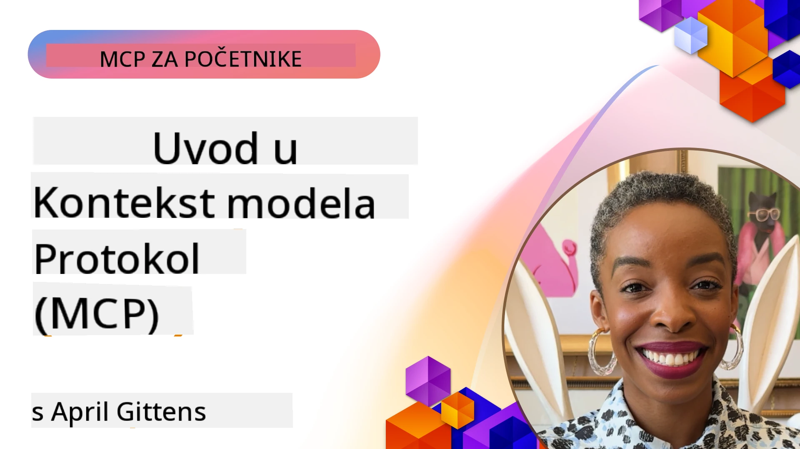
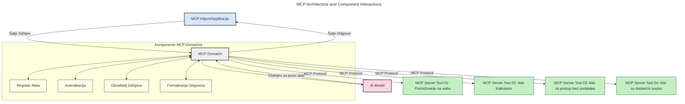
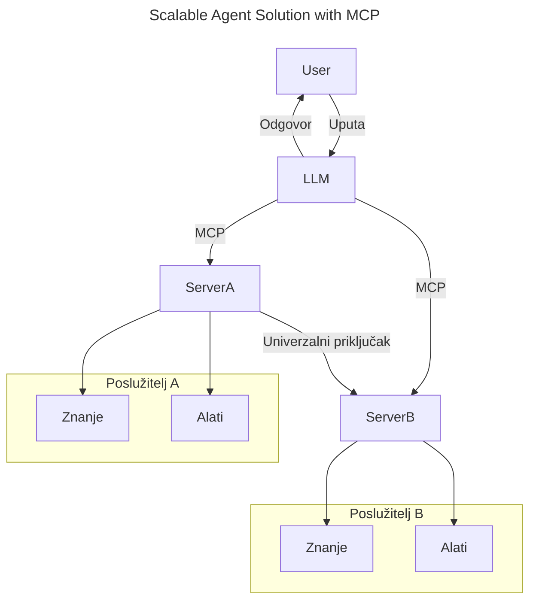
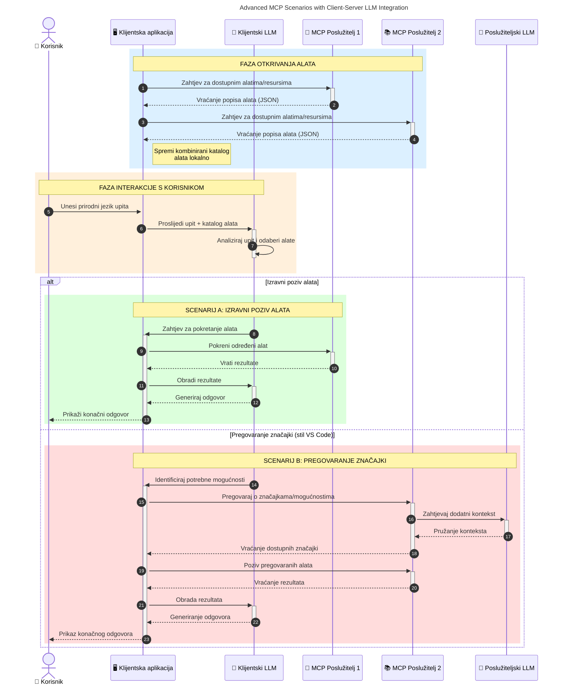

# Uvod u Model Context Protocol (MCP): Zašto je važan za skalabilne AI aplikacije

_(Kliknite na gornju sliku za pregled video lekcije)_

Generativne AI aplikacije predstavljaju velik korak naprijed jer korisnicima često omogućuju interakciju s aplikacijom koristeći prirodne jezične naredbe. Međutim, kako se ulaže više vremena i resursa u takve aplikacije, želite osigurati da lako možete integrirati funkcionalnosti i resurse na način koji je jednostavan za proširenje, da vaša aplikacija može podržati upotrebu više modela i rukovati različitim složenostima modela. Ukratko, izrada Gen AI aplikacija je jednostavna na početku, ali kako rastu i postaju složenije, morate definirati arhitekturu i vjerojatno se osloniti na standard koji će osigurati dosljednu izgradnju aplikacija. Ovdje MCP dolazi u igru da organizira stvari i pruži standard.

---

## **🔍 Što je Model Context Protocol (MCP)?**

**Model Context Protocol (MCP)** je **otvoreni, standardizirani sučelje** koje omogućuje Velikim Jezičnim Modelima (LLM-ovima) neometanu interakciju s vanjskim alatima, API-jevima i izvorima podataka. Pruža dosljednu arhitekturu za unapređenje funkcionalnosti AI modela izvan njihovih podataka za treniranje, omogućujući pametnije, skalabilne i responzivnije AI sustave.

---

## **🎯 Zašto je standardizacija u AI važna**

Kako generativne AI aplikacije postaju složenije, važno je usvojiti standarde koji osiguravaju **skalabilnost, proširivost, održivost** i **izbjegavanje zaključavanja kod jednog proizvođača**. MCP odgovara na ove potrebe:

- Ujedinjuje integracije modela i alata
- Smanjuje krhka, prilagođena jedinstvena rješenja
- Omogućuje istovremeni rad više modela od različitih proizvođača unutar jednog ekosustava

**Napomena:** Dok MCP tvrdi da je otvoreni standard, nema planova da se standardizira preko postojećih tijela za standardizaciju poput IEEE, IETF, W3C, ISO ili bilo kojeg drugog tijela za standardizaciju.

---

## **📚 Ciljevi učenja**

Do kraja ovog članka moći ćete:

- Definirati **Model Context Protocol (MCP)** i njegove slučajeve uporabe
- Razumjeti kako MCP standardizira komunikaciju modela i alata
- Prepoznati osnovne komponente MCP arhitekture
- Istražiti stvarne primjene MCP-a u poslovnim i razvojnim okruženjima

---

## **💡 Zašto je Model Context Protocol (MCP) važan**

### **🔗 MCP rješava fragmentaciju u AI interakcijama**

Prije MCP-a, integracija modela s alatima zahtijevala je:

- Prilagođeni kod za svaki par alat-model
- Nestandardne API-je za svakog proizvođača
- Česte prekide zbog ažuriranja
- Slabu skalabilnost s većim brojem alata

### **✅ Prednosti MCP standardizacije**

| **Prednost**              | **Opis**                                                                        |
|--------------------------|--------------------------------------------------------------------------------|
| Interoperabilnost        | LLM modeli rade neometano s alatima različitih dobavljača                     |
| Dosljednost              | Uniformno ponašanje na različitim platformama i alatima                        |
| Ponovna uporaba          | Alati izgrađeni jednom mogu se koristiti u različitim projektima i sustavima   |
| Ubrzani razvoj           | Skratite vrijeme razvoja koristeći standardizirana, plug-and-play sučelja      |

---

## **🧱 Pregled visoke razine MCP arhitekture**

MCP slijedi **model klijent-poslužitelj**, gdje:

- **MCP Domaćini** pokreću AI modele
- **MCP Klijenti** iniciraju zahtjeve
- **MCP Poslužitelji** pružaju kontekst, alate i mogućnosti

### **Ključne komponente:**

- **Resursi** – Statički ili dinamički podaci za modele  
- **Naredbe (Prompts)** – Unaprijed definirani tijekovi za vođenu generaciju  
- **Alati** – Izvršne funkcije poput pretraživanja, izračuna  
- **Uzorčenje** – Agentne radnje putem rekurzivnih interakcija (zastarjelo u  
    MCP `2026-07-28`; nove implementacije trebaju se izravno integrirati s LLM
    dobavljačem)
- **Eliciranje** – Zahtjevi inicirani od strane poslužitelja za unos korisnika
- **Korijeni (Roots)** – Informacijske lokacije datotečnog sustava relevantne za poslužitelj
    (zastarjelo u MCP `2026-07-28`; preferirajte parametre alata, URI-je resursa ili
    konfiguraciju poslužitelja)

### **Arhitektura protokola:**

MCP koristi dvoslojnu arhitekturu:
- **Sloj podataka**: JSON-RPC 2.0 poruke, metapodaci po zahtjevu, otkrivanje i
    protokolarni primitivni elementi
- **Transportni sloj**: stdio za lokalne podprocese i Streamable HTTP za
    udaljene poslužitelje. Streamable HTTP može koristiti SSE okvir za streaming odgovore,
    no stariji HTTP+SSE transport je zastario.

---

## Kako MCP poslužitelji rade

MCP poslužitelji funkcioniraju na sljedeći način:

- **Tijek zahtjeva**:
    1. Zahtjev inicira krajnji korisnik ili softver koji djeluje u njegovo ime.
    2. **MCP Klijent** šalje zahtjev **MCP Domaćinu**, koji upravlja runtime-om AI modela.
    3. **AI Model** prima korisnički upit i može zatražiti pristup vanjskim alatima ili podacima putem jednog ili više poziva alata.
    4. **MCP Domaćin**, a ne sam model, komunicira s odgovarajućim **MCP Poslužiteljem/ima** koristeći standardizirani protokol.
- **Funkcionalnosti MCP Domaćina**:
    - **Registar alata**: Održava katalog dostupnih alata i njihovih mogućnosti.
    - **Autentifikacija**: Provjerava dozvole za pristup alatima.
    - **Upravitelj zahtjeva**: Procesira dolazne zahtjeve za alatima od modela.
    - **Formatiranje odgovora**: Strukturira izlaze alata u format koji model može razumjeti.
- **Izvršenje MCP Poslužitelja**:
    - **MCP Domaćin** usmjerava pozive alata jednom ili više **MCP Poslužitelja**, od kojih svaki izlaže specijalizirane funkcije (npr. pretraživanje, izračune, upite baze podataka).
    - **MCP Poslužitelji** izvršavaju svoje operacije i vraćaju rezultate **MCP Domaćinu** u dosljednom formatu.
    - **MCP Domaćin** oblikuje i prenosi te rezultate AI modelu.
- **Završetak odgovora**:
    - **AI Model** integrira izlaze alata u konačni odgovor.
    - **MCP Domaćin** šalje ovaj odgovor natrag **MCP Klijentu**, koji ga dostavlja krajnjem korisniku ili pozivajućem softveru.
    

## 👨‍💻 Kako izgraditi MCP poslužitelj (sa primjerima)

MCP poslužitelji vam omogućuju proširenje sposobnosti LLM-ova pružajući podatke i funkcionalnosti. 

Spremni za isprobavanje? Evo programski jezici i/ili specifični SDK-ovi s primjerima kreiranja jednostavnih MCP poslužitelja na različitim jezicima/stackovima:

- **Python SDK**: https://github.com/modelcontextprotocol/python-sdk

- **TypeScript SDK**: https://github.com/modelcontextprotocol/typescript-sdk

- **Java SDK**: https://github.com/modelcontextprotocol/java-sdk

- **C#/.NET SDK**: https://github.com/modelcontextprotocol/csharp-sdk

## 🌍 Stvarni primjeri uporabe MCP-a

MCP omogućava širok spektar primjena proširujući AI mogućnosti:

| **Primjena**               | **Opis**                                                                        |
|---------------------------|---------------------------------------------------------------------------------|
| Integracija podataka u poduzećima | Povežite LLM modele s bazama podataka, CRM-ovima ili internim alatima        |
| Agentni AI sustavi        | Omogućite autonomne agente s pristupom alatima i procesima donošenja odluka     |
| Multimodalne aplikacije   | Kombinirajte tekst, slike i audio alate unutar jedne objedinjene AI aplikacije  |
| Integracija podataka u stvarnom vremenu | Uključite žive podatke u AI interakcije za točnije i aktualnije rezultate     |

### 🧠 MCP = univerzalni standard za AI interakcije

Model Context Protocol (MCP) djeluje kao univerzalni standard za AI interakcije, slično kao što je USB-C standardizirao fizičke veze za uređaje. U svijetu AI-a, MCP pruža dosljedno sučelje, omogućujući modelima (klijentima) da se neometano integriraju s vanjskim alatima i dobavljačima podataka (poslužiteljima). Time se eliminira potreba za različitim, prilagođenim protokolima za svaki API ili izvor podataka.

Prema MCP-u, MCP-kompatibilni alat (nazvan MCP poslužitelj) slijedi jedinstveni standard. Ti poslužitelji mogu navesti alate ili radnje koje nude i izvršavati te radnje kad ih AI agent zatraži. AI agent platforme koje podržavaju MCP mogu otkriti dostupne alate od poslužitelja i pozivati ih putem ovog standardnog protokola.

### 💡 Omogućava pristup znanju

Osim što nudi alate, MCP također omogućava pristup znanju. Omogućava aplikacijama da pruže kontekst velikim jezičnim modelima (LLM) povezivanjem s raznim izvorima podataka. Primjerice, MCP poslužitelj može predstavljati arhivu dokumenata tvrtke, što agentima omogućuje dohvat relevantnih informacija na zahtjev. Drugi poslužitelj može upravljati specifičnim radnjama poput slanja e-pošte ili ažuriranja zapisa. S gledišta agenta, to su jednostavno alati koje može koristiti – neki alati vraćaju podatke (kontekst znanja), dok drugi izvršavaju radnje. MCP učinkovito upravlja oboje.

Agent koji se povezuje s MCP poslužiteljem automatski uči o dostupnim mogućnostima poslužitelja i podacima koji su mu dostupni putem standardiziranog formata. Ova standardizacija omogućava dinamičku dostupnost alata. Na primjer, dodavanje novog MCP poslužitelja u agentov sustav odmah omogućuje korištenje njegovih funkcija bez potrebe za daljnjim prilagođavanjem uputa agenta.

Ova pojednostavljena integracija odgovara tijeku prikazanom na sljedećoj slici, gdje poslužitelji pružaju i alate i znanje, osiguravajući neometanu suradnju među sustavima. 

### 👉 Primjer: Skalabilno agentno rješenje

Universalni konektor omogućuje MCP poslužiteljima da komuniciraju i dijele mogućnosti međusobno, dopuštajući ServerA da delegira zadatke ServerB-u ili pristupa njegovim alatima i znanju. Ovo federira alate i podatke preko poslužitelja, podržavajući skalabilne i modularne agentne arhitekture. Budući da MCP standardizira izlaganje alata, agenti mogu dinamički otkrivati i usmjeravati zahtjeve između poslužitelja bez hardkodiranih integracija.

Federacija alata i znanja: Alati i podaci mogu se pristupiti preko poslužitelja, što omogućuje skalabilnije i modularnije agentne arhitekture.

### 🔄 Napredni MCP scenariji s integracijom LLM-a na strani klijenta

Osim osnovne MCP arhitekture, postoje napredni scenariji gdje i klijent i poslužitelj sadrže LLM-ove, omogućujući sofisticiranije interakcije. Na sljedećoj slici, **Klijentska aplikacija** može biti IDE s brojnim MCP alatima dostupnima za korištenje LLM-om:

## 🔐 Praktične prednosti MCP-a

Evo praktičnih prednosti korištenja MCP-a:

- **Svježina**: Modeli mogu pristupiti ažurnim informacijama izvan svojih podataka za treniranje
- **Proširenje sposobnosti**: Modeli mogu koristiti specijalizirane alate za zadatke za koje nisu trenirani
- **Smanjenje halucinacija**: Vanjski izvori podataka pružaju činjeničnu osnovu
- **Privatnost**: Osjetljivi podaci mogu ostati u sigurnim okruženjima, a ne ugrađeni u naredbe

## 📌 Ključni zaključci

Sljedeći su ključni zaključci za korištenje MCP-a:

- **MCP** standardizira način na koji AI modeli komuniciraju s alatima i podacima
- Promiče **proširivost, dosljednost i interoperabilnost**
- MCP pomaže **skratiti vrijeme razvoja, poboljšati pouzdanost i proširiti mogućnosti modela**
- Arhitektura klijent-poslužitelj **omogućuje fleksibilne, proširive AI aplikacije**

## 🧠 Vježba

Razmislite o AI aplikaciji koju želite izgraditi.

- Koji **vanjski alati ili podaci** bi mogli unaprijediti njene sposobnosti?
- Kako bi MCP mogao učiniti integraciju **jednostavnijom i pouzdanijom?**

## Dodatni resursi

- [MCP GitHub repozitorij](https://github.com/modelcontextprotocol)

## Što slijedi

Sljedeće: [Poglavlje 1: Osnovni pojmovi](../01-CoreConcepts/README.md)

---

<!-- CO-OP TRANSLATOR DISCLAIMER START -->
**Napomena**:
Ovaj dokument je preveden korištenjem AI prevoditeljskog servisa [Co-op Translator](https://github.com/Azure/co-op-translator). Iako težimo točnosti, imajte na umu da automatski prijevodi mogu sadržavati greške ili netočnosti. Izvorni dokument na izvornom jeziku treba smatrati autoritativnim izvorom. Za važne informacije preporuča se profesionalni ljudski prijevod. Nismo odgovorni za bilo kakva nesporazumevanja ili pogrešne interpretacije koje proizlaze iz korištenja ovog prijevoda.
<!-- CO-OP TRANSLATOR DISCLAIMER END -->