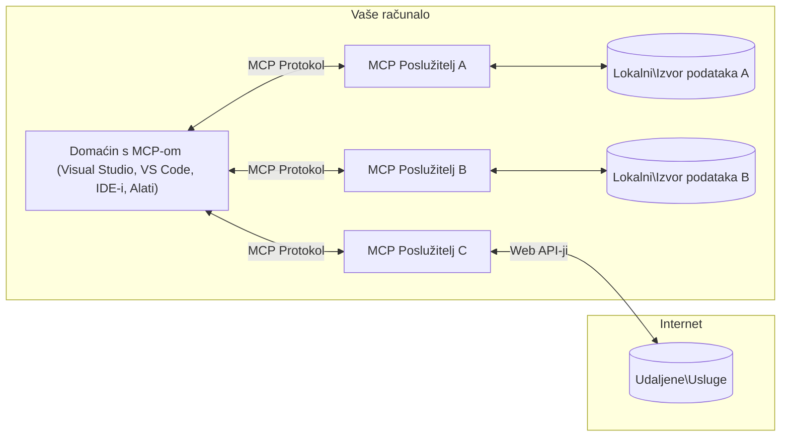

# MCP Osnovni Koncepti: Ovladavanje Protokolom Konteksta Modela za AI Integraciju

[](https://youtu.be/earDzWGtE84)

_(Kliknite na gornju sliku za pregled videa ove lekcije)_

[Model Context Protocol (MCP)](https://github.com/modelcontextprotocol) je moćan, standardizirani okvir koji optimizira komunikaciju između Velikih Jezičnih Modela (LLM) i vanjskih alata, aplikacija i izvora podataka.  
Ovaj vodič će vas provesti kroz osnovne koncepte MCP-a. Naučit ćete o njegovoj klijent-poslužiteljskoj arhitekturi, ključnim komponentama, mehanici komunikacije i najboljim praksama implementacije.

- **Izričiti Korisnički Pristanak**: Sav pristup podacima i operacije zahtijevaju izričitu korisničku suglasnost prije izvršenja. Korisnici moraju jasno razumjeti koji će se podaci pristupiti i koje će se radnje izvršiti, s detaljnom kontrolom nad dopuštenjima i ovlastima.

- **Zaštita Privatnosti Podataka**: Korisnički podaci izlažu se samo uz izričiti pristanak i moraju biti zaštićeni snažnim kontrolama pristupa tijekom cijelog životnog ciklusa interakcije. Implementacije moraju spriječiti neovlašteni prijenos podataka i održavati stroge granice privatnosti.

- **Sigurnost Izvršavanja Alata**: Svako pozivanje alata zahtijeva izričiti korisnički pristanak s jasnim razumijevanjem funkcionalnosti alata, parametara i potencijalnog utjecaja. Snažne sigurnosne granice moraju spriječiti nenamjerno, nesigurno ili zlonamjerno izvršavanje alata.

- **Sigurnost Transportnog Sloja**: Svi komunikacijski kanali trebaju koristiti odgovarajuće mehanizme enkripcije i autentifikacije. Udaljene veze trebaju implementirati sigurne transportne protokole i pravilno upravljanje vjerodajnicama.

#### Smjernice za Implementaciju:

- **Upravljanje Dozvolama**: Implementirajte sustave finog upravljanja dozvolama koji korisnicima omogućuju kontrolu pristupa poslužiteljima, alatima i resursima  
- **Autentifikacija i Autorizacija**: Koristite sigurne metode autentifikacije (OAuth, API ključevi) s pravilnim upravljanjem tokenima i istekom  
- **Validacija Unosa**: Validirajte sve parametre i ulazne podatke prema definiranim shemama kako biste spriječili injekcijske napade  
- **Evidencija Događaja**: Održavajte sveobuhvatne zapise svih operacija za sigurnosni nadzor i usklađenost

## Pregled

Ova lekcija istražuje temeljnu arhitekturu i komponente koje čine ekosustav Model Context Protocol (MCP). Naučit ćete o klijent-poslužiteljskoj arhitekturi, ključnim komponentama i mehanizmima komunikacije koji pokreću MCP interakcije.

## Ključni Ciljevi Učenja

Na kraju ove lekcije, moći ćete:

- Razumjeti MCP klijent-poslužiteljsku arhitekturu.  
- Identificirati uloge i odgovornosti Hostova, Klijenata i Poslužitelja.  
- Analizirati ključne značajke koje čine MCP fleksibilnim slojem za integraciju.  
- Naučiti kako informacije teku unutar MCP ekosustava.  
- Steći praktične uvide kroz primjere koda u .NET, Java, Python i JavaScript.

## MCP Arhitektura: Detaljniji Pogled

MCP ekosustav temelji se na klijent-poslužiteljskom modelu. Ova modularna struktura omogućuje AI aplikacijama učinkovitu interakciju s alatima, bazama podataka, API-jima i kontekstualnim resursima. Razložimo ovu arhitekturu na njezine osnovne komponente.

U svojoj srži, MCP slijedi klijent-poslužiteljsku arhitekturu gdje host aplikacija može povezati više poslužitelja:


- **MCP Hostovi**: Programi poput VSCode, Claude Desktop, IDE-ovi ili AI alati koji žele pristupiti podacima putem MCP-a  
- **MCP Klijenti**: Protokolni klijenti koji održavaju 1:1 veze s poslužiteljima  
- **MCP Poslužitelji**: Laki programi koji svaki izlažu specifične mogućnosti kroz standardizirani Model Context Protocol  
- **Lokalni Izvori Podataka**: Datoteke, baze podataka i servisi na vašem računalu kojima MCP poslužitelji mogu sigurno pristupiti  
- **Udaljene Usluge**: Vanjski sustavi dostupni preko interneta kojima se MCP poslužitelji mogu povezati putem API-ja.

MCP Protokol je standard u razvoju koji koristi verzioniranje temeljeno na datumu (format YYYY-MM-DD). Trenutna verzija protokola je **2025-11-25**. Najnovije ažuriranja možete vidjeti u [specifikaciji protokola](https://modelcontextprotocol.io/specification/2025-11-25/)

### 1. Hostovi

U Model Context Protocolu (MCP), **Hostovi** su AI aplikacije koje služe kao primarno sučelje kroz koje korisnici komuniciraju s protokolom. Hostovi koordiniraju i upravljaju vezama s više MCP poslužitelja stvarajući posvećene MCP klijente za svaku poslužiteljsku vezu. Primjeri Hostova uključuju:

- **AI Aplikacije**: Claude Desktop, Visual Studio Code, Claude Code  
- **Razvojna Okruženja**: IDE-ovi i uređivači koda s MCP integracijom  
- **Prilagođene Aplikacije**: Namjenski AI agenti i alati

**Hostovi** su aplikacije koje koordiniraju interakcije AI modela. Oni:

- **Orkestriraju AI Modele**: Izvršavaju ili komuniciraju s LLM-ovima za generiranje odgovora i koordinaciju AI tijekova rada  
- **Upravljaju Klijentskim Vezama**: Stvaraju i održavaju jednog MCP klijenta po MCP poslužiteljskoj vezi  
- **Kontroliraju Korisničko Sučelje**: Rukovode tijekom razgovora, korisničkim interakcijama i prikazom odgovora  
- **Provode Sigurnost**: Kontroliraju dozvole, sigurnosne ograničenja i autentifikaciju  
- **Rukovode Korisničkim Pristanakom**: Upravljaju korisničkim odobrenjem za dijeljenje podataka i izvršavanje alata

### 2. Klijenti

**Klijenti** su ključne komponente koje održavaju posvećene veze jedan-na-jedan između Hostova i MCP poslužitelja. Svaki MCP klijent instancira Host za povezivanje s određenim MCP poslužiteljem, osiguravajući organizirane i sigurne komunikacijske kanale. Više klijenata omogućuje Hostovima istovremenu vezu s više poslužitelja.

**Klijenti** su konektorske komponente unutar host aplikacije. Oni:

- **Komunikacija Protokolom**: Šalju JSON-RPC 2.0 zahtjeve poslužiteljima s promptovima i uputama  
- **Pregovaranje o Mogućnostima**: Pregovaraju o podržanim značajkama i verzijama protokola s poslužiteljima tijekom inicijalizacije  
- **Izvršavanje Alata**: Upravljaju zahtjevima za izvršavanje alata od modela i obrađuju odgovore  
- **Ažuriranja u Stvarnom Vremenu**: Rukovode obavijestima i ažuriranjima u stvarnom vremenu od poslužitelja  
- **Obrada Odgovora**: Procesuiraju i formatiraju odgovore poslužitelja za prikaz korisnicima

### 3. Poslužitelji

**Poslužitelji** su programi koji pružaju kontekst, alate i mogućnosti MCP klijentima. Mogu se izvršavati lokalno (na istom računalu kao Host) ili udaljeno (na vanjskim platformama), a odgovorni su za obradu zahtjeva klijenata i pružanje strukturiranih odgovora. Poslužitelji izlažu specifične funkcionalnosti kroz standardizirani Model Context Protocol.

**Poslužitelji** su servisi koji pružaju kontekst i mogućnosti. Oni:

- **Registracija Značajki**: Registriraju i izlažu dostupne primitivne elemente (resurse, promptove, alate) klijentima  
- **Obrada Zahtjeva**: Primaju i izvršavaju pozive alata, zahtjeve za resurse i promptove od klijenata  
- **Pružanje Konteksta**: Pružaju kontekstualne informacije i podatke za poboljšanje odgovora modela  
- **Upravljanje Stanjima**: Održavaju stanje sesije i upravljaju interakcijama koje zahtijevaju stanje kada je potrebno  
- **Obavijesti u Stvarnom Vremenu**: Šalju obavijesti o promjenama mogućnosti i ažuriranjima povezanim klijentima

Poslužitelje može razviti bilo tko za proširenje mogućnosti modela specijaliziranim funkcionalnostima, a podržavaju i lokalne i udaljene scenarije implementacije.

### 4. Poslužiteljski Primitivi

Poslužitelji u Model Context Protocolu (MCP) pružaju tri osnovna **primitiva** koja definiraju temeljne gradivne blokove za bogate interakcije između klijenata, hostova i jezičnih modela. Ovi primitivni elementi specificiraju vrste kontekstualnih informacija i radnji dostupnih kroz protokol.

MCP poslužitelji mogu izložiti bilo koju kombinaciju sljedeća tri osnovna primitiva:

#### Resursi

**Resursi** su izvori podataka koji pružaju kontekstualne informacije AI aplikacijama. Predstavljaju statički ili dinamički sadržaj koji može poboljšati razumijevanje modela i donošenje odluka:

- **Kontekstualni Podaci**: Strukturirane informacije i kontekst za konzumaciju AI modela  
- **Baze Znanja**: Repozitoriji dokumenata, članci, priručnici i znanstveni radovi  
- **Lokalni Izvori Podataka**: Datoteke, baze podataka i lokalne sistemske informacije  
- **Vanjski Podaci**: Odgovori API-ja, web servisi i podaci udaljenih sustava  
- **Dinamički Sadržaj**: Podaci u stvarnom vremenu koji se ažuriraju prema vanjskim uvjetima

Resursi se identificiraju URI-jevima i podržavaju otkrivanje putem metoda `resources/list` i dohvat putem `resources/read`:

```text
file://documents/project-spec.md
database://production/users/schema
api://weather/current
```

#### Promptovi

**Promptovi** su ponovno upotrebljivi predlošci koji pomažu strukturirati interakcije s jezičnim modelima. Pružaju standardizirane obrasce interakcije i predloške tijekova rada:

- **Interakcije Temeljene na Predlošcima**: Prestrukturirane poruke i početne rečenice za razgovor  
- **Predlošci Tijekova Rada**: Standardizirani slijedovi za uobičajene zadatke i interakcije  
- **Few-shot Primjeri**: Predlošci temeljeni na primjerima za upute modelu  
- **Sistemski Promptovi**: Temeljni promptovi koji definiraju ponašanje i kontekst modela  
- **Dinamički Predlošci**: Parametrizirani promptovi koji se prilagođavaju specifičnim kontekstima

Promptovi podržavaju zamjenu varijabli i mogu se otkriti putem `prompts/list` i dohvatiti s `prompts/get`:

```markdown
Generate a {{task_type}} for {{product}} targeting {{audience}} with the following requirements: {{requirements}}
```

#### Alati

**Alati** su izvršne funkcije koje AI modeli mogu pozvati za obavljanje specifičnih radnji. Predstavljaju "glagole" MCP ekosustava, omogućujući modelima interakciju s vanjskim sustavima:

- **Izvršne Funkcije**: Diskretne operacije koje modeli mogu pozvati s određenim parametrima  
- **Integracija Vanjskih Sustava**: Pozivi API-ja, upiti baza podataka, operacije nad datotekama, izračuni  
- **Jedinstveni Identitet**: Svaki alat ima jedinstveno ime, opis i shemu parametara  
- **Strukturirani Ulaz/Izlaz**: Alati prihvaćaju validirane parametre i vraćaju strukturirane, tipizirane odgovore  
- **Mogućnosti Radnji**: Omogućuju modelima izvođenje stvarnih radnji i dohvat uživo podataka

Alati su definirani JSON Shemom za validaciju parametara i otkrivaju se putem `tools/list` te izvršavaju preko `tools/call`:

```typescript
server.tool(
  "search_products", 
  {
    query: z.string().describe("Search query for products"),
    category: z.string().optional().describe("Product category filter"),
    max_results: z.number().default(10).describe("Maximum results to return")
  }, 
  async (params) => {
    // Izvrši pretraživanje i vrati strukturirane rezultate
    return await productService.search(params);
  }
);
```

## Klijentski Primitivi

U Model Context Protocolu (MCP), **klijenti** mogu izložiti primitivne elemente koji omogućuju poslužiteljima da zatraže dodatne mogućnosti od host aplikacije. Ovi klijentski primitivni elementi omogućuju bogatije, interaktivnije implementacije poslužitelja koje mogu pristupiti mogućnostima AI modela i korisničkim interakcijama.

### Uzorkovanje

**Uzorkovanje** omogućuje poslužiteljima da zatraže dovršetke jezičnog modela iz AI aplikacije klijenta. Ovaj primitiv omogućuje poslužiteljima pristup LLM mogućnostima bez ugrađivanja vlastitih ovisnosti o modelu:

- **Neovisni Pristup Modelu**: Poslužitelji mogu zatražiti dovršetke bez uključivanja LLM SDK-ova ili upravljanja pristupom modelu  
- **AI Iniciran od Poslužitelja**: Omogućuje poslužiteljima autonomno generiranje sadržaja koristeći model klijenta  
- **Rekurzivne LLM Interakcije**: Podržava složene scenarije gdje poslužitelji trebaju AI pomoć za obradu  
- **Dinamičko Generiranje Sadržaja**: Omogućuje poslužiteljima stvaranje kontekstualnih odgovora koristeći model hosta

Uzorkovanje se inicira putem metode `sampling/complete`, gdje poslužitelji šalju zahtjeve za dovršetke klijentima.

### Ispitivanje

**Ispitivanje** omogućuje poslužiteljima da zatraže dodatne informacije ili potvrdu od korisnika putem klijentskog sučelja:

- **Zahtjevi za Korisničkim Unosom**: Poslužitelji mogu tražiti dodatne informacije kada su potrebne za izvršenje alata  
- **Dijalozi za Potvrdu**: Zahtijevaju korisničko odobrenje za osjetljive ili značajne operacije  
- **Interaktivni Tijekovi Rada**: Omogućuju poslužiteljima stvaranje korak-po-korak korisničkih interakcija  
- **Dinamičko Prikupljanje Parametara**: Prikupljaju nedostajuće ili opcionalne parametre tijekom izvršavanja alata

Zahtjevi za ispitivanje šalju se metodom `elicitation/request` za prikupljanje korisničkog unosa putem klijentovog sučelja.

### Evidencija

**Evidencija** omogućuje poslužiteljima slanje strukturiranih poruka dnevnika klijentima za otklanjanje pogrešaka, nadzor i operativnu vidljivost:

- **Podrška za Otklanjanje Pogrešaka**: Omogućuje poslužiteljima pružanje detaljnih zapisa izvršenja za rješavanje problema  
- **Operativni Nadzor**: Šalje ažuriranja statusa i metrike performansi klijentima  
- **Prijava Pogrešaka**: Pruža detaljan kontekst pogrešaka i dijagnostičke informacije  
- **Revizijski Tragovi**: Stvara sveobuhvatne zapise poslužiteljskih operacija i odluka

Poruke dnevnika šalju se klijentima radi transparentnosti poslužiteljskih operacija i olakšavanja otklanjanja pogrešaka.

## Tok Informacija u MCP-u

Model Context Protocol (MCP) definira strukturirani tok informacija između hostova, klijenata, poslužitelja i modela. Razumijevanje ovog toka pomaže razjasniti kako se korisnički zahtjevi obrađuju i kako se vanjski alati i podaci integriraju u odgovore modela.

- **Host Inicira Vezu**  
  Host aplikacija (poput IDE-a ili sučelja za chat) uspostavlja vezu s MCP poslužiteljem, obično putem STDIO, WebSocket-a ili drugog podržanog transporta.

- **Pregovaranje o Mogućnostima**  
  Klijent (ugrađen u host) i poslužitelj razmjenjuju informacije o podržanim značajkama, alatima, resursima i verzijama protokola. To osigurava da obje strane razumiju koje su mogućnosti dostupne za sesiju.

- **Korisnički Zahtjev**  
  Korisnik komunicira s hostom (npr. unosi prompt ili naredbu). Host prikuplja ovaj unos i prosljeđuje ga klijentu na obradu.

- **Korištenje Resursa ili Alata**  
  - Klijent može zatražiti dodatni kontekst ili resurse od poslužitelja (poput datoteka, unosa u bazu podataka ili članaka baze znanja) kako bi obogatio razumijevanje modela.  
  - Ako model utvrdi da je potreban alat (npr. za dohvat podataka, izvođenje izračuna ili poziv API-ja), klijent šalje zahtjev za poziv alata poslužitelju, navodeći ime alata i parametre.

- **Izvršavanje Poslužitelja**  
  Poslužitelj prima zahtjev za resurs ili alat, izvršava potrebne operacije (poput pokretanja funkcije, upita baze podataka ili dohvaćanja datoteke) i vraća rezultate klijentu u strukturiranom formatu.

- **Generiranje Odgovora**  
  Klijent integrira odgovore poslužitelja (podatke resursa, izlaze alata itd.) u tekuću interakciju modela. Model koristi ove informacije za generiranje sveobuhvatnog i kontekstualno relevantnog odgovora.

- **Prikaz Rezultata**  
  Host prima konačni izlaz od klijenta i prikazuje ga korisniku, često uključujući i generirani tekst modela i rezultate izvršenja alata ili pretraživanja resursa.

Ovaj tok omogućuje MCP-u podršku za napredne, interaktivne i kontekstualno svjesne AI aplikacije besprijekornim povezivanjem modela s vanjskim alatima i izvorima podataka.

## Arhitektura i Slojevi Protokola

MCP se sastoji od dva različita arhitektonska sloja koji zajedno rade kako bi pružili cjelovit komunikacijski okvir:

### Sloj Podataka

**Sloj Podataka** implementira osnovni MCP protokol koristeći **JSON-RPC 2.0** kao temelj. Ovaj sloj definira strukturu poruka, semantiku i obrasce interakcije:

#### Osnovne Komponente:

- **JSON-RPC 2.0 Protokol**: Sva komunikacija koristi standardizirani JSON-RPC 2.0 format poruka za pozive metoda, odgovore i obavijesti
- **Upravljanje životnim ciklusom**: Rukuje inicijalizacijom veze, pregovorima o mogućnostima i završetkom sesije između klijenata i poslužitelja  
- **Poslužiteljske primitivne funkcije**: Omogućuju poslužiteljima pružanje osnovne funkcionalnosti putem alata, resursa i upita  
- **Klijentske primitivne funkcije**: Omogućuju poslužiteljima da zatraže uzorkovanje iz LLM-ova, potaknu unos korisnika i šalju zapisne poruke  
- **Obavijesti u stvarnom vremenu**: Podržava asinkrone obavijesti za dinamičke nadopune bez potrebe za ispitivanjem  

#### Ključne značajke:

- **Pregovaranje verzije protokola**: Koristi verzioniranje temeljeno na datumu (GGGG-MM-DD) za osiguranje kompatibilnosti  
- **Otkrivanje mogućnosti**: Klijenti i poslužitelji razmjenjuju informacije o podržanim značajkama tijekom inicijalizacije  
- **Stanja sesija**: Održava stanje veze kroz više interakcija radi kontinuiteta konteksta  

### Transportni sloj

**Transportni sloj** upravlja komunikacijskim kanalima, oblikovanjem poruka i autentifikacijom između sudionika MCP-a:

#### Podržani transportni mehanizmi:

1. **STDIO transport**:  
   - Koristi standardne ulazno/izlazne tokove za izravnu komunikaciju procesa  
   - Optimalan za lokalne procese na istom računalu bez mrežnog opterećenja  
   - Često se koristi za lokalne implementacije MCP poslužitelja  

2. **Streamable HTTP transport**:  
   - Koristi HTTP POST za poruke od klijenta prema poslužitelju  
   - Opcionalni Server-Sent Events (SSE) za streaming od poslužitelja prema klijentu  
   - Omogućuje komunikaciju s udaljenim poslužiteljima preko mreža  
   - Podržava standardnu HTTP autentifikaciju (bearer tokeni, API ključevi, prilagođeni zaglavlja)  
   - MCP preporučuje OAuth za sigurnu autentifikaciju temeljenu na tokenima  

#### Apstrakcija transporta:

Transportni sloj apstrahira detalje komunikacije od sloja podataka, omogućujući isti JSON-RPC 2.0 format poruka za sve transportne mehanizme. Ova apstrakcija omogućuje aplikacijama da neprimjetno prelaze između lokalnih i udaljenih poslužitelja.

### Sigurnosne napomene

Implementacije MCP-a moraju se pridržavati nekoliko ključnih sigurnosnih načela kako bi osigurale sigurne, pouzdane i zaštićene interakcije u svim operacijama protokola:

- **Slažem se i kontrola korisnika**: Korisnici moraju dati izričit pristanak prije pristupa bilo kakvim podacima ili izvođenja operacija. Trebaju imati jasnu kontrolu nad time koji se podaci dijele i koje su radnje ovlaštene, uz intuitivne korisničke sučelja za pregled i odobravanje aktivnosti.

- **Privatnost podataka**: Korisnički podaci trebaju biti izloženi samo uz izričit pristanak i moraju biti zaštićeni odgovarajućim kontrolama pristupa. Implementacije MCP-a moraju spriječiti neovlašteni prijenos podataka i osigurati da se privatnost održava tijekom svih interakcija.

- **Sigurnost alata**: Prije pozivanja bilo kojeg alata potreban je izričit pristanak korisnika. Korisnici trebaju jasno razumjeti funkcionalnost svakog alata, a moraju se provoditi snažne sigurnosne granice kako bi se spriječilo neželjeno ili nesigurno izvođenje alata.

Slijedeći ova sigurnosna načela, MCP osigurava povjerenje korisnika, privatnost i sigurnost u svim interakcijama protokola, istovremeno omogućujući moćne AI integracije.

## Primjeri koda: Ključne komponente

Ispod su primjeri koda u nekoliko popularnih programskih jezika koji ilustriraju kako implementirati ključne MCP poslužiteljske komponente i alate.

### .NET primjer: Kreiranje jednostavnog MCP poslužitelja s alatima

Evo praktičnog .NET primjera koda koji pokazuje kako implementirati jednostavan MCP poslužitelj s prilagođenim alatima. Ovaj primjer prikazuje kako definirati i registrirati alate, obrađivati zahtjeve i povezati poslužitelj koristeći Model Context Protocol.

```csharp
using System;
using System.Threading.Tasks;
using ModelContextProtocol.Server;
using ModelContextProtocol.Server.Transport;
using ModelContextProtocol.Server.Tools;

public class WeatherServer
{
    public static async Task Main(string[] args)
    {
        // Create an MCP server
        var server = new McpServer(
            name: "Weather MCP Server",
            version: "1.0.0"
        );
        
        // Register our custom weather tool
        server.AddTool<string, WeatherData>("weatherTool", 
            description: "Gets current weather for a location",
            execute: async (location) => {
                // Call weather API (simplified)
                var weatherData = await GetWeatherDataAsync(location);
                return weatherData;
            });
        
        // Connect the server using stdio transport
        var transport = new StdioServerTransport();
        await server.ConnectAsync(transport);
        
        Console.WriteLine("Weather MCP Server started");
        
        // Keep the server running until process is terminated
        await Task.Delay(-1);
    }
    
    private static async Task<WeatherData> GetWeatherDataAsync(string location)
    {
        // This would normally call a weather API
        // Simplified for demonstration
        await Task.Delay(100); // Simulate API call
        return new WeatherData { 
            Temperature = 72.5,
            Conditions = "Sunny",
            Location = location
        };
    }
}

public class WeatherData
{
    public double Temperature { get; set; }
    public string Conditions { get; set; }
    public string Location { get; set; }
}
```

### Java primjer: MCP poslužiteljske komponente

Ovaj primjer prikazuje isti MCP poslužitelj i registraciju alata kao i .NET primjer gore, ali implementiran u Javi.

```java
import io.modelcontextprotocol.server.McpServer;
import io.modelcontextprotocol.server.McpToolDefinition;
import io.modelcontextprotocol.server.transport.StdioServerTransport;
import io.modelcontextprotocol.server.tool.ToolExecutionContext;
import io.modelcontextprotocol.server.tool.ToolResponse;

public class WeatherMcpServer {
    public static void main(String[] args) throws Exception {
        // Kreiraj MCP poslužitelj
        McpServer server = McpServer.builder()
            .name("Weather MCP Server")
            .version("1.0.0")
            .build();
            
        // Registriraj alat za vremensku prognozu
        server.registerTool(McpToolDefinition.builder("weatherTool")
            .description("Gets current weather for a location")
            .parameter("location", String.class)
            .execute((ToolExecutionContext ctx) -> {
                String location = ctx.getParameter("location", String.class);
                
                // Dohvati podatke o vremenu (pojednostavljeno)
                WeatherData data = getWeatherData(location);
                
                // Vrati formatirani odgovor
                return ToolResponse.content(
                    String.format("Temperature: %.1f°F, Conditions: %s, Location: %s", 
                    data.getTemperature(), 
                    data.getConditions(), 
                    data.getLocation())
                );
            })
            .build());
        
        // Poveži poslužitelj koristeći stdio transport
        try (StdioServerTransport transport = new StdioServerTransport()) {
            server.connect(transport);
            System.out.println("Weather MCP Server started");
            // Održi poslužitelj aktivnim dok se proces ne prekine
            Thread.currentThread().join();
        }
    }
    
    private static WeatherData getWeatherData(String location) {
        // Implementacija bi pozvala vremenski API
        // Pojednostavljeno za potrebe primjera
        return new WeatherData(72.5, "Sunny", location);
    }
}

class WeatherData {
    private double temperature;
    private String conditions;
    private String location;
    
    public WeatherData(double temperature, String conditions, String location) {
        this.temperature = temperature;
        this.conditions = conditions;
        this.location = location;
    }
    
    public double getTemperature() {
        return temperature;
    }
    
    public String getConditions() {
        return conditions;
    }
    
    public String getLocation() {
        return location;
    }
}
```

### Python primjer: Izgradnja MCP poslužitelja

Ovaj primjer koristi fastmcp, stoga ga prvo instalirajte:

```python
pip install fastmcp
```
Primjer koda:

```python
#!/usr/bin/env python3
import asyncio
from fastmcp import FastMCP
from fastmcp.transports.stdio import serve_stdio

# Kreirajte FastMCP poslužitelj
mcp = FastMCP(
    name="Weather MCP Server",
    version="1.0.0"
)

@mcp.tool()
def get_weather(location: str) -> dict:
    """Gets current weather for a location."""
    return {
        "temperature": 72.5,
        "conditions": "Sunny",
        "location": location
    }

# Alternativni pristup korištenjem klase
class WeatherTools:
    @mcp.tool()
    def forecast(self, location: str, days: int = 1) -> dict:
        """Gets weather forecast for a location for the specified number of days."""
        return {
            "location": location,
            "forecast": [
                {"day": i+1, "temperature": 70 + i, "conditions": "Partly Cloudy"}
                for i in range(days)
            ]
        }

# Registrirajte alate klase
weather_tools = WeatherTools()

# Pokrenite poslužitelj
if __name__ == "__main__":
    asyncio.run(serve_stdio(mcp))
```

### JavaScript primjer: Kreiranje MCP poslužitelja

Ovaj primjer prikazuje kreiranje MCP poslužitelja u JavaScriptu i kako registrirati dva alata vezana uz vremensku prognozu.

```javascript
// Korištenje službenog Model Context Protocol SDK-a
import { McpServer } from "@modelcontextprotocol/sdk/server/mcp.js";
import { StdioServerTransport } from "@modelcontextprotocol/sdk/server/stdio.js";
import { z } from "zod"; // Za provjeru parametara

// Kreiraj MCP poslužitelj
const server = new McpServer({
  name: "Weather MCP Server",
  version: "1.0.0"
});

// Definiraj alat za vremensku prognozu
server.tool(
  "weatherTool",
  {
    location: z.string().describe("The location to get weather for")
  },
  async ({ location }) => {
    // Ovo bi obično pozivalo vremenski API
    // Pojednostavljeno za demonstraciju
    const weatherData = await getWeatherData(location);
    
    return {
      content: [
        { 
          type: "text", 
          text: `Temperature: ${weatherData.temperature}°F, Conditions: ${weatherData.conditions}, Location: ${weatherData.location}` 
        }
      ]
    };
  }
);

// Definiraj alat za prognozu
server.tool(
  "forecastTool",
  {
    location: z.string(),
    days: z.number().default(3).describe("Number of days for forecast")
  },
  async ({ location, days }) => {
    // Ovo bi obično pozivalo vremenski API
    // Pojednostavljeno za demonstraciju
    const forecast = await getForecastData(location, days);
    
    return {
      content: [
        { 
          type: "text", 
          text: `${days}-day forecast for ${location}: ${JSON.stringify(forecast)}` 
        }
      ]
    };
  }
);

// Pomoćne funkcije
async function getWeatherData(location) {
  // Simuliraj poziv API-ja
  return {
    temperature: 72.5,
    conditions: "Sunny",
    location: location
  };
}

async function getForecastData(location, days) {
  // Simuliraj poziv API-ja
  return Array.from({ length: days }, (_, i) => ({
    day: i + 1,
    temperature: 70 + Math.floor(Math.random() * 10),
    conditions: i % 2 === 0 ? "Sunny" : "Partly Cloudy"
  }));
}

// Poveži poslužitelj koristeći stdio transport
const transport = new StdioServerTransport();
server.connect(transport).catch(console.error);

console.log("Weather MCP Server started");
```

Ovaj JavaScript primjer pokazuje kako kreirati MCP klijenta koji se povezuje na poslužitelj, šalje upit i obrađuje odgovor uključujući sve pozive alata koji su napravljeni.

## Sigurnost i autorizacija

MCP uključuje nekoliko ugrađenih koncepata i mehanizama za upravljanje sigurnošću i autorizacijom tijekom cijelog protokola:

1. **Kontrola dopuštenja alata**:  
  Klijenti mogu specificirati koje alate model smije koristiti tijekom sesije. Time se osigurava da su dostupni samo eksplicitno ovlašteni alati, smanjujući rizik od neželjenih ili nesigurnih operacija. Dopuštenja se mogu dinamički konfigurirati na temelju korisničkih preferencija, organizacijskih politika ili konteksta interakcije.

2. **Autentifikacija**:  
  Poslužitelji mogu zahtijevati autentifikaciju prije nego što omoguće pristup alatima, resursima ili osjetljivim operacijama. To može uključivati API ključeve, OAuth tokene ili druge sheme autentifikacije. Ispravna autentifikacija osigurava da samo pouzdani klijenti i korisnici mogu pozivati poslužiteljske mogućnosti.

3. **Validacija**:  
  Validacija parametara se provodi za sve pozive alata. Svaki alat definira očekivane tipove, formate i ograničenja za svoje parametre, a poslužitelj validira dolazne zahtjeve u skladu s tim. To sprječava da neispravan ili zlonamjeran unos dođe do implementacija alata i pomaže održati integritet operacija.

4. **Ograničenje brzine (rate limiting)**:  
  Kako bi se spriječila zloupotreba i osigurala poštena upotreba poslužiteljskih resursa, MCP poslužitelji mogu implementirati ograničenja brzine za pozive alata i pristup resursima. Ograničenja se mogu primjenjivati po korisniku, po sesiji ili globalno, te pomažu u zaštiti od napada uskraćivanja usluge ili pretjerane potrošnje resursa.

Kombiniranjem ovih mehanizama, MCP pruža sigurnu osnovu za integraciju jezičnih modela s vanjskim alatima i izvorima podataka, istovremeno dajući korisnicima i programerima detaljnu kontrolu nad pristupom i korištenjem.

## Poruke protokola i tijek komunikacije

MCP komunikacija koristi strukturirane **JSON-RPC 2.0** poruke za olakšavanje jasnih i pouzdanih interakcija između domaćina, klijenata i poslužitelja. Protokol definira specifične obrasce poruka za različite vrste operacija:

### Osnovne vrste poruka:

#### **Poruke inicijalizacije**
- **`initialize` zahtjev**: Uspostavlja vezu i pregovara verziju protokola i mogućnosti  
- **`initialize` odgovor**: Potvrđuje podržane značajke i informacije o poslužitelju  
- **`notifications/initialized`**: Signalizira da je inicijalizacija dovršena i sesija spremna  

#### **Poruke otkrivanja**
- **`tools/list` zahtjev**: Otkriva dostupne alate na poslužitelju  
- **`resources/list` zahtjev**: Navodi dostupne resurse (izvore podataka)  
- **`prompts/list` zahtjev**: Dohvaća dostupne predloške upita  

#### **Poruke izvršenja**  
- **`tools/call` zahtjev**: Izvršava određeni alat s danim parametrima  
- **`resources/read` zahtjev**: Dohvaća sadržaj određenog resursa  
- **`prompts/get` zahtjev**: Dohvaća predložak upita s opcionalnim parametrima  

#### **Poruke s klijentske strane**
- **`sampling/complete` zahtjev**: Poslužitelj traži dovršetak LLM-a od klijenta  
- **`elicitation/request`**: Poslužitelj traži unos korisnika putem klijentskog sučelja  
- **Poruke zapisivanja**: Poslužitelj šalje strukturirane zapisne poruke klijentu  

#### **Poruke obavijesti**
- **`notifications/tools/list_changed`**: Poslužitelj obavještava klijenta o promjenama alata  
- **`notifications/resources/list_changed`**: Poslužitelj obavještava klijenta o promjenama resursa  
- **`notifications/prompts/list_changed`**: Poslužitelj obavještava klijenta o promjenama predložaka upita  

### Struktura poruka:

Sve MCP poruke slijede JSON-RPC 2.0 format s:  
- **Zahtjevi**: uključuju `id`, `method` i opcionalne `params`  
- **Odgovori**: uključuju `id` i ili `result` ili `error`  
- **Obavijesti**: uključuju `method` i opcionalne `params` (bez `id` i bez očekivanog odgovora)  

Ova strukturirana komunikacija osigurava pouzdane, pratljive i proširive interakcije koje podržavaju napredne scenarije poput ažuriranja u stvarnom vremenu, povezivanja alata i robusnog rukovanja pogreškama.

## Ključne spoznaje

- **Arhitektura**: MCP koristi klijent-poslužitelj arhitekturu gdje domaćini upravljaju višestrukim klijentskim vezama prema poslužiteljima  
- **Sudionici**: Ekosustav uključuje domaćine (AI aplikacije), klijente (protokolne konektore) i poslužitelje (pružatelje mogućnosti)  
- **Transportni mehanizmi**: Komunikacija podržava STDIO (lokalno) i Streamable HTTP s opcionalnim SSE (udaljeno)  
- **Osnovne primitivne funkcije**: Poslužitelji izlažu alate (izvršne funkcije), resurse (izvore podataka) i upite (predloške)  
- **Klijentske primitivne funkcije**: Poslužitelji mogu zatražiti uzorkovanje (dovršetke LLM-a), poticanje (unos korisnika) i zapisivanje od klijenata  
- **Temelj protokola**: Izgrađen na JSON-RPC 2.0 s verzioniranjem temeljenim na datumu (trenutno: 2025-11-25)  
- **Mogućnosti u stvarnom vremenu**: Podržava obavijesti za dinamičke nadopune i sinkronizaciju u stvarnom vremenu  
- **Sigurnost na prvom mjestu**: Izričit pristanak korisnika, zaštita privatnosti podataka i siguran transport su osnovni zahtjevi  

## Vježba

Dizajnirajte jednostavan MCP alat koji bi bio koristan u vašem području. Definirajte:  
1. Kako bi se alat zvao  
2. Koje parametre bi primao  
3. Koji bi izlaz vraćao  
4. Kako bi model mogao koristiti ovaj alat za rješavanje korisničkih problema  

---

## Što slijedi

Sljedeće: [Poglavlje 2: Sigurnost](../02-Security/README.md)

---

<!-- CO-OP TRANSLATOR DISCLAIMER START -->
**Odricanje od odgovornosti**:
Ovaj dokument je preveden pomoću AI usluge za prevođenje [Co-op Translator](https://github.com/Azure/co-op-translator). Iako nastojimo postići točnost, imajte na umu da automatski prijevodi mogu sadržavati pogreške ili netočnosti. Izvorni dokument na izvornom jeziku treba smatrati autoritativnim izvorom. Za kritične informacije preporučuje se profesionalni ljudski prijevod. Ne snosimo odgovornost za bilo kakva nesporazuma ili pogrešna tumačenja koja proizlaze iz korištenja ovog prijevoda.
<!-- CO-OP TRANSLATOR DISCLAIMER END -->