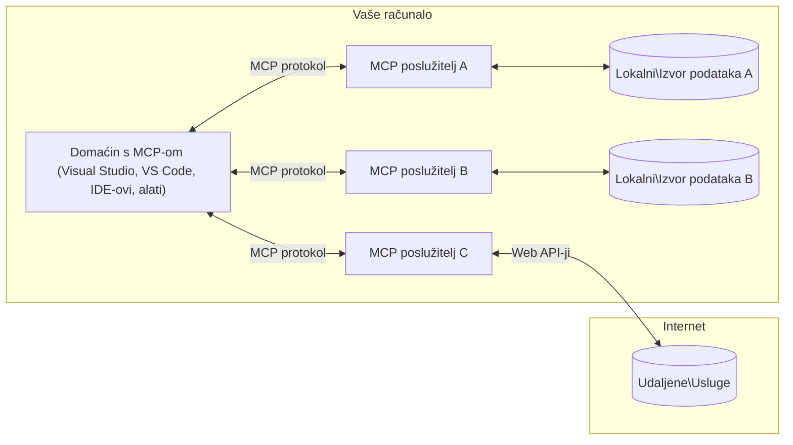

# Osnovni pojmovi MCP-a: Ovladavanje protokolom modelnog konteksta za AI integraciju

[](https://youtu.be/earDzWGtE84)

_(Kliknite na gornju sliku za prikaz video lekcije)_

[Model Context Protocol (MCP)](https://github.com/modelcontextprotocol) je moćan, standardizirani okvir koji optimizira komunikaciju između velikih jezičnih modela (LLM-ova) i vanjskih alata, aplikacija i izvora podataka.
Ovaj vodič će vas provesti kroz osnovne pojmove MCP-a. Naučit ćete o njegovoj klijent-poslužiteljskoj arhitekturi, ključnim komponentama, mehanizmima komunikacije i najboljim praksama implementacije.

- **Kontrola i pristanka korisnika**: Domaćini bi trebali jasno pokazati koje podatke i alate
  poslužitelj izlaže, omogućiti korisnicima odbijanje operacija te dobiti izričit pristanak
  za osjetljive ili ključne radnje. MCP ne zahtijeva potvrdu
  prije svakog poziva alata.

- **Zaštita privatnosti podataka**: Korisnički podaci se izlažu samo uz izričit pristanak i moraju biti zaštićeni snažnim kontrolama pristupa tijekom čitavog životnog ciklusa interakcije. Implementacije moraju spriječiti neovlašteni prijenos podataka i održavati stroge granice privatnosti.

- **Sigurnost izvođenja alata**: Domaćini bi trebali učiniti pozive alata vidljivima i omogućiti
  ljudima da ih odbiju. Osjetljive operacije trebaju prikazati ulaze u alat
  i učinak prije izvršenja, s sigurnosnim granicama koje sprječavaju nenamjerne
  ili zlonamjerne radnje.

- **Sigurnost prijenosa**: Daljinske veze trebaju koristiti HTTPS i MCP
  model autorizacije. Lokalni stdio poslužitelji ovise o izolaciji procesa, pouzdanom
  podešavanju i sigurnoj obradi naslijeđenih vjerodajnica.

#### Smjernice za implementaciju:

- **Upravljanje dopuštenjima**: Implementirajte sustave finog upravljanja dopuštenjima koji korisnicima omogućuju kontrolu pristupa poslužiteljima, alatima i resursima
- **Autentikacija i autorizacija**: Koristite sigurne metode autentikacije (OAuth, API ključevi) s pravilnim upravljanjem i istekom tokena
- **Validacija unosa**: Validirajte sve parametre i ulaze podataka prema definiranima shemama kako biste spriječili napade ubrizgavanjem
- **Evidencija audita**: Održavajte detaljne zapise o svim operacijama radi sigurnosnog nadzora i usklađenosti

## Pregled

Ova lekcija istražuje osnovnu arhitekturu i komponente koje čine Model Context Protocol (MCP) ekosustav. Naučit ćete o klijent-poslužiteljskoj arhitekturi, ključnim komponentama i komunikacijskim mehanizmima koji pokreću MCP interakcije.

## Ključni ciljevi učenja

Do kraja ove lekcije, naučit ćete:

- Razumjeti MCP klijent-poslužiteljsku arhitekturu.
- Prepoznati uloge i odgovornosti domaćina, klijenata i poslužitelja.
- Analizirati ključne značajke koje čine MCP fleksibilnim slojem za integraciju.
- Naučiti kako informacije teku unutar MCP ekosustava.
- Steći praktične uvide kroz primjere koda u .NET, Javi, Pythonu i JavaScriptu.

## MCP arhitektura: Dublji pogled

MCP ekosustav temelji se na klijent-poslužiteljskoj strukturi. Ova modularna struktura omogućava AI aplikacijama učinkovitu interakciju s alatima, bazama podataka, API-jima i kontekstualnim resursima. Razložimo ovu arhitekturu na njezine osnovne komponente.

U svojoj je srži, MCP usklađen s klijent-poslužiteljskom arhitekturom gdje domaćinska aplikacija može povezati više poslužitelja:


```mermaid
flowchart LR
    subgraph "Vaše računalo"
        Host["Domaćin s MCP-om (Visual Studio, VS Code, IDE-ovi, alati)"]
        S1["MCP poslužitelj A"]
        S2["MCP poslužitelj B"]
        S3["MCP poslužitelj C"]
        Host <-->|"MCP protokol"| S1
        Host <-->|"MCP protokol"| S2
        Host <-->|"MCP protokol"| S3
        S1 <--> D1[("Lokalni\Izvor podataka A")]
        S2 <--> D2[("Lokalni\Izvor podataka B")]
    end
    subgraph "Internet"
        S3 <-->|"Web API-ji"| D3[("Udaljene\Usluge")]
    end
```

- **MCP domaćini**: Programi poput VSCode-a, Claude Desktopa, IDE-ova ili AI alata koji žele pristupiti podacima preko MCP-a
- **MCP klijenti**: Komponente protokola koje održavaju jednu logičku vezu
  s poslužiteljem; MCP `2026-07-28` zahtjevi ne ovise o jednoj trajnoj
  vezi ili sesiji

- **MCP poslužitelji**: Laki programi koji preko standardiziranog Model Context Protokola izlažu specifične mogućnosti
- **Lokalni izvori podataka**: Datoteke, baze podataka i servisi na vašem računalu koje MCP poslužitelji mogu sigurno pristupiti
- **Udaljene usluge**: Vanjski sustavi dostupni putem interneta kojima se MCP poslužitelji mogu povezati preko API-ja.

MCP Protokol je razvijajući se standard koji koristi verzioniranje po datumu
(format GGGG-MM-DD). Trenutna verzija protokola je **2026-07-28**. Pogledajte
[specifikaciju protokola 2026-07-28](https://modelcontextprotocol.io/specification/2026-07-28/).

> **Trenutno izdanje:** MCP `2026-07-28` čini protokol bezstanja na
> transportnoj razini uklanjanjem `initialize` handshakea i identifikatora sesije na razini protokola.
> Također formalizira okvir za Proširenja i zastarijeva
> Korijene, Uzorkovanje i Evidenciju u korist novih obrazaca. Pogledajte
> [Što se promijenilo u MCP: specifikacija 2026-07-28](./mcp-2026-07-28.md)
> za detaljnu analizu i smjernice za migraciju. Primjeri koji eksplicitno ciljanju
> `2025-11-25` su zadržani kao lekcije za kompatibilnost sa starim verzijama.

### 1. Domaćini

U Model Context Protokolu (MCP), **Domaćini** su AI aplikacije koje služe kao primarno sučelje putem kojeg korisnici komuniciraju s protokolom. Domaćini koordiniraju i upravljaju vezama s više MCP poslužitelja stvarajući namjenske MCP klijente za svaku vezu s poslužiteljem. Primjeri domaćina uključuju:

- **AI aplikacije**: Claude Desktop, Visual Studio Code, Claude Code
- **Razvojna okruženja**: IDE-i i uređivači koda s MCP integracijom  
- **Prilagođene aplikacije**: Specijalizirani AI agenti i alati

**Domaćini** su aplikacije koje koordiniraju interakcije s AI modelima. Oni:

- **Orkestriraju AI modele**: Izvršavaju ili komuniciraju s LLM-ovima za generiranje odgovora i koordinaciju AI tijekova rada
- **Upravljaju odnosima klijenata**: Stvaraju i upravljaju jednim MCP klijentom za svaki MCP
  poslužitelj kojeg domaćin koristi
- **Kontroliraju korisničko sučelje**: Rukovode tijekom razgovora, korisničkim interakcijama i prikazom odgovora  
- **Sprovode sigurnost**: Kontroliraju dozvole, sigurnosna ograničenja i autentifikaciju
- **Rukovode pristankom korisnika**: Upravljaju odobrenjem korisnika za dijeljenje podataka i izvršavanje alata


### 2. Klijenti

**Klijenti** su komponenti protokola koje stvara domaćin za određene MCP
poslužitelje. Ovo je logički odnos jedan-na-jedan, a ne zahtjev za
trajnom mrežnom vezom. U MCP `2026-07-28`, svaki zahtjev je
samostalno sadržan i može ga obraditi bilo koja instanca poslužitelja.

**Klijenti** su povezničke komponente unutar domaćinske aplikacije. Oni:

- **Komunikacija protokolom**: Šalju JSON-RPC 2.0 zahtjeve poslužiteljima s upitima i uputama
- **Otkrivanje mogućnosti**: Koriste `server/discover` za saznanje podržanih
  verzija protokola, mogućnosti i proširenja poslužitelja
- **Izvršavanje alata**: Upravljaju zahtjevima za izvršavanje alata od modela i obrađuju odgovore
- **Ažuriranja u stvarnom vremenu**: Rukovode obavijestima i ažuriranjima u stvarnom vremenu od poslužitelja
- **Obrada odgovora**: Obrađuju i oblikuju odgovore poslužitelja za prikaz korisnicima

### 3. Poslužitelji


**Serveri** su programi koji pružaju kontekst, alate i mogućnosti MCP klijentima. Mogu se izvršavati lokalno (na istom računalu kao i Host) ili udaljeno (na vanjskim platformama) te su odgovorni za obradu zahtjeva klijenata i pružanje strukturiranih odgovora. Serveri izlažu specifične funkcionalnosti putem standardiziranog Model Context Protocol-a.

**Serveri** su servisi koji pružaju kontekst i mogućnosti. Oni:


- **Registracija značajki**: Registrirajte i izložite dostupne primitivne funkcije (resurse, upite, alate) klijentima
- **Obrada zahtjeva**: Primajte i izvršavajte pozive alata, zahtjeve za resurse i upite od klijenata
- **Pružanje konteksta**: Pružite kontekstualne informacije i podatke za poboljšanje odgovora modela
- **Upravljanje stanjem**: Održavajte stanje aplikacije s eksplicitnim rukovateljima koji se prenose
  u zahtjevima kad je potrebno; MCP `2026-07-28` nema sesije na razini protokola
- **Obavijesti u stvarnom vremenu**: Pošaljite obavijesti o promjenama i ažuriranjima mogućnosti povezanim klijentima

Poslužitelji mogu biti razvijeni od strane bilo koga za proširenje mogućnosti modela specijaliziranim funkcionalnostima, i podržavaju scenarije lokalnog i udaljenog postavljanja.

### 4. Primitivi poslužitelja

Poslužitelji u Model Context Protocolu (MCP) pružaju tri osnovna **primitiva** koja definiraju temeljne gradivne blokove za bogate interakcije između klijenata, hostova i jezičnih modela. Ti primitivni definiraju vrste kontekstualnih informacija i akcija dostupnih putem protokola.

MCP poslužitelji mogu izložiti bilo koju kombinaciju sljedeća tri osnovna primitiva:

#### Resursi 

**Resursi** su izvori podataka koji pružaju kontekstualne informacije AI aplikacijama. Predstavljaju statički ili dinamički sadržaj koji može poboljšati razumijevanje modela i donošenje odluka:

- **Kontekstualni podaci**: Strukturirane informacije i kontekst za korištenje AI modela
- **Baze znanja**: Spremišta dokumenata, članci, priručnici i znanstveni radovi
- **Lokalni izvori podataka**: Datoteke, baze podataka i informacije lokalnog sustava  
- **Vanjski podaci**: Odgovori API-ja, web servisi i podaci udaljenih sustava
- **Dinamički sadržaj**: Podaci u stvarnom vremenu koji se ažuriraju prema vanjskim uvjetima

Resursi se identificiraju URI-jevima i podržavaju otkrivanje kroz metode `resources/list` te dohvat kroz `resources/read`:

```text
file://documents/project-spec.md
database://production/users/schema
api://weather/current
```

#### Upiti

**Upiti** su predlošci za višekratnu uporabu koji pomažu strukturirati interakcije s jezičnim modelima. Pružaju standardizirane obrasce interakcije i predloške tijeka rada:

- **Interakcije temeljene na predlošcima**: Unaprijed strukturirane poruke i početci razgovora
- **Predlošci tijeka rada**: Standardizirani slijedovi za uobičajene zadatke i interakcije
- **Primjeri s nekoliko primjera**: Predlošci temeljeni na primjerima za uputu modela
- **Sistemski upiti**: Temeljni upiti koji definiraju ponašanje i kontekst modela
- **Dinamički predlošci**: Parametrizirani upiti koji se prilagođavaju specifičnim kontekstima

Upiti podržavaju zamjenu varijabli i mogu se pronaći putem `prompts/list` i dohvatiti s `prompts/get`:

```markdown
Generate a {{task_type}} for {{product}} targeting {{audience}} with the following requirements: {{requirements}}
```

#### Alati

**Alati** su izvršne funkcije koje AI modeli mogu pozvati za izvođenje određenih radnji. Predstavljaju "glagole" MCP ekosustava, omogućujući modelima interakciju s vanjskim sustavima:

- **Izvršne funkcije**: Pojedinačne operacije koje modeli mogu pozvati s određenim parametrima
- **Integracija vanjskih sustava**: Pozivi API-ja, upiti baza podataka, radnje nad datotekama, izračuni
- **Jedinstveni identitet**: Svaki alat ima jedinstveno ime, opis i shemu parametara
- **Strukturirani ulaz/izlaz**: Alati prihvaćaju validirane parametre i vraćaju strukturirane, tipizirane odgovore
- **Mogućnosti izvođenja radnji**: Omogućuju modelima izvođenje stvarnih radnji i dohvat podataka u stvarnom vremenu

Alati su definirani s JSON Shemom za validaciju parametara i otkrivaju se putem `tools/list` i izvršavaju putem `tools/call`. Alati također mogu uključivati **ikone** kao dodatne metapodatke za bolju prezentaciju korisničkog sučelja.

**Bilješke o alatima**: Alati podržavaju ponašajne bilješke (npr. `readOnlyHint`, `destructiveHint`) koje opisuju je li alat samo za čitanje ili destruktivan, pomažući klijentima donositi informirane odluke o izvršenju alata.


Primjer definicije alata:

```typescript
server.tool(
  "search_products", 
  {
    query: z.string().describe("Search query for products"),
    category: z.string().optional().describe("Product category filter"),
    max_results: z.number().default(10).describe("Maximum results to return")
  }, 
  async (params) => {
    // Izvrši pretraživanje i vrati strukturirane rezultate
    return await productService.search(params);
  }
);
```

## Klijentski primitivci

U Protokolu konteksta modela (MCP), **klijenti** mogu izložiti primitivce koji omogućuju poslužiteljima da zatraže dodatne mogućnosti od glavne aplikacije. Ovi klijentski primitivci omogućuju bogatiju, interaktivniju implementaciju poslužitelja koja može pristupiti mogućnostima AI modela i interakcijama korisnika.

### Uzorak (Sampling)

> **Zastarjelo u MCP-u `2026-07-28`:** Uzorak ostaje dostupan radi
> kompatibilnosti, ali nove implementacije trebaju se izravno integrirati s API-jem
> dobavljača LLM-a. Može biti uklonjen u prvoj reviziji specifikacije
> objavljenoj na ili nakon 28. srpnja 2027. Pogledajte
> [Što se promijenilo u MCP-u: Specifikacija 2026-07-28](./mcp-2026-07-28.md).

**Uzorak (Sampling)** omogućuje poslužiteljima da zatraže dovršetke jezičnog modela od AI aplikacije klijenta. Ovaj primitivac omogućuje poslužiteljima da pristupe mogućnostima LLM-a bez ugrađivanja vlastitih ovisnosti o modelu:

- **Nezavisan pristup modelu**: Poslužitelji mogu zatražiti dovršetke bez uključivanja LLM SDK-ova ili upravljanja pristupom modelu
- **AI iniciran od strane poslužitelja**: Omogućuje poslužiteljima autonomno generiranje sadržaja koristeći AI model klijenta
- **Rekurzivne LLM interakcije**: Podržava složene scenarije gdje poslužitelji trebaju AI pomoć u obradi
- **Dinamičko generiranje sadržaja**: Omogućuje poslužiteljima da stvaraju kontekstualne odgovore koristeći model domaćina
- **Podrška za pozivanje alata**: Poslužitelji mogu uključiti parametre `tools` i `toolChoice` kako bi omogućili modelu klijenta pozivanje alata tijekom uzorkovanja

Uzorak koristi metodu `sampling/createMessage`, gdje poslužitelji zatraže
dovršetak od klijenata.

### Korijeni (Roots)

> **Zastarjelo u MCP-u `2026-07-28`:** Korijeni ostaju dostupni radi
> kompatibilnosti, ali nove implementacije trebaju prosljeđivati direktorije ili datoteke putem
> parametara alata, URI resursa ili konfiguracije poslužitelja. Korijeni su
> podobni za uklanjanje u prvoj reviziji specifikacije objavljenoj na ili nakon
> 28. srpnja 2027. Pogledajte
> [Što se promijenilo u MCP-u: Specifikacija 2026-07-28](./mcp-2026-07-28.md).

**Korijeni (Roots)** pružaju standardizirani način da klijenti identificiraju lokacije u datotečnom sustavu
koje su relevantne za poslužitelje:

- **Naznake datotečnog sustava**: Identificiraju direktorije i datoteke relevantne za zahtjev
- **Odvojena autorizacija**: Ne daju pristup niti ne nameću sigurnosnu granicu
- **Sposobnost po zahtjevu**: Klijenti oglašavaju podršku za Korijene u metapodacima zahtjeva
- **Identifikacija bazirana na URI**: Korijeni koriste `file://` URI-je za identifikaciju dostupnih direktorija i datoteka

U MCP-u `2026-07-28`, poslužitelj zatraži `roots/list` putem
`InputRequiredResult` tijekom obrade podržanog klijentskog zahtjeva. Klijent
vraća korijene kad pokuša ponovno taj izvorni zahtjev.

### Prikupljanje (Elicitation)  

**Prikupljanje (Elicitation)** omogućuje poslužiteljima da zatraže dodatne informacije ili potvrdu od korisnika putem korisničkog sučelja klijenta:

- **Zahtjevi korisničkog unosa**: Poslužitelji mogu tražiti dodatne informacije kada su potrebne za izvođenje alata
- **Dijalozi za potvrdu**: Traže odobrenje korisnika za osjetljive ili važne operacije
- **Interaktivni tijekovi rada**: Omogućuju poslužiteljima kreiranje korak-po-korak korisničkih interakcija
- **Dinamičko prikupljanje parametara**: Prikupljaju nedostajuće ili opcionalne parametre tijekom izvođenja alata

Prikupljanje koristi metodu `elicitation/create` unutar
`InputRequiredResult` za prikupljanje unosa korisnika kroz sučelje klijenta.


**Elicicija načina URL-a**: Poslužitelji također mogu zatražiti interakcije korisnika temeljene na URL-u, omogućujući poslužiteljima da usmjere korisnike na vanjske web stranice radi autentifikacije, potvrde ili unosa podataka.

### Evidencija

> **Zastarjelo u MCP `2026-07-28`:** Evidencija ostaje dostupna radi
> kompatibilnosti, ali nove implementacije trebaju koristiti `stderr` sa stdio i
> OpenTelemetry za strukturiranu promatranost. Evidencija je predmet uklanjanja
> u prvom izdanju revizije specifikacije na ili nakon 28. srpnja 2027. Pogledajte
> [Što je promijenjeno u MCP-u: Specifikacija 2026-07-28](./mcp-2026-07-28.md).

**Evidencija** omogućava poslužiteljima slanje strukturiranih log poruka klijentima za otklanjanje pogrešaka, nadzor i operativni uvid:

- **Podrška za otklanjanje pogrešaka**: Omogućava poslužiteljima detaljne zapisnike izvršenja za rješavanje problema
- **Operativni nadzor**: Šalje statusne ažuriranja i metrike performansi klijentima
- **Izvještavanje o pogreškama**: Pruža detaljan kontekst pogreške i dijagnostičke informacije
- **Revizijski tragovi**: Stvara sveobuhvatne zapise operacija i odluka poslužitelja

Poruke za evidenciju šalju se klijentima radi transparentnosti u operacijama poslužitelja i lakšeg otklanjanja pogrešaka.

## Protok informacija u MCP-u

Protokol Model Context (MCP) definira strukturirani protok informacija između domaćina, klijenata, poslužitelja i modela. Razumijevanje ovog protoka pomaže razjasniti kako se korisnički zahtjevi obrađuju i kako se vanjski alati i podaci integriraju u odgovore modela.

- **Domaćin pokreće vezu**  
  Aplikacija domaćina (kao što je IDE ili sučelje za chat) uspostavlja vezu s MCP poslužiteljem, obično putem STDIO, WebSocket-a ili drugog podržanog transporta.

- **Pregovaranje o mogućnostima**  
  Klijent (ugrađen u domaćina) i poslužitelj razmjenjuju informacije o svojim podržanim značajkama, alatima, resursima i verzijama protokola. To osigurava da obje strane razumiju koje su mogućnosti dostupne za sesiju.

- **Korisnički zahtjev**  
  Korisnik komunicira s domaćinom (npr. unosi upit ili naredbu). Domaćin prikuplja ovaj unos i prosljeđuje ga klijentu na obradu.

- **Korištenje resursa ili alata**  
  - Klijent može zatražiti dodatni kontekst ili resurse od poslužitelja (kao što su datoteke, unosi u bazu podataka ili članci iz baze znanja) kako bi obogatio razumijevanje modela.
  - Ako model zaključi da je potreban alat (npr. za dohvat podataka, izračun ili poziv API-ja), klijent šalje zahtjev za poziv alata poslužitelju, navodeći ime alata i parametre.

- **Izvršenje na poslužitelju**  
  Poslužitelj prima zahtjev za resurs ili alat, izvršava potrebne operacije (kao što su pokretanje funkcije, upit baze podataka ili dohvat datoteke) i vraća rezultate klijentu u strukturiranom obliku.

- **Generiranje odgovora**  
  Klijent integrira odgovore poslužitelja (podatke o resursima, izlaze alata itd.) u tekuću interakciju s modelom. Model koristi ove informacije za generiranje sveobuhvatnog i kontekstualno relevantnog odgovora.

- **Prikaz rezultata**  
  Domaćin prima konačni izlaz od klijenta i prikazuje ga korisniku, često uključujući i generirani tekst modela i sve rezultate izvršenja alata ili pretraga resursa.

Ovaj protok omogućava MCP-u podršku za napredne, interaktivne i kontekstualno svjesne AI aplikacije bešavnim povezivanjem modela s vanjskim alatima i izvorima podataka.

## Arhitektura protokola i slojevi

MCP se sastoji od dva različita arhitektonska sloja koja zajedno rade kako bi pružila potpuni komunikacijski okvir:

### Sloj podataka

**Sloj podataka** implementira osnovni MCP protokol koristeći **JSON-RPC 2.0** kao temelj. Ovaj sloj definira strukturu poruka, semantiku i obrasce interakcija:

#### Osnovne komponente:

- **JSON-RPC 2.0 protokol**: Sva komunikacija koristi standardizirani JSON-RPC 2.0 format poruka za pozive metoda, odgovore i obavijesti
- **Upravljanje životnim ciklusom**: Obrada inicijalizacije veze, pregovaranja mogućnosti i završetka sesije između klijenata i poslužitelja
- **Primitivi poslužitelja**: Omogućava poslužiteljima pružanje osnovne funkcionalnosti putem alata, resursa i promptova
- **Primitivi klijenta**: Omogućava poslužiteljima zahtjeve za uzorkovanjem iz LLM-ova, ispitivanje korisničkih unosa i slanje poruka evidencije
- **Obavijesti u stvarnom vremenu**: Podržava asinkrone obavijesti za dinamička ažuriranja bez potrebe za pollingom

#### Ključne značajke:

- **Pregovaranje verzije protokola**: Koristi verzioniranje temeljeno na datumu (GGGG-MM-DD) za osiguranje kompatibilnosti
- **Otkriće mogućnosti**: Klijenti i poslužitelji razmjenjuju informacije o podržanim značajkama tijekom inicijalizacije
- **Stanja sesija**: Održava stanje veze kroz višestruke interakcije radi kontinuiteta konteksta

### Transportni sloj

**Transportni sloj** upravlja komunikacijskim kanalima, obrubom poruka i autentikacijom između sudionika MCP-a:

#### Podržani transportni mehanizmi:

1. **STDIO transport**:
   - Koristi standardne ulazno/izlazne tokove za izravnu komunikaciju procesa
   - Optimalan za lokalne procese na istom računalu bez mrežnog overheada
   - Često korišten za lokalne implementacije MCP poslužitelja

2. **Streamable HTTP transport**:
   - Koristi HTTP POST za poruke od klijenta do poslužitelja  
   - Opcionalni Server-Sent Events (SSE) za streaming s poslužitelja prema klijentu
   - Omogućava udaljenu komunikaciju s poslužiteljem preko mreža
   - Podržava standardnu HTTP autentikaciju (bearer tokeni, API ključevi, prilagođeni zaglavlja)
   - MCP preporučuje OAuth za sigurnu autentikaciju temeljenu na tokenima

#### Apstrakcija transporta:

Transportni sloj apstrahira detalje komunikacije od sloja podataka, omogućujući isti JSON-RPC 2.0 format poruka na svim transportnim mehanizmima. Ova apstrakcija omogućava aplikacijama besprijekornu promjenu između lokalnih i udaljenih poslužitelja.

### Sigurnosne razmatranja

Implementacije MCP-a moraju se pridržavati nekoliko ključnih sigurnosnih načela kako bi osigurale sigurne, pouzdane i zaštićene interakcije tijekom svih operacija protokola:

- **Pristanak i kontrola korisnika**: Korisnici moraju dati izričit pristanak prije pristupa bilo kakvim podacima ili izvođenja operacija. Trebaju imati jasnu kontrolu nad time koji se podaci dijele i koje su radnje ovlaštene, uz intuitivne korisničke sučelja za pregled i odobravanje aktivnosti.

- **Privatnost podataka**: Korisnički podaci trebaju biti izloženi samo s izričitim pristankom i moraju biti zaštićeni odgovarajućim kontrolama pristupa. Implementacije MCP-a moraju spriječiti neovlašteni prijenos podataka i osigurati očuvanje privatnosti tijekom svih interakcija.

- **Sigurnost alata**: Prije poziva bilo kojeg alata potreban je izričiti pristanak korisnika. Korisnici trebaju jasno razumjeti funkcionalnost svakog alata, a snažne sigurnosne granice moraju se provoditi kako bi se spriječilo neželjeno ili nesigurno izvršenje alata.

Pridržavanjem ovih sigurnosnih načela MCP osigurava povjerenje korisnika, privatnost i sigurnost tijekom svih interakcija protokola, istovremeno omogućujući moćne AI integracije.

## Primjeri koda: Ključne komponente

Ispod su primjeri koda u nekoliko popularnih programskih jezika koji ilustriraju kako implementirati ključne MCP poslužiteljske komponente i alate.

### .NET primjer: Kreiranje jednostavnog MCP poslužitelja s alatima

Evo praktičnog .NET primjera koda koji prikazuje kako implementirati jednostavan MCP poslužitelj s prilagođenim alatima. Ovaj primjer pokazuje kako definirati i registrirati alate, obrađivati zahtjeve i povezati poslužitelj koristeći Model Context Protocol.

```csharp
using System;
using System.Threading.Tasks;
using ModelContextProtocol.Server;
using ModelContextProtocol.Server.Transport;
using ModelContextProtocol.Server.Tools;

public class WeatherServer
{
    public static async Task Main(string[] args)
    {
        // Create an MCP server
        var server = new McpServer(
            name: "Weather MCP Server",
            version: "1.0.0"
        );
        
        // Register our custom weather tool
        server.AddTool<string, WeatherData>("weatherTool", 
            description: "Gets current weather for a location",
            execute: async (location) => {
                // Call weather API (simplified)
                var weatherData = await GetWeatherDataAsync(location);
                return weatherData;
            });
        
        // Connect the server using stdio transport
        var transport = new StdioServerTransport();
        await server.ConnectAsync(transport);
        
        Console.WriteLine("Weather MCP Server started");
        
        // Keep the server running until process is terminated
        await Task.Delay(-1);
    }
    
    private static async Task<WeatherData> GetWeatherDataAsync(string location)
    {
        // This would normally call a weather API
        // Simplified for demonstration
        await Task.Delay(100); // Simulate API call
        return new WeatherData { 
            Temperature = 72.5,
            Conditions = "Sunny",
            Location = location
        };
    }
}

public class WeatherData
{
    public double Temperature { get; set; }
    public string Conditions { get; set; }
    public string Location { get; set; }
}
```

### Java primjer: MCP poslužiteljske komponente

Ovaj primjer pokazuje isti MCP poslužitelj i registraciju alata kao gore navedeni .NET primjer, ali implementiran u Javi.

```java
import io.modelcontextprotocol.server.McpServer;
import io.modelcontextprotocol.server.McpToolDefinition;
import io.modelcontextprotocol.server.transport.StdioServerTransport;
import io.modelcontextprotocol.server.tool.ToolExecutionContext;
import io.modelcontextprotocol.server.tool.ToolResponse;

public class WeatherMcpServer {
    public static void main(String[] args) throws Exception {
        // Kreirajte MCP server
        McpServer server = McpServer.builder()
            .name("Weather MCP Server")
            .version("1.0.0")
            .build();
            
        // Registrirajte alat za vremensku prognozu
        server.registerTool(McpToolDefinition.builder("weatherTool")
            .description("Gets current weather for a location")
            .parameter("location", String.class)
            .execute((ToolExecutionContext ctx) -> {
                String location = ctx.getParameter("location", String.class);
                
                // Dohvati vremenske podatke (pojednostavljeno)
                WeatherData data = getWeatherData(location);
                
                // Vrati formatirani odgovor
                return ToolResponse.content(
                    String.format("Temperature: %.1f°F, Conditions: %s, Location: %s", 
                    data.getTemperature(), 
                    data.getConditions(), 
                    data.getLocation())
                );
            })
            .build());
        
        // Povežite server koristeći stdio transport
        try (StdioServerTransport transport = new StdioServerTransport()) {
            server.connect(transport);
            System.out.println("Weather MCP Server started");
            // Održavajte server aktivnim dok se proces ne prekine
            Thread.currentThread().join();
        }
    }
    
    private static WeatherData getWeatherData(String location) {
        // Implementacija bi pozivala vremenski API
        // Pojednostavljeno za potrebe primjera
        return new WeatherData(72.5, "Sunny", location);
    }
}

class WeatherData {
    private double temperature;
    private String conditions;
    private String location;
    
    public WeatherData(double temperature, String conditions, String location) {
        this.temperature = temperature;
        this.conditions = conditions;
        this.location = location;
    }
    
    public double getTemperature() {
        return temperature;
    }
    
    public String getConditions() {
        return conditions;
    }
    
    public String getLocation() {
        return location;
    }
}
```

### Python primjer: Izgradnja MCP poslužitelja

Ovaj primjer koristi fastmcp, stoga, molimo, prvo ga instalirajte:

```python
pip install fastmcp
```
Code Sample:

```python
#!/usr/bin/env python3
import asyncio
from fastmcp import FastMCP
from fastmcp.transports.stdio import serve_stdio

# Kreirajte FastMCP poslužitelj
mcp = FastMCP(
    name="Weather MCP Server",
    version="1.0.0"
)

@mcp.tool()
def get_weather(location: str) -> dict:
    """Gets current weather for a location."""
    return {
        "temperature": 72.5,
        "conditions": "Sunny",
        "location": location
    }

# Alternativni pristup koristeći klasu
class WeatherTools:
    @mcp.tool()
    def forecast(self, location: str, days: int = 1) -> dict:
        """Gets weather forecast for a location for the specified number of days."""
        return {
            "location": location,
            "forecast": [
                {"day": i+1, "temperature": 70 + i, "conditions": "Partly Cloudy"}
                for i in range(days)
            ]
        }

# Registrirajte alate klase
weather_tools = WeatherTools()

# Pokrenite poslužitelj
if __name__ == "__main__":
    asyncio.run(serve_stdio(mcp))
```

### JavaScript primjer: Kreiranje MCP poslužitelja

Ovaj primjer pokazuje kreiranje MCP poslužitelja u JavaScriptu i kako registrirati dva alata vezana uz vremenske uvjete.

```javascript
// Korištenje službenog Model Context Protocol SDK-a
import { McpServer } from "@modelcontextprotocol/sdk/server/mcp.js";
import { StdioServerTransport } from "@modelcontextprotocol/sdk/server/stdio.js";
import { z } from "zod"; // Za provjeru valjanosti parametara

// Kreiraj MCP server
const server = new McpServer({
  name: "Weather MCP Server",
  version: "1.0.0"
});

// Definiraj alat za vremensku prognozu
server.tool(
  "weatherTool",
  {
    location: z.string().describe("The location to get weather for")
  },
  async ({ location }) => {
    // Ovo bi obično pozivalo vremenski API
    // Pojednostavljeno za demonstraciju
    const weatherData = await getWeatherData(location);
    
    return {
      content: [
        { 
          type: "text", 
          text: `Temperature: ${weatherData.temperature}°F, Conditions: ${weatherData.conditions}, Location: ${weatherData.location}` 
        }
      ]
    };
  }
);

// Definiraj alat za prognozu
server.tool(
  "forecastTool",
  {
    location: z.string(),
    days: z.number().default(3).describe("Number of days for forecast")
  },
  async ({ location, days }) => {
    // Ovo bi obično pozivalo vremenski API
    // Pojednostavljeno za demonstraciju
    const forecast = await getForecastData(location, days);
    
    return {
      content: [
        { 
          type: "text", 
          text: `${days}-day forecast for ${location}: ${JSON.stringify(forecast)}` 
        }
      ]
    };
  }
);

// Pomoćne funkcije
async function getWeatherData(location) {
  // Simuliraj poziv API-ja
  return {
    temperature: 72.5,
    conditions: "Sunny",
    location: location
  };
}

async function getForecastData(location, days) {
  // Simuliraj poziv API-ja
  return Array.from({ length: days }, (_, i) => ({
    day: i + 1,
    temperature: 70 + Math.floor(Math.random() * 10),
    conditions: i % 2 === 0 ? "Sunny" : "Partly Cloudy"
  }));
}

// Poveži server koristeći stdio transport
const transport = new StdioServerTransport();
server.connect(transport).catch(console.error);

console.log("Weather MCP Server started");
```

Ovaj JavaScript primjer pokazuje kako kreirati MCP poslužitelj koristeći Model Context Protocol SDK. Prikazuje kako registrirati dva alata nazvana `weatherTool` i `forecastTool` i učiniti ih dostupnima MCP klijentima kroz `StdioServerTransport`.

## Sigurnost i autorizacija

MCP uključuje nekoliko ugrađenih koncepata i mehanizama za upravljanje sigurnošću i autorizacijom tijekom cijelog protokola:

1. **Kontrola dozvola za alate**:  
  Klijenti mogu specificirati koje alate model može koristiti za svaki zahtjev ili tijek rada.
  Ovo osigurava da samo izričito ovlašteni alati budu dostupni, smanjujući
  rizik od neželjenih ili nesigurnih operacija.

2. **Autentikacija**:  
  Poslužitelji mogu zahtijevati autentikaciju prije odobravanja pristupa alatima, resursima ili osjetljivim operacijama. To može uključivati API ključeve, OAuth tokene ili druge sheme autentikacije. Ispravna autentikacija osigurava da samo pouzdani klijenti i korisnici mogu pozivati mogućnosti na strani poslužitelja.

3. **Validacija**:  
  Validacija parametara provodi se za sve pozive alata. Svaki alat definira očekivane tipove, formate i ograničenja za svoje parametre, a poslužitelj validira dolazne zahtjeve sukladno tome. Ovo sprječava neispravan ili zlonamjeran unos koji bi mogao utjecati na implementacije alata i pomaže u održavanju integriteta operacija.

4. **Ograničavanje brzine (Rate Limiting)**:  
  Kako bi spriječili zloupotrebe i osigurali pravednu upotrebu resursa poslužitelja, MCP poslužitelji mogu
  implementirati ograničavanje brzine za pozive alata i pristup resursima. Ograničenja se mogu
  primjenjivati po korisniku, vjerodajnici, operaciji ili globalno.

Kombiniranjem ovih mehanizama, MCP pruža sigurnu osnovu za integraciju jezičnih modela s vanjskim alatima i izvorima podataka, istovremeno pružajući korisnicima i programerima finu kontrolu pristupa i korištenja.

## Poruke protokola i tok komunikacije

MCP komunikacija koristi strukturirane **JSON-RPC 2.0** poruke kako bi omogućila jasne i pouzdane interakcije između domaćina, klijenata i poslužitelja. Protokol definira specifične obrasce poruka za različite vrste operacija:

### Osnovne vrste poruka

#### **Metapodaci zahtjeva i otkriće**

- **Metapodaci po zahtjevu**: Svaki `2026-07-28` zahtjev je samostalan i
  nosi verziju protokola, identitet klijenta i mogućnosti klijenta u `_meta`.
- **Zahtjev `server/discover`**: Dohvaća podržane verzije protokola, identitet poslužitelja,
  mogućnosti i proširenja kada ih klijent zatraži.
- **Streamable HTTP zaglavlja**: HTTP zahtjevi uključuju `MCP-Protocol-Version` i
  `Mcp-Method`; metode koje se odnose na imenovani alat ili resurs također uključuju
  `Mcp-Name`.

`initialize`/`initialized` rukovanje i ID-ovi sesija na razini protokola pripadaju
ranijim revizijama protokola i nisu dio MCP `2026-07-28`.

#### **Poruke otkrića**
- **Zahtjev `tools/list`**: Otkriće dostupnih alata na poslužitelju
- **Zahtjev `resources/list`**: Popis dostupnih resursa (izvori podataka)
- **Zahtjev `prompts/list`**: Dohvat dostupnih predložaka promptova

#### **Poruke izvršenja**  
- **Zahtjev `tools/call`**: Izvršava određeni alat s dano parametrima
- **Zahtjev `resources/read`**: Dohvaća sadržaj s određenog resursa
- **Zahtjev `prompts/get`**: Dohvaća predložak prompta s opcijskim parametrima

#### **Zahtjevi za unos na strani klijenta**

- **`elicitation/create`**: Poslužitelj traži korisnički unos putem klijentskog
  sučelja tijekom obrade klijentovog zahtjeva.
- **`sampling/createMessage`**: Zastarjeli zahtjev poslužitelja za LLM dovršetak.
- **`roots/list`**: Zastarjeli zahtjev poslužitelja za korijene datotečnog sustava klijenta.

Pod `2026-07-28`, zahtjevi poslužitelja prema klijentu za unos koriste obrazac višerundnog
`InputRequiredResult` umjesto oslanjanja na trajnu sesiju.

#### **Poruke obavijesti**
- **`notifications/tools/list_changed`**: Poslužitelj obavještava klijenta o promjenama alata
- **`notifications/resources/list_changed`**: Poslužitelj obavještava klijenta o promjenama resursa  
- **`notifications/prompts/list_changed`**: Poslužitelj obavještava klijenta o promjenama promptova

### Struktura poruke:

Sve MCP poruke slijede JSON-RPC 2.0 format s:
- **Poruke zahtjeva**: uključuju `id`, `method` i opcionalne `params`
- **Poruke odgovora**: uključuju `id` i ili `result` ili `error`  
- **Poruke obavijesti**: uključuju `method` i opcionalne `params` (bez `id` ili očekivanog odgovora)

Ova strukturirana komunikacija osigurava pouzdane, pratljive i proširive interakcije koje podržavaju napredne scenarije poput ažuriranja u stvarnom vremenu, lanaca alata i robusnog rukovanja pogreškama.

### Proširenje za zadatke

U MCP-u `2026-07-28`, Zadaci su službeno proširenje umjesto eksperimentalne
osnovne značajke. Koriste redizajnirani životni ciklus `tasks/get`, `tasks/update` i
`tasks/cancel`; `tasks/list` je uklonjen. Eksperimentalni
`2025-11-25` Tasks API nije kompatibilan unatrag s ovim proširenjem. Pogledajte
[Što je promijenjeno u MCP-u: Specifikacija 2026-07-28](./mcp-2026-07-28.md).

**Zadaci** pružaju trajne omotače izvršenja za odgođeni dohvat rezultata i
praćenje statusa:

- **Dugotrajne operacije**: Praćenje složenih izračuna, automatizacije tijeka rada i grupne obrade
- **Odgođeni rezultati**: Provjera statusa zadatka i dohvat rezultata po završetku operacija
- **Praćenje statusa**: Monitoriranje napretka zadatka kroz definirane faze životnog ciklusa
- **Višestupanjske operacije**: Podrška za složene tijekove rada koji obuhvaćaju više interakcija

Zadaci omotavaju standardne MCP zahtjeve kako bi omogućili asinkrone obrasce izvršenja za operacije koje se ne mogu odmah dovršiti.

## Ključne zabilješke

- **Arhitektura**: MCP koristi klijent-poslužitelj arhitekturu gdje domaćini upravljaju višestrukim klijentskim vezama s poslužiteljima
- **Sudionici**: Ekosustav uključuje domaćine (AI aplikacije), klijente (protokol konektore) i poslužitelje (pružatelje mogućnosti)
- **Transportni mehanizmi**: Komunikacija podržava stdio (lokalni) i Streamable
  HTTP (udaljeni); `2026-07-28` uklanja samostalni GET event stream
- **Osnovni primitivni elementi**: Poslužitelji izlažu alate (izvršne funkcije), resurse (izvore podataka) i promptove (predloške)
- **Primitivi klijenta**: Elicitation podržava korisnički unos, dok Sampling i
  Roots ostaju samo kao zastarjele značajke za kompatibilnost
- **Proširenja**: Službeno proširenje Tasks pruža trajne omotače izvršenja
  za dugotrajne operacije
- **Temelj protokola**: Izgrađeno na JSON-RPC 2.0 sa verzioniranjem temeljenim na datumu
  (trenutno: `2026-07-28`)

- **Mogućnosti u stvarnom vremenu**: Podržava obavijesti za dinamičke ažuriranja i sinkronizaciju u stvarnom vremenu
- **Sigurnost na prvom mjestu**: Izričiti pristanak korisnika, zaštita privatnosti podataka i siguran prijenos su osnovni zahtjevi

## Vježba

Osmislite jednostavan MCP alat koji bi bio koristan u vašem području. Definirajte:
1. Kako bi se alat zvao
2. Koje parametre bi prihvaćao
3. Koji bi izlaz davao
4. Kako bi model mogao koristiti ovaj alat za rješavanje problema korisnika


---

## Što slijedi

Sljedeće: [Poglavlje 2: Sigurnost](../02-Security/README.md)

Pročitajte [Što se promijenilo u MCP-u: Specifikacija 2026-07-28](./mcp-2026-07-28.md)
za smjernice o migraciji s `2025-11-25`.

---

<!-- CO-OP TRANSLATOR DISCLAIMER START -->
**Napomena**:
Ovaj dokument je preveden korištenjem AI prevoditeljskog servisa [Co-op Translator](https://github.com/Azure/co-op-translator). Iako težimo točnosti, imajte na umu da automatski prijevodi mogu sadržavati greške ili netočnosti. Izvorni dokument na izvornom jeziku treba smatrati autoritativnim izvorom. Za važne informacije preporuča se profesionalni ljudski prijevod. Nismo odgovorni za bilo kakva nesporazumevanja ili pogrešne interpretacije koje proizlaze iz korištenja ovog prijevoda.
<!-- CO-OP TRANSLATOR DISCLAIMER END -->