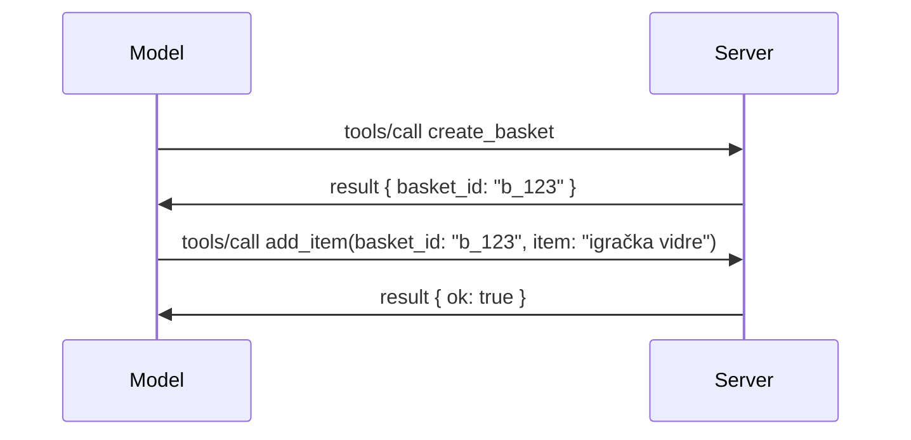

# Što se promijenilo u MCP-u: Specifikacija 2026-07-28

> **Status:** Završna. MCP specifikacija `2026-07-28` objavljena je 28. srpnja 2026.
> i predstavlja trenutnu reviziju protokola. Ova lekcija opisuje završnu
> specifikaciju. Neki primjeri iz kurikuluma ostaju eksplicitno verzionirani na
> `2025-11-25` jer njihovi SDK-ovi još nisu usvojili novi stanja-ne-posjedujući API;
> tretirajte te primjere kao smjernice za kompatibilnost sa starijim verzijama.

## Pregled

`2026-07-28` je najveća revizija MCP-a od njegovog lansiranja. Šest
Prijedloga za unaprjeđenje specifikacije (SEP) uklanja sesije na razini protokola i
čine MCP stateless slojem transporta, ekstenzije postaju prvo-razredni,
verzionirani mehanizam, a nekoliko funkcionalnosti obrađenih ranije u ovom kurikulumu
(Korijeni, Uzorak, Evidencija) su označene kao zastarjele prema novoj politici životnog ciklusa. Ova
lekcija sažima što se promijenilo, zašto je važno i što to znači za kod
pisan prema `2025-11-25`.

Izvor: [Kandidat za objavljivanje specifikacije MCP 2026-07-28](https://blog.modelcontextprotocol.io/posts/2026-07-28-release-candidate/) (Model Context Protocol Blog, David Soria Parra i Den Delimarsky).

## Ciljevi učenja

Na kraju ove lekcije moći ćete:

- Objasniti zašto MCP prelazi na bezstanje jezgru protokola i koji problem to rješava za horizontalno skalirane implementacije.
- Opisati kako su `initialize`/`initialized` handshake i `Mcp-Session-Id` zaglavlje zamijenjeni.
- Prepoznati nova `Mcp-Method` i `Mcp-Name` zaglavlja te metapodatke za keširanje `ttlMs`/`cacheScope`.
- Prepoznati Extensions okvir i dvije ekstenzije koje dolaze s ovom verzijom: MCP Aplikacije i Zadaci.
- Sažeti ojačanje autorizacije i ukidanje Dinamičke registracije klijenata.

- Prepoznati koje su osnovne funkcionalnosti (Korijeni, Uzorak, Evidencija) sada zastarjele i što to znači u praksi.
- Objasniti promjenu potpune JSON Sheme 2020-12 za alate `inputSchema`/`outputSchema`.

## Stateless protokol

Glavna promjena: MCP postaje bezstanje na sloju protokola.

### Prije (2025-11-25): sesije vas vežu za jednu instancu servera

Pozivanje alata preko Streamable HTTP započinje s handshakeom `initialize`. Server vraća zaglavlje `Mcp-Session-Id` koje svaki sljedeći zahtjev mora nositi:

```http
POST /mcp HTTP/1.1
Mcp-Session-Id: 1868a90c-3a3f-4f5b
Content-Type: application/json

{"jsonrpc":"2.0","id":2,"method":"tools/call",
 "params":{"name":"search","arguments":{"q":"otters"}}}
```

Budući da je sesija vezana za instancu servera koja ju je izdala, horizontalno skalirane implementacije zahtijevaju **sticky routing** na load balanceru i **dijeljenu pohranu sesije** preko instanci.

### Nakon (2026-07-28): svaki je zahtjev samostalan

```http
POST /mcp HTTP/1.1
MCP-Protocol-Version: 2026-07-28
Mcp-Method: tools/call
Mcp-Name: search
Content-Type: application/json

{"jsonrpc":"2.0","id":1,"method":"tools/call",
 "params":{"name":"search","arguments":{"q":"otters"},
           "_meta":{"io.modelcontextprotocol/protocolVersion":"2026-07-28",
                    "io.modelcontextprotocol/clientInfo":{"name":"my-app","version":"1.0"},
                    "io.modelcontextprotocol/clientCapabilities":{}}}}
```

Bilo koja instanca servera može obraditi ovaj zahtjev. Ključne promjene:

- **Handshake `initialize`/`initialized` je uklonjen** ([SEP-2575](https://github.com/modelcontextprotocol/modelcontextprotocol/pull/2575)). Verzija protokola, informacije o klijentu i njegove mogućnosti premješteni su u `_meta` u svakom zahtjevu. Nova metoda `server/discover` omogućuje klijentu da unaprijed zatraži mogućnosti servera kad mu trebaju.
- **Zaglavlje `Mcp-Session-Id` i sesija na razini protokola su uklonjeni** ([SEP-2567](https://github.com/modelcontextprotocol/modelcontextprotocol/pull/2567)). Sticky routing i dijeljena pohrana sesije više nisu potrebni na sloju protokola.

### Stateless protokol, stateful aplikacije

Uklanjanje sesije na razini protokola ne znači da vaš server ne može biti stateful. Preporučeni obrazac je isti onaj kojeg HTTP API-ji uvijek koriste: izdajte eksplicitnu oznaku (npr. `basket_id`, `browser_id`) iz jednog poziva alata i dopustite modelu da tu oznaku šalje kao običan argument kod kasnijih poziva.



Time je stanje vidljivo i razumljivo modelu umjesto da je skriveno u metapodacima transporta, i omogućuje bilo kojoj instanci servera da obradi bilo koji poziv.

### Zahtjevi servera klijentu, restrukturirani

Bezstanje protokol i dalje treba način da server uputi zahtjev klijentu usred poziva (na primjer, prompt za pojašnjenje):

- **Zahtjevi koje inicira server mogu se izdavati samo dok server aktivno obrađuje klijentov zahtjev** ([SEP-2260](https://github.com/modelcontextprotocol/modelcontextprotocol/pull/2260)) — prije je to bila preporuka, sada je obveza. Korisnik ne dobiva prompt iznenada.
- **Zahtjevi s višestrukim krugovima** ([SEP-2322](https://github.com/modelcontextprotocol/modelcontextprotocol/pull/2322)) zamjenjuju držanje SSE streama otvorenim. Umjesto toga, server vraća `InputRequiredResult`:

  ```json
  {
    "resultType": "input_required",
    "inputRequests": {
      "confirm": {
        "type": "elicitation",
        "message": "Delete 3 files?",
        "schema": { "type": "boolean" }
      }
    },
    "requestState": "eyJzdGVwIjoxLCJmaWxlcyI6WyJhIiwiYiIsImMiXX0="
  }
  ```

  Klijent skuplja odgovore i ponovo šalje originalni poziv s `inputResponses` i kopiranim `requestState`. Bilo koja instanca servera može nastaviti s ponovnim pokušajem jer je sve potrebno u poruci.

### Raspoloživo za rutiranje, keširanje, praćenje

Tri manje promjene čine bezstanični promet lakšim za upravljanje:

- **Zaglavlja `Mcp-Method` i `Mcp-Name` su obavezna na Streamable HTTP** ([SEP-2243](https://github.com/modelcontextprotocol/modelcontextprotocol/pull/2243)), tako da load balanceri, gatewayji i ograničivači stope mogu usmjeravati prema operaciji bez inspekcije JSON tijela. Serveri odbijaju zahtjeve gdje se zaglavlja i tijelo ne slažu.
- **`tools/list` i rezultati čitanja resursa nose `ttlMs` i `cacheScope`** ([SEP-2549](https://github.com/modelcontextprotocol/modelcontextprotocol/pull/2549)), modelirani po HTTP `Cache-Control`. Klijenti znaju koliko je rezultat liste svjež i je li sigurno dijeliti ga između korisnika, bez potrebe za dugotrajnim SSE streamom za praćenje promjena.
- **W3C Trace Context propagacija u `_meta` je dokumentirana** ([SEP-414](https://github.com/modelcontextprotocol/modelcontextprotocol/pull/414)), popravljajući nazive ključeva `traceparent`, `tracestate` i `baggage` tako da raspodijeljeni trag može pratiti poziv kroz klijent SDK, MCP server i downstream sustave u [OpenTelemetry](https://opentelemetry.io/)-kompatibilnom backendu.

## Ekstenzije postaju prvo-razredni

Ekstenzije su neformalno postojale u `2025-11-25`. [SEP-2133](https://github.com/modelcontextprotocol/modelcontextprotocol/pull/2133) ih formalizira:

- Ekstenzije se identificiraju ID-evima u formatu obrnute DNS adrese.
- Pregovaraju se kroz `extensions` mapu u klijent i server mogućnostima.
- Žive u vlastitim `ext-*` repozitorijima s delegiranim održavateljima i verzioniraju se neovisno o glavnoj specifikaciji.
- Novi Extensions track u SEP procesu daje im put od eksperimentalnog do službenog statusa.

Ova verzija donosi dvije službene ekstenzije.

### MCP Apps: korisnička sučelja renderirana na serveru

[MCP Apps](https://blog.modelcontextprotocol.io/posts/2026-01-26-mcp-apps/) ([SEP-1865](https://github.com/modelcontextprotocol/modelcontextprotocol/pull/1865)) omogućuju serverima da šalju interaktivna HTML sučelja koja domaćini renderiraju u sandboxiranom iframe-u. Alati unaprijed deklariraju svoje UI predloške kako bi domaćini mogli predmemorirati, keširati i provjeriti sigurnost prije izvođenja. Već ste pokrili osnove u [Lekcija 15: MCP Apps](../03-GettingStarted/15-mcp-apps/README.md) — pod okvirima Extensions, MCP Apps je sada formalno ekstenzija, a ne eksperimentalna glavna funkcionalnost.

### Zadaci prelaze u ekstenziju

Zadaci su isporučeni kao eksperimentalna glavna funkcija u `2025-11-25`. Produkcijsko korištenje pokazalo je potrebu za redizajnom pa je pravo mjesto za to ekstenzija: [Tasks ekstenzija](https://github.com/modelcontextprotocol/modelcontextprotocol/pull/2663) mijenja životni ciklus prema bezstanje modelu — server može odgovoriti na `tools/call` sa oznakom zadatka, a klijent nastavlja upravljati njime putem `tasks/get`, `tasks/update` i `tasks/cancel`. Kreiranje zadataka je usmjereno od strane servera: klijent oglašava ekstenziju, a server odlučuje kada poziv treba biti izvršen kao zadatak. `tasks/list` je u potpunosti uklonjen jer nije sigurno obuhvatiti ga bez sesija.

> **Bilješka o migraciji:** ako ste implementirali eksperimentalni `2025-11-25` Tasks API, trebat ćete migrirati na novi životni ciklus ekstenzije — nije unatrag kompatibilan.

## Ojačavanje autorizacije

Nekoliko SEP-ova ojačava
[specifikaciju autorizacije](https://modelcontextprotocol.io/specification/2026-07-28/basic/authorization)
kako bi se bolje uskladila sa stvarnim implementacijama OAuth 2.0 / OpenID Connect:

| SEP | Promjena |
|---|---|
| [SEP-2468](https://github.com/modelcontextprotocol/modelcontextprotocol/pull/2468) | Klijenti moraju validirati `iss` parametar u odgovorima autorizacije prema [RFC 9207](https://www.rfc-editor.org/rfc/rfc9207), smanjujući mogućnost napada miješanja (mix-up) česte u MCP-ovom obrascu jednog klijenta i mnogih servera. Buduća verzija zahtijevat će odbacivanje odgovora bez `iss`. |
| [SEP-837](https://github.com/modelcontextprotocol/modelcontextprotocol/pull/837) | Samo za kompatibilnost, klijenti Dinamičke registracije klijenata sada deklariraju `application_type` za OpenID Connect, izbjegavajući pogrešne `"web"` zadane vrijednosti za desktop i CLI klijente. |
| [SEP-2352](https://github.com/modelcontextprotocol/modelcontextprotocol/pull/2352) | Samo za kompatibilnost, registrirane vjerodajnice vezane su uz izdavača autorizacijskog servera `issuer`; klijenti se ponovo registriraju ako resurs migrira. |
| [SEP-2207](https://github.com/modelcontextprotocol/modelcontextprotocol/pull/2207) | Dokumentira kako zatražiti osvježavajuće tokene (refresh tokens) od OpenID Connect-type autorizacijskih servera. |
| [SEP-2350](https://github.com/modelcontextprotocol/modelcontextprotocol/pull/2350) | Pojašnjava akumulaciju opsega (scope) tijekom step-up autorizacije. |
| [SEP-2351](https://github.com/modelcontextprotocol/modelcontextprotocol/pull/2351) | Pojašnjava `.well-known` sufiks za otkrivanje. |

Ako gradite authorization server za MCP, pružite `iss` u
odgovorima autorizacije i slijedite konačnu specifikaciju autorizacije. Pogledajte
[02-Security](../02-Security/README.md) za smjernice implementacije.

Dinamička registracija klijenata ostaje dostupna radi kompatibilnosti, no također je
deklarirana zastarjelom u `2026-07-28`. Nove implementacije trebaju koristiti Client ID Metadata
dokumente.

## Zastarjele funkcionalnosti

Prema novoj
[politici životnog ciklusa funkcionalnosti](https://github.com/modelcontextprotocol/modelcontextprotocol/pull/2577),
Korijeni, Uzorak, Evidencija i Dinamička registracija klijenata su **Zastarjeli**:

| Funkcionalnost | Preporučena zamjena |
|---|---|
| Korijeni | Parametri alata, URI-jevi resursa ili konfiguracija servera |
| Uzorak | Izravna integracija s API-jima LLM provajdera |
| Evidencija | `stderr` za stdio transport; OpenTelemetry za strukturiranu vidljivost |
| Dinamička registracija klijenata | Client ID Metadata dokumenti |

Ove funkcionalnosti ostaju u `2026-07-28` radi kompatibilnosti. Moguće je da budu
uklonjene u prvoj reviziji specifikacije objavljenoj 28. srpnja 2027. ili nakon toga;
stvarno uklanjanje može uslijediti kasnije. Nove implementacije trebaju koristiti gore navedene zamjenske
obrasce.

## Potpuna JSON Shema 2020-12 za Alate

Unosne i izlazne sheme alata su podignute na punu [JSON Schemu 2020-12](https://json-schema.org/draft/2020-12) ([SEP-2106](https://github.com/modelcontextprotocol/modelcontextprotocol/pull/2106)):

- Unosne sheme zadržavaju korijenski uvjet `type: "object"` ali sada dozvoljavaju kompoziciju (`oneOf`, `anyOf`, `allOf`), uvjete i reference (`$ref`, `$defs`).
- Izlazne sheme su neograničene, a `structuredContent` sada može biti bilo koja JSON vrijednost, ne samo objekt.
- Implementacije ne smiju automatski dereferencirati vanjske `$ref` URI-je i trebaju ograničiti dubinu sheme i vrijeme valjacije (razmatranje zaštite od DoS napada ako validirate sheme na serveru).

Osim toga, kod pogreške za nedostajući resurs mijenja se s MCP-custom `-32002` na JSON-RPC standard `-32602` (Nevažeći parametri) ([SEP-2164](https://github.com/modelcontextprotocol/modelcontextprotocol/pull/2164)). Ako vaš klijent provjerava literalnu vrijednost `-32002`, trebat ćete ga ažurirati.

## Kako protokol dalje evoluira

Ova verzija sadrži prekidne promjene, za koje MCP održavatelji ne planiraju da budu norma u budućnosti. Tri SEPa za upravljanje nastoje to spriječiti:

- **Politika životnog ciklusa funkcionalnosti** daje svakom svojstvu put od Aktivnog → Zastarjelo → Uklonjeno s najmanje dvanaest mjeseci između zastarjelosti i najranije moguće uklanjanja.
- **Okvir ekstenzija** dopušta novim mogućnostima da budu objavljene kao opcionalne ekstenzije i stabiliziraju se tamo prije nego (ako uopće) pređu u glavnu specifikaciju.
- SEP za Standardnu stazu više ne može dobiti status Završeno dok se ne uključi odgovarajući scenarij u [skup za usklađenost](https://github.com/modelcontextprotocol/conformance) ([SEP-2484](https://github.com/modelcontextprotocol/modelcontextprotocol/pull/2484)) — isti skup prema kojem [sustav razreda SDK-a](https://github.com/modelcontextprotocol/modelcontextprotocol/pull/1777) ocjenjuje službene SDK-ove.

## Vremenski okvir objave i validacija

- Kandidat za objavu zaključan je 21. svibnja 2026.
- Završna specifikacija objavljena je 28. srpnja 2026.

- Podrška SDK-a može zaostajati za specifikacijom. Provjerite
  [dokumentaciju SDK-a](https://modelcontextprotocol.io/docs/sdk) i bilješke o izdavanju SDK-a
  prije migracije primjera.
- Pratite konačne promjene u
  [specificiranju od 2026-07-28](https://modelcontextprotocol.io/specification/2026-07-28/)
  i njegovom
  [dnevniku promjena](https://modelcontextprotocol.io/specification/2026-07-28/changelog).

## Što to znači za ovaj kurikulum

Kurikulum prelazi s primjera `2025-11-25` na trenutnu
specifikaciju `2026-07-28`. Konkretno:

- **Sesije i `initialize` ručna razmjena** u primjerima koji eksplicitno ciljaju
  `2025-11-25` su zastarjelo ponašanje. Protokol `2026-07-28` ih zamjenjuje
  modelom zahtjeva bez stanja prikazanim gore.
- **Uzorak i korijeni** ostaju dostupni radi kompatibilnosti, ali su zastarjeli.
  Novi dizajni trebaju koristiti zamjenske obrasce navedene gore.
- **Eksperimentalna značajka zadataka**, ako ste je koristili, treba se migrirati na novi životni ciklus proširenja zadataka.
- **MCP aplikacije** ([Lekcija 15](../03-GettingStarted/15-mcp-apps/README.md)) u praksi nisu pogođene; samo se premještaju u formalni okvir Proširenja.

## Dodatni resursi

- [MCP specifikacija 2026-07-28](https://modelcontextprotocol.io/specification/2026-07-28/)
- [Dnevnik promjena 2026-07-28](https://modelcontextprotocol.io/specification/2026-07-28/changelog)
- [Kandidat za izdanje MCP specifikacije 2026-07-28 (povijesni blog post)](https://blog.modelcontextprotocol.io/posts/2026-07-28-release-candidate/)
- [Budućnost MCP transporta](https://blog.modelcontextprotocol.io/posts/2025-12-19-mcp-transport-future/)
- [SEP smjernice](https://modelcontextprotocol.io/community/sep-guidelines)
- [MCP SDK sustav razina](https://modelcontextprotocol.io/docs/sdk)

## Sljedeći koraci

Vratite se na [Osnovne pojmove](./README.md) ili nastavite prema
[Sigurnosti](../02-Security/README.md) da biste primijenili trenutne smjernice `2026-07-28`.

---

<!-- CO-OP TRANSLATOR DISCLAIMER START -->
**Napomena**:
Ovaj dokument je preveden korištenjem AI prevoditeljskog servisa [Co-op Translator](https://github.com/Azure/co-op-translator). Iako težimo točnosti, imajte na umu da automatski prijevodi mogu sadržavati greške ili netočnosti. Izvorni dokument na izvornom jeziku treba smatrati autoritativnim izvorom. Za važne informacije preporuča se profesionalni ljudski prijevod. Nismo odgovorni za bilo kakva nesporazumevanja ili pogrešne interpretacije koje proizlaze iz korištenja ovog prijevoda.
<!-- CO-OP TRANSLATOR DISCLAIMER END -->