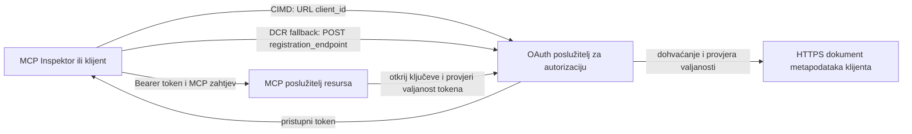

# Primjer autorizacije CIMD i DCR

Ovaj TypeScript primjer uspoređuje dva načina na koja OAuth klijent može dobiti identitet
prije pristupa zaštićenom MCP poslužitelju:

- **Dokumenti metapodataka ID klijenta (CIMD)** koriste stabilan HTTPS URL kao
  `client_id`. Ovo je preferirani mehanizam za klijente i poslužitelje autorizacije
  koji nemaju prethodni odnos.
- **Dinamička registracija klijenta (DCR)** traži od poslužitelja autorizacije da generira
  neprovidni ID klijenta u runtime-u. MCP `2026-07-28` zadržava DCR samo radi
  kompatibilnosti sa starijim verzijama.

Primjer koristi stabilni MCP TypeScript SDK v2 i stateless
MCP `2026-07-28` model zahtjeva. Radi s vanjskim OAuth 2.1/OpenID
Connect poslužiteljem autorizacije poput Auth0. MCP poslužitelj je resurs
poslužitelj: on validira pristupne tokene, ali ne autentificira korisnike niti izdaje
tokene.

## Ciljevi učenja

Završetkom ovog primjera moći ćete:

- Objasniti zašto je CIMD preferiran nad DCR za nove MCP klijente.
- Objaviti valjani CIMD dokument za javnog nativnog klijenta.
- Konfigurirati MCP resursni poslužitelj za OAuth otkrivanje i JWT validaciju.
- Vježbati CIMD i DCR sa istim MCP poslužiteljem i poslužiteljem autorizacije.
- Nametnuti OAuth dosege unutar MCP alata.
- Identificirati odgovornosti koje pripadaju klijentu, resursnom poslužitelju i
  poslužitelju autorizacije.

## Arhitektura



Poslužitelj autorizacije bira i validira mehanizam registracije.
MCP poslužitelj vidi samo rezultat provjerene tvrdnje o `client_id`. HTTPS URL
s putanjom identificira CIMD. Neprovidni ID nije dovoljan za dokazivanje DCR jer
prethodno registrirani klijent također može koristiti neprovidni ID; opcijski
parametar `DCR_CLIENT_ID_PREFIX` daje demo naznaku specifičnu za pružatelja.

## Prioritet registracije

MCP klijenti koji podržavaju svaki mehanizam trebaju koristiti ovaj redoslijed:

1. Koristiti unaprijed registrirane podatke o klijentu kad su dostupni.
2. Koristiti CIMD kad poslužitelj autorizacije oglašava
   `client_id_metadata_document_supported: true`.
3. Koristiti DCR samo kao rezervni plan kad poslužitelj oglašava
   `registration_endpoint`.
4. Pitati korisnika za unaprijed registrirane podatke kad nijedno od navedenog nije
   dostupno.

## Raspored projekta

```text
src/
  config.ts          Environment validation
  dcr.ts             DCR compatibility request
  mcp.ts             MCP tools and scope checks
  oauth.ts           Authorization metadata and JWT verification
  register-dcr.ts    DCR command-line helper
  registration.ts    CIMD document and mechanism classification
  server.ts          Express, OAuth discovery, and MCP endpoint
test/
  dcr.test.ts
  oauth.test.ts
  registration.test.ts
  server.test.ts
```

## Preduvjeti

- Node.js 20.6 ili noviji. Skripte koriste `--env-file` i `--import`.
- OAuth 2.1/OpenID Connect poslužitelj autorizacije koji podržava:
  - Authorization code flow s S256 PKCE.
  - OAuth Protected Resource Metadata i Resource Indicators.
  - JWT pristupne tokene i JWKS endpoint.
  - CIMD, plus DCR ako želite usporediti naslijeđeni rezervni plan.
- MCP Inspector ili neki drugi MCP `2026-07-28` klijent.
- Javni HTTPS URL za CIMD dokument. Razvojni tunel je pogodan
  za lab; koristi stabilnu domenu u produkciji.

## Instalacija i testiranje

```bash
npm install
npm run build
npm test
```

Dvanaest testova koriste lokalne ključeve i lažne HTTP endpoint-e. Nije potreban
račun na poslužitelju autorizacije. Testiraju:

- Oblik i ograničenja URL-a CIMD dokumenta.
- Ispravnu klasifikaciju URL i neprovidnih ID-jeva klijenata.
- Rukovanje DCR zahtjevima i odgovorima.
- Odbacivanje nesigurnih DCR endpoint-a koji nisu loopback.
- Validaciju JWT potpisa, izdavatelja, publike, isteka, ID klijenta i dosega.
- MCP `2026-07-28` poziv u procesu za `registration-info`.

## Konfigurirajte poslužitelj autorizacije

Točni nazivi kontrola variraju ovisno o pružatelju. Konfigurirajte ove mogućnosti:

1. Kreirajte API ili resursni poslužitelj čiji identifikator točno odgovara vašem MCP
   URL-u, uključujući `/mcp`, npr. `http://127.0.0.1:3001/mcp`.
2. Koristite RS256 pristupne tokene i uključite tvrdnju `client_id` ili `azp`.
3. Dodajte dopuštenje ili doseg `tool:greet`.
4. Omogućite authorization code flow s S256 PKCE za javne nativne klijente.
5. Omogućite dokumente metapodataka ID klijenta.
6. Za samu usporedbu, omogućite Dinamičku registraciju klijenta.
7. Osigurajte da metapodaci poslužitelja autorizacije oglašavaju:
   - `issuer`
   - `authorization_endpoint`
   - `token_endpoint`
   - `jwks_uri`
   - `client_id_metadata_document_supported: true`
   - `registration_endpoint` kada je DCR omogućen

### Primjer Auth0

Za Auth0, omogućite registraciju CIMD dokumenta, OIDC dinamičku
registraciju aplikacije i kompatibilnost s resursnim parametrima. Kreirajte API
čiji je identifikator točni MCP URL i dodajte dopuštenje `tool:greet`.
Dopustite test korisniku i klijentima trećih strana da zahtijevaju to dopuštenje.

Kontrolne ploče i dostupnost funkcija kod pružatelja se s vremenom mijenjaju. Provjerite
dokumentaciju pružatelja prije korištenja ovih postavki izvan ovog lab-a.

## Konfigurirajte primjer

Kreirajte `.env` iz primjera:

```powershell
Copy-Item .env.example .env
```

Na bash-kompatibilnim ljuskama:

```bash
cp .env.example .env
```

Postavite ove vrijednosti:

```dotenv
MCP_SERVER_URL=http://127.0.0.1:3001/mcp
AUTHORIZATION_SERVER_ISSUER=https://your-tenant.example.com/
AUTHORIZATION_SERVER_METADATA_URL=https://your-tenant.example.com/.well-known/openid-configuration
CLIENT_METADATA_URL=https://your-public-host.example.com/client-metadata.json
OAUTH_REDIRECT_URIS=http://127.0.0.1:6274/oauth/callback
DCR_CLIENT_ID_PREFIX=tpc_
```

Važni detalji:

- `AUTHORIZATION_SERVER_ISSUER` mora točno odgovarati `issuer` u otkrivenim
  metapodacima poslužitelja autorizacije, uključujući bilo koju završnu kosu crtu.
- `MCP_SERVER_URL` mora odgovarati publici pristupnog tokena.
- `CLIENT_METADATA_URL` mora koristiti HTTPS, sadržavati neprvotni put i biti
  javni URL koji servisira rutu metapodataka. Upiti i fragmenti se odbacuju
  kako bi ruta i `client_id` ostali identični.
- `OAUTH_REDIRECT_URIS` je lista dopuštenih URI odvojena zarezima. Zadano je callback za
  loopback MCP Inspectora.
- `DCR_CLIENT_ID_PREFIX` je opcionalan i specifičan za pružatelja. Ostavi prazno ako
  tvoj pružatelj nema pouzdan DCR prefiks.

## Objavi CIMD dokument

Pokreni tunel koji prosljeđuje svoj javni HTTPS origin na `127.0.0.1:3001`.
Postavi `CLIENT_METADATA_URL` na taj origin plus `/client-metadata.json`, zatim pokreni:

```bash
npm run build
npm start
```

Provjeri oba dokumenta za otkrivanje:

```bash
curl http://127.0.0.1:3001/health
curl http://127.0.0.1:3001/client-metadata.json
curl http://127.0.0.1:3001/.well-known/oauth-protected-resource/mcp
```

`client_id` vraćen javnim HTTPS URL-om metapodataka mora biti byte-po-byte
identičan tom URL-u. Poslužitelj autorizacije mora validirati dokument i njegov
redirect URI prije nego što izda token.

> [!NOTE]
> Primjer drži dokument klijenta i MCP resursni poslužitelj u jednom procesu
> kako bi lab bio mali. U produkciji, MCP klijent samostalno drži i hosta
> svoj CIMD dokument neovisno o resursnom poslužitelju.

## Usporedba CIMD i DCR

Pokreni MCP Inspectora:

```bash
npx @modelcontextprotocol/inspector
```

Koristi Streamable HTTP i poveži se na `http://127.0.0.1:3001/mcp`.

### CIMD (Preporučeno)

1. Unesi javni `CLIENT_METADATA_URL` kao OAuth Client ID.
2. Zatraži `tool:greet` plus bilo koje identitetske dosege koje zahtijeva tvoj pružatelj.
3. Dovrši prijavu i pristanak.
4. Pozovi `registration-info`. Prikazuje `mechanism: "cimd"`.
5. Pozovi `greet` za provjeru nametanja dosega.

### DCR (Rezervni plan kompatibilnosti)

1. Očisti spremljeno OAuth stanje Inspectora.
2. Ostavi OAuth Client ID praznim da Inspector može koristiti oglašeni
   `registration_endpoint`.
3. Dovrši prijavu i pristanak.
4. Pozovi `registration-info`.
5. Ako `DCR_CLIENT_ID_PREFIX` odgovara generiranim ID-jima pružatelja, alat
   prijavljuje `mechanism: "dcr"`; inače točno prijavljuje
   `opaque-client-id`.

Također možeš demonstrirati zahtjev za registraciju izravno:

```bash
npm run build
npm run register:dcr
```

Pomoćni alat ispisuje vraćeni ID klijenta, ali nikada ne ispisuje tajnu klijenta.
Postupaj sa svim vraćenim tajnama kao osjetljivim i pohrani ih u pravi skladište tajni.

## Alati

| Alat | Potreban doseg | Svrha |
| --- | --- | --- |
| `registration-info` | Provjereni klijent | Prijavi tip ID klijenta |
| `greet` | `tool:greet` | Demonstriraj autorizaciju po alatu |

## Sigurnosne napomene

- Validiraj JWT potpise preko JWKS endpoint-a poslužitelja autorizacije.
- Zahtijevaj točne podudarnosti izdavatelja i publike.
- Zahtijevaj tvrdnje o isteku i ID klijenta.
- Nikad ne prihvati token izdavan za drugi resurs.
- Nikad ne prosljeđuj MCP token niže API-je.
- Drži DCR akreditive vezanima za izdavatelja koji ih je stvorio.
- Validiraj redirect URI za CIMD s točnim podudaranjem.
- Primijeni SSRF kontrole kad poslužitelj autorizacije dohvaća CIMD URL-ove.
- Koristi HTTPS za autorizaciju i metapodatke endpoint-e izvan loopback
  razvoja.
- Ne izvodi zaključke o DCR iz neprovidnog ID klijenta osim ako pružatelj
  ne dokumentira pouzdanu konvenciju identifikatora.

## Reference

- [MCP specifikacija autorizacije](https://modelcontextprotocol.io/specification/2026-07-28/basic/authorization)
- [MCP registracija klijenata](https://modelcontextprotocol.io/specification/2026-07-28/basic/authorization/client-registration)
- [MCP najbolje sigurnosne prakse](https://modelcontextprotocol.io/specification/2026-07-28/basic/security_best_practices)
- [MCP TypeScript SDK v2 vodič za autorizaciju](https://ts.sdk.modelcontextprotocol.io/v2/serving/authorization)
- [OAuth Dinamička registracija klijenta (RFC 7591)](https://datatracker.ietf.org/doc/html/rfc7591)
- [OAuth dokument o metapodacima ID klijenta draft](https://datatracker.ietf.org/doc/html/draft-ietf-oauth-client-id-metadata-document-00)

## Zahvala

Metoda učenja usporedno inspirirana je s
[Sambego/auth0-xmcp-cimd](https://github.com/Sambego/auth0-xmcp-cimd). Ovaj
primjer je originalna, neutralna provedba pružatelja izgrađena s službenim
MCP TypeScript SDK v2 za ovaj kurikulum.

---

<!-- CO-OP TRANSLATOR DISCLAIMER START -->
**Napomena**:
Ovaj dokument je preveden korištenjem AI prevoditeljskog servisa [Co-op Translator](https://github.com/Azure/co-op-translator). Iako težimo točnosti, imajte na umu da automatski prijevodi mogu sadržavati greške ili netočnosti. Izvorni dokument na izvornom jeziku treba smatrati autoritativnim izvorom. Za važne informacije preporuča se profesionalni ljudski prijevod. Nismo odgovorni za bilo kakva nesporazumevanja ili pogrešne interpretacije koje proizlaze iz korištenja ovog prijevoda.
<!-- CO-OP TRANSLATOR DISCLAIMER END -->