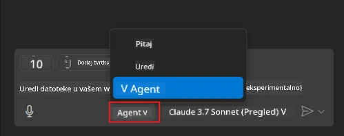
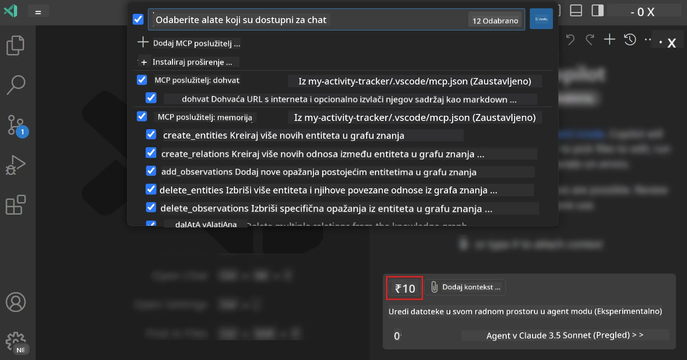
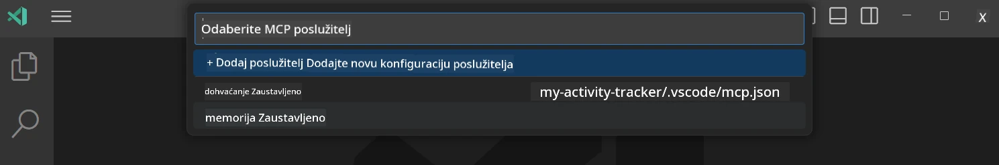
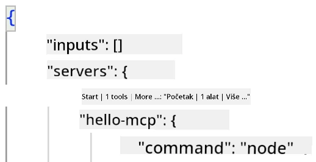
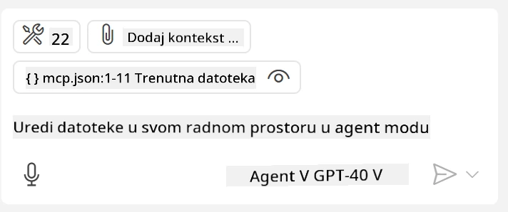
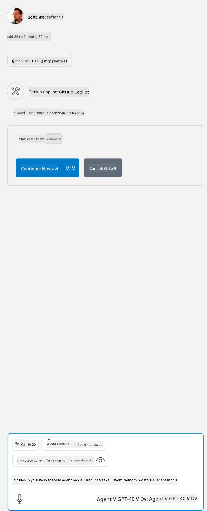

# Korištenje servera iz GitHub Copilot Agent moda

Visual Studio Code i GitHub Copilot mogu djelovati kao klijenti i koristiti MCP Server. Možda se pitate zašto bismo to željeli? Pa, to znači da se sve funkcionalnosti koje MCP Server ima sada mogu koristiti unutar vašeg IDE-a. Zamislite da dodate, na primjer, GitHubov MCP server, što bi omogućilo upravljanje GitHubom putem upita umjesto tipkanja specifičnih naredbi u terminalu. Ili zamislite bilo što što bi općenito moglo poboljšati vaše iskustvo programiranja, a sve to kontrolirano prirodnim jezikom. Sad već vidite prednosti, zar ne?

## Pregled

Ova lekcija objašnjava kako koristiti Visual Studio Code i GitHub Copilot Agent mod kao klijenta za vaš MCP Server.

## Ciljevi učenja

Na kraju ove lekcije, moći ćete:

- Koristiti MCP Server putem Visual Studio Code-a.
- Pokretati funkcije poput alata preko GitHub Copilot.
- Konfigurirati Visual Studio Code za pronalazak i upravljanje vašim MCP Serverom.

## Korištenje

Možete upravljati vašim MCP serverom na dva različita načina:

- Kroz korisničko sučelje, vidjet ćete kako se to radi kasnije u ovom poglavlju.
- Kroz terminal, moguće je upravljati stvarima iz terminala korištenjem `code` izvršnog programa:

  Za dodavanje MCP servera u vaš korisnički profil, koristite naredbu --add-mcp i pružite JSON konfiguraciju servera u obliku {\"name\":\"ime-servera\",\"command\":...}.

  ```
  code --add-mcp "{\"name\":\"my-server\",\"command\": \"uvx\",\"args\": [\"mcp-server-fetch\"]}"
  ```

### Snimke zaslona





Razgovarajmo više o korištenju vizualnog sučelja u sljedećim odjeljcima.

## Pristup

Evo kako trebamo pristupiti ovome na visokoj razini:

- Konfigurirati datoteku za pronalazak našeg MCP Servera.
- Pokrenuti/Povezati se na navedeni server da bi se izlistale njegove funkcionalnosti.
- Koristiti navedene funkcionalnosti kroz GitHub Copilot Chat sučelje.

Odlično, sada kada razumijemo tijek, pokušajmo koristiti MCP Server kroz Visual Studio Code kroz vježbu.

## Vježba: Korištenje servera

U ovoj vježbi, konfigurirat ćemo Visual Studio Code da pronađe vaš MCP server kako bi se mogao koristiti iz sučelja GitHub Copilot Chat.

### -0- Priprema, omogućiti otkrivanje MCP Servera

Možda ćete trebati omogućiti otkrivanje MCP Servera.

1. Idite na `File -> Preferences -> Settings` u Visual Studio Codeu.

1. Potražite "MCP" i omogućite `chat.mcp.discovery.enabled` u datoteci settings.json.

### -1- Kreirajte konfiguracijsku datoteku

Počnite stvaranjem konfiguracijske datoteke u korijenu vašeg projekta, trebat će vam datoteka nazvana MCP.json koju ćete postaviti u mapu .vscode. Trebala bi izgledati ovako:

```text
.vscode
|-- mcp.json
```

Zatim, pogledajmo kako možemo dodati unos servera.

### -2- Konfigurirajte server

Dodajte sljedeći sadržaj u *mcp.json*:

```json
{
    "inputs": [],
    "servers": {
       "hello-mcp": {
           "command": "node",
           "args": [
               "build/index.js"
           ]
       }
    }
}
```

Gore je jednostavan primjer kako pokrenuti server napisan u Node.js, za druge okoline navedite ispravnu naredbu za pokretanje servera koristeći `command` i `args`.

### -3- Pokrenite server

Sada kada ste dodali unos, pokrenimo server:

1. Pronađite svoj unos u *mcp.json* i provjerite nalazi li se ikona "play":

    

1. Kliknite ikonu "play", trebali biste vidjeti ikonu alata u GitHub Copilot Chatu kako se povećava broj dostupnih alata. Ako kliknete na tu ikonu alata, vidjet ćete listu registrovanih alata. Možete označiti/odznačiti svaki alat ovisno želite li da ih GitHub Copilot koristi kao kontekst:

  

1. Za pokretanje alata, unesite upit za koji znate da će odgovarati opisu jednog od vaših alata, na primjer upit poput "add 22 to 1":

  

  Trebali biste vidjeti odgovor koji kaže 23.

## Zadatak

Pokušajte dodati unos servera u svoju *mcp.json* datoteku i provjerite možete li pokrenuti/zaustaviti server. Također se pobrinite da možete komunicirati s alatima na vašem serveru putem sučelja GitHub Copilot Chata.

## Rješenje

[Rješenje](./solution/README.md)

## Ključni zaključci

Zaključci iz ovog poglavlja su:

- Visual Studio Code je izvrstan klijent koji vam omogućuje korištenje više MCP Servera i njihovih alata.
- Sučelje GitHub Copilot Chata je način na koji komunicirate sa serverima.
- Možete tražiti od korisnika unos poput API ključeva koji se mogu proslijediti MCP Serveru prilikom konfiguracije unosa servera u *mcp.json* datoteci.

## Primjeri

- [Java kalkulator](../samples/java/calculator/README.md)
- [.Net kalkulator](../../../../03-GettingStarted/samples/csharp)
- [JavaScript kalkulator](../samples/javascript/README.md)
- [TypeScript kalkulator](../samples/typescript/README.md)
- [Python kalkulator](../../../../03-GettingStarted/samples/python)

## Dodatni resursi

- [Visual Studio dokumentacija](https://code.visualstudio.com/docs/copilot/chat/mcp-servers)

## Što slijedi

- Sljedeće: [Kreiranje stdio Servera](../05-stdio-server/README.md)

---

<!-- CO-OP TRANSLATOR DISCLAIMER START -->
**Napomena**:
Ovaj dokument je preveden korištenjem AI prevoditeljskog servisa [Co-op Translator](https://github.com/Azure/co-op-translator). Iako težimo točnosti, imajte na umu da automatski prijevodi mogu sadržavati greške ili netočnosti. Izvorni dokument na izvornom jeziku treba smatrati autoritativnim izvorom. Za važne informacije preporuča se profesionalni ljudski prijevod. Nismo odgovorni za bilo kakva nesporazumevanja ili pogrešne interpretacije koje proizlaze iz korištenja ovog prijevoda.
<!-- CO-OP TRANSLATOR DISCLAIMER END -->