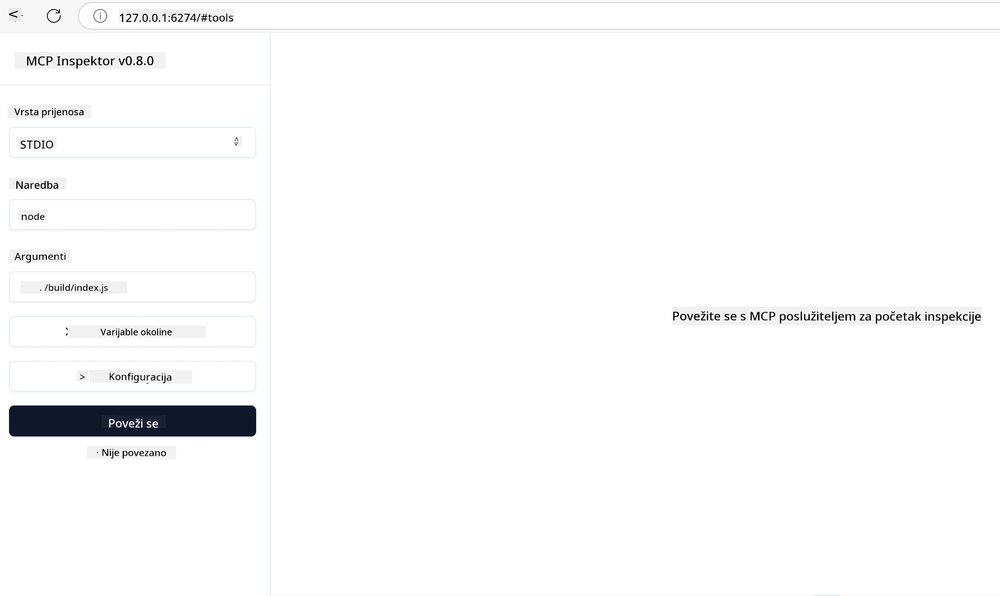

## Testiranje i ispravljanje pogrešaka

Prije nego što započnete s testiranjem vašeg MCP servera, važno je razumjeti dostupne alate i najbolje prakse za ispravljanje pogrešaka. Učinkovito testiranje osigurava da vaš server radi kako se očekuje i pomaže vam brzo identificirati i riješiti probleme. Sljedeći odlomak prikazuje preporučene pristupe za validaciju vaše MCP implementacije.

## Pregled

Ova lekcija pokriva kako odabrati ispravan pristup testiranju i najefikasniji alat za testiranje.

## Ciljevi učenja

Do kraja ove lekcije moći ćete:

- Opišite različite pristupe testiranju.
- Koristite različite alate za učinkovito testiranje vašeg koda.


## Testiranje MCP servera

MCP pruža alate koji vam pomažu testirati i otkloniti pogreške na vašim serverima:

- **MCP Inspector**: Alat naredbene linije koji se može pokrenuti kao CLI alat i kao vizualni alat.
- **Ručni testiranje**: Možete koristiti alat poput curl za pokretanje web zahtjeva, ali bilo koji alat koji može izvršavati HTTP će biti dovoljan.
- **Jedinično testiranje**: Moguće je koristiti vaš omiljeni testni okvir za testiranje funkcija i servera i klijenta.

### Korištenje MCP Inspectora

Opisali smo korištenje ovog alata u prethodnim lekcijama, ali razgovarajmo malo o njemu na visokoj razini. To je alat izgrađen u Node.js i možete ga koristiti pozivom `npx` izvršnog programa koji će privremeno preuzeti i instalirati sam alat, a zatim se ukloniti nakon što izvrši vaš zahtjev.

[MCP Inspector](https://github.com/modelcontextprotocol/inspector) vam pomaže:

- **Otkrivanje sposobnosti servera**: Automatski prepoznajte dostupne resurse, alate i upite
- **Testiranje izvršenja alata**: Isprobajte različite parametre i vidite odgovore u stvarnom vremenu
- **Pregled metapodataka servera**: Istražite informacije o serveru, sheme i konfiguracije

Tipično pokretanje alata izgleda ovako:

```bash
npx @modelcontextprotocol/inspector node build/index.js
```

Gornja naredba pokreće MCP i njegov vizualni sučelje te starta lokalno web sučelje u vašem pregledniku. Možete očekivati nadzornu ploču koja prikazuje vaše registrirane MCP servere, njihove dostupne alate, resurse i upite. Sučelje omogućava interaktivno testiranje izvršenja alata, pregled metapodataka servera i prikaz odgovora u stvarnom vremenu, što olakšava validaciju i otklanjanje pogrešaka u vašim MCP implementacijama servera.

Evo kako to može izgledati: 

Također možete pokrenuti ovaj alat u CLI načinu rada, za što dodajete atribut `--cli`. Evo primjera pokretanja alata u "CLI" načinu rada koji navodi sve alate na serveru:

```sh
npx @modelcontextprotocol/inspector --cli node build/index.js --method tools/list
```

### Ručno testiranje

Osim pokretanja alata inspector za testiranje sposobnosti servera, sličan pristup je pokretanje klijenta koji može koristiti HTTP, na primjer curl.

S curlom možete izravno testirati MCP servere koristeći HTTP zahtjeve:

```bash
# Primjer: Metapodaci testnog poslužitelja
curl http://localhost:3000/v1/metadata

# Primjer: Pokreni alat
curl -X POST http://localhost:3000/v1/tools/execute \
  -H "Content-Type: application/json" \
  -d '{"name": "calculator", "parameters": {"expression": "2+2"}}'
```

Kao što vidite iz gore prikazane uporabe curl-a, koristite POST zahtjev za pozivanje alata koristeći payload koji sadrži naziv alata i njegove parametre. Koristite pristup koji vam najviše odgovara. CLI alati obično su brži za korištenje i mogu se skriptirati što može biti korisno u CI/CD okruženju.

### Jedinično testiranje

Kreirajte jedinične testove za vaše alate i resurse kako biste osigurali da rade kako se očekuje. Evo primjera testnog koda.

```python
import pytest

from mcp.server.fastmcp import FastMCP
from mcp.shared.memory import (
    create_connected_server_and_client_session as create_session,
)

# Označi cijeli modul za asinhrone testove
pytestmark = pytest.mark.anyio


async def test_list_tools_cursor_parameter():
    """Test that the cursor parameter is accepted for list_tools.

    Note: FastMCP doesn't currently implement pagination, so this test
    only verifies that the cursor parameter is accepted by the client.
    """

 server = FastMCP("test")

    # Kreiraj nekoliko testnih alata
    @server.tool(name="test_tool_1")
    async def test_tool_1() -> str:
        """First test tool"""
        return "Result 1"

    @server.tool(name="test_tool_2")
    async def test_tool_2() -> str:
        """Second test tool"""
        return "Result 2"

    async with create_session(server._mcp_server) as client_session:
        # Testiraj bez parametra kursora (izostavljeno)
        result1 = await client_session.list_tools()
        assert len(result1.tools) == 2

        # Testiraj s kursorm=None
        result2 = await client_session.list_tools(cursor=None)
        assert len(result2.tools) == 2

        # Testiraj s kursorm kao string
        result3 = await client_session.list_tools(cursor="some_cursor_value")
        assert len(result3.tools) == 2

        # Testiraj s praznim string kursorom
        result4 = await client_session.list_tools(cursor="")
        assert len(result4.tools) == 2
    
```

Navedeni kod radi sljedeće:

- Koristi pytest okvir koji omogućuje kreiranje testova kao funkcija i korištenje assert naredbi.
- Kreira MCP Server s dva različita alata.
- Koristi `assert` naredbu da provjeri da su određeni uvjeti ispunjeni.

Pogledajte [cijelu datoteku ovdje](https://github.com/modelcontextprotocol/python-sdk/blob/main/tests/client/test_list_methods_cursor.py)

Na temelju gore navedene datoteke, možete testirati vlastiti server kako biste bili sigurni da su sposobnosti kreirane kako treba.

Svi glavni SDK-ovi imaju slične sekcije za testiranje pa ih možete prilagoditi odabranom runtime-u.

## Primjeri 

- [Java kalkulator](../samples/java/calculator/README.md)
- [.Net kalkulator](../../../../03-GettingStarted/samples/csharp)
- [JavaScript kalkulator](../samples/javascript/README.md)
- [TypeScript kalkulator](../samples/typescript/README.md)
- [Python kalkulator](../../../../03-GettingStarted/samples/python) 

## Dodatni resursi

- [Python SDK](https://github.com/modelcontextprotocol/python-sdk)

## Što slijedi

- Sljedeće: [Deploy](../09-deployment/README.md)

---

<!-- CO-OP TRANSLATOR DISCLAIMER START -->
**Napomena**:
Ovaj dokument je preveden korištenjem AI prevoditeljskog servisa [Co-op Translator](https://github.com/Azure/co-op-translator). Iako težimo točnosti, imajte na umu da automatski prijevodi mogu sadržavati greške ili netočnosti. Izvorni dokument na izvornom jeziku treba smatrati autoritativnim izvorom. Za važne informacije preporuča se profesionalni ljudski prijevod. Nismo odgovorni za bilo kakva nesporazumevanja ili pogrešne interpretacije koje proizlaze iz korištenja ovog prijevoda.
<!-- CO-OP TRANSLATOR DISCLAIMER END -->